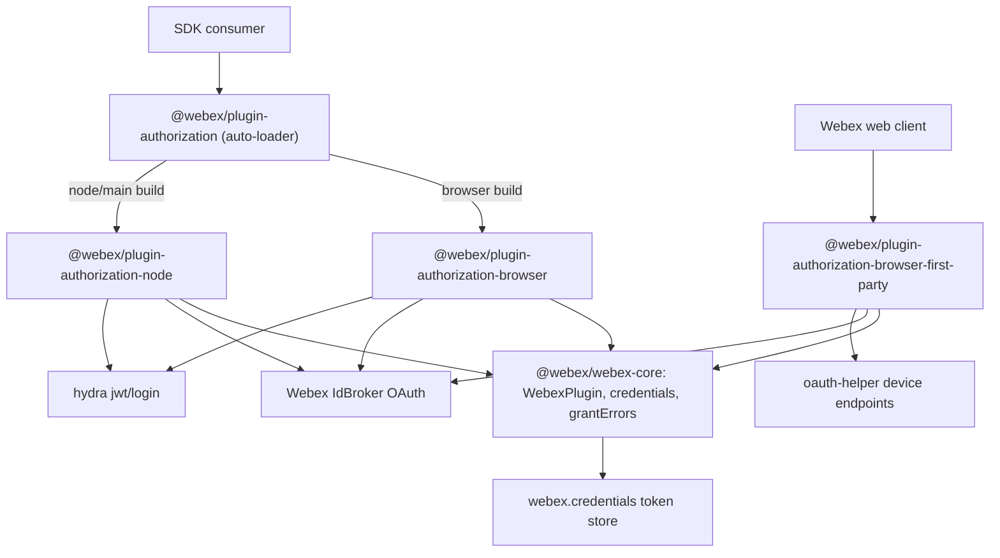
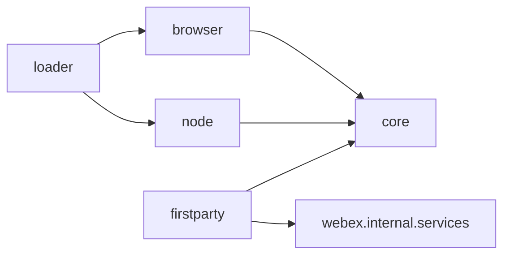

<!-- sdd-generated-metadata
doc_kind: standing-doc
generated_from: architecture@0.2.1
generated_by: claude-cli
approved_by: pending
updated_at: 2026-07-31T00:00:00Z
validation_status: not-run
-->
# ARCHITECTURE — Webex JS SDK (authorization plugin family)

> Start here → root [`AGENTS.md`](../AGENTS.md) (agent entry) · router [`SPEC_INDEX.md`](SPEC_INDEX.md). This is the system architecture; per-module detail lives in each manifest-routed module spec, source-local as `<module-path>/ai-docs/<module-name>-spec.md`.
> Context-efficiency: link to canonical docs — don't duplicate them; this loads on demand, not upfront.

## Design Overview

The authorization plugin family layers OAuth2 onto the Webex JS SDK by registering a plugin under the `authorization` namespace on the shared `WebexPlugin` base from `@webex/webex-core`. The design deliberately splits authentication by execution environment so each runtime ships only what is safe there: browsers never handle a client secret in the implicit/public path, Node handles the confidential Authorization Code exchange with a client secret server-side, and the first-party web client gets a hardened PKCE + device-code implementation not meant for third parties.

`@webex/plugin-authorization` is a thin auto-loader: its main entry re-exports `@webex/plugin-authorization-node`, while its browser build (`src/index.browser.js`) re-exports `@webex/plugin-authorization-browser`. This lets consumers use one dependency and get the correct implementation per bundle target. All implementations expose a compatible surface (`webex.authorization.*`) but the concrete methods differ by environment.

Tokens are never owned here. Each flow ends by calling `webex.credentials.set({supertoken})`; refresh, expiry detection, and persistence belong to the credentials plugin and storage adapters. These packages own only the *acquisition, refresh-trigger, and logout* logic and the security controls (CSRF, PKCE, URL cleanup) around the redirect.

## Component Inventory & Responsibilities

| Component | Responsibility (one line) | Docs |
|---|---|---|
| `packages/@webex/plugin-authorization/` | Environment auto-loader; re-exports browser or node implementation | `packages/@webex/plugin-authorization/ai-docs/plugin-authorization-spec.md` |
| `packages/@webex/plugin-authorization-browser/` | Public browser OAuth2 (Implicit + Authorization Code) + JWT guest login | `packages/@webex/plugin-authorization-browser/ai-docs/plugin-authorization-browser-spec.md` |
| `packages/@webex/plugin-authorization-node/` | Server-side Authorization Code exchange + JWT | `packages/@webex/plugin-authorization-node/ai-docs/plugin-authorization-node-spec.md` |
| `packages/@webex/plugin-authorization-browser-first-party/` | Hardened PKCE + QR device login for the Webex web client | `packages/@webex/plugin-authorization-browser-first-party/ai-docs/plugin-authorization-browser-first-party-spec.md` |

## Component Interaction


Narrative: consumers enter through the auto-loader, which resolves to the browser or node implementation at bundle time. The first-party plugin is selected directly by the Webex web client. Every implementation delegates to `@webex/webex-core` for the plugin base, credential storage, and OAuth error mapping, and drives Webex IdBroker (and, for JWT and device flows, hydra / oauth-helper).

## Execution & Flow

Init & Call Flow (representative, browser public client): `Webex.init({credentials})` registers the authorization plugin → app calls `webex.authorization.initiateLogin()` → CSRF token generated + stored → `buildLoginUrl({response_type: 'token'})` → redirect to IdBroker → user authenticates → redirect back with token in URL hash → plugin `initialize()` parses hash, verifies CSRF, cleans URL, and sets `supertoken` on `webex.credentials` → `ready = true` (`plugin-authorization-browser/src/authorization.js`).

## Dependencies

| Dependency | Type (internal / external / peer) | How used | Failure / version handling |
|---|---|---|---|
| `@webex/webex-core` | internal (workspace) | `WebexPlugin` base, `credentials`, `grantErrors`, `services` | `workspace:*` version-synced across monorepo |
| `@webex/common` | internal (workspace) | `base64`, `oneFlight`, `whileInFlight` | `workspace:*` |
| `@webex/internal-plugin-device` | internal (workspace) | imported for device registration side-effect | `workspace:*` |
| `crypto-js` | external | first-party PKCE (S256) code challenge + email SHA256 | `^4.1.1` (first-party only) |
| `jsonwebtoken` | external | `createJwt` guest-token signing (browser/node) | `^9.x` |
| `uuid` | external | CSRF token + guest subject generation | `^3.3.2` |
| Webex IdBroker | external service | OAuth authorize/token endpoints | errors mapped via `grantErrors.select`; 400 → typed grant error |
| oauth-helper | external service | first-party device authorize/token (QR) | `slow_down` backoff; `428` pending; overall expiry timeout |

## State Model

- Browser and first-party plugins hold in-memory session state on the Ampersand-State model: `isAuthorizing` (boolean, true while a grant is in flight) and `ready` (boolean, set true after redirect/code processing). `isAuthenticating` is a derived alias of `isAuthorizing`. The first-party plugin additionally tracks device-polling state (`pollingTimer`, `pollingExpirationTimer`, `pollingId`, `currentPollingId`). Node holds only `isAuthorizing` (`plugin-authorization-*/src/authorization.js`).

## Cross-Cutting Concerns

- **Security:** OAuth2 with CSRF state token verification (all browser flows), PKCE S256 with single-use `code_verifier` (first-party), post-redirect URL cleanup to prevent code/token leakage via history/referrer, client-secret confined to Node/confidential clients, and SHA256 email hashing before propagation (first-party preauth). See `SECURITY.md`.
- **Observability:** structured `this.logger.info/warn` calls at each flow step (e.g. "authorization: initiating implicit grant flow", "generating PKCE code challenge"); first-party additionally emits lifecycle events via `eventEmitter` (`Events.login`, `Events.qRCodeLogin`).

## Non-Functional Posture

Footprint & Compatibility — published npm packages consumed as SDK dependencies; semver-managed and version-synced across the monorepo (`@webex/package-tools`). Browser packages must stay bundle-safe (no client secret in public flows). Node package targets `>=16`; browser/loader target `>=18`.

<!-- Conditional extras kept per repo section profile -->

## Dependency / Interaction Topology


| From | To | Kind (call / event) | Purpose |
|---|---|---|---|
| `plugin-authorization` | `plugin-authorization-browser` / `-node` | import/re-export | environment selection |
| `plugin-authorization-*` | `@webex/webex-core` credentials | call | store `supertoken` after grant |
| `plugin-authorization-browser-first-party` | `webex.internal.services` | call | `collectPreauthCatalog`, resolve `oauth-helper` |
| `plugin-authorization-browser-first-party` | UI subscriber | event | `qRCodeLogin` lifecycle events |

## Observability Patterns

- **Logging:** `this.logger.info` / `this.logger.warn` at each flow step; never logs tokens, secrets, or raw email.
- **Metrics:** none owned by these packages (`[NEEDS HUMAN INPUT]` if the SDK adds auth metrics).
- **Audit:** not applicable at the package level.

## Shared / Base Libraries

| Library | What every module inherits from it | Version floor |
|---|---|---|
| `@webex/webex-core` | `WebexPlugin` base, credentials store, `grantErrors`, services catalog | `workspace:*` |
| `@webex/common` | `base64`, `oneFlight`, `whileInFlight` decorators | `workspace:*` |

## Package Map & Inter-Package Dependencies

- Workspace tooling: Yarn 3 workspaces; globs include `./packages/@webex/*` (`package.json`).
- Package → responsibility (all visibility **public** npm packages except the first-party plugin, which is **internal**-intended):
  - `@webex/plugin-authorization` (public) → auto-loader.
  - `@webex/plugin-authorization-browser` (public) → browser OAuth2.
  - `@webex/plugin-authorization-node` (public) → node OAuth2.
  - `@webex/plugin-authorization-browser-first-party` (internal-intended) → first-party PKCE/QR.
- Inter-package deps: `plugin-authorization` → both browser and node; `plugin-authorization-browser` → `plugin-authorization-node` (dependency) + `@webex/webex-core`, `@webex/common`, `@webex/internal-plugin-device`, storage adapters. Release/version-sync handled by `@webex/package-tools` (`update:sdk`).

## Platform Matrix

| Platform | Shared core vs per-platform | Entry / build | Notes |
|---|---|---|---|
| Browser | shared `WebexPlugin` core; browser-specific redirect/hash parsing | `src/index.js` via `webex-legacy-tools build` | public + first-party variants |
| Node.js | shared core; server code exchange with client secret | `src/index.js` | confidential client |

## Release & Versioning

- Published to npm (`deploy:npm` per package); semver-managed and version-synced across `@webex`-scoped packages via `@webex/package-tools`. Breaking changes to the `webex.authorization` surface require a major bump and consumer transition note.

## Security Architecture

- Trust boundary is the OAuth redirect: the browser is an untrusted transport for `code`/`token`, so CSRF state binding, PKCE (first-party), and immediate URL cleanup protect the exchange. The client secret is a trusted-side-only credential (Node/confidential clients); it must never reach a public browser flow. Identity is minted by Webex IdBroker; these packages verify redirect integrity and hand the resulting `supertoken` to the credentials store. See `SECURITY.md` for the full posture.

---
→ Per-module orientation and detailed design live in each manifest-routed module spec, source-local as `<module-path>/ai-docs/<module-name>-spec.md`. Routing: `SPEC_INDEX.md`.

## Architecture Reference Links

| Reference | Location | When to read |
|---|---|---|
| Repo patterns | `patterns/` | To follow established implementation conventions (not yet populated in assess-only) |
| Enforceable rules | `RULES.md` | To understand constraints every architecture-affecting change must obey |

## Foundational Core Layer

> The authorization plugin family builds on `@webex/webex-core`. This section documents that foundational core — the plugin registration, HTTP request pipeline, authentication, storage, configuration, and event infrastructure the authorization plugins inherit and depend on. Behavior verified against `packages/@webex/webex-core/src/webex-core.js` and sibling interceptor / storage / config sources.

### Core Foundation Overview

The Webex Core package (`@webex/webex-core`) serves as the foundational infrastructure for the Webex JavaScript SDK. It provides the basic framework for plugin registration, HTTP request handling, authentication, storage management, and event-driven architecture that all other Webex SDK functionality builds upon.

This technical documentation provides a comprehensive overview of the Webex Core package infrastructure, explaining the foundational systems that enable the entire Webex JavaScript SDK ecosystem. The architecture demonstrates a well-designed separation of concerns with clear plugin boundaries, robust HTTP handling, and flexible configuration management.

### Layered Core Architecture

The Webex Core follows a layered architecture with clear separation of concerns:

```
┌─────────────────────────────────────────┐
│              Webex SDK                  │
│  (Public API - webex/src/webex.js)     │
├─────────────────────────────────────────┤
│            Plugin Layer                 │
│  - Public Plugins (meetings, people)   │
│  - Internal Plugins (device, mercury)  │
├─────────────────────────────────────────┤
│           Webex Core Layer              │
│  - HTTP Pipeline & Interceptors         │
│  - Authentication & Credentials         │
│  - Storage Management                   │
│  - Configuration System                 │
├─────────────────────────────────────────┤
│          Foundation Layer               │
│  - AmpersandState (State Management)    │
│  - EventEmitter (Event System)          │
│  - HTTP Core (Network Layer)            │
└─────────────────────────────────────────┘
```

### Core Components

#### 1. WebexCore Class (`webex-core.js`)

**Primary Functions:**

- `constructor()` - Initializes WebexCore with credential normalization
- `initialize()` - Sets up configuration, interceptors, and event listeners
- `refresh()` - Delegates to credentials.refresh() for token refresh
- `transform()` - Applies payload transformations bidirectionally
- `applyNamedTransform()` - Applies specific transform by name
- `getWindow()` - Returns browser window object
- `setConfig()` - Updates configuration dynamically
- `bearerValidator()` - Validates and corrects access token format
- `inspect()` - Provides debug representation
- `logout()` - Orchestrates complete logout process
- `measure()` - Sends metrics via metrics plugin
- `upload()` - Handles file uploads with three-phase process
- `_uploadPhaseInitialize()` - Initiates upload session
- `_uploadPhaseUpload()` - Performs actual file upload
- `_uploadPhaseFinalize()` - Completes upload session
- `_uploadAbortSession()` - Aborts upload if size limit exceeded
- `_uploadApplySession()` - Applies session configuration

**Derived Properties:**

- `boundedStorage` - Storage with size limits
- `unboundedStorage` - Unlimited storage
- `ready` - Indicates all plugins are initialized

**Session Properties:**

- `config` - Configuration object
- `loaded` - Initial load completion status
- `request` - HTTP request function
- `sessionId` - Unique session identifier

#### 2. WebexInternalCore Class (`webex-internal-core.js`)

**Primary Functions:**

- `inspect()` - Debug representation of internal plugins

**Derived Properties:**

- `ready` - Aggregates readiness of all internal plugins

#### 3. WebexPlugin Base Class (`lib/webex-plugin.js`)

**Primary Functions:**

- `initialize()` - Plugin initialization with datatype binding
- `clear()` - Clears plugin state while preserving parent reference
- `inspect()` - Debug representation
- `request()` - Delegates to webex.request()
- `upload()` - Delegates to webex.upload()
- `when()` - Promise-based event waiting
- `_filterSetParameters()` - Normalizes set() parameters

**Derived Properties:**

- `boundedStorage` - Plugin-specific bounded storage
- `unboundedStorage` - Plugin-specific unbounded storage
- `config` - Plugin-specific configuration
- `logger` - Plugin-specific logger
- `webex` - Reference to root Webex instance

**Session Properties:**

- `parent` - Parent object reference
- `ready` - Plugin readiness status

### Webex Object Creation Process

#### Step 1: Entry Point (`webex/src/webex.js`)

**Function: `Webex.init(attrs)`**

1. Merges default configuration with provided attributes
2. Sets `sdkType: 'webex'` in configuration
3. Creates new Webex instance by extending WebexCore
4. Automatically requires all public plugins:
   - `@webex/plugin-authorization`
   - `@webex/plugin-meetings`
   - `@webex/plugin-people`
   - `@webex/plugin-rooms`
   - `@webex/plugin-messages`
   - And many others...

#### Step 2: WebexCore Construction

**Function: `WebexCore.constructor(attrs, options)`**

1. **Credential Normalization**: Handles various token input formats
   - String tokens converted to credential objects
   - Multiple token path variations normalized
   - Bearer token validation and correction via `bearerValidator()`

2. **AmpersandState Initialization**: Calls parent constructor

#### Step 3: WebexCore Initialization

**Function: `WebexCore.initialize(attrs)`**

1. **Configuration Merge**: Combines default config with provided attributes
2. **Event Setup**: Establishes loaded/ready event handlers
3. **Child Event Propagation**: Sets up nested event bubbling
4. **Interceptor Chain Setup**: Builds HTTP request interceptor pipeline
5. **Request Function Creation**: Creates configured request function
6. **Session ID Generation**: Creates unique tracking ID

#### Step 4: Plugin Registration and Initialization

**Function: `mixinWebexCorePlugins()` and `mixinWebexInternalCorePlugins()`**

1. **Plugin Registration**: Each plugin registers via `registerPlugin()`
2. **Child Relationship**: Plugins added to `_children` collection
3. **Proxy Creation**: Public API methods proxied if specified
4. **Configuration Merge**: Plugin configs merged into main config
5. **Interceptor Registration**: Plugin interceptors added to pipeline

### Plugin System Architecture

#### Plugin Registration Process

**Function: `registerPlugin(name, constructor, options)`**

**Registration Options:**

- `proxies` - Array of methods to proxy to root level
- `interceptors` - HTTP interceptors to add to pipeline
- `config` - Configuration to merge
- `payloadTransformer.predicates` - Transform predicates
- `payloadTransformer.transforms` - Transform functions
- `onBeforeLogout` - Cleanup handlers for logout

**Plugin Types:**

1. **Public Plugins**: Registered on WebexCore directly
2. **Internal Plugins**: Registered on WebexInternalCore

#### Plugin Lifecycle

1. **Registration**: Plugin constructor added to `_children`
2. **Instantiation**: AmpersandState creates plugin instances
3. **Initialization**: Plugin `initialize()` method called
4. **Configuration**: Plugin receives namespace-specific config
5. **Ready State**: Plugin sets `ready` property when initialized

#### Example Plugin Structure (People Plugin)

**Class: `People extends WebexPlugin`**

- `namespace: 'People'` - Configuration namespace
- `children: { batcher: PeopleBatcher }` - Sub-components
- `get(person)` - Retrieve person by ID
- `list(options)` - List people with filters
- `inferPersonIdFromUuid(id)` - UUID to Hydra ID conversion
- `_getMe()` - Fetch current user (@oneFlight decorated)

### HTTP Request Pipeline

#### Interceptor Chain Architecture

**Interceptor Order:**

1. **Pre-Interceptors**: Run before main processing
   - `ResponseLoggerInterceptor`
   - `RequestTimingInterceptor`
   - `RequestEventInterceptor`
   - `WebexTrackingIdInterceptor`
   - `RateLimitInterceptor`

2. **Core Interceptors**: Main request processing
   - `ServiceInterceptor`
   - `UserAgentInterceptor`
   - `WebexUserAgentInterceptor`
   - `AuthInterceptor`
   - `PayloadTransformerInterceptor`
   - `RedirectInterceptor`

3. **Post-Interceptors**: Run after main processing
   - `HttpStatusInterceptor`
   - `NetworkTimingInterceptor`
   - `EmbargoInterceptor`
   - `RequestLoggerInterceptor`
   - `RateLimitInterceptor`

#### Key Interceptors

**AuthInterceptor (`interceptors/auth.js`):**

- `onRequest()` - Adds authorization headers
- `requiresCredentials()` - Determines if auth is needed
- `onResponseError()` - Handles 401 responses
- `shouldAttemptReauth()` - Decides on token refresh
- `replay()` - Retries failed requests after refresh

**RequestTimingInterceptor:**

- Measures request duration
- Adds timing metadata

**PayloadTransformerInterceptor:**

- Applies bidirectional data transformations
- Handles encryption/decryption

### Storage System

#### Storage Architecture

**Functions:**

- `makeWebexStore(type, webex)` - Creates storage instance
- `makeWebexPluginStore(type, plugin)` - Creates plugin-specific storage

**Storage Types:**

1. **Bounded Storage**: Size-limited, typically for frequently accessed data
2. **Unbounded Storage**: No size limits, for archival data

**Default Adapters:**

- `MemoryStoreAdapter` - In-memory storage (default)
- `LocalStorageAdapter` - Browser localStorage
- `SessionStorageAdapter` - Browser sessionStorage

**Storage Methods:**

- `get(key)` - Retrieve value
- `set(key, value)` - Store value
- `del(key)` - Delete value
- `clear()` - Clear all values

### Configuration Management

#### Configuration Sources

**File: `config.js`**

- Default configuration values
- Service discovery URLs
- Storage adapter configuration
- Interceptor settings
- Security settings

**Key Configuration Sections:**

- `maxAppLevelRedirects: 10`
- `maxLocusRedirects: 5`
- `maxAuthenticationReplays: 1`
- `services.discovery` - Service discovery URLs
- `services.validateDomains` - Domain validation settings
- `storage` - Storage adapter configuration
- `payloadTransformer` - Transform configuration

**Configuration Merge Process:**

1. Default config loaded from `config.js`
2. Plugin configs merged during registration
3. User-provided config merged during initialization
4. Runtime config updates via `setConfig()`

### Event System

#### Event Architecture

**Base Events (WebexCore):**

- `loaded` - Data loaded from storage
- `ready` - All plugins initialized
- `change:config` - Configuration changed
- `client:logout` - Logout completed

**Event Propagation:**

- Child events bubble to parent with namespace prefix
- Example: `change:people` when People plugin changes

**Event Methods:**

- `trigger(event, ...args)` - Emit event
- `listenTo(target, event, handler)` - Listen to target's events
- `listenToAndRun(target, event, handler)` - Listen and run immediately
- `stopListening(target, event, handler)` - Stop listening
- `when(event)` - Promise-based event waiting

#### Plugin Event Handling

**Lifecycle Events:**

- Plugins emit `change` events on state changes
- Parent automatically propagates child events
- Ready state changes trigger parent ready recalculation

### Detailed Code Flow Analysis

#### Webex Object Creation Flow

1. **Entry**: `Webex.init({credentials: 'token'})`
2. **Config Merge**: Default + user config merged
3. **Constructor**: WebexCore constructor called
4. **Token Normalization**: Various token formats standardized
5. **AmpersandState Init**: Base state management initialized
6. **WebexCore Init**: Core initialization begins
7. **Config Setup**: Final config object created
8. **Event Handlers**: Ready/loaded event handlers established
9. **Interceptor Chain**: HTTP interceptor pipeline built
10. **Request Function**: Configured request function created
11. **Session ID**: Unique session identifier generated
12. **Plugin Loading**: All registered plugins instantiated
13. **Plugin Init**: Each plugin's initialize() called
14. **Ready State**: System ready when all plugins ready

#### HTTP Request Flow

1. **Request Initiated**: `webex.request(options)` called
2. **Pre-Interceptors**: Logging, timing, tracking setup
3. **Auth Interceptor**: Authorization header added if needed
4. **Service Interceptor**: Service URL resolution
5. **Payload Transform**: Request data transformation
6. **HTTP Core**: Actual HTTP request execution
7. **Response Processing**: Status, timing, logging
8. **Error Handling**: 401 handling, token refresh, retry
9. **Response Transform**: Response data transformation
10. **Result Return**: Final response returned to caller

#### Plugin Method Invocation Flow

1. **Method Call**: `webex.people.get('personId')`
2. **Plugin Resolution**: WebexCore resolves 'people' child
3. **Method Execution**: People.get() method called
4. **Request Delegation**: Plugin calls `this.request()`
5. **Core Request**: Delegates to webex.request()
6. **Interceptor Pipeline**: Full HTTP pipeline executed
7. **Response Processing**: Plugin processes response
8. **Result Return**: Processed result returned to caller

#### Storage Operation Flow

1. **Storage Access**: `webex.boundedStorage.get('key')`
2. **Adapter Resolution**: Storage adapter determined
3. **Key Namespacing**: Key prefixed with namespace
4. **Adapter Method**: Actual storage operation performed
5. **Result Processing**: Raw result processed if needed
6. **Return**: Final value returned to caller
