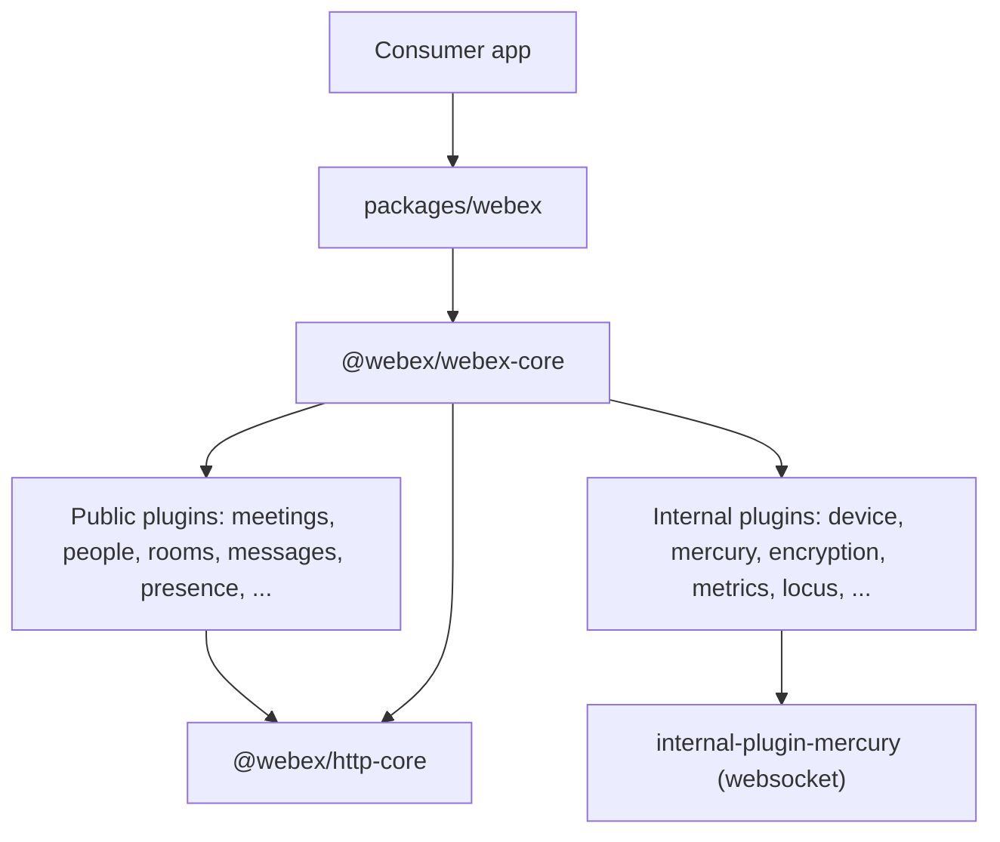
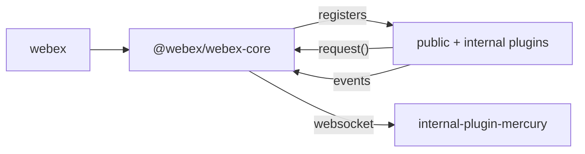

<!-- sdd-generated-metadata
doc_kind: standing-doc
generated_from: architecture@0.2.2
generated_by: claude-cli
approved_by: pending
updated_at: 2026-08-06T00:00:00Z
validation_status: not-run
-->
# ARCHITECTURE — webex-js-sdk

> Start here → root [`AGENTS.md`](../AGENTS.md) (agent entry) · router [`SPEC_INDEX.md`](SPEC_INDEX.md). This is the system architecture; per-module detail lives in each manifest-routed module spec, source-local as `<module-path>/ai-docs/<module-name>-spec.md`.
> Context-efficiency: link to canonical docs — don't duplicate them; this loads on demand, not upfront.

## Design Overview

The Webex JS SDK is a yarn-workspaces monorepo (`package.json` `workspaces`) organized around a plugin
framework. `@webex/webex-core` provides the foundation: plugin registration, an HTTP request/interceptor
pipeline, credential/auth handling, storage management, and an event system built on AmpersandState. All
public (`plugin-*`) and internal (`internal-plugin-*`) packages register on that core and are composed into
unified consumer entry points (`packages/webex`, `packages/webex-node`). Standalone SDKs (`packages/calling`,
`packages/byods`, `packages/@webex/contact-center`) layer on the same core.

The design favors clear plugin boundaries and a single shared request pipeline so cross-cutting concerns
(auth, service discovery, payload transform/encryption, tracking, rate limiting) are applied uniformly
through interceptors rather than re-implemented per plugin. This is an orchestrator-plus-components
topology: the unified `webex` package orchestrates the component plugins, and coverage is tracked per
package.

This document is the migration target for the repo-level `webex-plugin-architecture.md` core architecture
material and the `cc_playwright/ai-docs/ARCHITECTURE.md` and manual-deploy design notes; per-package detail
is preserved in each package's canonical module spec.

## Component Inventory & Responsibilities
| Component | Responsibility (one line) | Docs |
|---|---|---|
| `packages/@webex/webex-core/` | Plugin registry, HTTP interceptor pipeline, credentials, storage, events | `packages/@webex/webex-core/ai-docs/webex-core-spec.md` |
| `packages/@webex/http-core/` | Low-level HTTP request abstraction | `packages/@webex/http-core/ai-docs/http-core-spec.md` |
| `packages/webex/` | Unified browser SDK entry point composing public plugins | `packages/webex/ai-docs/webex-spec.md` |
| `packages/webex-node/` | Unified Node SDK entry point | `packages/webex-node/ai-docs/webex-node-spec.md` |
| `packages/@webex/plugin-meetings/` | Meetings/Locus/media orchestration | `packages/@webex/plugin-meetings/ai-docs/plugin-meetings-spec.md` |
| `packages/@webex/internal-plugin-mercury/` | Mercury websocket transport | `packages/@webex/internal-plugin-mercury/ai-docs/internal-plugin-mercury-spec.md` |
| `packages/calling/` | Standalone calling SDK (Mobius, registration, contacts, voicemail) | `packages/calling/ai-docs/calling-spec.md` |
| `packages/@webex/contact-center/` | Contact-center agent/task SDK | `packages/@webex/contact-center/ai-docs/contact-center-spec.md` |

> The full component set is the manifest module registry; see [`SPEC_INDEX.md`](SPEC_INDEX.md). Each row's
> detailed responsibility is preserved in that package's canonical module spec, generated in the host
> module-spec phase.

## Component Interaction

Consumers call the unified `webex` object, which resolves a named plugin child and delegates network work to
`webex.request()`. `webex-core` runs the interceptor pipeline; internal plugins such as mercury provide the
realtime websocket transport that public plugins consume.

## Execution & Flow — Init & Request Flow
Representative flow grounded in the migrated core architecture material: `Webex.init({credentials})` merges
config, constructs `WebexCore`, normalizes credentials, builds the interceptor chain, generates a session id,
and instantiates/initializes registered plugins until all report `ready`. A request (`webex.request(options)`)
runs pre-interceptors (logging, timing, tracking, rate limit) → core interceptors (service resolution,
user-agent, auth, payload transform, redirect) → HTTP execution → post-interceptors (status, network timing,
embargo, logging), with 401 handling that refreshes the token and replays the request. Exact per-class detail
is preserved in `packages/@webex/webex-core/ai-docs/webex-core-spec.md`.

## Dependencies
| Dependency | Type (internal / external / peer) | How used | Failure / version handling |
|---|---|---|---|
| `@webex/webex-core` | internal | Plugin framework every plugin extends | Workspace-internal, version-synced |
| `@webex/http-core` | internal | HTTP request primitive | Workspace-internal |
| npm registry (`webex-release-npm`, Cisco Artifactory) | external | Publish/resolve released packages | `publishConfig.registry` in `package.json` |
| Babel / TypeScript toolchain | external (dev) | Build/transpile | Pinned in root `devDependencies` |

### State Model
<!-- Kept: repo.holds_client_state = true -->
The SDK holds client-side state through AmpersandState-backed plugin models and pluggable storage adapters
(`@webex/storage-adapter-local-forage`, `-local-storage`, `-session-storage`, and an in-memory default).
`webex-core` exposes bounded and unbounded stores; plugins persist namespaced state and emit `change:*`
events that bubble to the root instance. Detailed per-adapter behavior is preserved in each storage-adapter
module spec.

## Cross-Cutting Concerns
- **Security:** OAuth-based authentication via the `plugin-authorization*` family (browser implicit/auth-code,
  Node confidential client, first-party PKCE); tokens are attached by the `AuthInterceptor` at the request
  boundary; payload encryption via `internal-plugin-encryption`/`plugin-encryption`. See [`SECURITY.md`](SECURITY.md).
- **Observability:** structured logging via `@webex/plugin-logger`; metrics via `internal-plugin-metrics`;
  request timing/network-timing interceptors in the core pipeline.

## Non-Functional Posture — Footprint & Compatibility
As a published SDK, the primary non-functional concerns are bundle footprint (UMD builds served via CDN),
browser + Node compatibility, and semver stability of exported package surfaces. Version synchronization
across workspace packages is managed by `@webex/package-tools`.

<!-- ===== Conditional extras — kept only when the repo profile condition holds ===== -->

## Dependency / Interaction Topology
<!-- Kept: repo.components_interact = true -->

| From | To | Kind (call / event) | Purpose |
|---|---|---|---|
| `packages/webex` | `@webex/webex-core` | call | Compose and initialize plugins |
| plugin | `@webex/webex-core` | call | `this.request()` → `webex.request()` |
| `internal-plugin-mercury` | plugins | event | Deliver realtime server events |
| plugin | root instance | event | `change:*` state propagation |

## Object / Data Ownership
<!-- Kept: repo.domain_data_across_components = true -->
| Domain object | System-of-record (owning component) | Read by |
|---|---|---|
| Conversation/activity | `internal-plugin-conversation` | messages, meetings |
| Device registration | `internal-plugin-device` | mercury, most internal plugins |
| Meeting/Locus state | `internal-plugin-locus` / `plugin-meetings` | meetings, media-helpers |
| Presence | `internal-plugin-presence` / `plugin-presence` | people |

## Caching Catalog
<!-- Kept: repo.caches_data = true -->
| Cache | Backend | What it holds | TTL | Invalidation trigger |
|---|---|---|---|---|
| Bounded store | storage adapter (memory/local/session) | Frequently accessed namespaced plugin state | adapter-dependent | plugin `change:*` writes |
| Unbounded store | storage adapter | Archival/longer-lived plugin state | none | explicit `del`/`clear` |

> Exact cache keys and TTLs are owned by the storage-adapter and consuming plugin specs; this is the
> repo-level catalog only.

## Observability Patterns
<!-- Kept: repo.observability_convention = true -->
- **Logging:** `@webex/plugin-logger` provides per-plugin loggers; the core pipeline includes request/response
  logger interceptors. Never log tokens or PII (see [`SECURITY.md`](SECURITY.md)).
- **Metrics:** `internal-plugin-metrics` emits SDK telemetry via `webex.measure()`; request/network timing
  interceptors capture latency.
- **Audit:** N/A at repo level — the SDK is a client library and does not own a server-side audit log
  (evidence: no server datastore; `repo.owns_datastore = false`).

## Shared / Base Libraries
<!-- Kept: repo.shared_base_libs = true -->
| Library | What every module inherits from it | Version floor |
|---|---|---|
| `@webex/webex-core` | Plugin base class, request pipeline, storage, events | workspace |
| `@webex/common` | Shared utilities/mixins | workspace |
| `@webex/http-core` | HTTP request primitive | workspace |

## Package Map & Inter-Package Dependencies
<!-- Kept: repo.is_monorepo = true -->
- Workspace tooling: yarn 3.4.1; globs `packages/@webex/*`, `packages/webex`, `packages/webex-node`,
  `packages/calling`, `packages/byods`, `packages/byods-demo-server`, `packages/config/*`,
  `packages/legacy/*`, `packages/tools/*` (`package.json` `workspaces`).
- Package → responsibility with public/internal visibility is enumerated in the manifest module registry and
  [`SPEC_INDEX.md`](SPEC_INDEX.md); public consumer packages (`webex`, `plugin-*`, `calling`, `byods`,
  `contact-center`) vs internal (`internal-plugin-*`, `test-helper-*`, `config/*`, `legacy/*`, `tools/*`).
- Inter-package dependency graph: most plugins depend on `@webex/webex-core`; unified packages depend on the
  plugin set. Release/version-sync is handled by `@webex/package-tools`.
- Kind differences: `config/*`, `legacy/*`, and `tools/*` are build/config packages (a different kind than the
  SDK plugins) and their specs use build-tooling headings.

## Platform Matrix
<!-- Kept: repo.multi_platform = true -->
| Platform | Shared core vs per-platform | Entry / build | Notes |
|---|---|---|---|
| Browser | Shared plugin core + browser shims (`package.json` `browser` field) | UMD/CDN bundle | unpkg/jsdelivr |
| Node | Shared plugin core + Node entry | `packages/webex-node` | `webex/env` quick-start |

## Release & Versioning
<!-- Kept: repo.published_package = true -->
- Publish target: internal Cisco Artifactory npm registry (`webex-release-npm`); public packages also on npmjs
  and CDN. Semver via `standard-version`; version-sync across packages via `@webex/package-tools`. Consumers
  are advised to pin synchronized versions (README "Updating the Modules").

## Security Architecture
<!-- Kept: repo.security_arch_warranted = true -->
Authentication is OAuth 2.0 through the `plugin-authorization*` family; the `AuthInterceptor` mints/attaches
bearer tokens at the request boundary and handles 401 re-authentication/replay. Sensitive payloads are
encrypted through the encryption plugins. Trust boundary is the network edge to Webex services; secrets
(access tokens) are held in credentials/storage and must never be logged. Detailed trust-boundary and
token-flow content is preserved in [`SECURITY.md`](SECURITY.md) and the authorization/encryption module specs.

---
→ Per-module orientation and detailed design live in each manifest-routed module spec, source-local as `<module-path>/ai-docs/<module-name>-spec.md`. Routing: [`SPEC_INDEX.md`](SPEC_INDEX.md).

## Architecture Reference Links
| Reference | Location | When to read |
|---|---|---|
| Architecture decisions | `adr/` (per-package where present) | To understand why major design choices were made |
| Repo patterns | `patterns/` (per-package where present) | To follow established implementation conventions |
| Enforceable rules | [`RULES.md`](RULES.md) | Constraints every architecture-affecting change must obey |
