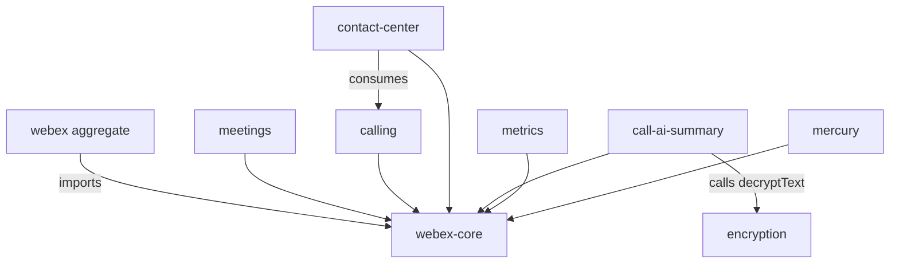

<!-- sdd-generated-metadata
doc_kind: standing-doc
generated_from: architecture@0.2.2
generated_by: claude-cli
approved_by: pending
updated_at: 2026-08-05T00:00:00Z
validation_status: not-run
-->

# ARCHITECTURE — webex-js-sdk

> Start here → root [`AGENTS.md`](../AGENTS.md) (agent entry) · router [`SPEC_INDEX.md`](SPEC_INDEX.md). This is the system architecture; per-package detail lives in each manifest-routed package/module spec, source-local under `<package>/ai-docs/<name>-spec.md`.
> Context-efficiency: link to canonical docs — don't duplicate them; this loads on demand, not upfront.

## Design Overview

`webex-js-sdk` is a Yarn-workspaces monorepo that packages the Webex JavaScript SDK as a family of `@webex/*` npm packages. The unifying design choice is a **plugin architecture** built on `@webex/webex-core`: the core provides plugin registration, an HTTP request/response interceptor pipeline, authentication/credential handling, storage management, and an event system, and every capability (meetings, people, messages, calling, contact-center, device, mercury, metrics, encryption, call-ai-summary, …) is a plugin that layers on top.

Consumers use either individual `@webex/plugin-*` packages or the aggregate `webex` package, which auto-requires the public plugins. Internal plugins register on the internal namespace (`webex.internal.*`) and provide infrastructure such as device registration, Mercury WebSocket events, and encryption. Larger capability areas — notably `@webex/calling` and `@webex/contact-center` — are substantial sub-systems that maintain their own package-local SDD trees; this root architecture aggregates and routes to them rather than restating their internal detail.

Detailed plugin framework behavior, the HTTP interceptor order, storage adapters, configuration merge process, and the event/lifecycle model are documented in the migrated `@webex/webex-core` module spec. Public SDK surfaces are indexed in [`CONTRACTS.md`](CONTRACTS.md).

## Component Inventory & Responsibilities
| Component | Responsibility (one line) | Docs |
|---|---|---|
| `packages/@webex/webex-core/` | Plugin framework: registration, HTTP interceptor pipeline, storage, config, events | [`packages/@webex/webex-core/ai-docs/webex-core-spec.md`](../packages/@webex/webex-core/ai-docs/webex-core-spec.md) |
| `packages/calling/` | Webex Calling SDK: clients, registration, call control/media, history, settings, contacts, voicemail, Mobius transport | [`packages/calling/ai-docs/calling-package-spec.md`](../packages/calling/ai-docs/calling-package-spec.md) |
| `packages/@webex/contact-center/` | Contact Center plugin: agent/task/config/realtime/telemetry SDK surface | [`packages/@webex/contact-center/ai-docs/contact-center-package-spec.md`](../packages/@webex/contact-center/ai-docs/contact-center-package-spec.md) |
| `packages/@webex/internal-plugin-call-ai-summary/` | Internal plugin: AI call summaries/notes/action items/transcripts from Pragya + AI Bridge | [`packages/@webex/internal-plugin-call-ai-summary/ai-docs/call-ai-summary-spec.md`](../packages/@webex/internal-plugin-call-ai-summary/ai-docs/call-ai-summary-spec.md) |
| `packages/@webex/plugin-meetings/` | Public plugin: meetings (public surface pending confirmation) | [`packages/@webex/plugin-meetings/ai-docs/plugin-meetings-spec.md`](../packages/@webex/plugin-meetings/ai-docs/plugin-meetings-spec.md) |
| `cc_playwright/` | Contact Center widget E2E test framework (Playwright) | [`cc_playwright/ai-docs/e2e-testing-spec.md`](../cc_playwright/ai-docs/e2e-testing-spec.md) |

> This is the initial assess-only registry of documented components. The workspace contains many additional `@webex/*` plugins (people, messages, rooms, device, mercury, metrics, encryption, …) that are not yet routed to canonical specs — see the SPEC_INDEX gap note.

## Component Interaction
```mermaid
flowchart TD
  Consumer --> WebexAgg[webex aggregate package]
  WebexAgg --> PublicPlugins[Public plugins: meetings / people / messages / rooms / calling / contact-center]
  WebexAgg --> InternalPlugins[Internal plugins: device / mercury / metrics / encryption / call-ai-summary]
  PublicPlugins --> Core[@webex/webex-core]
  InternalPlugins --> Core
  Core --> Ampersand[AmpersandState]
  Core --> HttpCore[http-core network layer]
  Core --> Services[Webex cloud services]
  CallAISummary[call-ai-summary] --> Encryption[internal-plugin-encryption / KMS]
  ContactCenter[contact-center] --> Calling[@webex/calling]
```
Consumers enter through the aggregate `webex` package or an individual plugin. Every plugin registers with `@webex/webex-core`, which owns the request function and interceptor pipeline; plugin method calls delegate to `webex.request()` and flow through the full interceptor chain. Internal plugins compose with each other (e.g. `call-ai-summary` calls `internal.encryption.decryptText`; `contact-center` consumes `@webex/calling`).

## Execution & Flow
### Init & Request Flow
`Webex.init({credentials})` merges config, constructs `WebexCore`, normalizes credentials, initializes AmpersandState, builds the interceptor chain and request function, generates a session id, then registers and initializes all plugins until `ready`. A plugin method call (`webex.people.get(id)`) delegates to `this.request()` → `webex.request()` → pre-interceptors (logging/timing/tracking) → core interceptors (service resolution, auth, payload transform, redirect) → HTTP core → post-interceptors (status, timing, embargo, logging) → response transform → result. Evidence: migrated `webex-plugin-architecture.md`; canonical detail in `packages/@webex/webex-core/ai-docs/webex-core-spec.md`.

## Dependencies
| Dependency | Type (internal / external / peer) | How used | Failure / version handling |
|---|---|---|---|
| AmpersandState | external | Base state management for core/plugins | Pinned via workspace deps |
| http-core (`@webex/http-core`) | internal | Network layer under the interceptor pipeline | Workspace-synced version |
| `@webex/internal-media-core` | external | WebRTC/ROAP media for calling/meetings | Version floor `2.26.1` (calling) |
| `xstate` | external | Task/call state machines (contact-center, calling) | Version per package deps |
| Webex cloud services (Locus, Mercury, Mobius, Janus, Hydra, KMS, Pragya, WCC) | external | Remote APIs resolved via the service catalog | TLS/WSS; SDK retry/redirect interceptors |

<!-- repo.owns_datastore is false → Data & Schema section dropped -->

### State Model
<!-- repo.holds_client_state = true -->
The SDK holds client-side state in memory: `WebexCore` tracks `loaded`/`ready` and merged config; each plugin holds its own `ready` state and namespace config via AmpersandState; storage adapters (bounded/unbounded, memory/local/session) hold cached plugin data keyed by namespace. Capability packages hold richer state (calling: line/registration/call state machines; contact-center: XState task lifecycle). Transitions are triggered by init, config changes, request lifecycle, real-time events, and logout.

## Cross-Cutting Concerns
- **Security:** Credentials/bearer tokens are normalized at construction and attached by the `AuthInterceptor` at the request boundary; 401 handling triggers bounded re-auth/replay. Encrypted content (e.g. AI summaries, contacts) is decrypted via KMS through `internal-plugin-encryption`. Secrets must never be logged or persisted.
- **Observability:** Structured request/response logging via logger interceptors and per-package loggers; timing interceptors record request/network duration; a tracking id is attached per request; `@webex/internal-plugin-metrics` carries telemetry.

## Non-Functional Posture
### Footprint & Compatibility
Published `@webex/*` packages are semver-sensitive; public exports and type declarations are consumer contracts. The SDK targets both browser and Node environments (per-file browser shims in `package.json` `browser` map). The aggregate `webex` package bundles public plugins; internal plugins self-register when imported.

<!-- ===== Conditional extras (repo section profile) ===== -->

## Dependency / Interaction Topology
<!-- repo.components_interact = true -->

| From | To | Kind (call / event) | Purpose |
|---|---|---|---|
| any plugin | `webex-core` | call | `webex.request()` through the interceptor pipeline |
| `contact-center` | `@webex/calling` | call | WebRTC calling integration for tasks |
| `call-ai-summary` | `internal-plugin-encryption` | call | KMS decryption of AI content |
| plugins | `mercury` | event | Real-time WebSocket events |

## Object / Data Ownership
<!-- repo.domain_data_across_components = true -->
| Domain object | System-of-record (owning component) | Read by |
|---|---|---|
| Merged SDK config | `webex-core` | all plugins |
| Cached plugin storage | `webex-core` storage adapters | owning plugin |
| Call/line/registration state | `@webex/calling` | contact-center, consumers |
| Task lifecycle state | `@webex/contact-center` (XState) | host apps |
| Remote records (messages, meetings, sessions, summaries) | Webex cloud services (not owned here) | plugins (read/act) |

## Caching Catalog
<!-- repo.caches_data = true -->
| Cache | Backend | What it holds | TTL | Invalidation trigger |
|---|---|---|---|---|
| Bounded storage | memory / localStorage / sessionStorage | frequently accessed plugin data (size-limited) | adapter-defined | `del`/`clear`, logout |
| Unbounded storage | memory / adapters | archival plugin data | none | explicit clear, logout |
| Contacts cache (calling) | process memory | contacts/groups | module lifecycle | create/delete/refresh |
| PageCache (contact-center) | process memory | paginated lookups | module lifecycle | query change/expiry |

## Observability Patterns
<!-- repo.observability_convention = true -->
- **Logging:** Interceptor-based request/response logging (`ResponseLoggerInterceptor`, `RequestLoggerInterceptor`) plus per-package loggers with method context; never log tokens/PII.
- **Metrics:** `@webex/internal-plugin-metrics`; per-package metric managers (e.g. calling `MetricManager`, contact-center `MetricsManager`).
- **Audit:** No SDK-owned durable audit store; remote services own server-side audit records.

<!-- repo.deploys_to_infra = false → Infrastructure Matrix dropped -->

## Shared / Base Libraries
<!-- repo.shared_base_libs = true -->
| Library | What every module inherits from it | Version floor |
|---|---|---|
| `@webex/webex-core` | Plugin base classes, request/interceptor pipeline, storage, events | workspace version |
| `@webex/http-core` | Network layer primitives | workspace version |
| `@webex/common` | Shared types/utilities | workspace version |
| `@webex/test-helper-*` | Shared test mocks/helpers (chai, mock-webex, sinon utils) | workspace version |

## Package Map & Inter-Package Dependencies
<!-- repo.is_monorepo = true -->
- **Workspace tooling:** Yarn `3.4.1` workspaces. Globs (from `package.json`): `packages/@webex/*`, `packages/webex`, `packages/webex-node`, `packages/calling`, `packages/byods`, `packages/byods-demo-server`, `packages/config/*`, `packages/legacy/*`, `packages/tools/*`.
- **Package → responsibility:** public `@webex/plugin-*` (consumer capabilities), internal `@webex/internal-plugin-*` (infrastructure), `@webex/webex-core` (framework, internal-but-foundational), `webex` (public aggregate bundle), `@webex/*-tools` / `config/*` (build/tooling, internal).
- **Inter-package graph:** all plugins depend on `webex-core`; `contact-center` depends on `calling`; `call-ai-summary` depends on `internal-plugin-encryption`; the aggregate `webex` depends on the public plugin set. Version-sync is enforced by the monorepo release process (`standard-version`, topological workspace builds).
- **Per-package note:** `@webex/calling` and `@webex/contact-center` are library sub-systems with their own `.sdd/manifest.json` and canonical specs; they remain authoritative within their package.

## Platform Matrix
<!-- repo.multi_platform = true -->
| Platform | Shared core vs per-platform | Entry / build | Notes |
|---|---|---|---|
| Browser | Shared TS/JS core + per-file browser shims | `package.json` `browser` map; webpack/browserify | WebRTC/media, browser sockets |
| Node | Shared core + Node transports | `packages/webex-node`, workspace build | Server/test paths |
| Mobile (samples) | Shared core via WebdriverIO/appium sample runners | `wdio.conf.mobile.js` | Sample/E2E automation only |

## Release & Versioning
<!-- repo.published_package = true -->
Packages publish to the internal npm registry (`publishConfig.registry` in `package.json`). Versioning follows semver via `standard-version`; public exports/type declarations are consumer contracts and incompatible removals require a major bump and changelog entry.

## Host Integration & Theming
<!-- repo.embedded_in_host = true -->
`@webex/contact-center` exposes state and UI-control contracts to host applications (it renders no UI itself); host apps mount widgets (see `cc_playwright` samples/`samples-cc-react-app`). Plugins integrate into a host Webex SDK instance via `Webex.init` / plugin registration. Detailed host-mount contracts live in the owning package specs.

## Cross-Repo Dependency Graph
<!-- repo.cross_repo_deps_material = true -->
- **Internal (same org):** Consumes/publishes `@webex/*` workspace packages; media via `@webex/internal-media-core`.
- **External services:** Webex cloud (Locus, Mercury, Mobius, Janus, Hydra, KMS, Pragya/AI Bridge, WCC, contacts, metrics).
- **External read-only:** N/A (no external repos modified from here).

## Security Architecture
<!-- repo.security_arch_warranted = true -->
The trust boundary is the host application → Webex SDK. Credentials enter at `Webex.init`, are normalized in `WebexCore`, and are attached at the request boundary by `AuthInterceptor` (never earlier, never logged). Transport is TLS/WSS. Sensitive content (AI summaries, contacts) is end-to-end protected via KMS keys resolved through `internal-plugin-encryption`; decryption requires a registered device and Mercury connection. Per-package security detail lives in the owning specs.

---
→ Per-package orientation and detailed design live in each manifest-routed spec, source-local under `<package>/ai-docs/<name>-spec.md`. Routing: [`SPEC_INDEX.md`](SPEC_INDEX.md).

## Architecture Reference Links
| Reference | Location | When to read |
|---|---|---|
| Architecture decisions | `adr/` | Durable design rationale (e.g. manual-deploy package resolution) |
| Enforceable rules | [`RULES.md`](RULES.md) | Constraints every architecture-affecting change must obey |
| Public surface index | [`CONTRACTS.md`](CONTRACTS.md) | The SDK's exported/consumed contracts |

## WS6 References
| WS6 artifact | Relevance to this repo | Link |
|---|---|---|
| — | No repository-local WS6 artifact found. Use an authoritative organization source if supplied; do not infer one. | — |
