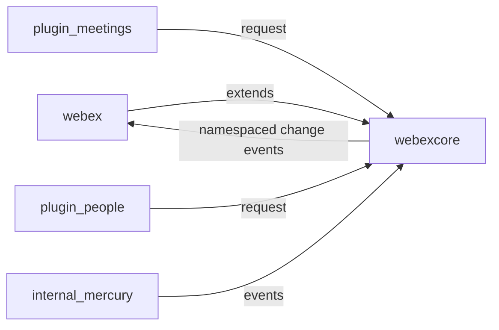

<!-- sdd-generated-metadata
doc_kind: standing-doc
generated_from: architecture@0.2.2
generated_by: claude-cli
approved_by: pending
updated_at: 2026-08-05T00:00:00Z
validation_status: not-run
-->
# ARCHITECTURE — webex-js-sdk

> Start here → root [`AGENTS.md`](../AGENTS.md) (agent entry) · router [`SPEC_INDEX.md`](SPEC_INDEX.md). This is the system architecture; per-module detail lives in each manifest-routed module spec, source-local as `<module-path>/ai-docs/<module-name>-spec.md` by default.
> Context-efficiency: link to canonical docs — don't duplicate them; this loads on demand, not upfront.

> **Assess-only draft.** Only `@webex/webex-core` has a canonical module spec today (migrated from the
> routed `webex-plugin-architecture.md`). All other packages are code-first and Untracked. Repo-level
> section selection used committed evidence where available and the automated `config-fallback` default
> otherwise; those defaults are not human-verified (see `.generated/sdd/bootstrap-questionnaire.md`).

## Design Overview
`webex-js-sdk` is a Yarn-workspaces monorepo that packages the Cisco Webex JavaScript SDK. Its shape is
plugin-oriented: `@webex/webex-core` is the foundation layer that every feature package builds on. Core
provides plugin registration, a configurable HTTP request pipeline built from ordered interceptors,
credential normalization and token refresh, pluggable bounded/unbounded storage, layered configuration
merging, and an event framework (built on AmpersandState + EventEmitter). Feature plugins
(`@webex/plugin-*`) and internal plugins (`@webex/internal-plugin-*`) register onto core and are proxied
onto the unified `webex` object.

The unified public entry is `packages/webex` (`Webex.init(attrs)`), which merges default config, sets
`sdkType`, extends `WebexCore`, and requires the public plugins. This separation lets consumers pull the
whole SDK (`webex`) or individual modular packages, while all packages share one plugin host, request
pipeline, and event/storage model. Design choices favor a single writer for the request pipeline (core)
and clear plugin boundaries so feature packages stay independently versioned and publishable.

## Component Inventory & Responsibilities
| Component | Responsibility (one line) | Docs |
|---|---|---|
| `packages/@webex/webex-core/` | Plugin host, HTTP request pipeline, credentials/auth, storage, config, events | `packages/@webex/webex-core/ai-docs/webex-core-spec.md` |
| `packages/webex/` | Unified public SDK entry point (`Webex.init`) that composes public plugins | No canonical spec (Untracked) |
| `packages/@webex/plugin-*/` | Public feature plugins (meetings, people, rooms, messages, …) | No canonical spec (Untracked) |
| `packages/@webex/internal-plugin-*/` | Internal plugins (device, mercury, metrics, …) | No canonical spec (Untracked) |

## Component Interaction
```mermaid
flowchart TD
  App[Consumer app] --> Webex[webex unified SDK]
  Webex --> Core[@webex/webex-core WebexCore]
  Core --> Pipeline[HTTP request pipeline / interceptors]
  Core --> Cred[Credentials / Auth]
  Core --> Store[Storage adapters]
  Core --> Plugins[Public + internal plugins]
  Plugins -->|this.request| Core
  Plugins -->|child events bubble| Core
```
Consumers enter through `webex` (`packages/webex/src/webex.js` `Webex.init`), which extends `WebexCore`
(`packages/@webex/webex-core/src/webex-core.js`). Plugins register via `registerPlugin` /
`registerInternalPlugin` (`packages/@webex/webex-core/src/index.js`), are added to the `_children`
collection, and delegate outbound calls back to `webex.request()`. Child state changes bubble to the
parent with a namespace prefix.

## Execution & Flow
### Init & Request Flow
`Webex.init(attrs)` → merge default+user config, set `sdkType` → `WebexCore.constructor` normalizes
credential shapes and validates the bearer token → `AmpersandState` init → `WebexCore.initialize` builds
the interceptor chain, creates the configured `request` function, and generates a session id → plugins
instantiate and run `initialize()` → `ready` when all plugins are ready. A request
(`webex.request(options)`) then runs pre-interceptors (logging/timing/tracking/rate-limit), core
interceptors (service resolution, user-agent, auth, payload transform, redirect), the HTTP core call,
then post-interceptors (HTTP status, network timing, embargo, logging), with 401 → token refresh →
replay handled by `AuthInterceptor`. Evidence: `packages/@webex/webex-core/src/webex-core.js`,
`packages/@webex/webex-core/src/interceptors/auth.js`.

## Dependencies
| Dependency | Type (internal / external / peer) | How used | Failure / version handling |
|---|---|---|---|
| `@webex/http-core` | internal | HTTP transport, `HttpStatusInterceptor`, fetch option prep | workspace:* pinned |
| `@webex/common` | internal | event proxying/transfer, retry helpers | workspace:* pinned |
| `ampersand-state` | external | base state/model for `WebexCore` and plugins | `^5.0.3` |
| `crypto-js`, `jsonwebtoken` | external | token handling / validation in credentials | `^4.1.1` / `^9.0.0` |
| Remote Webex services | external | REST + realtime endpoints the SDK calls | resolved via service discovery; auth replay on 401 |

<!-- Include if: the repo holds client-side state (UI store / in-memory session model) [condition-id: repo.holds_client_state] -->
### State Model
- Client state is held in AmpersandState-derived models. `WebexCore` exposes derived `ready`/`loaded`
  and session properties (`config`, `request`, `sessionId`); plugins hold their own `ready` and
  namespaced config. State changes emit `change` events that bubble to the parent
  (`packages/@webex/webex-core/src/webex-core.js`).

## Cross-Cutting Concerns
- **Security:** Access tokens/credentials are normalized and validated in `WebexCore`
  (`bearerValidator`) and attached by `AuthInterceptor`; treat all tokens as secrets. 401 responses
  trigger a controlled refresh + replay. See `SECURITY.md`.
- **Observability:** Request/response logging, request timing, network timing, and tracking-id
  interceptors provide structured request telemetry; the `@webex/plugin-logger` package standardizes
  logging. Verbose network logging is gated by `ENABLE_NETWORK_LOGGING` env vars
  (`packages/@webex/webex-core/src/webex-core.js`).

## Non-Functional Posture
### Footprint & Compatibility
Published as npm packages consumed in browser and Node. Browser builds swap Node-only modules via the
`browser` field shims in the root `package.json`; semver applies per package. The unified `webex` bundle
is also distributed via UMD/CDN (`README.md`).

<!-- ===== Conditional extras — keep a section only when its Include-if condition holds ===== -->

<!-- Include if: components/services call each other or exchange events [condition-id: repo.components_interact] -->
## Dependency / Interaction Topology

| From | To | Kind (call / event) | Purpose |
|---|---|---|---|
| `webex` | `@webex/webex-core` | call | extends core; composes plugins |
| feature plugins | `@webex/webex-core` | call | `this.request()` delegates to `webex.request()` |
| plugins | `@webex/webex-core` | event | child `change` events bubble with namespace prefix |

<!-- Include if: the repo owns domain data spread across components [condition-id: repo.domain_data_across_components] -->
## Object / Data Ownership
| Domain object | System-of-record (owning component) | Read by |
|---|---|---|
| Session config | `@webex/webex-core` (`config`) | all plugins (namespaced slice) |
| Credentials / tokens | `@webex/webex-core` credentials | `AuthInterceptor`, plugins via `webex` |
| Feature domain data (people, rooms, …) | remote Webex services (cached by plugins) | owning plugin |

Note: the SDK does not own a persistent datastore; remote Webex services are the system of record for
feature domain data. The SDK caches it through storage adapters.

<!-- Include if: the repo caches data [condition-id: repo.caches_data] -->
## Caching Catalog
| Cache | Backend | What it holds | TTL | Invalidation trigger |
|---|---|---|---|---|
| boundedStorage | MemoryStore / LocalStorage / SessionStorage adapter | size-limited, frequently accessed data | adapter-dependent | `clear()` / explicit `del` |
| unboundedStorage | same adapters | archival / unlimited data | none | explicit `del` / `clear` |

Evidence: `packages/@webex/webex-core/src/lib/storage`.

<!-- Include if: the repo has a logging/metrics/audit convention worth standardizing [condition-id: repo.observability_convention] -->
## Observability Patterns
- **Logging:** `@webex/plugin-logger` + request/response logger interceptors; verbose network logging
  gated by `ENABLE_NETWORK_LOGGING` / `ENABLE_VERBOSE_NETWORK_LOGGING`. Never log tokens.
- **Metrics:** `WebexCore.measure()` sends metrics via the metrics plugin; request/network timing
  interceptors capture durations.
- **Audit:** `[NEEDS HUMAN INPUT]` — no repo-wide audit convention was evidenced.

<!-- Include if: the repo inherits a shared/base library stack every module uses [condition-id: repo.shared_base_libs] -->
## Shared / Base Libraries
| Library | What every module inherits from it | Version floor |
|---|---|---|
| `@webex/webex-core` | plugin host, request pipeline, storage, events | workspace:* |
| `@webex/http-core` | HTTP transport primitives | workspace:* |
| `@webex/common` | event/retry helpers | workspace:* |

<!-- Include if: the repo is a monorepo (multiple packages in one tree) [condition-id: repo.is_monorepo] -->
## Package Map & Inter-Package Dependencies
- Workspace tooling: Yarn 3 (Berry) workspaces; globs from root `package.json`:
  `packages/@webex/*`, `packages/webex`, `packages/webex-node`, `packages/calling`, `packages/byods`,
  `packages/config/*`, `packages/legacy/*`, `packages/tools/*`.
- `webex` (public/unified) depends on the public `@webex/plugin-*` packages; every feature package
  depends on `@webex/webex-core` (internal). `@webex/webex-core` depends on `@webex/http-core`,
  `@webex/common`, `@webex/common-timers`, `@webex/storage-adapter-spec`.
- Release/version-sync: packages are published to the internal Webex npm registry; `@webex/package-tools`
  keeps consumer versions synchronized (`README.md`).
- Per-package note: `@webex/webex-core` is a foundation library (a different kind than a feature plugin) —
  its spec uses the foundation/plugin-host headings, not feature headings.

<!-- Include if: the repo targets multiple platforms [condition-id: repo.multi_platform] -->
## Platform Matrix
| Platform | Shared core vs per-platform | Entry / build | Notes |
|---|---|---|---|
| Browser | shared core + browser shims | UMD bundle / bundler | `browser` field in root `package.json` swaps Node modules |
| Node | shared core | `packages/webex-node` | Node 18.x engine |

<!-- Include if: the repo is published/consumed as a package [condition-id: repo.published_package] -->
## Release & Versioning
- Publish target: internal Webex npm registry (`publishConfig` in root `package.json`); unified `webex`
  also on public npm + CDN. Semver per package; `standard-version` drives releases and changelog.
  Consumers sync versions with `@webex/package-tools`.

<!-- Include if: the security architecture warrants its own view [condition-id: repo.security_arch_warranted] -->
## Security Architecture
Trust boundary is the network edge between the SDK and remote Webex services. Identity flows as OAuth
access/super tokens normalized in `WebexCore` and attached by `AuthInterceptor`; a 401 triggers a bounded
re-auth + request replay. Transport is HTTPS to Webex services. See `SECURITY.md` for the full posture.

---
→ Per-module orientation and detailed design live in each manifest-routed module spec, source-local as `<module-path>/ai-docs/<module-name>-spec.md` by default. Routing: `SPEC_INDEX.md`.

## Architecture Reference Links
| Reference | Location | When to read |
|---|---|---|
| Architecture decisions | `adr/` | To understand why major design choices were made and what alternatives were rejected |
| Repo patterns | `patterns/` | To follow established implementation conventions reflected in this architecture |
| Enforceable rules | `RULES.md` + `rules/` | To understand constraints every architecture-affecting change must obey |

## WS6 References
| WS6 artifact | Relevance to this repo | Link |
|---|---|---|
| `[NEEDS HUMAN INPUT]` | No WS6 architecture reference was evidenced in the repository | — |
