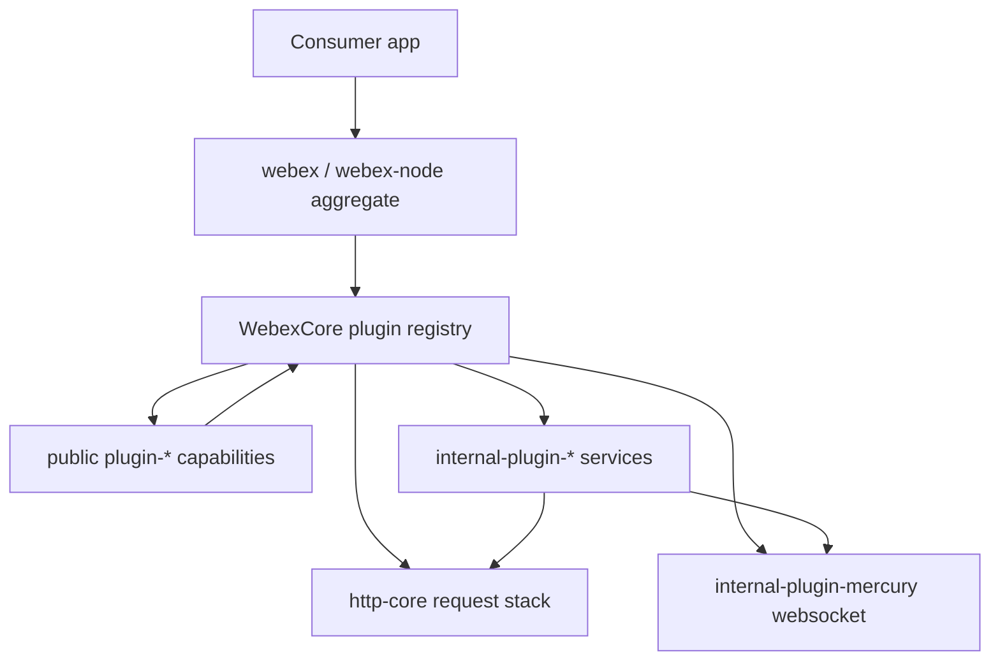
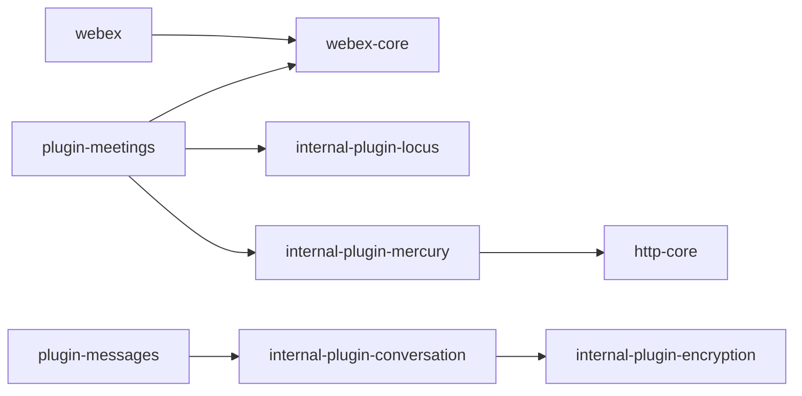

<!-- sdd-generated-metadata
doc_kind: standing-doc
generated_from: architecture@0.2.2
generated_by: claude-cli
approved_by: pending
updated_at: 2026-08-06T00:00:00Z
validation_status: not-run
-->

# ARCHITECTURE — webex-js-sdk

> Start here → root [`AGENTS.md`](../AGENTS.md) (agent entry) · router [`SPEC_INDEX.md`](SPEC_INDEX.md). This is the system architecture; per-module detail lives in each manifest-routed module spec, source-local as `<module-path>/ai-docs/<module-name>-spec.md`.
> Context-efficiency: link to canonical docs — don't duplicate them; this loads on demand, not upfront.

## Design Overview
webex-js-sdk is a client SDK organized as a **plugin architecture** on top of a shared core. The
design choice that explains its shape: capabilities are decomposed into independent workspace
packages that each register onto a single `WebexCore` instance, so a consumer composes only the
plugins it needs while transport, credentials, and service discovery stay centralized. `WebexCore`
(`packages/@webex/webex-core`) owns the plugin registry, credential/token lifecycle, the services
registry, and the request stack; every `plugin-*` and `internal-plugin-*` package layers domain
behavior on top of it.

The split between **public** `plugin-*` packages (the supported SDK surface: meetings, messages,
rooms, people, …) and **internal** `internal-plugin-*` packages (transport and service plumbing:
mercury websockets, locus meeting control-plane, encryption/KMS, device registration, …) keeps the
consumer-facing API separate from the moving internals. Aggregate entry packages (`packages/webex`
for browser/UMD, `packages/webex-node` for Node) bundle a curated plugin set into a ready-to-use
SDK. Two larger capabilities — `packages/calling` and `packages/@webex/contact-center` — ship as
standalone SDKs with their own migrated `ai-docs` spec trees.

Because it is a monorepo, shared build/test configuration lives in dedicated packages
(`packages/config/*`, `packages/legacy/*`) and tooling in `packages/tools/*`; the SDK owns no server
datastore and deploys no service of its own — it is published as npm packages consumed by browser
and Node applications.

## Component Inventory & Responsibilities
| Component | Responsibility (one line) | Docs |
|---|---|---|
| `packages/@webex/webex-core/` | Plugin framework, credentials, services registry, request stack | `packages/@webex/webex-core/ai-docs/webex-core-spec.md` |
| `packages/@webex/http-core/` | HTTP request/interceptor core underpinning plugins | `packages/@webex/http-core/ai-docs/http-core-spec.md` |
| `packages/@webex/internal-plugin-mercury/` | Mercury websocket transport | `packages/@webex/internal-plugin-mercury/ai-docs/internal-plugin-mercury-spec.md` |
| `packages/@webex/internal-plugin-locus/` | Meeting control-plane (locus) | `packages/@webex/internal-plugin-locus/ai-docs/internal-plugin-locus-spec.md` |
| `packages/@webex/internal-plugin-encryption/` | KMS/encryption for messaging/content | `packages/@webex/internal-plugin-encryption/ai-docs/internal-plugin-encryption-spec.md` |
| `packages/@webex/plugin-meetings/` | Public meetings SDK capability | `packages/@webex/plugin-meetings/ai-docs/plugin-meetings-spec.md` |
| `packages/@webex/plugin-messages/` · `plugin-rooms/` · `plugin-people/` | Public messaging/collaboration capabilities | see each module spec |
| `packages/webex/`, `packages/webex-node/` | Aggregate SDK entry points | `packages/webex/ai-docs/webex-spec.md`, `packages/webex-node/ai-docs/webex-node-spec.md` |
| `packages/calling/`, `packages/@webex/contact-center/` | Standalone calling and contact-center SDKs | `packages/calling/ai-docs/calling-spec.md`, `packages/@webex/contact-center/ai-docs/contact-center-spec.md` |
| `packages/config/*`, `packages/legacy/*`, `packages/tools/*` | Shared build/test config and tooling | see each module spec |

> The full 93-module registry with per-module coverage state is in `SPEC_INDEX.md` and `.sdd/manifest.json`.

## Component Interaction

Consumer apps talk to an aggregate package, which instantiates `WebexCore`. Plugins register onto
core and reach services through the shared request stack (`http-core`) and the Mercury websocket for
server-pushed events. Public plugins delegate transport and encryption to internal plugins rather
than calling services directly.

## Execution & Flow
Representative flow (SDK init → capability call):
`new Webex(config)` → `WebexCore` boots, loads credentials and the services registry → registered
plugins initialize → a consumer calls a public plugin method (e.g. `webex.messages.create(...)`) →
the plugin builds a request through `http-core`, applying interceptors (auth token, tracking id) →
response resolves; server-pushed changes arrive over `internal-plugin-mercury` and are emitted as
plugin events. Grounded in the aggregate entry points (`packages/webex/src/`) and `WebexCore`
(`packages/@webex/webex-core/src/`).

## Dependencies
| Dependency | Type (internal / external / peer) | How used | Failure / version handling |
|---|---|---|---|
| Webex cloud services | external | The backends every plugin calls | Per-plugin error handling; SDK is a client, not the SoR |
| `@webex/webex-core` | internal | Plugin framework every plugin registers onto | Workspace version-synced |
| Mercury websocket service | external | Server-pushed events via `internal-plugin-mercury` | Reconnect/backoff in the mercury plugin |
| Babel / esbuild / webpack | external (build) | Transpile/bundle per package | Pinned in devDependencies (`package.json`) |
| Node runtime | external (peer) | Execution runtime | `engines.node` = `18.x` (`package.json`) |

### State Model
<!-- Include-if repo.holds_client_state = true -->
The SDK holds client-side session state rather than server data: `WebexCore` holds credentials/token
state and the services registry; individual plugins hold in-memory models (e.g. meeting state in
`plugin-meetings`, calling/registration state in `packages/calling`). Transitions are driven by
consumer method calls and by Mercury-delivered server events. Detailed per-plugin state models live
in the owning module specs (see `SPEC_INDEX.md`).

## Cross-Cutting Concerns
- **Security:** OAuth-based identity via the `plugin-authorization*` family (retained flow guides in
  each package); content/message encryption via `internal-plugin-encryption` (KMS). Never log tokens
  or key material. See `SECURITY.md`.
- **Observability:** telemetry/metrics via `internal-plugin-metrics`; structured logging via
  `plugin-logger`. Client-side error reporting and log upload via `internal-plugin-support`.

## Non-Functional Posture
As a published client library the key non-functional axes are bundle footprint (browser/UMD builds
via `packages/webex`) and API compatibility across the plugin surface. Semver governs the public
plugin packages; the aggregate entry points must stay consumable in both browser and Node targets.
Precise size budgets and SLOs are `[NEEDS HUMAN INPUT]` — not resolvable from committed evidence in
this assess-only turn.

<!-- ===== Conditional extras ===== -->

## Dependency / Interaction Topology
<!-- Include-if repo.components_interact = true -->

| From | To | Kind (call / event) | Purpose |
|---|---|---|---|
| `plugin-*` | `webex-core` | call | Register + resolve services, credentials, requests |
| `internal-plugin-mercury` | `plugin-*` | event | Deliver server-pushed changes |
| `plugin-messages` | `internal-plugin-conversation` | call | Encrypted message/activity operations |
| `internal-plugin-conversation` | `internal-plugin-encryption` | call | Encrypt/decrypt content via KMS |

## Object / Data Ownership
<!-- Include-if repo.domain_data_across_components = true -->
| Domain object | System-of-record (owning component) | Read by |
|---|---|---|
| Credentials / token | `webex-core` (credentials) | all plugins via core |
| Device registration | `internal-plugin-device` / `internal-plugin-wdm` | plugins needing a registered device |
| Conversation / activity | `internal-plugin-conversation` | `plugin-messages`, `plugin-rooms` |
| Meeting/locus state | `internal-plugin-locus` | `plugin-meetings` |

> The SDK owns no persistent server datastore; "ownership" here is the in-SDK writer of each domain model.

## Caching Catalog
<!-- Include-if repo.caches_data = true -->
| Cache | Backend | What it holds | TTL | Invalidation trigger |
|---|---|---|---|---|
| Services registry | in-memory (webex-core) | Resolved service URLs | session | Re-discovery / re-login |
| Storage adapters | localForage / localStorage / sessionStorage | Persisted client state per the storage-adapter-spec contract | adapter-defined | Explicit clear / logout |
| Pagination caches | in-memory (e.g. contact-center `PageCache`) | Paged result windows | operation-scoped | New query / eviction |

## Observability Patterns
<!-- Include-if repo.observability_convention = true -->
- **Logging:** structured logging via `plugin-logger`; never log tokens, key material, or message plaintext.
- **Metrics:** telemetry taxonomy via `internal-plugin-metrics` (and per-SDK metrics in `calling`/`contact-center`).
- **Audit:** client log upload / diagnostics via `internal-plugin-support`.

## Shared / Base Libraries
<!-- Include-if repo.shared_base_libs = true -->
| Library | What every module inherits from it | Version floor |
|---|---|---|
| `@webex/webex-core` | Plugin base class, credentials, services, request stack | workspace-synced |
| `@webex/common` | Shared mixins/decorators/utilities | workspace-synced |
| `@webex/http-core` | HTTP request/interceptor primitives | workspace-synced |
| `packages/config/*`, `packages/legacy/*` | Shared build/lint/test configuration | workspace-synced |

## Package Map & Inter-Package Dependencies
<!-- Include-if repo.is_monorepo = true -->
- **Workspace tooling:** Yarn `3.4.1` workspaces; globs from root `package.json`:
  `packages/@webex/*`, `packages/webex`, `packages/webex-node`, `packages/calling`, `packages/byods`,
  `packages/byods-demo-server`, `packages/config/*`, `packages/legacy/*`, `packages/tools/*`.
- **Package → responsibility + visibility:** `plugin-*` (public), `internal-plugin-*` (internal),
  `webex`/`webex-node` (public aggregate), `config/*` and `legacy/*` and `tools/*` (internal build),
  `test-helper-*` and `test-*` (internal test support). Full list in `SPEC_INDEX.md`.
- **Inter-package graph:** every plugin depends on `webex-core`; internal plugins depend on transport
  (`mercury`, `http-core`); aggregates depend on the curated plugin set. Build order bootstraps
  `webex-core` first (`package.json` `build`/`prebuild:modules`).
- **Version-sync rule:** workspace packages are released together via `standard-version`/package-tools; workspace-internal deps use `workspace:*`.

## Platform Matrix
<!-- Include-if repo.multi_platform = true -->
| Platform | Shared core vs per-platform | Entry / build | Notes |
|---|---|---|---|
| Browser | Shared plugins + browser field shims (`package.json` `browser`) | `packages/webex` UMD/webpack build | Karma-based browser tests |
| Node | Shared plugins + node entry | `packages/webex-node` | Node `18.x` |
| Mobile (samples/e2e) | Consumes browser build | WebdriverIO mobile config | e2e/sample only |

## Release & Versioning
<!-- Include-if repo.published_package = true -->
- Publish target: internal npm registry (`publishConfig.registry` in `package.json`,
  `engci-maven-master.cisco.com/.../webex-release-npm`).
- Semver per public package; releases coordinated across the workspace via `standard-version`.
- Deprecation/changelog: `standard-changelog`; consumer-facing changelog obligation on public plugins.

## Security Architecture
<!-- Include-if repo.security_arch_warranted = true -->
Identity flows through the `plugin-authorization*` family (OAuth; browser/node/first-party variants,
each with a retained flow guide). Message and content confidentiality is enforced by
`internal-plugin-encryption` (KMS-backed) consumed via `internal-plugin-conversation`. Tokens are
held in `webex-core` credentials and attached by request interceptors; they are never persisted in
source or logged. Detailed trust boundaries are in `SECURITY.md`.

## WebexCore Overview
The Webex Core package (`@webex/webex-core`) serves as the foundational infrastructure for the Webex JavaScript SDK. It provides the basic framework for plugin registration, HTTP request handling, authentication, storage management, and event-driven architecture that all other Webex SDK functionality builds upon.

This technical documentation provides a comprehensive overview of the Webex Core package infrastructure, explaining the foundational systems that enable the entire Webex JavaScript SDK ecosystem. The architecture demonstrates a well-designed separation of concerns with clear plugin boundaries, robust HTTP handling, and flexible configuration management.

The Webex Core follows a layered architecture with clear separation of concerns:

```
┌─────────────────────────────────────────┐
│              Webex SDK                  │
│  (Public API - webex/src/webex.js)     │
├─────────────────────────────────────────┤
│            Plugin Layer                 │
│  - Public Plugins (meetings, people)   │
│  - Internal Plugins (device, mercury)  │
├─────────────────────────────────────────┤
│           Webex Core Layer              │
│  - HTTP Pipeline & Interceptors         │
│  - Authentication & Credentials         │
│  - Storage Management                   │
│  - Configuration System                 │
├─────────────────────────────────────────┤
│          Foundation Layer               │
│  - AmpersandState (State Management)    │
│  - EventEmitter (Event System)          │
│  - HTTP Core (Network Layer)            │
└─────────────────────────────────────────┘
```

## Core Components (webex-core)

### WebexCore Class (`webex-core.js`)

**Primary Functions:**

- `constructor()` - Initializes WebexCore with credential normalization
- `initialize()` - Sets up configuration, interceptors, and event listeners
- `refresh()` - Delegates to credentials.refresh() for token refresh
- `transform()` - Applies payload transformations bidirectionally
- `applyNamedTransform()` - Applies specific transform by name
- `getWindow()` - Returns browser window object
- `setConfig()` - Updates configuration dynamically
- `bearerValidator()` - Validates and corrects access token format
- `inspect()` - Provides debug representation
- `logout()` - Orchestrates complete logout process
- `measure()` - Sends metrics via metrics plugin
- `upload()` - Handles file uploads with three-phase process
- `_uploadPhaseInitialize()` - Initiates upload session
- `_uploadPhaseUpload()` - Performs actual file upload
- `_uploadPhaseFinalize()` - Completes upload session
- `_uploadAbortSession()` - Aborts upload if size limit exceeded
- `_uploadApplySession()` - Applies session configuration

**Derived Properties:**

- `boundedStorage` - Storage with size limits
- `unboundedStorage` - Unlimited storage
- `ready` - Indicates all plugins are initialized

**Session Properties:**

- `config` - Configuration object
- `loaded` - Initial load completion status
- `request` - HTTP request function
- `sessionId` - Unique session identifier

### WebexInternalCore Class (`webex-internal-core.js`)

**Primary Functions:**

- `inspect()` - Debug representation of internal plugins

**Derived Properties:**

- `ready` - Aggregates readiness of all internal plugins

### WebexPlugin Base Class (`lib/webex-plugin.js`)

**Primary Functions:**

- `initialize()` - Plugin initialization with datatype binding
- `clear()` - Clears plugin state while preserving parent reference
- `inspect()` - Debug representation
- `request()` - Delegates to webex.request()
- `upload()` - Delegates to webex.upload()
- `when()` - Promise-based event waiting
- `_filterSetParameters()` - Normalizes set() parameters

**Derived Properties:**

- `boundedStorage` - Plugin-specific bounded storage
- `unboundedStorage` - Plugin-specific unbounded storage
- `config` - Plugin-specific configuration
- `logger` - Plugin-specific logger
- `webex` - Reference to root Webex instance

**Session Properties:**

- `parent` - Parent object reference
- `ready` - Plugin readiness status

## Webex Object Creation Process

### Step 1: Entry Point (`webex/src/webex.js`)

**Function: `Webex.init(attrs)`**

1. Merges default configuration with provided attributes
2. Sets `sdkType: 'webex'` in configuration
3. Creates new Webex instance by extending WebexCore
4. Automatically requires all public plugins:
   - `@webex/plugin-authorization`
   - `@webex/plugin-meetings`
   - `@webex/plugin-people`
   - `@webex/plugin-rooms`
   - `@webex/plugin-messages`
   - And many others...

### Step 2: WebexCore Construction

**Function: `WebexCore.constructor(attrs, options)`**

1. **Credential Normalization**: Handles various token input formats
   - String tokens converted to credential objects
   - Multiple token path variations normalized
   - Bearer token validation and correction via `bearerValidator()`

2. **AmpersandState Initialization**: Calls parent constructor

### Step 3: WebexCore Initialization

**Function: `WebexCore.initialize(attrs)`**

1. **Configuration Merge**: Combines default config with provided attributes
2. **Event Setup**: Establishes loaded/ready event handlers
3. **Child Event Propagation**: Sets up nested event bubbling
4. **Interceptor Chain Setup**: Builds HTTP request interceptor pipeline
5. **Request Function Creation**: Creates configured request function
6. **Session ID Generation**: Creates unique tracking ID

### Step 4: Plugin Registration and Initialization

**Function: `mixinWebexCorePlugins()` and `mixinWebexInternalCorePlugins()`**

1. **Plugin Registration**: Each plugin registers via `registerPlugin()`
2. **Child Relationship**: Plugins added to `_children` collection
3. **Proxy Creation**: Public API methods proxied if specified
4. **Configuration Merge**: Plugin configs merged into main config
5. **Interceptor Registration**: Plugin interceptors added to pipeline

## Plugin System Architecture (webex-core)

### Plugin Registration Process

**Function: `registerPlugin(name, constructor, options)`**

**Registration Options:**

- `proxies` - Array of methods to proxy to root level
- `interceptors` - HTTP interceptors to add to pipeline
- `config` - Configuration to merge
- `payloadTransformer.predicates` - Transform predicates
- `payloadTransformer.transforms` - Transform functions
- `onBeforeLogout` - Cleanup handlers for logout

**Plugin Types:**

1. **Public Plugins**: Registered on WebexCore directly
2. **Internal Plugins**: Registered on WebexInternalCore

### Plugin Lifecycle

1. **Registration**: Plugin constructor added to `_children`
2. **Instantiation**: AmpersandState creates plugin instances
3. **Initialization**: Plugin `initialize()` method called
4. **Configuration**: Plugin receives namespace-specific config
5. **Ready State**: Plugin sets `ready` property when initialized

### Example Plugin Structure (People Plugin)

**Class: `People extends WebexPlugin`**

- `namespace: 'People'` - Configuration namespace
- `children: { batcher: PeopleBatcher }` - Sub-components
- `get(person)` - Retrieve person by ID
- `list(options)` - List people with filters
- `inferPersonIdFromUuid(id)` - UUID to Hydra ID conversion
- `_getMe()` - Fetch current user (@oneFlight decorated)

## HTTP Request Pipeline (webex-core)

### Interceptor Chain Architecture

**Interceptor Order:**

1. **Pre-Interceptors**: Run before main processing
   - `ResponseLoggerInterceptor`
   - `RequestTimingInterceptor`
   - `RequestEventInterceptor`
   - `WebexTrackingIdInterceptor`
   - `RateLimitInterceptor`

2. **Core Interceptors**: Main request processing
   - `ServiceInterceptor`
   - `UserAgentInterceptor`
   - `WebexUserAgentInterceptor`
   - `AuthInterceptor`
   - `PayloadTransformerInterceptor`
   - `RedirectInterceptor`

3. **Post-Interceptors**: Run after main processing
   - `HttpStatusInterceptor`
   - `NetworkTimingInterceptor`
   - `EmbargoInterceptor`
   - `RequestLoggerInterceptor`
   - `RateLimitInterceptor`

### Key Interceptors

**AuthInterceptor (`interceptors/auth.js`):**

- `onRequest()` - Adds authorization headers
- `requiresCredentials()` - Determines if auth is needed
- `onResponseError()` - Handles 401 responses
- `shouldAttemptReauth()` - Decides on token refresh
- `replay()` - Retries failed requests after refresh

**RequestTimingInterceptor:**

- Measures request duration
- Adds timing metadata

**PayloadTransformerInterceptor:**

- Applies bidirectional data transformations
- Handles encryption/decryption

## Storage System (webex-core)

### Storage Architecture

**Functions:**

- `makeWebexStore(type, webex)` - Creates storage instance
- `makeWebexPluginStore(type, plugin)` - Creates plugin-specific storage

**Storage Types:**

1. **Bounded Storage**: Size-limited, typically for frequently accessed data
2. **Unbounded Storage**: No size limits, for archival data

**Default Adapters:**

- `MemoryStoreAdapter` - In-memory storage (default)
- `LocalStorageAdapter` - Browser localStorage
- `SessionStorageAdapter` - Browser sessionStorage

**Storage Methods:**

- `get(key)` - Retrieve value
- `set(key, value)` - Store value
- `del(key)` - Delete value
- `clear()` - Clear all values

## Configuration Management (webex-core)

### Configuration Sources

**File: `config.js`**

- Default configuration values
- Service discovery URLs
- Storage adapter configuration
- Interceptor settings
- Security settings

**Key Configuration Sections:**

- `maxAppLevelRedirects: 10`
- `maxLocusRedirects: 5`
- `maxAuthenticationReplays: 1`
- `services.discovery` - Service discovery URLs
- `services.validateDomains` - Domain validation settings
- `storage` - Storage adapter configuration
- `payloadTransformer` - Transform configuration

**Configuration Merge Process:**

1. Default config loaded from `config.js`
2. Plugin configs merged during registration
3. User-provided config merged during initialization
4. Runtime config updates via `setConfig()`

## Event System (webex-core)

### Event Architecture

**Base Events (WebexCore):**

- `loaded` - Data loaded from storage
- `ready` - All plugins initialized
- `change:config` - Configuration changed
- `client:logout` - Logout completed

**Event Propagation:**

- Child events bubble to parent with namespace prefix
- Example: `change:people` when People plugin changes

**Event Methods:**

- `trigger(event, ...args)` - Emit event
- `listenTo(target, event, handler)` - Listen to target's events
- `listenToAndRun(target, event, handler)` - Listen and run immediately
- `stopListening(target, event, handler)` - Stop listening
- `when(event)` - Promise-based event waiting

### Plugin Event Handling

**Lifecycle Events:**

- Plugins emit `change` events on state changes
- Parent automatically propagates child events
- Ready state changes trigger parent ready recalculation

## Detailed Code Flow Analysis (webex-core)

### Webex Object Creation Flow

1. **Entry**: `Webex.init({credentials: 'token'})`
2. **Config Merge**: Default + user config merged
3. **Constructor**: WebexCore constructor called
4. **Token Normalization**: Various token formats standardized
5. **AmpersandState Init**: Base state management initialized
6. **WebexCore Init**: Core initialization begins
7. **Config Setup**: Final config object created
8. **Event Handlers**: Ready/loaded event handlers established
9. **Interceptor Chain**: HTTP interceptor pipeline built
10. **Request Function**: Configured request function created
11. **Session ID**: Unique session identifier generated
12. **Plugin Loading**: All registered plugins instantiated
13. **Plugin Init**: Each plugin's initialize() called
14. **Ready State**: System ready when all plugins ready

### HTTP Request Flow

1. **Request Initiated**: `webex.request(options)` called
2. **Pre-Interceptors**: Logging, timing, tracking setup
3. **Auth Interceptor**: Authorization header added if needed
4. **Service Interceptor**: Service URL resolution
5. **Payload Transform**: Request data transformation
6. **HTTP Core**: Actual HTTP request execution
7. **Response Processing**: Status, timing, logging
8. **Error Handling**: 401 handling, token refresh, retry
9. **Response Transform**: Response data transformation
10. **Result Return**: Final response returned to caller

### Plugin Method Invocation Flow

1. **Method Call**: `webex.people.get('personId')`
2. **Plugin Resolution**: WebexCore resolves 'people' child
3. **Method Execution**: People.get() method called
4. **Request Delegation**: Plugin calls `this.request()`
5. **Core Request**: Delegates to webex.request()
6. **Interceptor Pipeline**: Full HTTP pipeline executed
7. **Response Processing**: Plugin processes response
8. **Result Return**: Processed result returned to caller

### Storage Operation Flow

1. **Storage Access**: `webex.boundedStorage.get('key')`
2. **Adapter Resolution**: Storage adapter determined
3. **Key Namespacing**: Key prefixed with namespace
4. **Adapter Method**: Actual storage operation performed
5. **Result Processing**: Raw result processed if needed
6. **Return**: Final value returned to caller

This technical documentation provides a comprehensive overview of the Webex Core package infrastructure, explaining the foundational systems that enable the entire Webex JavaScript SDK ecosystem. The architecture demonstrates a well-designed separation of concerns with clear plugin boundaries, robust HTTP handling, and flexible configuration management.

---
→ Per-module orientation and detailed design live in each manifest-routed module spec, source-local as `<module-path>/ai-docs/<module-name>-spec.md`. Routing: `SPEC_INDEX.md`.

## Architecture Reference Links
| Reference | Location | When to read |
|---|---|---|
| Architecture decisions | `adr/` | To understand why major design choices were made and what alternatives were rejected |
| Repo patterns | `patterns/` | To follow established implementation conventions reflected in this architecture |
| Enforceable rules | `RULES.md` + `rules/` | To understand constraints every architecture-affecting change must obey |

## WS6 References
| WS6 artifact | Relevance to this repo | Link |
|---|---|---|
| — | No WS6 platform/enterprise architecture source available from committed evidence | `[NEEDS HUMAN INPUT]` |
