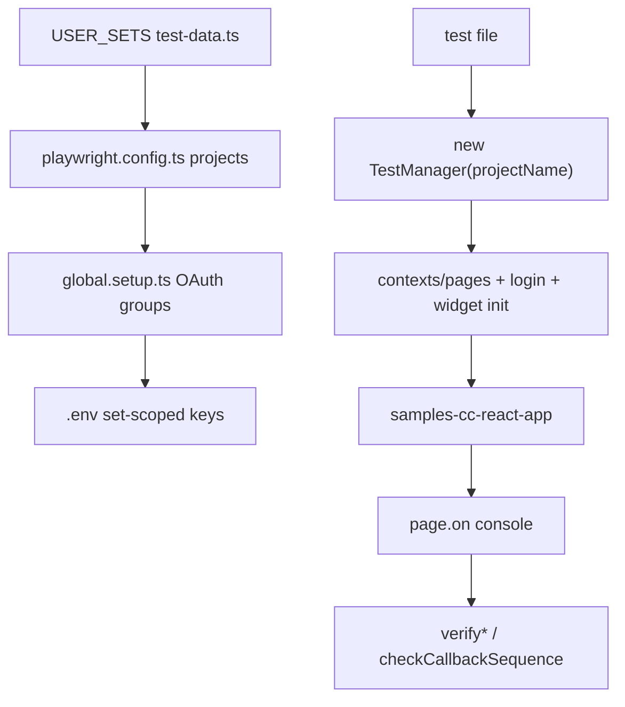
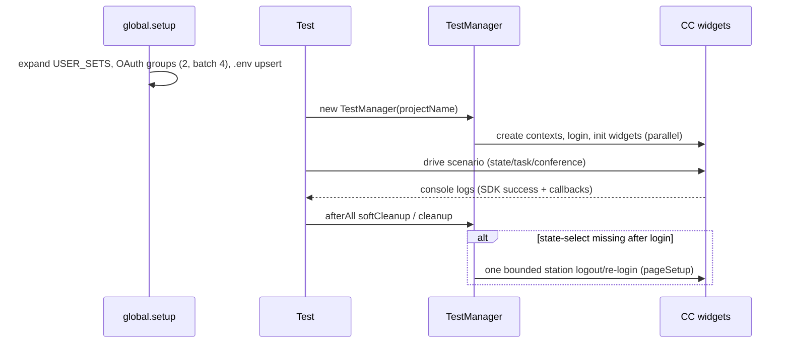
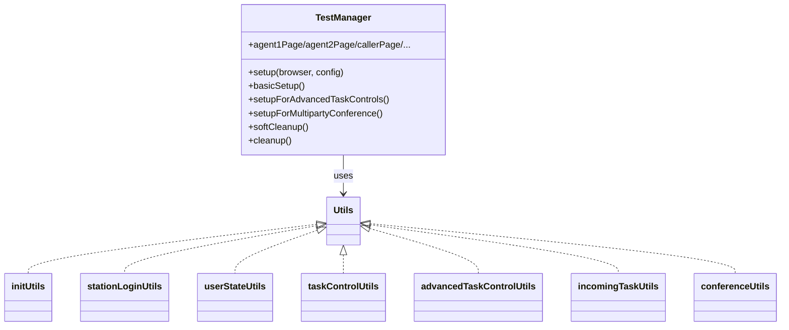

# cc_playwright (Contact Center E2E) — SPEC

> Start here → root [`AGENTS.md`](../../AGENTS.md) (agent entry) · router [`SPEC_INDEX.md`](../../ai-docs/SPEC_INDEX.md) · system [`ARCHITECTURE.md`](../../ai-docs/ARCHITECTURE.md). This is the module's canonical spec.
> Context-efficiency: link to canonical docs — don't duplicate them.

## Metadata
| Field | Value |
|---|---|
| Module id | `cc_playwright` |
| Source path(s) | `cc_playwright/playwright/` (suites, tests, Utils, test-manager.ts, test-data.ts, constants.ts, global.setup.ts), `playwright.config.ts` |
| Parent spec | — |
| Doc kind | Module spec |
| Coverage score | Pending coverage assessment |
| Generated from | `module-spec` @ SDLC template library `0.2.2` |
| generated_by / approved_by / updated_at | claude-cli / pending / 2026-08-05T00:00:00Z |
| Validation status | not-run |

## Evidence Rules
Migrated from `cc_playwright/ai-docs/AGENTS.md` (runbook/workflow) and `cc_playwright/ai-docs/ARCHITECTURE.md` (framework reference), both grounded in the `playwright/` source tree. Baseline suite/set names and constants are taken verbatim from those docs (dated 2026-03-09); confidence is PRESENT where the doc quotes concrete files/constants, WEAK where it may drift from current code.

## Source Material Register
| Source material | Scope | Decision | Detail location or disposition |
|---|---|---|---|
| Reviewed prior E2E runbook | overview / tests | used | Workflow → Use Cases & Module Do's/Don'ts; commands → Stack; flakiness guardrails → Pitfalls; original retained. |
| Reviewed prior E2E framework architecture | architecture / tests | used | Layering/topology → Folder Structure & Design; TestManager/Utils/constants → Class Relationships & State Model; runtime flow → Data Flow & Sequence; original retained. |

## Overview
`cc_playwright` is the end-to-end testing framework for Contact Center widgets. It drives the `samples-cc-react-app` (served at `https://localhost:8000/samples/contact-center/`) through Playwright, validating agent station login, user-state changes, incoming task handling, basic/advanced task controls, dial-number, and multiparty-conference flows against real Webex Contact Center backends. Structure layers Playwright **projects (sets)** → **suites** → **test factories** → shared **Utils/TestManager/constants**.

## Purpose / Responsibility
Owns automated browser E2E coverage of Contact Center widget behavior and the reusable setup/teardown/assertion framework that supports it. It does NOT own SDK/product source, backend services, or unit-test coverage.

## Stack
Playwright (`@playwright/test`), TypeScript. Config in `playwright.config.ts`; app booted via `webServer: yarn samples:serve --port 8000`. Chrome launched with fake-media flags for telephony/WebRTC. Run via `yarn test:e2e` (and `--project=SET_X`).

## Folder / Package Structure
```
cc_playwright/playwright/
├── suites/          # *-tests.spec.ts — one suite per set (TEST_SUITE binding)
├── tests/           # *-test.spec.ts — test factory logic
├── Utils/           # controlUtils, initUtils, helperUtils, incomingTaskUtils,
│                    #   stationLoginUtils, userStateUtils, taskControlUtils,
│                    #   advancedTaskControlUtils, wrapupUtils, conferenceUtils
├── test-manager.ts  # setup/teardown orchestrator
├── test-data.ts     # USER_SETS: set → suite mapping + set data
├── constants.ts     # enums/objects + timeout hierarchy
├── global.setup.ts  # OAuth + set-scoped env expansion
└── ai-docs/         # AGENTS.md, ARCHITECTURE.md (retained sources)
```

## Key Files (source of truth)
| File | Holds |
|---|---|
| `playwright/test-data.ts` | `USER_SETS` — set definitions and suite mapping (source of truth for what runs) |
| `playwright.config.ts` | Project generation from `USER_SETS`, browser/runtime config, `webServer`, Chrome media flags, `globalTimeout: 180000`, retries `1` |
| `playwright/test-manager.ts` | `TestManager` — contexts/pages, login/widget init, `softCleanup`/`cleanup` |
| `playwright/constants.ts` | `USER_STATES`, `LOGIN_MODE`, `PAGE_TYPES`, `TASK_TYPES`, `WRAPUP_REASONS`, `RONA_OPTIONS`, `CONSOLE_PATTERNS`, timeout hierarchy |
| `playwright/global.setup.ts` | OAuth group generation (size 2, `OAUTH_BATCH_SIZE=4`), env upsert |

## Public Surface
Internal Surface — internal test framework, not a published contract.
| Contract ID | Type | Surface | Purpose | Compatibility / deprecation | Schema / detail link | Root index |
|---|---|---|---|---|---|---|
| `cc_playwright.TestManager` | internal | `new TestManager(projectName, maxRetries?)` + `setup`/`basicSetup`/`setupFor*`/`softCleanup`/`cleanup` | Per-set orchestration of contexts, login, widget init, cleanup | internal | `playwright/test-manager.ts` | — |
| `cc_playwright.Utils` | internal | helper exports per Utils file | Shared login/state/task/conference operations + console-log assertions | internal | `playwright/Utils/*.ts` | — |

## Requires (dependencies)
- `samples-cc-react-app` served locally (`yarn samples:serve --port 8000`).
- Webex Contact Center backends (agent/task/telephony) and OAuth tokens per user set.
- Chrome with fake media flags (`--use-fake-ui-for-media-stream`, `--use-fake-device-for-media-stream`, `--use-file-for-fake-audio-capture=...`, unique `--remote-debugging-port`).
- Dial-number OAuth token when configured.

## Requirements
| ID | WHAT | WHY | Source Evidence | Test / Example Evidence | Assumptions / Gaps | Confidence |
|---|---|---|---|---|---|---|
| `CCE2E-R-001` | Playwright projects are generated from `USER_SETS`; project name = set key, `testMatch = **/suites/${TEST_SUITE}`, worker count = number of sets, per-project retries 1, global timeout 180000 | Data-driven set/suite execution | `playwright.config.ts` | baseline sets SET_1..SET_9 | verbatim from ARCHITECTURE (2026-03-09) | PRESENT |
| `CCE2E-R-002` | `global.setup.ts` expands `USER_SETS` into set-scoped env keys and runs OAuth in dynamic groups of 2 (batch size 4), writing one `.env` upsert | Efficient parallel token collection | `playwright/global.setup.ts` | 5 groups for SET_1..SET_9 | none | PRESENT |
| `CCE2E-R-003` | `TestManager.setup` runs a 3-phase flow: create contexts/pages, run login+widget setup in parallel, register console logging | Deterministic per-set bootstrap | `playwright/test-manager.ts` | SetupConfig defaults documented | none | PRESENT |
| `CCE2E-R-004` | Console-log verification asserts SDK success logs + callback ordering (`checkCallbackSequence`) for state/task-control operations | Assertions depend on callback/API event ordering | `playwright/Utils/userStateUtils.ts`, `taskControlUtils.ts`, `advancedTaskControlUtils.ts` | verify* helpers | none | PRESENT |
| `CCE2E-R-005` | Conference sets (7/8/9) consolidate repeated call-init flows while keeping scenario IDs explicit in test titles; skip policy retains `EP_DN`/>4-agent scenarios as `test.skip` | Runtime parity + traceability | `playwright/tests/multiparty-conference-set-*.spec.ts` | documented combined groups | may drift; confirm against code | WEAK |

## Design Overview
The framework is data-driven: `USER_SETS` in `test-data.ts` is the single source of truth mapping each set to a suite and its data; `playwright.config.ts` generates one project per set. `TestManager` (constructed with the project/set key) resolves set-scoped env values, creates only the browser contexts/pages a scenario needs, performs login/widget init, and provides `softCleanup` (stray tasks) and `cleanup` (full logout + context close). Console-log monitoring is a first-class assertion pattern.

## Data Flow


## Sequence Diagram(s)
Sequence coverage:

| Operation group | Diagram | Failure / recovery coverage |
|---|---|---|
| Suite setup → run → cleanup | Lifecycle sequence | pageSetup bounded logout/re-login recovery; best-effort cleanup guards |



## Class / Component Relationships


## Use Cases
- **UC-1 Add/update a scenario:** follow the extension order — `tests/*.spec.ts` → `suites/*.spec.ts` → `test-data.ts` → `test-manager.ts`/`Utils/*` → `global.setup.ts`/`playwright.config.ts` → update `ai-docs`. Evidence: `ARCHITECTURE.md` Extension Points.
- **UC-2 Run a set:** `yarn test:e2e --project=SET_1`. Evidence: `AGENTS.md` Common Commands.

UI flow: multi-screen agent/caller/extension/chat pages driven per scenario (see UI Flow).

## State Model
<!-- module.holds_client_state = true -->
`TestManager` holds per-set page/context state (`agent1Page`, `agent2Page`, `agent3/4Page` for conference, `callerPage`, `agent1ExtensionPage`, `chatPage`, `multiSessionAgent1Page`, `dialNumberPage`), created only when the `SetupConfig` enables them. Agent user-state (`USER_STATES`: MEETING/AVAILABLE/LUNCH/RONA/ENGAGED/AGENT_DECLINED) is driven and validated through `userStateUtils`.

## Concurrency & Reactive Flow
<!-- module.is_concurrent_async = true -->
- Playwright runs one worker per set (parallel sets). OAuth setup runs groups in parallel (size 2, batch 4).
- Contexts/pages and independent login flows are created in parallel within `setup`; station-login init runs sequentially (main then multi-session) to reduce contention.
- Conference cleanup runs **sequentially** across shared-call agents to avoid leg-ownership races; mixed incoming digital tasks are created/accepted sequentially to reduce RONA races.
- Pre-start the web server for parallel runs to avoid port races.

## UI Flow
<!-- module.ui_multi_screen = true -->
Scenarios span multiple agent/caller/extension/chat browser pages. Key states include station login (Desktop/Extension/Dial Number), user-state selection (`state-select`), incoming task accept/decline, task controls (hold/record/end), consult/transfer, and conference legs. Non-happy-path handling: RONA popups (`submitRonaPopup`), bounded logout/re-login recovery when `state-select` is missing, and guarded cleanup when setup never reached user-state visibility.

## Pitfalls
- Queue routing will **not** re-route to an agent who RONA'd in the same call session — use different agents for queue-routed consults after a RONA test.
- Conference pages render **dual** control groups (simple + CAD); `handleStrayTasks` iterates all end-call buttons to find the enabled one.
- After a call ends, the caller Make Call button may stay disabled; clicking `#sd-get-media-streams` re-enables it (known TODO workaround).
- Agent may not immediately appear in consult/transfer popover; `performAgentSelection` retries up to 3 times.
- Consult lobby leg states settle asynchronously — poll for `Engaged` before strict equality assertions.

## Module Do's / Don'ts
<!-- module.module_specific_conventions = true -->
- DO reuse existing Utils helpers before adding new ones; keep tests independently runnable per set/suite.
- DO prefer explicit state assertions over blind waits; fix root causes before increasing timeouts; choose the smallest fitting timeout.
- DON'T document future/nonexistent sets or suites before they exist in code.
- DON'T run shared-call conference cleanup in parallel.

## Key Design Trade-off
<!-- module.has_design_tradeoff = true -->
- Conference scenario **consolidation** (merging sequentially-compatible call-init flows into single tests) trades one-scenario-per-test granularity for runtime efficiency, preserving traceability by keeping scenario IDs explicit in test titles.

## Test-Case Strategy (module)
This module IS the test suite. Its own quality strategy: keep set/suite mapping in `test-data.ts` authoritative, assert via console-log/callback-sequence verification, use the timeout hierarchy deliberately, and keep setup/cleanup deterministic and best-effort-guarded.

| Behavior / Requirement | Existing test evidence | Gap |
|---|---|---|
| `CCE2E-R-001` | `playwright.config.ts` + baseline suites | confirm current set list vs docs |
| `CCE2E-R-004` | `verify*` helpers in Utils | none |
| `CCE2E-R-005` | conference set-7/8/9 test files | confirm combined-group titles vs code |

## Traceability
- Repo architecture: [`../../ai-docs/ARCHITECTURE.md`](../../ai-docs/ARCHITECTURE.md) · Registry: [`../../ai-docs/SPEC_INDEX.md`](../../ai-docs/SPEC_INDEX.md)
- Coverage state & contracts baseline: `.sdd/manifest.json`
