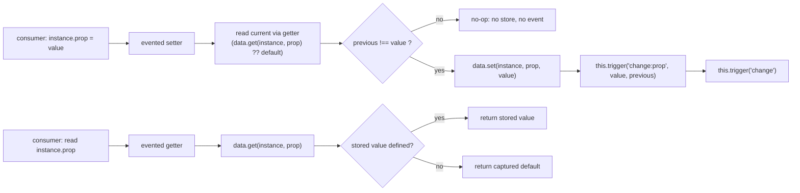
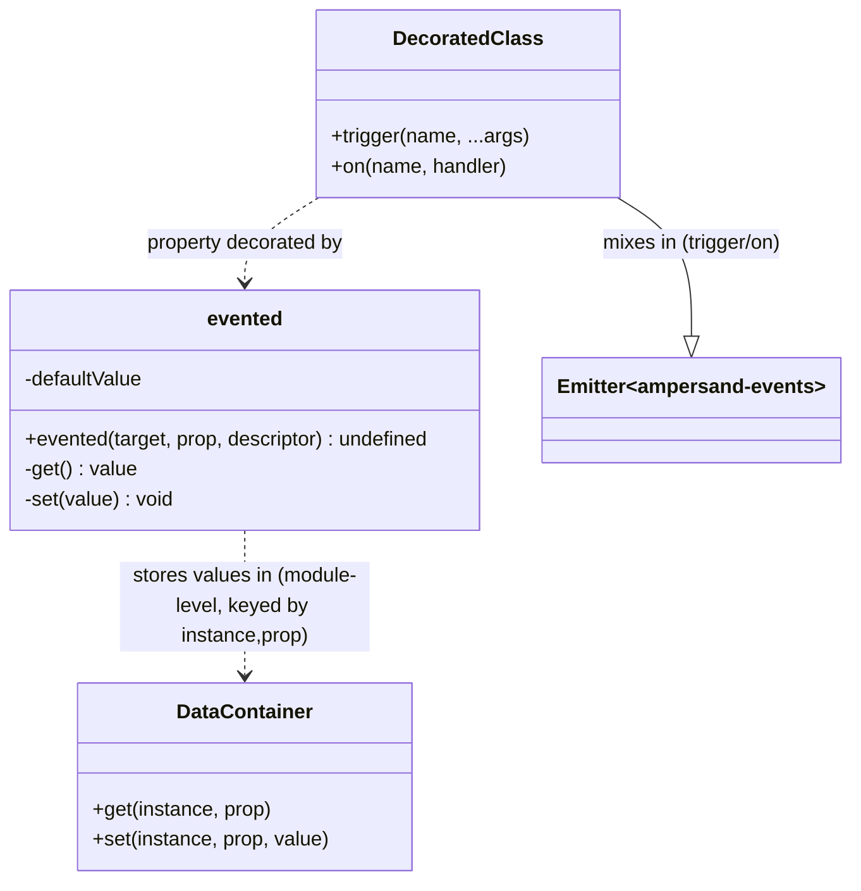

# common-evented — SPEC

> Start here → root [`AGENTS.md`](../../../../AGENTS.md) (agent entry) · router [`SPEC_INDEX.md`](../../../../ai-docs/SPEC_INDEX.md) · system [`ARCHITECTURE.md`](../../../../ai-docs/ARCHITECTURE.md). This is the module's canonical spec: orientation, requirements, design, flows, state, protocol, UI, data, and tests. (Multi-repo: the root `AGENTS.md` may be the workspace-level one.)
> Context-efficiency: link to canonical docs — don't duplicate them. Load specs on demand per `SPEC_INDEX.md`.

## Metadata
| Field | Value |
|---|---|
| Module id | `common-evented` |
| Source path(s) | `packages/@webex/common-evented/` |
| Doc kind | Module spec |
| Coverage score | 81% (13/16) assessed 2026-07-28; critical 8/8, important 2/5 (concurrency n/a — synchronous decorator), polish 3/3; sole `evented` export + both change events grounded in src/index.js + test/unit; CE-R-003/004/005 WEAK (untested); held at Partial (PR-churn gate unverifiable on shallow clone; no independent-runtime validator pass) |
| Generated from | `module-spec` @ SDLC template library `0.2.1` |
| generated_by / approved_by / updated_at | generated_by: doc-backfill (assess-only-bootstrap runtime) · approved_by: unassigned · updated_at: 2026-07-28 |
| Validation status | not-run |

Coverage score: `Pending coverage assessment` before the first report; after assessment, replace with
`<0-100%>` plus the assessment date and short evidence summary. Do not link or cite local generated
coverage or validation report paths from this committed metadata. Manifest coverage state for this
module is **Partial** (code-derived backfill; the code under `packages/@webex/common-evented/src/` is
the source of truth). Keep manifest coverage state outside the rendered module doc metadata.

## Evidence Rules
Every generated requirement below must cite concrete source evidence using `file path`. Separate source
evidence, test evidence, examples, assumptions, and gaps so validators and future agents can distinguish
truth from context. Test evidence is preferred for WHY. Commit evidence is allowed only when the
repository policy says history is reliable, and must include the commit hash. If evidence is missing or
conflicting, ask a focused discovery question before finalizing the requirement; record unresolved answers
as approved unknowns only when the human explicitly defers or does not know.

This is a code-derived backfill: there are **no routed prior source docs** for this module
(`.sdd/manifest.json` → `modules[].source_policy.existing_sources` is empty). WHAT is derived from the
single export's signature and behavior; WHY is derived from unit-test `it(...)` intent and the package
README usage example. Although the repository category is `cat1-legacy`, commit-message WHY is **not**
available here: the working clone is shallow (a single squashed commit `commit:e3d667d`), so no
introducing-commit history could be read. WHY therefore rests on tests and README only.

## Source Material Register
| Source material | Scope | Decision | Detail location or disposition |
|---|---|---|---|
| Module source (`packages/@webex/common-evented/src/index.js`) | overview / API | used | The `evented` decorator's signature, getter/setter behavior, off-instance storage, and event emission migrated by meaning into Overview, Public Surface, Requirements, Data Flow, and design sections below. |
| Module unit tests (`packages/@webex/common-evented/test/unit/spec/evented.js`) | tests | used | Intent (WHY) and confidence for event-emission requirements derived from the `it(...)` assertions; mapped in Requirements and Test-Case Strategy. |
| Package README (`packages/@webex/common-evented/README.md`) | overview | reference-only | Consumer usage example (`class X extends Events { @evented prop = null }`); supports Overview, Use Cases, and the emitter-mixin precondition; not treated as authoritative over code. |
| Dependency source (`packages/@webex/common/src/template-container.js`) | API | reference-only | `make(WeakMap, Map)` container factory used for off-instance value storage; behavior confirmed to support the two-key `(instance, prop)` access pattern. |
| Native contract source | API | none | No OpenAPI/AsyncAPI/proto/GraphQL/JSON-Schema in this module; contract is the exported JS API surface plus the emitted change-event names (see root `CONTRACTS.md`). |

## Overview
`@webex/common-evented` is a single-purpose utility package: it exports one legacy class-property
decorator, `evented`, that turns a plain class property into a change-tracking getter/setter pair. When
a decorated property is assigned a new value, the setter emits Backbone/Ampersand-style change events
(`change:<prop>` and a generic `change`) on the owning instance so observers can react to model
mutations without the class author hand-writing accessors.

The entire module is one file, `src/index.js`. The decorator has no state of its own beyond a single
module-level container (`const data = new (make(WeakMap, Map))()`) that stores each instance's property
values off-instance, keyed by `(instance, prop)`. Because storage is keyed on the instance in a
`WeakMap`, decorated values are garbage-collected with their owning object and never appear as an
enumerable own-property on the instance.

The decorator is purely synchronous and framework-adjacent: it assumes the decorated class mixes in an
event emitter that provides a `trigger(name, ...args)` method (the SDK uses `ampersand-events`, as shown
in the README and exercised in the unit test). It performs no I/O, owns no persistence, and exposes no
network surface. A maintainer should start and end at `src/index.js`.

## Purpose / Responsibility
Owns one thing: a class-property decorator that converts a property into an accessor pair whose setter
fires `change:<prop>` and `change` events when (and only when) the value actually changes. Does NOT own
the event system itself (that is the consumer's emitter mixin, e.g. `ampersand-events`), any async
control flow, persistence, or network I/O.

## Stack
JavaScript (ES module using a **legacy stage-1 property decorator** signature
`(target, prop, descriptor)` with an `initializer`), transpiled via Babel (`babel.config.js`,
`@webex/babel-config-legacy`). Depends on `@webex/common` (`workspace:*`) for the `make` container
factory. Build: `webex-legacy-tools build` → `dist/` (`package.json` `scripts.build:src`); browser build
flagged via `process` (`module.exports = {browser: true}`). Test stack: Jest via
`webex-legacy-tools test --unit --runner jest`, with Chai (`@webex/test-helper-chai`) and Sinon.

## Folder / Package Structure
```
packages/@webex/common-evented/
├── src/
│   └── index.js                    # the entire module: the `evented` default-export decorator
├── test/
│   └── unit/spec/evented.js        # unit spec for the decorator's event behavior
├── package.json                    # name, deps (@webex/common), build/test scripts
├── README.md                       # consumer usage example
├── process                         # build flag: {browser: true}
├── babel.config.js                 # Babel (legacy decorators) config
├── jest.config.js                  # Jest runner config
└── .eslintrc.js                    # lint config
```

## Key Files (source of truth)
| File | Holds |
|---|---|
| `packages/@webex/common-evented/src/index.js` | The authoritative behavior: the `evented` decorator, the off-instance `data` container, getter/setter definitions, and the `change:<prop>` / `change` event emission. |
| `packages/@webex/common-evented/package.json` | Public identity (`name` = `@webex/common-evented`), the `@webex/common` dependency, and build/test wiring. |

## Public Surface
| Contract ID | Type | Surface | Purpose | Compatibility / deprecation | Schema / detail link | Root index |
|---|---|---|---|---|---|---|
| `common-evented.evented` | SDK (decorator, default export) | `@evented` applied to a class property; signature `(target, prop, descriptor)` | Convert a class property into a getter/setter that emits change events on assignment | Stable default export; legacy stage-1 decorator signature — a breaking change requires a major bump | `packages/@webex/common-evented/src/index.js` | [`CONTRACTS.md`](../../../../ai-docs/CONTRACTS.md) |
| `common-evented.event.change:<prop>` | event | Emitted on the decorated instance as `change:<prop>` with args `(value, previous)` | Notify observers of a specific property's change | Event name is a public contract; renaming is breaking | `packages/@webex/common-evented/src/index.js` | [`CONTRACTS.md`](../../../../ai-docs/CONTRACTS.md) |
| `common-evented.event.change` | event | Emitted on the decorated instance as the generic `change` (no args) | Notify observers that some evented property changed | Event name is a public contract; renaming is breaking | `packages/@webex/common-evented/src/index.js` | [`CONTRACTS.md`](../../../../ai-docs/CONTRACTS.md) |

Compatibility notes:
- Adding behavior that preserves the `(target, prop, descriptor)` decorator contract and the two emitted
  event names/signatures is a minor. Changing the decorator signature, the event names, or the
  `change:<prop>` argument order (`value`, then `previous`) is a **major** breaking change (see root
  `CONTRACTS.md` → Compatibility & Deprecation Policy).

## Requires (dependencies)
- **`@webex/common` (`workspace:*`)** — provides `make(...containers)` (from `template-container.js`),
  used as `make(WeakMap, Map)` to build the two-level off-instance value store. Version is workspace-synced.
- **Consumer-supplied event emitter (peer expectation, not an npm dependency)** — the decorated class
  **must** provide a `trigger(name, ...args)` method (Backbone/Ampersand-style). The SDK uses
  `ampersand-events` (a `devDependency` here, mixed into the class by the consumer). If `trigger` is
  absent, the setter throws a `TypeError` on first assignment. See Pitfalls.

## Requirements
| ID | WHAT | WHY | Source Evidence | Test / Example Evidence | Assumptions / Gaps | Confidence |
|---|---|---|---|---|---|---|
| `CE-R-001` | The default export `evented(target, prop, descriptor)` is a class-property decorator that replaces the property's value/initializer with a getter/setter pair (deletes `descriptor.value`, `descriptor.initializer`, `descriptor.writable`; assigns `descriptor.get`/`descriptor.set`). | Lets a class author declare a plain property (`@evented prop = null`) and get change-event behavior without hand-writing accessors. | `packages/@webex/common-evented/src/index.js` | `packages/@webex/common-evented/test/unit/spec/evented.js` (decorator applied to `EventedClass.prop`; README usage example) | none | PRESENT |
| `CE-R-002` | On assignment where the new value differs from the current value, the setter emits `change:<prop>` with `(value, previous)` and then the generic `change` event on the instance. | Observers must be notified of specific and generic property changes. | `packages/@webex/common-evented/src/index.js` | `packages/@webex/common-evented/test/unit/spec/evented.js` ("fires a specific change event", "fires a generic change evnet", "fires the all event" → `all` spy called twice) | none | PRESENT |
| `CE-R-003` | When an assignment sets the same value as the current one (compared with strict `!==`), the setter stores nothing new and emits **no** events. | Avoids spurious change notifications for no-op writes (identity-based dedupe). | `packages/@webex/common-evented/src/index.js` | None found (no unit test exercises the unchanged-value path) | Inferred invariant; uses reference equality, so equal-but-distinct objects still fire. Uncovered by tests. | WEAK |
| `CE-R-004` | The getter returns the last stored value for `(instance, prop)`; when none is stored it returns the property's original initializer default (captured once at decoration time). | Reading a never-assigned property must yield its declared default, not `undefined`. | `packages/@webex/common-evented/src/index.js` | None found (no unit test reads the default or a post-assignment value) | Inferred from `descriptor.initializer && descriptor.initializer()` capture and the `typeof value !== 'undefined'` guard. The default is captured once at class-definition time, shared across instances. Uncovered by tests. | WEAK |
| `CE-R-005` | Property values are stored off-instance in a single module-level two-level container `make(WeakMap, Map)` keyed by `(instance, prop)`, not as an own-property on the instance. | Keeps the decorated value out of the instance's enumerable properties and avoids setter recursion; ties value lifetime to the instance via `WeakMap` for GC. | `packages/@webex/common-evented/src/index.js`; `packages/@webex/common/src/template-container.js` | None found (storage location is not directly asserted by a test) | Inferred invariant; container is shared across all decorated classes but keyed per-instance so values do not collide. Uncovered by tests. | WEAK |
| `CE-R-006` | The decorated class must mix in an event emitter exposing `trigger(name, ...args)`; the setter calls `this.trigger(...)` and there is no fallback if it is missing. | Event emission is delegated to the consumer's emitter (the SDK standard is `ampersand-events`), keeping this module a thin decorator. | `packages/@webex/common-evented/src/index.js` | `packages/@webex/common-evented/test/unit/spec/evented.js` (`Object.assign(EventedClass.prototype, Events)` from `ampersand-events`); README (`class X extends Events`) | Precondition is demonstrated by the test/README setup rather than asserted negatively; the missing-`trigger` failure path is untested. | PRESENT |

Do not merge multiple unrelated behaviors into one requirement.

## Design Overview
The decorator runs once per decorated property at class-definition time. It first captures the
declared default by invoking `descriptor.initializer` (if present), then strips the data-property fields
(`value`, `initializer`, `writable`) from the descriptor and installs accessor functions in their place,
converting a data property into an accessor property.

Value storage is deliberately kept off the instance. A single module-level container built with
`make(WeakMap, Map)` maps `instance → (prop → value)`. The getter reads `data.get(this, prop)`; if that
is `undefined` it falls back to the captured default. The setter reads the current value via `this[prop]`
(i.e. through the getter), compares it to the incoming value with strict `!==`, and only on a real change
does it write `data.set(this, prop, value)` and fire the two events. This ordering — read-through-getter,
compare, then store-and-notify — is what makes the "no event on unchanged value" behavior (CE-R-003)
fall out naturally, and what keeps the default (CE-R-004) authoritative until the first real write.

The module owns no event machinery; it calls `this.trigger`, delegating the actual pub/sub to the
consumer's emitter. This is why `@webex/common-evented` pairs with `ampersand-events` everywhere it is
used.

## Data Flow


## Sequence Diagram(s)
Sequence coverage:

| Operation group | Diagram | Failure / recovery coverage |
|---|---|---|
| Set / read an `@evented` property | "Assign a decorated property" | `alt` branch for the unchanged-value no-op; `Note` for the missing-`trigger` TypeError failure path |

This is a single-operation module (one property decorator whose only behaviors are set and read), so a
single sequence diagram is sufficient and valid per the template's one-operation rule.

```mermaid
sequenceDiagram
  participant C as Consumer code
  participant I as Decorated instance (evented getter/setter)
  participant D as data container (WeakMap→Map)
  participant E as Emitter mixin (this.trigger)

  C->>I: instance.prop = value
  I->>I: previous = this[prop]  (getter read-through)
  I->>D: get(instance, prop)
  D-->>I: stored value or undefined
  Note over I: getter returns stored value, else captured default
  alt previous !== value (changed)
    I->>D: set(instance, prop, value)
    I->>E: trigger("change:prop", value, previous)
    I->>E: trigger("change")
    Note over E: if trigger is absent → TypeError (unhandled; consumer must mix in an emitter)
  else previous === value (unchanged)
    I-->>C: no store, no events
  end

  C->>I: read instance.prop
  I->>D: get(instance, prop)
  D-->>I: stored value or undefined
  I-->>C: stored value, else captured default
```

## Class / Component Relationships

`evented` is a free function decorator, not a class. It closes over one module-level `DataContainer`
(`make(WeakMap, Map)`) shared by every decorated property across the process, but keyed per
`(instance, prop)` so values never collide. The decorated class supplies the emitter behavior (`trigger`)
by mixing in `ampersand-events` (or any compatible emitter).

## Use Cases
- **UC-1 Declare an observable property:** A model author writes `@evented prop = null` on a class that
  mixes in an event emitter → the property becomes a getter/setter → assigning it later fires change
  events. Outcome: observers registered with `on('change:prop', …)` / `on('change', …)` are notified.
  Evidence: `packages/@webex/common-evented/src/index.js`, `packages/@webex/common-evented/README.md`.
- **UC-2 React to a change:** A consumer subscribes with `instance.on('change:prop', handler)` and
  assigns a new value → the specific handler and any generic `change` / `all` handlers run. Outcome:
  handler receives `(value, previous)` for the specific event. Evidence:
  `packages/@webex/common-evented/test/unit/spec/evented.js` (specific, generic, and `all` spies).

## Pitfalls
Latent edges of this decorator — several are **inferred invariants** the code relies on but no test pins
down (marked *inferred* vs *confirmed*):
- **Reference-equality dedupe (inferred).** The setter's change guard is `previous !== value` — strict
  inequality. Assigning a *distinct* object/array with the same contents is treated as a change and fires
  events; assigning the identical reference is a silent no-op. Callers expecting value-equality semantics
  will be surprised. `packages/@webex/common-evented/src/index.js` (see CE-R-003; untested).
- **Initializer default is captured once, shared across instances (inferred).** `descriptor.initializer`
  is invoked a single time at class-definition and closed over as `defaultValue`; it is not re-run per
  instance. A mutable default (e.g. `@evented items = []`) is shared until an instance is assigned its
  own value. `packages/@webex/common-evented/src/index.js` (see CE-R-004; untested).
- **Missing `trigger` throws on first write (confirmed by code).** If the decorated class does not mix in
  an emitter exposing `trigger`, the setter throws a `TypeError` on the first changing assignment — there
  is no fallback. Always mix in `ampersand-events` (or compatible) before use.
  `packages/@webex/common-evented/src/index.js` (see CE-R-006; missing-emitter path untested).
- **Value lives off-instance (inferred).** The decorated value is not an enumerable own-property; it is
  stored in a single module-level `make(WeakMap, Map)` container keyed by `(instance, prop)`. Code that
  serializes or spreads the instance's own enumerable properties will not see the decorated value.
  `packages/@webex/common-evented/src/index.js`; `packages/@webex/common/src/template-container.js`
  (see CE-R-005; untested).
- **Emit order is `change:<prop>` then generic `change` (confirmed).** Handlers must not assume the
  generic `change` fires first; `change:<prop>` carries `(value, previous)` while `change` carries no
  args. Confirmed by the `all`-event test asserting two calls per change.

## Module Do's / Don'ts
- DO: mix an `ampersand-events`-compatible emitter into any class that uses `@evented`, so `trigger`
  exists before the first assignment.
- DO: rely on `change:<prop>` receiving `(value, previous)` in that order.
- DON'T: assume assigning an equal-by-value but distinct object (new array/object with same contents)
  is a no-op — the guard uses reference equality, so a distinct object fires events (CE-R-003).
- DON'T: expect the initializer default to be re-evaluated per instance — it is captured **once** at
  class-definition time and shared (CE-R-004).
- DON'T: treat the stored value as an own-property of the instance — it lives in the module-level
  `WeakMap→Map` container, not on the object (CE-R-005).

## Export Stability
The package publishes a single default export, `evented` (a decorator function). Because it is the sole
public surface, its signature `(target, prop, descriptor)` and the two emitted event names/signatures
constitute the entire semver contract:
- Adding an optional, backward-compatible capability while preserving the decorator signature and both
  event contracts = **minor**.
- Changing the decorator signature, renaming/removing the default export, renaming `change:<prop>` or
  `change`, or reordering the `change:<prop>` `(value, previous)` arguments = **major**.
The decorator uses the **legacy stage-1** decorator descriptor shape (with `initializer`); consumers must
transpile with a compatible legacy-decorators Babel config (`@webex/babel-config-legacy`). Migrating to
the TC39 standard decorators shape would be a breaking change to the descriptor contract.

## Key Design Trade-off
- **Off-instance value storage via a shared `WeakMap→Map` container** is chosen over storing the value on
  the instance (e.g. a `_prop` backing field). What it preserves: the decorated value never appears as an
  enumerable own-property, cannot collide with other fields, and is GC'd with its instance; the setter
  reads through the public getter without recursing into a backing field. What it costs: a single
  process-wide container holds references keyed by every decorated instance, and reasoning about where a
  value "lives" is less obvious than a plain backing field. `[NEEDS HUMAN INPUT]` — no test or comment
  states whether GC/leak behavior of the shared container was a measured concern or an incidental
  consequence of reusing `@webex/common`'s `make` helper.

## Test-Case Strategy (module)
Unit boundary: the decorator applied to a single property on a test class that mixes in
`ampersand-events`. Existing tests assert the **positive** event-emission paths only: a specific
`change:prop` fires once, a generic `change` fires once, and the `all` meta-event fires twice per change
(once for each emitted event). There are currently **no negative or edge tests**: the unchanged-value
no-op (CE-R-003), the default-value read and post-assignment read (CE-R-004), the off-instance storage
guarantee (CE-R-005), and the missing-`trigger` failure (CE-R-006) are all unexercised. Recommended
additions: assert no event fires when assigning the current value; assert the getter returns the
initializer default before first write and the stored value after; assert distinct instances do not
share values.

| Behavior / Requirement | Existing test evidence | Gap |
|---|---|---|
| `CE-R-001` (decorator installs accessors) | `packages/@webex/common-evented/test/unit/spec/evented.js` (indirect — behavior works) | No direct assertion that `value`/`initializer`/`writable` are removed |
| `CE-R-002` (emits `change:<prop>` + `change`) | `packages/@webex/common-evented/test/unit/spec/evented.js` | No assertion of `(value, previous)` argument values or emit order |
| `CE-R-003` (no event on unchanged value) | None found | Missing negative test for the no-op path |
| `CE-R-004` (getter default / stored value) | None found | Missing read-path tests (default before write; value after write) |
| `CE-R-005` (off-instance per-instance storage) | None found | Missing test that two instances don't share values |
| `CE-R-006` (requires `trigger` emitter) | `packages/@webex/common-evented/test/unit/spec/evented.js` (positive precondition satisfied) | Missing negative test for missing-`trigger` TypeError |

## Traceability
- Repo architecture: [`ARCHITECTURE.md`](../../../../ai-docs/ARCHITECTURE.md) · Registry: [`SPEC_INDEX.md`](../../../../ai-docs/SPEC_INDEX.md) · Contracts: [`CONTRACTS.md`](../../../../ai-docs/CONTRACTS.md)
- Coverage state & contracts baseline: `.sdd/manifest.json`
- Dependency: `@webex/common` container factory — [`common-spec.md`](../../common/ai-docs/common-spec.md)
