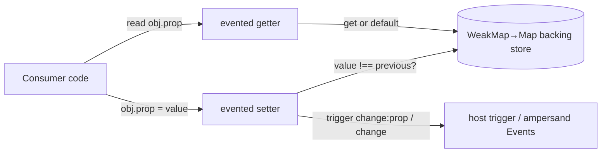
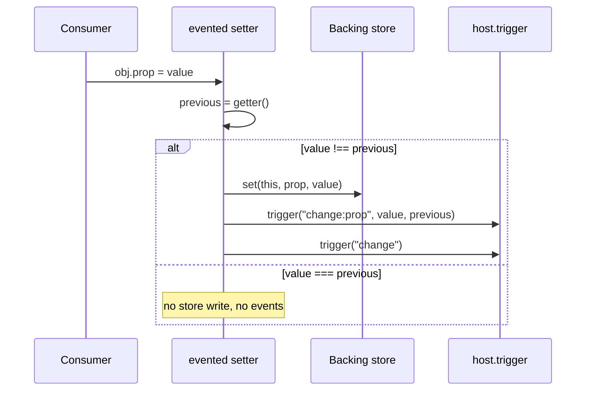
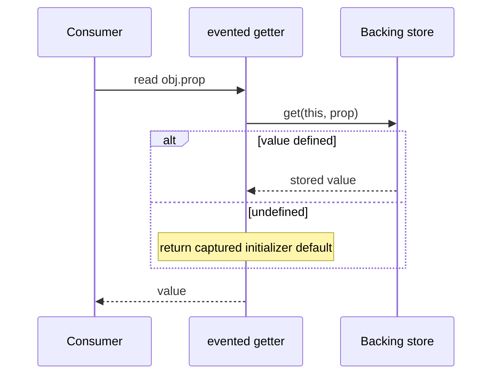
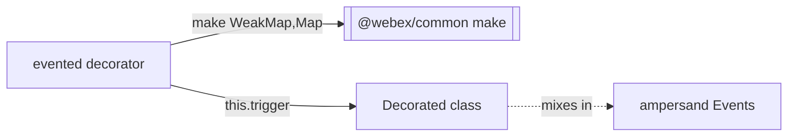

<!-- sdd-generated-metadata
generator: claude-cli
generator_model: us.anthropic.claude-opus-4-8
approved_by: pending-human-review
updated_at: 2026-08-06T00:00:00Z
validation_status: not-run
run_id: 51855eac-8de5-43a2-a3b6-dbcc55ebc91b
-->

# @webex/common-evented — SPEC

> Start here → root [`AGENTS.md`](../../../../AGENTS.md) (agent entry) · router [`SPEC_INDEX.md`](../../../../ai-docs/SPEC_INDEX.md) · system [`ARCHITECTURE.md`](../../../../ai-docs/ARCHITECTURE.md). This is the module's canonical spec: orientation, requirements, design, flows, and tests.
> Context-efficiency: link to canonical docs — don't duplicate them. Load specs on demand per `SPEC_INDEX.md`.

## Metadata

| Field | Value |
|---|---|
| Module id | `common-evented` |
| Source path(s) | `packages/@webex/common-evented/src/` |
| Parent spec | `packages/@webex/common/ai-docs/common-spec.md` (peer utility library; `common-evented` depends on `@webex/common`) |
| Doc kind | Module spec |
| Coverage score | Pending coverage assessment |
| Generated from | `module-spec` @ SDLC template library `0.2.2` |
| generated_by / approved_by / updated_at | claude-cli / pending-human-review / 2026-08-06 |
| Validation status | not-run, validator `pending`, assessed 2026-08-06 |

Coverage score is `Pending coverage assessment` until the first coverage review runs. Manifest coverage
state (`Partial`) is authoritative and kept in `.sdd/manifest.json`, not in this rendered metadata.

## Evidence Rules
Every requirement cites concrete source evidence using `file path`. Test evidence is preferred for WHY.
This package has a rich, trustworthy commit history (`cat1-legacy`), but the requirements below are
grounded in the current implementation and unit tests rather than commit archaeology.

## Source Material Register

| Source material | Scope | Decision | Detail location or disposition |
|---|---|---|---|
| `N/A` | none | none | No pre-existing SDD/AI-docs, architecture, or spec documents were routed to this module; content is derived from source and unit tests. |

## Overview

`@webex/common-evented` is a single-purpose utility package that exports one default: the `evented`
class-property decorator. Applying `@evented` to a class property rewrites it into a getter/setter pair
so that assigning a new value automatically fires ampersand-style change events (`change:<prop>` and the
generic `change`) on the host object.

The decorator is deliberately tiny. It keeps a per-instance/per-property value cache in a
`WeakMap`-of-`Map` container obtained from `@webex/common`'s `make` template-container helper, so the
backing store does not pollute the decorated object and does not leak instances. The host class is
expected to mix in an event emitter (ampersand `Events` or a compatible `trigger` implementation); the
decorator itself only calls `this.trigger(...)`.

A maintainer should start at `src/index.js` — the entire behavior lives in that one function.

## Purpose / Responsibility

Owns exactly one thing: converting a plain class property into an observable property that emits change
events when its value actually changes. It does NOT own the event-emitter implementation (that is
provided by the host via `ampersand-events` or an equivalent `trigger`), and it does NOT own the
storage template container (that is `@webex/common`'s `make`).

## Stack

JavaScript (Babel legacy-decorator syntax), Node `>=18`. Built with `webex-legacy-tools build`
(`-js -ts -maps`). Unit tests run under Jest/Mocha via `webex-legacy-tools test --unit`, using
`@webex/test-helper-chai` and `sinon`. Runtime dependency: `@webex/common` (workspace). Peer/test
dependency `ampersand-events` supplies the event mixin the decorator triggers against.

## Folder / Package Structure

```
packages/@webex/common-evented/
├── src/
│   └── index.js          # The `evented` decorator (entire public surface)
└── test/
    └── unit/spec/        # Jest/Mocha unit tests for the decorator
```

## Key Files (source of truth)

| File | Holds |
|---|---|
| `packages/@webex/common-evented/src/index.js` | The complete `evented` decorator implementation, backing-store construction, and event-trigger logic |
| `packages/@webex/common-evented/package.json` | Public entry (`main`/`devMain`), the `@webex/common` runtime dependency, and build/test scripts |

## Public Surface

This package is published and consumed as an imported SDK/code API — there is no network, event-bus, or
CLI surface of its own. Its one export is a decorator symbol.

| Contract ID | Type | Surface | Purpose | Compatibility / deprecation | Schema / detail link | Root index |
|---|---|---|---|---|---|---|
| `common-evented.evented` | SDK | `default export evented(target, prop, descriptor)` | Class-property decorator that turns a property into an observable getter/setter firing `change:<prop>` and `change` | Stable default export; a signature change is a breaking (major) change for all consumers | `packages/@webex/common-evented/src/index.js` | `../../../../ai-docs/CONTRACTS.md` |

Compatibility notes:
- The default export and its decorator call convention are the semver-controlled surface; the emitted
  event names (`change:<prop>`, `change`) are part of the observable contract and changing them is a
  breaking change.

## Requires (dependencies)

- `@webex/common` (`workspace:*`) — provides `make`, used to build the `WeakMap`→`Map` backing store.
- A host object that implements `trigger(eventName, ...args)` — supplied by the decorated class,
  typically via the `ampersand-events` mixin (a dev/test dependency here). The decorator does not add the
  emitter itself.

## Requirements

| ID | WHAT | WHY | Source Evidence | Test / Example Evidence | Assumptions / Gaps | Confidence |
|---|---|---|---|---|---|---|
| `COMMON-EVENTED-R-001` | Applying `@evented` replaces the property's `value`/`initializer`/`writable` descriptor with a getter/setter pair. | A property must become an accessor so writes can be intercepted to emit change events. | `packages/@webex/common-evented/src/index.js` | `packages/@webex/common-evented/test/unit/spec/evented.js` | none identified | PRESENT |
| `COMMON-EVENTED-R-002` | The getter returns the cached value from the backing store, falling back to the captured initializer default when nothing has been set. | Consumers must read the current or default value transparently, as if it were a normal property. | `packages/@webex/common-evented/src/index.js` | `packages/@webex/common-evented/test/unit/spec/evented.js` | none identified | PRESENT |
| `COMMON-EVENTED-R-003` | The setter stores the new value only when it differs from the previous value, then fires `change:<prop>` (with new + previous) and a generic `change`. | Firing only on real changes prevents spurious event storms while still notifying observers of every meaningful update. | `packages/@webex/common-evented/src/index.js` | `packages/@webex/common-evented/test/unit/spec/evented.js` | none identified | PRESENT |
| `COMMON-EVENTED-R-004` | Backing values are stored in a `WeakMap`-of-`Map` container (via `@webex/common` `make`) keyed by instance and property, not on the object itself. | Off-object storage avoids polluting the decorated instance and lets instances be garbage-collected. | `packages/@webex/common-evented/src/index.js` | `packages/@webex/common-evented/test/unit/spec/evented.js` | Backing store is module-level (shared across all decorated classes); keyed by `(this, prop)` | PRESENT |

## Design Overview

The decorator captures the property's default at decoration time by invoking `descriptor.initializer()`,
then deletes `value`, `initializer`, and `writable` so the descriptor is purely an accessor. The getter
consults the shared `data` container (`new (make(WeakMap, Map))()`) with `data.get(this, prop)`; if that
is `undefined` it returns the captured default. The setter reads the current value through the getter,
compares by strict inequality, and — only on a real change — writes into the container and calls
`this.trigger(\`change:${prop}\`, value, previous)` followed by `this.trigger('change')`.

Because the store is created once at module load and keyed by both instance and property name, a single
container safely serves every class that uses the decorator without cross-talk between instances.

## Data Flow



## Sequence Diagram(s)

Sequence coverage:

| Operation group | Diagram | Failure / recovery coverage |
|---|---|---|
| Set a decorated property | 1. Property write with change detection | `opt` branch shows the no-op path when value is unchanged (no events fire) |
| Read a decorated property | 2. Property read with default fallback | Covers the uninitialized-value fallback to the captured default |

### 1. Property write with change detection



### 2. Property read with default fallback



## Class / Component Relationships



The `evented` function is a free function (property decorator). It depends on `@webex/common`'s `make`
for its backing store and on the decorated class supplying a `trigger` method (typically the
`ampersand-events` mixin, as the unit tests demonstrate).

## Use Cases

- **UC-1 Observe a property change:** a class mixes in `Events`, decorates a property with `@evented`,
  and a subscriber registers `on('change:prop', handler)`; assigning a new value invokes the handler
  once. Evidence: `packages/@webex/common-evented/src/index.js`, `packages/@webex/common-evented/test/unit/spec/evented.js`.
- **UC-2 Generic change notification:** a subscriber registers `on('change', handler)` and receives a
  callback on any decorated-property write. Evidence: `packages/@webex/common-evented/test/unit/spec/evented.js`.

## Error Handling & Failure Modes

| Condition | Signal (error/code/result) | Caller recovery |
|---|---|---|
| Host object has no `trigger` method | `TypeError` thrown from the setter when a decorated property is assigned | Mix in `ampersand-events` (or a compatible emitter) on the decorated class before assigning |
| Value assigned equal to current value | No error; setter is a silent no-op (no events) | Expected behavior — nothing to recover |

## Pitfalls

- The backing store is a single module-level container shared by all classes using the decorator; keys
  combine the instance and property name, so correctness depends on that composite key — do not assume a
  per-class store.
- Equality is strict (`!==`); assigning a structurally-equal but new object reference WILL fire change
  events, and mutating an object in place WON'T. Consumers relying on change events must reassign.
- The default value is captured once at decoration time from `initializer()`; it is not re-evaluated per
  instance construction.

## Test-Case Strategy (module)

Unit tests decorate a small class, mix in `ampersand-events`, and assert both the specific
`change:<prop>` event and the generic `change` event fire on assignment (positive path), and that the
`all` event fires twice (once per emitted event). Negative/no-op behavior (assigning an equal value) is a
recommended gap to confirm during validation.

| Behavior / Requirement | Existing test evidence | Gap |
|---|---|---|
| `COMMON-EVENTED-R-001` | `packages/@webex/common-evented/test/unit/spec/evented.js` | none identified |
| `COMMON-EVENTED-R-002` | `packages/@webex/common-evented/test/unit/spec/evented.js` | Default-fallback read is exercised implicitly; add an explicit uninitialized-read assertion |
| `COMMON-EVENTED-R-003` | `packages/@webex/common-evented/test/unit/spec/evented.js` | Add an explicit assertion that assigning an equal value fires no event |
| `COMMON-EVENTED-R-004` | `packages/@webex/common-evented/test/unit/spec/evented.js` | Off-object storage is not directly asserted |

## Traceability

- Repo architecture: [`ARCHITECTURE.md`](../../../../ai-docs/ARCHITECTURE.md) · Registry: [`SPEC_INDEX.md`](../../../../ai-docs/SPEC_INDEX.md)
- Contracts catalog: [`CONTRACTS.md`](../../../../ai-docs/CONTRACTS.md)
- Coverage state & contracts baseline: `.sdd/manifest.json`
