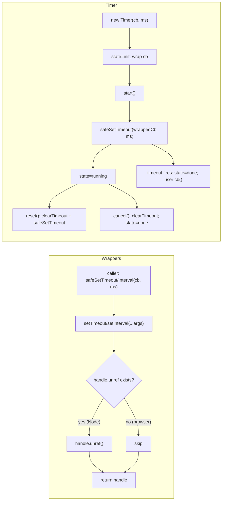
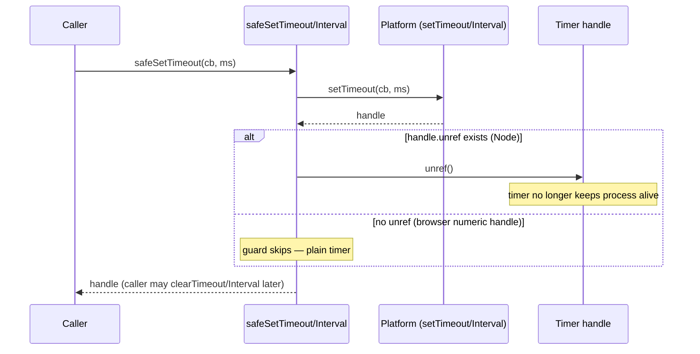
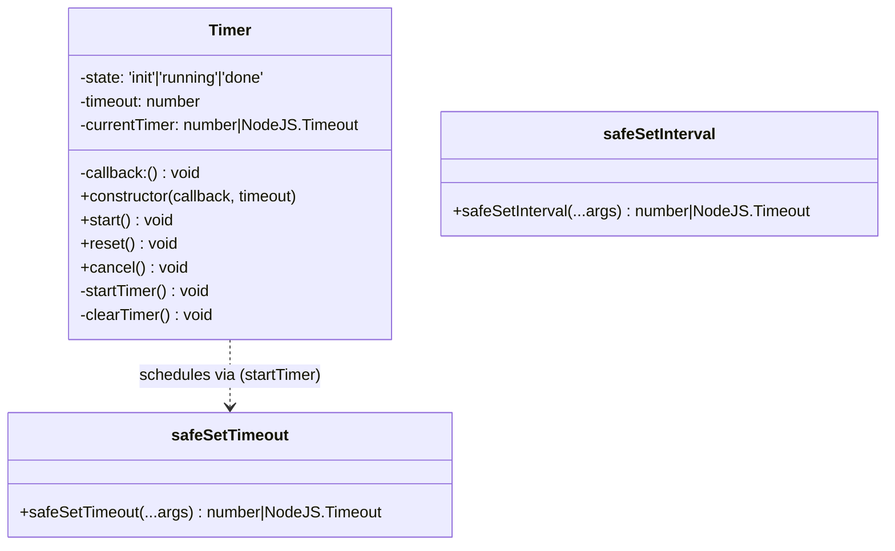
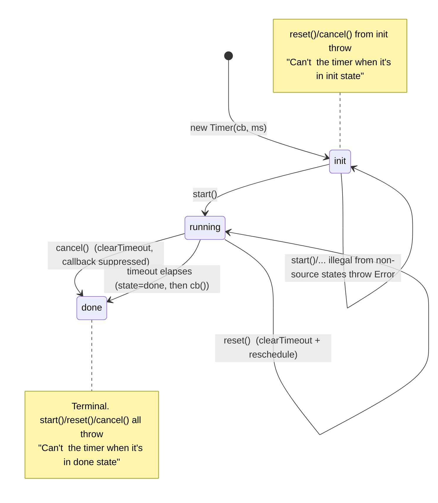

# common-timers — SPEC

> Start here → root [`AGENTS.md`](../../../../AGENTS.md) (agent entry) · router [`SPEC_INDEX.md`](../../../../ai-docs/SPEC_INDEX.md) · system [`ARCHITECTURE.md`](../../../../ai-docs/ARCHITECTURE.md). This is the module's canonical spec: orientation, requirements, design, flows, state, protocol, UI, data, and tests. (Multi-repo: the root `AGENTS.md` may be the workspace-level one.)
> Context-efficiency: link to canonical docs — don't duplicate them. Load specs on demand per `SPEC_INDEX.md`.

## Metadata
| Field | Value |
|---|---|
| Module id | `common-timers` |
| Source path(s) | `packages/@webex/common-timers/` |
| Doc kind | Module spec |
| Coverage score | 88% (14/16) assessed 2026-07-28; critical 8/8, important 3/5, polish 3/3; safeSetTimeout/safeSetInterval + Timer state machine grounded in src/index.ts + Sinon fake-timer tests (full state machine + error matrix); CT-R-003 (unref) WEAK (untested); held at Partial (PR-churn gate unverifiable on shallow clone; no independent-runtime validator pass) |
| Generated from | `module-spec` @ SDLC template library `0.2.1` |
| generated_by / approved_by / updated_at | generated_by: doc-backfill (assess-only-bootstrap runtime) · approved_by: unassigned · updated_at: 2026-07-28 |
| Validation status | not-run |

Coverage score: `Pending coverage assessment` before the first report; after assessment, replace with
`<0-100%>` plus the assessment date and short evidence summary. Do not link or cite local generated
coverage or validation report paths from this committed metadata. Manifest coverage state for this
module is **Partial** (code-derived backfill; the code under `packages/@webex/common-timers/src/` is
the source of truth). Keep manifest coverage state outside the rendered module doc metadata.

## Evidence Rules
Every generated requirement below must cite concrete source evidence using `file path`. Separate source
evidence, test evidence, examples, assumptions, and gaps so validators and future agents can distinguish
truth from context. Test evidence is preferred for WHY. Commit evidence is allowed only when the
repository policy says history is reliable, and must include the commit hash. If evidence is missing or
conflicting, ask a focused discovery question before finalizing the requirement; record unresolved answers
as approved unknowns only when the human explicitly defers or does not know.

This is a code-derived backfill: there are **no routed prior source docs** for this module
(`.sdd/manifest.json` → `modules[].source_policy.existing_sources` is empty). WHAT is derived from each
export's signature and behavior in `src/index.ts`; WHY is derived from unit-test `it(...)` intent and the
package README usage note. Although the repository category is `cat1-legacy`, commit-message WHY is **not**
available here: the working clone is shallow (a single squashed commit `commit:e3d667d`), so no
introducing-commit history could be read. WHY therefore rests on tests, the code comments, and the README.

## Source Material Register
| Source material | Scope | Decision | Detail location or disposition |
|---|---|---|---|
| Module source (`packages/@webex/common-timers/src/index.ts`) | overview / API | used | Signatures and behavior of `safeSetTimeout`, `safeSetInterval`, and the `Timer` class (state field, guards, `startTimer`/`clearTimer`) migrated by meaning into Overview, Public Surface, Requirements, State Machine, and design sections below. |
| Module unit tests (`packages/@webex/common-timers/test/unit/spec/index.ts`) | tests | used | Intent (WHY) and confidence derived from the Sinon fake-timer `it(...)` assertions (expiry, interval repetition, reset deferral, cancel suppression, and all four state-guard error paths); mapped in Requirements and Test-Case Strategy. |
| Package README (`packages/@webex/common-timers/README.md`) | overview | reference-only | Consumer usage examples and the "doesn't wedge a node process open" rationale; supports Overview, Purpose, and the `unref` requirement; not treated as authoritative over code. |
| Native contract source | API | none | No OpenAPI/AsyncAPI/proto/GraphQL/JSON-Schema in this module; the contract is the exported TS/JS API surface (see root `CONTRACTS.md`). |

## Overview
`@webex/common-timers` is a single-file utility package that provides process-friendly replacements for
Node's `setTimeout`/`setInterval` plus a small restartable `Timer` class. Its reason to exist is stated in
the README: the wrappers behave "just like `setTimeout` and `setInterval`, but don't wedge a node process
open." In Node, a scheduled timer keeps the event loop (and therefore the process) alive until it fires;
by calling `.unref()` on the returned handle, these wrappers let the process exit naturally if the timer is
the only thing keeping it alive.

The entire module lives in `src/index.ts` and has three public surfaces: two free functions
(`safeSetTimeout`, `safeSetInterval`) that are thin pass-throughs to the platform timer functions with an
`unref()` call guarded by a feature check, and one `Timer` class that layers a small explicit state machine
(`init → running → done`) over `safeSetTimeout` to support start / reset / cancel semantics with
fail-loud guards.

The module performs no I/O, owns no persistence, and exposes no network surface. It is isomorphic:
the `unref` guard (`if (timer.unref)`) means the same code runs in the browser, where timer handles are
numbers without an `unref` method, so the guard simply skips. A maintainer should start and end at
`src/index.ts`.

## Purpose / Responsibility
Owns two things: (1) `unref`-aware wrappers around `setTimeout`/`setInterval` so scheduled timers never
keep a Node process alive against its will, and (2) a restartable `Timer` class enforcing a strict
`init → running → done` lifecycle. Does NOT own the platform timer implementation, any async orchestration
beyond a single scheduled callback, persistence, or network I/O.

## Stack
TypeScript (compiled to a CommonJS/ES `dist/` bundle), transpiled via Babel
(`babel.config.js`, `@webex/babel-config-legacy`). No runtime dependencies. Build:
`webex-legacy-tools build -js -ts -maps` → `dist/` (`package.json` `scripts.build:src`). Test stack: Jest
via `webex-legacy-tools test --unit --runner jest`, with Chai (`@webex/test-helper-chai`) and Sinon fake
timers (`sinon.useFakeTimers()`). Targets Node `>=18` (`package.json` `engines.node`) and browsers (via
the `unref` feature guard).

## Folder / Package Structure
```
packages/@webex/common-timers/
├── src/
│   └── index.ts                    # the entire module: safeSetTimeout, safeSetInterval, Timer
├── test/
│   └── unit/spec/index.ts          # unit spec for the wrappers and the Timer state machine
├── package.json                    # name, build/test scripts (no runtime deps)
├── README.md                       # consumer usage + "doesn't wedge a node process open" rationale
├── process                         # legacy build flag file
├── babel.config.js                 # Babel (legacy) config
├── jest.config.js                  # Jest runner config
└── .eslintrc.js                    # lint config
```

## Key Files (source of truth)
| File | Holds |
|---|---|
| `packages/@webex/common-timers/src/index.ts` | The authoritative behavior: `safeSetTimeout`, `safeSetInterval`, the `unref` feature guard, and the `Timer` class with its state field, transition guards, and `startTimer`/`clearTimer` internals. |
| `packages/@webex/common-timers/package.json` | Public identity (`name` = `@webex/common-timers`), the entry points (`main`/`devMain`), and build/test wiring. |

## Public Surface
| Contract ID | Type | Surface | Purpose | Compatibility / deprecation | Schema / detail link | Root index |
|---|---|---|---|---|---|---|
| `common-timers.safeSetTimeout` | SDK (function) | `safeSetTimeout(...args: Parameters<typeof setTimeout>): number \| NodeJS.Timeout` | Schedule a one-shot callback that will not keep a Node process alive | Stable; signature mirrors `setTimeout`. Widening params in lockstep with the platform type is additive; narrowing/removing is a major | `packages/@webex/common-timers/src/index.ts` | [`CONTRACTS.md`](../../../../ai-docs/CONTRACTS.md) |
| `common-timers.safeSetInterval` | SDK (function) | `safeSetInterval(...args: Parameters<typeof setInterval>): number \| NodeJS.Timeout` | Schedule a repeating callback that will not keep a Node process alive | Stable; signature mirrors `setInterval`. Same compatibility rule as `safeSetTimeout` | `packages/@webex/common-timers/src/index.ts` | [`CONTRACTS.md`](../../../../ai-docs/CONTRACTS.md) |
| `common-timers.Timer` | SDK (class) | `new Timer(callback: () => void, timeout: number)` with methods `start()`, `reset()`, `cancel()` | Restartable one-shot timer with an explicit `init → running → done` lifecycle | Stable; the class name, constructor arity, method names, and the state-guard error messages are the contract | `packages/@webex/common-timers/src/index.ts` | [`CONTRACTS.md`](../../../../ai-docs/CONTRACTS.md) |

Compatibility notes:
- The wrappers' return type is the union `number | NodeJS.Timeout` (browser number vs Node handle);
  callers pass the result to `clearTimeout`/`clearInterval` and must not assume either concrete type.
- The `Timer` guard error messages (`Can't <op> the timer when it's in <state> state`) are asserted by
  tests via regex; changing their wording is a behavior change that breaks those assertions and any
  consumer matching on them.

## Requires (dependencies)
- **None (runtime).** `package.json` declares no `dependencies`; the module relies only on the ambient
  platform timer API (`setTimeout`, `setInterval`, `clearTimeout`) and its TypeScript lib types
  (`NodeJS.Timeout`, `Parameters<typeof setTimeout>`).
- **Dev/test only:** `@webex/test-helper-chai`, `sinon` (fake timers), and the legacy Babel/Jest/ESLint
  tooling (`@webex/babel-config-legacy`, `@webex/jest-config-legacy`, `@webex/legacy-tools`).

## Requirements
| ID | WHAT | WHY | Source Evidence | Test / Example Evidence | Assumptions / Gaps | Confidence |
|---|---|---|---|---|---|---|
| `CT-R-001` | `safeSetTimeout(...args)` forwards its arguments unchanged to `setTimeout`, and returns the resulting timer handle to the caller. | Callers need a drop-in replacement for `setTimeout` that behaves identically for scheduling and cancellation. | `packages/@webex/common-timers/src/index.ts` | `packages/@webex/common-timers/test/unit/spec/index.ts` ("should call the callback when the timer expired" — callback fires after `clock.runAll()`) | none | PRESENT |
| `CT-R-002` | `safeSetInterval(...args)` forwards its arguments unchanged to `setInterval`, and returns the resulting interval handle to the caller. | Callers need a drop-in replacement for `setInterval` that fires repeatedly on the given period. | `packages/@webex/common-timers/src/index.ts` | `packages/@webex/common-timers/test/unit/spec/index.ts` ("should start in an interval" — callback called twice after `clock.tick(2000)` with period 1000) | none | PRESENT |
| `CT-R-003` | Both wrappers call `.unref()` on the returned handle **only when the handle exposes an `unref` method** (`if (timer.unref)`), so a Node timer no longer keeps the event loop alive while a browser numeric handle is left untouched. | Prevents a scheduled timer from wedging a Node process open (README: "doesn't wedge a node process open"), while remaining safe in the browser where handles are numbers with no `unref`. | `packages/@webex/common-timers/src/index.ts`; `packages/@webex/common-timers/README.md` | None found (no test asserts `unref` was called or that the browser numeric-handle path is skipped) | The unref-called path and the browser no-`unref` path are both **untested**; behavior is inferred from the feature-guard and the JSDoc/README rationale. | WEAK |
| `CT-R-004` | `new Timer(callback, timeout)` constructs an idle timer in state `init`; it schedules nothing until `start()` is called, and stores a wrapped callback that transitions the timer to `done` immediately before invoking the user callback. | A restartable timer must be created inertly and must record its own completion so post-fire guards (start-after-finish) work without a separate timer-fired listener. | `packages/@webex/common-timers/src/index.ts` | `packages/@webex/common-timers/test/unit/spec/index.ts` ("should throw error when start called after timer finished" — after `clock.runAll()` the timer is in `done`) | The construction-time `init` state is verified only indirectly (via reset/cancel-before-start guards, CT-R-009/CT-R-011). | PRESENT |
| `CT-R-005` | `Timer.start()` is valid **only** from state `init`: it schedules the callback via `safeSetTimeout(this.callback, this.timeout)` and transitions the timer to `running`. | The public entry to arm the timer; scheduling through `safeSetTimeout` inherits the non-wedging `unref` behavior. | `packages/@webex/common-timers/src/index.ts` | `packages/@webex/common-timers/test/unit/spec/index.ts` ("should call the callback function when the timer expired" — `start()` then `clock.runAll()` fires the callback once) | none | PRESENT |
| `CT-R-006` | `Timer.start()` throws `Error("Can't start the timer when it's in <state> state")` when called in any state other than `init` (i.e. `running` or `done`). | Fail loud on misuse (double-start, start-after-reset, start-after-cancel, start-after-finish) rather than silently scheduling a second timer. | `packages/@webex/common-timers/src/index.ts` | `packages/@webex/common-timers/test/unit/spec/index.ts` (four cases: start-twice, start-after-reset → `running`; start-after-cancel, start-after-finish → `done`) | none | PRESENT |
| `CT-R-007` | `Timer.reset()` is valid **only** from state `running`: it clears the current timer (`clearTimeout`) and starts a fresh one for the full `timeout`, leaving the state `running`. | Lets callers debounce / extend a pending timer by restarting its full duration on activity. | `packages/@webex/common-timers/src/index.ts` | `packages/@webex/common-timers/test/unit/spec/index.ts` ("should reset the timer" — tick 500, reset, tick 500 → not called; tick 500 more → called once) | Reset keeps the state `running` (no explicit re-assignment); verified indirectly by the repeated-reset test still allowing a later fire. | PRESENT |
| `CT-R-008` | `Timer.reset()` throws `Error("Can't reset the timer when it's in <state> state")` when called in any state other than `running` (i.e. `init` or `done`). | Fail loud on resetting a timer that was never started or is already finished/cancelled. | `packages/@webex/common-timers/src/index.ts` | `packages/@webex/common-timers/test/unit/spec/index.ts` ("reset called before start" → `init`; "reset called after cancel" → `done`) | none | PRESENT |
| `CT-R-009` | `Timer.cancel()` is valid **only** from state `running`: it clears the current timer (`clearTimeout`) and transitions the timer to `done`, so the callback never fires. | Lets a caller abort a pending timer; moving to `done` (not back to `init`) makes cancel terminal and prevents restart. | `packages/@webex/common-timers/src/index.ts` | `packages/@webex/common-timers/test/unit/spec/index.ts` ("should stop the timer" — start, cancel, `clock.runAll()` → callback not called) | none | PRESENT |
| `CT-R-010` | `Timer.cancel()` throws `Error("Can't cancel the timer when it's in <state> state")` when called in any state other than `running` (i.e. `init` or `done`). | Fail loud on cancelling a timer that was never started or is already finished/cancelled. | `packages/@webex/common-timers/src/index.ts` | `packages/@webex/common-timers/test/unit/spec/index.ts` ("cancel called before start" → `init`; "cancel called more than once" → `done`) | none | PRESENT |
| `CT-R-011` | When the scheduled timeout fires, the wrapped callback sets state to `done` **before** invoking the user callback, so the timer is terminal (and non-restartable) for the entire duration of the user callback and thereafter. | Guarantees the lifecycle guards observe `done` even if the user callback re-enters the `Timer`, and makes natural expiry indistinguishable from `cancel()` for subsequent guard checks. | `packages/@webex/common-timers/src/index.ts` | `packages/@webex/common-timers/test/unit/spec/index.ts` ("start called after timer finished" throws the `done`-state error) | The "state set before callback runs" ordering is inferred from the constructor's wrapper; no test re-enters the Timer from within the user callback. | PRESENT |

Do not merge multiple unrelated behaviors into one requirement.

## Design Overview
The two wrapper functions are intentionally minimal: each calls the platform scheduling function with the
caller's exact arguments (`setTimeout(...args)` / `setInterval(...args)`), then guards a single side effect
— `if (timer.unref) timer.unref()` — before returning the handle. The guard is the whole point: it makes
the wrappers isomorphic. In Node the handle is a `NodeJS.Timeout` object with an `unref()` method that
detaches the timer from the event-loop reference count; in the browser the handle is a `number` with no
such method, so the guard skips and the wrapper degrades to a plain `setTimeout`/`setInterval`.

The `Timer` class is a thin, explicit state machine layered on `safeSetTimeout`. It holds an immutable
`callback` and `timeout` captured at construction, plus a mutable `state` of `'init' | 'running' | 'done'`
and the current platform handle (`currentTimer`). The constructor wraps the user callback so that firing
sets `state = 'done'` *before* calling out — this is what lets the guard on `start()` reject a
start-after-finish without a separate "did it fire?" flag. Each public method begins with a state guard
that throws a descriptive `Error` when the operation is illegal, then performs its transition via the two
private helpers `startTimer()` (delegates to `safeSetTimeout`, inheriting the non-wedging behavior) and
`clearTimer()` (`clearTimeout`). `reset()` is a clear-then-restart that stays in `running`; `cancel()` is a
clear-then-terminate that moves to `done`. There is no path back to `init`, so both natural expiry and
`cancel()` are terminal.

## Data Flow


## Sequence Diagram(s)
Sequence coverage:

| Operation group | Diagram | Failure / recovery coverage |
|---|---|---|
| Fire-and-forget scheduling (`safeSetTimeout` / `safeSetInterval`) | "Schedule a non-wedging timer" | `alt` branch for the browser numeric-handle path where `unref` is absent (guard skips) |
| `Timer` lifecycle (`start` / `reset` / `cancel` / natural expiry) | "Drive the Timer state machine" | `alt`/`Note` branches for the four illegal-transition guards that throw, and the cancel-suppresses-callback path |

These are two genuinely distinct operation groups: the wrappers are stateless pass-throughs with one
optional side effect, whereas the `Timer` is a stateful lifecycle with guarded transitions and thrown
errors. They differ in actors, state, and failure behavior, so a single merged diagram is not valid here.



```mermaid
sequenceDiagram
  participant C as Caller
  participant T as Timer (state machine)
  participant S as safeSetTimeout
  participant U as User callback

  C->>T: new Timer(cb, ms)
  Note over T: state = init
  C->>T: start()
  alt state == init
    T->>S: safeSetTimeout(wrappedCb, ms)
    T->>T: state = running
  else state != init
    T-->>C: throw "Can't start the timer when it's in <state> state"
  end

  opt caller resets on activity
    C->>T: reset()
    alt state == running
      T->>T: clearTimeout(current) + safeSetTimeout(...)  (stays running)
    else state != running
      T-->>C: throw "Can't reset the timer when it's in <state> state"
    end
  end

  alt timeout elapses
    S->>T: wrappedCb()
    T->>T: state = done
    T->>U: cb()
  else caller cancels first
    C->>T: cancel()
    alt state == running
      T->>T: clearTimeout(current); state = done
      Note over U: user callback never runs
    else state != running
      T-->>C: throw "Can't cancel the timer when it's in <state> state"
    end
  end
```

## Class / Component Relationships

`Timer` is the only class; the two wrappers are free functions. `Timer.startTimer()` delegates to
`safeSetTimeout`, so the class inherits the non-wedging `unref` behavior for free. `safeSetInterval` is
independent of `Timer`. The class exposes three public methods (`start`/`reset`/`cancel`) and keeps
`startTimer`/`clearTimer` private; `state` and `currentTimer` are private mutable fields, and `timeout`
and `callback` are `readonly`.

## Use Cases
- **UC-1 Schedule a non-wedging one-shot:** A caller invokes `safeSetTimeout(cb, ms)` → the callback runs
  once after `ms`, but the pending timer does not keep a Node process from exiting. Outcome: deferred work
  without blocking process shutdown. Evidence: `packages/@webex/common-timers/src/index.ts`,
  `packages/@webex/common-timers/test/unit/spec/index.ts`.
- **UC-2 Schedule a non-wedging repeating tick:** A caller invokes `safeSetInterval(cb, ms)` → the
  callback runs every `ms` until cleared, without keeping the process alive. Outcome: periodic work,
  process still free to exit. Evidence: `packages/@webex/common-timers/src/index.ts`,
  `packages/@webex/common-timers/test/unit/spec/index.ts`.
- **UC-3 Debounce with a restartable timer:** A caller creates `new Timer(cb, ms)`, calls `start()`, and
  calls `reset()` on each activity → the callback only fires once activity has been quiet for the full
  `ms`. Outcome: idle-timeout / debounce behavior. Evidence:
  `packages/@webex/common-timers/test/unit/spec/index.ts` ("should reset the timer").
- **UC-4 Abort a pending timer:** A caller `start()`s a `Timer` then `cancel()`s it before expiry → the
  callback never runs and the timer is terminally `done`. Outcome: safe cancellation. Evidence:
  `packages/@webex/common-timers/test/unit/spec/index.ts` ("should stop the timer").

## Concurrency & Reactive Flow
<!-- module.is_concurrent_async == true -->
- **Single-threaded, event-loop scheduling.** All behavior is driven by the platform timer queue; there
  is no threading, no shared mutable state across instances, and no locking. Each `Timer` instance owns
  its own `state` and `currentTimer` and is not safe to drive from concurrent contexts beyond the
  single-threaded JS event loop it assumes.
- **Ordering / idempotency.** `safeSetTimeout`/`safeSetInterval` are not idempotent — each call schedules a
  new independent timer and returns a distinct handle; calling twice schedules twice. The `Timer` state
  guards enforce a strict operation ordering (`start` → optional `reset*` → `cancel`/expiry) and make
  double-`start`, double-`cancel`, reset-before-start, etc. throw rather than silently double-schedule.
- **What not to block.** The scheduled callbacks run on the event loop; a long-running synchronous
  callback blocks all other timers. `safeSetInterval` does not wait for the previous callback to finish
  before scheduling the next tick (inherited `setInterval` semantics) — overlapping slow callbacks can
  queue up.
- **Non-wedging guarantee is a reference-count concern, not concurrency.** `unref()` detaches the timer
  from the event loop's "keep alive" ref count; it does not change *when* the callback fires, only whether
  a still-pending timer can hold the process open.

## State Machine
<!-- module.stateful_transitions == true -->
The `Timer` class has three states and no path back to `init`. `done` is terminal (reached by natural
expiry or `cancel()`); once `done`, all operations throw.



Guards (all throw `Error` with the message `Can't <op> the timer when it's in <state> state`):
- `start()` — legal only from `init` (CT-R-005/CT-R-006).
- `reset()` — legal only from `running`; stays `running` (CT-R-007/CT-R-008).
- `cancel()` — legal only from `running`; moves to `done` (CT-R-009/CT-R-010).
- natural expiry — `running → done`, state set before the user callback runs (CT-R-011).

## Error Handling & Failure Modes
<!-- module.returns_caller_errors == true -->
| Condition | Signal (error/code/result) | Caller recovery |
|---|---|---|
| `Timer.start()` called when state is `running` or `done` | throws `Error("Can't start the timer when it's in running\|done state")` | Do not restart a started/finished/cancelled Timer; construct a new `Timer` instead. |
| `Timer.reset()` called when state is `init` or `done` | throws `Error("Can't reset the timer when it's in init\|done state")` | Only `reset()` a Timer that is currently `running` (i.e. after `start()` and before expiry/cancel). |
| `Timer.cancel()` called when state is `init` or `done` | throws `Error("Can't cancel the timer when it's in init\|done state")` | Only `cancel()` a `running` Timer; guard with your own state tracking if the lifecycle is uncertain. |
| Wrapper handle has no `unref` (browser) | no error — feature guard silently skips `unref()` | None needed; the wrapper degrades to a plain timer. |
| User callback throws | error propagates out of the platform timer (unhandled) — `common-timers` adds no try/catch | Wrap risky work in your own try/catch inside the callback; the Timer is already `done` (CT-R-011) when the callback runs. |

## Pitfalls
Latent edges — some are **inferred invariants** the code relies on but no test pins down (marked
*inferred* vs *confirmed*):
- **`done` is terminal; no restart (confirmed by code + tests).** After natural expiry *or* `cancel()`, the
  Timer is `done`. Calling `start()` again throws — there is no reuse. To run again, create a new `Timer`.
  `packages/@webex/common-timers/src/index.ts` (CT-R-006/CT-R-009/CT-R-011).
- **`reset()` restarts the FULL timeout, not the remaining time (confirmed by test).** Each `reset()`
  clears the pending timer and schedules a brand-new `timeout`-length delay. Frequent resets can postpone
  the callback indefinitely (classic debounce). `packages/@webex/common-timers/test/unit/spec/index.ts`.
- **The wrapper `unref` path is untested (inferred).** Whether `.unref()` is actually called (Node) or
  skipped (browser) is not asserted by any test; a regression that dropped the guard would not be caught
  by the current suite. `packages/@webex/common-timers/src/index.ts` (CT-R-003).
- **`safeSetInterval` needs manual clearing (confirmed).** Unlike `Timer`, the interval wrapper has no
  lifecycle; the caller must retain the returned handle and call `clearInterval` — `unref` only affects
  process-liveness, it does not stop the interval. `packages/@webex/common-timers/test/unit/spec/index.ts`.
- **Return type is a union (confirmed by signature).** The wrappers return `number | NodeJS.Timeout`; do
  not assume a `NodeJS.Timeout` object (with `.unref`/`.hasRef`) in code that may run in a browser.
  `packages/@webex/common-timers/src/index.ts` (CT-R-001/CT-R-002).
- **State is set to `done` before the user callback runs (inferred).** If a user callback re-enters the
  same `Timer` (e.g. calls `reset()`), it will hit a `done`-state guard and throw, because the wrapper
  flips state first. `packages/@webex/common-timers/src/index.ts` (CT-R-011; re-entrancy untested).

## Module Do's / Don'ts
<!-- module.module_specific_conventions == true -->
- DO: use `safeSetTimeout`/`safeSetInterval` instead of the raw platform functions anywhere in the SDK so
  timers never keep a Node process alive (the module's whole reason to exist).
- DO: retain the handle returned by the wrappers and pass it to `clearTimeout`/`clearInterval` to stop a
  timer early.
- DO: use `Timer` (not a bare `safeSetTimeout`) when you need restart/cancel semantics with fail-loud
  misuse guards (e.g. debounce, idle timeout).
- DON'T: reuse a `Timer` after it fires or is cancelled — it is terminally `done`; construct a new one.
- DON'T: assume `reset()` extends the remaining time — it schedules the full `timeout` again.
- DON'T: assume the returned handle is a `NodeJS.Timeout`; guard for the browser numeric handle as the
  module itself does (`if (handle.unref)`).

## Export Stability
<!-- module.published_package == true -->
The package publishes three named exports: `safeSetTimeout`, `safeSetInterval`, and the `Timer` class.
Their signatures and the `Timer` lifecycle constitute the entire semver contract:
- Adding a new export, or widening the wrappers' parameters in lockstep with the platform
  `Parameters<typeof setTimeout>` type, is a **minor**.
- Renaming/removing any export, changing the `Timer` constructor arity (`callback, timeout`), renaming its
  methods, narrowing the wrappers' return union, or changing the guard error-message wording (matched by
  test regexes and potentially by consumers) is a **major** breaking change (see root `CONTRACTS.md` →
  Compatibility & Deprecation Policy).

## Key Design Trade-off
<!-- module.has_design_tradeoff == true -->
- **Feature-detecting `unref` at call time (`if (timer.unref)`) instead of branching on environment.** What
  it preserves: one isomorphic code path that works in Node (detaches the timer from the event-loop ref
  count) and the browser (numeric handle, guard skips) without any build-time environment flag. What it
  costs: the non-wedging guarantee is silently a no-op in the browser, and because no test exercises either
  branch (CT-R-003), a regression in the guard would go unnoticed by the current suite.
- **`Timer` transitions are fail-loud (throw) rather than tolerant no-ops, and `done` is terminal.** What
  it preserves: misuse (double-start, reset-after-cancel, restart-after-fire) surfaces immediately as an
  `Error` instead of silently double-scheduling or resurrecting a finished timer. What it costs: callers
  driving a `Timer` through an uncertain lifecycle must track state themselves or wrap operations in
  try/catch; there is no idempotent "ensure started" or "ensure cancelled" affordance. `[NEEDS HUMAN
  INPUT]` — no test or comment states whether the fail-loud-and-terminal design was a deliberate contract
  choice or simply the simplest implementation.

## Test-Case Strategy (module)
Unit boundary: the three exports exercised in isolation with Sinon fake timers
(`sinon.useFakeTimers()`), advancing time with `clock.tick`/`clock.runAll`. Existing tests cover the
**positive** wrapper paths (one-shot fires once; interval fires twice over two periods) and the `Timer`
state machine thoroughly on the **negative/guard** side — all four illegal-transition error paths are
asserted (start-twice, start-after-reset, start-after-cancel, start-after-finish, reset-before-start,
reset-after-cancel, cancel-before-start, cancel-twice) plus the positive `start`/`reset`/`cancel`
behaviors. The notable **gaps**: nothing asserts the `unref` behavior (CT-R-003) in either Node or browser
form, and no test re-enters a `Timer` from within its own user callback (CT-R-011 ordering).

| Behavior / Requirement | Existing test evidence | Gap |
|---|---|---|
| `CT-R-001` (safeSetTimeout forwards + returns) | `packages/@webex/common-timers/test/unit/spec/index.ts` ("should call the callback when the timer expired") | No assertion on the returned handle's identity/usability |
| `CT-R-002` (safeSetInterval forwards + returns) | `packages/@webex/common-timers/test/unit/spec/index.ts` ("should start in an interval") | No test that the interval keeps firing beyond two ticks or that `clearInterval` stops it |
| `CT-R-003` (unref guard, non-wedging) | None found | Missing: assert `unref` called on a Node handle; assert the browser numeric-handle path skips without error |
| `CT-R-004` (constructs in `init`, wraps callback) | `packages/@webex/common-timers/test/unit/spec/index.ts` (indirect via guard tests) | No direct assertion of the `init` state at construction |
| `CT-R-005` (start schedules from `init`) | `packages/@webex/common-timers/test/unit/spec/index.ts` ("should call the callback function when the timer expired") | none |
| `CT-R-006` (start guard throws off `init`) | `packages/@webex/common-timers/test/unit/spec/index.ts` (four cases) | none |
| `CT-R-007` (reset restarts full timeout) | `packages/@webex/common-timers/test/unit/spec/index.ts` ("should reset the timer") | No test of repeated resets postponing indefinitely |
| `CT-R-008` (reset guard throws off `running`) | `packages/@webex/common-timers/test/unit/spec/index.ts` (before-start, after-cancel) | none |
| `CT-R-009` (cancel suppresses callback, → `done`) | `packages/@webex/common-timers/test/unit/spec/index.ts` ("should stop the timer") | none |
| `CT-R-010` (cancel guard throws off `running`) | `packages/@webex/common-timers/test/unit/spec/index.ts` (before-start, twice) | none |
| `CT-R-011` (state=done before user callback) | `packages/@webex/common-timers/test/unit/spec/index.ts` ("start called after timer finished") | No test re-enters the Timer from inside the user callback |

## Traceability
- Repo architecture: [`ARCHITECTURE.md`](../../../../ai-docs/ARCHITECTURE.md) · Registry: [`SPEC_INDEX.md`](../../../../ai-docs/SPEC_INDEX.md) · Contracts: [`CONTRACTS.md`](../../../../ai-docs/CONTRACTS.md)
- Coverage state & contracts baseline: `.sdd/manifest.json`
