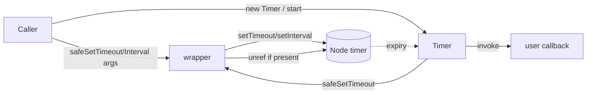
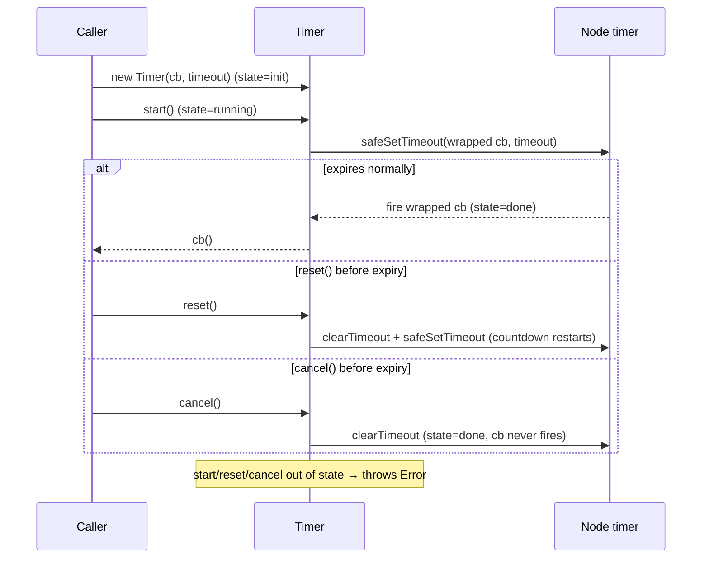
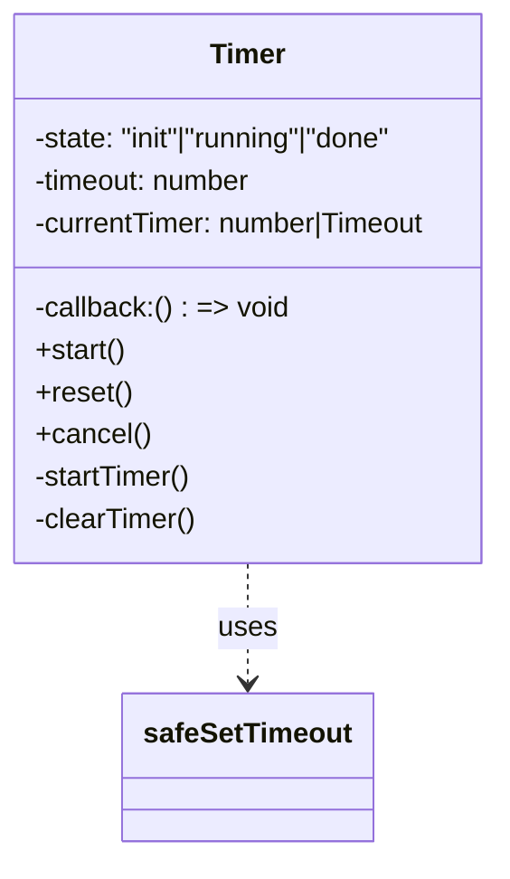
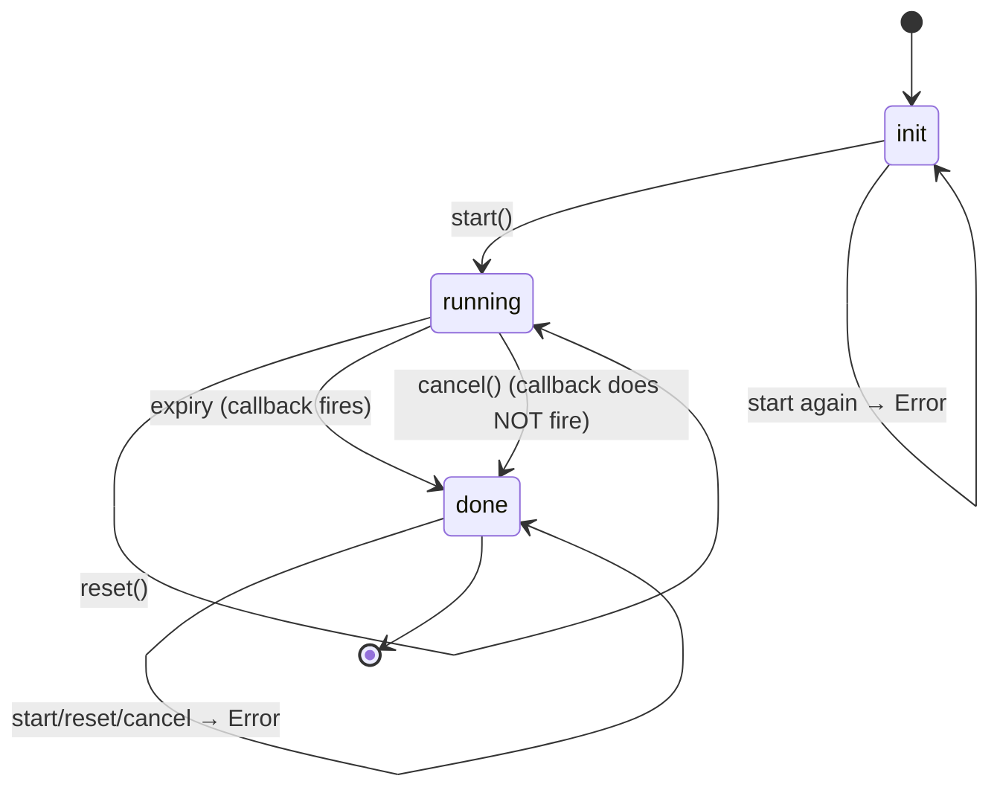

<!-- sdd-generated-metadata
generator: claude-cli
generator_model: us.anthropic.claude-opus-4-8
approved_by: pending-human-review
updated_at: 2026-08-06T00:00:00Z
validation_status: not-run
run_id: 51855eac-8de5-43a2-a3b6-dbcc55ebc91b
-->

# @webex/common-timers — SPEC

> Start here → root [`AGENTS.md`](../../../../AGENTS.md) (agent entry) · router [`SPEC_INDEX.md`](../../../../ai-docs/SPEC_INDEX.md) · system [`ARCHITECTURE.md`](../../../../ai-docs/ARCHITECTURE.md). This is the module's canonical spec: orientation, requirements, design, flows, state, and tests.
> Context-efficiency: link to canonical docs — don't duplicate them. Load specs on demand per `SPEC_INDEX.md`.

## Metadata

| Field | Value |
|---|---|
| Module id | `common-timers` |
| Source path(s) | `packages/@webex/common-timers/src/` |
| Parent spec | `—` (standalone utility library, no parent module) |
| Doc kind | Module spec |
| Coverage score | Pending coverage assessment |
| Generated from | `module-spec` @ SDLC template library `0.2.2` |
| generated_by / approved_by / updated_at | claude-cli / pending-human-review / 2026-08-06 |
| Validation status | not-run, validator `pending`, assessed 2026-08-06 |

Coverage score is `Pending coverage assessment` until the first coverage review runs. Manifest coverage
state (`Partial`) is authoritative and kept in `.sdd/manifest.json`.

## Evidence Rules
Every requirement cites concrete source evidence using `file path`. Test evidence is preferred for WHY.
Requirements are grounded in the current TypeScript implementation and its unit tests.

## Source Material Register

| Source material | Scope | Decision | Detail location or disposition |
|---|---|---|---|
| `N/A` | none | none | No pre-existing SDD/AI-docs, architecture, or spec documents were routed to this module; content is derived from source and unit tests. |

## Overview

`@webex/common-timers` provides thin, process-friendly wrappers around Node's timer primitives plus a
small restartable `Timer` class. Its reason to exist is captured in the package description: "Timer
wrappers to prevent wedging a process open." In Node, a pending `setTimeout`/`setInterval` keeps the
event loop alive; these wrappers call `unref()` on the returned timer (when available) so a lingering
timer never blocks process exit.

The package exposes two free functions — `safeSetTimeout` and `safeSetInterval` — and one class,
`Timer`, that wraps `safeSetTimeout` with an explicit `init → running → done` lifecycle and
`start`/`reset`/`cancel` controls. A maintainer should start at `src/index.ts`, which is the entire
module.

## Purpose / Responsibility

Owns non-wedging timer scheduling for the SDK: `unref`-ed one-shot and interval timers, plus a
restartable single-shot timer with guarded state transitions. It does NOT own scheduling policy,
retry/backoff logic, or any domain behavior — only the timer primitives.

## Stack

TypeScript (`devMain: src/index.ts`), Node `>=18`. Built with `webex-legacy-tools build`
(`-js -ts -maps`). Unit tests run via `webex-legacy-tools test --unit`, using `@webex/test-helper-chai`
and `sinon` fake timers. No runtime dependencies.

## Folder / Package Structure

```
packages/@webex/common-timers/
├── src/
│   └── index.ts          # safeSetTimeout, safeSetInterval, Timer (entire public surface)
└── test/
    └── unit/spec/        # sinon fake-timer unit tests
```

## Key Files (source of truth)

| File | Holds |
|---|---|
| `packages/@webex/common-timers/src/index.ts` | `safeSetTimeout`, `safeSetInterval`, and the `Timer` class with its state machine |
| `packages/@webex/common-timers/package.json` | Public entry points and build/test scripts (no runtime deps) |

## Public Surface

Published, imported SDK/code API — no network, event, or CLI surface.

| Contract ID | Type | Surface | Purpose | Compatibility / deprecation | Schema / detail link | Root index |
|---|---|---|---|---|---|---|
| `common-timers.safeSetTimeout` | SDK | `safeSetTimeout(...args): number \| NodeJS.Timeout` | `setTimeout` that `unref()`s the timer so it never wedges the process | Stable named export; signature mirrors `setTimeout` | `packages/@webex/common-timers/src/index.ts` | `../../../../ai-docs/CONTRACTS.md` |
| `common-timers.safeSetInterval` | SDK | `safeSetInterval(...args): number \| NodeJS.Timeout` | `setInterval` that `unref()`s the interval | Stable named export; signature mirrors `setInterval` | `packages/@webex/common-timers/src/index.ts` | `../../../../ai-docs/CONTRACTS.md` |
| `common-timers.Timer` | SDK | `class Timer(callback, timeout)` with `start()`/`reset()`/`cancel()` | Restartable single-shot timer with a guarded lifecycle | Stable class export; public method contract is semver-controlled | `packages/@webex/common-timers/src/index.ts` | `../../../../ai-docs/CONTRACTS.md` |

Compatibility notes:
- The exported names, their argument forwarding to the underlying `setTimeout`/`setInterval`, and the
  `Timer` method names and thrown-error semantics are the semver-controlled contract.

## Requires (dependencies)

- None at runtime. Relies only on the ambient Node `setTimeout`/`setInterval`/`clearTimeout` globals.

## Requirements

| ID | WHAT | WHY | Source Evidence | Test / Example Evidence | Assumptions / Gaps | Confidence |
|---|---|---|---|---|---|---|
| `COMMON-TIMERS-R-001` | `safeSetTimeout` forwards all arguments to `setTimeout` and calls `unref()` on the returned timer when `unref` exists, then returns the timer. | An `unref`-ed timer does not keep the Node event loop (and process) alive, preventing wedged processes. | `packages/@webex/common-timers/src/index.ts` | `packages/@webex/common-timers/test/unit/spec/index.ts` | none identified | PRESENT |
| `COMMON-TIMERS-R-002` | `safeSetInterval` forwards all arguments to `setInterval` and calls `unref()` on the returned interval when available, then returns it. | Same non-wedging guarantee for repeating timers. | `packages/@webex/common-timers/src/index.ts` | `packages/@webex/common-timers/test/unit/spec/index.ts` | none identified | PRESENT |
| `COMMON-TIMERS-R-003` | `Timer` starts in `init`; `start()` schedules via `safeSetTimeout` and moves to `running`; on expiry it moves to `done` and invokes the callback. | A single, explicit lifecycle makes the timer's state observable and its callback fire exactly once per run. | `packages/@webex/common-timers/src/index.ts` | `packages/@webex/common-timers/test/unit/spec/index.ts` | none identified | PRESENT |
| `COMMON-TIMERS-R-004` | `reset()` (only valid while `running`) clears the current timer and starts a new one with the same timeout, restarting the countdown. | Callers need to extend/restart a pending timeout without recreating the object. | `packages/@webex/common-timers/src/index.ts` | `packages/@webex/common-timers/test/unit/spec/index.ts` | none identified | PRESENT |
| `COMMON-TIMERS-R-005` | `cancel()` (only valid while `running`) clears the timer and moves to `done` without firing the callback. | Callers must be able to abort a pending timeout cleanly. | `packages/@webex/common-timers/src/index.ts` | `packages/@webex/common-timers/test/unit/spec/index.ts` | none identified | PRESENT |
| `COMMON-TIMERS-R-006` | Invalid transitions throw a descriptive `Error` naming the current state: `start` outside `init`, `reset` outside `running`, `cancel` outside `running`. | Guarding transitions surfaces misuse loudly instead of silently corrupting timer state. | `packages/@webex/common-timers/src/index.ts` | `packages/@webex/common-timers/test/unit/spec/index.ts` | none identified | PRESENT |

## Design Overview

`safeSetTimeout`/`safeSetInterval` are one-liners: schedule, `unref()` if present, return. The `unref`
guard keeps them safe in browser bundles where the returned handle is a number without `unref`.

`Timer` composes `safeSetTimeout`. It stores `state`, the immutable `timeout`, a wrapped `callback` (that
sets `state = 'done'` before invoking the user callback), and the current timer handle. `start`,
`reset`, and `cancel` each guard on the current `state` and throw if called out of order, so the lifecycle
is total and explicit. `startTimer`/`clearTimer` are private helpers wrapping the schedule/clear calls.

## Data Flow



## Sequence Diagram(s)

Sequence coverage:

| Operation group | Diagram | Failure / recovery coverage |
|---|---|---|
| Timer lifecycle (start/expire, reset, cancel) | 1. Timer lifecycle | `alt` branches cover reset-before-expiry and cancel-before-expiry; guard throws for invalid transitions |

### 1. Timer lifecycle



## Class / Component Relationships



`Timer` is the only class; the two free functions are standalone. `Timer` depends on `safeSetTimeout`
for scheduling.

## Use Cases

- **UC-1 Non-wedging one-shot:** call `safeSetTimeout(cb, ms)` in Node; the process can still exit while
  the timer is pending. Evidence: `packages/@webex/common-timers/src/index.ts`, `packages/@webex/common-timers/test/unit/spec/index.ts`.
- **UC-2 Restartable timeout:** create a `Timer`, `start()` it, and `reset()` on activity to implement an
  idle/keepalive timeout; `cancel()` to abort. Evidence: `packages/@webex/common-timers/src/index.ts`,
  `packages/@webex/common-timers/test/unit/spec/index.ts`.

## State Model

`Timer` holds a single `state` field with three values: `init` (constructed, not started), `running`
(timer scheduled), and `done` (expired or cancelled). Transitions: `init --start--> running`,
`running --reset--> running`, `running --(expiry)--> done`, `running --cancel--> done`. Any
transition attempted from a non-permitted state throws. Evidence: `packages/@webex/common-timers/src/index.ts`.

## State Machine



## Concurrency & Reactive Flow

Timers are inherently asynchronous: the wrapped callback runs on the event loop when the timeout elapses.
There is no shared mutable state across instances. `Timer` guarantees its callback fires at most once per
`start` cycle (state moves to `done` before invoking it), and `cancel`/`reset` are synchronous mutations
of a single instance. Nothing here should block the event loop. Evidence: `packages/@webex/common-timers/src/index.ts`.

## Error Handling & Failure Modes

| Condition | Signal (error/code/result) | Caller recovery |
|---|---|---|
| `start()` when not in `init` | `Error: Can't start the timer when it's in <state> state` | Create a new `Timer` instead of restarting a used one |
| `reset()` when not `running` | `Error: Can't reset the timer when it's in <state> state` | Only `reset()` a started, un-expired timer |
| `cancel()` when not `running` | `Error: Can't cancel the timer when it's in <state> state` | Only `cancel()` a started, un-expired timer |

## Pitfalls

- A `Timer` is single-use: once it reaches `done` (via expiry or `cancel`), it cannot be restarted —
  attempting `start()` throws. Construct a fresh `Timer` per run.
- In browser bundles the returned handle is a number without `unref`; the `if (timer.unref)` guard makes
  the wrappers safe there, but the non-wedging benefit is Node-specific.
- `reset()` reuses the original `timeout`; you cannot change the duration on reset.

## Test-Case Strategy (module)

Unit tests use `sinon.useFakeTimers()` to deterministically advance time. They assert the callback fires
on expiry (positive), that `reset` postpones firing, that `cancel` prevents firing (negative), and that
each guarded method throws with the expected message when called from an invalid state.

| Behavior / Requirement | Existing test evidence | Gap |
|---|---|---|
| `COMMON-TIMERS-R-001` | `packages/@webex/common-timers/test/unit/spec/index.ts` | none identified |
| `COMMON-TIMERS-R-002` | `packages/@webex/common-timers/test/unit/spec/index.ts` | none identified |
| `COMMON-TIMERS-R-003` | `packages/@webex/common-timers/test/unit/spec/index.ts` | none identified |
| `COMMON-TIMERS-R-004` | `packages/@webex/common-timers/test/unit/spec/index.ts` | none identified |
| `COMMON-TIMERS-R-005` | `packages/@webex/common-timers/test/unit/spec/index.ts` | none identified |
| `COMMON-TIMERS-R-006` | `packages/@webex/common-timers/test/unit/spec/index.ts` | none identified — all three guard messages asserted |

## Traceability

- Repo architecture: [`ARCHITECTURE.md`](../../../../ai-docs/ARCHITECTURE.md) · Registry: [`SPEC_INDEX.md`](../../../../ai-docs/SPEC_INDEX.md)
- Contracts catalog: [`CONTRACTS.md`](../../../../ai-docs/CONTRACTS.md)
- Coverage state & contracts baseline: `.sdd/manifest.json`
