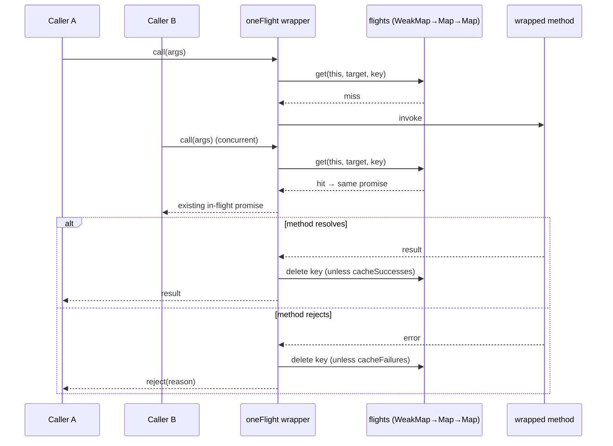
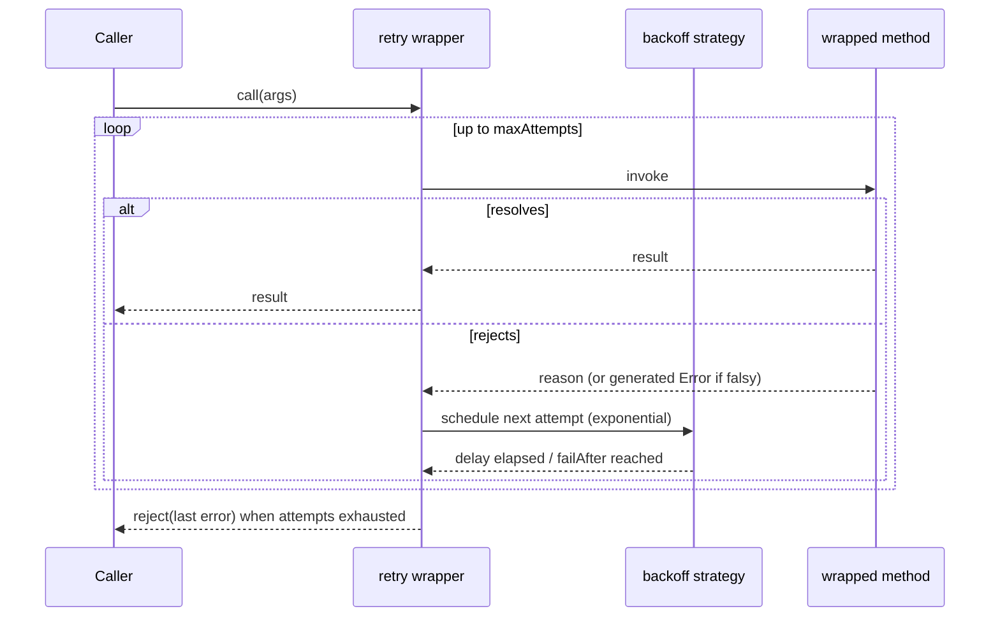
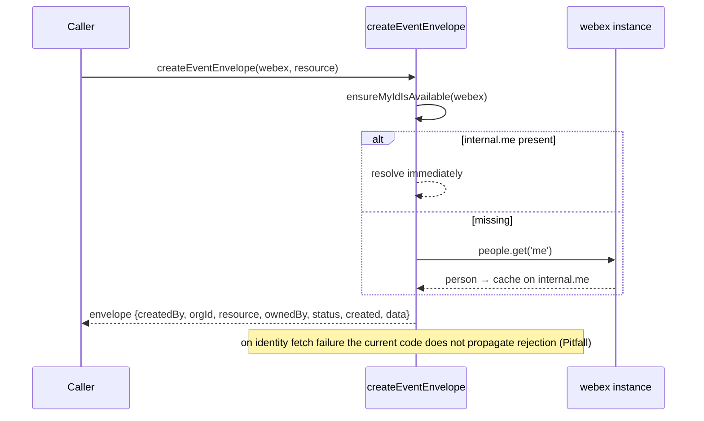
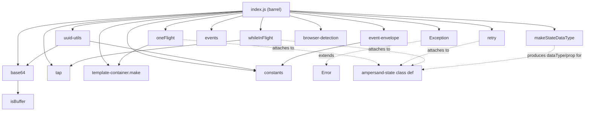

# common — SPEC

> Start here → root [`AGENTS.md`](../../../../AGENTS.md) (agent entry) · router [`SPEC_INDEX.md`](../../../../ai-docs/SPEC_INDEX.md) · system [`ARCHITECTURE.md`](../../../../ai-docs/ARCHITECTURE.md). This is the module's canonical spec: orientation, requirements, design, flows, state, protocol, UI, data, and tests. (Multi-repo: the root `AGENTS.md` may be the workspace-level one.)
> Context-efficiency: link to canonical docs — don't duplicate them. Load specs on demand per `SPEC_INDEX.md`.

## Metadata
| Field | Value |
|---|---|
| Module id | `common` |
| Source path(s) | `packages/@webex/common/` |
| Doc kind | Module spec |
| Coverage score | 88% (14/16) assessed 2026-07-28; critical 8/8, important 3/5, polish 3/3; strong code-derived spec citing src/ + test/unit (Hydra codec, async decorators, error matrix, concurrency) — several requirements WEAK (untested); held at Partial (PR-churn gate unverifiable on shallow clone; no independent-runtime validator pass) |
| Generated from | `module-spec` @ SDLC template library `0.2.1` |
| generated_by / approved_by / updated_at | generated_by: doc-backfill (assess-only-bootstrap runtime) · approved_by: unassigned · updated_at: 2026-07-28 |
| Validation status | not-run |

Coverage score: `Pending coverage assessment` before the first report; after assessment, replace with
`<0-100%>` plus the assessment date and short evidence summary. Do not link or cite local generated
coverage or validation report paths from this committed metadata. Manifest coverage state for this
module is **Partial** (code-derived backfill; the code under `packages/@webex/common/src/` is the
source of truth). Keep manifest coverage state outside the rendered module doc metadata.

## Evidence Rules
Every generated requirement below must cite concrete source evidence using `file path`. Separate source
evidence, test evidence, examples, assumptions, and gaps so validators and future agents can distinguish
truth from context. Test evidence is preferred for WHY. Commit evidence is allowed only when the
repository policy says history is reliable, and must include the commit hash. If evidence is missing or
conflicting, ask a focused discovery question before finalizing the requirement; record unresolved answers
as approved unknowns only when the human explicitly defers or does not know.

This is a code-derived backfill: there are **no routed prior source docs** for this module
(`.sdd/manifest.json` → `modules[].source_policy.existing_sources` is empty). WHAT is derived from each
export's signature and behavior; WHY is derived from unit-test `should…`/`it(...)` intent and from
in-code JSDoc/usage. Exported surfaces with no unit test are marked `WEAK` with a missing-test gap.

## Source Material Register
| Source material | Scope | Decision | Detail location or disposition |
|---|---|---|---|
| Module source (`packages/@webex/common/src/`) | overview / architecture / API | used | Public exports, behavior, and invariants migrated by meaning into Overview, Public Surface, Requirements, Data Flow, and design sections below. |
| Module unit tests (`packages/@webex/common/test/unit/spec/`) | tests | used | Intent (WHY) and confidence derived from `it(...)` assertions; mapped in Requirements and Test-Case Strategy. |
| Package README (`packages/@webex/common/README.md`) | overview | reference-only | Consumer-facing usage examples for a subset of utilities; supports Overview and Use Cases, not treated as authoritative over code. |
| Native contract source | API | none | No OpenAPI/AsyncAPI/proto/GraphQL/JSON-Schema in this module; contract is the exported JS API surface (see root `CONTRACTS.md`). |

## Overview
`@webex/common` is the SDK's shared utility library: a flat collection of small, mostly stateless
helpers that other `@webex/*` packages import rather than reimplement. It owns four kinds of thing:
(1) **async/promise control-flow** helpers and method decorators (`oneFlight`, `whileInFlight`,
`retry`, `tap`, `resolveWith`, `Defer`, `cappedDebounce`); (2) **Hydra public-ID codec** utilities that
translate internal UUIDs to/from the public `ciscospark://…` identifier format (`uuid-utils`, `base64`);
(3) **shared constants and validation patterns** (`constants`, `patterns`, `checkRequired`); and (4)
**miscellaneous primitives** (`Exception`, `make`/template-container, `makeStateDataType`,
`BrowserDetection`/`getBrowserSerial`, `inBrowser`, `isBuffer`, `deprecated`, event proxying, event
envelopes).

Callers enter exclusively through the export barrel `packages/@webex/common/src/index.js`; there is no
network surface and no persistence. Several decorators (`oneFlight`, `retry`, `whileInFlight`) and
`makeStateDataType` are designed to interoperate with `ampersand-state` class definitions, which is the
SDK's base model layer — so this module is coupled to Ampersand semantics even though it exposes no
Ampersand types itself.

A maintainer should start at `src/index.js` to see the public surface, then read the individual
single-purpose files. Most files are independent; the notable internal dependency chains are
`uuid-utils → base64 → isBuffer`, `one-flight → template-container`, and
`while-in-flight → tap`.

## Purpose / Responsibility
Owns cross-cutting, dependency-light utilities shared across the Webex SDK: promise/async control-flow
helpers and decorators, the Hydra public-ID codec, shared constants/regex patterns, and small
primitives. Does NOT own any network I/O, persistence, domain models, or plugin lifecycle — it is a leaf
utility package consumed by other packages.

## Stack
JavaScript (ES modules + decorators, transpiled via Babel; `babel.config.js`). Targets both Node
(`>=16`, `package.json` `engines`) and browser builds (`package.json` `browser` field swaps
`in-browser/node.js` for `in-browser/browser.js`). Test stack: Mocha/Jest-style specs run via
`webex-legacy-tools test --unit --runner jest` with `@webex/test-helper-chai` and `sinon`
(`packages/@webex/common/jest.config.js`, `packages/@webex/common/package.json`). Build target: the
`@webex/common` package (`webex-legacy-tools build`). Key runtime deps: `lodash`, `backoff`, `bowser`,
`urlsafe-base64`, `safe-buffer`, `core-decorators`, `global`.

## Folder / Package Structure
```
packages/@webex/common/
├── src/
│   ├── index.js                 # export barrel — the public surface
│   ├── base64.js                # base64url encode/decode/validate
│   ├── isBuffer.js              # duck-typed Buffer check
│   ├── uuid-utils.js            # Hydra public-ID construct/deconstruct + helpers
│   ├── constants.js             # SDK_EVENT, hydraTypes, deviceType, cluster names
│   ├── patterns.js              # shared compiled regexes (email, uuid, MTID)
│   ├── check-required.js        # throw-on-missing key guard
│   ├── capped-debounce.js       # debounce with maxWait + maxCalls
│   ├── defer.js                 # deferred promise (exposed resolve/reject)
│   ├── one-flight.js            # decorator: dedupe concurrent calls
│   ├── while-in-flight.js       # decorator: toggle a boolean flag during a call
│   ├── retry.js                 # decorator: retry with exponential backoff
│   ├── tap.js                   # promise-chain side-effect passthrough
│   ├── resolve-with.js          # promise-chain constant resolver
│   ├── template-container.js    # factory for multi-keyed Map/WeakMap/Set containers
│   ├── make-state-datatype.js   # ampersand-state child dataType/prop factory
│   ├── events.js                # proxyEvents / transferEvents
│   ├── event-envelope.js        # createEventEnvelope / ensureMyIdIsAvailable
│   ├── exception.js             # Exception base Error class
│   ├── deprecated.js            # deprecation decorator (no-op in production)
│   ├── browser-detection.js     # BrowserDetection / getBrowserSerial (bowser)
│   └── in-browser/              # build-swapped boolean: node.js=false, browser.js=true
└── test/unit/spec/              # mocha/jest unit specs
```

## Key Files (source of truth)
| File | Holds |
|---|---|
| `packages/@webex/common/src/index.js` | The authoritative public export list — the module contract; never infer exports elsewhere |
| `packages/@webex/common/src/constants.js` | `SDK_EVENT`, `hydraTypes`, `deviceType`, and the `INTERNAL_US_CLUSTER_NAME` / `INTERNAL_US_INTEGRATION_CLUSTER_NAME` string constants — do not hardcode these values elsewhere |
| `packages/@webex/common/src/patterns.js` | The canonical compiled regexes (email, uuid, MTID); reuse rather than re-authoring |
| `packages/@webex/common/src/uuid-utils.js` | Hydra ID format rules (base URL, `us`-cluster special-casing, per-type cluster handling) |

## Public Surface
Internal Surface — consumed as an imported SDK utility package (`@webex/common`); there is no network,
event-bus, or CLI contract. Other `@webex/*` packages import named exports from the package entry point.
The authoritative export list is `packages/@webex/common/src/index.js`; the table summarizes surface
groups and routes detail to the code and the root contract index. Exact schemas are not inlined.

| Contract ID | Type | Surface | Purpose | Compatibility / deprecation | Schema / detail link | Root index |
|---|---|---|---|---|---|---|
| `common.hydra-id` | SDK | `constructHydraId`, `deconstructHydraId`, `buildHydra{Message,Person,Room,Org,Membership}Id`, `getHydraRoomType`, `getHydraClusterString`, `getHydraFiles` | Encode/decode public Hydra IDs from internal UUIDs | Wire-format stable (see Protocol / Wire Format); `us`-cluster special-case is a back-compat guarantee | `packages/@webex/common/src/uuid-utils.js` | `../../../../ai-docs/CONTRACTS.md` |
| `common.base64` | SDK | `base64` (`toBase64Url`, `fromBase64url`, `encode`, `decode`, `validate`) | base64url string/buffer codec | Stable | `packages/@webex/common/src/base64.js` | `../../../../ai-docs/CONTRACTS.md` |
| `common.async-decorators` | SDK | `oneFlight`, `whileInFlight`, `retry` | Method decorators for dedupe / flag / retry-with-backoff | Stable; Ampersand-compatible | `packages/@webex/common/src/one-flight.js`, `packages/@webex/common/src/while-in-flight.js`, `packages/@webex/common/src/retry.js` | `../../../../ai-docs/CONTRACTS.md` |
| `common.promise-helpers` | SDK | `tap`, `resolveWith`, `Defer`, `cappedDebounce` | Promise-chain and timing helpers | Stable | `packages/@webex/common/src/tap.js`, `packages/@webex/common/src/resolve-with.js`, `packages/@webex/common/src/defer.js`, `packages/@webex/common/src/capped-debounce.js` | `../../../../ai-docs/CONTRACTS.md` |
| `common.primitives` | SDK | `Exception`, `make`, `makeStateDataType`, `checkRequired`, `isBuffer`, `patterns`, `deprecated`, `inBrowser` | Shared error base, container factory, Ampersand dataType, guards, regexes, env flag | Stable | `packages/@webex/common/src/index.js` | `../../../../ai-docs/CONTRACTS.md` |
| `common.events` | SDK | `proxyEvents`, `transferEvents` | Proxy/forward emitter event bindings | Stable | `packages/@webex/common/src/events.js` | `../../../../ai-docs/CONTRACTS.md` |
| `common.event-envelope` | SDK | `createEventEnvelope`, `ensureMyIdIsAvailable` | Wrap SDK socket events in a webhook-shaped envelope | Depends on a `webex` instance (`internal.me`, `people`) | `packages/@webex/common/src/event-envelope.js` | `../../../../ai-docs/CONTRACTS.md` |
| `common.browser-detection` | SDK | `BrowserDetection` (default), `getBrowserSerial` | Parse user-agent via bowser; OS/browser info | Stable | `packages/@webex/common/src/browser-detection.js` | `../../../../ai-docs/CONTRACTS.md` |
| `common.constants` | SDK | `SDK_EVENT`, `hydraTypes`, `deviceType`, `INTERNAL_US_CLUSTER_NAME`, `INTERNAL_US_INTEGRATION_CLUSTER_NAME` | Shared enums/constants | Additive; values are back-compat contracts | `packages/@webex/common/src/constants.js` | `../../../../ai-docs/CONTRACTS.md` |

Compatibility notes:
- Removing or renaming any barrel export in `src/index.js`, or changing a `constants.js` value, is a
  **breaking** change (major semver) — downstream `@webex/*` packages import these directly.
- Adding a new named export or a new constant key is additive (minor).
- The Hydra ID encoding is a persisted-format contract: a change to the `ciscospark://…` layout or the
  `us`-cluster special-case would break already-issued public IDs.

## Requires (dependencies)
- `urlsafe-base64` + `safe-buffer` — base64url codec backing `base64.js` (peer `^1.0.0` / `^5.2.0` per `package.json`).
- `lodash` (`^4.17.21`) — `wrap`, `defaults`, `isFunction`, `isArray`, `memoize` used across decorators/helpers.
- `backoff` (`^2.5.0`) — exponential-backoff strategy for `retry`.
- `bowser` (`^2.11.0`) — user-agent parsing for `browser-detection`.
- `core-decorators` (`^0.20.0`) — underlying `deprecated` decorator.
- `global` (`^4.4.0`) — isomorphic `window` access in `browser-detection`.
- `ampersand-state` (dev/peer) — decorators and `makeStateDataType` are built to attach to Ampersand class definitions.
- No internal `@webex/*` runtime dependencies; `event-envelope` requires a caller-supplied `webex` instance at call time (`internal.me`, `people.get`).

## Requirements
| ID | WHAT | WHY | Source Evidence | Test / Example Evidence | Assumptions / Gaps | Confidence |
|---|---|---|---|---|---|---|
| `COMMON-R-001` | `base64.toBase64Url`/`encode` base64url-encodes a string or Buffer; `fromBase64url`/`decode` decodes back to a string; `validate` reports whether a string is valid base64 | base64url IDs must round-trip so encoded Hydra IDs decode to the original value | `packages/@webex/common/src/base64.js` | `packages/@webex/common/test/unit/spec/common.js` (`base64-encodes a string`/`a buffer`, `base64-decodes a string`) | Non-string/non-buffer inputs to `toBase64Url` rely on `Buffer.from` coercion; not asserted | PRESENT |
| `COMMON-R-002` | `toBase64Url` accepts either a string or a Buffer, coercing non-buffers via `Buffer.from` before encoding | Callers pass both raw strings and binary buffers (e.g. UUID payloads) | `packages/@webex/common/src/base64.js`, `packages/@webex/common/src/isBuffer.js` | `packages/@webex/common/test/unit/spec/common.js` (encodes a buffer) | none | PRESENT |
| `COMMON-R-003` | `isBuffer(x)` returns `true` only for objects whose `constructor.isBuffer(x)` is truthy, and is null-safe | A duck-typed Buffer check is needed that works across realms/bundles without `instanceof` | `packages/@webex/common/src/isBuffer.js` | None found | No direct unit test; exercised indirectly via `base64` buffer path | WEAK |
| `COMMON-R-004` | `constructHydraId(type, id, cluster='us')` returns a base64url-encoded `ciscospark://<cluster>/<TYPE>/<id>` URI; `PEOPLE` and `ORGANIZATION` types always use cluster `us`; a missing `type`/`id` throws `parameter is required`; a non-string `type` throws `"type" must be a string` | Public IDs must be stable, uppercase-typed, and hold people/orgs on `us` for backward compatibility | `packages/@webex/common/src/uuid-utils.js` | None found | Public-format invariant untested at the module level; relied on by downstream packages | WEAK |
| `COMMON-R-005` | `deconstructHydraId(id)` base64url-decodes and splits the URI, returning `{id, type, cluster}` (parsed from the trailing path segments) | Callers need to recover the internal UUID, type, and cluster from a public ID | `packages/@webex/common/src/uuid-utils.js` | None found | Assumes well-formed input; malformed IDs are not validated | WEAK |
| `COMMON-R-006` | `buildHydra{Message,Person,Room,Org}Id(uuid, cluster)` and `buildHydraMembershipId(personUUID, spaceUUID, cluster)` construct type-specific Hydra IDs; membership encodes `personUUID:spaceUUID` | Give callers typed convenience wrappers over `constructHydraId` for each resource | `packages/@webex/common/src/uuid-utils.js` | None found | none | WEAK |
| `COMMON-R-007` | `getHydraClusterString(webex, conversationUrl)` returns `us` when the internal cluster starts with the US or US-integration cluster names, else the first three `:`-joined parts; throws `Unable to determine cluster` when fewer than three parts | Map internal cluster identifiers to the public cluster string while preserving the historical `us` alias | `packages/@webex/common/src/uuid-utils.js`, `packages/@webex/common/src/constants.js` | None found | Depends on `webex.internal.services.getClusterId`; shape assumed | WEAK |
| `COMMON-R-008` | `getHydraRoomType(tags)` returns the DIRECT space type when tags include `ONE_ON_ONE`, otherwise GROUP | Translate internal activity tags to the public space type | `packages/@webex/common/src/uuid-utils.js`, `packages/@webex/common/src/constants.js` | None found | none | WEAK |
| `COMMON-R-009` | `getHydraFiles(activity, cluster)` returns one `…/contents/<hydraId>` URL per file item, where each content ID encodes `<activity.id>/<index>`; order-dependent | Produce stable public content URLs for a message's attachments | `packages/@webex/common/src/uuid-utils.js` | None found | Generated ID depends on file order (documented in code); no empty/missing-`files` test | WEAK |
| `COMMON-R-010` | `cappedDebounce(fn, wait, {maxWait, maxCalls})` returns a debounced wrapper that fires after `wait` ms of quiet, OR after `maxWait` ms, OR after `maxCalls` invocations, whichever comes first, then resets | Coalesce bursts but bound worst-case latency and call count so work is not starved | `packages/@webex/common/src/capped-debounce.js` | `packages/@webex/common/test/unit/spec/capped-debounce.js` (wait / maxWait / maxCalls execution + reset cases) | none | PRESENT |
| `COMMON-R-011` | `cappedDebounce` throws when `fn` is not a function, or when `wait`, `options.maxWait`, or `options.maxCalls` are missing | Fail fast on misconfiguration rather than silently never firing | `packages/@webex/common/src/capped-debounce.js` | `packages/@webex/common/test/unit/spec/capped-debounce.js` (`requires a function`/`wait`/`maxWait`/`maxCalls`) | none | PRESENT |
| `COMMON-R-012` | `new Defer()` exposes `.promise` plus externally-callable `.resolve` and `.reject` | Callers need to settle a promise from outside its executor | `packages/@webex/common/src/defer.js` | `packages/@webex/common/test/unit/spec/while-in-flight.js` (used as `success`/`failure` deferreds) | Used as a test helper; no dedicated Defer spec | WEAK |
| `COMMON-R-013` | `@oneFlight` decorator ensures a method has at most one in-flight execution per key; concurrent calls return the same promise. `keyFactory` derives per-argument keys; `cacheFailures`/`cacheSuccesses` control whether the flight is evicted on settle | Prevent duplicate concurrent work (e.g. duplicate token/network calls) while allowing distinct-argument calls to run independently | `packages/@webex/common/src/one-flight.js`, `packages/@webex/common/src/template-container.js` | `packages/@webex/common/test/unit/spec/one-flight.js` (dedupes same call; distinct keys run twice; complex Ampersand event scenario) | none | PRESENT |
| `COMMON-R-014` | `@whileInFlight(param)` sets `this[param] = true` before the decorated promise runs and back to `false` on both fulfilment and rejection (rejection is re-thrown) | Drive UI/state "in progress" flags without leaking a stuck-true flag on error | `packages/@webex/common/src/while-in-flight.js`, `packages/@webex/common/src/tap.js` | `packages/@webex/common/test/unit/spec/while-in-flight.js` (true during flight; false after success AND after failure) | none | PRESENT |
| `COMMON-R-015` | `@retry` decorator retries a promise-returning method using exponential backoff (`backoff`), defaulting to 3 `maxAttempts` and `delay: 1`; a rejection without an error is replaced with a generated `Error`; progress/upload-progress/download-progress events are proxied through the returned promise's `.on` | Make transient failures recoverable while surfacing progress and never rejecting with a falsy reason | `packages/@webex/common/src/retry.js` | `packages/@webex/common/test/unit/spec/common.js` (`retry` `is defined` only) | Backoff timing, attempt count, and event proxying are not behaviorally tested | WEAK |
| `COMMON-R-016` | `tap(fn)` returns a promise-chain step that runs `fn(r)` for its side effect and resolves with the original `r`, even if `fn` throws or rejects | Allow logging/inspection inside a `.then` chain without altering the value | `packages/@webex/common/src/tap.js` | None found (used indirectly by `while-in-flight`) | No direct tap spec | WEAK |
| `COMMON-R-017` | `resolveWith(object)` returns a function that ignores its input and resolves with `object` | Sugar for returning a fixed value at the end of a promise chain | `packages/@webex/common/src/resolve-with.js` | None found | No unit test | WEAK |
| `COMMON-R-018` | `make(...containers)` returns a multi-keyed Container class composing the given constructors (Map/WeakMap/Set/array-like); supports `set`/`add`/`get`/`has`/`delete`/`clear`/`size`, tracking size across nested levels; throws `TypeError` when it cannot determine how to insert | Provide a tuple-keyed container (e.g. `WeakMap→Map→Map`) that primitives like `oneFlight` build on | `packages/@webex/common/src/template-container.js` | `packages/@webex/common/test/unit/spec/template-container.js` (`make(Map)`, `make(WeakMap, Map)`, `make(Map, Map, Set)`) | Memoization intentionally disabled (skipped test) | PRESENT |
| `COMMON-R-019` | `makeStateDataType(Constructor, name)` returns an ampersand-state `dataType`+`prop` pair that wraps a child state, sets `parent`, and bubbles the child's `all` events to the parent; throws when `Constructor` or `name` is missing | Wire nested Ampersand child models so change events propagate to the parent | `packages/@webex/common/src/make-state-datatype.js` | `packages/@webex/common/test/unit/spec/one-flight.js` (used to compose nested Ampersand models in the complex scenario) | Behavior validated only indirectly via the oneFlight scenario | WEAK |
| `COMMON-R-020` | `checkRequired(keys, object)` throws `missing required property <key> from <object>` for the first key whose value is falsy | Guard required inputs with a consistent, descriptive error | `packages/@webex/common/src/check-required.js` | None found | Rejects falsy-but-valid values (0, '', false) — see Pitfalls | WEAK |
| `COMMON-R-021` | `patterns` exports compiled regexes: `email`, `containsEmails` (global), `uuid`, `containsMTID` (global), and start/end-anchor-free `execEmail`/`execUuid` variants | Compile validation regexes once and reuse consistent, exact-match patterns SDK-wide | `packages/@webex/common/src/patterns.js` | None found | Regex correctness not unit-tested here | WEAK |
| `COMMON-R-022` | `Exception` extends `Error`, sets `name` to the subclass name, and resolves `message` via an instance/static `parse(...args)` (default: first arg), falling back to the class's `defaultMessage` | Give the SDK a subclassable error base with parseable, defaulted messages | `packages/@webex/common/src/exception.js` | `packages/@webex/common/test/unit/spec/exception.js` (`parse` override, `defaultMessage` fallback/override/ignore, class name in `toString`) | none | PRESENT |
| `COMMON-R-023` | `proxyEvents(emitter, proxy)` copies `on`/`once` onto `proxy` (delegating to `emitter` and returning `proxy` for chaining) and returns the source emitter; `transferEvents(events, source, drain)` re-emits listed events from `source` on `drain` using `trigger` or `emit` | Bridge event-emitter APIs across promise-like proxies and between emitters | `packages/@webex/common/src/events.js` | None found | `transferEvents` no-ops silently if `source.on` is absent; untested | WEAK |
| `COMMON-R-024` | `ensureMyIdIsAvailable(webex)` resolves immediately if `webex.internal.me` exists, else fetches `webex.people.get('me')` and caches it on `webex.internal.me`; `createEventEnvelope(webex, resource)` resolves a webhook-shaped envelope (`createdBy`, `orgId`, `resource`, `ownedBy=creator`, `status=active`, `created` ISO timestamp, empty `data`) | Wrap SDK socket events in a webhook-compatible envelope, ensuring the current user's identity is loaded first | `packages/@webex/common/src/event-envelope.js`, `packages/@webex/common/src/constants.js` | None found | Error branch swallows failures (does not return the rejected promise) — see Pitfalls | WEAK |
| `COMMON-R-025` | `getBrowserSerial()` returns the parsed bowser user-agent object when `window.navigator.userAgent` is available, `{error: 'unable to access window.navigator.userAgent'}` when it is not, and `{error: <message>}` if parsing throws; default export `BrowserDetection(agent?)` is a memoized factory returning OS/browser accessors (falling back to a Node `os`-based mock when no agent) | Detect browser/OS safely across environments without throwing when the UA is unavailable | `packages/@webex/common/src/browser-detection.js`, `packages/@webex/common/src/constants.js` | `packages/@webex/common/test/unit/spec/browser-detection.js` (`getBrowserSerial` UA-present, UA-absent, parser-throws) | `BrowserDetection` default export itself not directly tested; memoization can cache across differing agents | PRESENT |
| `COMMON-R-026` | `inBrowser` resolves to `false` in Node builds and `true` in browser builds via the `package.json` `browser` field swap of `in-browser/node.js`↔`in-browser/browser.js` | Let callers branch on environment via a bundler-resolved constant | `packages/@webex/common/src/in-browser/index.js`, `packages/@webex/common/src/in-browser/node.js`, `packages/@webex/common/src/in-browser/browser.js`, `packages/@webex/common/package.json` | None found | Value depends on bundler honoring the `browser` field | WEAK |
| `COMMON-R-027` | `deprecated` re-exports `core-decorators`' `deprecated` in non-production, but is a no-op decorator when `process.env.NODE_ENV === 'production'` | Emit deprecation warnings in development without runtime cost in production | `packages/@webex/common/src/deprecated.js` | None found | Production-branch behavior not unit-tested | WEAK |
| `COMMON-R-028` | `constants` exports the canonical `SDK_EVENT` (internal activity verbs/tags/fields + external event/owner/status/space-type/resource/attachment enums), `hydraTypes`, `deviceType`, and the two internal US cluster name constants | Provide a single source of truth for event/type/cluster string values shared across packages | `packages/@webex/common/src/constants.js` | None found | Values are back-compat contracts; no test pins them | WEAK |

Do not treat the `constants`/`patterns` value inventories as behavioral requirements beyond the
existence/stability guarantees stated above.

## Design Overview
The module is deliberately a flat bag of independent single-purpose files rather than a layered
subsystem: each file has one export (or a small cohesive group) and minimal cross-imports, so consumers
can tree-shake and so a change to one helper cannot ripple through the others. The barrel
(`src/index.js`) is the only aggregation point and is the contract.

Two design themes recur. First, **decorator-over-method** for async control-flow: `oneFlight`,
`whileInFlight`, and `retry` all use `lodash.wrap` to replace `descriptor.value`, and all include the
same tail block that copies the wrapped value back onto `target[prop]` when `target` is a non-prototype
object — an explicit accommodation so the decorators work on `ampersand-state` class definitions (whose
members are plain objects). Second, **isomorphism**: environment-specific behavior is isolated to
`in-browser/` (a build-swapped boolean) and `browser-detection.js` (guarded `window`/`bowser` access),
so the rest of the module is environment-neutral.

The Hydra codec (`uuid-utils` + `base64`) is the one place with real domain logic: it encodes internal
UUIDs into an opaque, URL-safe public identifier and must preserve historical special-cases (people/orgs
always `us`; the original US cluster collapses to `us`). Because those encoded IDs are handed to external
API consumers, the encoding is effectively a persisted wire format (see Protocol / Wire Format).

`template-container.make` is the shared data-structure primitive: it recursively composes container
constructors into a tuple-keyed container, and `oneFlight` uses a `WeakMap→Map→Map` instance to key
in-flight promises by `(this, target, key)` so flights are scoped per instance and garbage-collected
with the instance.

## Data Flow
Data flow is in-process only (function calls and promise chains); there is no network, queue, or store
owned by this module. The two non-trivial data transformations are the Hydra codec and the retry/decorator
wrapping.
```mermaid
flowchart LR
  subgraph HydraCodec["Hydra ID codec (in-process)"]
    UUID["internal UUID + type + cluster"] -->|constructHydraId| URI["ciscospark://cluster/TYPE/id"]
    URI -->|base64url encode| PUBID["opaque public Hydra ID"]
    PUBID -->|deconstructHydraId → base64url decode + split| BACK["{id, type, cluster}"]
  end
  subgraph Decorators["async decorators (in-process)"]
    CALL["method call"] -->|oneFlight: key by (this,target,key)| FLIGHTS["WeakMap→Map→Map of in-flight promises"]
    FLIGHTS -->|hit| SAME["return same promise"]
    FLIGHTS -->|miss| RUN["run fn; on settle evict unless cacheSuccesses/cacheFailures"]
    RUN -->|retry: backoff strategy| RUN
  end
```

## Sequence Diagram(s)
Sequence coverage:

| Operation group | Diagram | Failure / recovery coverage |
|---|---|---|
| Concurrency-dedup call (`oneFlight`) | oneFlight dedup | Rejection path evicts the flight (unless `cacheFailures`); second concurrent call shares the promise |
| Retry-with-backoff (`retry`) | retry backoff | Retryable failure re-attempts up to `maxAttempts`; errorless rejection substituted; exhaustion rejects |
| Event-envelope creation (`createEventEnvelope`) | envelope | Missing `internal.me` triggers a `people.get('me')` fetch; fetch failure path (current code swallows — see Pitfalls) |

`oneFlight` and `retry` are separate diagrams because they differ in actors, ordering, and failure
behavior; `createEventEnvelope` crosses into a caller-supplied `webex` instance and has its own identity
prerequisite, so it is diagrammed separately.







## Class / Component Relationships

The barrel is the only aggregator. The three async decorators and `makeStateDataType` are the components
coupled to `ampersand-state` semantics. `Exception` is the sole class in the module (subclass of native
`Error`). `template-container.make` is the shared primitive that `oneFlight` composes into its flight
registry.

## Use Cases
- **UC-1 Deduplicate concurrent calls:** A plugin decorates a network method with `@oneFlight`; two callers invoke it before the first resolves → both receive the same in-flight promise; on settle the flight is evicted (unless caching is enabled). Evidence: `packages/@webex/common/src/one-flight.js`, `packages/@webex/common/test/unit/spec/one-flight.js`.
- **UC-2 Encode a public Hydra ID:** SDK code holds an internal message UUID and a cluster → `buildHydraMessageId(uuid, cluster)` → base64url `ciscospark://…/MESSAGE/…` public ID returned to an API consumer; `deconstructHydraId` recovers `{id, type, cluster}`. Evidence: `packages/@webex/common/src/uuid-utils.js`, `packages/@webex/common/src/base64.js`.
- **UC-3 Bound a debounced burst:** A caller wraps a handler with `cappedDebounce(fn, wait, {maxWait, maxCalls})` → the handler fires after quiet time, a max wait, or a max call count, whichever first. Evidence: `packages/@webex/common/src/capped-debounce.js`, `packages/@webex/common/test/unit/spec/capped-debounce.js`.
- **UC-4 Track in-flight state:** An Ampersand model decorates a method with `@whileInFlight('isLoading')` → `isLoading` is true during the call and reset to false on success or failure. Evidence: `packages/@webex/common/src/while-in-flight.js`, `packages/@webex/common/test/unit/spec/while-in-flight.js`.
- **UC-5 Retry a transient failure:** A method decorated with `@retry` fails transiently → it is re-attempted with exponential backoff up to `maxAttempts`, proxying progress events, before finally rejecting. Evidence: `packages/@webex/common/src/retry.js`.

## Concurrency & Reactive Flow
- **`oneFlight`** provides idempotent concurrency: at most one in-flight promise per `(this, target, key)` (key optionally extended by `keyFactory(...args)`). Concurrent callers receive the identical promise; the flight is evicted from the `WeakMap→Map→Map` registry on settle unless `cacheSuccesses`/`cacheFailures` is set. Flights are per-instance (WeakMap-keyed by `this`) so they are GC'd with the instance and do not leak across instances.
- **`retry`** is reactive to failure: it wraps the call in a `backoff` exponential strategy, retries up to `maxAttempts`, and normalizes an errorless rejection into a generated `Error` so the caller always gets a truthy reason. It forwards `progress`/`upload-progress`/`download-progress` events from the inner promise through the returned promise's `.on`.
- **`whileInFlight`** guarantees the tracked boolean is reset on both fulfilment (via `tap`) and rejection (via `catch` + re-throw), so an error never leaves the flag stuck true.
- **`cappedDebounce`** coalesces rapid invocations but bounds worst-case latency (`maxWait`) and un-fired call count (`maxCalls`), clearing both timers and the counter on execution.
- Ordering/idempotency caveat: `oneFlight` dedups only while a call is in flight; once settled and evicted, a subsequent call runs fresh. Nothing here serializes calls with *different* keys — those run concurrently by design (asserted in the oneFlight spec).

## Protocol / Wire Format
The Hydra public-ID format is an outward, effectively persisted contract:
- **Shape:** `base64url( "ciscospark://" + <cluster> + "/" + <TYPE> + "/" + <id> )`, where `<TYPE>` is an uppercased `hydraTypes` value and `<cluster>` defaults to `us`.
- **Back-compat invariants:** `PEOPLE` and `ORGANIZATION` are always encoded with cluster `us`; an internal cluster matching `INTERNAL_US_CLUSTER_NAME` (`urn:TEAM:us-east-2_a`) or `INTERNAL_US_INTEGRATION_CLUSTER_NAME` (`urn:TEAM:us-east-1_int13`) collapses to the public string `us`. Other clusters serialize to their first three `:`-joined segments.
- **Content URLs:** file content IDs encode `<activity.id>/<index>` and are emitted as `https://api.ciscospark.com/v1/contents/<hydraId>`; the generated ID is order-dependent on the file list.
- **Ownership:** `uuid-utils.js` owns construction/deconstruction; `base64.js` owns the URL-safe codec. Changing either the URI layout or the `us` special-case would invalidate already-issued public IDs and is a breaking wire-format change.

## Error Handling & Failure Modes
| Condition | Signal (error/code/result) | Caller recovery |
|---|---|---|
| `cappedDebounce` missing `fn`/`wait`/`maxWait`/`maxCalls` | Throws `Error` (`` `fn` must be a function `` etc.) | Fix configuration before calling |
| `constructHydraId` missing `type`/`id` | Throws `Error('parameter is required')` | Supply required arguments |
| `constructHydraId` non-string `type` | Throws `Error('"type" must be a string')` | Pass a string type from `hydraTypes` |
| `getHydraClusterString` cluster with <3 parts | Throws `Error('Unable to determine cluster for convo: <url>')` | Ensure a valid internal cluster id / conversation URL |
| `checkRequired` falsy required key | Throws `Error('missing required property <key> from <object>')` | Provide the key; note falsy-valid values also throw (Pitfall) |
| `makeStateDataType` missing `Constructor`/`name` | Throws `Error('missing parameter for makeStateDataType')` | Pass both arguments |
| `make` container cannot insert | Throws `TypeError('Could not determine how to insert into the specified container')` | Use a Map/WeakMap/Set/array-like leaf container |
| `retry` inner rejection without an error | Substitutes `Error('retryable method failed without providing an error object')` | Handle the normalized error; caller always gets a truthy reason |
| `retry` attempts exhausted | Promise rejects with the last error | Handle rejection / escalate |
| `Exception` with no message/parse result | Falls back to class `defaultMessage` (`'An error occurred'`) | Override `defaultMessage`/`parse` in subclass |
| `getBrowserSerial` UA unavailable or parser throws | Returns `{error: <reason>}` (does not throw) | Inspect `.error` on the result |
| `createEventEnvelope` identity fetch failure | Current code's `.catch` constructs but does not return the rejected promise, so the chain resolves `undefined` | Treat a missing envelope as failure (see Pitfalls) |

## Pitfalls
- **`checkRequired` rejects falsy-but-valid values.** It tests `!object[key]`, so `0`, `''`, and `false` throw as "missing". Do not use it to validate numeric/boolean/empty-string fields.
- **`createEventEnvelope` swallows identity-fetch errors.** The `.catch` block builds a `new Error(...)` inside `Promise.reject(...)` but never `return`s it, so a failure resolves the outer chain with `undefined` instead of rejecting. Callers cannot distinguish failure from an empty envelope. Treat as a latent bug when relying on this path.
- **`getHydraFiles` is order-dependent.** The content ID encodes the file's array index (`<activity.id>/<index>`); reordering `activity.object.files.items` changes the generated public IDs.
- **`BrowserDetection` is memoized on its argument.** Because the default export is `lodash.memoize`d, repeated calls with different `agent` strings after a first call may return cached detection objects; be deliberate about the argument.
- **Decorator/Ampersand coupling.** `oneFlight`/`retry`/`whileInFlight` and `makeStateDataType` assume `ampersand-state` semantics; the decorators re-assign `target[prop]` for non-prototype targets specifically so they attach to Ampersand class definitions. `makeStateDataType` also requires the documented `cloneDeep(this._dataTypes)` + `set.bind(this)` hack in the consuming class's `initialize` (see file header comment).
- **Do not hardcode SDK event/type/cluster strings.** Reuse `constants.js`; the `us`-cluster collapse depends on the exact `INTERNAL_US_*` values.

## Module Do's / Don'ts
- DO import utilities from the barrel `@webex/common` (resolved via `src/index.js`); it is the contract.
- DO reuse `patterns` regexes and `constants` values instead of re-authoring them.
- DO apply `oneFlight`/`retry`/`whileInFlight` only to promise-returning methods, and expect Ampersand-compatible attachment behavior.
- DON'T use `checkRequired` for fields where `0`/`''`/`false` are valid.
- DON'T change the Hydra encoding or the `us`-cluster special-case without treating it as a breaking wire-format change.
- DON'T rely on `createEventEnvelope` to reject on identity-fetch failure until the swallowed-error bug is fixed.

## Export Stability
`@webex/common` is published to npm and consumed directly by other `@webex/*` packages, so the barrel in
`src/index.js` is a semver-sensitive surface:
- **Major (breaking):** removing/renaming any named export, changing a function's required arguments or
  return shape, changing a `constants.js` value, or altering the Hydra ID encoding.
- **Minor (additive):** adding a new named export or a new key to `constants`/`patterns`.
- **Patch:** internal-only fixes that preserve every export's observable behavior.
The package builds both Node and browser targets (`package.json` `browser` field), so any new
environment-sensitive code must keep the `in-browser` swap and guarded `window`/`bowser` access intact.
There is no generated `.d.ts`/typedoc surface committed for this module; the JS export list is the
contract of record.

## Key Design Trade-off
`makeStateDataType` and the async decorators deliberately accept **tight coupling to `ampersand-state`
internals** (re-assigning `target[prop]`, the pure-`set` `parent`-in-`test` hack, the required
`cloneDeep` in consumers) in exchange for letting the whole SDK model layer use plain decorators and
nested child-state event bubbling. The cost is fragility against Ampersand version changes and a
non-obvious consumer contract (the `initialize` hack); the benefit is uniform, declarative async/state
behavior across every plugin without a bespoke base class. The file-header comment in
`make-state-datatype.js` documents this as a knowing "unfortunate hack."

## Test-Case Strategy (module)
Existing unit specs live under `packages/@webex/common/test/unit/spec/` and cover the timing/decorator/
error-shape helpers well (`cappedDebounce`, `oneFlight`, `whileInFlight`, `Exception`, `getBrowserSerial`,
`template-container`, plus a smoke test for `base64`/`retry`). The `common.js` file's own comment notes
that most utilities are "proven by their usage through the rest of @webex" rather than by dedicated
specs — which is the module's principal test gap. Strong specs assert both a positive and a negative case
(e.g. `whileInFlight` checks the flag both after success and after failure; `cappedDebounce` checks each
of the three fire conditions plus reset). The highest-value gaps to close are the **Hydra codec**
(round-trip + `us`-cluster special-case + malformed input), `checkRequired` falsy-value behavior,
`retry` attempt/backoff/event behavior, and the `createEventEnvelope` failure path.

| Behavior / Requirement | Existing test evidence | Gap |
|---|---|---|
| `COMMON-R-001`/`R-002` (base64 codec) | `packages/@webex/common/test/unit/spec/common.js` | No `validate`/`decode`-round-trip or invalid-input case |
| `COMMON-R-003` (isBuffer) | None found | No direct positive/negative test |
| `COMMON-R-004`–`R-009` (Hydra codec) | None found | No round-trip, `us`-special-case, throw, or order-dependence tests |
| `COMMON-R-010`/`R-011` (cappedDebounce) | `packages/@webex/common/test/unit/spec/capped-debounce.js` | Covered (fire conditions + required-arg throws) |
| `COMMON-R-012` (Defer) | `packages/@webex/common/test/unit/spec/while-in-flight.js` (indirect) | No dedicated Defer resolve/reject spec |
| `COMMON-R-013` (oneFlight) | `packages/@webex/common/test/unit/spec/one-flight.js` | `cacheFailures`/`cacheSuccesses` branches not asserted |
| `COMMON-R-014` (whileInFlight) | `packages/@webex/common/test/unit/spec/while-in-flight.js` | Covered (success + failure) |
| `COMMON-R-015` (retry) | `packages/@webex/common/test/unit/spec/common.js` (`is defined` only) | No attempt-count, backoff, or event-proxy test |
| `COMMON-R-016`/`R-017` (tap / resolveWith) | None found | No throw-still-passes-through / constant-resolve test |
| `COMMON-R-018` (template-container) | `packages/@webex/common/test/unit/spec/template-container.js` | Covered for Map/WeakMap/Set; TypeError path untested |
| `COMMON-R-019` (makeStateDataType) | `packages/@webex/common/test/unit/spec/one-flight.js` (indirect) | No direct event-bubbling / missing-arg spec |
| `COMMON-R-020` (checkRequired) | None found | Missing positive + falsy-valid negative cases |
| `COMMON-R-021` (patterns) | None found | No email/uuid/MTID match+non-match assertions |
| `COMMON-R-022` (Exception) | `packages/@webex/common/test/unit/spec/exception.js` | Covered |
| `COMMON-R-023` (events) | None found | No proxy/transfer or missing-`source.on` case |
| `COMMON-R-024` (event-envelope) | None found | No success or identity-fetch-failure case |
| `COMMON-R-025` (browser-detection) | `packages/@webex/common/test/unit/spec/browser-detection.js` | `BrowserDetection` default export + mock fallback untested |
| `COMMON-R-026` (inBrowser) | None found | No node/browser build-swap assertion |
| `COMMON-R-027` (deprecated) | None found | Production no-op branch untested |
| `COMMON-R-028` (constants) | None found | No value-pinning test |

## Traceability
- Repo architecture: `../../../../ai-docs/ARCHITECTURE.md` · Registry: `../../../../ai-docs/SPEC_INDEX.md`
- Coverage state & contracts baseline: `.sdd/manifest.json`
- Public-surface index: `../../../../ai-docs/CONTRACTS.md`
- Source of truth: `packages/@webex/common/src/` (barrel `packages/@webex/common/src/index.js`); tests `packages/@webex/common/test/unit/spec/`
