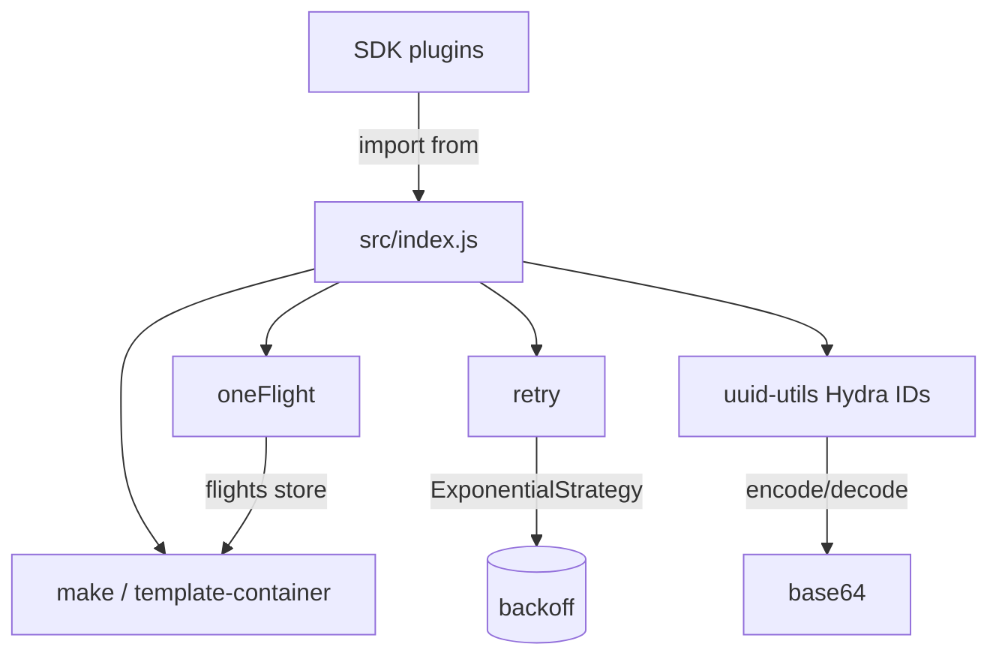
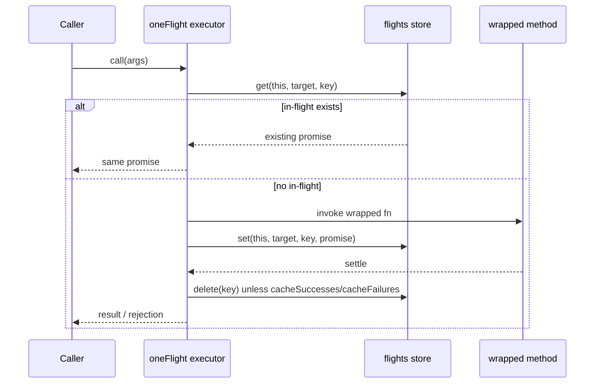
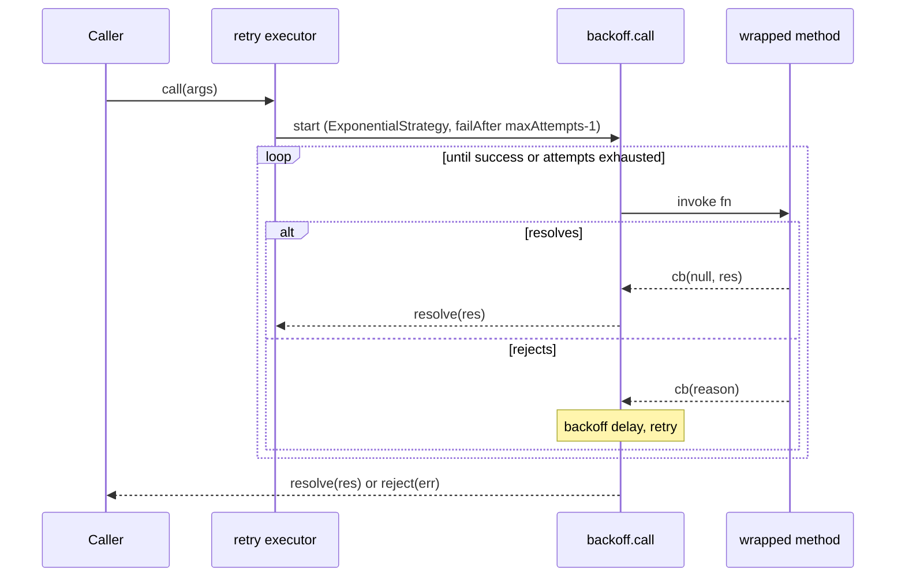
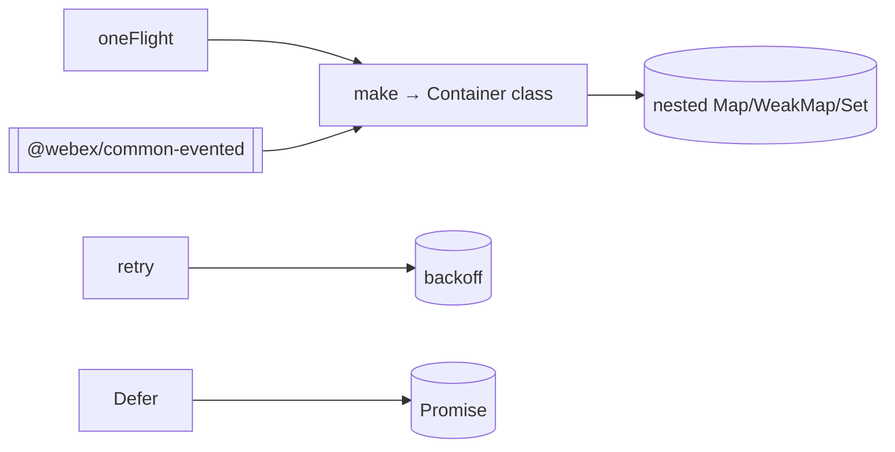

<!-- sdd-generated-metadata
generator: claude-cli
generator_model: us.anthropic.claude-opus-4-8
approved_by: pending-human-review
updated_at: 2026-08-06T00:00:00Z
validation_status: not-run
run_id: 51855eac-8de5-43a2-a3b6-dbcc55ebc91b
-->

# @webex/common — SPEC

> Start here → root [`AGENTS.md`](../../../../AGENTS.md) (agent entry) · router [`SPEC_INDEX.md`](../../../../ai-docs/SPEC_INDEX.md) · system [`ARCHITECTURE.md`](../../../../ai-docs/ARCHITECTURE.md). This is the module's canonical spec: orientation, requirements, design, flows, and tests.
> Context-efficiency: link to canonical docs — don't duplicate them. Load specs on demand per `SPEC_INDEX.md`.

## Metadata

| Field | Value |
|---|---|
| Module id | `common` |
| Source path(s) | `packages/@webex/common/src/` |
| Parent spec | `—` (shared base utility library consumed across the workspace; no parent module) |
| Doc kind | Module spec |
| Coverage score | Pending coverage assessment |
| Generated from | `module-spec` @ SDLC template library `0.2.2` |
| generated_by / approved_by / updated_at | claude-cli / pending-human-review / 2026-08-06 |
| Validation status | not-run, validator `pending`, assessed 2026-08-06 |

Coverage score is `Pending coverage assessment` until the first coverage review runs. Manifest coverage
state (`Partial`) is authoritative and kept in `.sdd/manifest.json`.

## Evidence Rules
Every requirement cites concrete source evidence using `file path`. Test evidence is preferred for WHY.
Requirements are grounded in the current implementation under `src/` and its co-located unit tests.

## Source Material Register

| Source material | Scope | Decision | Detail location or disposition |
|---|---|---|---|
| `N/A` | none | none | No pre-existing SDD/AI-docs, architecture, or spec documents were routed to this module; content is derived from source and tests. |

## Overview

`@webex/common` is the shared, low-level utility library that most of the Webex JS SDK plugins depend
on. It is intentionally broad: a barrel (`src/index.js`) re-exports a curated set of decorators,
promise/async helpers, encoding utilities, browser detection, Hydra ID conversion, and a multi-keyed
container factory. Each utility is small and independent; the package's job is to provide one canonical
implementation of each cross-cutting concern so plugins do not reinvent them.

Notable building blocks include `make` (the `template-container` factory that builds arbitrarily-nested
`WeakMap`/`Map`/`Set` containers — itself the substrate for `oneFlight` and `common-evented`), the
`oneFlight` decorator (de-duplicates in-flight promise-returning calls), `retry` (backoff-based retry
decorator), `Defer` (externally-resolvable promise), and the Hydra ID utilities that convert between
internal UUID/cluster tuples and public `ciscospark://` base64 IDs.

A maintainer should start at `src/index.js` to see the exported surface, then read the individual
single-responsibility files it points to.

## Purpose / Responsibility

Owns the SDK's shared cross-cutting utilities: promise/async control-flow decorators (`oneFlight`,
`retry`, `whileInFlight`, `resolveWith`, `tap`), the multi-keyed `make` container, encoding/ID helpers
(`base64`, `uuid-utils` Hydra IDs, `oauth-state`), event helpers (`proxyEvents`, `transferEvents`,
`event-envelope`), browser detection, and small primitives (`Defer`, `Exception`, `checkRequired`,
`cappedDebounce`, `deprecated`, `patterns`, `inBrowser`). It does NOT own transport, plugin registration,
or any domain behavior — those live in `http-core`, `webex-core`, and the plugins.

## Stack

JavaScript (Babel legacy build), Node `>=16`. Built with `webex-legacy-tools build` (`-js -ts -maps`).
Unit tests run via `webex-legacy-tools test --unit --runner jest`, using `@webex/test-helper-chai`,
`@webex/test-helper-mocha`, `sinon`, and `@sinonjs/fake-timers`. Runtime dependencies include `lodash`,
`backoff`, `bowser`, `core-decorators`, `global`, `safe-buffer`, and `urlsafe-base64`.

## Folder / Package Structure

```
packages/@webex/common/src/
├── index.js                 # Barrel: the curated public export surface
├── template-container.js    # `make(...containers)` multi-keyed container factory
├── one-flight.js            # `oneFlight` in-flight de-duplication decorator
├── retry.js                 # `retry` backoff-based retry decorator
├── defer.js                 # `Defer` externally-resolvable promise
├── base64.js                # base64 encode/decode helpers
├── uuid-utils.js            # Hydra ID construct/deconstruct + build* helpers
├── oauth-state.js           # encodeState / decodeState
├── events.js                # proxyEvents / transferEvents
├── event-envelope.js        # createEventEnvelope / ensureMyIdIsAvailable
├── browser-detection.js     # BrowserDetection / getBrowserSerial
├── constants.js             # deviceType, hydraTypes, SDK_EVENT, cluster names
├── in-browser*.js           # inBrowser flag (node/browser variants)
└── ...                      # checkRequired, capped-debounce, deprecated, patterns, tap, etc.
```

## Key Files (source of truth)

| File | Holds |
|---|---|
| `packages/@webex/common/src/index.js` | The authoritative list of what this package exports; import from here, not deep paths |
| `packages/@webex/common/src/template-container.js` | `make` container factory (backing store for `oneFlight` and `common-evented`) |
| `packages/@webex/common/src/constants.js` | `deviceType`, `hydraTypes`, `SDK_EVENT`, and the internal US cluster-name constants (do not hardcode elsewhere) |
| `packages/@webex/common/src/uuid-utils.js` | The canonical Hydra ID base URL and construct/deconstruct rules |

## Public Surface

Published, imported SDK/code API — no network, event-bus, or CLI surface of its own. The exports are
functions, decorators, classes, and constants re-exported from `src/index.js`.

| Contract ID | Type | Surface | Purpose | Compatibility / deprecation | Schema / detail link | Root index |
|---|---|---|---|---|---|---|
| `common.make` | SDK | `make(...containers) -> Container` | Build a multi-keyed nested container from `Map`/`WeakMap`/`Set` constructors | Stable named export; container method contract is semver-controlled | `packages/@webex/common/src/template-container.js` | `../../../../ai-docs/CONTRACTS.md` |
| `common.oneFlight` | SDK | `oneFlight(options?)` decorator | De-duplicate concurrent promise-returning method calls, keyed optionally by `keyFactory` | Stable named export; decorator semantics semver-controlled | `packages/@webex/common/src/one-flight.js` | `../../../../ai-docs/CONTRACTS.md` |
| `common.retry` | SDK | `retry(options?)` decorator | Retry a promise-returning method with exponential backoff up to `maxAttempts` | Stable named export | `packages/@webex/common/src/retry.js` | `../../../../ai-docs/CONTRACTS.md` |
| `common.Defer` | SDK | `new Defer()` → `{promise, resolve, reject}` | Externally-resolvable promise wrapper | Stable named export | `packages/@webex/common/src/defer.js` | `../../../../ai-docs/CONTRACTS.md` |
| `common.hydraIds` | SDK | `constructHydraId` / `deconstructHydraId` / `buildHydra*` | Convert between internal UUID+type+cluster tuples and public base64 `ciscospark://` IDs | Stable named exports; ID format is a wire-visible contract | `packages/@webex/common/src/uuid-utils.js` | `../../../../ai-docs/CONTRACTS.md` |
| `common.misc` | SDK | `base64`, `checkRequired`, `cappedDebounce`, `proxyEvents`, `transferEvents`, `tap`, `resolveWith`, `whileInFlight`, `Exception`, `deprecated`, `inBrowser`, `patterns`, `BrowserDetection`, constants | Assorted shared helpers/constants | Stable named exports | `packages/@webex/common/src/index.js` | `../../../../ai-docs/CONTRACTS.md` |

Compatibility notes:
- The `src/index.js` barrel is the semver-controlled surface; deep imports are not part of the contract.
- The Hydra ID base URL and the `ciscospark://<cluster>/<TYPE>/<id>` encoding are externally visible
  contracts — changes are breaking for any consumer or backend that parses these IDs.

## Requires (dependencies)

- `lodash` (`^4.17.21`) — used by `retry`, `one-flight`, and other helpers.
- `backoff` (`^2.5.0`) — exponential-backoff strategy for `retry`.
- `bowser` (`^2.11.0`) — underlies `browser-detection`.
- `core-decorators`, `global`, `safe-buffer`, `urlsafe-base64` — supporting primitives for decorators,
  globals, buffers, and URL-safe base64.

## Requirements

| ID | WHAT | WHY | Source Evidence | Test / Example Evidence | Assumptions / Gaps | Confidence |
|---|---|---|---|---|---|---|
| `COMMON-R-001` | `src/index.js` re-exports a fixed, curated set of named/default utilities (decorators, promise helpers, ID/base64 helpers, event helpers, browser detection, constants). | A single barrel gives every plugin one canonical import path and hides internal file layout. | `packages/@webex/common/src/index.js` | `packages/@webex/common/test/unit/` | none identified | PRESENT |
| `COMMON-R-002` | `make(...containers)` builds a nested container whose `get`/`set`/`has`/`delete`/`add`/`clear`/`size` operate across the composed key tuple, creating child containers on demand and pruning empty branches. | Plugins need multi-keyed (e.g. instance+prop, instance+target+key) storage without leaking references, especially with `WeakMap` outer keys. | `packages/@webex/common/src/template-container.js` | `packages/@webex/common/test/unit/` | Insert dispatch supports `add`/`set`/`push`; unknown container types throw `TypeError` | PRESENT |
| `COMMON-R-003` | `oneFlight` de-duplicates concurrent calls to a decorated promise method by key (prop plus optional `keyFactory`), returning the existing in-flight promise; by default it evicts the cache on settle unless `cacheSuccesses`/`cacheFailures` are set. | Prevents redundant concurrent network/work for the same logical request while allowing opt-in caching. | `packages/@webex/common/src/one-flight.js` | `packages/@webex/common/test/unit/` | Uses a `make(WeakMap, Map, Map)` `flights` store keyed by `(this, target, innerKey)` | PRESENT |
| `COMMON-R-004` | `retry` wraps a promise-returning method to retry via `backoff` up to `maxAttempts` (default 3), using an exponential strategy (or fixed 1ms when `backoff:false`), and forwards `progress`/`upload-progress`/`download-progress` events. | Transient failures should be retried with backoff without callers writing retry loops, while progress events remain observable. | `packages/@webex/common/src/retry.js` | `packages/@webex/common/test/unit/` | Rejections without an error object are replaced with a synthetic `Error` | PRESENT |
| `COMMON-R-005` | `Defer` constructs an object exposing `promise` plus its `resolve`/`reject` functions for external settlement. | Some flows must settle a promise from outside its executor (e.g. event-driven completion). | `packages/@webex/common/src/defer.js` | `packages/@webex/common/test/unit/` | none identified | PRESENT |
| `COMMON-R-006` | `constructHydraId(type, id, cluster='us')` base64-encodes `ciscospark://<cluster>/<TYPE>/<id>`, forcing `us` for `PEOPLE`/`ORGANIZATION`; `deconstructHydraId` decodes back to `{id, type, cluster}`. | Public Hydra IDs must be produced and parsed consistently across the SDK and match the backend contract. | `packages/@webex/common/src/uuid-utils.js` | `packages/@webex/common/test/unit/` | Required `type`/`id` throw when omitted; `type` must be a string | PRESENT |

## Design Overview

The package is a collection of independent single-file utilities unified by the `src/index.js` barrel.
The most structurally important piece is `template-container.js`'s `make`, a recursive factory: it
`shift()`s the first constructor as the top container, recursively builds a `ChildContainer` from the
rest, and stores per-instance data/sizes in module-level `WeakMap`s so the container object itself stays
clean. `get`/`set`/`delete` walk the key tuple, lazily creating child containers and decrementing/pruning
sizes as entries are removed. `insert` dispatches to `add`/`set`/`push` based on the concrete container
type, throwing for anything unrecognized.

Both `oneFlight` and `retry` are decorators implemented with lodash `wrap`, replacing `descriptor.value`
with an executor and including the ampersand-compatibility shim (`if (typeof target === 'object' &&
!target.prototype) target[prop] = descriptor.value`). `oneFlight` keys in-flight promises in a
`make(WeakMap, Map, Map)` store; `retry` composes `backoff.call` with an `ExponentialStrategy` and
re-exposes progress events via an `EventEmitter` bolted onto the returned promise.

## Data Flow



## Sequence Diagram(s)

Sequence coverage:

| Operation group | Diagram | Failure / recovery coverage |
|---|---|---|
| De-duplicated call (`oneFlight`) | 1. oneFlight de-duplication | `alt` shows cache hit vs. miss; settle path evicts unless caching opted in |
| Retryable call (`retry`) | 2. retry with backoff | Loop covers failure→backoff→retry and final reject after `maxAttempts` |

### 1. oneFlight de-duplication



### 2. retry with backoff



## Class / Component Relationships



`make` produces a `Container` class; `oneFlight` (and the sibling `@webex/common-evented` package)
consume it for keyed storage. `retry` composes the external `backoff` library. `Defer` wraps a native
`Promise`.

## Use Cases

- **UC-1 Single-flight a fetch:** decorate a network method with `@oneFlight({keyFactory})` so concurrent
  callers share one request. Evidence: `packages/@webex/common/src/one-flight.js` (consumed by, e.g.,
  `@webex/internal-plugin-avatar`'s `_fetchAvatarUrl`).
- **UC-2 Retry a flaky call:** decorate with `@retry({maxAttempts})` to auto-retry with backoff.
  Evidence: `packages/@webex/common/src/retry.js`.
- **UC-3 Convert IDs:** `constructHydraId('PEOPLE', uuid)` / `deconstructHydraId(hydraId)` to move between
  internal UUIDs and public IDs. Evidence: `packages/@webex/common/src/uuid-utils.js`.

## State Model

This package is largely stateless per call, but two decorators hold module-level state in `make`-built
containers: `oneFlight` keeps a `flights` store of in-flight promises keyed by `(instance, target,
innerKey)`, and the sibling evented decorator uses a similar store. These stores are pruned on settle
(oneFlight) so they do not grow unboundedly, and outer `WeakMap` keys allow instance garbage collection.
Evidence: `packages/@webex/common/src/one-flight.js`, `packages/@webex/common/src/template-container.js`.

## Business Rules & Invariants

- Hydra IDs for `PEOPLE` and `ORGANIZATION` types are ALWAYS encoded with cluster `us`, regardless of the
  passed cluster — enforced in `constructHydraId` (`src/uuid-utils.js`).
- `constructHydraId` requires both `type` and `id`; a missing required argument throws
  `parameter is required`, and a non-string `type` throws `"type" must be a string`.
- `make`'s `insert` must resolve a supported container operation (`add`/`set`/`push`) or it throws a
  `TypeError` — no silent misinsertion.

## Concurrency & Reactive Flow

`oneFlight` is explicitly a concurrency primitive: the same logical operation invoked concurrently yields
the identical promise, and the cache entry is removed when the promise settles (unless success/failure
caching is enabled). `retry` schedules asynchronous retries via `backoff` and must not block; it forwards
progress events through an `EventEmitter` so long-running retried operations remain observable. Evidence:
`packages/@webex/common/src/one-flight.js`, `packages/@webex/common/src/retry.js`.

## Error Handling & Failure Modes

| Condition | Signal (error/code/result) | Caller recovery |
|---|---|---|
| Required Hydra ID argument missing | `Error: parameter is required` | Supply `type` and `id` |
| Non-string Hydra `type` | `Error: "type" must be a string` | Pass a string type (e.g. `hydraTypes.PEOPLE`) |
| `make` insert into unsupported container | `TypeError: Could not determine how to insert...` | Compose `make` only from `Map`/`WeakMap`/`Set`/array-like containers |
| `retry`ed method rejects with no error | Synthetic `Error('retryable method failed without providing an error object')` | Reject with a real `Error` from the wrapped method |

## Pitfalls

- `oneFlight`/`retry` are decorators built with lodash `wrap`; the ampersand-compatibility shim mutates
  `target[prop]` for object (non-prototype) targets — be aware when applying them outside class methods.
- `make`'s data/sizes live in module-level `WeakMap`s; two containers built from separate `make(...)`
  calls are independent, but a single `Container` instance's `size` is only accurate for entries inserted
  through its own `set`/`add`/`delete`.
- Hydra ID encoding is base64 of a `ciscospark://` URL — treat the produced string as opaque; do not
  hand-parse it, use `deconstructHydraId`.

## Module Do's / Don'ts

- DO import shared helpers from `@webex/common` (the barrel) rather than reimplementing base64, retry,
  single-flight, debounce, or ID conversion in a plugin.
- DO source `deviceType`, `hydraTypes`, `SDK_EVENT`, and cluster-name constants from `src/constants.js`.
- DON'T deep-import internal files as if they were stable API; only the `src/index.js` surface is
  semver-controlled.

## Export Stability

The `src/index.js` barrel is the semver surface. Adding a new named export is a minor change; removing or
renaming an export, or changing a decorator's call semantics or the Hydra ID format, is a major
(breaking) change because plugins and, for IDs, backends depend on them.

## Test-Case Strategy (module)

Unit tests are co-located under `packages/@webex/common/test/unit/` and exercise each utility
independently: container get/set/delete/size across composed keys, `oneFlight` de-duplication and cache
eviction, `retry` success-after-failure and exhaustion, `Defer` external settlement, and Hydra ID
round-tripping including the `PEOPLE`/`ORGANIZATION` cluster override and required-argument errors.

| Behavior / Requirement | Existing test evidence | Gap |
|---|---|---|
| `COMMON-R-001` | `packages/@webex/common/test/unit/` | Confirm the barrel export list is asserted, not just individual helpers |
| `COMMON-R-002` | `packages/@webex/common/test/unit/` | Re-check empty-branch pruning and `TypeError` insert path during validation |
| `COMMON-R-003` | `packages/@webex/common/test/unit/` | Re-check `cacheSuccesses`/`cacheFailures` opt-in paths |
| `COMMON-R-004` | `packages/@webex/common/test/unit/` | Re-check `backoff:false` fixed-delay and progress-event forwarding |
| `COMMON-R-005` | `packages/@webex/common/test/unit/` | none identified |
| `COMMON-R-006` | `packages/@webex/common/test/unit/` | Re-check deconstruct of non-`us` cluster IDs |

## Traceability

- Repo architecture: [`ARCHITECTURE.md`](../../../../ai-docs/ARCHITECTURE.md) · Registry: [`SPEC_INDEX.md`](../../../../ai-docs/SPEC_INDEX.md)
- Contracts catalog: [`CONTRACTS.md`](../../../../ai-docs/CONTRACTS.md)
- Coverage state & contracts baseline: `.sdd/manifest.json`
