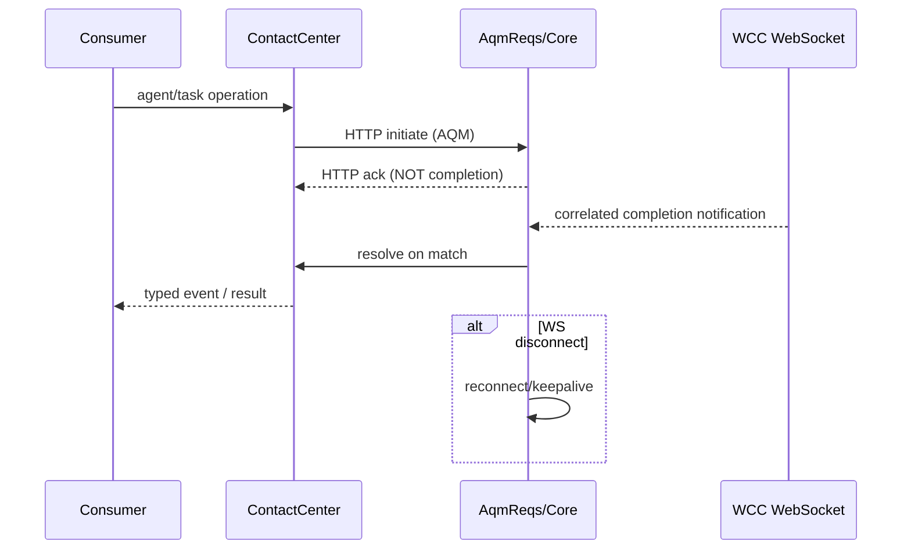
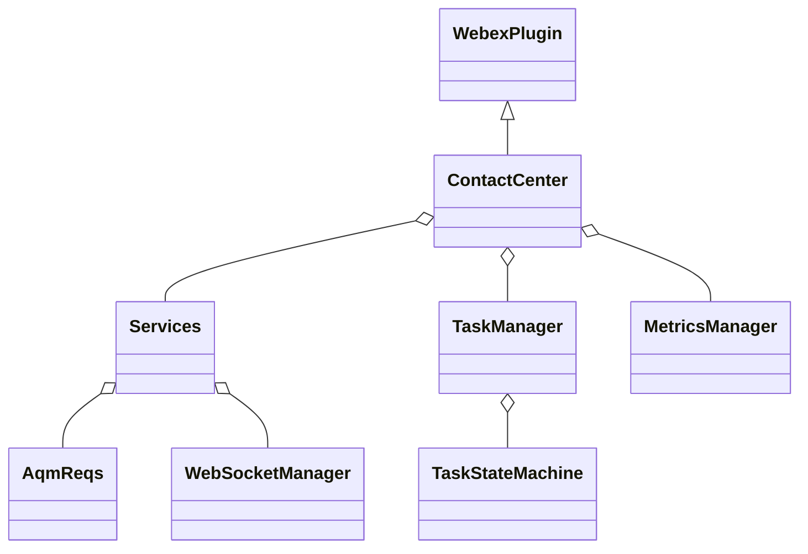

# @webex/contact-center (package) — SPEC

> Start here → root [`AGENTS.md`](../../../../AGENTS.md) (agent entry) · router [`SPEC_INDEX.md`](../../../../ai-docs/SPEC_INDEX.md) · system [`ARCHITECTURE.md`](../../../../ai-docs/ARCHITECTURE.md). This is the package's root-level canonical spec; per-submodule detail lives in the package-local `.sdd` tree.
> Context-efficiency: link to canonical docs — don't duplicate them.

## Metadata
| Field | Value |
|---|---|
| Module id | `packages/@webex/contact-center` |
| Source path(s) | `packages/@webex/contact-center/src/` |
| Parent spec | — |
| Doc kind | Module spec |
| Coverage score | Pending coverage assessment |
| Generated from | `module-spec` @ SDLC template library `0.2.2` |
| generated_by / approved_by / updated_at | claude-cli / pending / 2026-08-05T00:00:00Z |
| Validation status | not-run |

## Evidence Rules
Migrated from `packages/@webex/contact-center/AGENTS.md`, `ai-docs/ARCHITECTURE.md`, and the existing package-local canonical `ai-docs/contact-center-spec.md`. The package maintains its own complete SDD tree (`packages/@webex/contact-center/.sdd/manifest.json` + submodule specs), authoritative for submodule detail; this root-routed spec aggregates and routes to it. Confidence PRESENT where quoted from the migrated package docs; WEAK where not re-verified against current code in this pass.

## Source Material Register
| Source material | Scope | Decision | Detail location or disposition |
|---|---|---|---|
| Reviewed prior package agent-entry | overview / API | used | Overview/rules/commands/gotchas → Overview/Stack/Pitfalls/Do's; original retained. |
| Reviewed prior package architecture | architecture / API | used | AQM correlation, composition order, state → Design/Data Flow/State/Concurrency; original retained. |
| Existing package canonical spec + submodule tree | architecture / API / tests | reference-only | Authoritative in the package `.sdd` tree; referenced by contract id from Sub-modules. |

## Overview
`@webex/contact-center` is a published, host-embedded Webex SDK plugin for Contact Center: agent registration, configuration, realtime events, task/call control, data lookup, and telemetry. `ContactCenter` owns the public façade and composes services for config, agent requests, tasks/calling, data lookup, realtime events, transport, and metrics. Two interaction styles are deliberate: direct REST for immediate responses, and AQM (HTTP initiation + correlated WebSocket completion) for event-driven agent/task operations. Typed events and XState isolate consumers from raw backend messages.

## Purpose / Responsibility
Owns the Contact Center SDK plugin surface and its service composition. It does NOT render UI (it exposes state and UI-control contracts to host apps) and owns no durable datastore; remote WCC services own domain records.

## Stack
TypeScript 5.4; Node 22.14 for workspace dev (published engine floor Node >=20.x); Yarn 3.4.1; WebexPlugin, EventEmitter, XState 5, WebSocket/WebRTC. Jest 27 with 85% global branch/function/line/statement thresholds.

## Folder / Package Structure
```
packages/@webex/contact-center/src/
├── (cc.ts / index.ts)          # public plugin façade & registration
├── metrics/                     # telemetry
├── services/                    # service composition
│   ├── agent/                   #   agent request contracts
│   ├── config/                  #   configuration aggregation
│   ├── core/                    #   HTTP + WebSocket + AQM correlation
│   └── task/                    #   task/call lifecycle
│       └── state-machine/       #     XState task lifecycle
└── utils/                       # pagination + PageCache
```

## Sub-modules
<!-- module.has_submodules = true — routed to the package-local .sdd tree -->
| Sub-module | Responsibility | Manifest coverage state | Spec |
|---|---|---|---|
| `src` | Published plugin surface, registration, event routing | Partial | `packages/@webex/contact-center/ai-docs/contact-center-spec.md` |
| `src/metrics` | CC behavioral/operational/business telemetry | Partial | `packages/@webex/contact-center/src/metrics/ai-docs/metrics-spec.md` |
| `src/services` | Service composition/bootstrap order | Partial | `packages/@webex/contact-center/src/services/ai-docs/services-spec.md` |
| `src/services/agent` | Agent login/logout/state/buddy/relogin | Partial | `packages/@webex/contact-center/src/services/agent/ai-docs/agent-spec.md` |
| `src/services/config` | Org/agent/team/profile/aux/dial-plan config | Partial | `packages/@webex/contact-center/src/services/config/ai-docs/config-spec.md` |
| `src/services/core` | WebexRequest, WebSocketManager, ConnectionService, AqmReqs | Partial | `packages/@webex/contact-center/src/services/core/ai-docs/core-spec.md` |
| `src/services/task` | Task/Voice/WebRTC/Digital lifecycle, TaskManager | Partial | `packages/@webex/contact-center/src/services/task/ai-docs/task-spec.md` |
| `src/services/task/state-machine` | XState task states/guards/actions/UI-control derivation | Partial | `packages/@webex/contact-center/src/services/task/state-machine/ai-docs/task-state-machine-spec.md` |
| `src/utils` | PageCache + pagination/search/cache contracts | Partial | `packages/@webex/contact-center/src/utils/ai-docs/utils-spec.md` |

Scope rule: submodule behavior is recorded in its package-local spec and referenced here by contract id, not duplicated.

## Key Files (source of truth)
| File | Holds |
|---|---|
| `packages/@webex/contact-center/src/cc.ts` | Public plugin entry; call routing |
| `packages/@webex/contact-center/src/services/core/` | WebexRequest, WebSocketManager, ConnectionService, AqmReqs |
| `packages/@webex/contact-center/src/services/task/state-machine/` | XState task lifecycle |
| `packages/@webex/contact-center/.sdd/manifest.json` | Authoritative package-local module/coverage registry |

## Public Surface
| Contract ID | Type | Surface | Purpose | Compatibility / deprecation | Schema / detail link | Root index |
|---|---|---|---|---|---|---|
| `contact-center.ContactCenter` | SDK | `ContactCenter` WebexPlugin + `cc.*` methods/events | Agent/task/config/realtime CC surface | semver-sensitive | package-local spec | [`CONTRACTS.md`](../../../../ai-docs/CONTRACTS.md) |
| `contact-center.userPreference` | SDK | `cc.userPreference` + user-preference request/response types | User-preference CRUD | semver-sensitive | package-local spec | [`CONTRACTS.md`](../../../../ai-docs/CONTRACTS.md) |
| `contact-center.previewCampaign` | SDK | `acceptPreviewContact`/`skipPreviewContact`/`removePreviewContact` | Preview-campaign task ops | semver-sensitive | package-local task spec | [`CONTRACTS.md`](../../../../ai-docs/CONTRACTS.md) |

Compatibility notes:
- Published exports/types are semver-sensitive; changes require a compatible path or migration plan.

## Requires (dependencies)
- `@webex/webex-core` (host/plugin runtime), `@webex/calling` (WebRTC calling), `@webex/internal-plugin-metrics`, `@webex/internal-plugin-mercury`.
- WCC services via `wcc-api-gateway` (service-catalog identifier resolved through the host SDK), Contact Center REST + WebSocket.

## Requirements
| ID | WHAT | WHY | Source Evidence | Test / Example Evidence | Assumptions / Gaps | Confidence |
|---|---|---|---|---|---|---|
| `CC-R-001` | `ContactCenter` registers as a WebexPlugin and initializes WebexRequest, Services, MetricsManager, WebCallingService, TaskManager, and data services in an evidence-backed order | Deterministic bootstrap | `src/cc.ts`, `src/services/` | package-local specs/tests | none | PRESENT |
| `CC-R-002` | Event-driven agent/task operations use AQM: HTTP initiation followed by a correlated WebSocket completion; the HTTP ack is not completion | Correct async completion semantics | `src/services/core/` | package-local core spec | none | PRESENT |
| `CC-R-003` | Task lifecycle is driven by a typed XState machine; transitions go through typed TaskEvent mapping and guards | Deterministic, testable task state | `src/services/task/state-machine/` | package-local state-machine spec | none | PRESENT |
| `CC-R-004` | Config aggregation is all-or-nothing (no partial profile) | Avoid inconsistent runtime behavior | `src/services/config/` | package-local config spec | none | PRESENT |
| `CC-R-005` | `PageCache` bypasses search/filter/attributes/sort queries to avoid stale/incorrect reuse | Cache-correctness | `src/utils/` | package-local utils spec | none | PRESENT |
| `CC-R-006` | Telemetry is non-blocking and listeners are cleaned up on deregistration | Event-loop safety + no leaks | `src/metrics/`, `src/cc.ts` | package-local specs | none | WEAK |

## Design Overview
A host-embedded plugin: `ContactCenter` is the façade composing config/agent/task/core/metrics collaborators. `core` owns authenticated HTTP, the realtime WebSocket lifecycle, and AQM request correlation with reconnect/keepalive; `task` orchestrates lifecycle via the XState machine and converts backend events to task/state-machine events through `TaskManager`. Typed events and XState decouple consumers from raw backend messages. Detailed per-service design lives in the package-local specs.

## Data Flow
```mermaid
flowchart LR
  Host[Host Webex SDK] --> CC[ContactCenter]
  CC --> Services
  CC --> Task
  CC --> Metrics
  Services --> Agent
  Services --> Config
  Services --> Core
  Services --> Utils
  Task --> SM[Task state machine]
  Services --> REST[WCC REST]
  Core <--> WS[WCC WebSocket]
  Task --> Calling[@webex/calling / WebRTC]
  Metrics --> Telemetry[Webex metrics]
```

## Sequence Diagram(s)
Sequence coverage:

| Operation group | Diagram | Failure / recovery coverage |
|---|---|---|
| AQM agent/task operation | AQM correlation sequence | WebSocket completion vs HTTP ack; reconnect |



## Class / Component Relationships


## Use Cases
- **UC-1 Agent state change:** `cc` state-change → AQM HTTP initiate → correlated WS completion → typed `AGENT_EVENTS`. Evidence: `src/services/agent/`, `src/services/core/`.
- **UC-2 Handle a task:** incoming task → TaskManager → XState transition → task event to host. Evidence: `src/services/task/`.

Cross-service flow: use cases cross the plugin → WCC REST/WebSocket (+ @webex/calling WebRTC) boundary.

## State Model
<!-- module.holds_client_state = true -->
`ContactCenter` retains agent profile, task collections, WebSocket/reconnect flags, metrics queues/timers, page-cache entries, and task actors in memory; remote WCC systems remain authoritative for records. Task actors are XState instances.

## Business Rules & Invariants
<!-- module.enforces_domain_rules = true -->
- Config aggregation is all-or-nothing.
- Task transitions must go through typed TaskEvent mapping and guards.
- Listener cleanup requires the same function reference used at registration.

## Concurrency & Reactive Flow
<!-- module.is_concurrent_async = true -->
- AQM completion may arrive over WebSocket after an HTTP ack; never treat the ack as completion.
- Reconnect/keepalive and timeouts are explicit; telemetry is non-blocking.
- Listeners are cleaned up on deregistration to avoid leaks.

## State Machine
<!-- module.stateful_transitions = true -->
Task lifecycle is a deterministic XState machine with transition guards/actions and state-derived UI-control computation. Exact states/guards live in `src/services/task/state-machine/ai-docs/task-state-machine-spec.md`; referenced here, not duplicated.

## Protocol / Wire Format
<!-- module.exposes_wire_protocol = true -->
- Direct WCC REST for immediate responses; AQM = HTTP initiation correlated with WCC WebSocket notifications. Frame/correlation ownership lives in `src/services/core/` and its package-local spec.

## Error Handling & Failure Modes
<!-- module.returns_caller_errors = true -->
| Condition | Signal (error/code/result) | Caller recovery |
|---|---|---|
| AQM operation failure | typed error / rejected task event | Retry per operation policy |
| WebSocket disconnect | reconnect flags + keepalive | Await reconnect; do not assume completion |
| Partial config | rejected (all-or-nothing) | Retry full aggregation |

## Pitfalls
- AQM completion arrives over WebSocket after the HTTP ack; do not treat the ack as completion.
- Listener cleanup requires the same function reference used at registration.
- `PageCache` bypasses search/filter/attributes/sort queries — do not rely on it for those.

## Module Do's / Don'ts
<!-- module.module_specific_conventions = true -->
- DO use LoggerProxy with module/method context; DON'T use console logging in package implementation.
- DO use typed event constants and preserve `trigger` vs `emit` ownership.
- DO preserve AQM HTTP+WebSocket correlation/timeout/recovery semantics.

## Export Stability
<!-- module.published_package = true -->
Published as `@webex/contact-center`; public types/events/methods must remain compatible or ship a migration plan. Node engine floor >=20.x for the published package.

## Host Integration & Theming
<!-- module.embedded_in_host = true -->
Embedded in the host Webex SDK as the `ContactCenter` plugin; it renders no UI but exposes state and UI-control contracts to host applications (e.g. the `samples-cc-react-app` widgets exercised by `cc_playwright`). Requires the host Webex SDK runtime and `@webex/calling` for WebRTC.

## Key Design Trade-off
<!-- module.has_design_tradeoff = true -->
- Choosing AQM (HTTP initiate + correlated WebSocket completion) over pure REST trades request simplicity for correct event-driven completion semantics at scale.

## Test-Case Strategy (module)
Jest 27 with an 85% global coverage bar; state/error/timeout/cleanup paths must be covered. Per-submodule coverage and gaps are tracked in the package-local `.sdd/manifest.json` and submodule specs.

| Behavior / Requirement | Existing test evidence | Gap |
|---|---|---|
| `CC-R-002` | package-local core spec/tests | root-level % not yet measured |
| `CC-R-003` | package-local state-machine tests | confirm guard coverage |
| `CC-R-006` | package-local metrics tests | confirm listener-cleanup negative tests |

## Traceability
- Repo architecture: [`../../../../ai-docs/ARCHITECTURE.md`](../../../../ai-docs/ARCHITECTURE.md) · Registry: [`../../../../ai-docs/SPEC_INDEX.md`](../../../../ai-docs/SPEC_INDEX.md)
- Package-local registry: `packages/@webex/contact-center/.sdd/manifest.json`
- Coverage state & contracts baseline: `.sdd/manifest.json`
