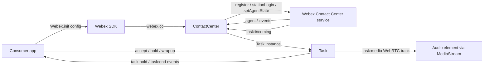
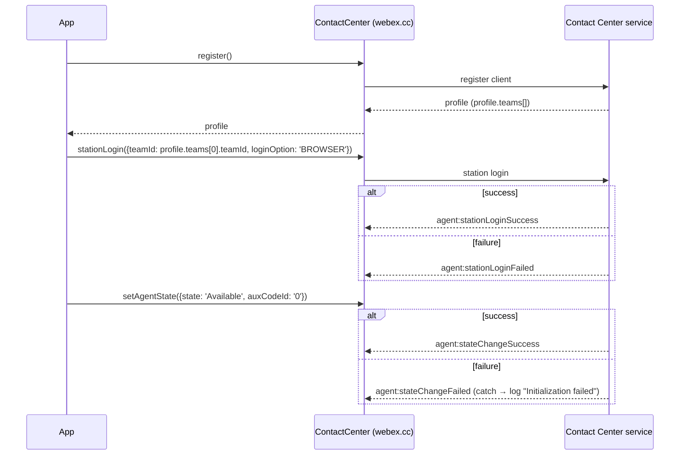
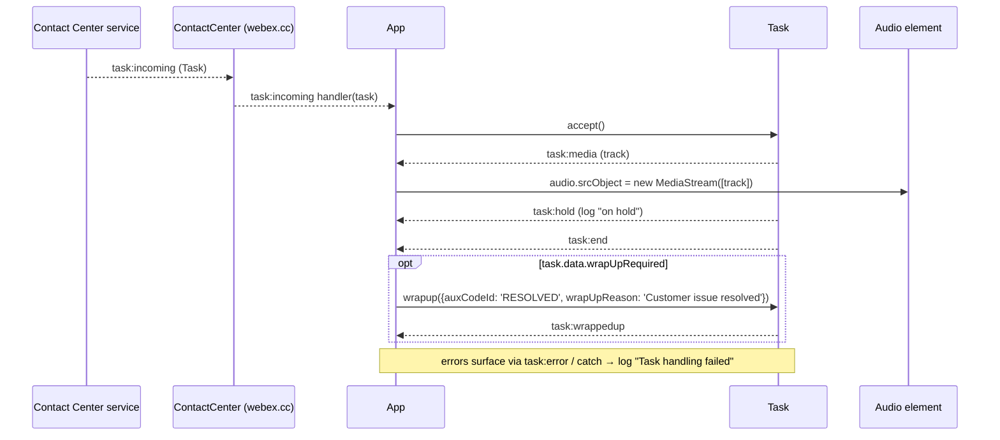
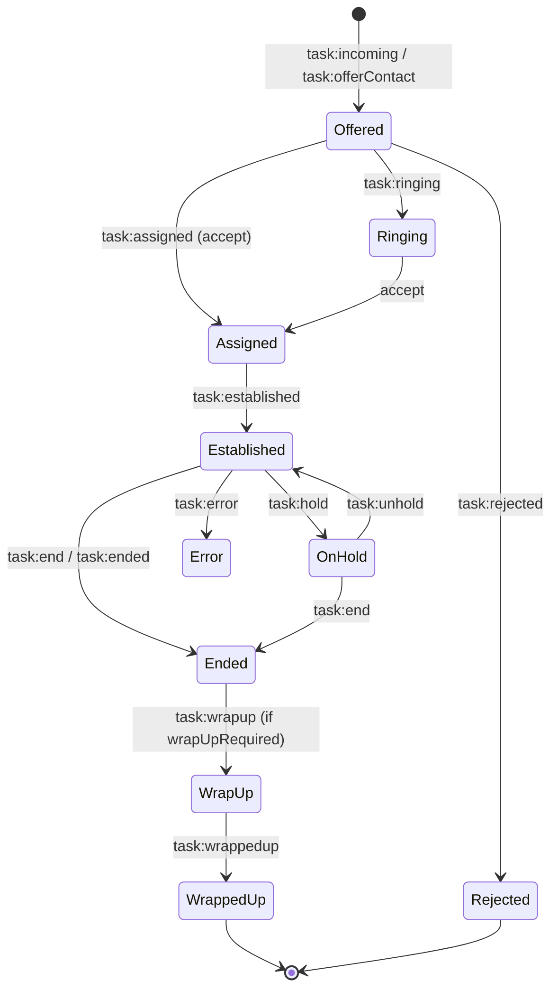

# Contact Center — SPEC

> Start here → root [`AGENTS.md`](../../../../AGENTS.md) (agent entry) · router [`SPEC_INDEX.md`](../../../../ai-docs/SPEC_INDEX.md) · system [`ARCHITECTURE.md`](../../../../ai-docs/ARCHITECTURE.md). This is the module's canonical spec: orientation, requirements, design, flows, state, protocol, UI, data, and tests. (Multi-repo: the root `AGENTS.md` may be the workspace-level one.)
> Context-efficiency: link to canonical docs — don't duplicate them. Load specs on demand per `SPEC_INDEX.md`.

## Metadata
| Field | Value |
|---|---|
| Module id | `contact-center` |
| Source path(s) | `packages/@webex/contact-center/` |
| Doc kind | Module spec |
| Manifest coverage state | Partial |
| Migration mode | Assess-only migration; code is source of truth |
| Coverage score | 56% (9/16) assessed 2026-07-28; critical 5/8; typedoc.md-sourced (no src/ cross-check), all requirements WEAK, no test evidence — stays Partial |
| Generated from | `module-spec` @ SDLC template library `0.2.1` |
| generated_by / approved_by / updated_at | module-spec / (unapproved) / 2026-07-28 |
| Validation status | not-run |

Coverage score is `Pending coverage assessment` until the first coverage assessment runs; the manifest
coverage state for this module is **Partial**. This migration is assess-only: the module source code
under `packages/@webex/contact-center/` is the source of truth, and this spec captures the routed source
doc by meaning without asserting verified behavior.

## Evidence Rules
Every generated requirement below must cite concrete source evidence using `file path`. Separate source
evidence, test evidence, examples, assumptions, and gaps so validators and future agents can distinguish
truth from context. Test evidence is preferred for WHY. Commit evidence is allowed only when the
repository policy says history is reliable, and must include the commit hash. If evidence is missing or
conflicting, ask a focused discovery question before finalizing the requirement; record unresolved answers
as approved unknowns only when the human explicitly defers or does not know.

## Source Material Register
| Source material | Scope | Decision | Detail location or disposition |
|---|---|---|---|
| `packages/@webex/contact-center/typedoc.md` (routed, migrate-existing, retain) | overview / API / configuration / events | used / migrated by meaning | Feature list → Overview & Purpose; installation/init → Overview + Configuration Reference (code preserved); config table → Configuration Reference; ContactCenter/Task capabilities → Public Surface & Class/Component Relationships; register→stationLogin→setAgentState workflow → Sequence Diagram(s) & Use Cases (code preserved); task handling/wrap-up → Sequence Diagram(s) & Use Cases (code preserved); agent/task/media event inventories → Events; support/portal note → Pitfalls & Traceability. |

## Overview
`@webex/contact-center` is a plugin for the [Webex JS SDK](https://github.com/webex/webex-js-sdk) that
integrates a browser or Node client with Webex Contact Center. It provides APIs for agent management,
task (interaction) handling, and real-time communications. The plugin is consumed as a Webex plugin:
the SDK is initialized and the contact-center surface is reached through `webex.cc`.

The module's headline capabilities are: **agent lifecycle** (login, state, profile); **task operations**
across calls, chats, and media; **event-driven updates** so callers react to state changes rather than
poll; **WebRTC browser calling** for voice interactions handled directly in the browser; and first-class
**TypeScript support**.

A maintainer should start at the plugin entry point (`webex.cc`), which exposes the `ContactCenter` class
for session and agent operations, and the `Task` class for individual interactions. Both surfaces are
event-driven: agent-level events flow off the contact-center object and task-level events flow off each
`Task`. WebRTC media (voice) arrives as a media track through the `task:media` event, which the caller
attaches to an audio element.

## Purpose / Responsibility
Owns the agent and task lifecycle for a Webex Contact Center client session: agent registration, station
login/logout, agent-state management, and per-interaction task handling (accept/decline, media control,
transfer/consultation, and wrap-up). It does NOT own the underlying Webex SDK transport, authentication
token issuance, or the server-side contact-center routing engine.

## Stack
TypeScript (Webex JS SDK plugin). Distributed as the npm package `@webex/contact-center`. Uses WebRTC for
browser-based voice calling and an event-driven (EventEmitter-style) model for state updates. Test stack:
None found in the routed source doc (assess-only migration; see Test-Case Strategy).

## Folder / Package Structure
```
packages/@webex/contact-center/
├── ai-docs/          # canonical SDD module docs (this spec)
├── typedoc.md        # routed source doc migrated by meaning into this spec
└── (module source)   # ContactCenter + Task implementation (source of truth; not enumerated in the routed doc)
```

## Key Files (source of truth)
| File | Holds |
|---|---|
| `packages/@webex/contact-center/` (module source) | Authoritative implementation of the `ContactCenter` and `Task` classes, config defaults, and emitted events. Assess-only migration: read the code for exact values. |
| `packages/@webex/contact-center/typedoc.md` | Routed source doc migrated by meaning into this spec (features, install/init, config table, class capabilities, event inventories, support note). |

## Public Surface
This module is consumed as an imported SDK plugin. Callers install the package, initialize Webex, and use
`webex.cc` (the `ContactCenter` instance); each interaction is a `Task` instance. The tables below give
the method surface; the emitted events are enumerated under [Events](#events).

### ContactCenter class (`webex.cc`)
The `ContactCenter` class is the primary interface for agent operations. Capabilities:

1. **Session Management** — agent registration and initialization, connection management, event handling.
2. **Agent Operations** — station login/logout, state management (Available/Idle), profile updates.
3. **Task Management** — inbound task handling, outbound calling, queue operations.

| Contract ID | Type | Surface | Purpose | Compatibility / deprecation | Schema / detail link | Root index |
|---|---|---|---|---|---|---|
| `contact-center.register` | SDK | `cc.register()` | Register the client with the contact center; resolves to the agent **profile** (including `profile.teams`). | Assess-only; not verified | `packages/@webex/contact-center/typedoc.md` | `../../../../ai-docs/SPEC_INDEX.md` |
| `contact-center.stationLogin` | SDK | `cc.stationLogin({teamId, loginOption})` | Log the agent's station in; `loginOption: 'BROWSER'` selects WebRTC browser calling. | Assess-only; not verified | `packages/@webex/contact-center/typedoc.md` | `../../../../ai-docs/SPEC_INDEX.md` |
| `contact-center.setAgentState` | SDK | `cc.setAgentState({state, auxCodeId})` | Set agent availability state (e.g. `'Available'`) with an aux code. | Assess-only; not verified | `packages/@webex/contact-center/typedoc.md` | `../../../../ai-docs/SPEC_INDEX.md` |
| `contact-center.logout` | SDK | `cc.logout()` | Log the agent out (station logout); emits `agent:logoutSuccess` / `agent:logoutFailed`. | Assess-only; not verified | `packages/@webex/contact-center/typedoc.md` | `../../../../ai-docs/SPEC_INDEX.md` |
| `contact-center.on` | event | `cc.on('task:incoming', ...)`, agent events | Subscribe to agent-level and inbound-task events. | Assess-only; not verified | see [Events](#events) | `../../../../ai-docs/SPEC_INDEX.md` |

### Task class (`Task`)
The `Task` class represents an interaction (call, chat, etc.). Capabilities:

1. **Media Control** — mute/unmute, hold/resume, recording controls.
2. **Call Flow** — accept/decline, transfer operations, consultation features.
3. **Task Completion** — end interaction, wrap-up handling, disposition updates.

| Contract ID | Type | Surface | Purpose | Compatibility / deprecation | Schema / detail link | Root index |
|---|---|---|---|---|---|---|
| `contact-center.task.accept` | SDK | `task.accept()` | Accept an offered/incoming task. | Assess-only; not verified | `packages/@webex/contact-center/typedoc.md` | `../../../../ai-docs/SPEC_INDEX.md` |
| `contact-center.task.hold` | SDK | `task.hold()` / resume | Hold and resume the interaction (see `task:hold` / `task:unhold`). | Assess-only; not verified | `packages/@webex/contact-center/typedoc.md` | `../../../../ai-docs/SPEC_INDEX.md` |
| `contact-center.task.wrapup` | SDK | `task.wrapup({auxCodeId, wrapUpReason})` | Submit wrap-up / disposition after the interaction ends when `task.data.wrapUpRequired`. | Assess-only; not verified | `packages/@webex/contact-center/typedoc.md` | `../../../../ai-docs/SPEC_INDEX.md` |
| `contact-center.task.on` | event | `task.on('task:media' \| 'task:hold' \| 'task:end', ...)` | Subscribe to per-task media, state, and completion events. | Assess-only; not verified | see [Events](#events) | `../../../../ai-docs/SPEC_INDEX.md` |

Additional Task capabilities surfaced by the routed doc but not shown as explicit method signatures:
mute/unmute, decline, transfer, consultation, recording pause/resume (see recording events), and
disposition updates. Do not invent exact signatures beyond `accept`, `hold`/resume, and `wrapup`.

Compatibility notes:
- Assess-only migration; export stability and semver sensitivity are not verified from the routed doc.

## Events
The SDK uses an event-driven model to notify callers about state changes. Agent events fire on the
`ContactCenter` object (`webex.cc`); task events fire on each `Task` (and `task:incoming` on `cc`).

### Agent events
| Event | Meaning |
|---|---|
| `agent:stateChange` | Agent's state has changed (Available, Idle, etc.). |
| `agent:stateChangeSuccess` | Agent state change was successful. |
| `agent:stateChangeFailed` | Agent state change failed. |
| `agent:stationLoginSuccess` | Agent login was successful. |
| `agent:stationLoginFailed` | Agent login failed. |
| `agent:logoutSuccess` | Agent logout was successful. |
| `agent:logoutFailed` | Agent logout failed. |
| `agent:dnRegistered` | Agent's device number (DN) registered. |
| `agent:multiLogin` | Multiple logins detected. |
| `agent:reloginSuccess` | Agent relogin was successful. |

### Task events
| Event | Meaning |
|---|---|
| `task:incoming` | New task is being offered. |
| `task:assigned` | Task assigned to agent. |
| `task:unassigned` | Task unassigned from agent. |
| `task:media` | Media track received (voice, etc.). |
| `task:hold` | Task placed on hold. |
| `task:unhold` | Task resumed from hold. |
| `task:end` | Task completed. |
| `task:ended` | Task/call has ended. |
| `task:wrapup` | Task in wrap-up state. |
| `task:wrappedup` | Task wrap-up completed. |
| `task:rejected` | Task was rejected. |
| `task:hydrate` | Task data has been updated. |
| `task:offerContact` | Contact offered to agent. |
| `task:consultEnd` | Consultation ended. |
| `task:consultQueueCancelled` | Queue consultation cancelled. |
| `task:consultQueueFailed` | Queue consultation failed. |
| `task:consultAccepted` | Consultation accepted. |
| `task:consulting` | Consulting in progress. |
| `task:consultCreated` | Consultation created. |
| `task:offerConsult` | Consultation offered. |
| `task:established` | Task/call has been connected. |
| `task:error` | An error occurred during task handling. |
| `task:ringing` | Task/call is ringing. |
| `task:recordingPaused` | Recording paused. |
| `task:recordingPauseFailed` | Failed to pause recording. |
| `task:recordingResumed` | Recording resumed. |
| `task:recordingResumeFailed` | Failed to resume recording. |

### Media events
The subset of task events used for WebRTC/audio media handling:

| Event | Meaning |
|---|---|
| `task:media` | Media track received (attach to an audio element via `MediaStream`). |
| `task:hold` | Task placed on hold. |
| `task:unhold` | Task resumed. |

## Configuration Reference
Initialize the Contact Center plugin with the Webex SDK. Import the package, build an optional `config`,
call `Webex.init({config})`, obtain `webex.cc`, and use it once the SDK signals `ready`:

```javascript
import Webex from '@webex/contact-center';

const config = {
  credentials: {
    access_token: 'your-access-token', // Required for authentication
  },
  logger: {
    level: 'debug', // Enhanced logging for development
    bufferLogLevel: 'log', // Log level for uploaded logs
  },
  cc: {
    // Agent session management
    allowMultiLogin: false, // Prevent multiple agent sessions
    allowAutomatedRelogin: true, // Auto reconnect on disconnection

    // Connection settings
    clientType: 'WebexCCSDK', // Identify client type
    isKeepAliveEnabled: false, // Websocket keep-alive
    force: true, // Force connection parameters

    // Metrics configuration
    metrics: {
      clientName: 'WEBEX_JS_SDK',
      clientType: 'WebexCCSDK',
    },
  },
};

const webex = Webex.init({config}); // config is optional
const cc = webex.cc;

webex.once('ready', () => {
  // Safe to use cc and other plugins here
});
```

The `config` parameter is optional. When supplied, the `cc` block and related options accept the fields
below.

| Option | Type | Default | Description |
|---|---|---|---|
| `credentials.access_token` | `string` | Required | Webex authentication token used to authenticate the client. Generate via the Webex Developer Portal. |
| `logger.level` | `string` | `'info'` | Log verbosity (`'debug'`, `'info'`, `'warn'`, `'error'`). |
| `logger.bufferLogLevel` | `string` | `'log'` | Buffered logging level for diagnostics / uploaded logs. |
| `cc.allowMultiLogin` | `boolean` | `false` | Allow multiple concurrent agent logins; disabled by default to prevent multiple sessions. |
| `cc.allowAutomatedRelogin` | `boolean` | `true` | Auto-reconnect the agent on connection loss / disconnection. |
| `cc.clientType` | `string` | `'WebexCCSDK'` | Client identifier / client-type string. |
| `cc.isKeepAliveEnabled` | `boolean` | `false` | Enable websocket keep-alive. |
| `cc.force` | `boolean` | `true` | Force connection parameters. |
| `cc.metrics.clientName` | `string` | `'WEBEX_JS_SDK'` | Client name reported for metrics. |
| `cc.metrics.clientType` | `string` | `'WebexCCSDK'` | Client type reported for metrics. |

## Requires (dependencies)
- **Webex JS SDK** host — the plugin attaches to a `Webex` instance and is reached via `webex.cc`;
  requires the `ready` lifecycle event before use.
- **Webex Contact Center service** — server-side registration, agent state, task routing, and queues.
- **A valid access token** (`credentials.access_token`) — issued via the Webex Developer Portal.
- **WebRTC-capable environment** — browser calling (`loginOption: 'BROWSER'`) delivers media as WebRTC
  tracks.
- Version floors: None found in the routed source doc.

## Requirements
| ID | WHAT | WHY | Source Evidence | Test / Example Evidence | Assumptions / Gaps | Confidence |
|---|---|---|---|---|---|---|
| `CONTACT-CENTER-R-001` | Plugin is initialized via `Webex.init({config})` with `config` optional, exposes `webex.cc`, and is only safe to use after the `ready` event. | Init/lifecycle contract documented in the routed doc's Initialization section. | `packages/@webex/contact-center/typedoc.md` | None found | Exact `ready` timing/guarantee unverified against code. | WEAK |
| `CONTACT-CENTER-R-002` | `credentials.access_token` is required for authentication; the remaining `cc`/`logger` options are optional with documented defaults. | Configuration Reference in the routed doc. | `packages/@webex/contact-center/typedoc.md` | None found | Defaults not verified against source constants. | WEAK |
| `CONTACT-CENTER-R-003` | Agent bring-up follows `register()` → `stationLogin({teamId, loginOption})` → `setAgentState({state, auxCodeId})`, where `register()` resolves the agent profile. | Documented example workflow `initializeAgent()`. | `packages/@webex/contact-center/typedoc.md` | None found | Ordering enforcement/errors unverified. | WEAK |
| `CONTACT-CENTER-R-004` | Inbound interactions arrive via `task:incoming`; the caller accepts with `task.accept()` and handles media/hold/end via per-task events. | Documented task-handling example. | `packages/@webex/contact-center/typedoc.md` | None found | Event payload shapes unverified. | WEAK |
| `CONTACT-CENTER-R-005` | On task end, if `task.data.wrapUpRequired`, the caller submits `task.wrapup({auxCodeId, wrapUpReason})`. | Documented wrap-up example. | `packages/@webex/contact-center/typedoc.md` | None found | Whether wrap-up is enforced server-side unverified. | WEAK |
| `CONTACT-CENTER-R-006` | `BROWSER` login delivers voice media as a track via `task:media`, attached to an audio element through `MediaStream`. | Documented WebRTC media handling. | `packages/@webex/contact-center/typedoc.md` | None found | Track kind/count and multi-track behavior unverified. | WEAK |
| `CONTACT-CENTER-R-007` | The plugin emits the documented agent-, task-, and media-event inventories to communicate state changes. | Events section of the routed doc. | `packages/@webex/contact-center/typedoc.md` | None found | Full payloads and emission conditions unverified. | WEAK |

Do not merge multiple unrelated behaviors into one requirement. Cite implementation/test files, not broad
references. No raw data/schema inventory is recorded as requirements.

## Design Overview
The plugin layers two event emitters over the Webex SDK transport. The `ContactCenter` instance
(`webex.cc`) owns the session and agent lifecycle: it registers the client, logs the station in/out, and
mutates agent state, emitting `agent:*` events for each outcome (success/failure). Individual interactions
are modeled as `Task` objects delivered through `task:incoming`; each `Task` owns its own media, call-flow,
and completion methods and emits `task:*` events.

The design is deliberately reactive: callers subscribe to events rather than poll. Agent-state and login
transitions are confirmed asynchronously through paired success/failure events (e.g. `stationLogin` →
`agent:stationLoginSuccess` / `agent:stationLoginFailed`). Media for browser calling is surfaced as WebRTC
tracks so the application attaches audio to a DOM element without the SDK owning presentation.

## Data Flow


## Sequence Diagram(s)
Sequence coverage:

| Operation group | Diagram | Failure / recovery coverage |
|---|---|---|
| Agent initialization (register → stationLogin → setAgentState) | Agent init | `agent:stationLoginFailed` / `agent:stateChangeFailed`; try/catch logs "Initialization failed" |
| Task handling (incoming → accept → media/hold → end → wrap-up) | Task handling | `task:error`; wrap-up only when `wrapUpRequired`; try/catch logs "Task handling failed" |





Reference examples (migrated verbatim from the routed source doc):

```javascript
// Initialize agent session
async function initializeAgent() {
  try {
    // 1. Register with contact center
    const profile = await cc.register();

    // 2. Login with browser-based calling
    await cc.stationLogin({
      teamId: profile.teams[0].teamId,
      loginOption: 'BROWSER',
    });

    // 3. Set availability state
    await cc.setAgentState({
      state: 'Available',
      auxCodeId: '0',
    });

    console.log('Agent initialized and ready');
  } catch (error) {
    console.error('Initialization failed:', error);
  }
}
```

```javascript
// Set up task event handlers
cc.on('task:incoming', async (task) => {
  try {
    // 1. Accept the task
    await task.accept();

    // 2. Set up media handling (for voice)
    task.on('task:media', (track) => {
      const audio = document.getElementById('remote-audio');
      audio.srcObject = new MediaStream([track]);
    });

    // 3. Handle task states
    task.on('task:hold', () => {
      console.log('Task placed on hold');
    });

    task.on('task:end', async () => {
      if (task.data.wrapUpRequired) {
        await task.wrapup({
          auxCodeId: 'RESOLVED',
          wrapUpReason: 'Customer issue resolved',
        });
      }
    });
  } catch (error) {
    console.error('Task handling failed:', error);
  }
});
```

## Class / Component Relationships
```mermaid
classDiagram
  class Webex {
    +init(options) Webex
    +cc : ContactCenter
    +once(event, cb)
  }
  class ContactCenter {
    +register() Profile
    +stationLogin(opts)
    +setAgentState(opts)
    +logout()
    +on(agentEvent, cb)
    +on('task:incoming', cb)
  }
  class Task {
    +data
    +accept()
    +hold() / resume()
    +wrapup(opts)
    +on(taskEvent, cb)
  }
  Webex --> ContactCenter : exposes as .cc
  ContactCenter --> Task : delivers via task:incoming
```

`Webex` is the SDK host; it exposes the `ContactCenter` as `webex.cc`. `ContactCenter` handles session and
agent operations and delivers each interaction as a `Task`. Both `ContactCenter` and `Task` are event
emitters (agent-level and task-level events respectively).

## Use Cases
- **UC-1 Initialize agent:** developer → `cc.register()` (profile) → `cc.stationLogin({teamId, loginOption:'BROWSER'})` → `cc.setAgentState({state:'Available', auxCodeId:'0'})` → agent ready. Cross-service: each step calls the Webex Contact Center service and is confirmed via `agent:*` success/failure events. Evidence: `packages/@webex/contact-center/typedoc.md`. Test: None found.
- **UC-2 Handle inbound task:** service offers `task:incoming` → `task.accept()` → attach media on `task:media` → observe `task:hold`/`task:unhold` → on `task:end`, if `task.data.wrapUpRequired`, `task.wrapup({auxCodeId, wrapUpReason})`. Cross-service: media flows over WebRTC; task state syncs via events. Evidence: `packages/@webex/contact-center/typedoc.md`. Test: None found.
- **UC-3 Agent logout:** developer → `cc.logout()` → `agent:logoutSuccess` / `agent:logoutFailed`. Evidence: `packages/@webex/contact-center/typedoc.md`. Test: None found.

## State Model
Agent state (owned by `ContactCenter`) and task state (owned by each `Task`) are both driven by service
events rather than local mutation. Agent availability moves between states such as **Available** and
**Idle** (with an `auxCodeId`); each requested change resolves to `agent:stateChangeSuccess` or
`agent:stateChangeFailed`. Task state is tracked per interaction from offer through wrap-up (see State
Machine).

## Concurrency & Reactive Flow
- The module is event-driven and crosses service boundaries (Webex Contact Center service + WebRTC media).
  Callers must not block inside event handlers; state arrives asynchronously via `agent:*` and `task:*`
  events.
- Requests and confirmations are decoupled: `stationLogin`/`setAgentState` return before the service
  confirms; the authoritative outcome is the paired success/failure event. Do not assume a resolved
  promise equals a confirmed server state.
- Multiple tasks can be active concurrently; each `Task` is its own emitter, so subscribe per task
  instance (inside the `task:incoming` handler) rather than globally.
- `agent:multiLogin` signals a competing session; `allowAutomatedRelogin` (default `true`) can trigger
  automated reconnection with `agent:reloginSuccess` on recovery — handlers may fire again after reconnect
  and should be idempotent.
- Media handling (`task:media`) delivers a WebRTC track that must be attached promptly to an audio element
  via `MediaStream`; late attachment can drop audio.

## State Machine


Agent state (secondary machine): `Available` ⇄ `Idle` via `setAgentState`, each confirmed by
`agent:stateChangeSuccess` or reverted on `agent:stateChangeFailed`.

## Pitfalls
- Only use `webex.cc` after the `ready` event (`webex.once('ready', ...)`); using it earlier is unsafe.
- `credentials.access_token` is required — obtain it via the [Webex Developer Portal](https://developer.webex.com/meeting/docs/getting-started); missing/expired tokens fail authentication.
- A resolved `stationLogin`/`setAgentState` promise is not a confirmed server state — always handle the
  paired `agent:*Success`/`agent:*Failed` events.
- Wrap-up is conditional: only call `task.wrapup(...)` when `task.data.wrapUpRequired` is true.
- Subscribe to task events on the specific `Task` from `task:incoming`, not globally, or handlers can leak
  or cross-fire across concurrent tasks.
- For issues and feature requests, use the [GitHub repository](https://github.com/webex/webex-js-sdk/issues).

## Test-Case Strategy (module)
Assess-only migration: no test evidence was found in the routed source doc, and the module source under
`packages/@webex/contact-center/` is the source of truth. A future suite should assert, per behavior, a
positive and a negative case — e.g. `register()` resolves a profile with `teams` (positive) and surfaces
an error on failed registration (negative); `stationLogin` emits `agent:stationLoginSuccess` (positive) and
`agent:stationLoginFailed` on bad `teamId`/`loginOption` (negative); wrap-up only fires when
`wrapUpRequired` (edge). Verify event-driven ordering and idempotency after `agent:reloginSuccess`.

| Behavior / Requirement | Existing test evidence | Gap |
|---|---|---|
| `CONTACT-CENTER-R-001` | None found | No init/`ready` lifecycle test located |
| `CONTACT-CENTER-R-002` | None found | No config default/required-field test located |
| `CONTACT-CENTER-R-003` | None found | No agent bring-up sequence test located |
| `CONTACT-CENTER-R-004` | None found | No inbound-task accept/media test located |
| `CONTACT-CENTER-R-005` | None found | No wrap-up conditional test located |
| `CONTACT-CENTER-R-006` | None found | No WebRTC media-track attachment test located |
| `CONTACT-CENTER-R-007` | None found | No event-emission coverage located |

## Traceability
- Repo architecture: `../../../../ai-docs/ARCHITECTURE.md` · Registry: `../../../../ai-docs/SPEC_INDEX.md`
- Coverage state & contracts baseline: `.sdd/manifest.json`
- Support / access tokens: issues via the [GitHub repository](https://github.com/webex/webex-js-sdk/issues); access-token generation via the [Webex Developer Portal](https://developer.webex.com/meeting/docs/getting-started).
