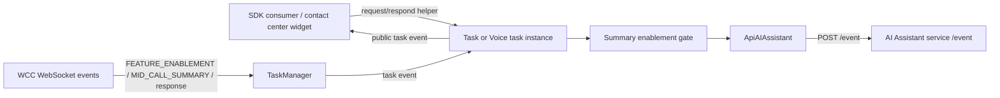
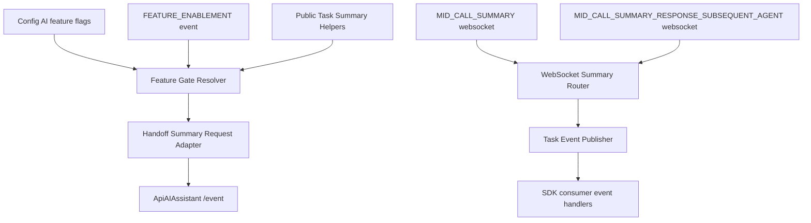
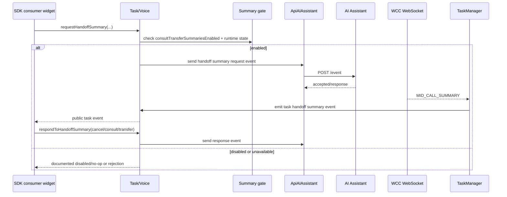

# Feature Design - SDK Agent Handoff Summary Events and APIs

> Start here -> repo root [`AGENTS.md`](../../../AGENTS.md) (agent entry) -> router [`SPEC_INDEX.md`](../../../ai-docs/SPEC_INDEX.md) -> system [`ARCHITECTURE.md`](../../../ai-docs/ARCHITECTURE.md). This design serves the spec [`feature-spec.md`](../spec/feature-spec.md); it feeds the decomposition [`../tasks/`](../tasks/) and test plan [`test-strategy.md`](../test-strategy.md).

## Metadata

| Field | Value |
|---|---|
| Feature / ticket key | CAI-7974 |
| Title | SDK Agent Handoff Summary events and public APIs |
| Feature Spec | `../spec/feature-spec.md` |
| Status | soft-committed |
| Change class | `contract-affecting + security` |
| created_by / approved_by / date | Codex generator / user-approved lifecycle write / 2026-06-24T19:02:22Z |
| Generated from | `feature-design` @ SDLC template library `0.1.0-draft` |

## Executive Summary

This design adds an SDK-owned handoff summary flow on top of the PR #4794 AI Assistant baseline. The SDK reads AI summary enablement from agent config and optional runtime WebSocket enablement, requests summaries through `ApiAIAssistant`, routes summary WebSocket messages through `TaskManager`, emits task-scoped public events, and exposes typed task helper APIs for request and response actions. Existing transfer/consult behavior remains unchanged when gates are off or the AI Assistant path fails.

## Scenario -> Design Map

| Requirement / scenario | Design element that satisfies it |
|---|---|
| R-1 Gate summary requests with `consultTransferSummariesEnabled`. | Feature Gate Resolver block, `config` profile field, runtime enablement cache. |
| R-2 Honor runtime `FEATURE_ENABLEMENT`. | WebSocket Summary Router updates the Feature Gate Resolver state. |
| R-3 Request summary through `ApiAIAssistant`. | Handoff Summary Request Adapter block and `ai-assistant-handoff-summary-event.md` contract. |
| R-4 Emit task event for `MID_CALL_SUMMARY`. | WebSocket Summary Router and Task Event Publisher blocks. |
| R-5 Route `MID_CALL_SUMMARY_RESPONSE_SUBSEQUENT_AGENT`. | WebSocket Summary Router and Task Event Publisher response branch. |
| R-6 Expose public task helpers for request/respond. | Public Task Helper Facade block and `task-handoff-summary-helpers.md` contract. |
| R-7 Update typings/tests/docs without sensitive logging. | Public Surface/Docs block, Metrics/Logging Guardrails, and test strategy. |

---

# Feature Architecture

## System Context

Inside this package: task helper methods, TaskManager routing, feature-gate state, event emission, typings, metrics, and docs. Outside this package: AI Assistant service behavior, WCC WebSocket event production, widget UI, and backend schema ownership.

Current source evidence:
- `ContactCenter` initializes `Services`, `WebCallingService`, `MetricsManager`, and `TaskManager` after Webex `ready` in `src/cc.ts:343`.
- `TaskManager` parses WebSocket messages and prepares task event context in `src/services/task/TaskManager.ts:349` and `src/services/task/TaskManager.ts:379`.
- `Task` updates task data and common UI controls in `src/services/task/Task.ts:592`.
- `Voice.transfer` owns consult-transfer behavior in `src/services/task/voice/Voice.ts:608`.
- PR #4794 baseline adds `ApiAIAssistant`, AI feature flags, and AI Assistant `/event` transport; this design assumes that baseline by user approval.

## Functional-Block Decomposition

| Block | Responsibility | New or existing | Touches module(s) |
|---|---|---|---|
| Feature Gate Resolver | Combines register-time `aiFeature.generatedSummaries.consultTransferSummariesEnabled` with optional runtime `FEATURE_ENABLEMENT`. | new behavior on existing config/task state | `config`, `task` |
| Handoff Summary Request Adapter | Calls existing `ApiAIAssistant` event transport with handoff summary event names/actions. | extend PR #4794 baseline | `contact-center-plugin`, `task` |
| WebSocket Summary Router | Recognizes summary-related backend events, finds matching task by interaction/conversation id, and ignores malformed/unmatched messages safely. | extend existing | `task` |
| Task Event Publisher | Emits public task-scoped summary events with typed payloads and no raw payload logging. | new behavior on existing event model | `task`, `voice-webrtc` |
| Public Task Helper Facade | Adds request/respond helper methods to Task/Voice public surface. | new public API | `task`, `voice-webrtc`, `contact-center-plugin` |
| Metrics/Logging Guardrails | Tracks request/delivery/failure and disabled decisions without logging summary content. | extend existing metrics/logging | `metrics`, `task` |

## Object-Model Changes

| Object / entity | New / changed / removed | Fields / shape change | Owning module |
|---|---|---|---|
| `AIFeatureFlags.generatedSummaries` | changed | Uses `consultTransferSummariesEnabled` as the register-time gate. | `config` |
| `HandoffSummaryEnablement` | new runtime shape | Represents backend `FEATURE_ENABLEMENT` state for summary flow. Exact backend fields need owner confirmation. | `task` |
| `MidCallSummaryPayload` | new public payload type | Includes task correlation id and summary content/metadata. Exact fields need backend owner confirmation. | `task` |
| `MidCallSummaryResponsePayload` | new public payload type | Represents subsequent-agent response delivery. Exact fields need backend owner confirmation. | `task` |
| `HandoffSummaryResponseAction` | new public type | Allowed response actions: cancel, consult, transfer. Exact backend vocabulary needs owner confirmation. | `task` |

## Design Decisions & Rationale

- **D-1 Reuse `ApiAIAssistant`:** the existing PR #4794 service already owns AI Assistant base URL resolution, Webex auth, `/event` transport, metrics, and error wrapping. Reusing it avoids parallel transport code.
- **D-2 Fail closed on missing/false feature gates:** summary payloads are sensitive and backend support is tenant/profile dependent, so missing enablement should not trigger AI requests.
- **D-3 Emit task-scoped SDK events instead of widget callbacks:** TaskManager already owns backend event routing; task-scoped events keep the feature aligned with existing SDK event patterns.
- **D-4 Keep helper APIs additive:** existing `transfer`, `consult`, and `endConsult` behavior must remain unchanged when summaries are disabled or unavailable.
- **D-5 Do not persist summaries in SDK storage:** summaries are runtime task payloads only; no cache or persistent data model is introduced.

## Alternatives Explored

| Alternative | Pros | Cons | Why not chosen |
|---|---|---|---|
| Widget calls AI Assistant directly. | Fast for one consumer. | Duplicates auth, gating, error handling, payload contracts, and task correlation outside SDK. | Rejected because SDK should own public task API and backend event routing. |
| Request summary automatically inside `transfer()` / `consult()` with no explicit helper. | Less widget code. | Hidden side effect changes existing transfer/consult behavior and is hard to test/gate. | Rejected for backward compatibility. |
| Store summaries in `Task.data` only. | Simple data access. | Consumers need delivery timing and response handling; silent data mutation is harder to observe. | Rejected; emit explicit task event and may also update data if implementation chooses. |
| Add a new service/component. | Could isolate summary behavior. | Jira explicitly says reuse existing `ApiAIAssistant`; new service increases surface area. | Rejected as unnecessary. |

## Dependencies & Assumptions

- **Assumes:** PR #4794 is present before implementation begins. If false, implementation must first merge/rebase the baseline AI Assistant service and AI feature flag parsing.
- **Assumes:** Backend emits stable event names `FEATURE_ENABLEMENT`, `MID_CALL_SUMMARY`, and `MID_CALL_SUMMARY_RESPONSE_SUBSEQUENT_AGENT`.
- **Assumes:** Summary request/response payloads can be correlated to an existing task by `interactionId`, `conversationId`, or equivalent field.
- **Depends on:** AI Assistant `/event` service availability and existing Webex credential/auth infrastructure.

## Feature-Toggle Strategy

| Toggle | Gates | Behavior when OFF | Default | Owner | Removal trigger |
|---|---|---|---|---|---|
| `agentConfig.aiFeature.generatedSummaries.consultTransferSummariesEnabled` | Requesting handoff summaries through the SDK. | No AI Assistant request; helper returns documented disabled/no-op behavior; existing transfer/consult continues. | Fail closed when missing/false. | Backend/product owner | Product GA decision; no removal planned in this feature. |
| Runtime `FEATURE_ENABLEMENT` state | Later enable/disable of summary request flow after register. | Overrides or refines request eligibility according to backend payload. | No runtime override until event received. | Backend/API owner | Backend confirms static config is sufficient or feature is GA. |

## Impacted Services / Modules & Task Split

### SDK handoff summary flow

- **Deployment target:** `@webex/contact-center` package artifact.
- **Epic:** `../tasks/handoff-summary-sdk-flow/epic.md`.
- **Changes:**
  - Extend AI Assistant/config baseline with handoff summary event names/actions and feature-gate access.
  - Extend TaskManager WebSocket routing for feature enablement, summary delivery, and response delivery events.
  - Add public task helper APIs/events/types, docs, tests, and generated manifest updates.

## Service Impact Matrix

| Service / module | Changes? | What changes (or why not) | Owner |
|---|---|---|---|
| `contact-center-plugin` | yes | Additive public exports/types/manifest and AI Assistant baseline wiring. | Contact Center SDK |
| `config` | yes | AI summary enablement read from PR #4794 baseline config and optional runtime state. | Contact Center SDK |
| `task` | yes | WebSocket event routing, typed task events, helper method interfaces. | Contact Center SDK |
| `voice-webrtc` | yes | Voice consult/transfer helper integration while preserving existing transfer semantics. | Contact Center SDK |
| `metrics` | yes | Request/delivery/failure/disabled observability without payload leakage. | Contact Center SDK |
| Widget UI | no | Consumes SDK event/API; UI flow is out of this package. | Widget/desktop team |
| AI Assistant backend | no | Existing `/event` service is consumed; backend schema ownership remains external. | AI Assistant/backend team |
| Persistent storage | no | No schema, cache, migration, or datastore introduced. | N/A |

## Interface & Contract Definitions

| Interface | Producer | Consumer(s) | Change type | Contract doc |
|---|---|---|---|---|
| AI Assistant handoff summary `/event` request | `ApiAIAssistant` / task helper | AI Assistant service | modify | `contracts/ai-assistant-handoff-summary-event.md` |
| Task handoff summary delivery events | `TaskManager` / task instance | SDK consumer widget | new | `contracts/task-handoff-summary-events.md` |
| Task handoff summary helper APIs | `Task` / `Voice` | SDK consumer widget | new | `contracts/task-handoff-summary-helpers.md` |

> Per-interface contract documents live in `contracts/*.md`, one per non-trivial interface.

## Security / RBAC Design

- Keep existing Webex request auth for AI Assistant calls; do not add custom credentials or tokens.
- Enforce summary feature enablement before AI Assistant request.
- Treat summary content as sensitive conversation data. Logs and metrics may include identifiers/status/event type but must not include summary body text.
- Do not store summaries beyond the task runtime data/event payload path.
- Security review should confirm payload classification, logging allowlist, and failure telemetry before implementation-ready.

## HA & Failure-Condition Matrix

| Failure condition | Probability | Impact | Mitigation / fallback |
|---|---|---|---|
| AI Assistant `/event` request fails. | medium | Summary not requested or response not sent. | Log/metric sanitized failure; preserve existing task transfer/consult behavior; surface helper rejection/documented result. |
| Summary feature gate missing or false. | medium | No summary request. | Fail closed and emit no AI Assistant request. |
| Runtime `FEATURE_ENABLEMENT` malformed. | low | Gate state not updated. | Ignore malformed event, log sanitized warning, keep prior gate state. |
| `MID_CALL_SUMMARY` arrives before task exists or with unknown id. | medium | Summary not delivered. | Ignore safely; log sanitized debug/operational signal if useful. Do not create task from summary event. |
| Duplicate summary message. | low | Consumer might display duplicate. | Prefer idempotency by summary/message id when backend supplies one; otherwise emit according to WebSocket delivery semantics and document best effort. |
| Summary payload contains sensitive content. | high | Privacy/security incident if logged. | Do not log body; add negative tests for logging. |

## Sequence Diagrams

## Rollout / Migration Interlock

| Step / wave | What ships | Depends on | Toggle state | Owner |
|---|---|---|---|---|
| 1 | Merge/rebase PR #4794 baseline if not already in implementation branch. | PR #4794 merged code available. | Existing transcript/AI features unchanged. | SDK owner |
| 2 | Ship additive SDK code and tests with summary gate fail-closed. | Backend event schemas confirmed. | `consultTransferSummariesEnabled` honored. | SDK owner |
| 3 | Enable in integration/staging tenants. | AI Assistant backend and WCC event producers ready. | Controlled by backend config/runtime enablement. | Backend/product owner |
| 4 | Product canary/GA. | QA, security, and consumer widget sign-off. | Controlled rollout. | Product/release owner |

## Test Strategy

-> Full plan: `../test-strategy.md`. Key scenarios this design must prove: disabled gate no-op, request payload correctness, runtime enablement update, summary event routing, response event routing, helper API behavior, and sanitized logging/metrics.

## Design Coverage Summary

| Concern | In-scope / N/A / Out-of-scope | Where addressed |
|---|---|---|
| System context | In-scope | System Context |
| Functional decomposition | In-scope | Functional-Block Decomposition |
| Object model | In-scope | Object-Model Changes |
| Alternatives | In-scope | Alternatives Explored |
| Feature toggle | In-scope | Feature-Toggle Strategy |
| Scale | N/A | No throughput/latency target; single task event flow. |
| Service impact | In-scope | Service Impact Matrix |
| Interfaces / contracts | In-scope | Interface & Contract Definitions and `contracts/*.md` |
| Data model | N/A | No persistent schema/cache/migration; runtime payload types only. |
| Security / RBAC | In-scope | Security / RBAC Design |
| HA / failure | In-scope | HA & Failure-Condition Matrix |
| Rollout / migration | In-scope | Rollout / Migration Interlock |
| Test strategy | In-scope | Test Strategy |

## Reviewer Sign-Off

| Role | Reviewer | Status | Date |
|---|---|---|---|
| Architect | [NEEDS HUMAN INPUT] | pending | |
| Tech Lead | [NEEDS HUMAN INPUT] | pending | |
| Product | [NEEDS HUMAN INPUT] | pending | |
| UX | N/A - SDK-only feature | N/A | |
| QA | [NEEDS HUMAN INPUT] | pending | |
| Security / Privacy | [NEEDS HUMAN INPUT] | pending | |
| Delivery / SRE | [NEEDS HUMAN INPUT] | pending | |

## References / Traceability

- Feature Spec: `../spec/feature-spec.md`
- Repo architecture: `../../../ai-docs/ARCHITECTURE.md`
- Per-interface contracts: `contracts/*.md`
- Test strategy: `../test-strategy.md`
- Decomposition: `../tasks/`
- Coverage / contracts baseline: `../../../.sdd/manifest.json`
