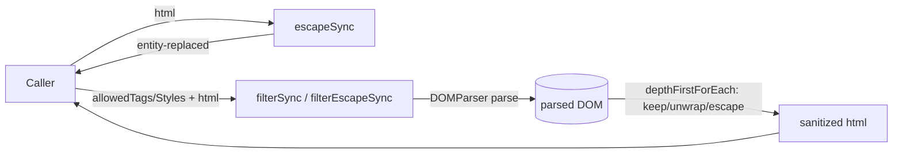
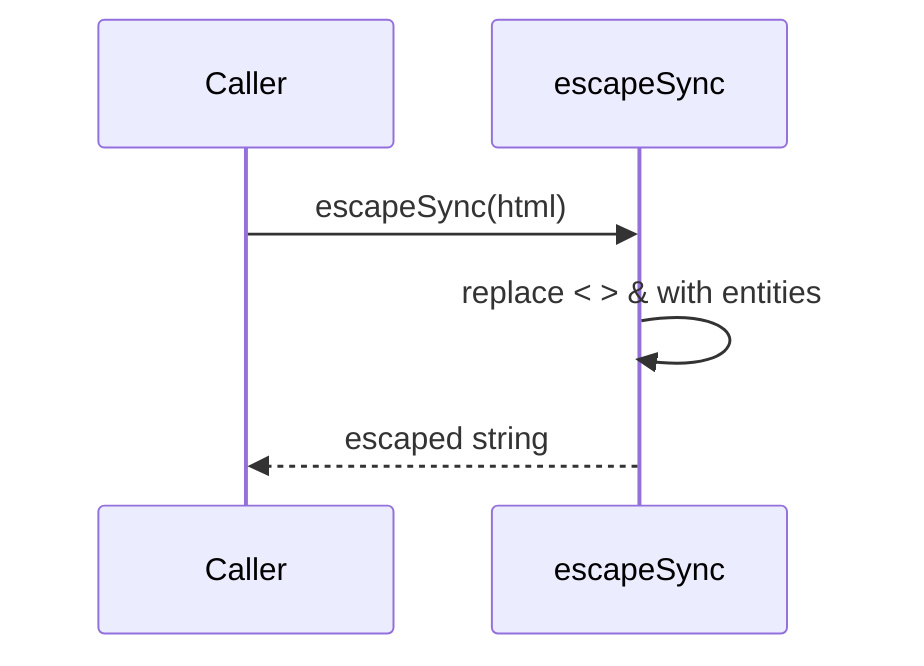
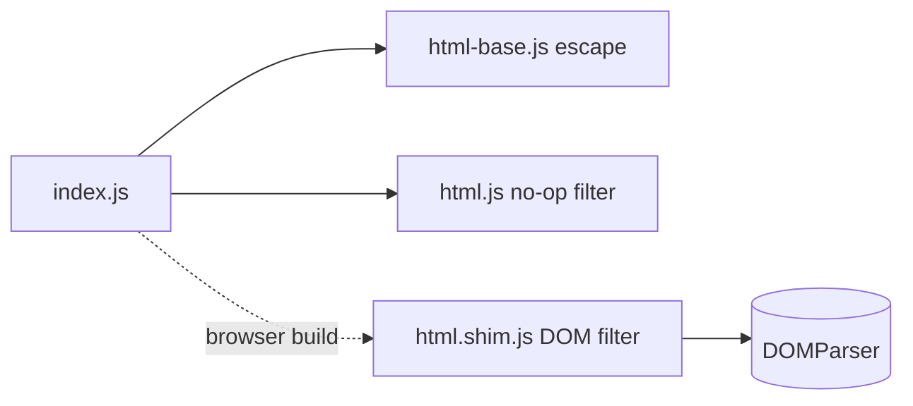

<!-- sdd-generated-metadata
generator: claude-cli
generator_model: us.anthropic.claude-opus-4-8
approved_by: pending-human-review
updated_at: 2026-08-06T00:00:00Z
validation_status: not-run
run_id: 51855eac-8de5-43a2-a3b6-dbcc55ebc91b
-->

# @webex/helper-html — SPEC

> Start here → root [`AGENTS.md`](../../../../AGENTS.md) (agent entry) · router [`SPEC_INDEX.md`](../../../../ai-docs/SPEC_INDEX.md) · system [`ARCHITECTURE.md`](../../../../ai-docs/ARCHITECTURE.md). This is the module's canonical spec: orientation, requirements, design, flows, and tests.
> Context-efficiency: link to canonical docs — don't duplicate them. Load specs on demand per `SPEC_INDEX.md`.

## Metadata

| Field | Value |
|---|---|
| Module id | `helper-html` |
| Source path(s) | `packages/@webex/helper-html/src/` |
| Parent spec | `—` (standalone helper library, no parent module) |
| Doc kind | Module spec |
| Coverage score | Pending coverage assessment |
| Generated from | `module-spec` @ SDLC template library `0.2.2` |
| generated_by / approved_by / updated_at | claude-cli / pending-human-review / 2026-08-06 |
| Validation status | not-run, validator `pending`, assessed 2026-08-06 |

Coverage score is `Pending coverage assessment` until the first coverage review runs. Manifest coverage
state (`Partial`) is authoritative and kept in `.sdd/manifest.json`.

## Evidence Rules
Every requirement cites concrete source evidence using `file path`. Test evidence is preferred for WHY.
Requirements are grounded in the current implementation under `src/` and its unit tests.

## Source Material Register

| Source material | Scope | Decision | Detail location or disposition |
|---|---|---|---|
| `N/A` | none | none | No pre-existing SDD/AI-docs, architecture, or spec documents were routed to this module; content is derived from source and tests. |

## Overview

`@webex/helper-html` provides HTML escaping and tag/attribute/style filtering helpers used by the SDK to
sanitize user-generated HTML. It ships two implementations selected at build time via the package's
`browser` field: a **node** variant (`src/html.js`) whose `filter*` functions are no-ops (returning the
input unchanged), and a **browser** variant (`src/html.shim.js`) that performs real DOM-based filtering
using `DOMParser`. Escaping (`escape`/`escapeSync`) is shared and implemented in `src/html-base.js`.

Both variants expose the same six-function surface, so consumers import one API and get the appropriate
behavior for their runtime. A maintainer should read `src/index.js` for the export list, `src/html-base.js`
for escaping, and `src/html.shim.js` for the real browser filtering logic.

## Purpose / Responsibility

Owns HTML sanitization for the SDK: escaping the special characters `<`, `>`, `&`, and filtering an HTML
string down to an allow-list of tags/attributes/styles (with a `filterEscape` variant that escapes
disallowed tags rather than unwrapping them). It does NOT own rendering, transport, or content-encryption.

## Stack

JavaScript (Babel legacy build), Node `>=18`. Built with `webex-legacy-tools build` (`-js -ts -maps`).
The `package.json` `browser` field swaps `./src/html.js` → `./src/html.shim.js` and the dist equivalent
for browser bundles. Unit/browser tests run via `webex-legacy-tools test --unit --runner karma` using
`@webex/test-helper-chai`. Runtime dependency: `lodash` (for `curry`).

## Folder / Package Structure

```
packages/@webex/helper-html/src/
├── index.js         # Barrel: re-exports the 6 escape/filter functions
├── html.js          # NODE variant: escape/escapeSync + no-op filter functions
├── html.shim.js     # BROWSER variant: escape/escapeSync + real DOMParser filtering
└── html-base.js     # Shared escape/escapeSync (character → entity replacement)
```

## Key Files (source of truth)

| File | Holds |
|---|---|
| `packages/@webex/helper-html/src/index.js` | The exported surface (`escape`, `escapeSync`, `filter`, `filterSync`, `filterEscape`, `filterEscapeSync`) |
| `packages/@webex/helper-html/src/html-base.js` | The canonical escape logic and `< > &` → entity mapping |
| `packages/@webex/helper-html/src/html.shim.js` | The real browser DOM allow-list filtering, including `javascript:`/`vbscript:` URL stripping |
| `packages/@webex/helper-html/package.json` | The `browser` field that selects the node vs. shim implementation |

## Public Surface

Published, imported SDK/code API — no network, event, or CLI surface. All six functions are curried to
arity 4 for the `filter*` family.

| Contract ID | Type | Surface | Purpose | Compatibility / deprecation | Schema / detail link | Root index |
|---|---|---|---|---|---|---|
| `helper-html.escape` | SDK | `escape(html): Promise<string>` / `escapeSync(html): string` | Escape `<`, `>`, `&` to HTML entities | Stable named exports | `packages/@webex/helper-html/src/html-base.js` | `../../../../ai-docs/CONTRACTS.md` |
| `helper-html.filter` | SDK | `filter(processCallback, allowedTags, allowedStyles, html): Promise<string>` (+ `filterSync`) | Remove disallowed tags/attributes/styles per allow-list (unwrapping disallowed tags) | Stable curried exports; node build is a no-op passthrough | `packages/@webex/helper-html/src/html.shim.js` | `../../../../ai-docs/CONTRACTS.md` |
| `helper-html.filterEscape` | SDK | `filterEscape(processCallback, allowedTags, allowedStyles, html): Promise<string>` (+ `filterEscapeSync`) | Same allow-list filtering but escapes disallowed tags instead of unwrapping | Stable curried exports; node build is a no-op passthrough | `packages/@webex/helper-html/src/html.shim.js` | `../../../../ai-docs/CONTRACTS.md` |

Compatibility notes:
- The six export names and their curried arity are the semver-controlled surface.
- Node vs. browser behavior divergence (no-op vs. real filtering) is intentional and part of the
  documented contract; changing it affects server-side callers.

## Requires (dependencies)

- `lodash` (`^4.17.21`) — `curry` for the arity-4 `filter*` functions.
- Browser runtime globals `DOMParser`, `document` (browser variant only). The node variant needs no DOM.

## Requirements

| ID | WHAT | WHY | Source Evidence | Test / Example Evidence | Assumptions / Gaps | Confidence |
|---|---|---|---|---|---|---|
| `HELPER-HTML-R-001` | `escapeSync` replaces every `<`, `>`, and `&` with `&lt;`, `&gt;`, `&amp;`; `escape` resolves the same result as a Promise. | Escaping these characters neutralizes HTML injection when rendering user text. | `packages/@webex/helper-html/src/html-base.js` | `packages/@webex/helper-html/test/unit/` | none identified | PRESENT |
| `HELPER-HTML-R-002` | All six functions are exported from `src/index.js` and the `filter*` functions are curried to arity 4. | A stable, curried surface lets callers partially apply allow-lists and pick sync/async variants. | `packages/@webex/helper-html/src/index.js`, `packages/@webex/helper-html/src/html.shim.js` | `packages/@webex/helper-html/test/unit/` | none identified | PRESENT |
| `HELPER-HTML-R-003` | In the node build, `filter`/`filterSync`/`filterEscape`/`filterEscapeSync` return the input HTML unchanged (no-op). | Server-side code that does not run in a DOM gets a safe passthrough rather than a DOM error. | `packages/@webex/helper-html/src/html.js` | `packages/@webex/helper-html/test/unit/` | Intentional divergence from the browser build | PRESENT |
| `HELPER-HTML-R-004` | In the browser build, `filterSync` parses HTML with `DOMParser`, walks nodes depth-first, keeps only allow-listed tags/attributes/styles, unwraps disallowed tags, and strips `href`/`src` values beginning with `javascript:`/`vbscript:`. | Real sanitization must enforce an allow-list and block script-URL vectors. | `packages/@webex/helper-html/src/html.shim.js` | `packages/@webex/helper-html/test/unit/` | none identified | PRESENT |
| `HELPER-HTML-R-005` | `filterEscapeSync` behaves like `filterSync` but escapes disallowed tags (wrapping in literal `<tag>`/`</tag>` text nodes) instead of unwrapping them. | Some callers must preserve visible evidence of stripped markup rather than silently removing it. | `packages/@webex/helper-html/src/html.shim.js` | `packages/@webex/helper-html/test/unit/` | none identified | PRESENT |
| `HELPER-HTML-R-006` | The `filter*`/`filterEscape*` functions throw when `allowedTags`, `allowedStyles`, or `html` are missing, except that an empty-string `html` returns empty. | Missing allow-lists would otherwise silently drop or pass content; failing fast prevents unsafe defaults. | `packages/@webex/helper-html/src/html.shim.js` | `packages/@webex/helper-html/test/unit/` | none identified | PRESENT |

## Design Overview

Escaping is a single regex replace (`/(<|>|&)/g`) mapping each character to its entity via
`entityReplacer` in `html-base.js`; `escape` simply wraps `escapeSync` in a resolved Promise.

Filtering is where node and browser diverge. The node `html.js` defines `noop`/`noopSync` that return the
HTML untouched and curries them to arity 4. The browser `html.shim.js` parses the HTML with `DOMParser`,
then `depthFirstForEach` walks child nodes: for each element it recurses into children first, then either
keeps the element (removing non-allow-listed attributes, stripping script-URL `href`/`src`, and filtering
`style` down to allowed style names) or, for a disallowed tag, `reparent`s (unwraps) it — while
`filterEscape` calls `escapeNode` to surround the node with literal tag text instead. Both throw if the
allow-lists or html are absent (unless html is empty).

## Data Flow



## Sequence Diagram(s)

Sequence coverage:

| Operation group | Diagram | Failure / recovery coverage |
|---|---|---|
| Escape text | 1. Escape | No failure path (pure string replace) |
| Filter HTML (browser) | 2. Allow-list filtering | `alt` covers keep vs. unwrap/escape and script-URL stripping; missing allow-lists throw |

### 1. Escape



### 2. Allow-list filtering (browser build)

```mermaid
sequenceDiagram
    participant C as Caller
    participant F as filterSync
    participant D as DOMParser

    C->>F: filterSync(cb, allowedTags, allowedStyles, html)
    alt allow-lists / html missing (non-empty)
        F-->>C: throw Error
    else valid inputs
        F->>D: parseFromString(html)
        loop each node (depth-first)
            alt tag allowed
                F->>F: drop non-allowed attrs; strip javascript:/vbscript: href/src; filter styles
            else tag disallowed
                F->>F: reparent (unwrap) OR escapeNode (filterEscape)
            end
        end
        F-->>C: sanitized innerHTML
    end
```

## Class / Component Relationships



The barrel re-exports escape from `html-base.js` and filter from whichever `html*.js` the build selects.
There are no classes; all exports are functions.

## Use Cases

- **UC-1 Escape user text:** `escapeSync(userInput)` before injecting into markup. Evidence:
  `packages/@webex/helper-html/src/html-base.js`.
- **UC-2 Sanitize rich HTML in the browser:** `filterSync(noopCb, allowedTags, allowedStyles, html)` to
  reduce untrusted HTML to an allow-list. Evidence: `packages/@webex/helper-html/src/html.shim.js`.
- **UC-3 Preserve stripped markup visibly:** use `filterEscapeSync` so disallowed tags appear as literal
  text. Evidence: `packages/@webex/helper-html/src/html.shim.js`.

## Business Rules & Invariants

- Escaping always maps exactly `<`→`&lt;`, `>`→`&gt;`, `&`→`&amp;` and leaves all other characters
  untouched — enforced in `entityReplacer` (`src/html-base.js`).
- Any `href`/`src` value beginning with `javascript:` or `vbscript:` causes the element to be
  reparented/unwrapped, blocking script-URL injection — enforced in `html.shim.js`.
- Empty-string HTML is a valid input and returns empty; any other falsy allow-list/html triggers a thrown
  error — enforced in `_filterSync`/`_filterEscapeSync`.

## Error Handling & Failure Modes

| Condition | Signal (error/code/result) | Caller recovery |
|---|---|---|
| Missing `allowedTags`/`allowedStyles`/non-empty `html` (browser build) | `Error: `allowedTags`, `allowedStyles`, and `html` must be provided` | Pass all three arguments |
| No DOM available but browser build invoked | Runtime error from `DOMParser`/`document` | Use the node build for server-side, or provide a DOM |
| Disallowed script-URL attribute | Element silently unwrapped (no error) | Expected sanitization behavior |

## Pitfalls

- The node build's `filter*` functions are NO-OPS: calling them server-side does not sanitize anything.
  Sanitization only happens in the browser build (via the `package.json` `browser` field swap).
- `depthFirstForEach` iterates from `list.length` down to `0` inclusive, so `filterNode` is called with an
  out-of-range index at the top of the loop and must tolerate `undefined` (handled by the `isElement`
  guard).
- `escape` only handles `< > &`; it does not escape quotes — do not rely on it for attribute-value
  contexts.

## Module Do's / Don'ts

- DO import the sanitization helpers from `@webex/helper-html` rather than hand-rolling regex sanitizers.
- DON'T assume `filter` sanitizes in Node — it is a passthrough there by design.

## Export Stability

The six export names and the curried arity of the `filter*` family are semver-controlled. Adding a helper
is a minor change; renaming/removing one or changing node-vs-browser behavior is a breaking change.

## Test-Case Strategy (module)

Unit/browser tests (Karma) assert escaping of `< > &`, allow-list retention of permitted tags/attributes,
removal (or escaping, for `filterEscape`) of disallowed tags, stripping of `javascript:`/`vbscript:`
URLs, and the thrown error when allow-lists are missing. The node no-op behavior is a recommended
explicit assertion.

| Behavior / Requirement | Existing test evidence | Gap |
|---|---|---|
| `HELPER-HTML-R-001` | `packages/@webex/helper-html/test/unit/` | none identified |
| `HELPER-HTML-R-002` | `packages/@webex/helper-html/test/unit/` | Confirm arity/curry assertion exists |
| `HELPER-HTML-R-003` | `packages/@webex/helper-html/test/unit/` | Add explicit node no-op passthrough assertion |
| `HELPER-HTML-R-004` | `packages/@webex/helper-html/test/unit/` | Re-check script-URL and style-filter edge cases |
| `HELPER-HTML-R-005` | `packages/@webex/helper-html/test/unit/` | Re-check nested disallowed-tag escaping |
| `HELPER-HTML-R-006` | `packages/@webex/helper-html/test/unit/` | Re-check empty-string vs. missing-arg branches |

## Traceability

- Repo architecture: [`ARCHITECTURE.md`](../../../../ai-docs/ARCHITECTURE.md) · Registry: [`SPEC_INDEX.md`](../../../../ai-docs/SPEC_INDEX.md)
- Contracts catalog: [`CONTRACTS.md`](../../../../ai-docs/CONTRACTS.md)
- Coverage state & contracts baseline: `.sdd/manifest.json`
