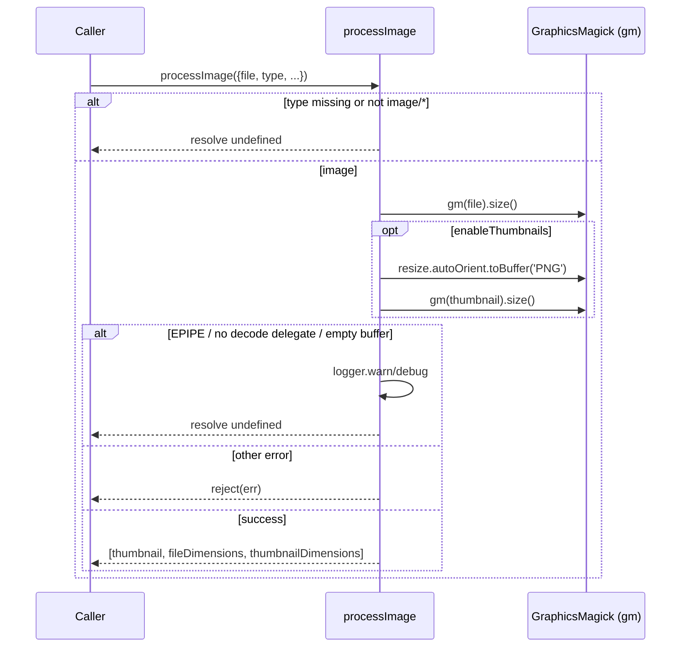
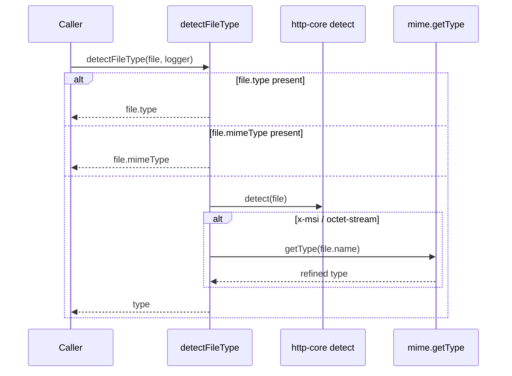
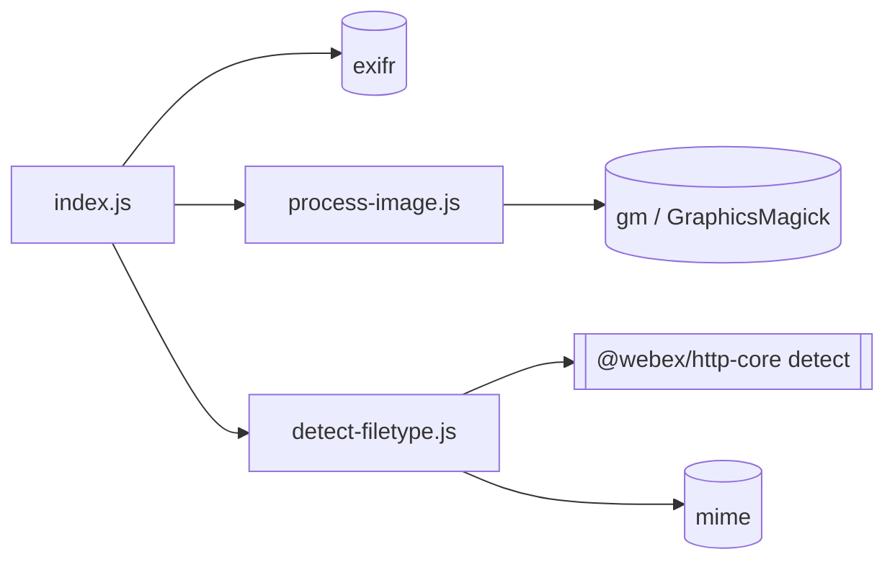

<!-- sdd-generated-metadata
generator: claude-cli
generator_model: us.anthropic.claude-opus-4-8
approved_by: pending-human-review
updated_at: 2026-08-06T00:00:00Z
validation_status: not-run
run_id: 51855eac-8de5-43a2-a3b6-dbcc55ebc91b
-->

# @webex/helper-image — SPEC

> Start here → root [`AGENTS.md`](../../../../AGENTS.md) (agent entry) · router [`SPEC_INDEX.md`](../../../../ai-docs/SPEC_INDEX.md) · system [`ARCHITECTURE.md`](../../../../ai-docs/ARCHITECTURE.md). This is the module's canonical spec: orientation, requirements, design, flows, and tests.
> Context-efficiency: link to canonical docs — don't duplicate them. Load specs on demand per `SPEC_INDEX.md`.

## Metadata

| Field | Value |
|---|---|
| Module id | `helper-image` |
| Source path(s) | `packages/@webex/helper-image/src/` |
| Parent spec | `—` (standalone helper library, no parent module) |
| Doc kind | Module spec |
| Coverage score | Pending coverage assessment |
| Generated from | `module-spec` @ SDLC template library `0.2.2` |
| generated_by / approved_by / updated_at | claude-cli / pending-human-review / 2026-08-06 |
| Validation status | not-run, validator `pending`, assessed 2026-08-06 |

Coverage score is `Pending coverage assessment` until the first coverage review runs. Manifest coverage
state (`Partial`) is authoritative and kept in `.sdd/manifest.json`.

## Evidence Rules
Every requirement cites concrete source evidence using `file path`. Test evidence is preferred for WHY.
Requirements are grounded in the current implementation under `src/` and its unit tests.

## Source Material Register

| Source material | Scope | Decision | Detail location or disposition |
|---|---|---|---|
| `N/A` | none | none | No pre-existing SDD/AI-docs, architecture, or spec documents were routed to this module; content is derived from source and tests. |

## Overview

`@webex/helper-image` provides image-handling helpers used when the SDK shares or uploads images:
reading/normalizing EXIF orientation, measuring image dimensions and generating thumbnails, and detecting
a file's MIME type. Like `helper-html`, it ships a node and a browser variant of `process-image` selected
by the `package.json` `browser` field; `src/index.js` also exports `updateImageOrientation` and
`readExifData` directly, plus `detectFileType`.

`updateImageOrientation`/`readExifData` use the `exifr` library to read JPEG orientation and dimensions;
`processImage` uses GraphicsMagick (`gm`) to size the image and produce an auto-oriented PNG thumbnail;
`detectFileType` defers to `@webex/http-core`'s `detect` and falls back to `mime` lookups. A maintainer
should start at `src/index.js`.

## Purpose / Responsibility

Owns image measurement, thumbnail generation, EXIF-orientation reading, and file-type detection for
shared/uploaded images. It does NOT own the upload transport (that is the plugins/`http-core`) or avatar
policy (that is `internal-plugin-avatar`, a consumer).

## Stack

JavaScript (Babel legacy build), Node `>=18`. Built with `webex-legacy-tools build` (`-js -ts -maps`).
Unit tests run via `webex-legacy-tools test --unit --runner mocha` and browser tests via `--runner
karma`, using `@webex/test-helper-chai`/`-file`/`-mocha` and `sinon`. Runtime dependencies:
`@webex/http-core` (`detect`), `exifr` (EXIF parsing), `gm` (GraphicsMagick binding), `mime`, `lodash`,
`safe-buffer`.

## Folder / Package Structure

```
packages/@webex/helper-image/src/
├── index.js                 # Barrel: updateImageOrientation, readExifData, processImage, detectFileType
├── process-image.js         # NODE variant: gm size + thumbnail generation
├── process-image.browser.js # BROWSER variant (selected via package.json browser field)
└── detect-filetype.js       # detectFileType: http-core detect + mime fallback
```

## Key Files (source of truth)

| File | Holds |
|---|---|
| `packages/@webex/helper-image/src/index.js` | Exported surface and the `updateImageOrientation`/`readExifData` EXIF logic |
| `packages/@webex/helper-image/src/process-image.js` | Node thumbnail/dimension logic and the GraphicsMagick error-tolerance rules |
| `packages/@webex/helper-image/src/detect-filetype.js` | File-type detection order (existing type/mimeType → `detect` → `mime`) |
| `packages/@webex/helper-image/package.json` | The `browser` field selecting the process-image implementation |

## Public Surface

Published, imported SDK/code API — no network, event, or CLI surface of its own.

| Contract ID | Type | Surface | Purpose | Compatibility / deprecation | Schema / detail link | Root index |
|---|---|---|---|---|---|---|
| `helper-image.updateImageOrientation` | SDK | `updateImageOrientation(file, options?): Promise<Buffer>` | Read file into a buffer and, unless `shouldNotAddExifData`, annotate EXIF orientation | Stable named export | `packages/@webex/helper-image/src/index.js` | `../../../../ai-docs/CONTRACTS.md` |
| `helper-image.readExifData` | SDK | `readExifData(file, buf): Promise<Buffer>` | For JPEGs, parse EXIF and set `orientation`/`exifHeight`/`exifWidth` on the file | Stable named export | `packages/@webex/helper-image/src/index.js` | `../../../../ai-docs/CONTRACTS.md` |
| `helper-image.processImage` | SDK | `processImage({file, type, thumbnailMaxWidth, thumbnailMaxHeight, enableThumbnails, logger}): Promise<[Buffer, dims, thumbDims]?>` | Measure an image and optionally produce an auto-oriented PNG thumbnail | Stable default export; node/browser variants | `packages/@webex/helper-image/src/process-image.js` | `../../../../ai-docs/CONTRACTS.md` |
| `helper-image.detectFileType` | SDK | `detectFileType(file, logger): Promise<string>` | Determine a file's MIME type via existing type, `@webex/http-core` `detect`, then `mime` fallback | Stable default export | `packages/@webex/helper-image/src/detect-filetype.js` | `../../../../ai-docs/CONTRACTS.md` |

Compatibility notes:
- The four export names and their signatures are the semver-controlled surface.
- `processImage` node/browser divergence is intentional; the node path depends on GraphicsMagick being
  installed and degrades gracefully (see Error Handling).

## Requires (dependencies)

- `@webex/http-core` (`workspace:*`) — `detect` for content-type sniffing.
- `exifr` (`^5.0.3`) — EXIF orientation/dimension parsing for JPEGs.
- `gm` (`^1.23.1`) — GraphicsMagick binding for sizing/thumbnailing (node); requires GraphicsMagick on
  the host.
- `mime` (`^2.4.4`), `lodash` (`^4.17.21`), `safe-buffer` (`^5.2.0`).

## Requirements

| ID | WHAT | WHY | Source Evidence | Test / Example Evidence | Assumptions / Gaps | Confidence |
|---|---|---|---|---|---|---|
| `HELPER-IMAGE-R-001` | `updateImageOrientation` reads the file into a `Buffer` via `FileReader`; unless `options.shouldNotAddExifData` is set, it forwards to `readExifData`. | Callers need the raw bytes and, usually, EXIF-corrected orientation before upload. | `packages/@webex/helper-image/src/index.js` | `packages/@webex/helper-image/test/unit/` | none identified | PRESENT |
| `HELPER-IMAGE-R-002` | `readExifData` parses EXIF only for JPEG files (`type`/`mimeType` === `image/jpeg`) and, when present, sets `file.orientation`, `file.exifHeight`, `file.exifWidth` (and `file.image.orientation` if `file.image`). | Correct rotation requires the JPEG EXIF orientation; non-JPEGs and missing EXIF must be left untouched. | `packages/@webex/helper-image/src/index.js` | `packages/@webex/helper-image/test/unit/` | Both `file.type` and `file.mimeType` are accepted (avatar vs. activity images) | PRESENT |
| `HELPER-IMAGE-R-003` | `processImage` returns early (resolves undefined) when the resolved file type is missing or does not start with `image`. | Non-image inputs should be a no-op, not an error. | `packages/@webex/helper-image/src/process-image.js` | `packages/@webex/helper-image/test/unit/` | none identified | PRESENT |
| `HELPER-IMAGE-R-004` | `processImage` measures dimensions with `gm().size()` and, when `enableThumbnails`, produces a `resize(maxW,maxH).autoOrient().toBuffer('PNG')` thumbnail plus its dimensions, resolving `[thumbnail, fileDimensions, thumbnailDimensions]`. | Consumers (e.g. avatar/message image sharing) need both original dimensions and a bounded, correctly-oriented PNG thumbnail. | `packages/@webex/helper-image/src/process-image.js` | `packages/@webex/helper-image/test/unit/` | none identified | PRESENT |
| `HELPER-IMAGE-R-005` | On GraphicsMagick errors matching `EPIPE`, `No decode delegate for this image format`, or `Stream yields empty buffer`, `processImage` logs and resolves undefined instead of rejecting; other errors reject. | A missing GraphicsMagick install or a non-image payload should degrade gracefully rather than break upload flows. | `packages/@webex/helper-image/src/process-image.js` | `packages/@webex/helper-image/test/unit/` | none identified | PRESENT |
| `HELPER-IMAGE-R-006` | `detectFileType` returns `file.type`/`file.mimeType` when present; otherwise calls `@webex/http-core` `detect`, and for `application/x-msi` or `application/octet-stream` falls back to `mime.getType(file.name)`. | A reliable MIME type is needed for upload metadata; ambiguous binary sniffs are refined by filename. | `packages/@webex/helper-image/src/detect-filetype.js` | `packages/@webex/helper-image/test/unit/` | none identified | PRESENT |

## Design Overview

`updateImageOrientation` wraps `FileReader.readAsArrayBuffer` in a Promise, converts the result to a
`safe-buffer` `Buffer`, and (unless suppressed) hands it to `readExifData`, which uses `exifr`'s
`parse(buf, {translateValues:false})` to extract orientation/dimensions and annotate the file object.

`processImage` computes `fileDimensions` from `gm(file).size()`, and — when thumbnails are enabled — a
PNG `thumbnail` (resized, auto-oriented) plus `thumbnailDimensions`. It `Promise.all`s the three and
attaches a `.catch` that inspects the stringified error: known GraphicsMagick/decoder failures are logged
and swallowed (resolve undefined), while unknown errors propagate.

`detectFileType` short-circuits on an existing `type`/`mimeType`, then delegates to `http-core`'s
`detect`, refining ambiguous `application/x-msi`/`application/octet-stream` results via `mime.getType`.

## Data Flow

```mermaid
flowchart TB
  Caller -->|file| Orient[updateImageOrientation]
  Orient -->|Buffer| Exif[readExifData exifr]
  Exif -->|annotated file| Caller
  Caller -->|file + opts| Process[processImage]
  Process -->|gm size / resize| GM[(GraphicsMagick)]
  Process -->|[thumb, dims, thumbDims]| Caller
  Caller -->|file| Detect[detectFileType]
  Detect -->|detect| HttpCore[["@webex/http-core detect"]]
  Detect -->|fallback| Mime[(mime.getType)]
```

## Sequence Diagram(s)

Sequence coverage:

| Operation group | Diagram | Failure / recovery coverage |
|---|---|---|
| Measure + thumbnail (`processImage`) | 1. processImage | `alt` covers non-image early return and the swallowed GraphicsMagick errors vs. rejected unknown errors |
| Detect file type | 2. detectFileType | `alt` covers existing type, detect result, and octet-stream/msi mime fallback |

### 1. processImage



### 2. detectFileType



## Class / Component Relationships



All exports are functions; there are no classes. The module composes `exifr`, `gm`, `mime`, and
`@webex/http-core`'s `detect`.

## Use Cases

- **UC-1 Prepare an avatar image:** `detectFileType` then `processImage` to produce a thumbnail and
  dimensions before upload. Evidence: `packages/@webex/helper-image/src/detect-filetype.js`,
  `packages/@webex/helper-image/src/process-image.js` (consumed by `@webex/internal-plugin-avatar`).
- **UC-2 Correct JPEG orientation:** `updateImageOrientation(file)` to annotate EXIF orientation before
  display/upload. Evidence: `packages/@webex/helper-image/src/index.js`.

## Business Rules & Invariants

- EXIF parsing runs ONLY for JPEG files (`image/jpeg` via `type` or `mimeType`); other types are left
  unmodified — enforced in `readExifData` (`src/index.js`).
- `processImage` treats non-image input as a no-op resolve, never an error — enforced in
  `src/process-image.js`.
- Known GraphicsMagick/decoder failures (`EPIPE`, no decode delegate, empty buffer) are non-fatal;
  everything else rejects — enforced in the `processImage` `.catch` (`src/process-image.js`).

## Error Handling & Failure Modes

| Condition | Signal (error/code/result) | Caller recovery |
|---|---|---|
| GraphicsMagick not installed (`EPIPE`) | `logger.warn('Is GraphicsMagick installed?')`, resolves undefined | Install GraphicsMagick, or proceed without a thumbnail |
| Non-image / undecodable payload | `logger.debug(...)`, resolves undefined | Skip image processing for this file |
| Other `gm` error | Rejected Promise with the original error | Surface to the caller/upload flow |
| Non-image type in `processImage` | Resolves undefined (no error) | Expected no-op |

## Pitfalls

- The node `processImage` requires the GraphicsMagick binary on the host; without it, thumbnail
  generation silently resolves undefined (logged as a warning) rather than throwing.
- `readExifData` mutates the passed `file` object in place (sets `orientation`/`exifHeight`/`exifWidth`);
  callers relying on immutability should clone first.
- `detectFileType` refines only `application/x-msi` and `application/octet-stream` via `mime`; other
  ambiguous `detect` results are returned as-is.

## Module Do's / Don'ts

- DO route file-type detection through `detectFileType` so the `http-core` `detect` + `mime` fallback
  order stays consistent.
- DON'T assume a thumbnail is always produced — handle the undefined resolve from `processImage`.

## Export Stability

The four exported names and their signatures are semver-controlled; the node/browser `process-image`
split is intentional. Adding a helper is minor; removing/renaming or changing a signature is breaking.

## Test-Case Strategy (module)

Unit (Mocha) and browser (Karma) tests exercise EXIF annotation for JPEGs, the non-image no-op,
thumbnail/dimension production, the swallowed-vs-rejected GraphicsMagick error branches, and the
`detectFileType` precedence including the octet-stream/msi `mime` fallback.

| Behavior / Requirement | Existing test evidence | Gap |
|---|---|---|
| `HELPER-IMAGE-R-001` | `packages/@webex/helper-image/test/unit/` | Re-check `shouldNotAddExifData` branch |
| `HELPER-IMAGE-R-002` | `packages/@webex/helper-image/test/unit/` | Re-check non-JPEG and missing-EXIF paths |
| `HELPER-IMAGE-R-003` | `packages/@webex/helper-image/test/unit/` | none identified |
| `HELPER-IMAGE-R-004` | `packages/@webex/helper-image/test/unit/` | Re-check `enableThumbnails:false` path |
| `HELPER-IMAGE-R-005` | `packages/@webex/helper-image/test/unit/` | Re-check each swallowed error string and the reject path |
| `HELPER-IMAGE-R-006` | `packages/@webex/helper-image/test/unit/` | Re-check the `mime` fallback for both ambiguous types |

## Traceability

- Repo architecture: [`ARCHITECTURE.md`](../../../../ai-docs/ARCHITECTURE.md) · Registry: [`SPEC_INDEX.md`](../../../../ai-docs/SPEC_INDEX.md)
- Contracts catalog: [`CONTRACTS.md`](../../../../ai-docs/CONTRACTS.md)
- Coverage state & contracts baseline: `.sdd/manifest.json`
