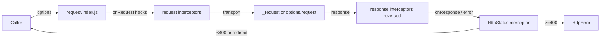
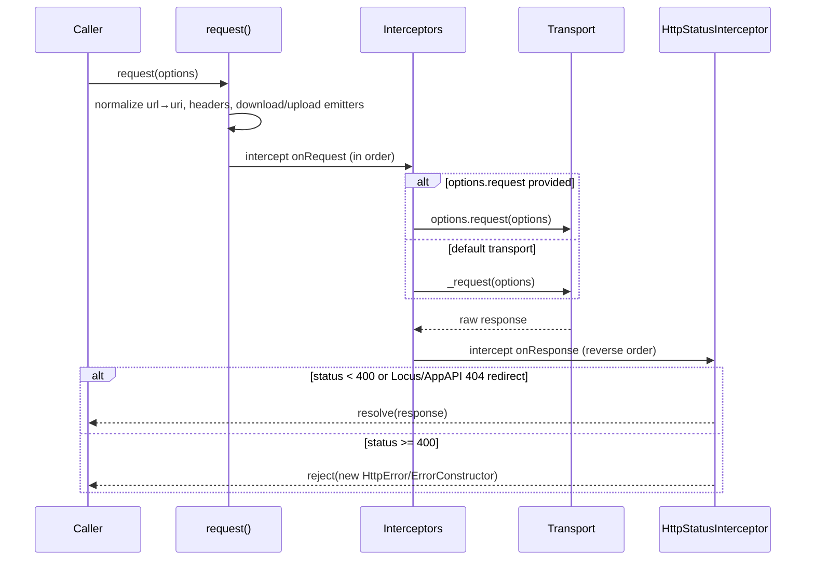
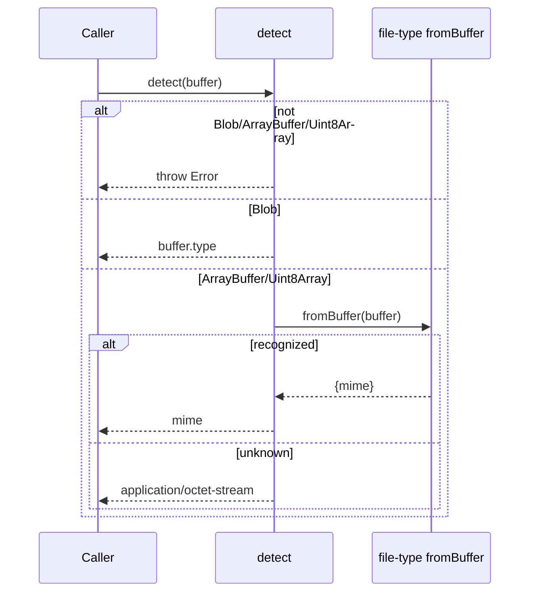
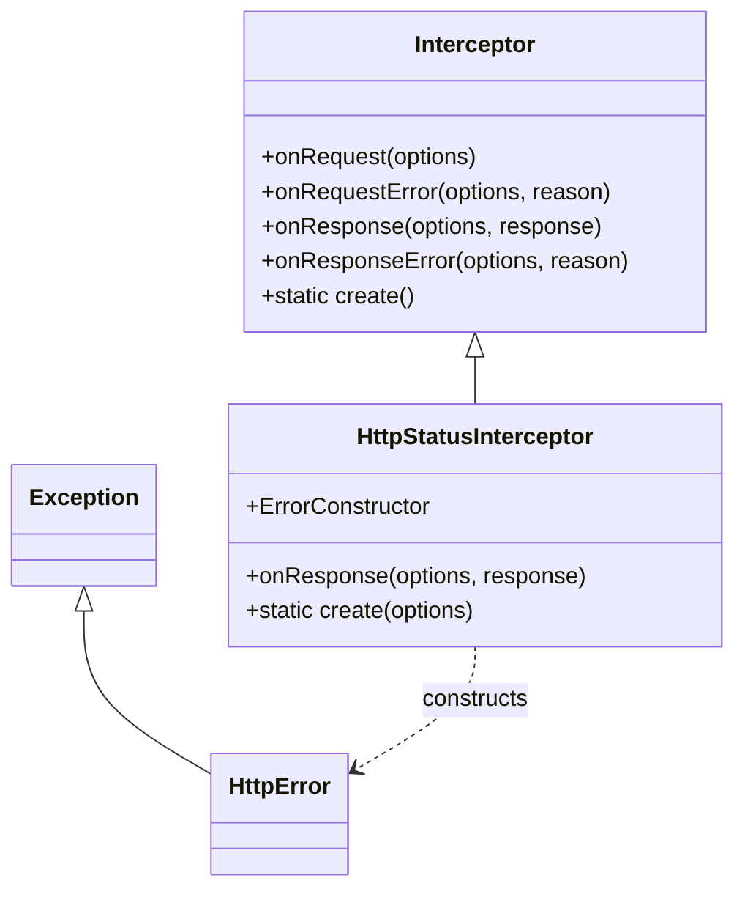

<!-- sdd-generated-metadata
generator: claude-cli
generator_model: us.anthropic.claude-opus-4-8
approved_by: pending-human-review
updated_at: 2026-08-06T00:00:00Z
validation_status: not-run
run_id: 51855eac-8de5-43a2-a3b6-dbcc55ebc91b
-->

# @webex/http-core — SPEC

> Start here → root [`AGENTS.md`](../../../../AGENTS.md) (agent entry) · router [`SPEC_INDEX.md`](../../../../ai-docs/SPEC_INDEX.md) · system [`ARCHITECTURE.md`](../../../../ai-docs/ARCHITECTURE.md). This is the module's canonical spec: orientation, requirements, design, flows, and tests.
> Context-efficiency: link to canonical docs — don't duplicate them. Load specs on demand per `SPEC_INDEX.md`.

## Metadata

| Field | Value |
|---|---|
| Module id | `http-core` |
| Source path(s) | `packages/@webex/http-core/src/` |
| Parent spec | `—` (foundational library consumed by `webex-core` and plugins; no parent module) |
| Doc kind | Module spec |
| Coverage score | Pending coverage assessment |
| Generated from | `module-spec` @ SDLC template library `0.2.2` |
| generated_by / approved_by / updated_at | claude-cli / pending-human-review / 2026-08-06 |
| Validation status | not-run, validator `pending`, assessed 2026-08-06 |

Coverage score is `Pending coverage assessment` until the first coverage review runs. Manifest coverage
state (`Partial`) is authoritative and kept in `.sdd/manifest.json`.

## Evidence Rules
Every requirement cites concrete source evidence using `file path`. Test evidence is preferred for WHY.
Requirements are grounded in the current implementation under `src/` and its unit tests.

## Source Material Register

| Source material | Scope | Decision | Detail location or disposition |
|---|---|---|---|
| `N/A` | none | none | No pre-existing SDD/AI-docs, architecture, or spec documents were routed to this module; content is derived from source and tests. |

## Overview

`@webex/http-core` is the SDK's core HTTP library: it provides the `request` function that plugins and
`webex-core` build on, an extensible `Interceptor` pipeline for transforming requests/responses, an
`HttpError`/`HttpStatusInterceptor` layer that turns non-2xx responses into typed errors, a
`ProgressEvent`, and a `detect` MIME-sniffing helper. Like other SDK packages it ships node and browser
variants of the low-level transport (`request/request.js` vs. `request/request.shim.js`) selected by the
`package.json` `browser` field.

The exported `request` is `protorequest` curried with default options (JSON on, an `HttpStatusInterceptor`
installed). It normalizes options, runs the request interceptors, performs the transport (or a
caller-supplied `request` function), then runs response interceptors in reverse order. A maintainer
should start at `src/index.js` and `src/request/index.js`.

## Purpose / Responsibility

Owns the SDK's HTTP request lifecycle: option normalization, the interceptor pipeline (request →
transport → reverse response), status-based error construction, progress events, and content-type
detection. It does NOT own authentication, service URL resolution, or plugin registration — those live in
`webex-core` and the plugins that supply interceptors and credentials.

## Stack

JavaScript (Babel legacy build), Node `>=18`. Built with `webex-legacy-tools build` (`-js -ts -maps`).
Unit tests run via `webex-legacy-tools test --unit --runner jest`; integration/browser via mocha/karma.
Runtime dependencies include `@webex/common`, `request` (node transport), `qs`, `parse-headers`,
`file-type` (MIME sniffing), `is-function`, `lodash`, `global`, `safe-buffer`, `xtend`.

## Folder / Package Structure

```
packages/@webex/http-core/src/
├── index.js                     # Barrel + protorequest/request, defaults, exports
├── request/
│   ├── index.js                 # request(): interceptor pipeline orchestration
│   ├── request.js               # NODE transport
│   ├── request.shim.js          # BROWSER transport (via package.json browser field)
│   └── utils.js                 # intercept(), prepareFetchOptions
├── interceptors/
│   └── http-status.js           # HttpStatusInterceptor: status → error mapping, redirects
├── lib/
│   ├── interceptor.js           # Interceptor base class (onRequest/onResponse hooks)
│   └── detect.js                # detect(): file-type MIME sniffing
├── http-error.js                # HttpError (extends @webex/common Exception)
└── progress-event.js            # ProgressEvent
```

## Key Files (source of truth)

| File | Holds |
|---|---|
| `packages/@webex/http-core/src/index.js` | `request`/`defaults`, default options (JSON + `HttpStatusInterceptor`), and the exported surface |
| `packages/@webex/http-core/src/request/index.js` | The request→transport→response interceptor orchestration |
| `packages/@webex/http-core/src/lib/interceptor.js` | The `Interceptor` base contract (`onRequest`/`onRequestError`/`onResponse`/`onResponseError`, `create`) |
| `packages/@webex/http-core/src/interceptors/http-status.js` | Status-code handling, Locus/AppAPI redirect exceptions, error construction |
| `packages/@webex/http-core/src/lib/detect.js` | MIME detection contract and `application/octet-stream` fallback |

## Public Surface

Published, imported SDK/code API. `request` performs network I/O but is consumed as a function export;
there is no self-owned network endpoint or event bus.

| Contract ID | Type | Surface | Purpose | Compatibility / deprecation | Schema / detail link | Root index |
|---|---|---|---|---|---|---|
| `http-core.request` | SDK | `request(options)` / `defaults(defaultOptions)(options)` | Perform an HTTP request through the interceptor pipeline with default JSON + status handling | Stable named exports; option shape is semver-controlled | `packages/@webex/http-core/src/index.js` | `../../../../ai-docs/CONTRACTS.md` |
| `http-core.Interceptor` | SDK | `class Interceptor` with `onRequest/onRequestError/onResponse/onResponseError` and static `create()` | Base class for request/response transformers | Stable class export; hook signatures semver-controlled | `packages/@webex/http-core/src/lib/interceptor.js` | `../../../../ai-docs/CONTRACTS.md` |
| `http-core.HttpStatusInterceptor` | SDK | `HttpStatusInterceptor.create(options?)` | Convert non-2xx responses into typed errors, honoring Locus/AppAPI redirects | Stable export | `packages/@webex/http-core/src/interceptors/http-status.js` | `../../../../ai-docs/CONTRACTS.md` |
| `http-core.HttpError` | SDK | `class HttpError extends Exception` | Base HTTP error with `errorKeys` extraction | Stable export | `packages/@webex/http-core/src/http-error.js` | `../../../../ai-docs/CONTRACTS.md` |
| `http-core.detect` | SDK | `detect(buffer): Promise<string>` | Sniff MIME type from a Blob/ArrayBuffer/Uint8Array | Stable export | `packages/@webex/http-core/src/lib/detect.js` | `../../../../ai-docs/CONTRACTS.md` |
| `http-core.ProgressEvent` | SDK | `ProgressEvent` | Progress event type for upload/download | Stable export | `packages/@webex/http-core/src/progress-event.js` | `../../../../ai-docs/CONTRACTS.md` |
| `http-core.setTimingsAndFetch` | SDK | `setTimingsAndFetch(options)` / `protoprepareFetchOptions` | Prepare fetch options and submit with `$timings` set | Stable named exports | `packages/@webex/http-core/src/index.js` | `../../../../ai-docs/CONTRACTS.md` |

Compatibility notes:
- The `request` option shape, the `Interceptor` hook signatures, and `HttpError`'s `errorKeys` contract
  are the semver-controlled surface.
- Node/browser transport divergence (`request.js` vs `request.shim.js`) is intentional and selected via
  the `package.json` `browser` field.

## Requires (dependencies)

- `@webex/common` (`workspace:*`) — `Exception` (base of `HttpError`) and shared utilities.
- `request` (`^2.88.0`) — node HTTP transport (browser uses the shim/`fetch`).
- `qs`, `parse-headers`, `xtend` — query/header/options handling.
- `file-type` (`^16.0.1`) — buffer MIME sniffing for `detect`.
- `is-function`, `lodash`, `global`, `safe-buffer` — supporting primitives.

## Requirements

| ID | WHAT | WHY | Source Evidence | Test / Example Evidence | Assumptions / Gaps | Confidence |
|---|---|---|---|---|---|---|
| `HTTP-CORE-R-001` | `request` normalizes options (string URL → `uri`, non-enumerable `download`/`interceptors`/`logger`/`upload`, applies `defaultOptions`, deletes `json` when neither true nor false, defaults `logger`) before dispatch. | Consistent option normalization keeps logs clean and gives every request predictable defaults. | `packages/@webex/http-core/src/index.js` | `packages/@webex/http-core/test/unit/` | none identified | PRESENT |
| `HTTP-CORE-R-002` | The default `request` export is `protorequest` curried with `{json:true, interceptors:[HttpStatusInterceptor.create()]}`. | Callers get JSON handling and status-to-error conversion without opting in each time. | `packages/@webex/http-core/src/index.js` | `packages/@webex/http-core/test/unit/` | none identified | PRESENT |
| `HTTP-CORE-R-003` | `request()` runs request interceptors (`onRequest`), invokes a caller-supplied `options.request` if present else the internal transport, then runs response interceptors in reverse order. | The interceptor pipeline lets plugins transform requests/responses symmetrically and swap transports. | `packages/@webex/http-core/src/request/index.js` | `packages/@webex/http-core/test/unit/` | Request sets up `download`/`upload` EventEmitters and defaults `headers`/`uri` | PRESENT |
| `HTTP-CORE-R-004` | `Interceptor` provides default pass-through hooks (`onRequest`/`onResponse` resolve, `onRequestError`/`onResponseError` reject) and a static `create()` that throws unless overridden. | A stable base contract lets subclasses override only the hooks they need while enforcing a factory. | `packages/@webex/http-core/src/lib/interceptor.js` | `packages/@webex/http-core/test/unit/` | none identified | PRESENT |
| `HTTP-CORE-R-005` | `HttpStatusInterceptor.onResponse` resolves for status < 400, treats 404 with body `errorCode` 2000002 (Locus) or 404100 (AppAPI) as non-error redirects, and otherwise rejects with the configured `ErrorConstructor` (default `HttpError`). | Non-2xx responses must become typed errors, except specific backend redirect signals that are legitimate flows. | `packages/@webex/http-core/src/interceptors/http-status.js` | `packages/@webex/http-core/test/unit/` | `ErrorConstructor` overridable via `options.error`/`ErrorConstructor` | PRESENT |
| `HTTP-CORE-R-006` | `detect(buffer)` throws unless the input is a Blob/ArrayBuffer/Uint8Array, returns a Blob's `type`, sniffs others via `file-type` `fromBuffer`, and falls back to `application/octet-stream` when unknown. | Reliable content-type detection is needed for uploads and file handling, with a safe default. | `packages/@webex/http-core/src/lib/detect.js` | `packages/@webex/http-core/test/unit/` | none identified | PRESENT |
| `HTTP-CORE-R-007` | `HttpError` extends `@webex/common` `Exception`, exposes extensible `errorKeys` and a `defaultMessage`, and parses an `HttpResponse` for a useful message. | A consistent, extendable error type lets callers do general type checks and extract meaningful messages. | `packages/@webex/http-core/src/http-error.js` | `packages/@webex/http-core/test/unit/` | Subclasses extend `errorKeys` (see `http-error-subtypes`) | PRESENT |

## Design Overview

`index.js` defines `protorequest` via lodash `curry`: it accepts default options and per-call options,
supports the `request`-style string-URL signature, marks `download`/`interceptors`/`logger`/`upload`
non-enumerable (to keep logs clean), applies defaults, strips a non-boolean `json`, defaults the
`logger`, and delegates to the internal `_request`. The exported `request` is `protorequest`
pre-applied with JSON + a status interceptor. Parallel `protoprepareFetchOptions`/`setTimingsAndFetch`
prepare and submit fetch-based requests with `$timings` markers.

`request/index.js` is the pipeline: it normalizes `url`→`uri`, attaches `download`/`upload`
EventEmitters, then `intercept(...'Request')` → transport (caller's `options.request` or `_request`) →
`intercept(...reversed...'Response')`. The `Interceptor` base class defines resolving/rejecting default
hooks and an abstract `create()`. `HttpStatusInterceptor` subclasses it to map status codes to
success/redirect/error, and `HttpError` (extending `common`'s `Exception`) provides message extraction.
`detect` wraps `file-type` with type-guarding and an octet-stream fallback.

## Data Flow



## Sequence Diagram(s)

Sequence coverage:

| Operation group | Diagram | Failure / recovery coverage |
|---|---|---|
| Full request lifecycle | 1. Request through interceptor pipeline | `alt` covers success (<400), Locus/AppAPI 404 redirect passthrough, and >=400 error construction |
| MIME detection | 2. detect | `alt` covers invalid input throw, Blob type, sniff, and octet-stream fallback |

### 1. Request through interceptor pipeline



### 2. detect



## Class / Component Relationships



`HttpStatusInterceptor` extends `Interceptor` and constructs `HttpError` (which extends `@webex/common`'s
`Exception`). `request` composes an array of `Interceptor` instances.

## Use Cases

- **UC-1 Make a JSON request:** call `request({uri, method})`; the default status interceptor rejects on
  >=400 with an `HttpError`. Evidence: `packages/@webex/http-core/src/index.js`,
  `packages/@webex/http-core/src/interceptors/http-status.js`.
- **UC-2 Add a custom interceptor:** subclass `Interceptor`, implement `create()`/`onResponse`, and pass
  it in `options.interceptors`. Evidence: `packages/@webex/http-core/src/lib/interceptor.js`.
- **UC-3 Detect upload content type:** `detect(buffer)` before setting upload metadata. Evidence:
  `packages/@webex/http-core/src/lib/detect.js`.

## Protocol / Wire Format

`request` speaks HTTP(S). Options mirror the `request` library's shape (string-URL signature supported).
Responses carry `statusCode`, `headers`, and `body`; the `HttpStatusInterceptor` interprets
`response.body.errorCode` values `2000002` (Locus redirect) and `404100` (AppAPI redirect) as non-error
404s. `HttpError` extracts a message from response keys listed in `errorKeys`. The parser/serializer
ownership for the low-level transport is the node `request/request.js` or the browser
`request/request.shim.js`, chosen by the `package.json` `browser` field.

## Concurrency & Reactive Flow

Each `request` call is independent and asynchronous; `download`/`upload` `EventEmitter`s emit
progress-related events during transfer, and interceptors run as an ordered async chain (forward for
request, reversed for response). Nothing shares mutable state across requests; interceptor instances are
typically stateless transformers. `setRequestTimings`/`setTimingsAndFetch` stamp `$timings` immediately
before submission. Evidence: `packages/@webex/http-core/src/request/index.js`,
`packages/@webex/http-core/src/index.js`.

## Error Handling & Failure Modes

| Condition | Signal (error/code/result) | Caller recovery |
|---|---|---|
| Response status >= 400 (non-redirect) | Rejected Promise with `HttpError` (or configured `ErrorConstructor`) | Inspect `HttpError` message/response; retry per plugin policy |
| 404 with Locus (`2000002`) / AppAPI (`404100`) errorCode | Resolved response (treated as redirect) | Follow the redirect flow; not an error |
| `detect` given non-buffer input | `Error: `detect` requires a buffer of type Blob, ArrayBuffer, or Uint8Array` | Pass a Blob/ArrayBuffer/Uint8Array |
| Unknown buffer content | `detect` returns `application/octet-stream` | Refine via filename/`mime` at a higher layer (e.g. `helper-image`) |
| Interceptor rejects | Rejected Promise propagated through the chain | Handle in a downstream interceptor or the caller |

## Pitfalls

- The default `request` already installs an `HttpStatusInterceptor`; passing your own `interceptors`
  array replaces the defaults — re-add status handling if you need it.
- 404 is NOT always an error: Locus (`2000002`) and AppAPI (`404100`) `errorCode`s are intentionally
  passed through as redirects.
- `download`/`interceptors`/`logger`/`upload` are made non-enumerable on the options to keep logs
  readable; do not rely on enumerating them.
- Node vs. browser transport differs (`request.js` vs `request.shim.js`); behavior/parity is governed by
  the `package.json` `browser` field.

## Module Do's / Don'ts

- DO extend `Interceptor` and implement `create()` for new request/response transforms rather than
  monkey-patching `request`.
- DO route MIME sniffing through `detect` so the octet-stream fallback stays consistent.
- DON'T assume every 404 is a failure — check for the redirect `errorCode`s.

## Export Stability

The `request` option shape, `Interceptor` hook signatures, `HttpError.errorKeys`, and the named exports
are semver-controlled. Adding an export/hook default is minor; changing a signature, the default
interceptor set, or the redirect handling is breaking.

## Test-Case Strategy (module)

Unit tests (Jest) exercise option normalization, the interceptor ordering (forward request / reverse
response), status mapping including the Locus/AppAPI redirect exceptions and the error-construction path,
the `Interceptor` default hooks, and `detect`'s type guards and octet-stream fallback. Integration/browser
tests (mocha/karma) cover real transport behavior.

| Behavior / Requirement | Existing test evidence | Gap |
|---|---|---|
| `HTTP-CORE-R-001` | `packages/@webex/http-core/test/unit/` | Re-check non-enumerable option handling |
| `HTTP-CORE-R-002` | `packages/@webex/http-core/test/unit/` | none identified |
| `HTTP-CORE-R-003` | `packages/@webex/http-core/test/unit/` | Re-check custom `options.request` transport path |
| `HTTP-CORE-R-004` | `packages/@webex/http-core/test/unit/` | Re-check abstract `create()` throw |
| `HTTP-CORE-R-005` | `packages/@webex/http-core/test/unit/` | Re-check both redirect `errorCode` branches and custom `ErrorConstructor` |
| `HTTP-CORE-R-006` | `packages/@webex/http-core/test/unit/` | Re-check invalid-input throw and octet-stream fallback |
| `HTTP-CORE-R-007` | `packages/@webex/http-core/test/unit/` | Re-check `errorKeys` extraction/`defaultMessage` |

## Traceability

- Repo architecture: [`ARCHITECTURE.md`](../../../../ai-docs/ARCHITECTURE.md) · Registry: [`SPEC_INDEX.md`](../../../../ai-docs/SPEC_INDEX.md)
- Contracts catalog: [`CONTRACTS.md`](../../../../ai-docs/CONTRACTS.md)
- Coverage state & contracts baseline: `.sdd/manifest.json`
