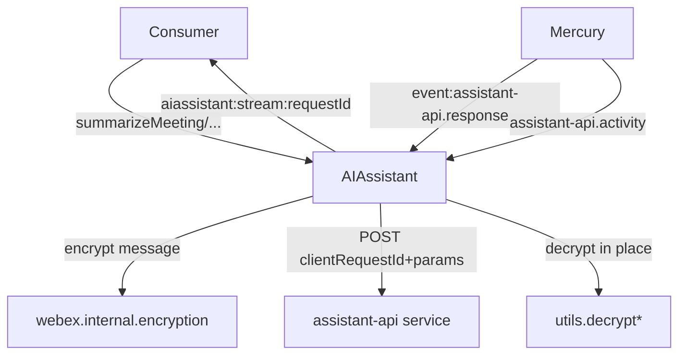
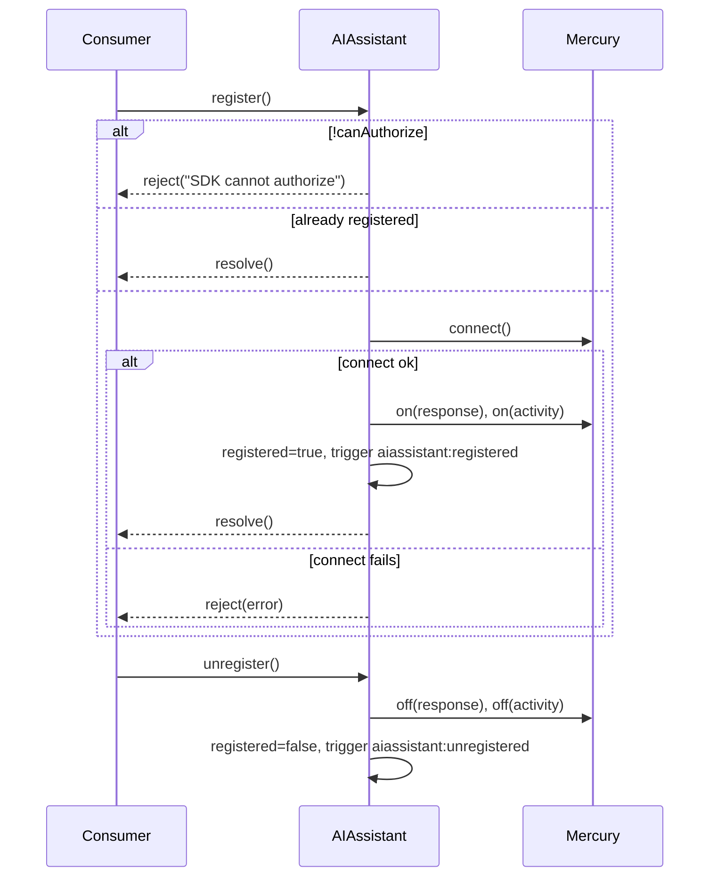
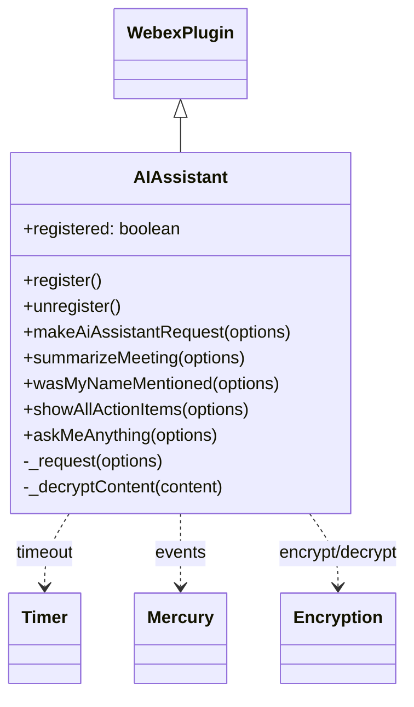

<!-- sdd-generated-metadata
generator: claude-cli
generator_model: us.anthropic.claude-opus-4-8
approved_by: pending-human-review
updated_at: 2026-08-06T00:00:00Z
validation_status: not-run
run_id: 51855eac-8de5-43a2-a3b6-dbcc55ebc91b
-->

# @webex/internal-plugin-ai-assistant — SPEC

> Start here → root [`AGENTS.md`](../../../../AGENTS.md) (agent entry) · router [`SPEC_INDEX.md`](../../../../ai-docs/SPEC_INDEX.md) · system [`ARCHITECTURE.md`](../../../../ai-docs/ARCHITECTURE.md). This is the module's canonical spec: orientation, requirements, design, flows, protocol, and tests.
> Context-efficiency: link to canonical docs — don't duplicate them. Load specs on demand per `SPEC_INDEX.md`.

## Metadata

| Field | Value |
|---|---|
| Module id | `internal-plugin-ai-assistant` |
| Source path(s) | `packages/@webex/internal-plugin-ai-assistant/src/` |
| Parent spec | `—` (registered internal Webex plugin; composed by `webex-core`, no parent module) |
| Doc kind | Module spec |
| Coverage score | Pending coverage assessment |
| Generated from | `module-spec` @ SDLC template library `0.2.2` |
| generated_by / approved_by / updated_at | claude-cli / pending-human-review / 2026-08-06 |
| Validation status | not-run, validator `pending`, assessed 2026-08-06 |

Coverage score is `Pending coverage assessment` until the first coverage review runs. Manifest coverage
state (`Partial`) is authoritative and kept in `.sdd/manifest.json`.

## Evidence Rules
Every requirement cites concrete source evidence using `file path`. Test evidence is preferred for WHY.
Requirements are grounded in the current implementation under `src/` and its unit tests.

## Source Material Register

| Source material | Scope | Decision | Detail location or disposition |
|---|---|---|---|
| `N/A` | none | none | No pre-existing SDD/AI-docs, architecture, or spec documents were routed to this module; content is derived from source and tests. |

## Overview

`@webex/internal-plugin-ai-assistant` is an internal Webex SDK plugin (registered as `aiassistant`) that
provides AI Assistant meeting-analysis features: summarization, "was my name mentioned", action-item
extraction, and free-form "ask me anything" over meeting content. It connects to Mercury for real-time
streamed responses, sends requests to the `assistant-api` service, and decrypts encrypted response
content in place before surfacing it to consumers.

The plugin registers via `registerInternalPlugin('aiassistant', AIAssistant, {config})` and extends
`WebexPlugin`. Its lifecycle is explicit: `register()` connects Mercury and starts listening;
`unregister()` tears down listeners. Requests are correlated by a `clientRequestId`; results stream back
as `aiassistant:stream:<requestId>` events with a timeout guarded by a `@webex/common-timers` `Timer`.
A maintainer should start at `src/ai-assistant.ts` and `src/constants.ts`.

## Purpose / Responsibility

Owns AI Assistant meeting-analysis requests and their streamed, decrypted responses over Mercury/the
`assistant-api` service. It does NOT own encryption keys (delegates to `webex.internal.encryption`),
Mercury transport (delegates to `webex.internal.mercury`), or meeting/locus state.

## Stack

TypeScript (`devMain: src/index.ts`), Node `>=16`. Built with `webex-legacy-tools build` (`-js -ts
-maps`). Unit tests run via `webex-legacy-tools test --unit --runner jest` using `@webex/test-helper-*`
and `sinon`. Runtime dependencies: `@webex/webex-core` (WebexPlugin/registration),
`@webex/internal-plugin-mercury` (real-time events), `@webex/common`, `@webex/common-timers` (`Timer`),
`lodash`, `uuid`.

## Folder / Package Structure

```
packages/@webex/internal-plugin-ai-assistant/src/
├── index.ts          # registerInternalPlugin('aiassistant', AIAssistant, {config})
├── ai-assistant.ts   # AIAssistant WebexPlugin: lifecycle, request/stream, decryption
├── constants.ts      # Event names, service name, action/content/response enums, error codes
├── config.ts         # requestTimeout (default 60000 ms)
├── types.ts          # Request/response and options interfaces
└── utils.ts          # decrypt* helpers for response content
```

## Key Files (source of truth)

| File | Holds |
|---|---|
| `packages/@webex/internal-plugin-ai-assistant/src/ai-assistant.ts` | Plugin lifecycle, `_request` streaming/timeout logic, public request methods, decryption dispatch |
| `packages/@webex/internal-plugin-ai-assistant/src/constants.ts` | Event names, `assistant-api` service name, `ACTION_TYPES`/`CONTENT_TYPES`/`RESPONSE_NAMES`, and `AI_ASSISTANT_ERROR_CODES`/`AI_ASSISTANT_ERRORS` |
| `packages/@webex/internal-plugin-ai-assistant/src/config.ts` | `requestTimeout` (60000 ms) |
| `packages/@webex/internal-plugin-ai-assistant/src/index.ts` | Internal-plugin registration name (`aiassistant`) |

## Public Surface

Consumed as an internal SDK plugin via `webex.internal.aiassistant`. It also emits SDK events and calls
the remote `assistant-api` service.

| Contract ID | Type | Surface | Purpose | Compatibility / deprecation | Schema / detail link | Root index |
|---|---|---|---|---|---|---|
| `ai-assistant.register` | SDK | `register()` / `unregister(): Promise` | Connect/disconnect Mercury and (de)register AI Assistant event listeners | Stable plugin method | `packages/@webex/internal-plugin-ai-assistant/src/ai-assistant.ts` | `../../../../ai-docs/CONTRACTS.md` |
| `ai-assistant.summarizeMeeting` | SDK | `summarizeMeeting(options): Promise<RequestResponse>` | Request a meeting summary (`SUMMARIZE_FOR_ME` action) | Stable plugin method | `packages/@webex/internal-plugin-ai-assistant/src/ai-assistant.ts` | `../../../../ai-docs/CONTRACTS.md` |
| `ai-assistant.wasMyNameMentioned` | SDK | `wasMyNameMentioned(options): Promise<RequestResponse>` | Check if the user's name was mentioned (`WAS_MY_NAME_MENTIONED` action) | Stable plugin method | `packages/@webex/internal-plugin-ai-assistant/src/ai-assistant.ts` | `../../../../ai-docs/CONTRACTS.md` |
| `ai-assistant.showAllActionItems` | SDK | `showAllActionItems(options): Promise<RequestResponse>` | Return all meeting action items (`SHOW_ALL_ACTION_ITEMS` action) | Stable plugin method | `packages/@webex/internal-plugin-ai-assistant/src/ai-assistant.ts` | `../../../../ai-docs/CONTRACTS.md` |
| `ai-assistant.askMeAnything` | SDK | `askMeAnything(options & {question}): Promise<RequestResponse>` | Ask a free-form question about the meeting (encrypted `message`) | Stable plugin method | `packages/@webex/internal-plugin-ai-assistant/src/ai-assistant.ts` | `../../../../ai-docs/CONTRACTS.md` |
| `ai-assistant.streamEvent` | event | `aiassistant:stream:<requestId>` (also `aiassistant:result:<requestId>`, `aiassistant:registered`, `aiassistant:unregistered`, `aiassistant:activityReceived`) | Streamed, decrypted response chunks and lifecycle/activity events | Stable event names (part of the observable contract) | `packages/@webex/internal-plugin-ai-assistant/src/constants.ts` | `../../../../ai-docs/CONTRACTS.md` |

Compatibility notes:
- Public method names/signatures, the emitted event-name conventions, and the `assistant-api` request
  shape are the semver-controlled contract.
- Error codes/messages in `AI_ASSISTANT_ERROR_CODES`/`AI_ASSISTANT_ERRORS` are surfaced to consumers via
  stream events.

## Requires (dependencies)

- `@webex/webex-core` — `WebexPlugin` base and `registerInternalPlugin`.
- `@webex/internal-plugin-mercury` — `webex.internal.mercury` for real-time event delivery.
- `@webex/common-timers` — `Timer` for the per-request response timeout.
- `webex.internal.encryption` — text encryption/decryption of message content.
- `@webex/common`, `lodash`, `uuid` — utilities and request-id generation.

## Requirements

| ID | WHAT | WHY | Source Evidence | Test / Example Evidence | Assumptions / Gaps | Confidence |
|---|---|---|---|---|---|---|
| `AI-ASSISTANT-R-001` | `register()` rejects if `webex.canAuthorize` is false, no-ops if already registered, else connects Mercury, starts listeners, sets `registered=true`, and triggers `aiassistant:registered`. | Registration must be gated on authorization and idempotent so consumers can call it safely. | `packages/@webex/internal-plugin-ai-assistant/src/ai-assistant.ts` | `packages/@webex/internal-plugin-ai-assistant/test/unit/` | none identified | PRESENT |
| `AI-ASSISTANT-R-002` | `unregister()` no-ops if not registered, else stops listening for both `assistant-api` events, triggers `aiassistant:unregistered`, and sets `registered=false`. | Clean teardown must be idempotent and remove all Mercury listeners. | `packages/@webex/internal-plugin-ai-assistant/src/ai-assistant.ts` | `packages/@webex/internal-plugin-ai-assistant/test/unit/` | none identified | PRESENT |
| `AI-ASSISTANT-R-003` | The plugin listens to Mercury `event:assistant-api.response` (routed to `aiassistant:result:<clientRequestId>`) and `assistant-api.activity` (decrypted, then `aiassistant:activityReceived`). | Responses and activities arrive asynchronously and must be routed to per-request/consumer events. | `packages/@webex/internal-plugin-ai-assistant/src/ai-assistant.ts` | `packages/@webex/internal-plugin-ai-assistant/test/unit/` | none identified | PRESENT |
| `AI-ASSISTANT-R-004` | `_request` generates/uses a `requestId` (uuid v4), POSTs `{clientRequestId, ...params}` to the `assistant-api` service, and streams response chunks via `aiassistant:stream:<requestId>`, resetting a `Timer` on each chunk and finalizing on `finished`. | Requests must be correlated and their streamed results surfaced incrementally with a liveness timeout. | `packages/@webex/internal-plugin-ai-assistant/src/ai-assistant.ts` | `packages/@webex/internal-plugin-ai-assistant/test/unit/` | Uses `config.requestTimeout` (60000 ms) | PRESENT |
| `AI-ASSISTANT-R-005` | On timeout the `Timer` stops listening and emits a stream event with `AI_ASSISTANT_TIMEOUT` message and error code `9408`. | A stalled AI response must fail the request deterministically instead of hanging the consumer. | `packages/@webex/internal-plugin-ai-assistant/src/ai-assistant.ts` | `packages/@webex/internal-plugin-ai-assistant/test/unit/` | none identified | PRESENT |
| `AI-ASSISTANT-R-006` | `_decryptContent` decrypts response content in place based on `RESPONSE_NAMES` (message, cited_answer, schedule_meeting, tool_use, workspace; tool_result has no encrypted content), logging an error for unknown names; decryption is skipped when an error code is present. | Encrypted AI responses must be decrypted before delivery, and unknown/error responses must not break the stream. | `packages/@webex/internal-plugin-ai-assistant/src/ai-assistant.ts`, `packages/@webex/internal-plugin-ai-assistant/src/utils.ts` | `packages/@webex/internal-plugin-ai-assistant/test/unit/` | Decrypt errors are surfaced as `errorMessage` on the stream event | PRESENT |
| `AI-ASSISTANT-R-007` | `makeAiAssistantRequest` builds the content payload (encrypting `message` values via `webex.internal.encryption`), targets `sessions/messages` or `sessions/{sessionId}/messages`, and forwards optional `entryPoint`/`assistant`/`renderProtocolVersion` header/params; the four public methods delegate to it with the appropriate action/content. | A single request builder keeps encryption, session routing, and optional parameters consistent across features. | `packages/@webex/internal-plugin-ai-assistant/src/ai-assistant.ts` | `packages/@webex/internal-plugin-ai-assistant/test/unit/` | `locale` defaults to `en_US` | PRESENT |

## Design Overview

`AIAssistant` extends `WebexPlugin` with a `registered` flag. `register()`/`unregister()` manage Mercury
connection and listener lifecycle; listeners route `assistant-api` response events to per-request result
events (`aiassistant:result:<clientRequestId>`) and activity events (decrypted) to
`aiassistant:activityReceived`.

`_request` is the core: it creates a `requestId`, sets up a `Timer` (from `@webex/common-timers`) for the
`config.requestTimeout`, listens on the per-request result event, and on each chunk resets the timer,
extracts `response.content`/`errorMessage`/`errorCode`/`responseType`, decrypts content (unless an error
code is present), and re-emits a merged payload on the stream event. On `finished` it cancels the timer
and stops listening; on timeout it emits a timeout error. It also fires the underlying POST to the
`assistant-api` service and resolves with `{...body, requestId, streamEventName}`.

`makeAiAssistantRequest` assembles the `content` object (context resources, encryptionKeyUrl, type,
value), encrypting `message`-type values first, and chooses the session-scoped or new-session resource.
The four public methods (`summarizeMeeting`, `wasMyNameMentioned`, `showAllActionItems`, `askMeAnything`)
are thin wrappers supplying the correct `ACTION_TYPES`/`CONTENT_TYPES` and context resources.

## Data Flow



## Sequence Diagram(s)

Sequence coverage:

| Operation group | Diagram | Failure / recovery coverage |
|---|---|---|
| Register / unregister lifecycle | 1. Lifecycle | `alt` covers cannot-authorize reject, already-registered no-op, and connect failure reject |
| Request + streamed response | 2. Request/stream | `alt`/`opt` cover per-chunk timer reset, decrypt error surfaced, `finished` finalize, and timeout (code 9408) |

### 1. Register / unregister lifecycle



### 2. Request + streamed response

```mermaid
sequenceDiagram
    participant C as Consumer
    participant A as AIAssistant
    participant T as Timer
    participant API as assistant-api
    participant M as Mercury

    C->>A: summarizeMeeting(options)
    A->>A: build content (encrypt if message)
    A->>T: new Timer(requestTimeout); start
    A->>API: POST sessions[/sessionId]/messages {clientRequestId,...}
    loop response chunks (via Mercury → result event)
        M->>A: response chunk
        A->>T: reset()
        opt no errorCode
            A->>A: _decryptContent(content)
        end
        A->>C: emit aiassistant:stream:requestId (merged payload)
    end
    alt finished
        A->>T: cancel(); stopListening
    else timeout
        T->>A: fire
        A->>C: emit stream: AI_ASSISTANT_TIMEOUT (code 9408)
    end
```

## Class / Component Relationships



`AIAssistant` extends `WebexPlugin` and collaborates with the Mercury, encryption, and Timer components.

## Use Cases

- **UC-1 Summarize a meeting:** consumer `register()`s, calls `summarizeMeeting({meetingInstanceId,
  meetingSite, encryptionKeyUrl})`, and listens on the returned `streamEventName` for chunks. Evidence:
  `packages/@webex/internal-plugin-ai-assistant/src/ai-assistant.ts`.
- **UC-2 Ask a question:** `askMeAnything({..., question})` encrypts the question and streams the answer.
  Evidence: `packages/@webex/internal-plugin-ai-assistant/src/ai-assistant.ts`.

## Concurrency & Reactive Flow

Responses are inherently asynchronous and streamed: multiple chunks per request arrive via Mercury and
are re-emitted on the per-request stream event. Each request has its own `requestId`, result-event
listener, and `Timer`; the timer is reset on every chunk (liveness) and cancelled on `finished`. Requests
are correlated by `clientRequestId`, so concurrent requests do not cross streams. Nothing here blocks;
decryption is awaited per chunk and its failure is surfaced as an `errorMessage` rather than throwing.
Evidence: `packages/@webex/internal-plugin-ai-assistant/src/ai-assistant.ts`.

## Protocol / Wire Format

Requests POST to the `assistant-api` service (`AI_ASSISTANT_SERVICE_NAME`) at `sessions/messages` or
`sessions/{sessionId}/messages` with `content-type: application/json`, body `{clientRequestId, async:
'chunked', locale, content, entryPoint?, assistant?}`, and an optional `AI-Assistant-Render-Protocol`
header. Responses arrive over Mercury as `event:assistant-api.response` (per-request) and
`assistant-api.activity`. Encrypted content fields are decrypted in place per `RESPONSE_NAMES`. Error
codes follow `AI_ASSISTANT_ERROR_CODES` (e.g. timeout `9408`, forbidden `403`, rate-limit `429`).
Evidence: `packages/@webex/internal-plugin-ai-assistant/src/constants.ts`,
`packages/@webex/internal-plugin-ai-assistant/src/ai-assistant.ts`.

## Error Handling & Failure Modes

| Condition | Signal (error/code/result) | Caller recovery |
|---|---|---|
| SDK cannot authorize | `register()` rejects with `Error('SDK cannot authorize')` | Ensure the SDK is authorized before registering |
| Mercury connect fails | `register()` rejects with the underlying error | Retry after connectivity is restored |
| Response timeout | Stream event `errorCode 9408` / `AI_ASSISTANT_TIMEOUT` | Retry the request; timer stops listening |
| Decryption failure | Stream event `errorMessage` set to the decrypt error | Surface to the user; other chunks continue |
| Backend error code | Stream event carries `errorCode`/`errorMessage` (e.g. 403, 429, 204) | Handle per code (auth, backoff, no-content) |
| Unknown response content name | `logger.error` logged; no decryption | Investigate; response is passed through |

## Pitfalls

- The per-request `Timer` is reset on EVERY chunk, so the timeout is a liveness (idle) timeout, not a
  total-duration cap — a slow-but-steady stream will not time out.
- Only `message`-type content is encrypted before send; action-type requests send the action value in the
  clear (it is not user content).
- Decryption is skipped when an `errorCode` is present; consumers must read `errorCode`/`errorMessage` on
  stream events rather than assuming decrypted content is always populated.
- `register()`/`unregister()` are idempotent; calling request methods before `register()` means no
  Mercury responses will arrive.

## Module Do's / Don'ts

- DO listen on the `streamEventName` returned from the request methods for incremental results.
- DO check `errorCode`/`finished` on each stream event.
- DON'T call request methods without first `register()`-ing (no listeners → no responses).

## Test-Case Strategy (module)

Unit tests (Jest) mock `webex.internal.mercury`/`encryption` and assert: authorization-gated and
idempotent register/unregister; listener wiring; `_request` streaming with timer reset and finalize; the
timeout path (code 9408); `_decryptContent` dispatch per `RESPONSE_NAMES` including the unknown-name log;
and each public method delegating with the correct action/content and session routing.

| Behavior / Requirement | Existing test evidence | Gap |
|---|---|---|
| `AI-ASSISTANT-R-001` | `packages/@webex/internal-plugin-ai-assistant/test/unit/` | Re-check both the cannot-authorize and already-registered branches |
| `AI-ASSISTANT-R-002` | `packages/@webex/internal-plugin-ai-assistant/test/unit/` | Re-check not-registered no-op |
| `AI-ASSISTANT-R-003` | `packages/@webex/internal-plugin-ai-assistant/test/unit/` | Re-check activity decrypt path |
| `AI-ASSISTANT-R-004` | `packages/@webex/internal-plugin-ai-assistant/test/unit/` | Re-check chunked streaming + finished finalize |
| `AI-ASSISTANT-R-005` | `packages/@webex/internal-plugin-ai-assistant/test/unit/` | Re-check timeout emits code 9408 |
| `AI-ASSISTANT-R-006` | `packages/@webex/internal-plugin-ai-assistant/test/unit/` | Re-check each RESPONSE_NAMES branch and error-code skip |
| `AI-ASSISTANT-R-007` | `packages/@webex/internal-plugin-ai-assistant/test/unit/` | Re-check session vs new-session resource and optional params |

## Traceability

- Repo architecture: [`ARCHITECTURE.md`](../../../../ai-docs/ARCHITECTURE.md) · Registry: [`SPEC_INDEX.md`](../../../../ai-docs/SPEC_INDEX.md)
- Contracts catalog: [`CONTRACTS.md`](../../../../ai-docs/CONTRACTS.md)
- Coverage state & contracts baseline: `.sdd/manifest.json`
