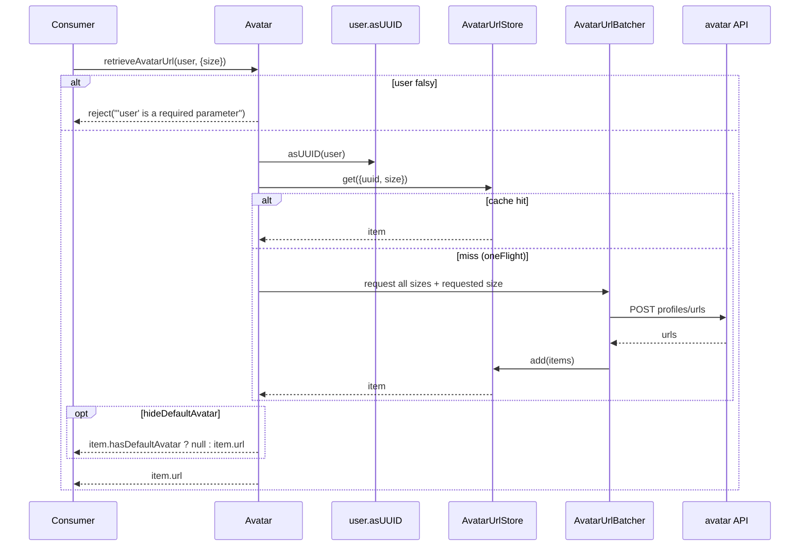
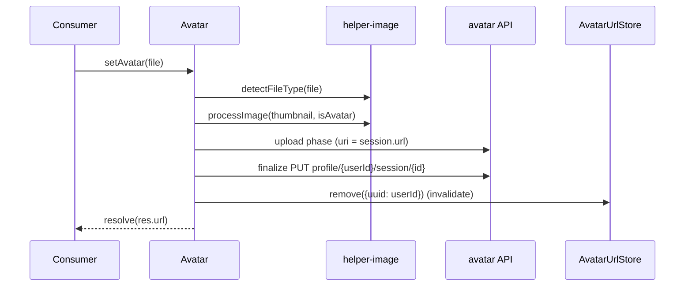
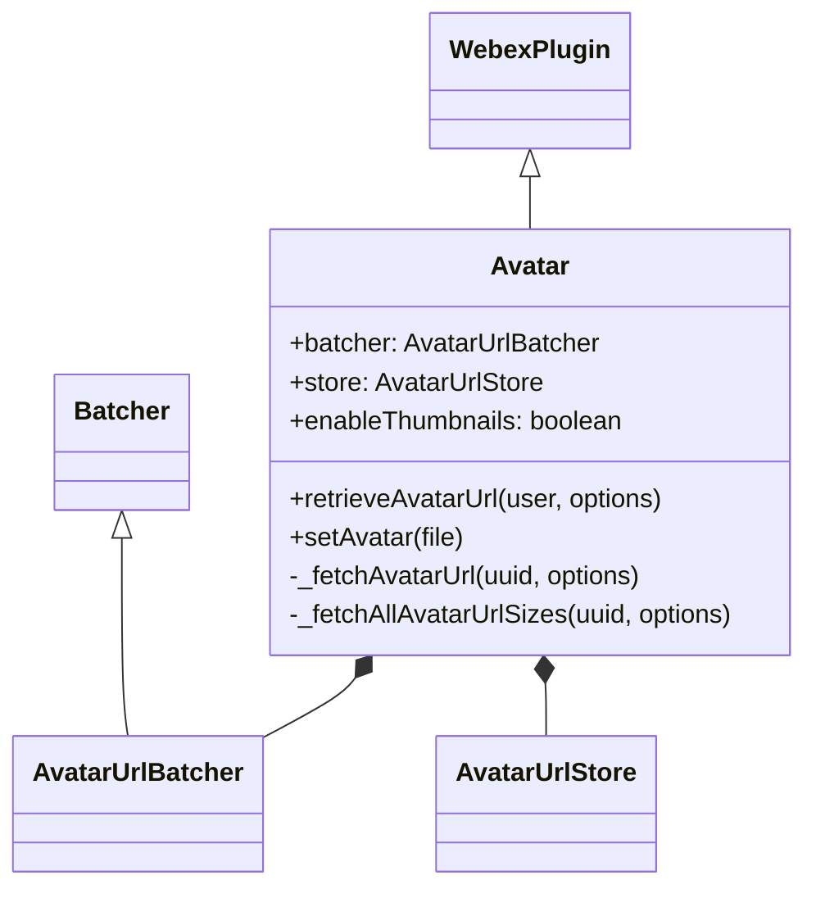

<!-- sdd-generated-metadata
generator: claude-cli
generator_model: us.anthropic.claude-opus-4-8
approved_by: pending-human-review
updated_at: 2026-08-06T00:00:00Z
validation_status: not-run
run_id: 51855eac-8de5-43a2-a3b6-dbcc55ebc91b
-->

# @webex/internal-plugin-avatar — SPEC

> Start here → root [`AGENTS.md`](../../../../AGENTS.md) (agent entry) · router [`SPEC_INDEX.md`](../../../../ai-docs/SPEC_INDEX.md) · system [`ARCHITECTURE.md`](../../../../ai-docs/ARCHITECTURE.md). This is the module's canonical spec: orientation, requirements, design, flows, state, and tests.
> Context-efficiency: link to canonical docs — don't duplicate them. Load specs on demand per `SPEC_INDEX.md`.

## Metadata

| Field | Value |
|---|---|
| Module id | `internal-plugin-avatar` |
| Source path(s) | `packages/@webex/internal-plugin-avatar/src/` |
| Parent spec | `—` (registered internal Webex plugin; composed by `webex-core`, no parent module) |
| Doc kind | Module spec |
| Coverage score | Pending coverage assessment |
| Generated from | `module-spec` @ SDLC template library `0.2.2` |
| generated_by / approved_by / updated_at | claude-cli / pending-human-review / 2026-08-06 |
| Validation status | not-run, validator `pending`, assessed 2026-08-06 |

Coverage score is `Pending coverage assessment` until the first coverage review runs. Manifest coverage
state (`Partial`) is authoritative and kept in `.sdd/manifest.json`.

## Evidence Rules
Every requirement cites concrete source evidence using `file path`. Test evidence is preferred for WHY.
Requirements are grounded in the current implementation under `src/` and its unit tests.

## Source Material Register

| Source material | Scope | Decision | Detail location or disposition |
|---|---|---|---|
| `N/A` | none | none | No pre-existing SDD/AI-docs, architecture, or spec documents were routed to this module; content is derived from source and tests. |

## Overview

`@webex/internal-plugin-avatar` is an internal Webex SDK plugin (registered as `avatar`) that retrieves
and uploads user avatar URLs. It caches avatar URLs per user/size with a TTL, batches concurrent URL
lookups into a single backend request via an `AvatarUrlBatcher`, and de-duplicates in-flight fetches with
`@webex/common`'s `oneFlight`. Uploading a new avatar uses `@webex/helper-image` to detect the file type
and produce a thumbnail, then performs a two-phase upload and invalidates the cached entry.

The plugin registers via `registerInternalPlugin('avatar', Avatar, {config})`, importing the `user` and
`device` internal plugins it depends on. A maintainer should start at `src/avatar.js`, with
`src/avatar-url-store.js` (cache), `src/avatar-url-batcher.js` (batching), and `src/config.js` (sizes,
TTL, thumbnail bounds) as the supporting files.

## Purpose / Responsibility

Owns avatar URL retrieval (cached, batched, single-flighted) and avatar upload for the current user. It
does NOT own user identity resolution (`webex.internal.user.asUUID`), device identity
(`webex.internal.device.userId`), image processing (`@webex/helper-image`), or the upload transport
(inherited `upload`).

## Stack

JavaScript (Babel legacy build), Node `>=16`. Built with `webex-legacy-tools build` (`-js -ts -maps`).
Unit tests run via `webex-legacy-tools test --unit --runner jest`; integration/browser via karma.
Runtime dependencies: `@webex/webex-core` (WebexPlugin/Batcher/registration), `@webex/common`
(`oneFlight`, `patterns`), `@webex/common-timers` (`safeSetTimeout`), `@webex/helper-image`
(`detectFileType`, `processImage`), `@webex/internal-plugin-device`, `@webex/internal-plugin-user`,
`lodash`.

## Folder / Package Structure

```
packages/@webex/internal-plugin-avatar/src/
├── index.js               # registerInternalPlugin('avatar', Avatar, {config}); imports user + device
├── avatar.js              # Avatar WebexPlugin: retrieveAvatarUrl, setAvatar, fetch de-dup
├── avatar-url-store.js    # AvatarUrlStore: per-(uuid,size) URL cache with TTL eviction
├── avatar-url-batcher.js  # AvatarUrlBatcher: batches uuid/size lookups into one POST
└── config.js              # sizes, defaultAvatarSize, cacheControl TTL, thumbnail bounds, batcher timing
```

## Key Files (source of truth)

| File | Holds |
|---|---|
| `packages/@webex/internal-plugin-avatar/src/avatar.js` | `retrieveAvatarUrl`/`setAvatar` and the `oneFlight`-guarded fetch helpers |
| `packages/@webex/internal-plugin-avatar/src/avatar-url-store.js` | Cache validation rules, `(uuid,size)` keying, and TTL-based removal |
| `packages/@webex/internal-plugin-avatar/src/avatar-url-batcher.js` | Batch request payload construction and per-item success/failure resolution |
| `packages/@webex/internal-plugin-avatar/src/config.js` | Canonical `sizes`, `defaultAvatarSize` (80), `cacheControl` (3600s), thumbnail max dimensions, batcher timing |

## Public Surface

Consumed as an internal SDK plugin via `webex.internal.avatar`; it calls the `avatar` backend API.

| Contract ID | Type | Surface | Purpose | Compatibility / deprecation | Schema / detail link | Root index |
|---|---|---|---|---|---|---|
| `avatar.retrieveAvatarUrl` | SDK | `retrieveAvatarUrl(user, options?): Promise<string \| null>` | Resolve an avatar URL for a user/uuid/email at a given size, using cache + batching | Stable plugin method | `packages/@webex/internal-plugin-avatar/src/avatar.js` | `../../../../ai-docs/CONTRACTS.md` |
| `avatar.setAvatar` | SDK | `setAvatar(file): Promise<string>` | Upload a new avatar for the current user and return the full-size URL | Stable plugin method | `packages/@webex/internal-plugin-avatar/src/avatar.js` | `../../../../ai-docs/CONTRACTS.md` |

Compatibility notes:
- The two public method names/signatures are the semver-controlled surface.
- The set of supported avatar `sizes` and the `avatar` backend resources (`profiles/urls`,
  `profile/{userId}/session`) are behavioral contracts with the backend.

## Requires (dependencies)

- `@webex/webex-core` — `WebexPlugin` base, `Batcher` base, `registerInternalPlugin`, and the inherited
  `upload`/`request` helpers.
- `@webex/internal-plugin-user` — `webex.internal.user.asUUID` to resolve users/emails to a uuid.
- `@webex/internal-plugin-device` — `webex.internal.device.userId` for the current user's uploads.
- `@webex/helper-image` — `detectFileType` and `processImage` for avatar uploads.
- `@webex/common` (`oneFlight`, `patterns`) and `@webex/common-timers` (`safeSetTimeout`).

## Requirements

| ID | WHAT | WHY | Source Evidence | Test / Example Evidence | Assumptions / Gaps | Confidence |
|---|---|---|---|---|---|---|
| `AVATAR-R-001` | `retrieveAvatarUrl` rejects when `user` is falsy, resolves the user to a uuid via `webex.internal.user.asUUID`, defaults `size`/`cacheControl` from config, and returns the cached-or-fetched URL. | Callers need a single entry point that accepts a user/uuid/email and returns a sized avatar URL with sensible defaults. | `packages/@webex/internal-plugin-avatar/src/avatar.js` | `packages/@webex/internal-plugin-avatar/test/unit/` | Default size 80, default cacheControl 3600s | PRESENT |
| `AVATAR-R-002` | `_fetchAvatarUrl` checks the store first and, on a miss, fetches all configured sizes and the requested size, then caches; it is `@oneFlight`-keyed by `uuid+size` to de-duplicate concurrent lookups. | Batch-fetching all sizes warms the cache, and single-flighting prevents redundant concurrent requests for the same avatar. | `packages/@webex/internal-plugin-avatar/src/avatar.js` | `packages/@webex/internal-plugin-avatar/test/unit/` | `_fetchAllAvatarUrlSizes` is `@oneFlight`-keyed by uuid | PRESENT |
| `AVATAR-R-003` | When `options.hideDefaultAvatar` is set, `retrieveAvatarUrl` returns `null` for items flagged `hasDefaultAvatar`, otherwise the item URL. | Some UIs must distinguish a real avatar from the generated default and suppress the latter. | `packages/@webex/internal-plugin-avatar/src/avatar.js` | `packages/@webex/internal-plugin-avatar/test/unit/` | none identified | PRESENT |
| `AVATAR-R-004` | `AvatarUrlBatcher` batches queued `(uuid,size)` requests into a single `POST avatar/profiles/urls` with per-uuid size arrays, and resolves each item to `{hasDefaultAvatar, uuid, size, url}` or rejects it on failure. | Coalescing lookups into one request reduces backend load while still resolving each caller's promise. | `packages/@webex/internal-plugin-avatar/src/avatar-url-batcher.js` | `packages/@webex/internal-plugin-avatar/test/unit/` | Warns when the backend substitutes a different size | PRESENT |
| `AVATAR-R-005` | `AvatarUrlStore` validates `item`/`uuid`/`size` (and `uuid` against `patterns.uuid`) on get/add, keys entries by `\`${uuid} - ${size}\``, and schedules TTL removal via `safeSetTimeout(remove, cacheControl*1000)`. | A validated, TTL-bounded cache ensures stale avatars are evicted and malformed keys are rejected. | `packages/@webex/internal-plugin-avatar/src/avatar-url-store.js` | `packages/@webex/internal-plugin-avatar/test/unit/` | `remove` without a size clears all configured sizes | PRESENT |
| `AVATAR-R-006` | `setAvatar` detects the file type, processes it into a thumbnail (bounded by config), performs a two-phase upload (`upload` then `finalize` PUT) to `profile/{userId}/session`, invalidates the cached avatar for the current user, and resolves the resulting URL. | Uploading must normalize the image and refresh the cache so the new avatar is immediately consistent. | `packages/@webex/internal-plugin-avatar/src/avatar.js` | `packages/@webex/internal-plugin-avatar/test/unit/` | Uses `enableThumbnails` session flag; `isAvatar:true` | PRESENT |

## Design Overview

`Avatar` extends `WebexPlugin` and holds a `batcher` child (`AvatarUrlBatcher`) plus session state: a
`store` (`AvatarUrlStore`) and an `enableThumbnails` boolean. `retrieveAvatarUrl` resolves the user to a
uuid, then calls `_fetchAvatarUrl`, which reads the store and, on a miss, triggers `_fetchAllAvatarUrlSizes`
(fetch every configured size) plus the specific size, adding results to the store. Both fetch helpers are
`@oneFlight`-decorated so concurrent calls share one request.

`AvatarUrlBatcher` (extends `webex-core`'s `Batcher`) fingerprints requests/responses by `uuid-size`,
coalesces the queue into per-uuid size arrays, POSTs to `avatar/profiles/urls`, and resolves/rejects each
deferred item. `AvatarUrlStore` uses a module-level `WeakMap` of `Map`s keyed by `\`${uuid} - ${size}\``,
validating inputs (including `patterns.uuid`) and scheduling `safeSetTimeout` eviction at `cacheControl`
seconds.

`setAvatar` chains `detectFileType` → `processImage` (thumbnail) → the inherited `upload` two-phase flow →
store invalidation for the current user's uuid.

## Data Flow

```mermaid
flowchart TB
  Consumer -->|retrieveAvatarUrl(user,size)| Avatar
  Avatar -->|asUUID| User[webex.internal.user]
  Avatar -->|store.get| Store[(AvatarUrlStore TTL cache)]
  Avatar -->|miss → request| Batcher[AvatarUrlBatcher]
  Batcher -->|POST profiles/urls| API[avatar API]
  API --> Batcher
  Batcher --> Store
  Consumer -->|setAvatar(file)| Avatar
  Avatar -->|detectFileType/processImage| Img[["@webex/helper-image"]]
  Avatar -->|two-phase upload| API
  Avatar -->|store.remove(userId)| Store
```

## Sequence Diagram(s)

Sequence coverage:

| Operation group | Diagram | Failure / recovery coverage |
|---|---|---|
| Retrieve avatar URL (cache + batch) | 1. retrieveAvatarUrl | `alt` covers cache hit vs. miss→batch; `opt` covers hideDefaultAvatar → null; batch failure rejects the item |
| Upload avatar | 2. setAvatar | Two-phase upload then cache invalidation; image errors degrade via helper-image |

### 1. retrieveAvatarUrl



### 2. setAvatar



## Class / Component Relationships



`Avatar` composes an `AvatarUrlBatcher` (extends `Batcher`) and an `AvatarUrlStore`, and extends
`WebexPlugin`.

## Use Cases

- **UC-1 Show a user's avatar:** `retrieveAvatarUrl(userIdOrEmail, {size: 80})`; returns a cached or
  freshly-batched URL. Evidence: `packages/@webex/internal-plugin-avatar/src/avatar.js`.
- **UC-2 Change my avatar:** `setAvatar(file)` uploads and returns the new URL, invalidating the cache.
  Evidence: `packages/@webex/internal-plugin-avatar/src/avatar.js`.

## State Model

The plugin holds session state: a `store` (`AvatarUrlStore`) and `enableThumbnails` (default true). The
store's backing data is a module-level `WeakMap` of `Map`s keyed by `\`${uuid} - ${size}\``; each entry is
evicted by a `safeSetTimeout` scheduled at `cacheControl` seconds on `add`. `remove` clears one size or
all configured sizes. `oneFlight` maintains transient in-flight fetch state keyed by uuid(+size).
Evidence: `packages/@webex/internal-plugin-avatar/src/avatar-url-store.js`,
`packages/@webex/internal-plugin-avatar/src/avatar.js`.

## Business Rules & Invariants

- Cache keys are always `\`${uuid} - ${size}\``; a `uuid` must match `patterns.uuid` or get/add rejects —
  enforced in `AvatarUrlStore` (`src/avatar-url-store.js`).
- Cached entries expire after `cacheControl` seconds via `safeSetTimeout` — enforced on `add`.
- `add` requires `item`, `uuid`, `size`, `url`, and `cacheControl`; any missing field rejects.
- Uploading invalidates the current user's cached avatar so the next retrieve reflects the new image —
  enforced in `setAvatar` (`src/avatar.js`).

## Concurrency & Reactive Flow

Concurrency is central: `_fetchAvatarUrl` and `_fetchAllAvatarUrlSizes` are `@oneFlight`-decorated so
concurrent requests for the same uuid/size share a single in-flight promise, and `AvatarUrlBatcher`
coalesces queued lookups (configurable via `batcherWait`/`batcherMaxCalls`/`batcherMaxWait`) into one
backend POST. TTL eviction runs asynchronously via `safeSetTimeout`. None of these block the event loop;
per-item deferreds in the batcher resolve/reject independently. Evidence:
`packages/@webex/internal-plugin-avatar/src/avatar.js`, `packages/@webex/internal-plugin-avatar/src/avatar-url-batcher.js`.

## Error Handling & Failure Modes

| Condition | Signal (error/code/result) | Caller recovery |
|---|---|---|
| `retrieveAvatarUrl` with falsy user | Rejected Promise `Error("'user' is a required parameter")` | Pass a user/uuid/email |
| Store get miss / invalid uuid / missing fields | Rejected Promise with a specific `Error` (`item.uuid does not appear to be a uuid`, etc.) | Provide valid item fields; a miss triggers a fetch upstream |
| Batch backend failure | Each queued item's deferred rejects with the failure message | Retry retrieval; cache remains unpopulated for those items |
| Backend size substitution | Item still resolves; `logger.warn` about the substituted size | Accept the substituted size |

## Pitfalls

- `retrieveAvatarUrl` warms the cache for ALL configured sizes on a miss (`_fetchAllAvatarUrlSizes`), so a
  single lookup can trigger a multi-size fetch — expected, not a bug.
- The store cache is keyed by the exact `\`${uuid} - ${size}\`` string (note the spaces around the dash);
  do not construct keys differently.
- TTL eviction is scheduled at `add` time via `safeSetTimeout`; the entry is not refreshed on read, so a
  hot avatar still expires after `cacheControl` seconds.
- `setAvatar` depends on the `user` and `device` internal plugins (imported in `index.js`) for the current
  user's uuid; the plugin will not function without them registered.

## Module Do's / Don'ts

- DO retrieve avatars through `retrieveAvatarUrl` so caching, batching, and single-flighting apply.
- DO source avatar `sizes`, `defaultAvatarSize`, `cacheControl`, and thumbnail bounds from `config.js`.
- DON'T call the `avatar/profiles/urls` backend directly — go through the batcher.

## Test-Case Strategy (module)

Unit tests (Jest) mock `webex.internal.user`/`device` and the request layer and assert: the required-user
rejection; cache hit vs. miss→batch behavior and `oneFlight` de-duplication; `hideDefaultAvatar` → null;
batcher payload coalescing and per-item resolve/reject; store validation, keying, and TTL eviction; and
the `setAvatar` detect→process→two-phase-upload→invalidate flow.

| Behavior / Requirement | Existing test evidence | Gap |
|---|---|---|
| `AVATAR-R-001` | `packages/@webex/internal-plugin-avatar/test/unit/` | Re-check default size/cacheControl application |
| `AVATAR-R-002` | `packages/@webex/internal-plugin-avatar/test/unit/` | Re-check oneFlight concurrent-call de-dup |
| `AVATAR-R-003` | `packages/@webex/internal-plugin-avatar/test/unit/` | Re-check hasDefaultAvatar → null |
| `AVATAR-R-004` | `packages/@webex/internal-plugin-avatar/test/unit/` | Re-check batch failure and size-substitution warn |
| `AVATAR-R-005` | `packages/@webex/internal-plugin-avatar/test/unit/` | Re-check invalid-uuid rejection and all-sizes remove |
| `AVATAR-R-006` | `packages/@webex/internal-plugin-avatar/test/unit/` | Re-check two-phase upload and cache invalidation |

## Traceability

- Repo architecture: [`ARCHITECTURE.md`](../../../../ai-docs/ARCHITECTURE.md) · Registry: [`SPEC_INDEX.md`](../../../../ai-docs/SPEC_INDEX.md)
- Contracts catalog: [`CONTRACTS.md`](../../../../ai-docs/CONTRACTS.md)
- Coverage state & contracts baseline: `.sdd/manifest.json`
