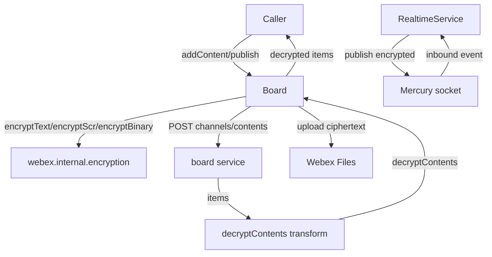
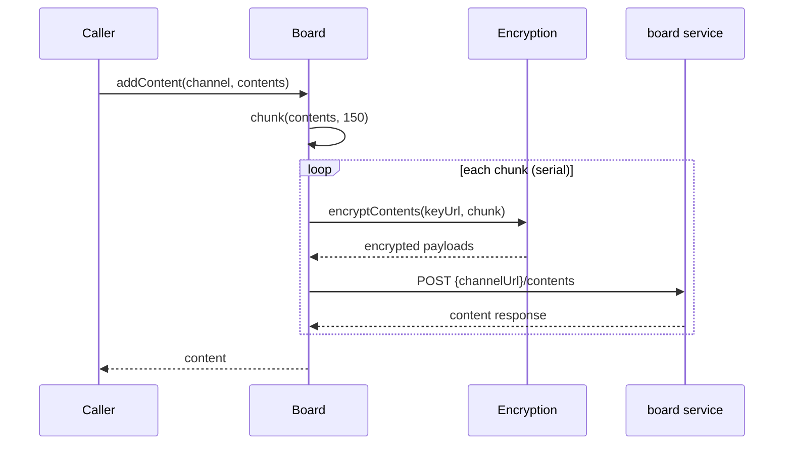
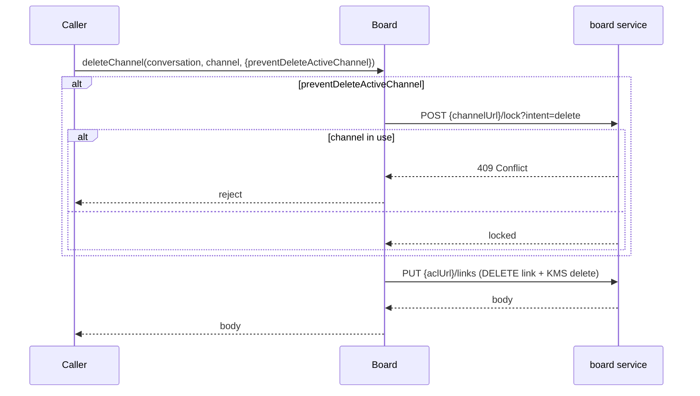
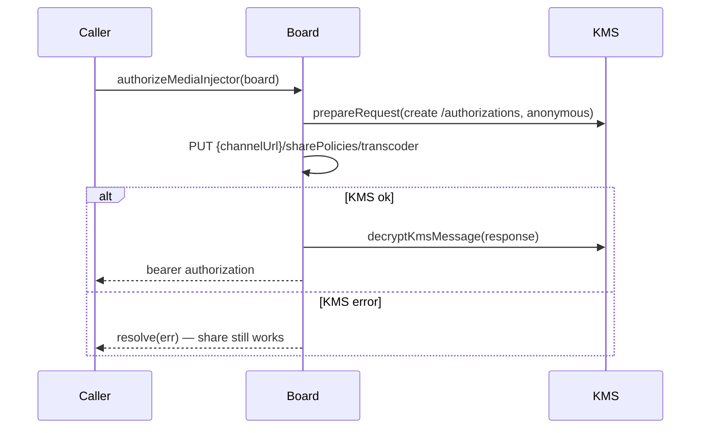
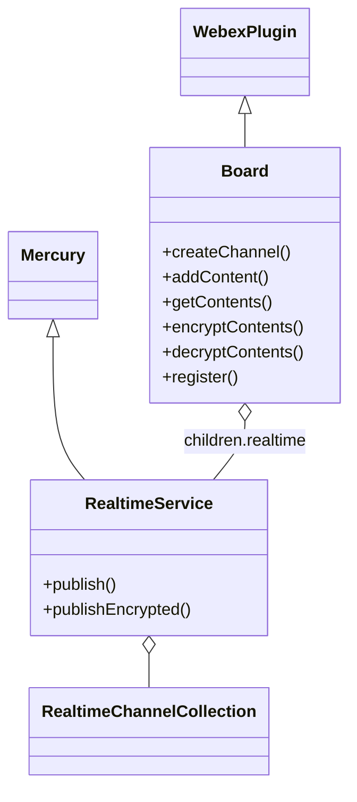

<!-- sdd-generated-metadata
generator: claude-cli
generator_model: us.anthropic.claude-opus-4-8
approved_by: pending-human-review
updated_at: 2026-08-06T00:00:00Z
validation_status: not-run
run_id: 51855eac-8de5-43a2-a3b6-dbcc55ebc91b
-->

# @webex/internal-plugin-board — SPEC

> Start here → root [`AGENTS.md`](../../../../AGENTS.md) (agent entry) · router [`SPEC_INDEX.md`](../../../../ai-docs/SPEC_INDEX.md) · system [`ARCHITECTURE.md`](../../../../ai-docs/ARCHITECTURE.md). This is the module's canonical spec: orientation, requirements, design, flows, protocol, and tests.
> Context-efficiency: link to canonical docs — don't duplicate them. Load specs on demand per `SPEC_INDEX.md`.

## Metadata

| Field | Value |
|---|---|
| Module id | `internal-plugin-board` |
| Source path(s) | `packages/@webex/internal-plugin-board/src/` |
| Parent spec | `—` (registered internal Webex plugin; composed by `webex-core`, no parent module) |
| Doc kind | Module spec |
| Coverage score | Pending coverage assessment |
| Generated from | `module-spec` @ SDLC template library `0.2.2` |
| generated_by / approved_by / updated_at | claude-cli / pending-human-review / 2026-08-06 |
| Validation status | not-run, validator `pending`, assessed 2026-08-06 |

Coverage score is `Pending coverage assessment` until the first coverage review runs. Manifest coverage
state (`Partial`) is authoritative and kept in `.sdd/manifest.json`.

## Evidence Rules
Every requirement cites concrete source evidence using `file path`. Test evidence is preferred for WHY.
Requirements are grounded in the current implementation under `src/` and its unit tests.

## Source Material Register

| Source material | Scope | Decision | Detail location or disposition |
|---|---|---|---|
| `N/A` | none | none | No pre-existing SDD/AI-docs, architecture, or spec documents were routed to this module; content is derived from source and tests. |

## Overview

`@webex/internal-plugin-board` is an internal Webex SDK plugin (registered as `board`) that owns the
persistence and real-time collaboration surface for Webex whiteboards ("boards"). A board channel is
linked to a Conversation via ACLs and KMS resource objects; the plugin creates/deletes channels, adds and
retrieves encrypted content (curves, text, and images), and streams live content changes over a Mercury
websocket.

The plugin is split into two collaborating `WebexPlugin` classes sharing the `Board` namespace. `Board`
(`src/board.js`) is the persistence/HTTP service: channel lifecycle, content CRUD, image upload to Webex
Files, encryption/decryption of content, and Mercury registration. Its `realtime` child
(`src/realtime.js`, a Mercury subclass) publishes encrypted content over the socket and emits inbound
board events. Registration in `src/index.js` also wires two payload transformer predicates/transforms
(`decryptContents` inbound, `encryptChannel` outbound) into the shared `webex-core` transform pipeline.

All board content is encrypted client-side using `@webex/internal-plugin-encryption` (KMS keys and SCRs);
the plugin never sends plaintext content or SCRs to the board service. A maintainer should start at
`src/board.js` and `src/index.js`.

## Purpose / Responsibility

Owns Webex whiteboard channel lifecycle, encrypted content CRUD, image upload, and real-time content
publish/receive over Mercury. It does NOT own encryption keys/SCR crypto (delegates to
`webex.internal.encryption`), Mercury transport internals (extends/uses `webex.internal.mercury`), or
Conversation/ACL ownership (consumes `conversation.aclUrl`/`kmsResourceObjectUrl`).

## Stack

JavaScript (`devMain: src/index.js`), Node `>=16`. Built with `webex-legacy-tools build` (`-js -ts
-maps`). Unit tests run via `webex-legacy-tools test --unit --runner jest`; browser/integration via
karma. Runtime dependencies: `@webex/webex-core` (`WebexPlugin`, `Page`), `@webex/internal-plugin-mercury`
(real-time socket, base class for realtime), `@webex/internal-plugin-encryption` (KMS/SCR crypto),
`@webex/internal-plugin-conversation` (ACL/KRO source), `@webex/internal-plugin-feature`
(`web-shared-mercury` toggle), `@webex/common`, `ampersand-collection`, `es6-promise-series`, `lodash`,
`uuid`.

## Folder / Package Structure

```
packages/@webex/internal-plugin-board/src/
├── index.js                          # registerInternalPlugin('board', Board, {...}); payload transforms
├── board.js                          # Board WebexPlugin: channel/content CRUD, encrypt/decrypt, upload
├── realtime.js                       # RealtimeService (Mercury subclass): publish/receive board events
├── realtime-channel.js               # RealtimeChannel model (per-channel socket state)
├── realtime-channel-collection.js    # Collection of RealtimeChannel models
└── config.js                         # board config: page sizes, ping/pong timeouts, binding prefix
```

## Key Files (source of truth)

| File | Holds |
|---|---|
| `packages/@webex/internal-plugin-board/src/board.js` | Channel lifecycle, content encrypt/decrypt, image upload, Mercury registration, transcoder auth |
| `packages/@webex/internal-plugin-board/src/realtime.js` | Real-time publish/receive of encrypted content over the shared/board socket |
| `packages/@webex/internal-plugin-board/src/config.js` | `numberContentsPerPageForAdd` (150), `numberContentsPerPageForGet` (1000), ping/pong/close timeouts, `mercuryBindingPrefix` (`board.`) |
| `packages/@webex/internal-plugin-board/src/index.js` | Internal-plugin registration name (`board`) and payload transformer wiring |

## Public Surface

Consumed as an internal SDK plugin via `webex.internal.board`. It calls the remote `board` service and a
Mercury socket, and participates in the `webex-core` transform pipeline.

| Contract ID | Type | Surface | Purpose | Compatibility / deprecation | Schema / detail link | Root index |
|---|---|---|---|---|---|---|
| `board.createChannel` | SDK | `createChannel(conversation, channel): Promise<Channel>` | Create a board channel linked to a conversation (ACL + KMS) | Stable plugin method | `packages/@webex/internal-plugin-board/src/board.js` | `../../../../ai-docs/CONTRACTS.md` |
| `board.deleteChannel` | SDK | `deleteChannel(conversation, channel, options): Promise` | Unlink/delete a channel; optional lock-before-delete | Stable plugin method | `packages/@webex/internal-plugin-board/src/board.js` | `../../../../ai-docs/CONTRACTS.md` |
| `board.getChannel` / `getChannels` | SDK | `getChannel(channel)` / `getChannels(conversation, options): Promise<Page>` | Fetch a channel or a page of channels for a conversation | Stable plugin method | `packages/@webex/internal-plugin-board/src/board.js` | `../../../../ai-docs/CONTRACTS.md` |
| `board.addContent` | SDK | `addContent(channel, contents): Promise<Content>` | Add content in serial chunks (batched by `numberContentsPerPageForAdd`) | Stable plugin method | `packages/@webex/internal-plugin-board/src/board.js` | `../../../../ai-docs/CONTRACTS.md` |
| `board.addImage` / `setSnapshotImage` | SDK | `addImage(channel, image, metadata)` / `setSnapshotImage(channel, image): Promise` | Upload+encrypt an image to Webex Files and attach it/snapshot | Stable plugin method | `packages/@webex/internal-plugin-board/src/board.js` | `../../../../ai-docs/CONTRACTS.md` |
| `board.getContents` | SDK | `getContents(channel, options): Promise<Page>` | Retrieve a page of decrypted content items | Stable plugin method | `packages/@webex/internal-plugin-board/src/board.js` | `../../../../ai-docs/CONTRACTS.md` |
| `board.deleteAllContent` / `deletePartialContent` | SDK | `deleteAllContent(channel)` / `deletePartialContent(channel, contentsToKeep): Promise` | Clear all content or all except a keep-list | Stable plugin method | `packages/@webex/internal-plugin-board/src/board.js` | `../../../../ai-docs/CONTRACTS.md` |
| `board.register` / `registerToShareMercury` / `unregisterFromSharedMercury` | SDK | `register(data)` / `registerToShareMercury(channel)` / `unregisterFromSharedMercury(channel, binding): Promise` | Register bindings with Mercury; share/unshare the web socket (gated by `web-shared-mercury`) | Stable plugin method | `packages/@webex/internal-plugin-board/src/board.js` | `../../../../ai-docs/CONTRACTS.md` |
| `board.realtime.publish` | SDK | `realtime.publish(channel, message)` / `publishEncrypted(...)` | Encrypt then publish content over the socket | Stable plugin method | `packages/@webex/internal-plugin-board/src/realtime.js` | `../../../../ai-docs/CONTRACTS.md` |
| `board.authorizeMediaInjector` / `unauthorizeMediaInjector` | SDK | `authorizeMediaInjector(board)` / `unauthorizeMediaInjector(board): Promise` | (Un)authorize the transcoder for mobile whiteboard share via KMS authorizations | Stable plugin method | `packages/@webex/internal-plugin-board/src/board.js` | `../../../../ai-docs/CONTRACTS.md` |

Compatibility notes:
- Public method names/signatures and the encrypted board content wire shape are the semver-controlled contract.
- `authorizeMediaInjector` deliberately resolves (rather than rejects) on KMS errors so whiteboard share keeps working.

## Requires (dependencies)

- `@webex/webex-core` — `WebexPlugin` base, `registerInternalPlugin`, `Page` pagination.
- `@webex/internal-plugin-mercury` — real-time socket; base class for the `realtime` child.
- `webex.internal.encryption` — `encryptText`/`decryptText`, `encryptScr`/`decryptScr`, `encryptBinary`, and `kms.*` authorization APIs.
- `webex.internal.conversation` — supplies `aclUrl` and `kmsResourceObjectUrl` when preparing/deleting channels.
- `webex.internal.feature` — `developer`/`web-shared-mercury` toggle gating shared-Mercury registration.
- `webex.internal.device` — `deviceType`, `webSocketUrl` for content/registration bodies.
- `@webex/common`, `ampersand-collection`, `es6-promise-series`, `lodash`, `uuid` — utilities.

## Requirements

| ID | WHAT | WHY | Source Evidence | Test / Example Evidence | Assumptions / Gaps | Confidence |
|---|---|---|---|---|---|---|
| `BOARD-R-001` | `createChannel` POSTs `/channels` with a body derived from `_prepareChannel`, linking `aclUrlLink` to the conversation ACL and pushing `kmsResourceObjectUrl` into the KMS message `userIds`. | Channels must be ACL/KMS-linked to a conversation so content encryption/authorization is scoped correctly. | `packages/@webex/internal-plugin-board/src/board.js` | `packages/@webex/internal-plugin-board/test/unit/` | none identified | PRESENT |
| `BOARD-R-002` | `addContent` splits contents into chunks of `config.numberContentsPerPageForAdd` (150) and posts them in series via `promiseSeries` so patches never race. | Serial chunked adds avoid content-ordering race conditions on the server. | `packages/@webex/internal-plugin-board/src/board.js`, `packages/@webex/internal-plugin-board/src/config.js` | `packages/@webex/internal-plugin-board/test/unit/` | none identified | PRESENT |
| `BOARD-R-003` | Content is encrypted before send: STRING content is `encryptText`-ed into `payload`; FILE content has its SCR `encryptScr`-ed and metadata `encryptText`-ed, tagged with `type`, `encryptionKeyUrl`, and `device`. | Board content is end-to-end encrypted; plaintext/SCRs must never reach the service. | `packages/@webex/internal-plugin-board/src/board.js` | `packages/@webex/internal-plugin-board/test/unit/` | none identified | PRESENT |
| `BOARD-R-004` | `decryptContents` decrypts each item (FILE via `decryptScr`+metadata, STRING via `decryptText`+`JSON.parse`), deletes `payload`/`encryptionKeyUrl`, and merges results; the inbound `decryptContents` transform runs it automatically when items carry `contentId`+`encryptionKeyUrl`+payload/file. | Consumers receive decrypted content transparently through the transform pipeline. | `packages/@webex/internal-plugin-board/src/board.js`, `packages/@webex/internal-plugin-board/src/index.js` | `packages/@webex/internal-plugin-board/test/unit/` | none identified | PRESENT |
| `BOARD-R-005` | `addImage`/`setSnapshotImage`/`_uploadImage` encrypt the image via `encryptBinary`, upload the ciphertext to Webex Files (open or hidden space), and attach the encrypted SCR + downloadUrl. | Images are large binaries that must be encrypted and stored in Files, referenced by SCR. | `packages/@webex/internal-plugin-board/src/board.js` | `packages/@webex/internal-plugin-board/test/unit/` | none identified | PRESENT |
| `BOARD-R-006` | `registerToShareMercury` rejects unless the `developer`/`web-shared-mercury` feature is enabled and `mercury.localClusterServiceUrls` is defined, then registers the channel against the local Mercury cluster; `unregisterFromSharedMercury` removes the binding. | Sharing a single socket across boards is feature-gated and requires a connected Mercury cluster. | `packages/@webex/internal-plugin-board/src/board.js` | `packages/@webex/internal-plugin-board/test/unit/` | none identified | PRESENT |
| `BOARD-R-007` | `deleteChannel` PUTs an ACL `links` DELETE with a KMS `delete` authorization message; when `options.preventDeleteActiveChannel` is set it first `lockChannelForDeletion`, which returns 409 if the channel is in use. | Deletion must remove the ACL/KMS link and optionally guard against deleting an actively-used channel. | `packages/@webex/internal-plugin-board/src/board.js` | `packages/@webex/internal-plugin-board/test/unit/` | none identified | PRESENT |
| `BOARD-R-008` | `authorizeMediaInjector`/`unauthorizeMediaInjector` create/remove KMS authorizations for the transcoder and resolve (never reject) on KMS errors so whiteboard share still functions. | Mobile share must not be blocked by transcoder-auth failures. | `packages/@webex/internal-plugin-board/src/board.js` | `packages/@webex/internal-plugin-board/test/unit/` | none identified | PRESENT |

Do not record raw config values as requirements; see Data / Schema for `config.js` inventory.

## Design Overview

The plugin separates persistence (`Board`) from real-time transport (`RealtimeService`). `Board` owns HTTP
calls to the `board` service (channels, contents, registrations, ping) and delegates all crypto to
`webex.internal.encryption`. Encryption/decryption are symmetric helper pairs
(`encryptSingleContent`/`decryptSingleContent`, `encryptSingleFileContent`/`decryptSingleFileContent`) so
publish and REST paths share the same content shape.

`index.js` registration installs two transform hooks: an inbound `decryptContents` transform that
auto-decrypts response `items`, and an outbound `encryptChannel` transform that creates an unbound KMS key
for a new channel and delegates to `encryptKmsMessage`. This keeps board callers from having to encrypt
manually on the common request path.

`RealtimeService` extends Mercury, holds a `RealtimeChannelCollection`, and `publish`/`publishEncrypted`
encrypt content (reusing `Board`'s helpers) before sending over the socket. Image uploads go through Webex
Files (`_uploadImageToWebexFiles`) using the SDK upload session phases.

## Data Flow



## Sequence Diagram(s)

Sequence coverage:

| Operation group | Diagram | Failure / recovery coverage |
|---|---|---|
| Add encrypted content (chunked) | 1. Add content | `opt` covers chunk-serial ordering; server errors reject the chunk promise |
| Delete channel with optional lock | 2. Delete channel | `alt` covers `preventDeleteActiveChannel` lock returning 409 (in use) |
| Transcoder authorization | 3. Media injector | `alt` covers KMS error → resolve (share still works) |

### 1. Add content (chunked, encrypted)



### 2. Delete channel (optional lock)



### 3. Authorize media injector



## Class / Component Relationships



`Board` composes a `realtime` child (a Mercury subclass) and a `RealtimeChannelCollection`; both share the
`Board` namespace and delegate crypto to the encryption plugin.

## Use Cases

- **UC-1 Create a board on a conversation:** caller `createChannel(conversation, channel)` → ACL/KMS-linked channel is returned. Evidence: `packages/@webex/internal-plugin-board/src/board.js`.
- **UC-2 Add drawing/text content:** `addContent(channel, contents)` encrypts and posts in serial chunks. Evidence: `packages/@webex/internal-plugin-board/src/board.js`.
- **UC-3 Live collaboration:** `realtime.publish(channel, message)` encrypts and streams content over the socket; inbound events are decrypted. Evidence: `packages/@webex/internal-plugin-board/src/realtime.js`.

## Concurrency & Reactive Flow

Content additions are serialized within a call via `es6-promise-series` so multiple chunk POSTs never race
on the server. Real-time delivery is event-driven over the Mercury socket, with ping/pong/close timeouts
configured in `config.js` (`pingInterval` 15000 ms, `pongTimeout` 14000 ms, `forceCloseDelay` 2000 ms).
Inbound decryption is awaited per item. Evidence: `packages/@webex/internal-plugin-board/src/board.js`,
`packages/@webex/internal-plugin-board/src/config.js`.

## Protocol / Wire Format

Board content over both REST and the socket carries `{type: 'STRING'|'FILE', encryptionKeyUrl, device,
payload?, file?}`. STRING `payload` is JWE-encrypted JSON; FILE content carries an encrypted SCR plus
optional encrypted metadata. Real-time frames are sent over the Mercury websocket using the `board.`
binding prefix. Evidence: `packages/@webex/internal-plugin-board/src/board.js`,
`packages/@webex/internal-plugin-board/src/realtime.js`, `packages/@webex/internal-plugin-board/src/config.js`.

## Data / Schema

- `config.js` owns tunables: `numberContentsPerPageForAdd` (150), `numberContentsPerPageForGet` (1000),
  `pingInterval`/`pongTimeout`/`forceCloseDelay` (env-overridable), `mercuryBindingPrefix` (`board.`).
- No datastore of its own; content persists in the `board` service and encrypted binaries in Webex Files.

## Error Handling & Failure Modes

| Condition | Signal (error/code/result) | Caller recovery |
|---|---|---|
| `getChannels` called without a conversation | rejects `Error('`conversation` is required')` | Provide a conversation |
| Delete of an in-use channel (locked) | `lockChannelForDeletion` returns 409 Conflict | Retry later or do not prevent-delete |
| Shared-Mercury not enabled / cluster missing | `registerToShareMercury` rejects | Enable `web-shared-mercury`; ensure Mercury connected |
| KMS transcoder auth failure | `authorizeMediaInjector` resolves with the error (no reject) | Mobile share degrades gracefully; share still works |

## Pitfalls

- `addContent` serializes chunks intentionally — do not parallelize it or server-side patches can race.
- FILE content must have its SCR encrypted before the metadata is encrypted; the helpers mutate
  `content.file.scr` in place.
- `authorizeMediaInjector` swallows KMS errors by resolving them; callers should not treat a resolved
  value as guaranteed authorization.
- Inbound decryption is driven by the transform predicate (needs `contentId`+`encryptionKeyUrl`+payload/file);
  responses missing those fields are passed through undecrypted.

## Module Do's / Don'ts

- DO route new content through the encrypt/decrypt helper pairs so REST and socket paths stay consistent.
- DO gate shared-Mercury features on `web-shared-mercury` and a connected cluster.
- DON'T send plaintext content, SCRs, or unencrypted images to the board service or socket.

## Test-Case Strategy (module)

Unit tests (Jest) mock `webex.request`, `webex.internal.encryption`, `mercury`, and `feature`, asserting:
channel create/delete bodies (ACL/KMS linking); chunked serial `addContent`; encrypt/decrypt round-trips
for STRING and FILE content; image upload flow; shared-Mercury feature gating; and the resolve-on-error
behavior of `authorizeMediaInjector`.

| Behavior / Requirement | Existing test evidence | Gap |
|---|---|---|
| `BOARD-R-001` | `packages/@webex/internal-plugin-board/test/unit/` | Re-check KMS userIds push |
| `BOARD-R-002` | `packages/@webex/internal-plugin-board/test/unit/` | Re-check chunk boundary at 150 |
| `BOARD-R-003` | `packages/@webex/internal-plugin-board/test/unit/` | Re-check FILE metadata encryption |
| `BOARD-R-004` | `packages/@webex/internal-plugin-board/test/unit/` | Re-check payload/encryptionKeyUrl deletion |
| `BOARD-R-005` | `packages/@webex/internal-plugin-board/test/unit/` | Re-check hidden-space snapshot path |
| `BOARD-R-006` | `packages/@webex/internal-plugin-board/test/unit/` | Re-check both rejection branches |
| `BOARD-R-007` | `packages/@webex/internal-plugin-board/test/unit/` | Re-check 409-on-locked path |
| `BOARD-R-008` | `packages/@webex/internal-plugin-board/test/unit/` | Re-check resolve-on-KMS-error |

## Traceability

- Repo architecture: [`ARCHITECTURE.md`](../../../../ai-docs/ARCHITECTURE.md) · Registry: [`SPEC_INDEX.md`](../../../../ai-docs/SPEC_INDEX.md)
- Coverage state & contracts baseline: `.sdd/manifest.json`
