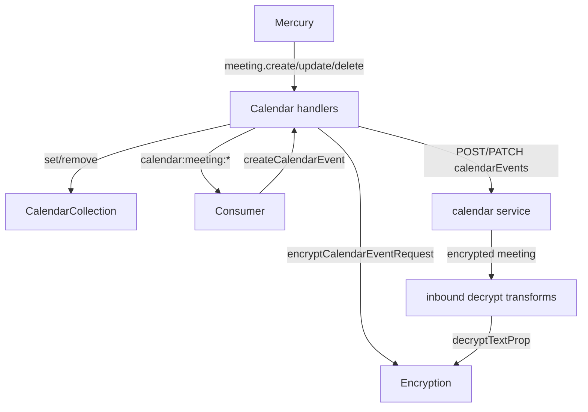
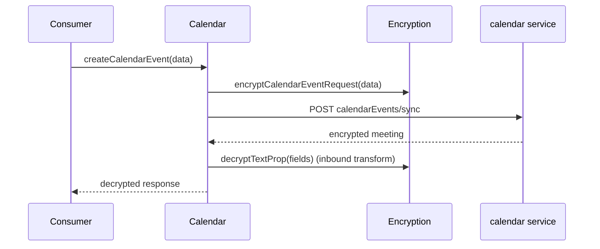
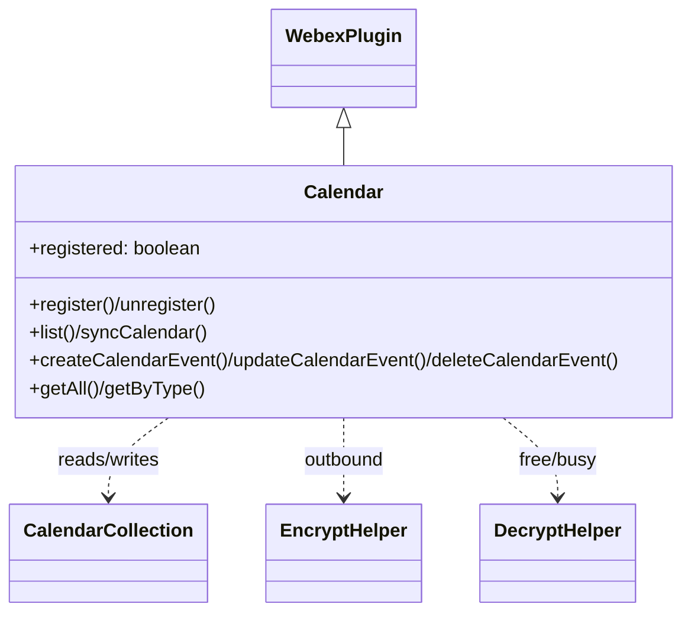

<!-- sdd-generated-metadata
generator: claude-cli
generator_model: us.anthropic.claude-opus-4-8
approved_by: pending-human-review
updated_at: 2026-08-06T00:00:00Z
validation_status: not-run
run_id: 51855eac-8de5-43a2-a3b6-dbcc55ebc91b
-->

# @webex/internal-plugin-calendar — SPEC

> Start here → root [`AGENTS.md`](../../../../AGENTS.md) (agent entry) · router [`SPEC_INDEX.md`](../../../../ai-docs/SPEC_INDEX.md) · system [`ARCHITECTURE.md`](../../../../ai-docs/ARCHITECTURE.md). This is the module's canonical spec: orientation, requirements, design, flows, protocol, and tests.
> Context-efficiency: link to canonical docs — don't duplicate them. Load specs on demand per `SPEC_INDEX.md`.

## Metadata

| Field | Value |
|---|---|
| Module id | `internal-plugin-calendar` |
| Source path(s) | `packages/@webex/internal-plugin-calendar/src/` |
| Parent spec | `—` (registered internal Webex plugin; composed by `webex-core`, no parent module) |
| Doc kind | Module spec |
| Coverage score | Pending coverage assessment |
| Generated from | `module-spec` @ SDLC template library `0.2.2` |
| generated_by / approved_by / updated_at | claude-cli / pending-human-review / 2026-08-06 |
| Validation status | not-run, validator `pending`, assessed 2026-08-06 |

Coverage score is `Pending coverage assessment` until the first coverage review runs. Manifest coverage
state (`Partial`) is authoritative and kept in `.sdd/manifest.json`.

## Evidence Rules
Every requirement cites concrete source evidence using `file path`. Test evidence is preferred for WHY.
Requirements are grounded in the current implementation under `src/` and its unit tests.

## Source Material Register

| Source material | Scope | Decision | Detail location or disposition |
|---|---|---|---|
| `N/A` | none | none | No pre-existing SDD/AI-docs, architecture, or spec documents were routed to this module; content is derived from source and tests. |

## Overview

`@webex/internal-plugin-calendar` is an internal Webex SDK plugin (registered as `calendar`) that manages
a client-side collection of encrypted calendar meetings and keeps it in sync with the `calendar` service
and real-time Mercury events. It registers a device, connects Mercury, listens for meeting
create/update/delete and free/busy events, and maintains a `CalendarCollection` of decrypted meetings that
callers can query.

The plugin (`src/calendar.js`, a `WebexPlugin`) exposes an explicit lifecycle (`register`/`unregister`),
CRUD over calendar events (`createCalendarEvent`/`updateCalendarEvent`/`deleteCalendarEvent`), listing and
sync (`list`/`syncCalendar`), and helpers for participants and notes. Encryption/decryption of meeting
fields (subject, location, notes, participants, join info, etc.) is handled by
`calendar.encrypt.helper`/`calendar.decrypt.helper` plus a set of inbound payload transformer predicates
registered in `src/index.js` that decrypt meeting properties as responses/events arrive.

A maintainer should start at `src/calendar.js` (lifecycle + API), `src/index.js` (transform wiring), and
the encrypt/decrypt helpers.

## Purpose / Responsibility

Owns the SDK's client-side calendar meeting collection: registering for and handling calendar Mercury
events, decrypting meeting content, and CRUD/sync against the `calendar` service. It does NOT own
encryption keys (delegates to `webex.internal.encryption` via decrypt/encrypt transforms), Mercury
transport, or device registration internals.

## Stack

JavaScript (`devMain: src/index.js`), Node `>=18`. Built with `webex-legacy-tools build` (`-js -ts
-maps`). Unit tests via `webex-legacy-tools test --unit --runner jest`; integration/browser via karma.
Runtime dependencies: `@webex/webex-core` (`WebexPlugin`), `@webex/internal-plugin-device` (register),
`@webex/internal-plugin-encryption` (decrypt/encrypt text props), `@webex/internal-plugin-conversation`,
`@webex/common` (`base64`), `lodash`, `uuid`.

## Folder / Package Structure

```
packages/@webex/internal-plugin-calendar/src/
├── index.js                    # registerInternalPlugin('calendar', Calendar, {...}); inbound decrypt transforms
├── calendar.js                 # Calendar WebexPlugin: lifecycle, event handlers, CRUD/list/sync
├── collection.js               # CalendarCollection: in-memory meeting store (get/set/remove/getAll)
├── config.js                   # default fromDate/toDate window and other config
├── constants.js                # event names (calendar:registered/create/update/delete, etc.)
├── calendar.encrypt.helper.js  # encrypts outbound calendar event request fields
└── calendar.decrypt.helper.js  # decrypts inbound free/busy and meeting fields
```

## Key Files (source of truth)

| File | Holds |
|---|---|
| `packages/@webex/internal-plugin-calendar/src/calendar.js` | Register/unregister lifecycle, Mercury event handlers, CRUD/list/sync methods |
| `packages/@webex/internal-plugin-calendar/src/collection.js` | The in-memory meeting collection API used by handlers and getters |
| `packages/@webex/internal-plugin-calendar/src/constants.js` | Event name constants emitted/consumed by the plugin |
| `packages/@webex/internal-plugin-calendar/src/index.js` | Internal-plugin name (`calendar`) and inbound decrypt transform predicates |

## Public Surface

Consumed as an internal SDK plugin via `webex.internal.calendar`. It emits SDK events and calls the remote
`calendar` service.

| Contract ID | Type | Surface | Purpose | Compatibility / deprecation | Schema / detail link | Root index |
|---|---|---|---|---|---|---|
| `calendar.register` | SDK | `register()` / `unregister(): Promise` | Register device, connect Mercury, (un)listen for calendar events | Stable plugin method | `packages/@webex/internal-plugin-calendar/src/calendar.js` | `../../../../ai-docs/CONTRACTS.md` |
| `calendar.syncCalendar` / `list` | SDK | `syncCalendar(options)` / `list(options): Promise` | Fetch meetings for a date window and populate the collection | Stable plugin method | `packages/@webex/internal-plugin-calendar/src/calendar.js` | `../../../../ai-docs/CONTRACTS.md` |
| `calendar.createCalendarEvent` | SDK | `createCalendarEvent(data, query): Promise` | Encrypt + POST a new calendar event | Stable plugin method | `packages/@webex/internal-plugin-calendar/src/calendar.js` | `../../../../ai-docs/CONTRACTS.md` |
| `calendar.updateCalendarEvent` / `deleteCalendarEvent` | SDK | `updateCalendarEvent(id, data, query)` / `deleteCalendarEvent(id, query): Promise` | Update/delete a calendar event (base64-encoded id) | Stable plugin method | `packages/@webex/internal-plugin-calendar/src/calendar.js` | `../../../../ai-docs/CONTRACTS.md` |
| `calendar.getAll` / `getByType` | SDK | `getAll()` / `getByType(key, value)` | Query the in-memory decrypted meeting collection | Stable plugin method | `packages/@webex/internal-plugin-calendar/src/calendar.js` | `../../../../ai-docs/CONTRACTS.md` |
| `calendar.getParticipants` / `getNotes` / `getNotesByUrl` | SDK | `getParticipants(url)` / `getNotes(id)` / `getNotesByUrl(url): Promise` | Fetch participants / notes for a meeting | Stable plugin method | `packages/@webex/internal-plugin-calendar/src/calendar.js` | `../../../../ai-docs/CONTRACTS.md` |
| `calendar.events` | event | `calendar:registered`, `calendar:unregistered`, `calendar:meeting:create`, `calendar:meeting:update`, `calendar:meeting:delete` | Lifecycle and meeting change notifications | Stable event names (observable contract) | `packages/@webex/internal-plugin-calendar/src/constants.js` | `../../../../ai-docs/CONTRACTS.md` |

Compatibility notes:
- Public method names/signatures and the emitted event names are the semver-controlled contract.

## Requires (dependencies)

- `@webex/webex-core` — `WebexPlugin` base and `registerInternalPlugin`.
- `webex.internal.device` — `register()`/`unregister()` during lifecycle.
- `webex.internal.mercury` — `connect()`/`disconnect()` and `on/off` calendar events.
- `webex.internal.encryption` — text-prop encryption/decryption used by the transforms/helpers.
- `@webex/common` (`base64`), `lodash`, `uuid` — utilities and id encoding.

## Requirements

| ID | WHAT | WHY | Source Evidence | Test / Example Evidence | Assumptions / Gaps | Confidence |
|---|---|---|---|---|---|---|
| `CALENDAR-R-001` | `register()` rejects if `webex.canAuthorize` is false, no-ops if already registered, else registers the device, connects Mercury, starts listeners, sets `registered=true`, and triggers `calendar:registered`. | Registration must be authorization-gated and idempotent. | `packages/@webex/internal-plugin-calendar/src/calendar.js` | `packages/@webex/internal-plugin-calendar/test/unit/` | none identified | PRESENT |
| `CALENDAR-R-002` | `unregister()` no-ops if not registered, else stops listeners, disconnects Mercury, unregisters the device, triggers `calendar:unregistered`, and sets `registered=false`. | Clean teardown must be idempotent and remove all listeners. | `packages/@webex/internal-plugin-calendar/src/calendar.js` | `packages/@webex/internal-plugin-calendar/test/unit/` | none identified | PRESENT |
| `CALENDAR-R-003` | Mercury `calendar.meeting.create[.minimal]`/`update[.minimal]`/`delete` events update `CalendarCollection` and trigger the matching `calendar:meeting:*` event with the collection item. | Real-time meeting changes must be reflected in the local collection and surfaced to consumers. | `packages/@webex/internal-plugin-calendar/src/calendar.js` | `packages/@webex/internal-plugin-calendar/test/unit/` | none identified | PRESENT |
| `CALENDAR-R-004` | `_handleFreeBusy` decrypts the free/busy response and resolves the matching cached RPC request (`rpcEventRequests[requestId]`), deleting the request afterward. | Free/busy is an async RPC correlated by `requestId`; responses must resolve the right pending promise. | `packages/@webex/internal-plugin-calendar/src/calendar.js` | `packages/@webex/internal-plugin-calendar/test/unit/` | none identified | PRESENT |
| `CALENDAR-R-005` | `list` GETs `calendarEvents` for the date window and, for meetings lacking `encryptedParticipants`, fetches them via `getParticipants(participantsUrl)` before resolving. | Participant data is sometimes served separately and must be backfilled for a complete meeting. | `packages/@webex/internal-plugin-calendar/src/calendar.js` | `packages/@webex/internal-plugin-calendar/test/unit/` | none identified | PRESENT |
| `CALENDAR-R-006` | `createCalendarEvent`/`updateCalendarEvent` encrypt the request via `EncryptHelper.encryptCalendarEventRequest` before POST/PATCH to `calendarEvents[.../sync]`; ids are base64-encoded. | Meeting content is encrypted and event ids are transport-encoded. | `packages/@webex/internal-plugin-calendar/src/calendar.js`, `packages/@webex/internal-plugin-calendar/src/calendar.encrypt.helper.js` | `packages/@webex/internal-plugin-calendar/test/unit/` | none identified | PRESENT |
| `CALENDAR-R-007` | Inbound payload transforms decrypt meeting fields (subject/location/notes/webexURI/URL/space*, organizer, participants, meetingJoinInfo) using `object.encryptionKeyUrl`, but skip the `schedulerData` GET responses. | Meeting content arrives encrypted and must be decrypted transparently, except for the scheduler-data path. | `packages/@webex/internal-plugin-calendar/src/index.js` | `packages/@webex/internal-plugin-calendar/test/unit/` | none identified | PRESENT |

## Design Overview

`Calendar` extends `WebexPlugin` with a `registered` flag and a `rpcEventRequests` cache for correlating
free/busy RPC responses. Lifecycle methods sequence device registration, Mercury connect, and listener
wiring. Event handlers (`_handleCreate`/`_handleUpdate`/`_handleDelete`/`_handleFreeBusy`) mutate the
shared `CalendarCollection` and emit `calendar:meeting:*` events.

Encryption is handled two ways: outbound CRUD goes through `EncryptHelper.encryptCalendarEventRequest`,
while inbound responses/events run through the payload transformer predicates in `index.js`, which decrypt
individual text properties via `decryptTextProp`. The `schedulerData` GET path is explicitly excluded so
those responses are not double-processed.

## Data Flow



## Sequence Diagram(s)

Sequence coverage:

| Operation group | Diagram | Failure / recovery coverage |
|---|---|---|
| Register/unregister lifecycle | 1. Lifecycle | `alt` covers cannot-authorize reject and already-registered/unregistered no-ops |
| Create/list meetings (encrypt/decrypt) | 2. CRUD + decrypt | `opt` covers participant backfill; encryption precedes send |
| Free/busy RPC correlation | 3. Free/busy | `alt` covers matched vs unmatched requestId |

### 1. Register / unregister lifecycle

```mermaid
sequenceDiagram
    participant C as Consumer
    participant Cal as Calendar
    participant D as Device
    participant M as Mercury
    C->>Cal: register()
    alt !canAuthorize
        Cal-->>C: reject("SDK cannot authorize")
    else already registered
        Cal-->>C: resolve()
    else
        Cal->>D: register()
        Cal->>M: connect()
        Cal->>M: on(calendar.* events)
        Cal->>Cal: registered=true; trigger calendar:registered
        Cal-->>C: resolve()
    end
```

### 2. Create + inbound decrypt



### 3. Free/busy RPC

```mermaid
sequenceDiagram
    participant M as Mercury
    participant Cal as Calendar
    M->>Cal: event:calendar.free_busy
    Cal->>Cal: decryptFreeBusyResponse
    alt requestId in rpcEventRequests
        Cal->>Cal: resolve(request); delete requestId
    else
        Cal->>Cal: log "other requests"
    end
```

## Class / Component Relationships



`Calendar` extends `WebexPlugin` and collaborates with the shared `CalendarCollection` and the
encrypt/decrypt helpers.

## Use Cases

- **UC-1 Sync meetings:** `register()` then `syncCalendar({fromDate, toDate})` populates the collection. Evidence: `packages/@webex/internal-plugin-calendar/src/calendar.js`.
- **UC-2 Create a meeting:** `createCalendarEvent(data)` encrypts and posts a new event. Evidence: `packages/@webex/internal-plugin-calendar/src/calendar.js`.
- **UC-3 React to updates:** consumer listens on `calendar:meeting:update` and reads the updated collection item. Evidence: `packages/@webex/internal-plugin-calendar/src/calendar.js`.

## Concurrency & Reactive Flow

Meeting changes are event-driven over Mercury; handlers mutate a shared in-memory collection and emit
events synchronously after update. Free/busy is an async request/response correlated by `requestId` held
in `rpcEventRequests`; the matching promise is resolved and removed on response. `list` awaits participant
backfill via `Promise.all` before resolving. Evidence:
`packages/@webex/internal-plugin-calendar/src/calendar.js`.

## Protocol / Wire Format

CRUD targets the `calendar` service (`calendarEvents`, `calendarEvents/{id}/sync`, `.../notes`) with
base64-encoded ids. Meeting payloads carry encrypted text properties keyed by `encryptionKeyUrl`; inbound
transforms decrypt `encryptedSubject`, `encryptedLocation`, `encryptedNotes`, `webexURI/URL`, `space*`,
organizer/participant emails and names, and meeting-join URIs. Real-time events arrive as
`event:calendar.meeting.*` and `event:calendar.free_busy`. Evidence:
`packages/@webex/internal-plugin-calendar/src/index.js`,
`packages/@webex/internal-plugin-calendar/src/calendar.js`.

## Data / Schema

- `CalendarCollection` is an in-memory store keyed by meeting id; `set/get/remove/getAll/getBy` operate on
  decrypted meeting objects. No persistent datastore is owned by this module.
- `config.js` provides the default `fromDate`/`toDate` sync window.

## Error Handling & Failure Modes

| Condition | Signal (error/code/result) | Caller recovery |
|---|---|---|
| SDK cannot authorize | `register()` rejects `Error('SDK cannot authorize')` | Authorize before registering |
| Register failure | `register()` rejects with the underlying error (logged) | Retry after resolving cause |
| `getByType` invalid key | throws `Error('key must be one of, spaceURI, spaceMeetURL, or conversationId')` | Use a supported key |
| Missing `encryptionKeyUrl` on inbound object | decrypt transform resolves without decrypting | Ensure meetings carry a key url |

## Pitfalls

- The inbound decrypt transforms deliberately skip `service=calendar`, `GET`, `resource=schedulerData`
  responses — adding new scheduler paths may need the same exclusion.
- Free/busy responses that don't match a cached `requestId` are logged and dropped; ensure the request was
  registered in `rpcEventRequests` first.
- `list` only backfills participants when `encryptedParticipants` is absent; partial server data can lead
  to extra participant fetches.

## Module Do's / Don'ts

- DO call `register()` before expecting `calendar:meeting:*` events.
- DO encrypt outbound events through `EncryptHelper` rather than sending plaintext fields.
- DON'T mutate `CalendarCollection` outside the event handlers/sync methods.

## Test-Case Strategy (module)

Unit tests (Jest) mock `device`, `mercury`, and `encryption`, asserting: authorization-gated/idempotent
register/unregister; event-handler collection updates and emitted events; free/busy RPC correlation;
`list` participant backfill; encrypt-before-send for create/update; and inbound field decryption
including the `schedulerData` exclusion.

| Behavior / Requirement | Existing test evidence | Gap |
|---|---|---|
| `CALENDAR-R-001` | `packages/@webex/internal-plugin-calendar/test/unit/` | Re-check both no-op/reject branches |
| `CALENDAR-R-002` | `packages/@webex/internal-plugin-calendar/test/unit/` | Re-check not-registered no-op |
| `CALENDAR-R-003` | `packages/@webex/internal-plugin-calendar/test/unit/` | Re-check minimal-variant events |
| `CALENDAR-R-004` | `packages/@webex/internal-plugin-calendar/test/unit/` | Re-check unmatched requestId path |
| `CALENDAR-R-005` | `packages/@webex/internal-plugin-calendar/test/unit/` | Re-check participant backfill |
| `CALENDAR-R-006` | `packages/@webex/internal-plugin-calendar/test/unit/` | Re-check base64 id + encrypt precedence |
| `CALENDAR-R-007` | `packages/@webex/internal-plugin-calendar/test/unit/` | Re-check schedulerData exclusion |

## Traceability

- Repo architecture: [`ARCHITECTURE.md`](../../../../ai-docs/ARCHITECTURE.md) · Registry: [`SPEC_INDEX.md`](../../../../ai-docs/SPEC_INDEX.md)
- Coverage state & contracts baseline: `.sdd/manifest.json`
