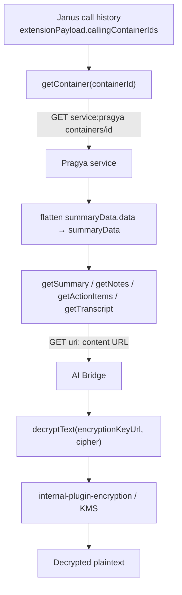
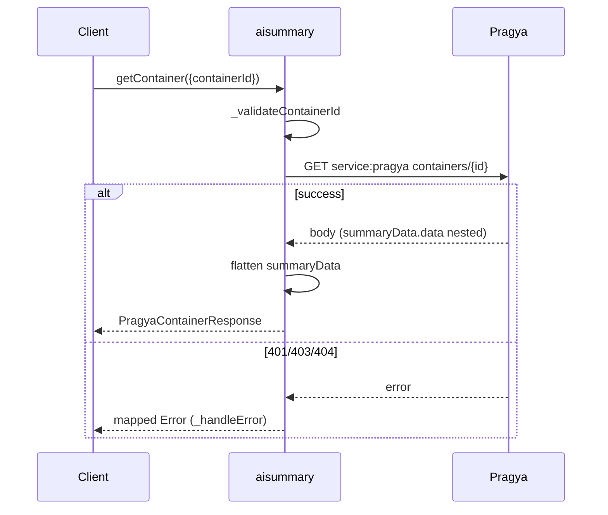
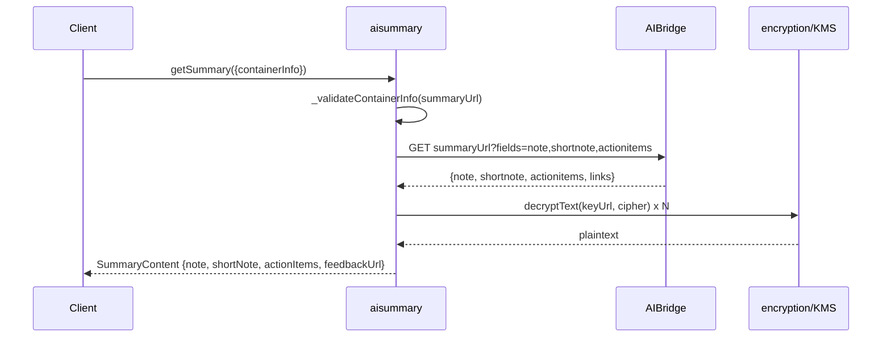
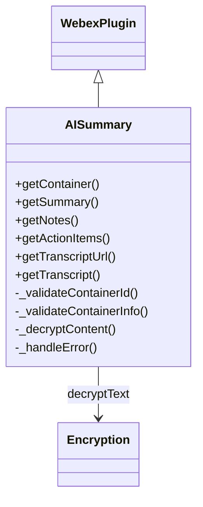

# @webex/internal-plugin-call-ai-summary — SPEC

> Start here → root [`AGENTS.md`](../../../../AGENTS.md) (agent entry) · router [`SPEC_INDEX.md`](../../../../ai-docs/SPEC_INDEX.md) · system [`ARCHITECTURE.md`](../../../../ai-docs/ARCHITECTURE.md). This is the module's canonical spec.
> Context-efficiency: link to canonical docs — don't duplicate them. Load specs on demand per `SPEC_INDEX.md`.

## Metadata
| Field | Value |
|---|---|
| Module id | `packages/@webex/internal-plugin-call-ai-summary` |
| Source path(s) | `packages/@webex/internal-plugin-call-ai-summary/src/` |
| Parent spec | — |
| Doc kind | Module spec |
| Coverage score | Pending coverage assessment |
| Generated from | `module-spec` @ SDLC template library `0.2.2` |
| generated_by / approved_by / updated_at | claude-cli / pending / 2026-08-05T00:00:00Z |
| Validation status | not-run |

## Evidence Rules
Requirements cite `file path` evidence. This spec was migrated from the plugin's `ai-docs/AGENTS.md` (usage/API reference) and `ai-docs/ARCHITECTURE.md` (design), both grounded in `src/ai-summary.ts`. Where the routed docs quote code directly, confidence is PRESENT; where behavior is described but not confirmed against current source in this pass, it is WEAK.

## Source Material Register
| Source material | Scope | Decision | Detail location or disposition |
|---|---|---|---|
| Reviewed prior plugin usage/API reference | overview / API | used | Method surface → Public Surface & Requirements; DTOs → Data Model; errors → Error Handling; original retained. |
| Reviewed prior plugin architecture design | architecture / API / tests | used | Discovery flow → Data Flow & Sequence; decryption → Protocol/Security; test examples → Test-Case Strategy; original retained. |

## Overview
The `internal-plugin-call-ai-summary` plugin retrieves AI-generated call summaries, notes, action items, and transcripts for completed Webex calls. It resolves a **Pragya** container (metadata + content URLs + KMS key) by id, then fetches JWE-encrypted content from AI Bridge URLs and decrypts it via `@webex/internal-plugin-encryption`. It registers as `aisummary` on the internal namespace (`webex.internal.aisummary.*`). It is deliberately **self-contained**: it owns its types/constants/logic and makes zero changes to other packages, accepting a plain `containerId` string as input.

## Purpose / Responsibility
Owns retrieval and decryption of AI-generated call artifacts (summary/notes/action items/transcript) given a Pragya container id. It does NOT start/stop AI assistants, generate summaries, own recording storage, or provide UI.

## Stack
TypeScript; `WebexPlugin` (from `@webex/webex-core`) via `registerInternalPlugin`. Depends on `@webex/internal-plugin-encryption` for KMS decryption. Tested with Jest/Mocha-style specs using `@webex/test-helper-mock-webex`, `sinon`, and `@webex/test-helper-chai`.

## Folder / Package Structure
```
packages/@webex/internal-plugin-call-ai-summary/
├── src/
│   ├── index.ts          # registerInternalPlugin('aisummary', ...)
│   ├── ai-summary.ts      # WebexPlugin.extend({...}) — all public/private methods
│   ├── types.ts           # request/response DTO interfaces
│   ├── constants.ts       # service name, resource path, error messages
│   └── config.ts          # plugin config ({ aisummary: {} })
└── test/unit/spec/ai-summary.ts   # unit tests; data/responses.ts fixtures
```

## Key Files (source of truth)
| File | Holds |
|---|---|
| `src/ai-summary.ts` | Plugin class; all public methods + private helpers (`_validate*`, `_decryptContent`, `_handleError`) |
| `src/constants.ts` | `AI_SUMMARY_SERVICE = 'pragya'`, `AI_SUMMARY_CONTAINERS_RESOURCE = 'containers'`, `ERROR_MESSAGES` |
| `src/types.ts` | `GetContainerOptions`, `GetSummaryContentOptions`, `PragyaContainerResponse`, `SummaryContent`, `SummaryNotes`, `SummaryActionItems`, `TranscriptContent`, snippet types |
| `src/index.ts` | Registration entry point |

## Public Surface
| Contract ID | Type | Surface | Purpose | Compatibility / deprecation | Schema / detail link | Root index |
|---|---|---|---|---|---|---|
| `aisummary.getContainer` | SDK | `getContainer({containerId}) -> Promise<PragyaContainerResponse>` | Resolve a Pragya container; flattens `summaryData.data` | internal plugin — no strict semver | `src/types.ts` | [`CONTRACTS.md`](../../../../ai-docs/CONTRACTS.md) |
| `aisummary.getSummary` | SDK | `getSummary({containerInfo}) -> Promise<SummaryContent>` | Fetch+decrypt note, shortNote, actionItems in one call | internal | `src/types.ts` | [`CONTRACTS.md`](../../../../ai-docs/CONTRACTS.md) |
| `aisummary.getNotes` | SDK | `getNotes({containerInfo}) -> Promise<SummaryNotes>` | Fetch+decrypt notes (requires `notesUrl`) | internal; prefer `getSummary` | `src/types.ts` | [`CONTRACTS.md`](../../../../ai-docs/CONTRACTS.md) |
| `aisummary.getActionItems` | SDK | `getActionItems({containerInfo}) -> Promise<SummaryActionItems>` | Fetch+decrypt action items (requires `actionItemsUrl`) | internal; prefer `getSummary` | `src/types.ts` | [`CONTRACTS.md`](../../../../ai-docs/CONTRACTS.md) |
| `aisummary.getTranscriptUrl` | SDK | `getTranscriptUrl({containerInfo}) -> string` | Return transcript URL (no fetch/decrypt) | internal | `src/types.ts` | [`CONTRACTS.md`](../../../../ai-docs/CONTRACTS.md) |
| `aisummary.getTranscript` | SDK | `getTranscript({containerInfo}) -> Promise<TranscriptContent>` | Fetch+decrypt transcript snippets | internal | `src/types.ts` | [`CONTRACTS.md`](../../../../ai-docs/CONTRACTS.md) |

Compatibility notes:
- Internal Cisco plugin; it does not strictly adhere to semantic versioning. `notesUrl`/`actionItemsUrl` may be absent in some API versions — prefer `getSummary()`.

## Requires (dependencies)
- `@webex/webex-core` — `WebexPlugin`, `registerInternalPlugin`, `webex.request`.
- `@webex/internal-plugin-encryption` — `webex.internal.encryption.decryptText(keyUrl, cipher)`.
- **Pragya service** — U2C `serviceName: "pragya"`; `GET containers/{id}`.
- **AI Bridge summary endpoints** — direct URLs from the Pragya response.
- Registered device + Mercury connection (for KMS key exchange, handled by the encryption plugin).

## Requirements
| ID | WHAT | WHY | Source Evidence | Test / Example Evidence | Assumptions / Gaps | Confidence |
|---|---|---|---|---|---|---|
| `AISUMMARY-R-001` | `getContainer` issues `GET service:pragya resource:containers/{id}` and flattens `body.summaryData.data` into `body.summaryData` | Pragya nests URLs under `summaryData.data`; consumers need flat access | `src/ai-summary.ts` (getContainer) | `test/unit/spec/ai-summary.ts` (#getContainer resolves) | none | PRESENT |
| `AISUMMARY-R-002` | `getContainer` throws synchronously for empty/missing `containerId` | Fail fast on invalid input | `src/ai-summary.ts` (`_validateContainerId`) | test: "should throw for empty containerId" | none | PRESENT |
| `AISUMMARY-R-003` | `getSummary` fetches `summaryUrl?fields=note,shortnote,actionitems`, decrypts note/shortNote and each action-item snippet, and extracts a `feedback` link | Single-call retrieval of all summary content | `src/ai-summary.ts` (getSummary) | fixtures in test data | keyUrl falls back to `containerInfo.encryptionKeyUrl` | PRESENT |
| `AISUMMARY-R-004` | `getNotes`/`getActionItems` require `notesUrl`/`actionItemsUrl` + `encryptionKeyUrl` and decrypt via KMS; action-items response may be an array (takes first element) | Standalone endpoints for individual content types | `src/ai-summary.ts` | test: getNotes decrypt, getActionItems snippets | missing URL → validation error | PRESENT |
| `AISUMMARY-R-005` | `getTranscriptUrl` returns `summaryData.transcriptUrl` without fetching; `getTranscript` fetches+decrypts snippets | Consumers may want the URL or the decrypted content | `src/ai-summary.ts` | test: getTranscriptUrl returns URL | none | PRESENT |
| `AISUMMARY-R-006` | HTTP errors map to descriptive messages (401/403/404/other) via `_handleError`, with 404 distinguished for getContainer vs content | Consistent caller-facing error semantics | `src/ai-summary.ts` (`_handleError`), `src/constants.ts` | None found for every branch | confirm per-branch tests | WEAK |

## Design Overview
Summary content is discovered in two steps: Janus call history provides container ids (`extensionPayload.callingContainerIds`), and Pragya resolves each id into region-correct AI Bridge URLs plus a KMS `encryptionKeyUrl`. The plugin fetches encrypted content from those URLs using `uri:` (not `service:`+`resource:`) because Pragya returns fully-qualified URLs, and decrypts each field via `internal-plugin-encryption`. Key design decisions: a self-contained plugin with zero changes to existing packages; Pragya as the source of truth for both URLs and the key; no separate service discovery for content endpoints.

## Data Flow


## Sequence Diagram(s)
Sequence coverage:

| Operation group | Diagram | Failure / recovery coverage |
|---|---|---|
| Container resolution | getContainer sequence | 401/403/404 → mapped error |
| Content fetch + decrypt | getSummary sequence | request/decrypt error → `_handleError` |





## Class / Component Relationships

`AISummary` extends `WebexPlugin`; it composes with the encryption plugin at runtime via `this.webex.internal.encryption.decryptText`.

## Use Cases
- **UC-1 Retrieve summary:** Client obtains `containerId` from Janus history → `getContainer` → `getSummary` → decrypted note/shortNote/actionItems. Evidence: `src/ai-summary.ts`, `ai-docs/ARCHITECTURE.md` §3.1.
- **UC-2 Get transcript:** `getTranscriptUrl` for the URL, or `getTranscript` for decrypted snippets. Evidence: `src/ai-summary.ts`.

Cross-service flow: each use case crosses the plugin → Pragya/AI Bridge → KMS boundary over HTTPS.

## Data Model
<!-- captured as DTO inventory (not requirements) -->
- `PragyaContainerResponse` { `summaryData: PragyaSummaryData`, `encryptionKeyUrl`, `kmsResourceObjectUrl`, `aclUrl`, `forkSessionId`, `callSessionId`, `ownerUserId`, `orgId`, `start`, `end` }.
- `PragyaSummaryData` { `status`, `summaryUrl`, `transcriptUrl`, `summarizeAfterCall`, `notesUrl?`, `actionItemsUrl?` }.
- `SummaryContent` { `id`, `note`, `shortNote`, `actionItems: ActionItemSnippet[]`, `feedbackUrl?` }.
- `SummaryNotes` { `id`, `content`, `feedbackUrl?` }; `SummaryActionItems` { `id?`, `snippets`, `feedbackUrl?` }.
- `ActionItemSnippet` { `id`, `editedContent?`, `aiGeneratedContent` }; `TranscriptSnippet` { `startTime`, `endTime`, `content`, `audioCSI?`, `speaker?` }; `TranscriptContent` { `id`, `totalCount`, `snippets` }.

## Protocol / Wire Format
<!-- module.exposes_wire_protocol = true -->
- Pragya container: `GET /pragya/api/v1/containers/{containerId}` with bearer auth; raw response nests URLs under `summaryData.data` (flattened by the plugin).
- Summary content: `GET {summaryUrl}?fields=note,shortnote,actionitems`; fields carry `aiGeneratedContent` (JWE). Standalone notes/action-items via `notesUrl`/`actionItemsUrl`. Decryption via KMS `decryptText(encryptionKeyUrl, cipher)`; `body.keyUrl` takes precedence over `containerInfo.encryptionKeyUrl` when present.

## Error Handling & Failure Modes
<!-- module.returns_caller_errors = true -->
| Condition | Signal (error/code/result) | Caller recovery |
|---|---|---|
| Empty/invalid `containerId` | throws "containerId is required and must be a non-empty string" | Validate input |
| Missing `containerInfo`/URL/key | throws "containerInfo with valid summaryData and encryptionKeyUrl is required" | Call `getContainer` first |
| 401 | "Authentication failed: Invalid or expired token" | Re-authenticate |
| 403 | "Access denied: User not authorized to view this summary" | Check permissions |
| 404 (getContainer) | "Container not found" | Verify containerId from Janus |
| 404 (content) | "Summary content not available or expired" | Content deleted/expired |
| Summary not ready | `summaryData.status !== 'Active'` | Retry after delay |

## Pitfalls
- Pragya nests URLs under `summaryData.data`; only `getContainer` flattens — never assume raw responses are flat.
- `notesUrl`/`actionItemsUrl` may be absent in some API versions; prefer `getSummary()`.
- Action-items endpoint may return an array; take the first element.
- Decryption requires a registered device + Mercury connection (handled by the encryption plugin, but a precondition).

## Module Do's / Don'ts
<!-- module.module_specific_conventions = true -->
- DO keep the plugin self-contained; accept a plain `containerId` and do not modify `UserSession` or other packages.
- DO use `uri:` for Pragya-returned content URLs (already region-correct), not `service:`+`resource:`.
- DON'T log decrypted content or tokens.

## Host Integration & Theming
<!-- module.embedded_in_host = true -->
Registers as an internal plugin via `registerInternalPlugin('aisummary', AISummary, {config})` and is reached as `webex.internal.aisummary.*`. Consumers import the package to self-register; no host UI or theming is provided.

## Export Stability
<!-- module.published_package = true -->
Published as an internal Cisco plugin without strict semver. The public method surface (`getContainer`, `getSummary`, `getNotes`, `getActionItems`, `getTranscriptUrl`, `getTranscript`) and DTOs are the consumer contract; treat changes cautiously despite the relaxed versioning.

## Key Design Trade-off
<!-- module.has_design_tradeoff = true -->
- Self-contained design (accept a `containerId` string, zero changes to `@webex/calling`'s `UserSession`) is favored over tight type integration: it decouples release timing and keeps the plugin isolated, at the cost of consumers extracting the id themselves.

## Test-Case Strategy (module)
Unit tests mock `webex.request` and `webex.internal.encryption.decryptText`, asserting the request shape (service/resource/uri) and decrypted results, plus negative cases for missing `containerId`/URLs. Coverage should extend to every `_handleError` status branch and the array-vs-object action-items handling.

| Behavior / Requirement | Existing test evidence | Gap |
|---|---|---|
| `AISUMMARY-R-001` | `test/unit/spec/ai-summary.ts` (#getContainer) | none |
| `AISUMMARY-R-002` | test: empty containerId | none |
| `AISUMMARY-R-004` | test: getNotes/getActionItems | confirm missing-actionItemsUrl negative |
| `AISUMMARY-R-006` | None found (all branches) | add 401/403/404/other error-mapping tests |

## Traceability
- Repo architecture: [`../../../../ai-docs/ARCHITECTURE.md`](../../../../ai-docs/ARCHITECTURE.md) · Registry: [`../../../../ai-docs/SPEC_INDEX.md`](../../../../ai-docs/SPEC_INDEX.md)
- Coverage state & contracts baseline: `.sdd/manifest.json`
