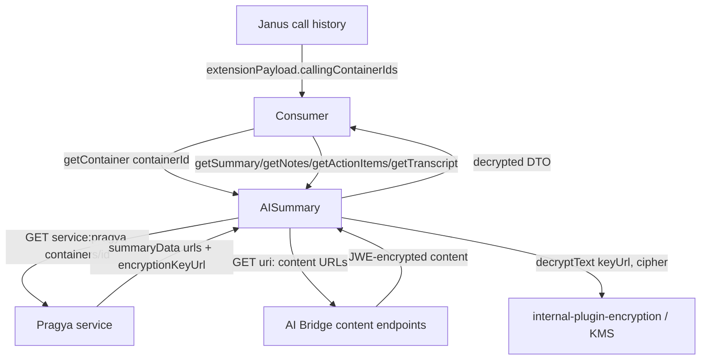
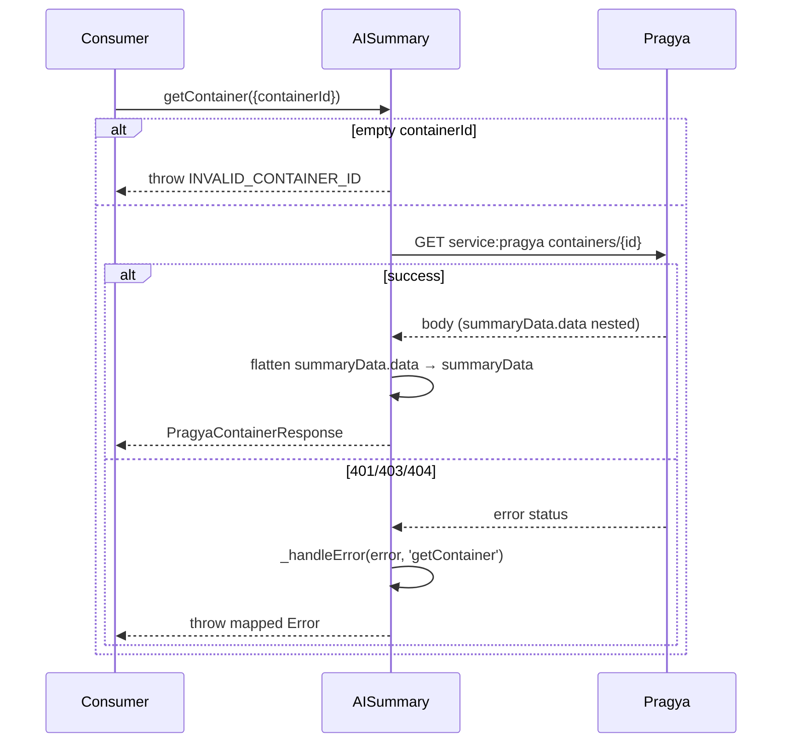
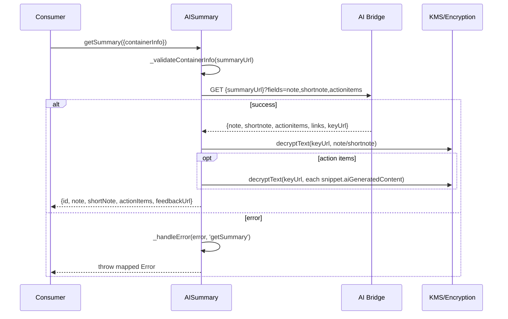
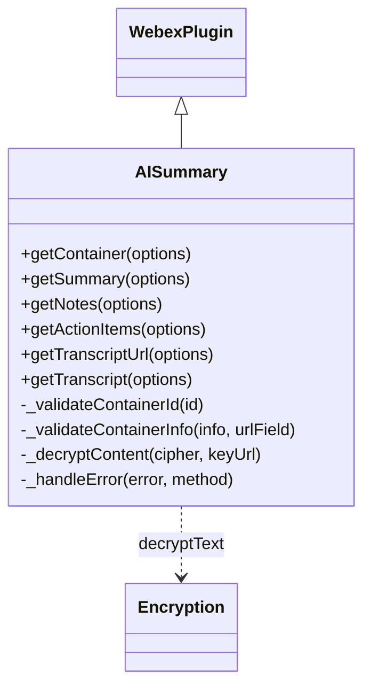

<!-- sdd-generated-metadata
generator: claude-cli
generator_model: us.anthropic.claude-opus-4-8
approved_by: pending-human-review
updated_at: 2026-08-06T00:00:00Z
validation_status: not-run
run_id: 51855eac-8de5-43a2-a3b6-dbcc55ebc91b
-->

# @webex/internal-plugin-call-ai-summary — SPEC

> Start here → root [`AGENTS.md`](../../../../AGENTS.md) (agent entry) · router [`SPEC_INDEX.md`](../../../../ai-docs/SPEC_INDEX.md) · system [`ARCHITECTURE.md`](../../../../ai-docs/ARCHITECTURE.md). This is the module's canonical spec: orientation, requirements, design, flows, protocol, and tests.
> Context-efficiency: link to canonical docs — don't duplicate them. Load specs on demand per `SPEC_INDEX.md`.

## Metadata

| Field | Value |
|---|---|
| Module id | `internal-plugin-call-ai-summary` |
| Source path(s) | `packages/@webex/internal-plugin-call-ai-summary/src/` |
| Parent spec | `—` (registered internal Webex plugin; composed by `webex-core`, no parent module) |
| Doc kind | Module spec |
| Coverage score | Pending coverage assessment |
| Generated from | `module-spec` @ SDLC template library `0.2.2` |
| generated_by / approved_by / updated_at | claude-cli / pending-human-review / 2026-08-06 |
| Validation status | not-run, validator `pending`, assessed 2026-08-06 |

Coverage score is `Pending coverage assessment` until the first coverage review runs. Manifest coverage
state (`Partial`) is authoritative and kept in `.sdd/manifest.json`.

## Evidence Rules
Every requirement cites concrete source evidence using `file path`. Test evidence is preferred for WHY.
Requirements are grounded in the current implementation under `src/`, its unit tests, and the migrated
module architecture docs.

## Source Material Register

| Source material | Scope | Decision | Detail location or disposition |
|---|---|---|---|
| Prior module AI-docs (agent guide) | overview / API | verified | Overview, public surface, encryption/decryption, and error-handling detail migrated into Overview, Public Surface, Error Handling, and Protocol sections. |
| Prior module architecture doc | architecture / API | verified | Summary-discovery (Janus→Pragya) flow, DTOs, request/response details, and testing strategy migrated into Design Overview, Data Flow, Sequence Diagrams, Protocol, and Test-Case Strategy. |

## Overview

`@webex/internal-plugin-call-ai-summary` is an internal Webex SDK plugin (registered as `aisummary`) for
retrieving AI-generated call summaries, notes, action items, and transcript URLs from the **Pragya**
(AI container service) and **AI Bridge** (summary content) services. All AI-generated content is
JWE-encrypted and decrypted via KMS using `@webex/internal-plugin-encryption`.

AI summary content is discovered through a two-step lookup: Janus (call history) provides container IDs
via `extensionPayload.callingContainerIds`, and Pragya resolves those IDs into direct, region-correct URLs
for summary content plus the encryption key. The plugin is deliberately **self-contained** — it accepts a
plain `containerId` string and makes zero changes to `UserSession`, `CallHistory`, `internal-plugin-encryption`,
or the `webex` bundle.

The plugin (`src/ai-summary.ts`, a `WebexPlugin`) provides methods to resolve a container
(`getContainer`), fetch and decrypt all summary content in one call (`getSummary`), fetch notes/action
items via dedicated endpoints (`getNotes`/`getActionItems`), return the transcript URL
(`getTranscriptUrl`), and fetch+decrypt the full transcript (`getTranscript`). `getContainer` normalizes
the Pragya response by flattening `summaryData.data` into `summaryData` so consumers can access
`summaryData.summaryUrl` directly. A maintainer should start at `src/ai-summary.ts` and `src/constants.ts`.

## Purpose / Responsibility

Owns retrieval and KMS-decryption of AI-generated call summary artifacts (summary/note/short note/action
items/transcript) from Pragya + AI Bridge. It does NOT own encryption keys (delegates to
`webex.internal.encryption`), summary generation (backend-managed), call history/Janus, or any modification
of existing packages.

## Stack

TypeScript (`src/ai-summary.ts`), built with `webex-legacy-tools`. Unit tests run under Jest with
`@webex/test-helper-chai`, `@webex/test-helper-mock-webex`, and `sinon`. Runtime dependencies:
`@webex/webex-core` (base plugin class, request handling, auth interceptor) and
`@webex/internal-plugin-encryption` (KMS decryption via `decryptText`).

## Folder / Package Structure

```
packages/@webex/internal-plugin-call-ai-summary/src/
├── index.ts                    # registerInternalPlugin('aisummary', AISummary, {config})
├── ai-summary.ts               # AISummary WebexPlugin: public methods, decryption, error mapping
├── types.ts                    # Request/response DTO interfaces
├── constants.ts                # Service name, resource path, error messages
├── config.ts                   # Plugin configuration (currently empty: { aisummary: {} })
├── manual-pragya-api-test.js   # Manual script validating Pragya container response structure
└── manual-integration-test.js  # Manual end-to-end flow script (device reg → container → summary)
```

## Key Files (source of truth)

| File | Holds |
|---|---|
| `packages/@webex/internal-plugin-call-ai-summary/src/ai-summary.ts` | All public methods, `_decryptContent`, `_handleError` status mapping, response normalization |
| `packages/@webex/internal-plugin-call-ai-summary/src/constants.ts` | `AI_SUMMARY_SERVICE` (`pragya`), `AI_SUMMARY_CONTAINERS_RESOURCE` (`containers`), `SUMMARY_STATUSES`, `ERROR_MESSAGES` |
| `packages/@webex/internal-plugin-call-ai-summary/src/types.ts` | Request/response DTOs (`PragyaContainerResponse`, `SummaryContent`, etc.) |
| `packages/@webex/internal-plugin-call-ai-summary/src/index.ts` | Internal-plugin registration name (`aisummary`) |

## Public Surface

Consumed as an internal SDK plugin via `webex.internal.aisummary`. It calls the remote Pragya service and
direct AI Bridge content URLs.

| Contract ID | Type | Surface | Purpose | Compatibility / deprecation | Schema / detail link | Root index |
|---|---|---|---|---|---|---|
| `aisummary.getContainer` | SDK | `getContainer({containerId}): Promise<PragyaContainerResponse>` | Resolve a Pragya container by ID; normalize `summaryData.data`→`summaryData` | Stable plugin method | `packages/@webex/internal-plugin-call-ai-summary/src/ai-summary.ts` | `../../../../ai-docs/CONTRACTS.md` |
| `aisummary.getSummary` | SDK | `getSummary({containerInfo}): Promise<SummaryContent>` | Fetch+decrypt note, short note, and action items in one call | Stable plugin method (primary content method) | `packages/@webex/internal-plugin-call-ai-summary/src/ai-summary.ts` | `../../../../ai-docs/CONTRACTS.md` |
| `aisummary.getNotes` | SDK | `getNotes({containerInfo}): Promise<SummaryNotes>` | Fetch+decrypt notes via dedicated `notesUrl` | Stable; `notesUrl` may be absent in some API versions (prefer `getSummary`) | `packages/@webex/internal-plugin-call-ai-summary/src/ai-summary.ts` | `../../../../ai-docs/CONTRACTS.md` |
| `aisummary.getActionItems` | SDK | `getActionItems({containerInfo}): Promise<SummaryActionItems>` | Fetch+decrypt action items via dedicated `actionItemsUrl` | Stable; `actionItemsUrl` may be absent in some API versions (prefer `getSummary`) | `packages/@webex/internal-plugin-call-ai-summary/src/ai-summary.ts` | `../../../../ai-docs/CONTRACTS.md` |
| `aisummary.getTranscriptUrl` | SDK | `getTranscriptUrl({containerInfo}): string` | Return the transcript URL (no fetch/decrypt) | Stable plugin method | `packages/@webex/internal-plugin-call-ai-summary/src/ai-summary.ts` | `../../../../ai-docs/CONTRACTS.md` |
| `aisummary.getTranscript` | SDK | `getTranscript({containerInfo}): Promise<TranscriptContent>` | Fetch+decrypt full transcript snippets | Stable plugin method | `packages/@webex/internal-plugin-call-ai-summary/src/ai-summary.ts` | `../../../../ai-docs/CONTRACTS.md` |

Compatibility notes:
- Public method names/signatures and the DTO shapes (`PragyaContainerResponse`, `SummaryContent`,
  `SummaryNotes`, `SummaryActionItems`, `TranscriptContent`, `ActionItemSnippet`) are the semver-controlled
  contract.
- The plugin normalizes Pragya's nested `summaryData.data` so consumers rely on a flat `summaryData`.

## Requires (dependencies)

- `@webex/webex-core` — base `WebexPlugin`, `registerInternalPlugin`, `webex.request`, and the auth
  interceptor that attaches the bearer token for catalog/allowed-domain URLs.
- `@webex/internal-plugin-encryption` — KMS `decryptText(encryptionKeyUrl, ciphertext)` for all
  AI-generated content.
- External services: **Pragya** (U2C `serviceName: "pragya"`; container metadata + content URLs + key),
  AI Bridge **summary content endpoints** (direct URLs from Pragya), **KMS** (via `encryptionKeyUrl`), and
  **Janus** (upstream source of container IDs, not called by this plugin).

## Requirements

| ID | WHAT | WHY | Source Evidence | Test / Example Evidence | Assumptions / Gaps | Confidence |
|---|---|---|---|---|---|---|
| `CALL-AI-SUMMARY-R-001` | `getContainer` validates a non-empty `containerId`, GETs `service: pragya`, `resource: containers/{id}`, and flattens `body.summaryData.data` into `body.summaryData` before returning. | Consumers must access summary URLs directly on `summaryData`; empty ids must fail fast. | `packages/@webex/internal-plugin-call-ai-summary/src/ai-summary.ts` | `packages/@webex/internal-plugin-call-ai-summary/test/unit/` | none identified | PRESENT |
| `CALL-AI-SUMMARY-R-002` | `getSummary` GETs `{summaryUrl}?fields=note,shortnote,actionitems`, decrypts `note`, `shortnote`, and each action-item snippet via KMS, and returns `{id, note, shortNote, actionItems, feedbackUrl}` (feedbackUrl from `links[rel=feedback]`). | Single-call retrieval of all summary content is the primary consumer path. | `packages/@webex/internal-plugin-call-ai-summary/src/ai-summary.ts` | `packages/@webex/internal-plugin-call-ai-summary/test/unit/` | Uses `body.keyUrl` with fallback to `containerInfo.encryptionKeyUrl` | PRESENT |
| `CALL-AI-SUMMARY-R-003` | `getNotes` requires `summaryData.notesUrl` + `encryptionKeyUrl`, GETs `notesUrl`, decrypts `aiGeneratedContent` (key = `body.keyUrl` or container key), and returns `{id, content, feedbackUrl}`. | Standalone notes retrieval where a dedicated endpoint exists. | `packages/@webex/internal-plugin-call-ai-summary/src/ai-summary.ts` | `packages/@webex/internal-plugin-call-ai-summary/test/unit/` | `notesUrl` may be absent in some API versions | PRESENT |
| `CALL-AI-SUMMARY-R-004` | `getActionItems` requires `summaryData.actionItemsUrl`, GETs it, takes the first element when the body is an array, decrypts all snippets, and returns `{id, snippets, feedbackUrl}` (empty snippets when no data). | Standalone action-item retrieval must handle the array-wrapped response and empty case. | `packages/@webex/internal-plugin-call-ai-summary/src/ai-summary.ts` | `packages/@webex/internal-plugin-call-ai-summary/test/unit/` | none identified | PRESENT |
| `CALL-AI-SUMMARY-R-005` | `getTranscriptUrl` validates `summaryData.transcriptUrl` and returns it without fetching/decrypting; `getTranscript` fetches and decrypts each snippet (`transcriptSnippetList`) returning `{id, totalCount, snippets}`. | Callers may want just the URL, or the full decrypted transcript. | `packages/@webex/internal-plugin-call-ai-summary/src/ai-summary.ts` | `packages/@webex/internal-plugin-call-ai-summary/test/unit/` | none identified | PRESENT |
| `CALL-AI-SUMMARY-R-006` | Validation throws synchronously: missing/empty `containerId` → `INVALID_CONTAINER_ID`; missing `containerInfo`/`summaryData` url/`encryptionKeyUrl` → `INVALID_CONTAINER_INFO`. | Fail-fast input validation before any network call. | `packages/@webex/internal-plugin-call-ai-summary/src/ai-summary.ts`, `packages/@webex/internal-plugin-call-ai-summary/src/constants.ts` | `packages/@webex/internal-plugin-call-ai-summary/test/unit/` | none identified | PRESENT |
| `CALL-AI-SUMMARY-R-007` | `_handleError` maps HTTP status to messages: 404 → `CONTAINER_NOT_FOUND` (getContainer) or `CONTENT_NOT_FOUND` (others), 403 → `ACCESS_DENIED`, 401 → `AUTHENTICATION_FAILED`, else `{method} failed: {message}`. | Consumers need descriptive, stable error messages per failure class. | `packages/@webex/internal-plugin-call-ai-summary/src/ai-summary.ts`, `packages/@webex/internal-plugin-call-ai-summary/src/constants.ts` | `packages/@webex/internal-plugin-call-ai-summary/test/unit/` | none identified | PRESENT |

## Design Overview

`AISummary` extends `WebexPlugin` (`namespace: 'AISummary'`) and is a thin, self-contained retrieval layer.
Two service boundaries are involved: Pragya provides container metadata (content URLs + `encryptionKeyUrl`)
via `service:`/`resource:` catalog resolution, while AI Bridge content lives at fully-qualified regional
URLs fetched directly with `uri:`. Pragya is the source of truth for both the content URLs and the key.

`getContainer` normalizes the Pragya response (flatten `summaryData.data`). Content methods share a pattern:
validate → fetch → decrypt each encrypted field via `_decryptContent` (a wrapper over
`webex.internal.encryption.decryptText`) → shape the DTO. Each method uses `body.keyUrl` when present,
falling back to `containerInfo.encryptionKeyUrl`. All methods route failures through `_handleError` for
consistent, status-mapped messages. Private validators `_validateContainerId`/`_validateContainerInfo`
enforce inputs synchronously.

Key design decisions (migrated from the module architecture doc): a self-contained plugin with zero changes
to existing packages; no separate service discovery for summary endpoints (Pragya returns region-correct
URLs); Pragya as the single source of truth; and Pragya discoverable via U2C as `serviceName: "pragya"`.

## Data Flow



## Sequence Diagram(s)

Sequence coverage:

| Operation group | Diagram | Failure / recovery coverage |
|---|---|---|
| Resolve container | 1. getContainer | `alt` covers empty id (throws) and 401/403/404 mapping via `_handleError` |
| Fetch + decrypt summary content | 2. getSummary | `alt` covers decrypt/HTTP error → `_handleError`; `opt` covers action-item snippets |

### 1. Resolve container



### 2. Fetch + decrypt summary



## Class / Component Relationships



`AISummary` extends `WebexPlugin` and delegates all decryption to `webex.internal.encryption`.

## Use Cases

- **UC-1 Retrieve a call summary:** find a session with `callingContainerIds`, `getContainer({containerId})`, check `summaryData.status === 'Active'`, then `getSummary({containerInfo})`. Evidence: `packages/@webex/internal-plugin-call-ai-summary/src/ai-summary.ts`.
- **UC-2 Get a transcript:** `getTranscriptUrl({containerInfo})` for the URL, or `getTranscript({containerInfo})` for decrypted snippets. Evidence: `packages/@webex/internal-plugin-call-ai-summary/src/ai-summary.ts`.
- **UC-3 Standalone notes/action items:** `getNotes`/`getActionItems` when the dedicated URLs are present. Evidence: `packages/@webex/internal-plugin-call-ai-summary/src/ai-summary.ts`.

## Concurrency & Reactive Flow

All operations are request/response Promises with no shared mutable state. Action-item and transcript
snippet decryption run concurrently via `Promise.all` over the snippet arrays; each method awaits its
decryptions before shaping the result. Requests require a registered device, a Mercury connection (for KMS
key fetch), ECDHE key exchange, and KMS key retrieval — all handled automatically by the SDK when
`decryptText` is called. Evidence: `packages/@webex/internal-plugin-call-ai-summary/src/ai-summary.ts`.

## Protocol / Wire Format

- **Pragya container:** `GET /pragya/api/v1/containers/{containerId}` (via `service: pragya`). Raw response
  nests URLs under `summaryData.data`; `getContainer` flattens it. Key fields: `summaryData`
  (`status`, `summaryUrl`, `transcriptUrl`, `summarizeAfterCall`, optional `notesUrl`/`actionItemsUrl`),
  `encryptionKeyUrl` (`kms://.../keys/...`), `kmsResourceObjectUrl`, `aclUrl`, session/org ids, `start`/`end`.
- **Summary content:** `GET {summaryUrl}?fields=note,shortnote,actionitems` → `{id, keyUrl, note:{aiGeneratedContent}, shortnote:{aiGeneratedContent}, actionitems:{snippets:[...]}, links:[{rel,href}]}`.
- **Notes:** `GET {notesUrl}` → `{id, aiGeneratedContent, feedbackUrl?, keyUrl}`.
- **Action items:** `GET {actionItemsUrl}` → `[{id, keyUrl, snippets:[{id, content?, aiGeneratedContent}]}]` (array-wrapped).
- All `aiGeneratedContent` fields are JWE-encrypted and decrypted with `encryptionKeyUrl` via KMS. HTTPS and
  a valid bearer token (auto-attached) are required.

Evidence: `packages/@webex/internal-plugin-call-ai-summary/src/ai-summary.ts`,
`packages/@webex/internal-plugin-call-ai-summary/src/types.ts`,
`packages/@webex/internal-plugin-call-ai-summary/src/constants.ts`.

## Data Model

DTOs owned by `types.ts`: `GetContainerOptions`, `GetSummaryContentOptions`, `PragyaSummaryData`,
`PragyaContainerResponse`, `SummaryContent`, `SummaryNotes`, `SummaryActionItems`, `ActionItemSnippet`
(`id`, optional `editedContent`, `aiGeneratedContent`), `TranscriptSnippet`, and `TranscriptContent`.
`ActionItemSnippet.editedContent` is the user-edited version (populated from `content` when present) and
`aiGeneratedContent` carries the decrypted AI text. No persistent datastore is owned by this module.

## Error Handling & Failure Modes

| Condition | Signal (error/code/result) | Caller recovery |
|---|---|---|
| Missing/empty `containerId` (client) | throws `INVALID_CONTAINER_ID` | Validate input before calling |
| Missing `containerInfo`/url/`encryptionKeyUrl` (client) | throws `INVALID_CONTAINER_INFO` | Call `getContainer` first and pass its result |
| 401 Unauthorized | `AUTHENTICATION_FAILED` | Re-authenticate the user |
| 403 Forbidden | `ACCESS_DENIED` | Check user permissions / org AI enablement |
| 404 on `getContainer` | `CONTAINER_NOT_FOUND` | Verify `containerId` from Janus |
| 404 on content methods | `CONTENT_NOT_FOUND` | Content may be deleted/expired |
| Summary not ready | `summaryData.status !== 'Active'` | Retry after a delay |
| Other errors | `{method} failed: {error.message}` | Inspect underlying error |

## Security Considerations

- All API calls require a valid user bearer token, auto-attached by the SDK HTTP layer for catalog/allowed
  domains (e.g. `wbx2.com`, `webex.com`).
- Only call participants or authorized users can access containers/summaries; org-level AI features must be
  enabled and per-call consent (AI assistant enabled during the call) applies.
- All AI-generated content is encrypted at rest with KMS; `encryptionKeyUrl` is the decryption key; HTTPS is
  required for all calls.

## Pitfalls

- The raw Pragya response nests URLs under `summaryData.data`; only `getContainer` flattens it — do not
  assume flat `summaryData` on the unnormalized response.
- `notesUrl`/`actionItemsUrl` may be absent in some API versions; prefer `getSummary` which returns note,
  short note, and action items in a single call.
- The action-items endpoint returns an array; `getActionItems` takes the first element and returns empty
  snippets when the body is empty.
- Validation errors throw synchronously (not as rejected Promises) — wrap calls accordingly.

## Test-Case Strategy (module)

Unit tests (Jest + sinon + chai) mock `webex.request` and `webex.internal.encryption.decryptText`,
asserting: `getContainer` resolves and uses `service: pragya`, `resource: containers/{id}`, and rejects
empty ids; `getNotes` fetches and decrypts with the correct key; `getActionItems` decrypts all snippets and
maps `editedContent`; and `getTranscriptUrl` returns the URL. Manual scripts
(`manual-pragya-api-test.js`, `manual-integration-test.js`) validate the live Pragya structure and the
end-to-end catalog-driven flow with a real token.

| Behavior / Requirement | Existing test evidence | Gap |
|---|---|---|
| `CALL-AI-SUMMARY-R-001` | `packages/@webex/internal-plugin-call-ai-summary/test/unit/` | Re-check flatten + empty-id reject |
| `CALL-AI-SUMMARY-R-002` | `packages/@webex/internal-plugin-call-ai-summary/test/unit/` | Add coverage for feedbackUrl extraction |
| `CALL-AI-SUMMARY-R-003` | `packages/@webex/internal-plugin-call-ai-summary/test/unit/` | Re-check missing-notesUrl reject |
| `CALL-AI-SUMMARY-R-004` | `packages/@webex/internal-plugin-call-ai-summary/test/unit/` | Re-check array-wrapped + empty body |
| `CALL-AI-SUMMARY-R-005` | `packages/@webex/internal-plugin-call-ai-summary/test/unit/` | Add getTranscript snippet-decrypt coverage |
| `CALL-AI-SUMMARY-R-006` | `packages/@webex/internal-plugin-call-ai-summary/test/unit/` | Re-check both validation errors |
| `CALL-AI-SUMMARY-R-007` | `packages/@webex/internal-plugin-call-ai-summary/test/unit/` | Add 401/403/404 mapping coverage |

## Traceability

- Repo architecture: [`ARCHITECTURE.md`](../../../../ai-docs/ARCHITECTURE.md) · Registry: [`SPEC_INDEX.md`](../../../../ai-docs/SPEC_INDEX.md)
- Coverage state & contracts baseline: `.sdd/manifest.json`
