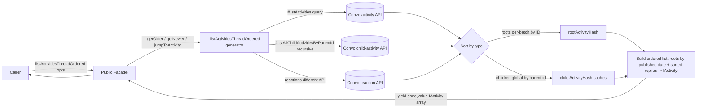
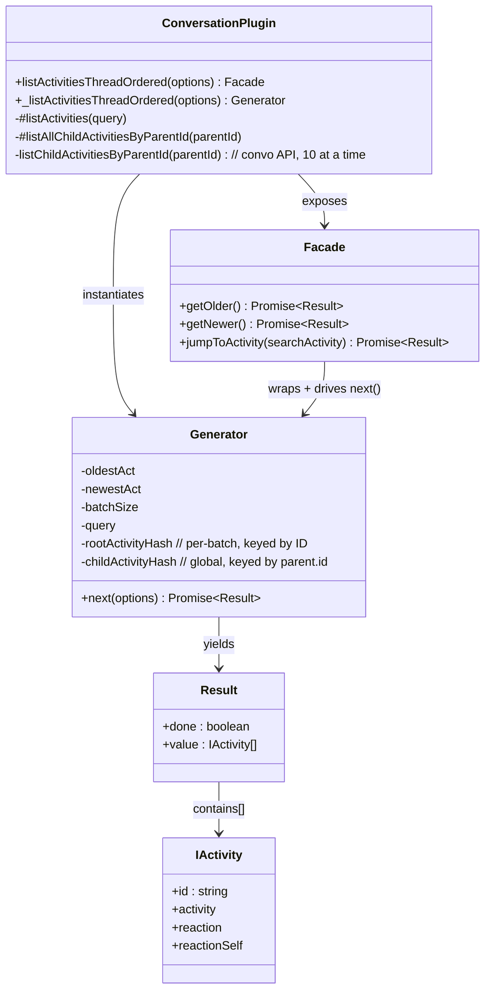

# internal-plugin-conversation — SPEC

> Start here → root [`AGENTS.md`](../../../../AGENTS.md) (agent entry) · router [`SPEC_INDEX.md`](../../../../ai-docs/SPEC_INDEX.md) · system [`ARCHITECTURE.md`](../../../../ai-docs/ARCHITECTURE.md). This is the module's canonical spec: orientation, requirements, design, flows, state, protocol, and tests.
> Context-efficiency: link to canonical docs — don't duplicate them. Load specs on demand per `SPEC_INDEX.md`.

<!--
  CANONICAL MODULE SPEC. Assess-only migration: the source-of-truth for behavior remains the plugin
  code under packages/@webex/internal-plugin-conversation/. This spec migrates the routed design doc
  (activity-threading.md) BY MEANING and does not replace code as the authority.
-->

## Metadata
| Field | Value |
|---|---|
| Module id | `internal-plugin-conversation` |
| Source path(s) | `packages/@webex/internal-plugin-conversation/` |
| Doc kind | Module spec |
| Coverage score | 56% (9/16) assessed 2026-07-28; critical 5/8 (security/auth MISSING); all 15 requirements WEAK, no test evidence — stays Partial |
| Generated from | `module-spec` @ SDLC template library `0.2.1` |
| generated_by / approved_by / updated_at | generated_by: module-spec migration; approved_by: unassigned; updated_at: `2026-07-28` |
| Validation status | `not-run` |

This is an **assess-only migration**. The plugin code under `packages/@webex/internal-plugin-conversation/`
remains the source of truth for runtime behavior. Manifest coverage state for this module is **Partial**;
that state is tracked in `.sdd/manifest.json` and intentionally kept outside this rendered metadata.
Coverage score stays `Pending coverage assessment` until the first coverage report; then replace it with a
`<0-100%>` value plus the assessment date.

## Evidence Rules
Every generated requirement below cites concrete source evidence using `file path`. Source evidence, test
evidence, examples, assumptions, and gaps are kept separate so validators and future agents can distinguish
truth from context. Because this is an assess-only migration of a design doc, most WHY rationale derives
from the routed source doc rather than from tests; where no test verifies a behavior, test evidence is
marked "None found" and confidence is marked WEAK. Unresolved items are recorded as assumptions/gaps, not
invented.

## Source Material Register
| Source material | Scope | Decision | Detail location or disposition |
|---|---|---|---|
| `packages/@webex/internal-plugin-conversation/src/activity-threading.md` | overview / API / design (routed, migrate-existing, retain) | used / migrated by meaning | Thread-ordering rationale → Overview + Design Overview; generator + facade API → Public Surface + Requirements; phases/state/caches → Design Overview + Concurrency & Reactive Flow; ordering examples → Use Cases + code blocks. Original file retained; code remains source of truth. |

## Overview
`internal-plugin-conversation` owns Webex conversation-service interactions for the internal SDK, exposed at
`webex.internal.conversation[*]`. This spec focuses on the **activity thread-ordering** capability: turning
the conversation service's chronological activity stream into a "thread ordered" (a.k.a. "useful order")
sequence for clients.

When a client fetches activities from the conversation service, convo returns them in **chronological order
by published date**. For a client that wants to render a conversation to a user, that raw order is mostly
useless. For example, asking convo for 10 activities can return an interleaved, meaningless stream such as:
`reaction, root, reaction, reply, edit, edit, reply, reaction, meeting, reply`. Thread ordering instead
**flattens the hierarchical parent/reply relationship** and returns activities in _thread order_ (_useful
order_): each root activity followed by its replies, roots ordered newest-first, e.g. `root 4, reply to
root 4, reply to root 4, root 3, reply to root 3, reply to root 3, root 2, reply to root 2, reply to root 2,
root 1 (newest root)`. Thread ordering is useful but difficult to implement, so it is centralized in this
plugin rather than pushed onto every client.

Two methods compose thread ordering: a private stateful async generator
(`_listActivitiesThreadOrdered(options)`) that does the work, and a public facade
(`listActivitiesThreadOrdered(options)`) that wraps a generator instance with iterator-protocol methods
(`getOlder()`, `getNewer()`, `jumpToActivity(searchActivity)`) so the complexity is hidden from the caller.

Terminology: **root** = an activity that is or could be a thread parent; **child** = an activity pointing at
a parent (not necessarily a root); **reply** = a child that is a reply to a root; **orphan** = a child whose
parent has not yet been fetched.

## Purpose / Responsibility
Owns fetching conversation activities and returning them in flattened **thread order** (roots newest-first,
each followed by its sorted replies). It does NOT own client-side persistence of activities — the caller
must store fetched activities itself; this module does not cache all fetched activities across calls.

## Stack
JavaScript, Webex JS SDK internal plugin (`@webex/internal-plugin-conversation`). Async generator + iterator
protocol drive the thread-ordering flow. Runs in the SDK host; depends on the conversation ("convo") service
HTTP API for activity, child-activity, and reaction fetches.

## Folder / Package Structure
```
packages/@webex/internal-plugin-conversation/
├── src/                        # plugin implementation
│   └── activity-threading.md   # routed design doc migrated by this spec
└── ai-docs/                    # this canonical module spec
```

## Key Files (source of truth)
| File | Holds |
|---|---|
| `packages/@webex/internal-plugin-conversation/src/` | Implementation of the conversation plugin, including `_listActivitiesThreadOrdered`, `listActivitiesThreadOrdered`, `#listActivities`, `#listAllChildActivitiesByParentId` — authoritative for runtime behavior |
| `packages/@webex/internal-plugin-conversation/src/activity-threading.md` | Routed design doc describing thread-ordering intent, phases, and API (migrated by meaning into this spec) |

## Public Surface
| Contract ID | Type | Surface | Purpose | Compatibility / deprecation | Schema / detail link | Root index |
|---|---|---|---|---|---|---|
| `internal-plugin-conversation._listActivitiesThreadOrdered` | SDK | `webex.internal.conversation._listActivitiesThreadOrdered(options)` | Private stateful async generator that fetches thread-ordered activities; returns a generator instance (no work until `next()`) | Private (leading underscore); internal use | `packages/@webex/internal-plugin-conversation/src/activity-threading.md` | `../../../../ai-docs/CONTRACTS.md` |
| `internal-plugin-conversation.listActivitiesThreadOrdered` | SDK | `webex.internal.conversation.listActivitiesThreadOrdered(opts)` | Public facade over the generator; exposes iterator-protocol wrappers `getOlder()`, `getNewer()`, `jumpToActivity(searchActivity)` | Public facade; wraps the private generator | `packages/@webex/internal-plugin-conversation/src/activity-threading.md` | `../../../../ai-docs/CONTRACTS.md` |

`IActivity` shape returned in `value` arrays:

```ts
interface IActivity {
  id: string;
  activity: <server Activity>;
  reaction: <server ReactionSummary>;
  reactionSelf: <server ReactionSelfSummary>;
}
// next() resolves to: { done: boolean, value: IActivity[] }
```

Compatibility notes:
- `_listActivitiesThreadOrdered` is private; callers should use the public facade `listActivitiesThreadOrdered`.
- The facade methods all implement the iterator protocol and resolve to `{ done, value }`.

## Requires (dependencies)
- Conversation ("convo") service HTTP API: chronological activity listing (`#listActivities`), child-activity
  listing (`listChildActivitiesByParentId`, limited to 10 children per call by the underlying convo API), the
  recursive child fetch (`#listAllChildActivitiesByParentId`), and a **separate** reaction API used to reduce
  server roundtrips.
- A conversation `url` supplied by the caller as the fetch target.
- Caller-side storage of returned activities (this module does not cache fetched activities across `next()`
  calls).

## Requirements
| ID | WHAT | WHY | Source Evidence | Test / Example Evidence | Assumptions / Gaps | Confidence |
|---|---|---|---|---|---|---|
| `INTERNAL-PLUGIN-CONVERSATION-R-001` | Thread ordering returns activities in "thread order" / "useful order" by flattening the parent/reply hierarchy (roots newest-first, each followed by its replies), instead of convo's raw chronological-by-published-date order which is useless for display. | Chronological fetch interleaves reactions/edits/replies/roots meaninglessly (e.g. `reaction, root, reaction, reply, edit...`); thread order groups each root with its replies (e.g. `root 4, reply, reply, root 3, ...`) so clients can render conversations. | `packages/@webex/internal-plugin-conversation/src/activity-threading.md` | None found | WEAK: behavior asserted from design doc only; no test located. | WEAK |
| `INTERNAL-PLUGIN-CONVERSATION-R-002` | `_listActivitiesThreadOrdered(options)` is a stateful async generator that yields a promise in an infinite loop, pausing/freezing state between `next()` calls, and internally tracks oldest/newest fetched activities so the caller keeps no state to fetch in either direction. | Generator freezes state on `yield` and resumes on `next()`; tracking oldest/newest timestamps lets it query the next batch older or newer without caller-maintained cursors. | `packages/@webex/internal-plugin-conversation/src/activity-threading.md` | None found | WEAK | WEAK |
| `INTERNAL-PLUGIN-CONVERSATION-R-003` | The generator does NOT cache all fetched activities; the caller must store fetched activities or re-fetch them. | Keeps the generator memory-light and state minimal; storage responsibility is the caller's. | `packages/@webex/internal-plugin-conversation/src/activity-threading.md` | None found | WEAK | WEAK |
| `INTERNAL-PLUGIN-CONVERSATION-R-004` | Init options are `url` (convo URL), `minActivities` (minimum activities per batch), `queryType` (`'newer'`\|`'older'`\|`'mid'`), `search` (server activity to return as batch midpoint with surrounding activities). | Options parameterize fetch target, batch size, direction, and jump-to-activity behavior. | `packages/@webex/internal-plugin-conversation/src/activity-threading.md` | None found | WEAK | WEAK |
| `INTERNAL-PLUGIN-CONVERSATION-R-005` | The generator's `next(options)` accepts `queryType`/`search`/`minActivities` overrides, allowing the caller to change fetch direction (newer↔older) without creating a new generator instance. | Reuses one generator + its state across stacked queries; overrides captured by assigning `yield` to a variable. | `packages/@webex/internal-plugin-conversation/src/activity-threading.md` | None found | WEAK | WEAK |
| `INTERNAL-PLUGIN-CONVERSATION-R-006` | `next()` resolves to `{ done: boolean, value: IActivity[] }` where `IActivity = { id, activity, reaction, reactionSelf }`. Calling `_listActivitiesThreadOrdered` returns the generator and does no work until `next()`. | Establishes the return contract and lazy-execution semantics. | `packages/@webex/internal-plugin-conversation/src/activity-threading.md` | None found | WEAK | WEAK |
| `INTERNAL-PLUGIN-CONVERSATION-R-007` | Public facade `getOlder()` implements iterator protocol: returns oldest activities first, then activities older than the oldest fetched (`done` true when the beginning of the conversation is reached). | Simple wrapper for scrolling toward conversation start. | `packages/@webex/internal-plugin-conversation/src/activity-threading.md` | None found | WEAK | WEAK |
| `INTERNAL-PLUGIN-CONVERSATION-R-008` | Public facade `getNewer()` implements iterator protocol: returns most recent activities first, then activities newer than the newest fetched (empty `value`, `done` true when nothing newer exists). | Wrapper for scrolling toward the newest activities; limited use alone but powerful after `jumpToActivity`. | `packages/@webex/internal-plugin-conversation/src/activity-threading.md` | None found | WEAK | WEAK |
| `INTERNAL-PLUGIN-CONVERSATION-R-009` | Public facade `jumpToActivity(searchActivity)` implements iterator protocol: returns the searched activity as the MIDDLE of a batch, surrounded by older + newer activities. After a `jumpToActivity`, a subsequent `getNewer()` returns the next activities after the last of the jump batch. | Enables deep-linking to a searched activity and then continuing to page newer from that point. | `packages/@webex/internal-plugin-conversation/src/activity-threading.md` | None found | WEAK | WEAK |
| `INTERNAL-PLUGIN-CONVERSATION-R-010` | The generator maintains lifetime state: `oldestAct`, `newestAct`, `batchSize` (lowered when fetching children so children added to parents help reach `minActivities`), `query` (first query forced to fetch newest to initialize state unless a `search` is requested), and child `***ActivityHash` caches. | State outlives each execution loop so `next()` can page in either direction; batch size adjusts for child inclusion. | `packages/@webex/internal-plugin-conversation/src/activity-threading.md` | None found | WEAK | WEAK |
| `INTERNAL-PLUGIN-CONVERSATION-R-011` | Root activities are stored per-batch in a `rootActivityHash` keyed by activity ID; child activities are stored **globally** keyed by their parent's id (`activity.parent.id`) to handle orphans (children arriving before their parent). | Global child keying by parent id lets a child be attached to its parent regardless of fetch order (orphan handling). | `packages/@webex/internal-plugin-conversation/src/activity-threading.md` | None found | WEAK | WEAK |
| `INTERNAL-PLUGIN-CONVERSATION-R-012` | A new method `#listAllChildActivitiesByParentId` recursively fetches ALL children of a type (vs `listChildActivitiesByParentId`, limited to 10 at a time by the convo API). MID and NEWER queries MUST recursively fetch children so no root is returned missing children. | Prevents returning roots with incomplete reply sets when jumping (MID) or paging newer. | `packages/@webex/internal-plugin-conversation/src/activity-threading.md` | None found | WEAK | WEAK |
| `INTERNAL-PLUGIN-CONVERSATION-R-013` | Reactions are fetched via a DIFFERENT convo API to reduce server roundtrips, unlike edits and replies. | The reaction API batches/reduces roundtrips, so the reaction fetch path differs from edit/reply fetches. | `packages/@webex/internal-plugin-conversation/src/activity-threading.md` | None found | WEAK | WEAK |
| `INTERNAL-PLUGIN-CONVERSATION-R-014` | The first `next()` is automatically treated as an INITIAL fetch to populate generator state; a subsequent `next()` with no `queryType` closes the generator. Args passed to `next()` (new `minActivities`, `queryType` override) are captured after `yield` so one generator + state serves multiple stacked queries. | Recalculation phase captures `next()` args via the assigned `yield`, enabling multi-query reuse; auto-INITIAL bootstraps state. | `packages/@webex/internal-plugin-conversation/src/activity-threading.md` | None found | WEAK | WEAK |
| `INTERNAL-PLUGIN-CONVERSATION-R-015` | The ordered list is built by sorting roots by published date, then, for each root, attaching its replies sorted by published date; every root and reply is sanitized into an `IActivity` (checking edits/reactions hashes) before being pushed to the ordered output. | Produces the flattened thread order (roots newest-first with sorted replies) consumed by clients. | `packages/@webex/internal-plugin-conversation/src/activity-threading.md` | None found | WEAK | WEAK |

Requirements above are migrated from the routed design doc. No implementing/test files were verified during
this assess-only migration, so confidence is WEAK throughout and test evidence is "None found".

## Design Overview
The private `_listActivitiesThreadOrdered(options)` is a **stateful async generator**. Instantiating it does
no work; the returned generator's `next()` begins the first round of fetching and resolves to
`{ done, value }`. The generator yields a promise in an infinite loop for its lifetime; on each `yield` it
freezes its state and resumes on the next `next()`. Because it internally tracks the **oldest** and
**newest** activities fetched (used as query timestamps), the caller never maintains paging state and can
change direction by passing overrides to `next()`.

The method has **3 main phases plus 1 subphase**:

1. **initialization** — everything up to the `while (true)` loop. Parses arguments and instantiates the
   lifetime state that must survive each execution loop:
   - `oldestAct` — oldest activity (by published date) fetched by this generator instance.
   - `newestAct` — newest activity fetched by this generator instance.
   - `batchSize` — number of activities to fetch to reach `minActivities`; set **lower** when children are
     fetched, because attaching children to their parents may help reach the `minActivities` count.
   - `query` — the initial fetch query. The **first** query is forced to fetch the **newest** activities in
     the space to initialize the activity states, **unless a `search` is requested**.
   - `***ActivityHash` caches — child-activity caches storing all child activity types returned from convo
     fetches, used to track **orphans** (children arriving before their parent).
2. **execution** — the `while (true)` loop, run for every `next()`. Its job is to fetch until `minActivities`
   is reached, build the ordered list, and `yield` it. Declares (outside the fetching loop):
   - `rootActivityHash` — tracks root activities fetched in a given batch (keyed by ID).
   - helper functions — close over state variables, group functionality, self-document.
   - `fetchLoopCount` — guards against fetching the same query repeatedly (break condition).
3. **fetching** (subphase of execution) — the `while (!getNoMoreActs())` loop. Runs until there are no more
   activities to fetch, or breaks early once `minActivities` is satisfied. Each iteration sets up the query
   and calls `#listActivities`. All query types depend on a first query for N root activities; **MID**
   (midDate) and **NEWER** (sinceDate) queries must ALSO **recursively fetch children** (via
   `#listAllChildActivitiesByParentId`) so no root is returned missing children. Fetched activities are
   sorted into maps by type: **roots per-batch keyed by ID**, **children globally keyed by
   `activity.parent.id`** (prevents orphans). **Reactions** are fetched through a **different** convo API to
   reduce roundtrips (unlike edits/replies). If not enough activities are gathered, a new query is derived
   from the former and the loop continues; otherwise the loop breaks.
4. **recalculation** — after the `yield`. Assigning `yield` to a variable captures the args passed into
   `next()` (new `minActivities`, `queryType` override), so the same generator + state can serve multiple
   stacked queries. The **first** `next()` is auto-INITIAL to populate state; a later `next()` with no
   `queryType` closes the generator.

After sufficient fetches, an empty ordered array is created; the batch's roots are sorted by published date;
looping the sorted root IDs, each root is checked against the child hashes (keyed by parent ID) and sanitized
into an `IActivity`. When a root has replies, replies are sorted by published date, checked against the
edits/reactions hashes, sanitized into `IActivity`, and pushed after their root. The completed ordered list
is then yielded.

The public `listActivitiesThreadOrdered(options)` facade wraps generator lifecycle management and exposes
iterator-protocol methods (`getOlder`, `getNewer`, `jumpToActivity`) so callers avoid the generator
complexity.

## Data Flow


## Sequence Diagram(s)
Sequence coverage:

| Operation group | Diagram | Failure / recovery coverage |
|---|---|---|
| Batch fetch + build (execution → fetching → recalculation) | "Thread-ordered next() batch" | opt/loop: recursive child fetch for MID/NEWER; break when `minActivities` reached; `fetchLoopCount` guard against repeated identical query |
| Facade paging + jump reuse | "getNewer after jumpToActivity" | opt: `getNewer` after jump returns activities after the jump batch |

```mermaid
sequenceDiagram
  participant C as Caller
  participant G as Generator (_listActivitiesThreadOrdered)
  participant A as Convo activity API
  participant Ch as Convo child API
  participant R as Convo reaction API

  C->>G: next(options?)  (first call = INITIAL, forces newest unless search)
  loop while(!getNoMoreActs()) and not enough for minActivities
    G->>A: #listActivities (query)
    A-->>G: root + interleaved activities
    alt queryType == MID or NEWER
      G->>Ch: #listAllChildActivitiesByParentId (recursive)
      Ch-->>G: all children of type
    end
    G->>R: fetch reactions (different API, fewer roundtrips)
    R-->>G: reaction summaries
    Note over G: roots -> rootActivityHash (by ID)<br/>children -> global cache (by parent.id, orphan-safe)
    alt fetchLoopCount exceeds guard
      G-->>G: break loop
    end
  end
  Note over G: sort roots by published date; attach sorted replies; sanitize -> IActivity
  G-->>C: yield { done, value: IActivity[] }
  Note over G,C: after yield, next() args (minActivities, queryType) captured (recalculation)
```

## Class / Component Relationships


The public `Facade` wraps a single `Generator` instance and drives its `next()` via iterator-protocol
methods. The `Generator` holds lifetime state (`oldestAct`, `newestAct`, `batchSize`, `query`, root/child
hashes) and yields `Result` objects whose `value` is an array of `IActivity`.

## Use Cases
- **UC-1 Page older (`getOlder`):** caller creates the facade → calls `getOlder()` → receives most recent
  activities, then subsequent `getOlder()` calls return activities older than the previously oldest fetched;
  `done` becomes true at the conversation start. Evidence:
  `packages/@webex/internal-plugin-conversation/src/activity-threading.md`. Test: None found.

  ```js
  const myGen = webex.internal.conversation.listActivitiesThreadOrdered(opts);
  const firstBatch = await myGen.getOlder();
  console.log(firstBatch);
  /*
  {
    done: false,
    value: IActivity[] // the most recent activities from the given conversation
  }
  */
  const secondBatch = await myGen.getOlder();
  console.log(secondBatch);
  /*
  {
    done: boolean, // true if we reach beginning of convo, else false
    value: IActivity[] // activities older than firstBatch[0]
  }
  */
  ```

- **UC-2 Jump to a searched activity (`jumpToActivity`):** caller passes a server activity (typically from
  activity search) → receives a batch with that activity as the MIDDLE, surrounded by older + newer
  activities. Evidence: `packages/@webex/internal-plugin-conversation/src/activity-threading.md`. Test: None
  found.

  ```js
  const activitySearchResult = /* IServerActivity from activity search */;
  const myGen = webex.internal.conversation.listActivitiesThreadOrdered(opts);
  const results = await myGen.jumpToActivity(activitySearchResult);
  console.log(results);
  /*
  {
    done: true,
    value: [...IActivity[], IActivity<activitySearchResult>, ...IActivity[]]
  }
  */
  ```

- **UC-3 Page newer after a jump (`getNewer` + `jumpToActivity`):** after `jumpToActivity`, calling
  `getNewer()` returns the next activities after the last of the jump batch — this is where `getNewer` is
  most useful. On its own from the newest edge, `getNewer()` returns an empty `value` with `done: true` when
  nothing newer exists. Evidence:
  `packages/@webex/internal-plugin-conversation/src/activity-threading.md`. Test: None found.

  ```js
  const activitySearchResult = /* IServerActivity from activity search */;
  const myGen = webex.internal.conversation.listActivitiesThreadOrdered(opts);
  const firstBatch = await myGen.jumpToActivity(activitySearchResult);
  // firstBatch => { done: true, value: [...older, searched, ...newer] }

  const secondBatch = await myGen.getNewer();
  console.log(secondBatch);
  /*
  {
    done: false,
    value: IActivity[] // secondBatch[0] is the next activity after the last of firstBatch
  }
  */
  ```

- **UC-4 Direct generator use (`_listActivitiesThreadOrdered`):** advanced callers instantiate the private
  generator and drive `next()`, optionally passing `queryType`/`search`/`minActivities` overrides to change
  direction without a new generator. Evidence:
  `packages/@webex/internal-plugin-conversation/src/activity-threading.md`. Test: None found.

  ```js
  const options = {
    url: 'myconvourl.com',
    minActivities: 20,
    queryType: 'older',
    search: null,
  };
  const threadOrderedFetcher = webex.internal.conversation._listActivitiesThreadOrdered(options);
  await threadOrderedFetcher.next(); // => { done: boolean, value: IActivity[] }
  ```

## Concurrency & Reactive Flow
- **Model:** a single stateful async generator per facade instance. Each `next()` returns a promise; the
  generator yields inside an infinite `while (true)` loop and **freezes its state on `yield`**, resuming on
  the next `next()`. There is no shared mutation across independent generators.
- **State continuity:** `oldestAct` / `newestAct` are the reactive cursors — they let a single generator page
  older or newer without caller-held state. `next()` overrides (`queryType`, `search`, `minActivities`) are
  captured post-`yield` (recalculation), so one generator + its state serves multiple stacked queries.
- **Ordering guarantees:** output is deterministically ordered — roots sorted by published date (newest
  first), each followed by its replies sorted by published date; all sanitized into `IActivity`.
- **Non-blocking / roundtrip minimization:** reactions are fetched via a separate convo API to cut server
  roundtrips (distinct from edit/reply fetches). MID and NEWER queries recursively fetch children
  (`#listAllChildActivitiesByParentId`) so a yielded root is never missing replies.
- **Orphan safety (out-of-order arrivals):** children may arrive before their parent; storing children
  **globally keyed by `activity.parent.id`** means a later-arriving parent still finds its children.
- **Loop safety:** `fetchLoopCount` guards against re-issuing the same query indefinitely in the fetching
  subphase.
- **Lifecycle:** the first `next()` auto-initializes (INITIAL) to populate state; a later `next()` with no
  `queryType` closes the generator; the generator lives until dereferenced and garbage-collected.

## Pitfalls
- **Caller must store activities.** The generator does not cache all fetched activities across `next()`
  calls; failing to store returned batches forces re-fetching.
- **The first query is special.** The first fetch is forced to the **newest** activities to initialize state,
  **unless a `search`** is supplied — do not assume the first `getOlder`/`next` starts arbitrarily.
- **Closing semantics.** A `next()` with no `queryType` (after the auto-INITIAL first call) will **close** the
  generator; pass a `queryType`/`search` to keep it alive for the next direction.
- **Child limits.** `listChildActivitiesByParentId` returns only 10 children at a time (convo API limit); use
  `#listAllChildActivitiesByParentId` for MID/NEWER queries so roots aren't yielded with missing replies.
- **Reactions differ.** Reaction fetching uses a different convo API than edits/replies; don't assume a
  uniform fetch path for all child types.
- **Orphans.** Children can arrive before parents; they are keyed globally by `activity.parent.id` — relying
  on per-batch child grouping would drop orphans.
- **batchSize is dynamic.** `batchSize` is lowered when children are fetched (children attached to parents
  count toward `minActivities`), so it is not a fixed value.

## Test-Case Strategy (module)
Assess-only migration: no verifying tests were located for the thread-ordering behavior. Recommended module
tests (each with a positive AND a negative/edge case):
- `getOlder()` — asserts first batch returns newest activities and subsequent batches return strictly older
  activities (positive); asserts `done: true` at conversation start (edge).
- `getNewer()` — asserts newer activities after a jump (positive); asserts empty `value` + `done: true` when
  nothing newer exists (negative/edge).
- `jumpToActivity(searchActivity)` — asserts searched activity lands in the MIDDLE surrounded by older+newer
  (positive); asserts a following `getNewer()` continues after the jump batch (edge).
- Generator state — asserts `next()` overrides change direction without a new generator (positive); asserts a
  no-`queryType` `next()` after INITIAL closes the generator (negative).
- Ordering/orphans — asserts roots sorted newest-first with sorted replies attached (positive); asserts a
  child arriving before its parent is still attached via `activity.parent.id` (edge).
- Child completeness — asserts MID/NEWER recursively fetch all children so no root is yielded missing replies
  (edge).

| Behavior / Requirement | Existing test evidence | Gap |
|---|---|---|
| `INTERNAL-PLUGIN-CONVERSATION-R-001` (thread vs chronological order) | None found | No test verifying flattened thread-order output |
| `INTERNAL-PLUGIN-CONVERSATION-R-002` (stateful generator, oldest/newest cursors) | None found | No test verifying state freeze/resume + cursors |
| `INTERNAL-PLUGIN-CONVERSATION-R-003` (no caching; caller stores) | None found | No test verifying non-caching contract |
| `INTERNAL-PLUGIN-CONVERSATION-R-004` (init options) | None found | No test verifying option handling |
| `INTERNAL-PLUGIN-CONVERSATION-R-005` (`next()` overrides, direction change) | None found | No test verifying override/direction change |
| `INTERNAL-PLUGIN-CONVERSATION-R-006` (`{done,value}` + lazy start) | None found | No test verifying return shape / lazy execution |
| `INTERNAL-PLUGIN-CONVERSATION-R-007` (`getOlder`) | None found | No test for oldest-then-older + done at start |
| `INTERNAL-PLUGIN-CONVERSATION-R-008` (`getNewer`) | None found | No test for newest-then-newer + empty/done |
| `INTERNAL-PLUGIN-CONVERSATION-R-009` (`jumpToActivity` + getNewer reuse) | None found | No test for middle placement + jump→newer |
| `INTERNAL-PLUGIN-CONVERSATION-R-010` (lifetime state, batchSize, first-query-newest) | None found | No test for state invariants |
| `INTERNAL-PLUGIN-CONVERSATION-R-011` (root per-batch by ID; child global by parent.id / orphans) | None found | No orphan/keying test |
| `INTERNAL-PLUGIN-CONVERSATION-R-012` (recursive child fetch for MID/NEWER) | None found | No recursive-child completeness test |
| `INTERNAL-PLUGIN-CONVERSATION-R-013` (reactions via different API) | None found | No reaction-fetch-path test |
| `INTERNAL-PLUGIN-CONVERSATION-R-014` (auto-INITIAL, recalculation, close semantics) | None found | No lifecycle test |
| `INTERNAL-PLUGIN-CONVERSATION-R-015` (ordered list build: roots by date + sorted replies → IActivity) | None found | No ordering-build test |

## Traceability
- Repo architecture: `../../../../ai-docs/ARCHITECTURE.md` · Registry: `../../../../ai-docs/SPEC_INDEX.md`
- Coverage state & contracts baseline: `.sdd/manifest.json` (module coverage state: Partial; assess-only migration — code remains source of truth)
- Migrated source: `packages/@webex/internal-plugin-conversation/src/activity-threading.md`
