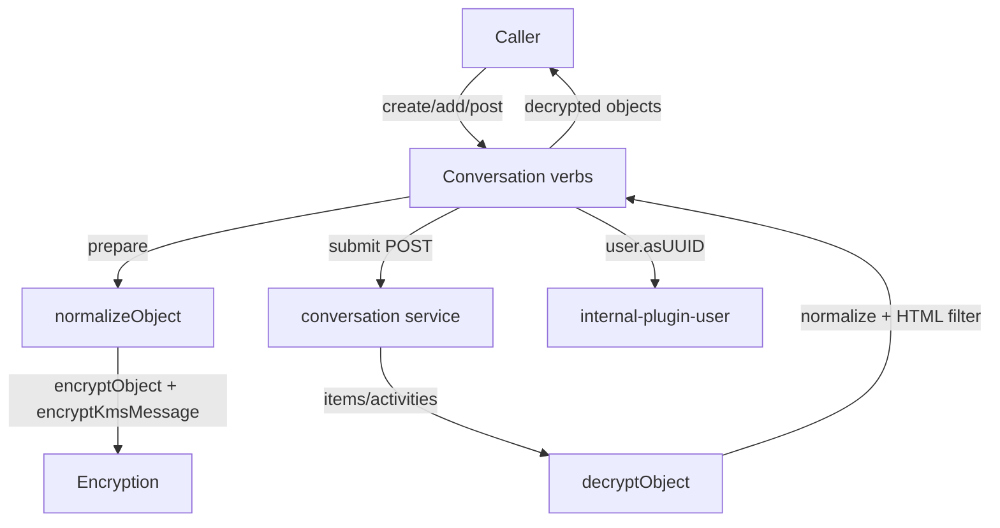
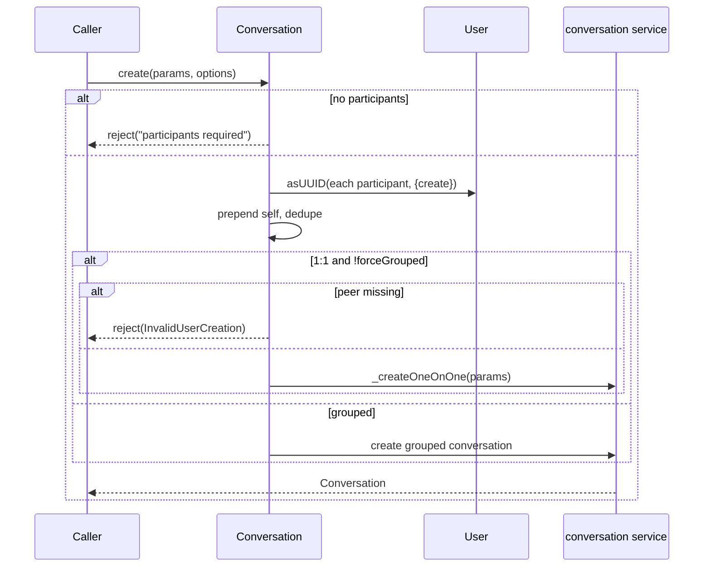
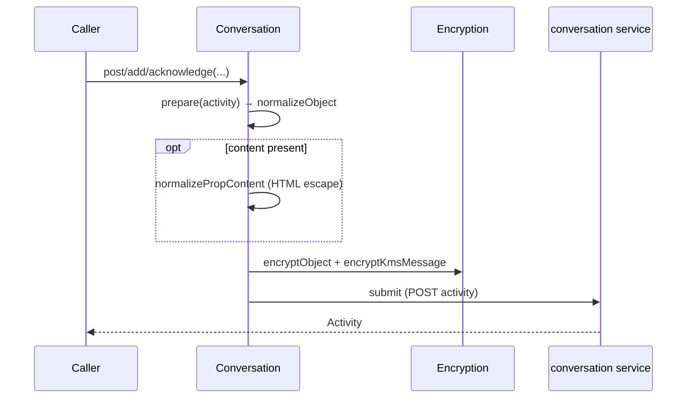
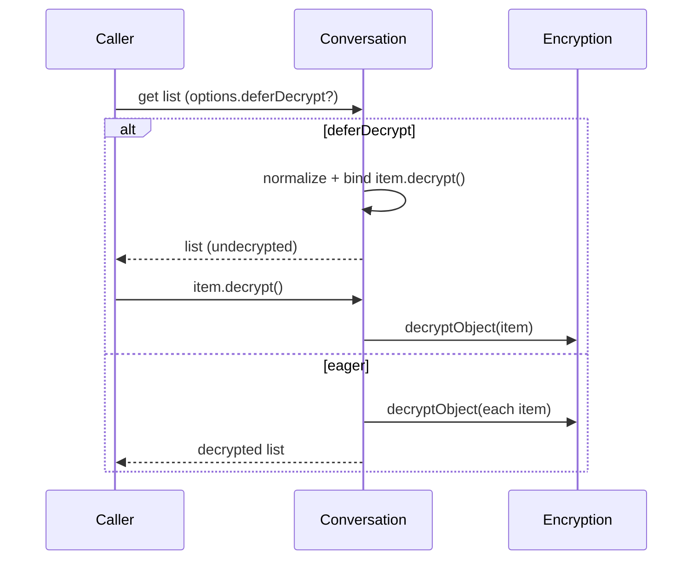
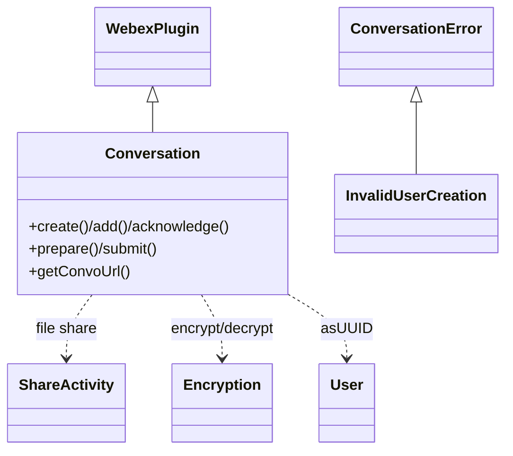

<!-- sdd-generated-metadata
generator: claude-cli
generator_model: us.anthropic.claude-opus-4-8
approved_by: pending-human-review
updated_at: 2026-08-06T00:00:00Z
validation_status: not-run
run_id: 51855eac-8de5-43a2-a3b6-dbcc55ebc91b
-->

# @webex/internal-plugin-conversation — SPEC

> Start here → root [`AGENTS.md`](../../../../AGENTS.md) (agent entry) · router [`SPEC_INDEX.md`](../../../../ai-docs/SPEC_INDEX.md) · system [`ARCHITECTURE.md`](../../../../ai-docs/ARCHITECTURE.md). This is the module's canonical spec: orientation, requirements, design, flows, protocol, and tests.
> Context-efficiency: link to canonical docs — don't duplicate them. Load specs on demand per `SPEC_INDEX.md`.

## Metadata

| Field | Value |
|---|---|
| Module id | `internal-plugin-conversation` |
| Source path(s) | `packages/@webex/internal-plugin-conversation/src/` |
| Parent spec | `—` (registered internal Webex plugin; composed by `webex-core`, no parent module) |
| Doc kind | Module spec |
| Coverage score | Pending coverage assessment |
| Generated from | `module-spec` @ SDLC template library `0.2.2` |
| generated_by / approved_by / updated_at | claude-cli / pending-human-review / 2026-08-06 |
| Validation status | not-run, validator `pending`, assessed 2026-08-06 |

Coverage score is `Pending coverage assessment` until the first coverage review runs. Manifest coverage
state (`Partial`) is authoritative and kept in `.sdd/manifest.json`.

## Evidence Rules
Every requirement cites concrete source evidence using `file path`. Test evidence is preferred for WHY.
Requirements are grounded in the current implementation under `src/` and its unit tests.

## Source Material Register

| Source material | Scope | Decision | Detail location or disposition |
|---|---|---|---|
| `N/A` | none | none | No pre-existing SDD/AI-docs, architecture, or spec documents were routed to this module; content is derived from source and tests. |

## Overview

`@webex/internal-plugin-conversation` is the internal Webex SDK plugin (registered as `conversation`) that
owns the encrypted messaging/activity core: creating and reading conversations (spaces), posting and
threading activities (messages, edits, replies, reactions), adding/removing participants, and sharing
files — all end-to-end encrypted. It is one of the largest internal plugins and underpins higher-level
messaging features.

The plugin (`src/conversation.js`, a `WebexPlugin`) exposes verb-oriented methods (`create`, `add`,
`acknowledge`, `post`, etc.) built on a `prepare`/`submit` pipeline. Encryption, decryption, and
normalization are implemented as payload transformer predicates/transforms registered in `src/index.js`
and augmented at `ready` time with `encryption-transforms`/`decryption-transforms`. Activity threading and
ordering live in dedicated helpers (`activity-thread-ordering.js`, `activities.js`), and HTML content is
sanitized inbound/outbound via `@webex/helper-html`.

A maintainer should start at `src/conversation.js` (verbs + prepare/submit), `src/index.js` (transform
wiring + normalization), and the encryption/decryption transform modules.

## Purpose / Responsibility

Owns encrypted conversation and activity lifecycle: conversation create/read, activity post/thread/edit,
participant management, file share, and the encrypt/normalize/decrypt transform pipeline for conversation
objects. It does NOT own the KMS/crypto primitives (delegates to `webex.internal.encryption`), user
identity resolution (delegates to `webex.internal.user`), or HTML sanitization internals (delegates to
`@webex/helper-html`).

## Stack

JavaScript (`devMain: src/index.js`), Node `>=18`. Built with `webex-legacy-tools build` (`-js -ts
-maps`). Unit tests via `webex-legacy-tools test --unit --runner jest`; integration/browser via karma.
Runtime dependencies: `@webex/webex-core` (`WebexPlugin`, `Page`), `@webex/internal-plugin-encryption`
(KMS encrypt/decrypt), `@webex/internal-plugin-user` (`asUUID`), `@webex/common`, `@webex/helper-html`
(sanitization), `@webex/helper-image` (`readExifData`), `crypto-js`, `node-scr`, `lodash`, `uuid`.

## Folder / Package Structure

```
packages/@webex/internal-plugin-conversation/src/
├── index.js                       # registerInternalPlugin('conversation', ...); transforms + normalizers
├── conversation.js                # Conversation WebexPlugin: verbs, prepare/submit, read/thread
├── encryption-transforms.js       # outbound encryption transforms (added at ready)
├── decryption-transforms.js       # inbound decryption transforms (added at ready)
├── activities.js                  # activity type detection + construction helpers
├── activity-thread-ordering.js    # thread/ordering/batching helpers
├── share-activity.js              # ShareActivity: file-share activity builder
├── convo-error.js                 # ConversationError / InvalidUserCreation
├── constants.js                   # key-rotation and mismatch constants
└── config.js                      # allowed inbound/outbound tags/styles, decrypt options, limits
```

## Key Files (source of truth)

| File | Holds |
|---|---|
| `packages/@webex/internal-plugin-conversation/src/conversation.js` | Public verbs, `prepare`/`submit`, conversation read/create, activity threading |
| `packages/@webex/internal-plugin-conversation/src/index.js` | Registration, payload transformer predicates, `normalize*` transforms, HTML filtering wiring |
| `packages/@webex/internal-plugin-conversation/src/config.js` | Allowed tags/styles, batch sizes, decryption/encryption transform toggles |
| `packages/@webex/internal-plugin-conversation/src/constants.js` | `KEY_ROTATION_REQUIRED`/`KEY_ALREADY_ROTATED`/`ENCRYPTION_KEY_URL_MISMATCH` |

## Public Surface

Consumed as an internal SDK plugin via `webex.internal.conversation`. It calls the remote conversation
service and participates heavily in the `webex-core` transform pipeline.

| Contract ID | Type | Surface | Purpose | Compatibility / deprecation | Schema / detail link | Root index |
|---|---|---|---|---|---|---|
| `conversation.create` | SDK | `create(params, options): Promise<Conversation>` | Create a (1:1 or grouped) conversation, resolving participants to UUIDs | Stable plugin method | `packages/@webex/internal-plugin-conversation/src/conversation.js` | `../../../../ai-docs/CONTRACTS.md` |
| `conversation.add` / `leave` | SDK | `add(conversation, participant, activity)` / participant verbs: Promise<Activity> | Add/remove a participant with the matching KMS authorization message | Stable plugin method | `packages/@webex/internal-plugin-conversation/src/conversation.js` | `../../../../ai-docs/CONTRACTS.md` |
| `conversation.acknowledge` | SDK | `acknowledge(conversation, object, activity): Promise` | Post an `acknowledge` activity for an object/activity | Stable plugin method | `packages/@webex/internal-plugin-conversation/src/conversation.js` | `../../../../ai-docs/CONTRACTS.md` |
| `conversation.prepare` / `submit` | SDK | `prepare(activity, params)` / `submit(activity): Promise<Activity>` | Build (normalize+encrypt) and submit an activity — the core verb pipeline | Stable plugin method | `packages/@webex/internal-plugin-conversation/src/conversation.js` | `../../../../ai-docs/CONTRACTS.md` |
| `conversation.get` (read) | SDK | conversation/activity read + threading methods: Promise<Page/Activity> | Fetch conversations/activities with decryption + normalization + threading | Stable plugin method | `packages/@webex/internal-plugin-conversation/src/conversation.js` | `../../../../ai-docs/CONTRACTS.md` |
| `conversation.ShareActivity` | SDK | `ShareActivity` (exported class) | Build a file-share activity (SCR + Files upload) | Stable export | `packages/@webex/internal-plugin-conversation/src/share-activity.js` | `../../../../ai-docs/CONTRACTS.md` |
| `conversation.transforms` | pipeline | payload transformer predicates/transforms (`transformObject`, `normalize*`, `normalizePropContent`, decrypt/encrypt) | Encrypt/normalize outbound and decrypt/normalize inbound conversation objects | Stable pipeline contract | `packages/@webex/internal-plugin-conversation/src/index.js` | `../../../../ai-docs/CONTRACTS.md` |
| `conversation.errors` | SDK | `ConversationError`, `InvalidUserCreation` (exported) | Typed errors for conversation operations | Stable export | `packages/@webex/internal-plugin-conversation/src/convo-error.js` | `../../../../ai-docs/CONTRACTS.md` |

Compatibility notes:
- Public verb method names/signatures, the activity/object shapes, and the exported classes/errors are the
  semver-controlled contract.
- The transform predicate/transform names are part of the pipeline contract other plugins rely on.

## Requires (dependencies)

- `@webex/webex-core` — `WebexPlugin`, `Page`, and the payload transformer pipeline.
- `webex.internal.encryption` — KMS encryption/decryption of activity/object content and key handling.
- `webex.internal.user` — `asUUID(participant, {create})` to resolve people to UUIDs.
- `@webex/helper-html` — inbound/outbound HTML content filtering (`filter`/`filterEscape`).
- `@webex/helper-image` — `readExifData` for image share activities.
- `@webex/common`, `crypto-js`, `node-scr`, `lodash`, `uuid` — utilities, hashing, and SCR handling.

## Requirements

| ID | WHAT | WHY | Source Evidence | Test / Example Evidence | Assumptions / Gaps | Confidence |
|---|---|---|---|---|---|---|
| `CONVERSATION-R-001` | `create` requires `params.participants`, resolves each to a UUID (with `allowPartialCreation` tolerating failures), prepends the current user, dedupes, and creates a 1:1 (`_createOneOnOne`) or grouped conversation unless `forceGrouped`/`skipOneOnOneFetch` change the path. | Conversation creation must resolve identities and correctly branch 1:1 vs grouped. | `packages/@webex/internal-plugin-conversation/src/conversation.js` | `packages/@webex/internal-plugin-conversation/test/unit/` | Rejects `InvalidUserCreation` when the 1:1 peer can't be created | PRESENT |
| `CONVERSATION-R-002` | `add` resolves the participant to a UUID (creating if needed) and prepares an `add` activity with a KMS `create /authorizations` message granting that user access to the KRO. | Adding a participant must also authorize them in KMS for encrypted content. | `packages/@webex/internal-plugin-conversation/src/conversation.js` | `packages/@webex/internal-plugin-conversation/test/unit/` | none identified | PRESENT |
| `CONVERSATION-R-003` | `acknowledge` rejects if `object` is not an object, then prepares/submits an `acknowledge` activity targeting the conversation and referencing the object activity id/url. | Read receipts/acknowledgements must reference a concrete activity. | `packages/@webex/internal-plugin-conversation/src/conversation.js` | `packages/@webex/internal-plugin-conversation/test/unit/` | none identified | PRESENT |
| `CONVERSATION-R-004` | Outbound `transformObject` normalizes then encrypts an object and encrypts its KMS message; inbound `transformObject` decrypts then normalizes — gated on `body.objectType`. | Conversation objects must be encrypted on the way out and decrypted on the way in, transparently. | `packages/@webex/internal-plugin-conversation/src/index.js` | `packages/@webex/internal-plugin-conversation/test/unit/` | none identified | PRESENT |
| `CONVERSATION-R-005` | `normalizePropContent` filters HTML content inbound (`htmlFilter` with allowed inbound tags/styles) and escapes/filters outbound (`htmlFilterEscape` with allowed outbound tags/styles) per `config.conversation`. | User-authored HTML must be sanitized both directions to prevent injection. | `packages/@webex/internal-plugin-conversation/src/index.js`, `packages/@webex/internal-plugin-conversation/src/config.js` | `packages/@webex/internal-plugin-conversation/test/unit/` | none identified | PRESENT |
| `CONVERSATION-R-006` | `normalizePerson` lowercases valid emails/UUIDs, resolves an id via `user.asUUID(email)` when only an email is present, and rejects when neither an emailAddress nor entryUUID can determine an id. | Person objects must carry a canonical UUID id for encryption/authorization. | `packages/@webex/internal-plugin-conversation/src/index.js` | `packages/@webex/internal-plugin-conversation/test/unit/` | none identified | PRESENT |
| `CONVERSATION-R-007` | Deferred decryption is supported: with `options.deferDecrypt`, `normalizeConversationListAndBindDecrypters` normalizes list items and attaches a one-shot `decrypt()` that runs `decryptObject`; otherwise `transformObjectArray`/`transformThreadArray` decrypt eagerly. | Large lists can defer expensive per-item decryption until the item is actually needed. | `packages/@webex/internal-plugin-conversation/src/index.js` | `packages/@webex/internal-plugin-conversation/test/unit/` | none identified | PRESENT |
| `CONVERSATION-R-008` | Encryption/decryption transforms are appended to `webex.config.payloadTransformer.transforms` once on `ready`, gated by `config.includeDecryptionTransforms`/`includeEncryptionTransforms`. | The transform set must be installed exactly once and be configurable. | `packages/@webex/internal-plugin-conversation/src/conversation.js` | `packages/@webex/internal-plugin-conversation/test/unit/` | none identified | PRESENT |

## Design Overview

`Conversation` extends `WebexPlugin` and models messaging as verbs over activities. Most write methods
build an activity via `prepare` (which normalizes and encrypts through the transform pipeline) and send it
with `submit`. Conversation/activity URLs are resolved via `getUrlFromClusterId`/`getConvoUrl` against the
services registry.

Encryption and normalization are implemented as `webex-core` payload transformer predicates/transforms
declared in `index.js`, plus `encryption-transforms`/`decryption-transforms` that are concatenated onto the
global transform list at `ready`. Outbound: `normalizeObject` → `encryptObject` → `encryptKmsMessage`.
Inbound: `decryptObject` → `normalizeObject`, with per-type normalizers (`normalizeConversation`,
`normalizeActivity`, `normalizePerson`, `normalizeThread`) and HTML content filtering.

Threading and ordering are handled by `activity-thread-ordering.js`/`activities.js`, which classify
activity types (root/reply/edit/reaction), order by published date, and batch reads. `ShareActivity`
builds file-share activities using SCR encryption and Webex Files upload.

## Data Flow



## Sequence Diagram(s)

Sequence coverage:

| Operation group | Diagram | Failure / recovery coverage |
|---|---|---|
| Create conversation | 1. Create | `alt` covers empty participants reject, 1:1 vs grouped, and `InvalidUserCreation` |
| Post/prepare+submit an activity | 2. Prepare/submit | `opt` covers HTML sanitization + KMS message encryption |
| Read list with deferred decryption | 3. Deferred decrypt | `alt` covers deferDecrypt (bind decrypter) vs eager decrypt |

### 1. Create conversation



### 2. Prepare + submit activity



### 3. Read list (deferred decryption)



## Class / Component Relationships



`Conversation` extends `WebexPlugin`, uses `ShareActivity` for files, and collaborates with the encryption
and user plugins; typed errors extend `ConversationError`.

## Use Cases

- **UC-1 Create a space:** `create({participants, comment})` resolves UUIDs and creates 1:1 or grouped. Evidence: `packages/@webex/internal-plugin-conversation/src/conversation.js`.
- **UC-2 Add a member:** `add(conversation, email, activity)` resolves the UUID and authorizes them in KMS. Evidence: `packages/@webex/internal-plugin-conversation/src/conversation.js`.
- **UC-3 Read a space with lazy decryption:** fetch with `deferDecrypt` and call `item.decrypt()` on demand. Evidence: `packages/@webex/internal-plugin-conversation/src/index.js`.

## Concurrency & Reactive Flow

Reads that resolve many participants/activities use `Promise.all` over per-item transforms; deferred
decryption lets a list be normalized eagerly while decryption runs later per item on first access. The
encryption/decryption transform set is appended to the global transformer list exactly once on the `ready`
event to avoid duplicate installation. Evidence:
`packages/@webex/internal-plugin-conversation/src/index.js`,
`packages/@webex/internal-plugin-conversation/src/conversation.js`.

## Protocol / Wire Format

Conversation objects carry an `objectType` and (for content) an HTML `content` field. Outbound objects are
normalized, encrypted, and carry an encrypted `kmsMessage`; inbound objects/arrays are detected by
`body.objectType`/`body.items[0].objectType`/`body.multistatus` and decrypted+normalized. Threads are
detected via `body.items[0].childType`+`actorId`. Key-rotation is signalled by
`KEY_ROTATION_REQUIRED`/`KEY_ALREADY_ROTATED` and mismatches by `ENCRYPTION_KEY_URL_MISMATCH`. Evidence:
`packages/@webex/internal-plugin-conversation/src/index.js`,
`packages/@webex/internal-plugin-conversation/src/constants.js`.

## Data Model

Core entities: Conversation (space; `activities`, `participants`), Activity (verb-based:
add/acknowledge/post/edit/reply/reaction), and Person (canonicalized to a UUID id). `ShareActivity` models
file-share activities with SCR-encrypted files. Activity threading/ordering metadata (root/reply/edit
relationships, published-date ordering, batching) lives in `activities.js`/`activity-thread-ordering.js`.
No local persistent datastore is owned by this module; state is the remote conversation service.

## Error Handling & Failure Modes

| Condition | Signal (error/code/result) | Caller recovery |
|---|---|---|
| `create` with no participants | rejects `Error('`params.participants` is required')` | Provide at least one participant |
| 1:1 peer cannot be created | rejects `InvalidUserCreation` | Retry with a valid user or `allowPartialCreation`/`forceGrouped` |
| `acknowledge` non-object `object` | rejects `Error('`object` must be an object')` | Pass an activity object |
| Encryption key mismatch / rotation | `ENCRYPTION_KEY_URL_MISMATCH` / `KEY_ROTATION_REQUIRED` / `KEY_ALREADY_ROTATED` | Rotate/refetch keys and retry |
| Person id undeterminable | rejects `Error('cannot determine id without an `emailAddress` or `entryUUID`')` | Supply an email or UUID |

## Pitfalls

- The encryption/decryption transforms are appended only on `ready` and only when the config toggles are
  set — missing toggles mean objects won't be encrypted/decrypted.
- `deferDecrypt` returns list items with a one-shot `decrypt()` that removes itself after running; calling
  it twice will not re-decrypt.
- HTML content is sanitized both directions using the configured allowed tags/styles; adding new markup
  requires updating `config.conversation` allow-lists.
- `create` prepends the current user and dedupes participants, so a two-element input may resolve to a 1:1.

## Module Do's / Don'ts

- DO build write operations through `prepare`/`submit` so normalization + encryption + KMS messages stay consistent.
- DO resolve participants via `user.asUUID` rather than assuming an id shape.
- DON'T bypass the transform pipeline to send unencrypted conversation objects.

## Test-Case Strategy (module)

Unit tests (Jest) mock `webex.request`, `webex.internal.encryption`, and `webex.internal.user`, asserting:
create branching (1:1 vs grouped, partial creation, InvalidUserCreation); `add` KMS authorization message;
`acknowledge` object validation; outbound/inbound `transformObject` ordering; HTML filter/escape;
`normalizePerson` id resolution; and deferred-vs-eager decryption.

| Behavior / Requirement | Existing test evidence | Gap |
|---|---|---|
| `CONVERSATION-R-001` | `packages/@webex/internal-plugin-conversation/test/unit/` | Re-check partial-creation + 1:1 branches |
| `CONVERSATION-R-002` | `packages/@webex/internal-plugin-conversation/test/unit/` | Re-check KMS authorization body |
| `CONVERSATION-R-003` | `packages/@webex/internal-plugin-conversation/test/unit/` | Re-check non-object reject |
| `CONVERSATION-R-004` | `packages/@webex/internal-plugin-conversation/test/unit/` | Re-check inbound vs outbound ordering |
| `CONVERSATION-R-005` | `packages/@webex/internal-plugin-conversation/test/unit/` | Re-check inbound + outbound filtering |
| `CONVERSATION-R-006` | `packages/@webex/internal-plugin-conversation/test/unit/` | Re-check email-only resolution + reject |
| `CONVERSATION-R-007` | `packages/@webex/internal-plugin-conversation/test/unit/` | Re-check bound decrypter one-shot |
| `CONVERSATION-R-008` | `packages/@webex/internal-plugin-conversation/test/unit/` | Re-check single append on ready |

## Traceability

- Repo architecture: [`ARCHITECTURE.md`](../../../../ai-docs/ARCHITECTURE.md) · Registry: [`SPEC_INDEX.md`](../../../../ai-docs/SPEC_INDEX.md)
- Coverage state & contracts baseline: `.sdd/manifest.json`
