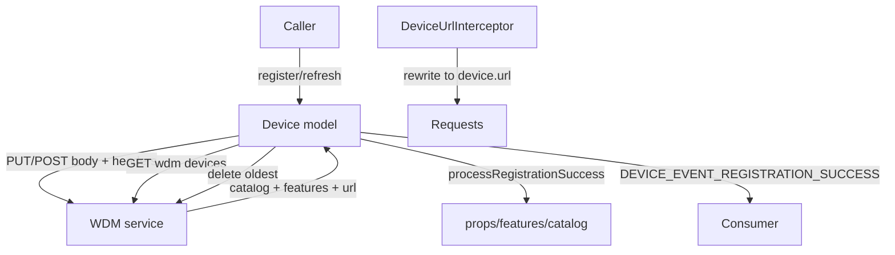
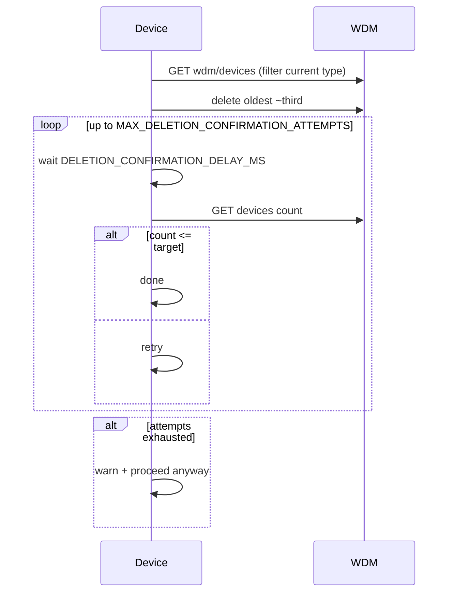
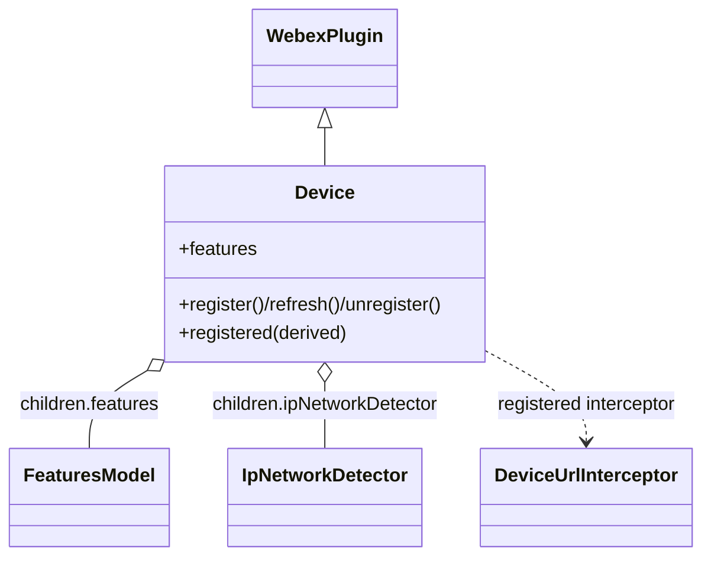

<!-- sdd-generated-metadata
generator: claude-cli
generator_model: us.anthropic.claude-opus-4-8
approved_by: pending-human-review
updated_at: 2026-08-06T00:00:00Z
validation_status: not-run
run_id: 51855eac-8de5-43a2-a3b6-dbcc55ebc91b
-->

# @webex/internal-plugin-device — SPEC

> Start here → root [`AGENTS.md`](../../../../AGENTS.md) (agent entry) · router [`SPEC_INDEX.md`](../../../../ai-docs/SPEC_INDEX.md) · system [`ARCHITECTURE.md`](../../../../ai-docs/ARCHITECTURE.md). This is the module's canonical spec: orientation, requirements, design, flows, state, protocol, and tests.
> Context-efficiency: link to canonical docs — don't duplicate them. Load specs on demand per `SPEC_INDEX.md`.

## Metadata

| Field | Value |
|---|---|
| Module id | `internal-plugin-device` |
| Source path(s) | `packages/@webex/internal-plugin-device/src/` |
| Parent spec | `—` (registered internal Webex plugin; composed by `webex-core`, no parent module) |
| Doc kind | Module spec |
| Coverage score | Pending coverage assessment |
| Generated from | `module-spec` @ SDLC template library `0.2.2` |
| generated_by / approved_by / updated_at | claude-cli / pending-human-review / 2026-08-06 |
| Validation status | not-run, validator `pending`, assessed 2026-08-06 |

Coverage score is `Pending coverage assessment` until the first coverage review runs. Manifest coverage
state (`Partial`) is authoritative and kept in `.sdd/manifest.json`.

## Evidence Rules
Every requirement cites concrete source evidence using `file path`. Test evidence is preferred for WHY.
Requirements are grounded in the current implementation under `src/` and its unit tests.

## Source Material Register

| Source material | Scope | Decision | Detail location or disposition |
|---|---|---|---|
| `N/A` | none | none | No pre-existing SDD/AI-docs, architecture, or spec documents were routed to this module; content is derived from source and tests. |

## Overview

`@webex/internal-plugin-device` is the internal Webex SDK plugin (registered as `device`) that owns device
registration with the **WDM** (Web Device Manager) service and the resulting service catalog and feature
toggles. Registering a device yields the device `url`, the URL catalog other plugins resolve services
from, feature collections (developer/user/entitlement), and network/meeting inactivity behavior.

The plugin (`src/device.js`) is an ampersand-`WebexPlugin` model whose properties mirror the WDM DTO
(`extraProperties: 'allow'` so DTO changes don't break it) and whose `registered` derived property is true
when `url` is set. It registers a `DeviceUrlInterceptor` so requests can be rewritten to the registered
device URL, ships a metrics hook (`internal-plugin-metrics`) for registration success/failure, and
unregisters automatically on logout via `onBeforeLogout`. It also manages web-device cleanup (deleting the
oldest devices when over a limit) and inactivity/logout timers.

A maintainer should start at `src/device.js` (model + register/refresh/cleanup), `src/index.js`
(registration + interceptor), and `src/features/` (feature collections).

## Purpose / Responsibility

Owns device registration/refresh/unregistration with WDM, the service catalog, feature toggles, and
inactivity/logout timing. It does NOT own individual service semantics (only their catalog URLs), Mercury
transport, or encryption; it provides identity/catalog that other plugins depend on.

## Stack

JavaScript (`devMain: src/index.js`), Node `>=18`. Built with `webex-legacy-tools build` (`-js -ts
-maps`). Unit tests via `webex-legacy-tools test --unit --runner jest`; integration/browser via karma.
Runtime dependencies: `@webex/webex-core` (`WebexPlugin`, `persist`, `waitForValue`),
`@webex/internal-plugin-metrics` (registration metrics), `@webex/common` (`deprecated`, `oneFlight`),
`@webex/common-timers` (`safeSetTimeout`), `@webex/http-core`, `ampersand-collection`, `ampersand-state`,
`lodash`, `uuid`.

## Folder / Package Structure

```
packages/@webex/internal-plugin-device/src/
├── index.js                    # registerInternalPlugin('device', ...); DeviceUrlInterceptor; onBeforeLogout
├── device.js                   # Device model: props, register/refresh/unregister, cleanup, timers
├── constants.js                # feature collection names, event names, cleanup limits/delays
├── config.js                   # ephemeral/TTL, headers, defaults, energyForecast toggles
├── metrics.js                  # METRICS constants for registration success/failure
├── ipNetworkDetector.js        # IpNetworkDetector: ipv4/ipv6 detection helper
├── types.ts                    # CatalogDetails, DeviceRegistrationOptions
├── features/                   # FeatureCollection/FeatureModel/FeaturesModel (feature toggles)
└── interceptors/device-url.js  # DeviceUrlInterceptor: rewrite requests to registered device URL
```

## Key Files (source of truth)

| File | Holds |
|---|---|
| `packages/@webex/internal-plugin-device/src/device.js` | Registration/refresh/unregister, cleanup, inactivity/logout timers, WDM-mapped props |
| `packages/@webex/internal-plugin-device/src/constants.js` | `FEATURE_COLLECTION_NAMES`, `DEVICE_EVENT_REGISTRATION_SUCCESS`, `MIN_DEVICES_FOR_CLEANUP`, `MAX_DELETION_CONFIRMATION_ATTEMPTS`, `DELETION_CONFIRMATION_DELAY_MS` |
| `packages/@webex/internal-plugin-device/src/config.js` | Ephemeral/TTL, default headers, energyForecast toggles |
| `packages/@webex/internal-plugin-device/src/interceptors/device-url.js` | Device-URL request rewriting interceptor |
| `packages/@webex/internal-plugin-device/src/types.ts` | `CatalogDetails`, `DeviceRegistrationOptions` |

## Public Surface

Consumed as an internal SDK plugin via `webex.internal.device`. It calls the WDM service and exposes the
service catalog + feature toggles other plugins depend on.

| Contract ID | Type | Surface | Purpose | Compatibility / deprecation | Schema / detail link | Root index |
|---|---|---|---|---|---|---|
| `device.register` | SDK | `register(options?): Promise` | Register (or re-register) the device with WDM and populate catalog/features | Stable plugin method | `packages/@webex/internal-plugin-device/src/device.js` | `../../../../ai-docs/CONTRACTS.md` |
| `device.refresh` | SDK | `refresh(options?): Promise` | Refresh the existing registration (PUT to `device.url`), re-register on 404 | Stable plugin method | `packages/@webex/internal-plugin-device/src/device.js` | `../../../../ai-docs/CONTRACTS.md` |
| `device.unregister` | SDK | `unregister(): Promise` | Unregister the device (also invoked on logout) | Stable plugin method | `packages/@webex/internal-plugin-device/src/device.js` | `../../../../ai-docs/CONTRACTS.md` |
| `device.registered` | SDK | `registered: boolean` (derived from `url`) | Whether the device is currently registered | Stable derived property | `packages/@webex/internal-plugin-device/src/device.js` | `../../../../ai-docs/CONTRACTS.md` |
| `device.features` | SDK | `features` (FeaturesModel: developer/user/entitlement) | Feature-toggle access for the registered device | Stable plugin surface | `packages/@webex/internal-plugin-device/src/features/` | `../../../../ai-docs/CONTRACTS.md` |
| `device.catalog` | SDK | `webSocketUrl`, service URLs, `orgId`, `userId`, etc. | Catalog/identity fields consumed by other plugins | Stable (extraProperties allowed for DTO growth) | `packages/@webex/internal-plugin-device/src/device.js` | `../../../../ai-docs/CONTRACTS.md` |
| `device.DeviceUrlInterceptor` | interceptor | `DeviceUrlInterceptor` (registered) | Rewrite requests to the registered device URL | Stable interceptor | `packages/@webex/internal-plugin-device/src/interceptors/device-url.js` | `../../../../ai-docs/CONTRACTS.md` |

Compatibility notes:
- Public method names/signatures, the `registered` derived property, and the exported
  `constants`/`CatalogDetails`/`DeviceRegistrationOptions`/`DeviceUrlInterceptor`/feature classes are the
  semver-controlled contract.
- `extraProperties: 'allow'` deliberately tolerates new WDM DTO fields without a code change.

## Requires (dependencies)

- `@webex/webex-core` — `WebexPlugin`, `persist` (cache device), `waitForValue`.
- `@webex/internal-plugin-metrics` — registration success/failure metrics (imported for side effect).
- `@webex/common` — `deprecated`, `oneFlight` (dedupe concurrent register/refresh).
- `@webex/common-timers` — `safeSetTimeout` for inactivity/logout timers.
- `@webex/http-core`, `ampersand-collection`, `ampersand-state`, `lodash`, `uuid` — model/collection/util base.

## Requirements

| ID | WHAT | WHY | Source Evidence | Test / Example Evidence | Assumptions / Gaps | Confidence |
|---|---|---|---|---|---|---|
| `DEVICE-R-001` | `registered` is a derived boolean true only when `url` is set. | A device is "registered" precisely when WDM has returned its URL. | `packages/@webex/internal-plugin-device/src/device.js` | `packages/@webex/internal-plugin-device/test/unit/` | none identified | PRESENT |
| `DEVICE-R-002` | `refresh` PUTs the current body to `this.url` with merged default/config/etag headers, requesting upstream services per `CatalogDetails`, and on 404 clears state and calls `register` to create a new device. | Refresh must renew the registration and self-heal when the device is no longer valid. | `packages/@webex/internal-plugin-device/src/device.js`, `packages/@webex/internal-plugin-device/src/types.ts` | `packages/@webex/internal-plugin-device/test/unit/` | none identified | PRESENT |
| `DEVICE-R-003` | A per-request refresh id (`refresh-request-id`) guards responses: if it changed (e.g. sign-out mid-flight) the response is ignored rather than processed. | Prevents a stale in-flight refresh from clobbering post-logout state. | `packages/@webex/internal-plugin-device/src/device.js` | `packages/@webex/internal-plugin-device/test/unit/` | none identified | PRESENT |
| `DEVICE-R-004` | The plugin auto-unregisters on logout via the `onBeforeLogout` hook returning `this.unregister()`. | The device must be released when the Webex instance logs out. | `packages/@webex/internal-plugin-device/src/index.js` | `packages/@webex/internal-plugin-device/test/unit/` | none identified | PRESENT |
| `DEVICE-R-005` | When web devices exceed the limit, cleanup deletes the oldest ~third and then confirms via `_waitForDeviceCountBelowLimit`, polling up to `MAX_DELETION_CONFIRMATION_ATTEMPTS` with `DELETION_CONFIRMATION_DELAY_MS` between checks, proceeding anyway if unconfirmed. | Bounding device count avoids WDM limits while tolerating eventual-consistency lag. | `packages/@webex/internal-plugin-device/src/device.js`, `packages/@webex/internal-plugin-device/src/constants.js` | `packages/@webex/internal-plugin-device/test/unit/` | none identified | PRESENT |
| `DEVICE-R-006` | `_getDevicesOfCurrentType` GETs `service: wdm`, `resource: devices` and filters the list to the current `deviceType`. | Cleanup must operate only on devices of the same type as the current one. | `packages/@webex/internal-plugin-device/src/device.js` | `packages/@webex/internal-plugin-device/test/unit/` | none identified | PRESENT |
| `DEVICE-R-007` | The `DeviceUrlInterceptor` is registered so outgoing requests can be rewritten against the registered device URL. | Requests must target the registered device URL consistently. | `packages/@webex/internal-plugin-device/src/index.js`, `packages/@webex/internal-plugin-device/src/interceptors/device-url.js` | `packages/@webex/internal-plugin-device/test/unit/` | none identified | PRESENT |
| `DEVICE-R-008` | An ephemeral device (`config.ephemeral`) sends a `ttl` (`config.ephemeralDeviceTTL`) in the registration/refresh body. | Ephemeral devices must expire server-side rather than persist. | `packages/@webex/internal-plugin-device/src/device.js`, `packages/@webex/internal-plugin-device/src/config.js` | `packages/@webex/internal-plugin-device/test/unit/` | none identified | PRESENT |

## Design Overview

`Device` is an ampersand model plugin: its `props` mirror the WDM DTO (with `extraProperties: 'allow'`),
`derived.registered` is computed from `url`, and `session` holds runtime timers/flags (logout timer,
`lastUserActivityDate`, `isInMeeting`, `isInNetwork`, energy-forecast toggle). Registration/refresh build a
body from these props, strip non-DTO fields (`features`, `mediaCluster`, `etag`), merge headers (including
`If-None-Match` from `etag`), and PUT/POST to WDM, then `processRegistrationSuccess` stores the returned
catalog/features and emits `DEVICE_EVENT_REGISTRATION_SUCCESS`.

Concurrency-sensitive operations use `oneFlight` to dedupe, and a `refresh-request-id` guards against
processing a response after sign-out. Web-device cleanup deletes the oldest devices when over
`MIN_DEVICES_FOR_CLEANUP` and confirms the count dropped with a bounded poll loop. The `DeviceUrlInterceptor`
and `internal-plugin-metrics` import wire the catalog rewriting and registration telemetry, and
`onBeforeLogout` releases the device.

## Data Flow



## Sequence Diagram(s)

Sequence coverage:

| Operation group | Diagram | Failure / recovery coverage |
|---|---|---|
| Register/refresh | 1. Register/refresh | `alt` covers 404 → clear + re-register and stale `refresh-request-id` → ignore |
| Web-device cleanup | 2. Cleanup | `alt` covers confirmation timeout (proceed anyway) |

### 1. Register / refresh

```mermaid
sequenceDiagram
    participant C as Caller
    participant D as Device
    participant W as WDM
    C->>D: refresh(options)
    D->>D: build body; set refresh-request-id
    D->>W: PUT device.url (headers, includeUpstreamServices)
    alt request-id changed (signed out)
        D-->>C: resolve() — ignore response
    else 404 (device invalid)
        D->>D: clear()
        D->>D: register(options) (new device)
    else success
        D->>D: processRegistrationSuccess(response)
        D-->>C: resolve()
    end
```

### 2. Web-device cleanup



## Class / Component Relationships



`Device` composes a `FeaturesModel` and `IpNetworkDetector`, and installs a `DeviceUrlInterceptor` on the
request stack.

## Use Cases

- **UC-1 Register a device:** `register()` populates the catalog/features other plugins consume. Evidence: `packages/@webex/internal-plugin-device/src/device.js`.
- **UC-2 Refresh + self-heal:** `refresh()` renews the device and re-registers on a 404. Evidence: `packages/@webex/internal-plugin-device/src/device.js`.
- **UC-3 Logout cleanup:** `onBeforeLogout` unregisters the device automatically. Evidence: `packages/@webex/internal-plugin-device/src/index.js`.

## State Model

Device state is the ampersand model: `url` (identity), the WDM-mapped `props`, and `session` runtime fields
(`logoutTimer`, `lastUserActivityDate`, `isReachabilityChecked`, `energyForecastConfig`, `isInMeeting`,
`isInNetwork`). `derived.registered` recomputes from `url`. Evidence:
`packages/@webex/internal-plugin-device/src/device.js`.

## Concurrency & Reactive Flow

Register/refresh are deduped with `oneFlight` and guarded by a per-request `refresh-request-id` so a
response arriving after sign-out is ignored. Cleanup confirmation polls the server up to a bounded number
of attempts (accounting for eventual consistency) and proceeds anyway on timeout. Inactivity/logout timers
use `safeSetTimeout` and are reset based on user activity/network state. Evidence:
`packages/@webex/internal-plugin-device/src/device.js`, `packages/@webex/internal-plugin-device/src/constants.js`.

## Protocol / Wire Format

Registration/refresh PUT/POST a device body to WDM with headers including `If-None-Match` (etag) and a
`includeUpstreamServices` query derived from `CatalogDetails` (optionally appending `energyforecast`).
Non-DTO fields (`features`, `mediaCluster`, `etag`) are stripped from the body; ephemeral devices add
`ttl`. Device listing uses `service: wdm`, `resource: devices`. Evidence:
`packages/@webex/internal-plugin-device/src/device.js`, `packages/@webex/internal-plugin-device/src/types.ts`.

## Data / Schema

- No local relational store; the device DTO (props) and returned catalog/features are held in the ampersand
  model, optionally persisted via `persist`.
- `constants.js` owns `MIN_DEVICES_FOR_CLEANUP`, `MAX_DELETION_CONFIRMATION_ATTEMPTS`,
  `DELETION_CONFIRMATION_DELAY_MS`, `FEATURE_COLLECTION_NAMES`, and event names.

## Error Handling & Failure Modes

| Condition | Signal (error/code/result) | Caller recovery |
|---|---|---|
| Refresh finds device invalid | 404 → clear + `register` (new device) | Transparent re-registration |
| Response after sign-out | stale `refresh-request-id` → response ignored | No action; state preserved |
| Cleanup count not confirmed | warn + proceed anyway after max attempts | Eventual consistency assumed |
| Registration failure | rejected promise (metrics recorded) | Retry after resolving cause |

## Pitfalls

- `extraProperties: 'allow'` means unknown WDM fields are accepted silently — don't rely on the props list
  being exhaustive.
- Refresh responses can be ignored if `refresh-request-id` changed; don't assume every refresh mutates state.
- Cleanup deletes the oldest ~third of same-type devices; be cautious changing the limit constants.
- The body must strip `features`/`mediaCluster`/`etag` before sending; adding fields requires updating the
  strip list.

## Module Do's / Don'ts

- DO resolve service URLs from the device catalog rather than hardcoding hosts.
- DO let `refresh` self-heal on 404 instead of manually re-registering.
- DON'T process a registration/refresh response without checking `refresh-request-id`.

## Test-Case Strategy (module)

Unit tests (Jest) mock `webex.request` and assert: `registered` derivation from `url`; refresh header/body
construction and 404 re-register; `refresh-request-id` stale-response ignore; `onBeforeLogout` unregister;
cleanup deletion + bounded confirmation loop; and ephemeral `ttl` inclusion.

| Behavior / Requirement | Existing test evidence | Gap |
|---|---|---|
| `DEVICE-R-001` | `packages/@webex/internal-plugin-device/test/unit/` | Re-check url→registered |
| `DEVICE-R-002` | `packages/@webex/internal-plugin-device/test/unit/` | Re-check 404 re-register |
| `DEVICE-R-003` | `packages/@webex/internal-plugin-device/test/unit/` | Re-check stale request-id ignore |
| `DEVICE-R-004` | `packages/@webex/internal-plugin-device/test/unit/` | Re-check onBeforeLogout |
| `DEVICE-R-005` | `packages/@webex/internal-plugin-device/test/unit/` | Re-check confirmation timeout path |
| `DEVICE-R-006` | `packages/@webex/internal-plugin-device/test/unit/` | Re-check deviceType filter |
| `DEVICE-R-007` | `packages/@webex/internal-plugin-device/test/unit/` | Re-check interceptor registration |
| `DEVICE-R-008` | `packages/@webex/internal-plugin-device/test/unit/` | Re-check ttl for ephemeral |

## Traceability

- Repo architecture: [`ARCHITECTURE.md`](../../../../ai-docs/ARCHITECTURE.md) · Registry: [`SPEC_INDEX.md`](../../../../ai-docs/SPEC_INDEX.md)
- Coverage state & contracts baseline: `.sdd/manifest.json`
