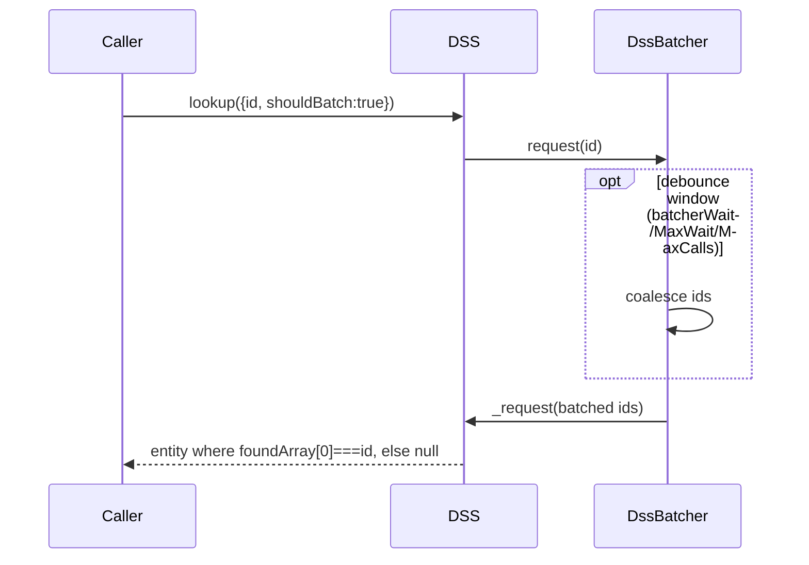
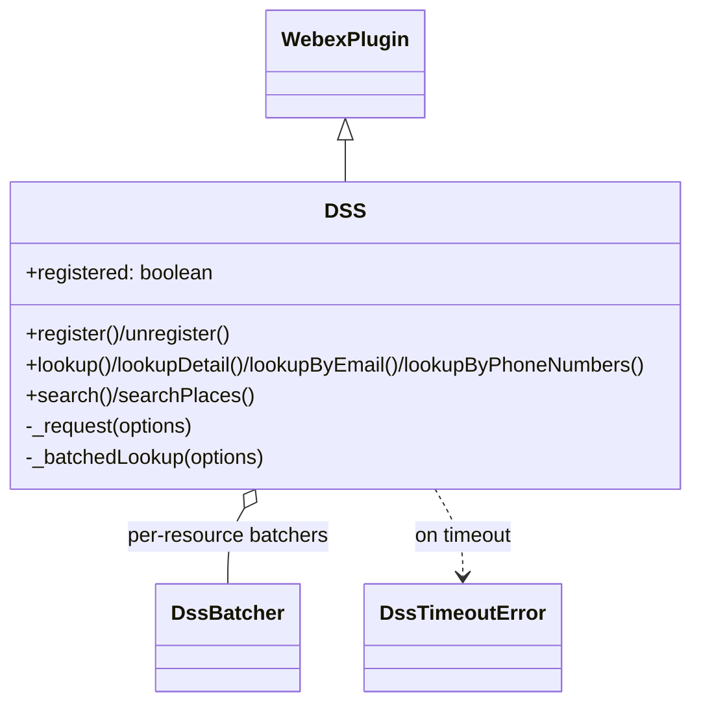

<!-- sdd-generated-metadata
generator: claude-cli
generator_model: us.anthropic.claude-opus-4-8
approved_by: pending-human-review
updated_at: 2026-08-06T00:00:00Z
validation_status: not-run
run_id: 51855eac-8de5-43a2-a3b6-dbcc55ebc91b
-->

# @webex/internal-plugin-dss — SPEC

> Start here → root [`AGENTS.md`](../../../../AGENTS.md) (agent entry) · router [`SPEC_INDEX.md`](../../../../ai-docs/SPEC_INDEX.md) · system [`ARCHITECTURE.md`](../../../../ai-docs/ARCHITECTURE.md). This is the module's canonical spec: orientation, requirements, design, flows, protocol, and tests.
> Context-efficiency: link to canonical docs — don't duplicate them. Load specs on demand per `SPEC_INDEX.md`.

## Metadata

| Field | Value |
|---|---|
| Module id | `internal-plugin-dss` |
| Source path(s) | `packages/@webex/internal-plugin-dss/src/` |
| Parent spec | `—` (registered internal Webex plugin; composed by `webex-core`, no parent module) |
| Doc kind | Module spec |
| Coverage score | Pending coverage assessment |
| Generated from | `module-spec` @ SDLC template library `0.2.2` |
| generated_by / approved_by / updated_at | claude-cli / pending-human-review / 2026-08-06 |
| Validation status | not-run, validator `pending`, assessed 2026-08-06 |

Coverage score is `Pending coverage assessment` until the first coverage review runs. Manifest coverage
state (`Partial`) is authoritative and kept in `.sdd/manifest.json`.

## Evidence Rules
Every requirement cites concrete source evidence using `file path`. Test evidence is preferred for WHY.
Requirements are grounded in the current implementation under `src/` and its unit tests.

## Source Material Register

| Source material | Scope | Decision | Detail location or disposition |
|---|---|---|---|
| `N/A` | none | none | No pre-existing SDD/AI-docs, architecture, or spec documents were routed to this module; content is derived from source and tests. |

## Overview

`@webex/internal-plugin-dss` is the internal Webex SDK plugin (registered as `dss`) that queries the
**Directory Search Service** (`directorySearch`) for entity lookups and searches. It supports id/email/
phone-number lookups (batched or immediate) and entity/place searches, correlating asynchronous results
that arrive over Mercury back to the originating request.

The plugin (`src/dss.ts`, a TypeScript `WebexPlugin`) uses a request/response pattern where each call
POSTs a `requestId` to the service and listens for `directory.lookup`/`directory.search` Mercury events
carrying that id. `_request` assembles paged results (by `sequence`) until `finished`, guarded by a
per-request `Timer` that rejects with `DssTimeoutError` if the server is silent. Lookups can be batched via
`DssBatcher` (debounced) to coalesce many id/email lookups into fewer service calls.

A maintainer should start at `src/dss.ts` (lifecycle, `_request`, public methods), `src/constants.ts`
(event names, data paths), and `src/dss-batcher.ts`.

## Purpose / Responsibility

Owns directory entity/place lookups and searches over the `directorySearch` service, including batching,
Mercury-correlated async result assembly, and per-request timeouts. It does NOT own Mercury transport
(delegates to `webex.internal.mercury`), device/org identity (reads `device.orgId`), or the directory
data itself.

## Stack

TypeScript (`devMain: src/index.ts`), Node `>=16`. Built with `webex-legacy-tools build` (`-js -ts
-maps`). Unit tests via `webex-legacy-tools test --unit --runner jest`; integration/browser via karma.
Runtime dependencies: `@webex/webex-core` (`WebexPlugin`), `@webex/common-timers` (`Timer`),
`@webex/internal-plugin-mercury` (real-time events), `@webex/common`, `lodash`, `uuid`.

## Folder / Package Structure

```
packages/@webex/internal-plugin-dss/src/
├── index.ts          # registerInternalPlugin('dss', DSS, {config})
├── dss.ts            # DSS WebexPlugin: lifecycle, _request, lookup/search methods
├── dss-batcher.ts    # DssBatcher: debounced batching of lookups
├── dss-errors.ts     # DssTimeoutError
├── constants.ts      # event names, service name, lookup/search data paths, SEARCH_TYPES
├── config.ts         # requestTimeout, batcher wait/maxCalls/maxWait
└── types.ts          # option/result interfaces
```

## Key Files (source of truth)

| File | Holds |
|---|---|
| `packages/@webex/internal-plugin-dss/src/dss.ts` | Register/unregister, `_request` result assembly, `lookup*`/`search*` methods |
| `packages/@webex/internal-plugin-dss/src/constants.ts` | `DSS_SERVICE_NAME` (`directorySearch`), event names, `LOOKUP_*`/`SEARCH_DATA_PATH`, `SEARCH_TYPES` |
| `packages/@webex/internal-plugin-dss/src/config.ts` | `requestTimeout` (6000), `batcherWait` (50), `batcherMaxCalls` (50), `batcherMaxWait` (150) |
| `packages/@webex/internal-plugin-dss/src/dss-batcher.ts` | Batching/debounce of id/email lookups |

## Public Surface

Consumed as an internal SDK plugin via `webex.internal.dss`. It calls the `directorySearch` service and
receives results over Mercury.

| Contract ID | Type | Surface | Purpose | Compatibility / deprecation | Schema / detail link | Root index |
|---|---|---|---|---|---|---|
| `dss.register` | SDK | `register()` / `unregister(): Promise` | Connect Mercury and (un)listen for DSS events | Stable plugin method | `packages/@webex/internal-plugin-dss/src/dss.ts` | `../../../../ai-docs/CONTRACTS.md` |
| `dss.lookup` | SDK | `lookup({id, entityProviderType?, shouldBatch?}): Promise<entity\|null>` | Look up a single entity by id (batched by default) | Stable plugin method | `packages/@webex/internal-plugin-dss/src/dss.ts` | `../../../../ai-docs/CONTRACTS.md` |
| `dss.lookupDetail` | SDK | `lookupDetail({id}): Promise<entity\|null>` | Look up detailed info for an entity | Stable plugin method | `packages/@webex/internal-plugin-dss/src/dss.ts` | `../../../../ai-docs/CONTRACTS.md` |
| `dss.lookupByEmail` | SDK | `lookupByEmail({email}): Promise<entity\|null>` | Look up an entity by email | Stable plugin method | `packages/@webex/internal-plugin-dss/src/dss.ts` | `../../../../ai-docs/CONTRACTS.md` |
| `dss.lookupByPhoneNumbers` | SDK | `lookupByPhoneNumbers(phoneNumbers[]): Promise<RequestResult>` | Look up up to 5 E.164 numbers; returns found/notFound arrays | Stable; rejects if >5 numbers | `packages/@webex/internal-plugin-dss/src/dss.ts` | `../../../../ai-docs/CONTRACTS.md` |
| `dss.search` | SDK | `search({requestedTypes, queryString, resultSize, ...}): Promise<entity[]>` | Search entities (PERSON/CALLING_SERVICE/EXTERNAL_CALLING/ROOM/ROBOT) | Stable plugin method | `packages/@webex/internal-plugin-dss/src/dss.ts` | `../../../../ai-docs/CONTRACTS.md` |
| `dss.searchPlaces` | SDK | `searchPlaces({queryString, resultSize, isOnlySchedulableRooms?}): Promise<entity[]>` | Search places | Stable plugin method | `packages/@webex/internal-plugin-dss/src/dss.ts` | `../../../../ai-docs/CONTRACTS.md` |
| `dss.events` | event | `dss:registered`, `dss:unregistered`, `dss:lookup.result`, `dss:result{requestId}` | Lifecycle and per-request result events | Stable event names (observable contract) | `packages/@webex/internal-plugin-dss/src/constants.ts` | `../../../../ai-docs/CONTRACTS.md` |

Compatibility notes:
- Public method names/signatures, `SEARCH_TYPES` values, and the emitted event names are the
  semver-controlled contract.
- `lookupByPhoneNumbers` enforces a hard cap of 5 numbers per request.

## Requires (dependencies)

- `@webex/webex-core` — `WebexPlugin` base and `registerInternalPlugin`.
- `webex.internal.mercury` — `connect()`, `on/off` for `directory.lookup`/`directory.search` events.
- `webex.internal.device` — `orgId` used to build lookup/search resource paths.
- `@webex/common-timers` — `Timer` for per-request timeouts.
- `@webex/common`, `lodash` (`range`/`isEqual`/`get`), `uuid` — utilities and request-id generation.

## Requirements

| ID | WHAT | WHY | Source Evidence | Test / Example Evidence | Assumptions / Gaps | Confidence |
|---|---|---|---|---|---|---|
| `DSS-R-001` | `register()` rejects if `webex.canAuthorize` is false, no-ops if already registered, else connects Mercury, listens for lookup/search events, sets `registered=true`, and triggers `dss:registered`. | Registration must be authorization-gated and idempotent. | `packages/@webex/internal-plugin-dss/src/dss.ts` | `packages/@webex/internal-plugin-dss/test/unit/` | none identified | PRESENT |
| `DSS-R-002` | `unregister()` no-ops if not registered, else stops listening for lookup/search events, triggers `dss:unregistered`, and sets `registered=false`. | Clean, idempotent teardown of Mercury listeners. | `packages/@webex/internal-plugin-dss/src/dss.ts` | `packages/@webex/internal-plugin-dss/test/unit/` | none identified | PRESENT |
| `DSS-R-003` | `_request` POSTs `{requestId, ...params}` to `directorySearch`, listens on `dss:result{requestId}`, assembles paged results keyed by `sequence` until `finished`, then resolves `{resultArray, foundArray?, notFoundArray?}`. | Async, potentially paged directory results must be correlated and fully assembled before resolving. | `packages/@webex/internal-plugin-dss/src/dss.ts`, `packages/@webex/internal-plugin-dss/src/constants.ts` | `packages/@webex/internal-plugin-dss/test/unit/` | none identified | PRESENT |
| `DSS-R-004` | A per-request `Timer` (default `config.requestTimeout` 6000 ms) resets on each chunk and, on expiry, stops listening and rejects with `DssTimeoutError`. | A silent server must fail the request deterministically rather than hang. | `packages/@webex/internal-plugin-dss/src/dss.ts`, `packages/@webex/internal-plugin-dss/src/config.ts` | `packages/@webex/internal-plugin-dss/test/unit/` | none identified | PRESENT |
| `DSS-R-005` | `lookup` batches by default via `DssBatcher` (debounced by `batcherWait`/`batcherMaxWait`/`batcherMaxCalls`), or issues an immediate `_request` when `shouldBatch` is false; it resolves the entity when `foundArray[0] === id`, else null. | Batching coalesces many lookups into fewer service calls while allowing immediate single lookups. | `packages/@webex/internal-plugin-dss/src/dss.ts`, `packages/@webex/internal-plugin-dss/src/dss-batcher.ts`, `packages/@webex/internal-plugin-dss/src/config.ts` | `packages/@webex/internal-plugin-dss/test/unit/` | none identified | PRESENT |
| `DSS-R-006` | `lookupByPhoneNumbers` returns empty arrays for an empty input, rejects when more than 5 numbers are supplied, else looks up via the `phonenumbers` resource returning `{resultArray, foundArray, notFoundArray}`. | The service caps phone lookups at 5; clients must batch beyond that. | `packages/@webex/internal-plugin-dss/src/dss.ts` | `packages/@webex/internal-plugin-dss/test/unit/` | none identified | PRESENT |
| `DSS-R-007` | `search` posts requestedTypes/queryString/resultSize/include* flags to the `entities` search resource and resolves `resultArray`; `searchPlaces` posts to the `places` resource (with `isOnlySchedulableRooms`). | Entity and place searches share the request pipeline with distinct resources/data paths. | `packages/@webex/internal-plugin-dss/src/dss.ts` | `packages/@webex/internal-plugin-dss/test/unit/` | none identified | PRESENT |

## Design Overview

`DSS` extends `WebexPlugin` with a `registered` flag and a `batchers` map keyed by resource. `register`/
`unregister` manage the Mercury connection and the `directory.lookup`/`directory.search` listeners; both
event types funnel through `_handleEvent`, which triggers a per-request event (`dss:result{requestId}`) plus
the aggregate `dss:lookup.result`.

`_request` is the core primitive: it generates a `requestId`, starts a `Timer`, listens for the per-request
event, and accumulates results by `sequence` until `data.finished` establishes the expected sequence count;
once all sequences are present it resolves an aggregated result (optionally including found/notFound
arrays) and stops listening. Timeouts reset on each chunk (liveness) and reject with `DssTimeoutError`.

Public methods build the org-scoped resource path from `device.orgId` and delegate to `_request` or, for
`lookup`, to a per-resource `DssBatcher` that debounces and coalesces lookup values before issuing a single
batched `_request`.

## Data Flow

```mermaid
flowchart TB
  Caller -->|lookup/search| DSS
  DSS -->|POST requestId + params| Svc[directorySearch service]
  DSS -->|batched lookups| Batcher[DssBatcher]
  Batcher -->|coalesced _request| DSS
  Mercury[Mercury] -->|directory.lookup/search| DSS
  DSS -->|dss:result{requestId}| Assemble[_request result assembly]
  Assemble -->|resultArray/found/notFound| Caller
```

## Sequence Diagram(s)

Sequence coverage:

| Operation group | Diagram | Failure / recovery coverage |
|---|---|---|
| Request + paged result assembly | 1. Request | `alt` covers `finished` finalize and timeout → DssTimeoutError |
| Batched lookup | 2. Batched lookup | `opt` covers debounce coalescing; result maps id→entity or null |

### 1. Request + paged assembly

```mermaid
sequenceDiagram
    participant C as Caller
    participant D as DSS
    participant T as Timer
    participant S as directorySearch
    participant M as Mercury
    C->>D: lookup/search(...)
    D->>T: new Timer(requestTimeout); start
    D->>S: POST {requestId, ...params}
    loop result chunks (via Mercury → dss:result{requestId})
        M->>D: chunk (sequence, data)
        D->>T: reset()
        D->>D: accumulate by sequence
    end
    alt finished + all sequences present
        D->>T: cancel(); stopListening
        D-->>C: {resultArray, foundArray?, notFoundArray?}
    else timeout
        T->>D: fire
        D-->>C: reject(DssTimeoutError)
    end
```

### 2. Batched lookup



## Class / Component Relationships



`DSS` extends `WebexPlugin`, owns a map of per-resource `DssBatcher`s, and rejects with `DssTimeoutError`.

## Use Cases

- **UC-1 Look up a person by id:** `register()` then `lookup({id})` (batched) resolves the entity. Evidence: `packages/@webex/internal-plugin-dss/src/dss.ts`.
- **UC-2 Search entities:** `search({requestedTypes:['PERSON'], queryString})` resolves matches. Evidence: `packages/@webex/internal-plugin-dss/src/dss.ts`.
- **UC-3 Phone-number lookup:** `lookupByPhoneNumbers(['+1555...'])` returns found/notFound arrays. Evidence: `packages/@webex/internal-plugin-dss/src/dss.ts`.

## Concurrency & Reactive Flow

Every request is correlated by a unique `requestId`, so concurrent lookups/searches never cross results.
The per-request `Timer` is reset on each chunk (idle/liveness timeout) and cancelled on `finished`. Batched
lookups are debounced by `DssBatcher` (`batcherWait`/`batcherMaxWait`/`batcherMaxCalls`) to coalesce calls.
Paged results are assembled by `sequence` and completed only when all expected sequences arrive. Evidence:
`packages/@webex/internal-plugin-dss/src/dss.ts`, `packages/@webex/internal-plugin-dss/src/dss-batcher.ts`.

## Protocol / Wire Format

Requests POST to `service: directorySearch` at org-scoped resources: `/lookup/orgid/{orgId}/identities`
(or `/entityprovidertype/{type}`), `/identity/{id}/detail`, `/emails`, `/phonenumbers`,
`/search/orgid/{orgId}/entities`, and `/search/orgid/{orgId}/places`, each with `{requestId, ...params}`.
Results arrive over Mercury as `event:directory.lookup`/`event:directory.search`, with data at
`lookupResult.entities`/`entitiesFound`/`entitiesNotFound` (lookups) or `directoryEntities` (search).
Evidence: `packages/@webex/internal-plugin-dss/src/dss.ts`, `packages/@webex/internal-plugin-dss/src/constants.ts`.

## Data / Schema

- No datastore of its own. `config.ts` owns `requestTimeout` (6000 ms) and batcher tunables
  (`batcherWait` 50, `batcherMaxCalls` 50, `batcherMaxWait` 150).
- `constants.ts` owns data-path strings and `SEARCH_TYPES` (PERSON/CALLING_SERVICE/EXTERNAL_CALLING/ROOM/ROBOT).

## Error Handling & Failure Modes

| Condition | Signal (error/code/result) | Caller recovery |
|---|---|---|
| SDK cannot authorize | `register()` rejects `Error('SDK cannot authorize')` | Authorize first |
| Server silent past timeout | reject `DssTimeoutError` | Retry the request |
| >5 phone numbers | reject `Error('...maximum of 5 phone numbers...')` | Batch client-side into groups of 5 |
| Empty phone-number input | resolves `{resultArray:[], foundArray:[], notFoundArray:[]}` | No action |
| Lookup not found | resolves `null` (id/email not in `foundArray[0]`) | Treat as absent |

## Pitfalls

- The per-request `Timer` resets on every chunk, so it is an idle timeout, not a total-duration cap.
- `lookup` batches by default; pass `shouldBatch: false` when you need an immediate single result.
- `lookupByPhoneNumbers` rejects (not truncates) above 5 numbers — batching is the caller's responsibility.
- Results are only complete when `finished` plus all `sequence` chunks arrive; partial sequences won't resolve.

## Module Do's / Don'ts

- DO `register()` before issuing lookups/searches (no Mercury listeners → no results).
- DO batch phone-number lookups into groups of 5 or fewer.
- DON'T assume a lookup resolves to an entity — it resolves `null` when not found.

## Test-Case Strategy (module)

Unit tests (Jest) mock `webex.request`, `mercury`, and `device.orgId`, asserting: authorization-gated/
idempotent register/unregister; `_request` paged assembly and finalize; timeout → `DssTimeoutError`;
batched vs immediate `lookup`; phone-number cap and empty-input handling; and search/searchPlaces resource
paths.

| Behavior / Requirement | Existing test evidence | Gap |
|---|---|---|
| `DSS-R-001` | `packages/@webex/internal-plugin-dss/test/unit/` | Re-check reject + already-registered no-op |
| `DSS-R-002` | `packages/@webex/internal-plugin-dss/test/unit/` | Re-check not-registered no-op |
| `DSS-R-003` | `packages/@webex/internal-plugin-dss/test/unit/` | Re-check multi-sequence assembly |
| `DSS-R-004` | `packages/@webex/internal-plugin-dss/test/unit/` | Re-check timer reset + timeout |
| `DSS-R-005` | `packages/@webex/internal-plugin-dss/test/unit/` | Re-check batched vs immediate |
| `DSS-R-006` | `packages/@webex/internal-plugin-dss/test/unit/` | Re-check >5 reject + empty input |
| `DSS-R-007` | `packages/@webex/internal-plugin-dss/test/unit/` | Re-check entities vs places resource |

## Traceability

- Repo architecture: [`ARCHITECTURE.md`](../../../../ai-docs/ARCHITECTURE.md) · Registry: [`SPEC_INDEX.md`](../../../../ai-docs/SPEC_INDEX.md)
- Coverage state & contracts baseline: `.sdd/manifest.json`
