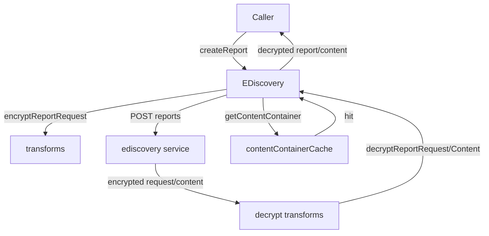
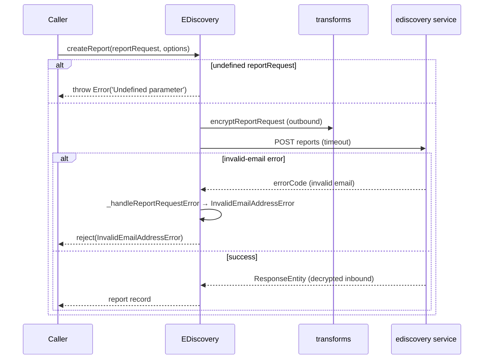
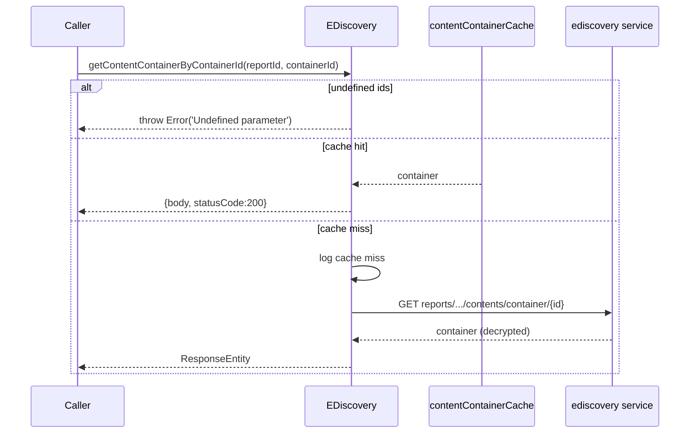
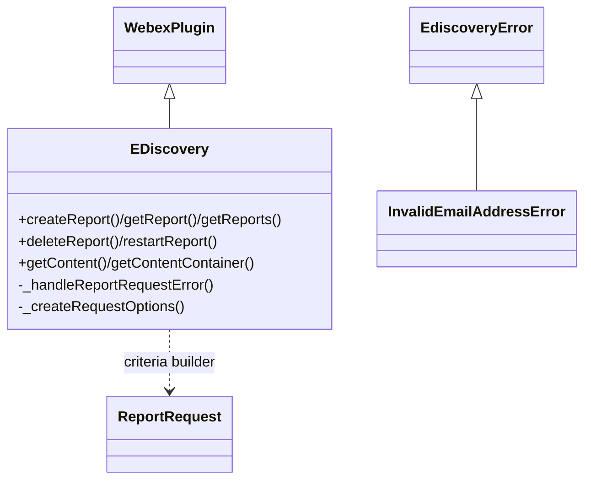

<!-- sdd-generated-metadata
generator: claude-cli
generator_model: us.anthropic.claude-opus-4-8
approved_by: pending-human-review
updated_at: 2026-08-06T00:00:00Z
validation_status: not-run
run_id: 51855eac-8de5-43a2-a3b6-dbcc55ebc91b
-->

# @webex/internal-plugin-ediscovery — SPEC

> Start here → root [`AGENTS.md`](../../../../AGENTS.md) (agent entry) · router [`SPEC_INDEX.md`](../../../../ai-docs/SPEC_INDEX.md) · system [`ARCHITECTURE.md`](../../../../ai-docs/ARCHITECTURE.md). This is the module's canonical spec: orientation, requirements, design, flows, protocol, and tests.
> Context-efficiency: link to canonical docs — don't duplicate them. Load specs on demand per `SPEC_INDEX.md`.

## Metadata

| Field | Value |
|---|---|
| Module id | `internal-plugin-ediscovery` |
| Source path(s) | `packages/@webex/internal-plugin-ediscovery/src/` |
| Parent spec | `—` (registered internal Webex plugin; composed by `webex-core`, no parent module) |
| Doc kind | Module spec |
| Coverage score | Pending coverage assessment |
| Generated from | `module-spec` @ SDLC template library `0.2.2` |
| generated_by / approved_by / updated_at | claude-cli / pending-human-review / 2026-08-06 |
| Validation status | not-run, validator `pending`, assessed 2026-08-06 |

Coverage score is `Pending coverage assessment` until the first coverage review runs. Manifest coverage
state (`Partial`) is authoritative and kept in `.sdd/manifest.json`.

## Evidence Rules
Every requirement cites concrete source evidence using `file path`. Test evidence is preferred for WHY.
Requirements are grounded in the current implementation under `src/` and its unit tests.

## Source Material Register

| Source material | Scope | Decision | Detail location or disposition |
|---|---|---|---|
| `N/A` | none | none | No pre-existing SDD/AI-docs, architecture, or spec documents were routed to this module; content is derived from source and tests. |

## Overview

`@webex/internal-plugin-ediscovery` is the internal Webex SDK plugin (registered as `ediscovery`) used by
compliance officers to run eDiscovery/compliance reports and retrieve their (decrypted) content. It creates
report requests with search criteria (keywords, spaces, emails), polls report status, and fetches the
resulting activities/content containers — decrypting encrypted report requests and content as it arrives.

The plugin (`src/ediscovery.js`, a `WebexPlugin`) exposes async report lifecycle methods
(`createReport`/`getReport`/`getReports`/`deleteReport`/`restartReport`) and content retrieval
(`getContent`/`getContentContainer`/`getContentContainerByContainerId`), guarded by `@waitForValue('@')`
and (for content) `@oneFlight` keyed on request parameters to dedupe concurrent identical requests. A
per-instance `contentContainerCache` (a `Map`) short-circuits repeat container lookups. Encryption/
decryption of report requests and content is wired via payload transformer predicates/transforms in
`src/index.js` delegating to `Transforms`.

A maintainer should start at `src/ediscovery.js` (report/content methods), `src/index.js` (transform
wiring), and `src/transforms.js`.

## Purpose / Responsibility

Owns compliance report lifecycle and decrypted content retrieval over the `ediscovery` service, including
request/content encryption-decryption transforms, request de-duplication, and container caching. It does
NOT own KMS crypto (delegates to the conversation/encryption transforms), Mercury transport, or the report
data itself.

## Stack

JavaScript (`devMain: src/index.js`), Node `>=18`. Built with `webex-legacy-tools build` (`-js -ts
-maps`). Unit tests via `webex-legacy-tools test --unit --runner jest`. Runtime dependencies:
`@webex/webex-core` (`WebexPlugin`, `waitForValue`), `@webex/common` (`oneFlight`),
`@webex/internal-plugin-encryption`, `@webex/internal-plugin-conversation`,
`@webex/internal-plugin-mercury`, `lodash`, `uuid`.

## Folder / Package Structure

```
packages/@webex/internal-plugin-ediscovery/src/
├── index.js               # registerInternalPlugin('ediscovery', ...); encrypt/decrypt transforms
├── ediscovery.js          # EDiscovery WebexPlugin: report + content methods, cache
├── transforms.js          # encrypt/decrypt report request + content transform implementations
├── report-request.js      # ReportRequest builder (exported)
├── ediscovery-error.js    # EdiscoveryError / InvalidEmailAddressError
└── config.js              # defaultOptions (timeouts, offsets/sizes)
```

## Key Files (source of truth)

| File | Holds |
|---|---|
| `packages/@webex/internal-plugin-ediscovery/src/ediscovery.js` | Report lifecycle + content retrieval methods, `contentContainerCache`, error mapping |
| `packages/@webex/internal-plugin-ediscovery/src/transforms.js` | `decryptReportRequest`/`encryptReportRequest`/`decryptReportContent*` implementations |
| `packages/@webex/internal-plugin-ediscovery/src/index.js` | Registration + payload transformer predicates/transforms wiring |
| `packages/@webex/internal-plugin-ediscovery/src/config.js` | `defaultOptions` (e.g. timeoutMs default 30s) |

## Public Surface

Consumed as an internal SDK plugin via `webex.internal.ediscovery`. It calls the `ediscovery` service and
participates in the `webex-core` transform pipeline.

| Contract ID | Type | Surface | Purpose | Compatibility / deprecation | Schema / detail link | Root index |
|---|---|---|---|---|---|---|
| `ediscovery.createReport` | SDK | `createReport(reportRequest, options): Promise<ResponseEntity>` | Create a compliance report from search criteria (encrypted) | Stable plugin method | `packages/@webex/internal-plugin-ediscovery/src/ediscovery.js` | `../../../../ai-docs/CONTRACTS.md` |
| `ediscovery.getReport` / `getReports` | SDK | `getReport(reportId, options)` / `getReports(options): Promise<ResponseEntity>` | Fetch one report or a paged list | Stable plugin method | `packages/@webex/internal-plugin-ediscovery/src/ediscovery.js` | `../../../../ai-docs/CONTRACTS.md` |
| `ediscovery.deleteReport` / `restartReport` | SDK | `deleteReport(reportId, options)` / `restartReport(reportId, options): Promise<ResponseEntity>` | Delete a report or restart it from scratch | Stable plugin method | `packages/@webex/internal-plugin-ediscovery/src/ediscovery.js` | `../../../../ai-docs/CONTRACTS.md` |
| `ediscovery.getContent` | SDK | `getContent(reportId, options): Promise<ResponseEntity<[Activity]>>` | Fetch a report's decrypted activities (paged, one-flight) | Stable plugin method | `packages/@webex/internal-plugin-ediscovery/src/ediscovery.js` | `../../../../ai-docs/CONTRACTS.md` |
| `ediscovery.getContentContainer` / `getContentContainerByContainerId` | SDK | `getContentContainer(reportId, options)` / `...ByContainerId(reportId, containerId, options): Promise` | Fetch content containers (cached; one-flight) | Stable plugin method | `packages/@webex/internal-plugin-ediscovery/src/ediscovery.js` | `../../../../ai-docs/CONTRACTS.md` |
| `ediscovery.ReportRequest` | SDK | `ReportRequest` (exported) | Builder for report request criteria | Stable export | `packages/@webex/internal-plugin-ediscovery/src/report-request.js` | `../../../../ai-docs/CONTRACTS.md` |
| `ediscovery.errors` | SDK | `EdiscoveryError`, `InvalidEmailAddressError` (exported) | Typed errors (invalid-email carries the invalid list) | Stable export | `packages/@webex/internal-plugin-ediscovery/src/ediscovery-error.js` | `../../../../ai-docs/CONTRACTS.md` |

Compatibility notes:
- Public method names/signatures, the exported `ReportRequest`/error classes, and the transform predicate
  names are the semver-controlled contract.
- Content methods are `@oneFlight`-deduped by a key composed of `reportId` + offset/size/types.

## Requires (dependencies)

- `@webex/webex-core` — `WebexPlugin` base, `registerInternalPlugin`, `waitForValue`.
- `@webex/common` — `oneFlight` request de-duplication decorator.
- `@webex/internal-plugin-encryption` / `@webex/internal-plugin-conversation` — decrypt/encrypt of report
  requests and activity content via the shared transform pipeline.
- `@webex/internal-plugin-mercury` — imported for side effect (event transport availability).
- `lodash`, `uuid` — utilities and id generation.

## Requirements

| ID | WHAT | WHY | Source Evidence | Test / Example Evidence | Assumptions / Gaps | Confidence |
|---|---|---|---|---|---|---|
| `EDISCOVERY-R-001` | `createReport` throws for an undefined `reportRequest`, merges `config.defaultOptions`, and POSTs the request to `ediscovery/reports` with the configured timeout. | Report creation must validate input and honor default/overridable timeouts. | `packages/@webex/internal-plugin-ediscovery/src/ediscovery.js` | `packages/@webex/internal-plugin-ediscovery/test/unit/` | none identified | PRESENT |
| `EDISCOVERY-R-002` | `_handleReportRequestError` converts an invalid-email error code into an `InvalidEmailAddressError` carrying the parsed invalid-email list, logging and falling through to reject the original reason on parse failure. | Compliance officers must get a typed, actionable error for invalid recipient emails. | `packages/@webex/internal-plugin-ediscovery/src/ediscovery.js`, `packages/@webex/internal-plugin-ediscovery/src/ediscovery-error.js` | `packages/@webex/internal-plugin-ediscovery/test/unit/` | none identified | PRESENT |
| `EDISCOVERY-R-003` | `getReport`/`deleteReport`/`restartReport` throw for a missing `reportId` and issue GET/DELETE/PUT to `reports/{reportId}` with merged options/timeout. | Single-report operations must validate the id and use the correct verb. | `packages/@webex/internal-plugin-ediscovery/src/ediscovery.js` | `packages/@webex/internal-plugin-ediscovery/test/unit/` | none identified | PRESENT |
| `EDISCOVERY-R-004` | `getReports` GETs `reports` with `offset`/`size` query params from merged options. | Reports must be listable with pagination. | `packages/@webex/internal-plugin-ediscovery/src/ediscovery.js` | `packages/@webex/internal-plugin-ediscovery/test/unit/` | none identified | PRESENT |
| `EDISCOVERY-R-005` | `getContent`/`getContentContainer`/`getContentContainerByContainerId` are `@oneFlight`-deduped (keyed on report/container + offset/size/types) and use `_createRequestOptions` to resolve UUID-or-URL report ids. | Concurrent identical content requests must be coalesced and both id forms supported. | `packages/@webex/internal-plugin-ediscovery/src/ediscovery.js` | `packages/@webex/internal-plugin-ediscovery/test/unit/` | none identified | PRESENT |
| `EDISCOVERY-R-006` | `getContentContainerByContainerId` returns from `contentContainerCache` on a hit (status 200) and only makes a network call (logging a cache miss) otherwise; `getContentContainer` writes results into the cache. | Container lookups are cached per report to avoid redundant service calls. | `packages/@webex/internal-plugin-ediscovery/src/ediscovery.js` | `packages/@webex/internal-plugin-ediscovery/test/unit/` | none identified | PRESENT |
| `EDISCOVERY-R-007` | Inbound transforms decrypt report requests (single/array via `body.reportRequest`) and report content/containers (single/array via `body.activityId`/`body.containerId`); outbound `encryptReportRequest` encrypts requests carrying `keywords`/`spaceNames`/`emails`. | Report criteria and returned content are encrypted and must be transparently (de)crypted. | `packages/@webex/internal-plugin-ediscovery/src/index.js`, `packages/@webex/internal-plugin-ediscovery/src/transforms.js` | `packages/@webex/internal-plugin-ediscovery/test/unit/` | none identified | PRESENT |
| `EDISCOVERY-R-008` | Methods are guarded by `@waitForValue('@')` so they wait until the plugin is fully initialized before executing. | Requests must not run before the plugin/webex instance is ready. | `packages/@webex/internal-plugin-ediscovery/src/ediscovery.js` | `packages/@webex/internal-plugin-ediscovery/test/unit/` | none identified | PRESENT |

## Design Overview

`EDiscovery` extends `WebexPlugin` with a session `contentContainerCache` (a `Map` of reportUUID → Map of
containerId → container). Report methods are thin async wrappers over `this.request` targeting the
`ediscovery` service, merging `config.defaultOptions` for timeouts/paging and validating required ids.
`createReport` maps invalid-email failures into `InvalidEmailAddressError` via `_handleReportRequestError`.

Content methods add two decorators: `@waitForValue('@')` (defer until ready) and `@oneFlight` keyed on the
request parameters so duplicate concurrent fetches share one network call. `_createRequestOptions` accepts
either a report UUID or a full URL and derives the request options plus the report UUID used for caching.

Encryption is handled by the payload transformer wiring in `index.js`: inbound predicates detect
`reportRequest`/`activityId`/`containerId` (single or array) and run the matching `Transforms.decrypt*`;
the outbound predicate detects `keywords`/`spaceNames`/`emails` and runs `Transforms.encryptReportRequest`.

## Data Flow



## Sequence Diagram(s)

Sequence coverage:

| Operation group | Diagram | Failure / recovery coverage |
|---|---|---|
| Create report | 1. Create | `alt` covers undefined request throw and invalid-email → InvalidEmailAddressError |
| Fetch content container | 2. Container | `alt` covers cache hit vs miss; `@oneFlight` dedupes concurrent calls |

### 1. Create report



### 2. Fetch content container (cache + one-flight)



## Class / Component Relationships



`EDiscovery` extends `WebexPlugin`, uses `ReportRequest` for criteria, and raises `EdiscoveryError`/
`InvalidEmailAddressError`.

## Use Cases

- **UC-1 Run a report:** `createReport(reportRequest)` then poll `getReport(reportId)` for status. Evidence: `packages/@webex/internal-plugin-ediscovery/src/ediscovery.js`.
- **UC-2 Retrieve activities:** `getContent(reportId, {offset, size})` returns decrypted activities. Evidence: `packages/@webex/internal-plugin-ediscovery/src/ediscovery.js`.
- **UC-3 Inspect a container:** `getContentContainerByContainerId(reportId, containerId)` (cached). Evidence: `packages/@webex/internal-plugin-ediscovery/src/ediscovery.js`.

## Concurrency & Reactive Flow

Content methods are decorated with `@oneFlight` (keyed on report/container + offset/size/types) so
concurrent identical requests resolve from a single in-flight call. `@waitForValue('@')` defers execution
until the plugin is ready. The `contentContainerCache` `Map` memoizes containers per report to avoid
repeat network calls. Evidence: `packages/@webex/internal-plugin-ediscovery/src/ediscovery.js`.

## Protocol / Wire Format

Requests target `service: ediscovery` at `reports`, `reports/{reportId}`, and content sub-resources
(`/contents`, `/contents/container`, `/contents/container/{containerId}`) with `offset`/`size` query params
and a per-request timeout. Report ids may be a UUID or a full URL (resolved by `_createRequestOptions`).
Report requests and returned content are encrypted; inbound/outbound transforms detect and (de)crypt them
by shape (`reportRequest`, `activityId`, `containerId`, or `keywords`/`spaceNames`/`emails`). Evidence:
`packages/@webex/internal-plugin-ediscovery/src/ediscovery.js`,
`packages/@webex/internal-plugin-ediscovery/src/index.js`.

## Data / Schema

- `contentContainerCache`: in-memory `Map<reportUUID, Map<containerId, container>>`; no persistent store.
- `config.js` owns `defaultOptions` (default `timeoutMs` 30s and paging defaults).

## Error Handling & Failure Modes

| Condition | Signal (error/code/result) | Caller recovery |
|---|---|---|
| Undefined `reportRequest`/`reportId`/`containerId` | throws `Error('Undefined parameter')` | Provide the required parameter |
| Invalid recipient emails | rejects `InvalidEmailAddressError` (carries invalid list) | Correct the emails and retry |
| Invalid-email list unparyseable | logs, rejects original reason | Inspect the underlying error |
| Container cache hit | resolves `{body, statusCode:200}` (no network call) | Use cached data |

## Pitfalls

- Content methods are `@oneFlight`-deduped by parameter key — changing offset/size/types changes the key
  and issues a new request.
- `getContentContainerByContainerId` returns cached containers without a network call; stale caches persist
  for the plugin instance lifetime.
- Report ids can be a UUID or a URL; always route through `_createRequestOptions` rather than assuming a UUID.
- `createReport` maps only the invalid-email error code to a typed error; other errors reject with the raw reason.

## Module Do's / Don'ts

- DO merge `config.defaultOptions` for timeouts/paging rather than hardcoding them.
- DO handle `InvalidEmailAddressError` distinctly to surface the invalid-recipient list.
- DON'T bypass `_createRequestOptions`; report ids may be URLs.

## Test-Case Strategy (module)

Unit tests (Jest) mock `webex.request` and assert: `createReport` validation + invalid-email mapping;
GET/DELETE/PUT report operations with id validation; `getReports` paging; `@oneFlight` dedupe of content
methods; container cache hit/miss; and inbound/outbound encrypt/decrypt transform selection.

| Behavior / Requirement | Existing test evidence | Gap |
|---|---|---|
| `EDISCOVERY-R-001` | `packages/@webex/internal-plugin-ediscovery/test/unit/` | Re-check undefined-request throw |
| `EDISCOVERY-R-002` | `packages/@webex/internal-plugin-ediscovery/test/unit/` | Re-check invalid-email parsing + fallthrough |
| `EDISCOVERY-R-003` | `packages/@webex/internal-plugin-ediscovery/test/unit/` | Re-check verb per method |
| `EDISCOVERY-R-004` | `packages/@webex/internal-plugin-ediscovery/test/unit/` | Re-check offset/size params |
| `EDISCOVERY-R-005` | `packages/@webex/internal-plugin-ediscovery/test/unit/` | Re-check one-flight key + URL/UUID |
| `EDISCOVERY-R-006` | `packages/@webex/internal-plugin-ediscovery/test/unit/` | Re-check cache hit/miss |
| `EDISCOVERY-R-007` | `packages/@webex/internal-plugin-ediscovery/test/unit/` | Re-check each transform predicate |
| `EDISCOVERY-R-008` | `packages/@webex/internal-plugin-ediscovery/test/unit/` | Re-check waitForValue gating |

## Traceability

- Repo architecture: [`ARCHITECTURE.md`](../../../../ai-docs/ARCHITECTURE.md) · Registry: [`SPEC_INDEX.md`](../../../../ai-docs/SPEC_INDEX.md)
- Coverage state & contracts baseline: `.sdd/manifest.json`
