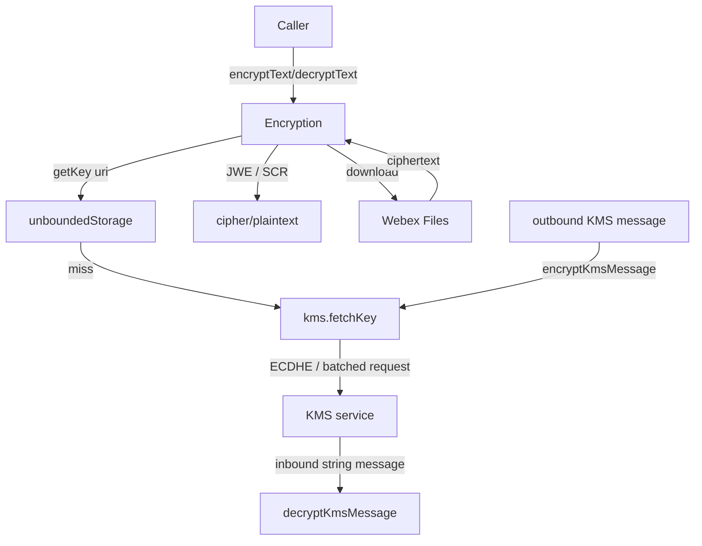
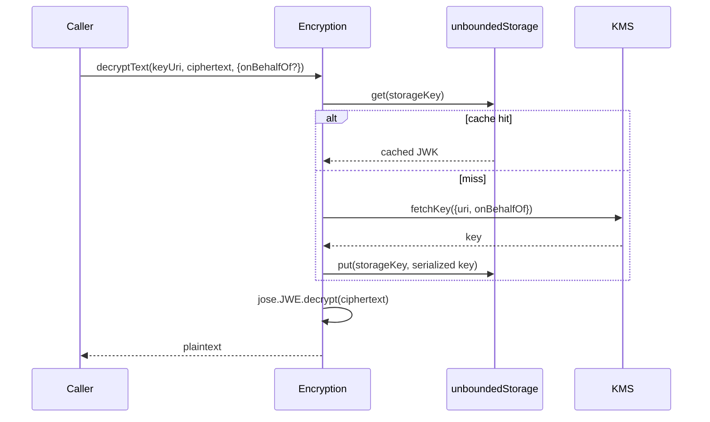
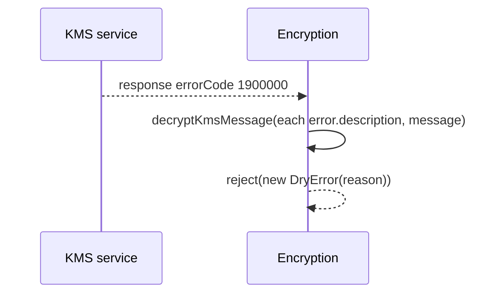
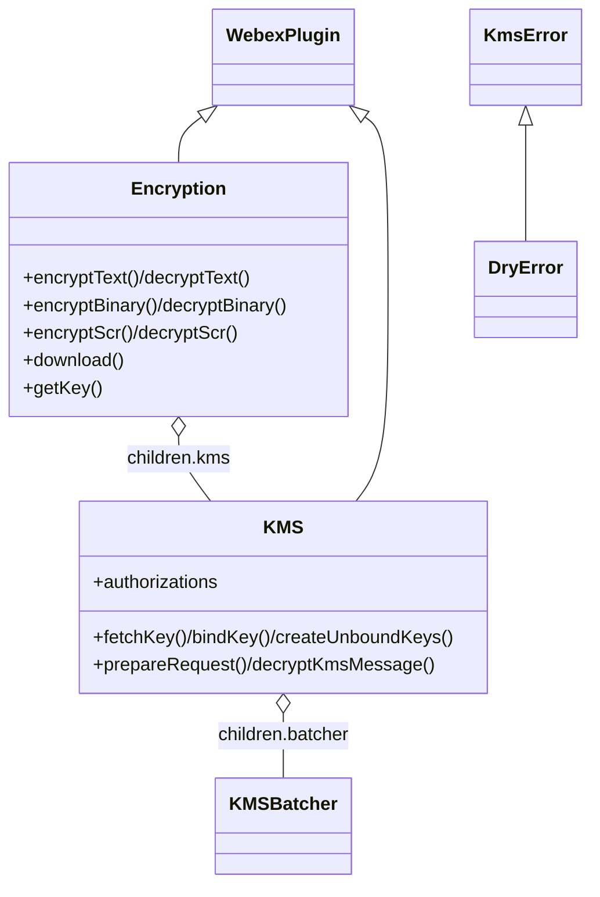

<!-- sdd-generated-metadata
generator: claude-cli
generator_model: us.anthropic.claude-opus-4-8
approved_by: pending-human-review
updated_at: 2026-08-06T00:00:00Z
validation_status: not-run
run_id: 51855eac-8de5-43a2-a3b6-dbcc55ebc91b
-->

# @webex/internal-plugin-encryption — SPEC

> Start here → root [`AGENTS.md`](../../../../AGENTS.md) (agent entry) · router [`SPEC_INDEX.md`](../../../../ai-docs/SPEC_INDEX.md) · system [`ARCHITECTURE.md`](../../../../ai-docs/ARCHITECTURE.md). This is the module's canonical spec: orientation, requirements, design, flows, protocol, security, and tests.
> Context-efficiency: link to canonical docs — don't duplicate them. Load specs on demand per `SPEC_INDEX.md`.

## Metadata

| Field | Value |
|---|---|
| Module id | `internal-plugin-encryption` |
| Source path(s) | `packages/@webex/internal-plugin-encryption/src/` |
| Parent spec | `—` (registered internal Webex plugin; composed by `webex-core`, no parent module) |
| Doc kind | Module spec |
| Coverage score | Pending coverage assessment |
| Generated from | `module-spec` @ SDLC template library `0.2.2` |
| generated_by / approved_by / updated_at | claude-cli / pending-human-review / 2026-08-06 |
| Validation status | not-run, validator `pending`, assessed 2026-08-06 |

Coverage score is `Pending coverage assessment` until the first coverage review runs. Manifest coverage
state (`Partial`) is authoritative and kept in `.sdd/manifest.json`.

## Evidence Rules
Every requirement cites concrete source evidence using `file path`. Test evidence is preferred for WHY.
Requirements are grounded in the current implementation under `src/` and its unit tests.

## Source Material Register

| Source material | Scope | Decision | Detail location or disposition |
|---|---|---|---|
| `N/A` | none | none | No pre-existing SDD/AI-docs, architecture, or spec documents were routed to this module; content is derived from source and tests. |

## Overview

`@webex/internal-plugin-encryption` is the internal Webex SDK plugin (registered as `encryption`) that
provides end-to-end encryption primitives for the SDK: encrypting/decrypting text, binary data, and SCRs
(Secure Content Resources) using keys managed by the **KMS** (Key Management Service). It is the crypto
foundation that conversation, board, calendar, call-ai-summary, ediscovery, and other plugins delegate to.

The plugin has two collaborating `WebexPlugin` classes in the `Encryption` namespace. `Encryption`
(`src/encryption.js`) exposes the high-level API (`encryptText`/`decryptText`, `encryptBinary`/
`decryptBinary`, `encryptScr`/`decryptScr`, `encryptBinaryData`/`decryptBinaryData`, `download`, `getKey`)
built on `node-jose` (JWE) and `node-scr`. Its `kms` child (`src/kms.js`) owns the KMS protocol: ECDHE key
exchange, fetching/binding/creating keys and resources, authorizations, and the batched KMS request/response
transport. `index.js` registration wires the `encryptKmsMessage`/`decryptKmsMessage`/`decryptErrorResponse`
payload transforms and a test-only `KmsDryErrorInterceptor`.

Keys fetched from KMS are cached in `unboundedStorage` (serialized JWK) so repeat decryptions avoid a KMS
round-trip. A maintainer should start at `src/encryption.js` (crypto API), `src/kms.js` (KMS protocol), and
`src/index.js` (transform wiring).

## Purpose / Responsibility

Owns the SDK's client-side cryptography: JWE text/binary encryption+decryption, SCR handling, encrypted
file download, and the KMS protocol (key/resource lifecycle, authorizations, ECDHE). It does NOT own
conversation/board content shapes (callers pass ciphertext/keys), Mercury transport (uses
`internal-plugin-mercury`), or device identity (uses `internal-plugin-device`).

## Stack

JavaScript (`devMain: src/index.js`), Node `>=18`. Built with `webex-legacy-tools build` (`-js -ts
-maps`). Unit tests via Jest; a dedicated `test:integration` runs mocha. Runtime dependencies:
`@webex/webex-core`, `@webex/internal-plugin-device`, `@webex/internal-plugin-mercury`,
`@webex/common`/`@webex/common-timers`, `@webex/http-core`, `node-jose`, `node-kms`, `node-scr`, `pkijs`,
`asn1js`, `isomorphic-webcrypto`, `safe-buffer`, `valid-url`, `lodash`, `uuid`. A browser build swaps
`ensure-buffer.js` for `ensure-buffer.browser.js`.

## Folder / Package Structure

```
packages/@webex/internal-plugin-encryption/src/
├── index.js                       # registerInternalPlugin('encryption', ...); kms transforms; interceptor
├── encryption.js                  # Encryption WebexPlugin: text/binary/SCR crypto, download, getKey
├── kms.js                         # KMS child plugin: ECDHE, key/resource lifecycle, authorizations
├── kms-batcher.js                 # Batches KMS requests over the transport
├── kms-errors.js                  # KmsError / DryError
├── kms-dry-error-interceptor.js   # Test-only interceptor for dry KMS errors
├── kms-certificate-validation.js  # KMS certificate validation
├── ensure-buffer.js(.browser.js)  # Buffer normalization (node/browser variants)
├── constants.js                   # KMS_KEY_REDIRECT_ERROR_CODE, etc.
└── config.js                      # joseOptions and KMS/timeout config
```

## Key Files (source of truth)

| File | Holds |
|---|---|
| `packages/@webex/internal-plugin-encryption/src/encryption.js` | High-level encrypt/decrypt (text/binary/SCR), `download`, `getKey` (with cache) |
| `packages/@webex/internal-plugin-encryption/src/kms.js` | KMS protocol: `fetchKey`/`bindKey`/`createUnboundKeys`, resources, authorizations, ECDHE |
| `packages/@webex/internal-plugin-encryption/src/index.js` | Registration + `encryptKmsMessage`/`decryptKmsMessage`/`decryptErrorResponse` transforms + test interceptor |
| `packages/@webex/internal-plugin-encryption/src/config.js` | `joseOptions` and KMS-related configuration |

## Public Surface

Consumed as an internal SDK plugin via `webex.internal.encryption` (and `webex.internal.encryption.kms`).
It talks to KMS over the batched transport and participates in the `webex-core` transform pipeline.

| Contract ID | Type | Surface | Purpose | Compatibility / deprecation | Schema / detail link | Root index |
|---|---|---|---|---|---|---|
| `encryption.encryptText` / `decryptText` | SDK | `encryptText(key, plaintext, options)` / `decryptText(key, ciphertext, options): Promise<string>` | JWE text encryption/decryption by KMS key uri (supports `onBehalfOf`) | Stable plugin method | `packages/@webex/internal-plugin-encryption/src/encryption.js` | `../../../../ai-docs/CONTRACTS.md` |
| `encryption.encryptBinary` / `decryptBinary` | SDK | `encryptBinary(file)` / `decryptBinary(scr, buffer): Promise` | SCR-based binary encryption + decryption | Stable plugin method | `packages/@webex/internal-plugin-encryption/src/encryption.js` | `../../../../ai-docs/CONTRACTS.md` |
| `encryption.encryptScr` / `decryptScr` | SDK | `encryptScr(key, scr, options)` / `decryptScr(key, cipherScr, options): Promise` | Encrypt/decrypt an SCR JWE using a KMS key | Stable plugin method | `packages/@webex/internal-plugin-encryption/src/encryption.js` | `../../../../ai-docs/CONTRACTS.md` |
| `encryption.encryptBinaryData` / `decryptBinaryData` | SDK | `encryptBinaryData(kmsKeyUri, data, options)` / `decryptBinaryData(kmsKeyUri, JWE, options): Promise` | JWE binary encryption/decryption to/from a Buffer | Stable plugin method | `packages/@webex/internal-plugin-encryption/src/encryption.js` | `../../../../ai-docs/CONTRACTS.md` |
| `encryption.download` | SDK | `download(fileUrl, scr, options): Promise<Buffer>` | Resolve a download URL (via Files) and decrypt the file, emitting progress | Stable plugin method | `packages/@webex/internal-plugin-encryption/src/encryption.js` | `../../../../ai-docs/CONTRACTS.md` |
| `encryption.getKey` | SDK | `getKey(uri, {onBehalfOf}): Promise<Key>` | Fetch (and cache) a KMS key by uri | Stable plugin method | `packages/@webex/internal-plugin-encryption/src/encryption.js` | `../../../../ai-docs/CONTRACTS.md` |
| `encryption.kms` | SDK | `kms.*` (`fetchKey`, `bindKey`, `createUnboundKeys`, resources, authorizations) | Direct KMS protocol operations | Stable plugin surface (exported `KMS`) | `packages/@webex/internal-plugin-encryption/src/kms.js` | `../../../../ai-docs/CONTRACTS.md` |
| `encryption.transforms` | pipeline | `encryptKmsMessage`/`decryptKmsMessage`/`decryptErrorResponse` predicates/transforms | Encrypt outbound / decrypt inbound KMS messages and error responses | Stable pipeline contract | `packages/@webex/internal-plugin-encryption/src/index.js` | `../../../../ai-docs/CONTRACTS.md` |
| `encryption.errors` | SDK | `KmsError`, `DryError` (exported) | Typed KMS errors | Stable export | `packages/@webex/internal-plugin-encryption/src/kms-errors.js` | `../../../../ai-docs/CONTRACTS.md` |

Compatibility notes:
- Public method names/signatures, the exported `KMS`/`KmsError`/`DryError`, and the KMS-message transform
  names are the semver-controlled contract.
- The `onBehalfOf` option (requires the `spark.kms_orgagent` role) is part of the crypto method contract.

## Requires (dependencies)

- `@webex/webex-core` — `WebexPlugin`, `registerInternalPlugin`, request stack, `unboundedStorage`.
- `@webex/internal-plugin-device` — device identity/catalog (imported for KMS/ECDHE prerequisites).
- `@webex/internal-plugin-mercury` — real-time channel used by the KMS protocol.
- `@webex/common`/`@webex/common-timers` — `proxyEvents`/`tap`/`transferEvents`, `oneFlight`, `safeSetTimeout`.
- `node-jose` (JWE), `node-kms` (KMS Context/Request/Response), `node-scr` (SCR), `pkijs`/`asn1js`/
  `isomorphic-webcrypto` (certs/crypto), `safe-buffer`, `valid-url`, `lodash`, `uuid`.

## Requirements

| ID | WHAT | WHY | Source Evidence | Test / Example Evidence | Assumptions / Gaps | Confidence |
|---|---|---|---|---|---|---|
| `ENCRYPTION-R-001` | `decryptText`/`decryptScr`/`decryptBinaryData` fetch the KMS key via `getKey(uri, {onBehalfOf})` then decrypt with `node-jose`/`node-scr`; `encryptText`/`encryptScr`/`encryptBinaryData` do the same and encrypt (JWE `alg: dir`). | All crypto operations are keyed by a KMS uri and must resolve the key before (de)crypting. | `packages/@webex/internal-plugin-encryption/src/encryption.js` | `packages/@webex/internal-plugin-encryption/test/unit/` | Supports `onBehalfOf` (requires `spark.kms_orgagent`) | PRESENT |
| `ENCRYPTION-R-002` | `getKey` returns an in-memory jwk directly for a raw key object; otherwise it reads the cached JWK from `unboundedStorage` (keyed by uri, `/onBehalfOf/{uuid}` when applicable), else `kms.fetchKey` and caches the serialized key. | Key retrieval must be cache-first (per-user) to avoid redundant KMS round-trips. | `packages/@webex/internal-plugin-encryption/src/encryption.js` | `packages/@webex/internal-plugin-encryption/test/unit/` | Uses a `replacer` to serialize private jwk data | PRESENT |
| `ENCRYPTION-R-003` | `decryptBinary` rejects a zero-length buffer, else normalizes it via `ensureBuffer` and decrypts with the SCR; `encryptBinary` creates an SCR, encrypts the buffer, and returns `{scr, cdata}`. | Binary content must be SCR-encrypted, and empty input must fail rather than produce garbage. | `packages/@webex/internal-plugin-encryption/src/encryption.js` | `packages/@webex/internal-plugin-encryption/test/unit/` | none identified | PRESENT |
| `ENCRYPTION-R-004` | `download` requires `fileUrl` and `scr`, resolves a download URL via `_fetchDownloadUrl` (Files `/v1/download/endpoints`, or direct HTTPS when `useFileService:false`, or the localhost bypass in non-prod), fetches the buffer, decrypts it, and proxies progress events. | Encrypted files must be fetched and decrypted with progress, honoring the file-service vs direct-URL modes. | `packages/@webex/internal-plugin-encryption/src/encryption.js` | `packages/@webex/internal-plugin-encryption/test/unit/` | Non-prod localhost URLs bypass Files | PRESENT |
| `ENCRYPTION-R-005` | `_fetchDownloadUrl` rejects a non-HTTPS direct URL (`useFileService:false`), and otherwise falls back to the original `fileUrl` (with a warning) when the Files endpoint mapping is missing or errors. | Direct downloads must be HTTPS; Files failures must degrade to a direct fetch rather than fail. | `packages/@webex/internal-plugin-encryption/src/encryption.js` | `packages/@webex/internal-plugin-encryption/test/unit/` | none identified | PRESENT |
| `ENCRYPTION-R-006` | The outbound `encryptKmsMessage` transform skips templates (empty `keyUris`, `<KRO>`/`<KEYURL>` placeholders) and otherwise wraps the KMS message via `kms.prepareRequest`; the inbound `decryptKmsMessage` transform decrypts string KMS messages. | KMS messages must be wrapped/unwrapped automatically, but unresolved templates must be left for a later transform. | `packages/@webex/internal-plugin-encryption/src/index.js` | `packages/@webex/internal-plugin-encryption/test/unit/` | none identified | PRESENT |
| `ENCRYPTION-R-007` | The inbound `decryptErrorResponse` transform (triggered on `errorCode === 1900000`) decrypts each error description and the message, then rejects with a `DryError`. | Encrypted KMS error responses must be decrypted and surfaced as a typed error. | `packages/@webex/internal-plugin-encryption/src/index.js`, `packages/@webex/internal-plugin-encryption/src/kms-errors.js` | `packages/@webex/internal-plugin-encryption/test/unit/` | none identified | PRESENT |
| `ENCRYPTION-R-008` | `kms.bindKey` requires a `kro`/`kroUri` and a `key`/`keyUri`, rejecting when either is missing before binding. | KMS key binding must have both a resource and a key to be valid. | `packages/@webex/internal-plugin-encryption/src/kms.js` | `packages/@webex/internal-plugin-encryption/test/unit/` | none identified | PRESENT |

## Design Overview

`Encryption` extends `WebexPlugin` and composes a `kms` child. The high-level API is stateless per call:
each operation resolves a key (`getKey`) then uses `node-jose` (JWE, `alg: dir`) for text/binary or
`node-scr` for SCR content. `getKey` is cache-first against `unboundedStorage`, only calling `kms.fetchKey`
on a miss and persisting the serialized key (with a `replacer` that preserves private jwk data).

`KMS` (`src/kms.js`) implements the protocol: ECDHE negotiation, key/resource creation and binding,
authorizations, and a `KMSBatcher` that batches requests over the transport. Registration in `index.js`
installs three payload transforms: `encryptKmsMessage` (wrap outbound KMS messages, skipping unresolved
templates), `decryptKmsMessage` (unwrap inbound string messages), and `decryptErrorResponse` (decrypt
encrypted KMS error bodies and reject with `DryError`). A test-only `KmsDryErrorInterceptor` is installed
under `NODE_ENV=test`.

`download` bridges to Webex Files: it resolves a real download URL (or bypasses for non-prod localhost /
direct HTTPS), fetches the ciphertext buffer, and decrypts it via the SCR, proxying progress events to the
returned promise.

## Data Flow



## Sequence Diagram(s)

Sequence coverage:

| Operation group | Diagram | Failure / recovery coverage |
|---|---|---|
| Decrypt text (key cache) | 1. decryptText | `alt` covers cache hit vs KMS fetch |
| Encrypted file download | 2. download | `alt` covers Files-endpoint miss/error → direct fetch; non-HTTPS direct → reject |
| KMS error response | 3. KMS error | `alt` covers `errorCode 1900000` → decrypt + DryError |

### 1. Decrypt text



### 2. Encrypted download

```mermaid
sequenceDiagram
    participant C as Caller
    participant E as Encryption
    participant F as Webex Files
    C->>E: download(fileUrl, scr, options)
    alt useFileService:false and non-HTTPS
        E-->>C: reject("Direct file URLs must use HTTPS")
    else
        E->>F: POST /v1/download/endpoints {fileUrl}
        alt endpoint resolved
            F-->>E: download url
        else missing/error
            E->>E: warn; fall back to fileUrl
        end
        E->>E: GET buffer; decryptBinary(scr, buffer)
        E-->>C: decrypted Buffer (progress events)
    end
```

### 3. KMS error response



## Class / Component Relationships



`Encryption` composes a `kms` child; `KMS` composes a `KMSBatcher`. `DryError` extends `KmsError`.

## Use Cases

- **UC-1 Decrypt content:** a plugin calls `decryptText(encryptionKeyUrl, ciphertext)` to reveal content. Evidence: `packages/@webex/internal-plugin-encryption/src/encryption.js`.
- **UC-2 Encrypt + upload a file:** `encryptBinary(file)` yields `{scr, cdata}` for Files upload; later `download(fileUrl, scr)` decrypts it. Evidence: `packages/@webex/internal-plugin-encryption/src/encryption.js`.
- **UC-3 Create keys for a new resource:** `kms.createUnboundKeys({count})` and bind them to a resource. Evidence: `packages/@webex/internal-plugin-encryption/src/kms.js`.

## Concurrency & Reactive Flow

Key retrieval is cache-first per (uri, onBehalfOf), so concurrent decryptions of the same content reuse a
cached key. KMS requests are batched via `KMSBatcher` and correlated over the transport; `oneFlight`/
`safeSetTimeout` guard concurrent operations and timeouts. `download` proxies progress events from the
request to the returned promise. Evidence: `packages/@webex/internal-plugin-encryption/src/encryption.js`,
`packages/@webex/internal-plugin-encryption/src/kms.js`.

## Protocol / Wire Format

Content crypto uses JWE (`node-jose`, `alg: dir`) for text/binary and SCR JWE (`node-scr`) for files. KMS
messages are wrapped/unwrapped via `kms.prepareRequest`/`decryptKmsMessage`; outbound wrapping is skipped
for templates (empty `keyUris`, `<KRO>`/`<KEYURL>` placeholders). Encrypted KMS error responses carry
`errorCode 1900000` and are decrypted then surfaced as `DryError`. File downloads resolve via Files
`/v1/download/endpoints`. Evidence: `packages/@webex/internal-plugin-encryption/src/index.js`,
`packages/@webex/internal-plugin-encryption/src/encryption.js`.

## Data / Schema

- Key cache lives in `unboundedStorage` keyed by uri (plus `/onBehalfOf/{uuid}` when applicable); values
  are serialized JWKs (private data preserved by the `replacer`). No relational store.
- `config.js` owns `joseOptions` and KMS/timeout configuration.

## Error Handling & Failure Modes

| Condition | Signal (error/code/result) | Caller recovery |
|---|---|---|
| Decrypt zero-length buffer | rejects `Error('Attempted to decrypt zero-length buffer')` | Ensure non-empty ciphertext |
| `download` missing `fileUrl`/`scr` | rejects `Error('`scr` and `fileUrl` are required')` | Provide both |
| Direct non-HTTPS file URL | rejects `Error('Direct file URLs must use HTTPS')` | Use HTTPS or the file service |
| Files endpoint mapping missing/error | warns, falls back to direct `fileUrl` | Transparent degradation |
| Encrypted KMS error (1900000) | rejects `DryError` (decrypted message/descriptions) | Inspect the decrypted KMS error |
| `bindKey` missing kro/key | rejects `Error('`kro`/`kroUri` is required')` / `'`key`/`keyUri` is required'` | Provide the resource and key |

## Security Considerations

- All content encryption/decryption is keyed by a KMS key uri; keys are fetched over an ECDHE-secured KMS
  channel and cached only as serialized JWKs in `unboundedStorage`.
- `onBehalfOf` decryption requires the caller to hold the `spark.kms_orgagent` role; it fetches keys for
  another user's uuid.
- Direct file downloads are forced to HTTPS; the localhost bypass only applies in non-production.
- The `KmsDryErrorInterceptor` is installed only under `NODE_ENV=test` and must not run in production.

## Pitfalls

- `getKey` caches serialized keys; the `replacer` must preserve private jwk data or decryption will fail —
  don't strip it.
- Outbound `encryptKmsMessage` intentionally skips unresolved templates (`<KRO>`/`<KEYURL>`, empty
  `keyUris`); a later transform must fill them.
- `download` silently falls back to the original URL when the Files mapping is missing — a decrypt failure
  may indicate an unresolved endpoint rather than a crypto error.
- Zero-length buffers are rejected by `decryptBinary`; callers must not pass empty ciphertext.

## Module Do's / Don'ts

- DO route all content crypto through this plugin so key caching and KMS wrapping stay consistent.
- DO use `onBehalfOf` only with the required org-agent role.
- DON'T bypass `getKey`'s cache with ad-hoc KMS fetches, and DON'T enable the dry-error interceptor outside tests.

## Test-Case Strategy (module)

Unit tests (Jest) and integration tests (mocha) mock `unboundedStorage`, `kms`, and the request stack,
asserting: key-cache hit vs KMS fetch in `getKey`; JWE round-trips for text/binary/SCR; zero-length reject;
`download` file-service vs direct/HTTPS modes and fallback; KMS-message wrap/unwrap transform gating;
`decryptErrorResponse` → `DryError`; and `bindKey` validation.

| Behavior / Requirement | Existing test evidence | Gap |
|---|---|---|
| `ENCRYPTION-R-001` | `packages/@webex/internal-plugin-encryption/test/unit/` | Re-check onBehalfOf path |
| `ENCRYPTION-R-002` | `packages/@webex/internal-plugin-encryption/test/unit/` | Re-check cache miss + serialize |
| `ENCRYPTION-R-003` | `packages/@webex/internal-plugin-encryption/test/unit/` | Re-check zero-length reject |
| `ENCRYPTION-R-004` | `packages/@webex/internal-plugin-encryption/test/unit/` | Re-check localhost/direct modes |
| `ENCRYPTION-R-005` | `packages/@webex/internal-plugin-encryption/test/unit/` | Re-check non-HTTPS reject + fallback |
| `ENCRYPTION-R-006` | `packages/@webex/internal-plugin-encryption/test/unit/` | Re-check template skip |
| `ENCRYPTION-R-007` | `packages/@webex/internal-plugin-encryption/test/unit/` | Re-check DryError rejection |
| `ENCRYPTION-R-008` | `packages/@webex/internal-plugin-encryption/test/unit/` | Re-check missing kro/key reject |

## Traceability

- Repo architecture: [`ARCHITECTURE.md`](../../../../ai-docs/ARCHITECTURE.md) · Registry: [`SPEC_INDEX.md`](../../../../ai-docs/SPEC_INDEX.md)
- Coverage state & contracts baseline: `.sdd/manifest.json`
