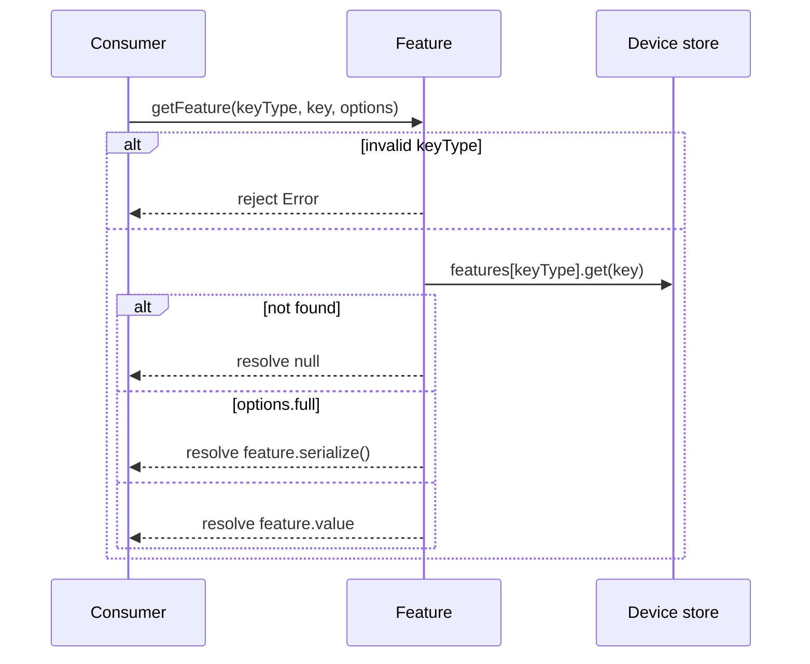
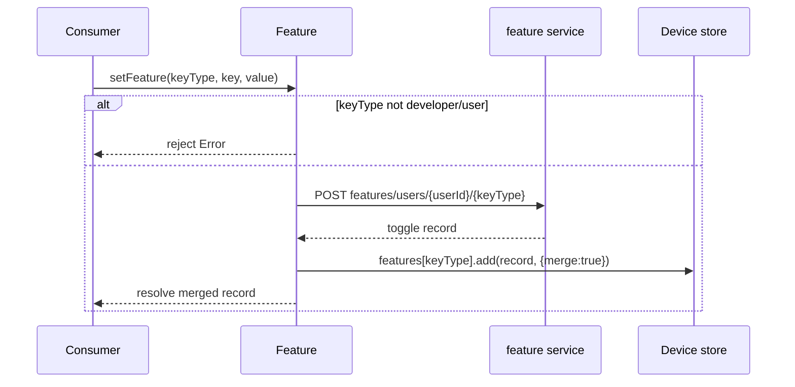
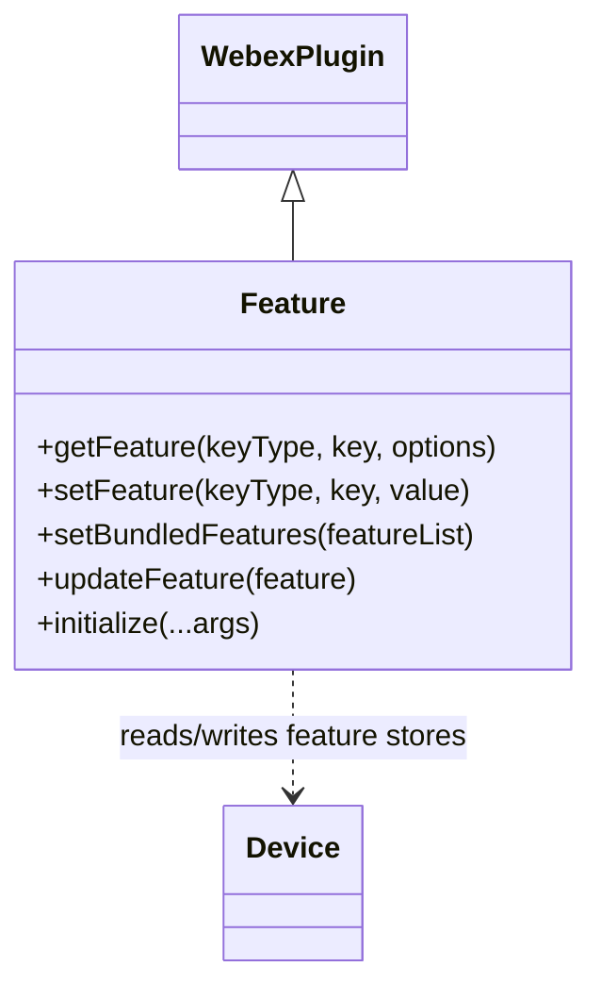

<!-- sdd-generated-metadata
generator: claude-cli
generator_model: us.anthropic.claude-opus-4-8
approved_by: pending-human-review
updated_at: 2026-08-06T00:00:00Z
validation_status: not-run
run_id: 51855eac-8de5-43a2-a3b6-dbcc55ebc91b
-->

# @webex/internal-plugin-feature — SPEC

> Start here → root [`AGENTS.md`](../../../../AGENTS.md) (agent entry) · router [`SPEC_INDEX.md`](../../../../ai-docs/SPEC_INDEX.md) · system [`ARCHITECTURE.md`](../../../../ai-docs/ARCHITECTURE.md). This is the module's canonical spec: orientation, requirements, design, flows, and tests.
> Context-efficiency: link to canonical docs — don't duplicate them. Load specs on demand per `SPEC_INDEX.md`.

## Metadata

| Field | Value |
|---|---|
| Module id | `internal-plugin-feature` |
| Source path(s) | `packages/@webex/internal-plugin-feature/src/` |
| Parent spec | `—` (registered internal Webex plugin; composed by `webex-core`, no parent module) |
| Doc kind | Module spec |
| Coverage score | Pending coverage assessment |
| Generated from | `module-spec` @ SDLC template library `0.2.2` |
| generated_by / approved_by / updated_at | claude-cli / pending-human-review / 2026-08-06 |
| Validation status | not-run, validator `pending`, assessed 2026-08-06 |

Coverage score is `Pending coverage assessment` until the first coverage review runs. Manifest coverage
state (`Partial`) is authoritative and kept in `.sdd/manifest.json`.

## Evidence Rules
Every requirement cites concrete source evidence using `file path`. Test evidence is preferred for WHY.
Requirements are grounded in the current implementation under `src/`.

## Source Material Register

| Source material | Scope | Decision | Detail location or disposition |
|---|---|---|---|
| Module source (`feature.js`, `index.js`, `config.js`) | overview / API | used | Overview, Public Surface, Requirements, and Design sections derived from current implementation. |

## Overview

`@webex/internal-plugin-feature` is an internal Webex SDK plugin (registered as `feature`) that reads and
writes user/developer/entitlement feature toggles. It is a thin accessor layer over the
`@webex/internal-plugin-device` feature stores: read paths resolve directly from
`webex.internal.device.features[keyType]`, while write paths POST to the `feature` service and then merge
the server response back into the device feature collections.

The plugin (`src/feature.js`, a `WebexPlugin` with namespace `Feature`) exposes `getFeature` to read a
single toggle value (or its full serialized record), `setFeature` to persist one toggle,
`setBundledFeatures` to persist many toggles in one request, and `updateFeature` to fold a server-pushed
toggle update into the local device store. On `initialize`, it re-emits device feature-collection changes
as `change:developer`, `change:entitlement`, and `change:user` events so consumers can react to toggle
changes without watching the device model directly. A maintainer should start at `src/feature.js`.

## Purpose / Responsibility

Owns read/write access to Webex feature toggles (developer, user, entitlement) and keeps the local device
feature store in sync with the server. It does NOT own the feature storage itself (delegated to
`internal-plugin-device`), the toggle values (backend-managed), or transport/auth (delegated to
`webex-core`).

## Stack

JavaScript (ES modules, `src/feature.js`), built with `webex-legacy-tools`. Unit tests run under Jest via
`webex-legacy-tools test --unit --runner jest`, with `@webex/test-helper-chai`,
`@webex/test-helper-mock-webex`, and `sinon`. Runtime dependencies: `@webex/webex-core` (base
`WebexPlugin`, `registerInternalPlugin`, request handling), `@webex/internal-plugin-device` (feature
stores), and `lodash` (`partition`).

## Folder / Package Structure

```
packages/@webex/internal-plugin-feature/src/
├── index.js      # registerInternalPlugin('feature', Feature, {config}); default export Feature
├── feature.js    # Feature WebexPlugin: getFeature/setFeature/setBundledFeatures/updateFeature + change events
└── config.js     # Plugin config (currently empty: { feature: {} })
```

## Key Files (source of truth)

| File | Holds |
|---|---|
| `packages/@webex/internal-plugin-feature/src/feature.js` | All plugin methods, keyType validation, device-store sync, change-event wiring |
| `packages/@webex/internal-plugin-feature/src/index.js` | Internal-plugin registration name (`feature`) |
| `packages/@webex/internal-plugin-feature/src/config.js` | Plugin config namespace (`feature`) |

## Public Surface

Consumed as an internal SDK plugin via `webex.internal.feature`.

| Contract ID | Type | Surface | Purpose | Compatibility / deprecation | Schema / detail link | Root index |
|---|---|---|---|---|---|---|
| `feature.getFeature` | SDK | `getFeature(keyType, key, options): Promise<value\|record\|null>` | Read a toggle value from the device store; `options.full` returns the serialized record | Stable; `keyType` must be `developer`/`user`/`entitlement` | `packages/@webex/internal-plugin-feature/src/feature.js` | `../../../../ai-docs/CONTRACTS.md` |
| `feature.setFeature` | SDK | `setFeature(keyType, key, value): Promise<record>` | POST a single toggle, then merge the response into the device store | Stable; only `developer`/`user` may be set | `packages/@webex/internal-plugin-feature/src/feature.js` | `../../../../ai-docs/CONTRACTS.md` |
| `feature.setBundledFeatures` | SDK | `setBundledFeatures(featureList): Promise<void>` | POST an array of toggles in one request; partition USER/DEV results back into the device store | Stable; non-`USER`/`DEV` types are coerced to `USER` | `packages/@webex/internal-plugin-feature/src/feature.js` | `../../../../ai-docs/CONTRACTS.md` |
| `feature.updateFeature` | SDK | `updateFeature(feature): void` | Merge a server-pushed toggle update into the `user`/`developer` device store | Stable; called by Mercury `featureToggle_update` handling | `packages/@webex/internal-plugin-feature/src/feature.js` | `../../../../ai-docs/CONTRACTS.md` |
| `feature:change:developer` / `:user` / `:entitlement` | event | plugin `change:<keyType>` events | Notify consumers a toggle collection changed | Stable event names | `packages/@webex/internal-plugin-feature/src/feature.js` | `../../../../ai-docs/CONTRACTS.md` |

Compatibility notes:
- Method names/signatures and the emitted `change:*` event names are the semver-controlled contract.
- `getFeature` resolves `null` when the toggle is absent; it does not throw for unknown keys.

## Requires (dependencies)

- `@webex/webex-core` — base `WebexPlugin`, `registerInternalPlugin`, `this.request`, and the auth
  interceptor.
- `@webex/internal-plugin-device` — the `features.developer` / `features.user` / `features.entitlement`
  collections that back reads and receive merged writes, plus `device.userId` used to build the write URL.
- `lodash` — `partition` to split bundled `USER`/`DEV` results.
- External service: **feature** service (`api: 'feature'`) for `features/users/{userId}/{keyType}` and
  `features/users/{userId}/toggles`.

## Requirements

| ID | WHAT | WHY | Source Evidence | Test / Example Evidence | Assumptions / Gaps | Confidence |
|---|---|---|---|---|---|---|
| `FEATURE-R-001` | `getFeature` rejects with an error when `keyType` is not `developer`, `user`, or `entitlement`. | Only these three toggle namespaces exist in the device store; fail fast on misuse. | `packages/@webex/internal-plugin-feature/src/feature.js` | `packages/@webex/internal-plugin-feature/test/` | none identified | PRESENT |
| `FEATURE-R-002` | `getFeature` resolves `null` when the toggle is absent, the raw `value` by default, or the serialized record when `options.full` is set. | Consumers need both quick value reads and full metadata records without a network call. | `packages/@webex/internal-plugin-feature/src/feature.js` | `packages/@webex/internal-plugin-feature/test/` | none identified | PRESENT |
| `FEATURE-R-003` | `setFeature` rejects unless `keyType` is `developer` or `user`, POSTs `features/users/{userId}/{keyType}` with `{key, mutable:true, val:value}`, then merges the response into the device store. | Entitlement toggles are read-only; writes must persist and stay consistent with the local store. | `packages/@webex/internal-plugin-feature/src/feature.js` | `packages/@webex/internal-plugin-feature/test/` | none identified | PRESENT |
| `FEATURE-R-004` | `setBundledFeatures` defaults each item's `mutable` to `'true'`, coerces any non-`USER`/`DEV` `type` to `USER`, POSTs to `features/users/{userId}/toggles`, then partitions `featureToggles` into the `user` and `developer` device collections. | Batched toggle writes must be normalized and routed back to the correct local collections. | `packages/@webex/internal-plugin-feature/src/feature.js` | `packages/@webex/internal-plugin-feature/test/` | none identified | PRESENT |
| `FEATURE-R-005` | `updateFeature` merges a pushed toggle into the device store only when its lower-cased `type` is `user` or `developer`. | Server-pushed legacy toggle updates (via Mercury) must update the local store; other types are ignored. | `packages/@webex/internal-plugin-feature/src/feature.js` | `packages/@webex/internal-plugin-feature/test/` | none identified | PRESENT |
| `FEATURE-R-006` | On `initialize`, the plugin re-emits device feature-collection changes as `change:developer`, `change:entitlement`, and `change:user`. | Consumers react to toggle changes via the plugin instead of watching the device model. | `packages/@webex/internal-plugin-feature/src/feature.js` | `packages/@webex/internal-plugin-feature/test/` | none identified | PRESENT |

## Design Overview

`Feature` extends `WebexPlugin` (`namespace: 'Feature'`) and is a stateless accessor: it holds no toggle
data itself. Reads are synchronous lookups against `webex.internal.device.features[keyType]` wrapped in
resolved Promises, so the API is uniformly Promise-based even though no network call happens on read.
Writes are `POST`s to the `feature` service; the resolved response is merged (`add(..., {merge: true})`)
into the appropriate device feature collection so the local store immediately reflects the change.

`setBundledFeatures` normalizes each list item (default `mutable`, coerce unknown `type` to `USER`) before
the request, then uses lodash `partition` to split the server's `featureToggles` array into USER vs
non-USER (developer) buckets and merges each into its device collection. `updateFeature` handles the
inbound direction — a server-pushed toggle — by adding it to the matching collection. Event wiring in
`initialize` uses `listenToAndRun` so consumers receive an initial event plus subsequent change events.

## Data Flow

```mermaid
flowchart TB
  Consumer -->|getFeature keyType,key| F[Feature plugin]
  F -->|read features keyType .get key| Dev[internal-plugin-device feature stores]
  Consumer -->|setFeature / setBundledFeatures| F
  F -->|POST api:feature features/users/userId/...| Svc[feature service]
  Svc -->|toggle record(s)| F
  F -->|add merge:true| Dev
  Mercury[Mercury featureToggle_update] -->|updateFeature| F
  Dev -->|change:developer/user/entitlement| Consumer
```

## Sequence Diagram(s)

Sequence coverage:

| Operation group | Diagram | Failure / recovery coverage |
|---|---|---|
| Read a toggle | 1. getFeature | `alt` covers invalid keyType (reject) and absent toggle (null) |
| Persist a toggle | 2. setFeature / setBundledFeatures | `alt` covers invalid keyType reject; write-then-merge shown |

### 1. getFeature



### 2. setFeature / setBundledFeatures



## Class / Component Relationships



`Feature` extends `WebexPlugin` and delegates all storage to `webex.internal.device.features`.

## Use Cases

- **UC-1 Read a toggle:** `getFeature('developer', key)` → resolves the value, `null`, or full record. Evidence: `packages/@webex/internal-plugin-feature/src/feature.js`.
- **UC-2 Set a toggle:** `setFeature('user', key, value)` → POST + merge into device store. Evidence: `packages/@webex/internal-plugin-feature/src/feature.js`.
- **UC-3 Bulk set toggles:** `setBundledFeatures([{type,key,val}])` → normalize + POST + partition results. Evidence: `packages/@webex/internal-plugin-feature/src/feature.js`.
- **UC-4 Handle pushed update:** Mercury `featureToggle_update` → `updateFeature(feature)` merges into store. Evidence: `packages/@webex/internal-plugin-feature/src/feature.js`.

## Concurrency & Reactive Flow

Reads are synchronous device-store lookups wrapped in resolved Promises. Writes are independent
request/response Promises with no shared mutable state in the plugin. Change events are wired with
`listenToAndRun` in `initialize`, so consumers get an initial emission plus every subsequent device
feature-collection change re-broadcast as `change:developer`/`change:user`/`change:entitlement`. Evidence:
`packages/@webex/internal-plugin-feature/src/feature.js`.

## Error Handling & Failure Modes

| Condition | Signal (error/code/result) | Caller recovery |
|---|---|---|
| Invalid `keyType` on `getFeature` | rejected Promise with descriptive `Error` | Pass `developer`/`user`/`entitlement` |
| Non-`developer`/`user` `keyType` on `setFeature` | rejected Promise with `Error` | Only set developer/user toggles |
| Toggle absent on `getFeature` | resolves `null` | Treat as "not set"/use default |
| `setFeature`/`setBundledFeatures` HTTP failure | rejected Promise from `this.request`/`webex.request` | Inspect underlying request error |

## Pitfalls

- `entitlement` toggles are readable but not settable — `setFeature`/`setBundledFeatures` reject or coerce
  away entitlement writes.
- `getFeature` returns `null` (not a rejection) for unknown keys; distinguish "absent" from "false".
- `setBundledFeatures` mutates each list item in place (sets `mutable`, may rewrite `type`) before sending.
- Reads never hit the network — a stale device store yields stale values until a `setFeature`/
  `updateFeature`/device refresh updates it.

## Test-Case Strategy (module)

Unit tests (Jest + sinon + chai) should mock `this.request`/`webex.request` and the device feature stores,
asserting: `getFeature` rejects invalid keyTypes (negative) and resolves value/record/`null` (positive);
`setFeature` rejects entitlement writes (negative) and POSTs + merges for developer/user (positive);
`setBundledFeatures` normalizes items and partitions results into the right collections; and `updateFeature`
merges only user/developer types.

| Behavior / Requirement | Existing test evidence | Gap |
|---|---|---|
| `FEATURE-R-001` | `packages/@webex/internal-plugin-feature/test/` | Confirm invalid-keyType reject coverage |
| `FEATURE-R-002` | `packages/@webex/internal-plugin-feature/test/` | Confirm null / value / full-record cases |
| `FEATURE-R-003` | `packages/@webex/internal-plugin-feature/test/` | Confirm write URL/body + merge |
| `FEATURE-R-004` | `packages/@webex/internal-plugin-feature/test/` | Confirm normalization + partition |
| `FEATURE-R-005` | `packages/@webex/internal-plugin-feature/test/` | Confirm type-filtered merge |
| `FEATURE-R-006` | `packages/@webex/internal-plugin-feature/test/` | Confirm change-event re-emission |

## Traceability

- Repo architecture: [`ARCHITECTURE.md`](../../../../ai-docs/ARCHITECTURE.md) · Registry: [`SPEC_INDEX.md`](../../../../ai-docs/SPEC_INDEX.md)
- Coverage state & contracts baseline: `.sdd/manifest.json`
