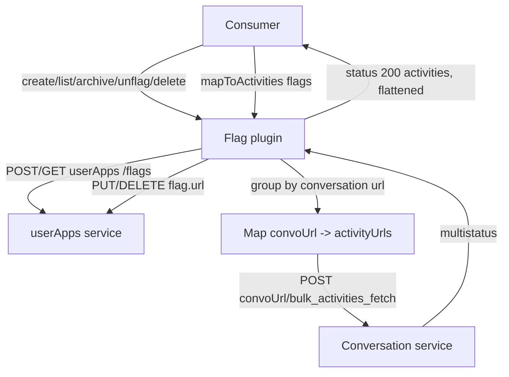
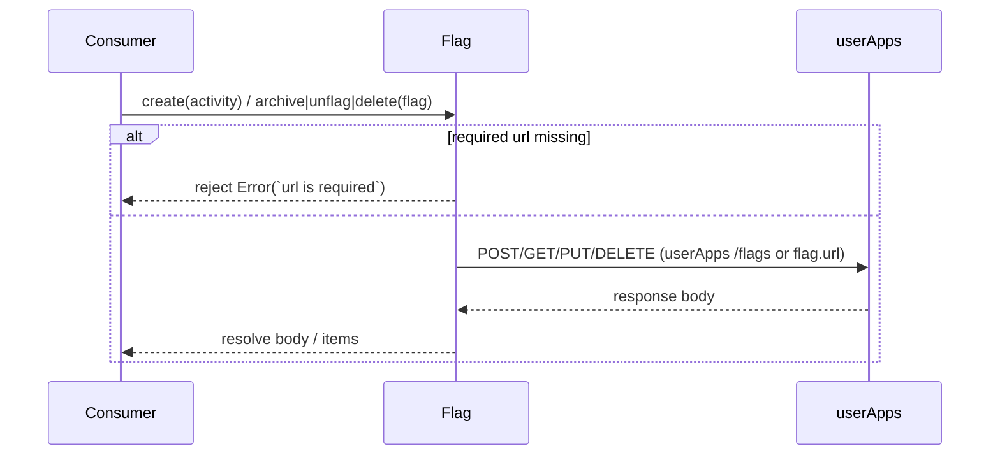
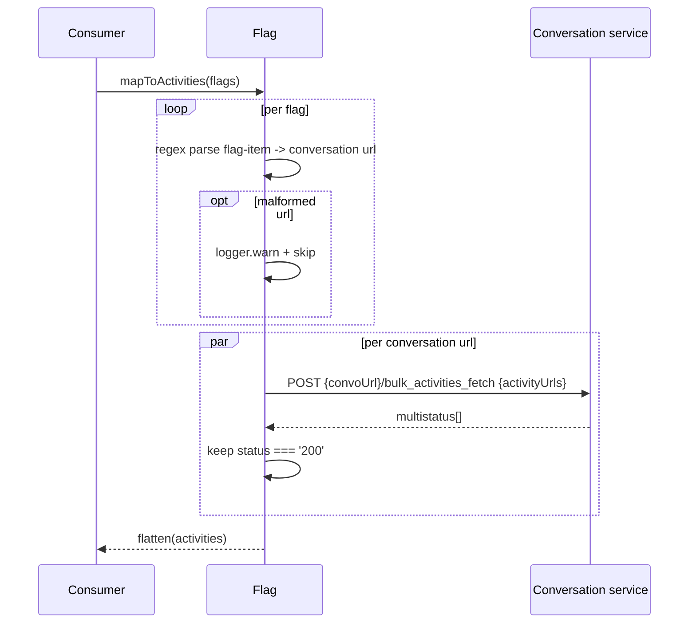
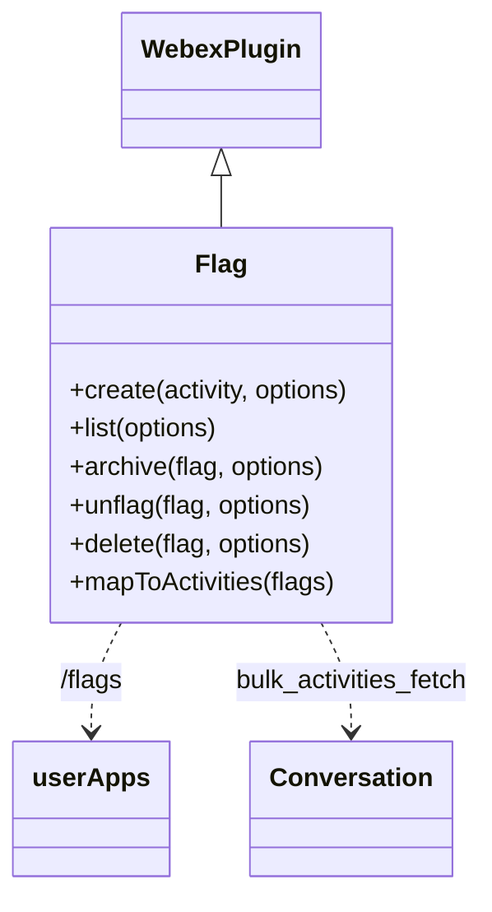

<!-- sdd-generated-metadata
generator: claude-cli
generator_model: us.anthropic.claude-opus-4-8
approved_by: pending-human-review
updated_at: 2026-08-06T00:00:00Z
validation_status: not-run
run_id: 51855eac-8de5-43a2-a3b6-dbcc55ebc91b
-->

# @webex/internal-plugin-flag — SPEC

> Start here → root [`AGENTS.md`](../../../../AGENTS.md) (agent entry) · router [`SPEC_INDEX.md`](../../../../ai-docs/SPEC_INDEX.md) · system [`ARCHITECTURE.md`](../../../../ai-docs/ARCHITECTURE.md). This is the module's canonical spec: orientation, requirements, design, flows, and tests.
> Context-efficiency: link to canonical docs — don't duplicate them. Load specs on demand per `SPEC_INDEX.md`.

## Metadata

| Field | Value |
|---|---|
| Module id | `internal-plugin-flag` |
| Source path(s) | `packages/@webex/internal-plugin-flag/src/` |
| Parent spec | `—` (registered internal Webex plugin; composed by `webex-core`, no parent module) |
| Doc kind | Module spec |
| Coverage score | Pending coverage assessment |
| Generated from | `module-spec` @ SDLC template library `0.2.2` |
| generated_by / approved_by / updated_at | claude-cli / pending-human-review / 2026-08-06 |
| Validation status | not-run, validator `pending`, assessed 2026-08-06 |

Coverage score is `Pending coverage assessment` until the first coverage review runs. Manifest coverage
state (`Partial`) is authoritative and kept in `.sdd/manifest.json`.

## Evidence Rules
Every requirement cites concrete source evidence using `file path`. Test evidence is preferred for WHY.
Requirements are grounded in the current implementation under `src/`.

## Source Material Register

| Source material | Scope | Decision | Detail location or disposition |
|---|---|---|---|
| Module source (`flag.js`, `index.js`, `config.js`) | overview / API | used | Overview, Public Surface, Requirements, and Design sections derived from current implementation. |

## Overview

`@webex/internal-plugin-flag` is an internal Webex SDK plugin (registered as `flag`) for flagging,
unflagging, archiving, and deleting conversation activities, and for mapping flags back to their underlying
activities. Flags are managed through the `userApps` service (`/flags`); individual flag mutations target a
flag's own `url`. The plugin is a thin request layer over `webex.request`/`this.request`, returning parsed
response bodies.

The plugin (`src/flag.js`, a `WebexPlugin` with namespace `Flag`) exposes `create` (flag an activity),
`list` (fetch the user's flagged items), `archive`/`unflag`/`delete` (state transitions on a flag), and
`mapToActivities` (resolve flagged activity URLs into full activity objects via per-conversation
`bulk_activities_fetch`, keeping only status-200 results). A maintainer should start at `src/flag.js`.

## Purpose / Responsibility

Owns the user's flag lifecycle over conversation activities: create/list/archive/unflag/delete flags and
resolve flags into activities. It does NOT own conversations/activities themselves (delegated to
`internal-plugin-conversation`) or transport/auth (delegated to `webex-core`).

## Stack

JavaScript (ES modules, `src/flag.js`), built with `webex-legacy-tools`. Unit tests run under Jest via
`webex-legacy-tools test --unit --runner jest`. Runtime dependencies: `@webex/webex-core` (base plugin,
request), `@webex/internal-plugin-conversation` and `@webex/internal-plugin-device` (imported for
registration/composition), and `lodash` (`flatten`).

## Folder / Package Structure

```
packages/@webex/internal-plugin-flag/src/
├── index.js     # registerInternalPlugin('flag', Flag, {config, payloadTransformer}); imports conversation + device
├── flag.js      # Flag WebexPlugin: create/list/archive/unflag/delete/mapToActivities
└── config.js    # Plugin config namespace (flag)
```

## Key Files (source of truth)

| File | Holds |
|---|---|
| `packages/@webex/internal-plugin-flag/src/flag.js` | All plugin methods, `flag.url`/`activity.url` validation, `userApps` routing, activity mapping |
| `packages/@webex/internal-plugin-flag/src/index.js` | Internal-plugin registration name (`flag`) + empty payloadTransformer |

## Public Surface

Consumed as an internal SDK plugin via `webex.internal.flag`.

| Contract ID | Type | Surface | Purpose | Compatibility / deprecation | Schema / detail link | Root index |
|---|---|---|---|---|---|---|
| `flag.create` | SDK | `create(activity, options): Promise<flag>` | POST `userApps /flags` with `conversation-url`, `flag-item`, `state:'flagged'` | Stable; requires `activity.url` | `packages/@webex/internal-plugin-flag/src/flag.js` | `../../../../ai-docs/CONTRACTS.md` |
| `flag.list` | SDK | `list(options): Promise<items[]>` | GET `userApps /flags?state=flagged` | Stable | `packages/@webex/internal-plugin-flag/src/flag.js` | `../../../../ai-docs/CONTRACTS.md` |
| `flag.archive` | SDK | `archive(flag, options): Promise<body>` | PUT `flag.url` with `state:'archived'` | Stable; requires `flag.url` | `packages/@webex/internal-plugin-flag/src/flag.js` | `../../../../ai-docs/CONTRACTS.md` |
| `flag.unflag` | SDK | `unflag(flag, options): Promise<body>` | PUT `flag.url` with `state:'unflagged'` | Stable; requires `flag.url` | `packages/@webex/internal-plugin-flag/src/flag.js` | `../../../../ai-docs/CONTRACTS.md` |
| `flag.delete` | SDK | `delete(flag, options): Promise<body>` | DELETE `flag.url` | Stable; requires `flag.url` | `packages/@webex/internal-plugin-flag/src/flag.js` | `../../../../ai-docs/CONTRACTS.md` |
| `flag.mapToActivities` | SDK | `mapToActivities(flags): Promise<activity[]>` | Resolve flag items into activities via per-conversation `bulk_activities_fetch` (status 200 only) | Stable; TODO to migrate to a batched request | `packages/@webex/internal-plugin-flag/src/flag.js` | `../../../../ai-docs/CONTRACTS.md` |

Compatibility notes:
- Method names/signatures and the `flagged`/`unflagged`/`archived` state strings are the semver-controlled
  contract.
- `create` reads `activity.target.url` for `conversation-url` and `activity.url` for `flag-item`.

## Requires (dependencies)

- `@webex/webex-core` — base `WebexPlugin`, `registerInternalPlugin`, `webex.request`/`this.request`,
  `this.logger`.
- `@webex/internal-plugin-conversation` — activities/conversations that flags reference (imported for
  composition).
- `@webex/internal-plugin-device` — imported for plugin registration/composition.
- `lodash` — `flatten` to collapse per-conversation activity arrays.
- External service: **userApps** (`service: 'userApps'`, resource `/flags`) plus each conversation's
  `bulk_activities_fetch` endpoint.

## Requirements

| ID | WHAT | WHY | Source Evidence | Test / Example Evidence | Assumptions / Gaps | Confidence |
|---|---|---|---|---|---|---|
| `FLAG-R-001` | `create` rejects when `activity.url` is missing, else POSTs `userApps /flags` with `{'conversation-url': activity.target.url, 'flag-item': activity.url, state:'flagged'}` and resolves the response body. | Flagging an activity requires its URL and the owning conversation URL. | `packages/@webex/internal-plugin-flag/src/flag.js` | `packages/@webex/internal-plugin-flag/test/` | none identified | PRESENT |
| `FLAG-R-002` | `list` GETs `userApps /flags` with `qs:{state:'flagged'}` and resolves `response.body.items`. | Consumers need the current set of flagged items for the user. | `packages/@webex/internal-plugin-flag/src/flag.js` | `packages/@webex/internal-plugin-flag/test/` | none identified | PRESENT |
| `FLAG-R-003` | `archive` and `unflag` reject when `flag.url` is missing, else PUT `flag.url` with `state:'archived'` / `state:'unflagged'` and resolve the body. | Flag state transitions target the flag's own URL and must validate it. | `packages/@webex/internal-plugin-flag/src/flag.js` | `packages/@webex/internal-plugin-flag/test/` | none identified | PRESENT |
| `FLAG-R-004` | `delete` rejects when `flag.url` is missing, else DELETEs `flag.url` and resolves the body. | Removing a flag requires its URL. | `packages/@webex/internal-plugin-flag/src/flag.js` | `packages/@webex/internal-plugin-flag/test/` | none identified | PRESENT |
| `FLAG-R-005` | `mapToActivities` groups flag items by conversation URL (parsed with `/(.*)\/activities\//`), POSTs `{convoUrl}/bulk_activities_fetch` per group, keeps only `multistatus` entries with `status === '200'`, and returns the flattened activities. Malformed activity URLs are logged and skipped. | Flags store activity URLs, not activities; consumers need resolved activity objects, tolerating missing/forbidden items. | `packages/@webex/internal-plugin-flag/src/flag.js` | `packages/@webex/internal-plugin-flag/test/` | TODO: batch into one request in modular SDK | PRESENT |

## Design Overview

`Flag` extends `WebexPlugin` (`namespace: 'Flag'`) and is a stateless request façade. Creation and listing
go through the `userApps` service `/flags` resource; per-flag state changes (`archive`, `unflag`, `delete`)
target the flag's own absolute `url`. Each mutating/reading method validates its required URL up front and
rejects synchronously via a rejected Promise, then delegates to `webex.request`/`this.request` and returns
the parsed body.

`mapToActivities` is the one non-trivial method: it builds a `Map` of conversation URL → activity URLs by
regex-parsing each flag's `flag-item`, issues one `bulk_activities_fetch` POST per conversation in parallel
(`Promise.all`), filters each `multistatus` response to `status === '200'` entries, and flattens the
per-conversation arrays into a single list. Activity URLs that don't match the expected shape are logged via
`this.logger.warn` and ignored rather than failing the whole call.

## Data Flow



## Sequence Diagram(s)

Sequence coverage:

| Operation group | Diagram | Failure / recovery coverage |
|---|---|---|
| Flag lifecycle (create/list/archive/unflag/delete) | 1. Flag mutations | `alt` covers missing-`url` reject |
| Resolve flags to activities | 2. mapToActivities | `opt` covers malformed URL skip; only status-200 kept |

### 1. Flag mutations



### 2. mapToActivities



## Class / Component Relationships



`Flag` extends `WebexPlugin` and issues requests through `webex.request`/`this.request`.

## Use Cases

- **UC-1 Flag an activity:** `create(activity)` → POST `/flags` with `state:'flagged'`. Evidence: `packages/@webex/internal-plugin-flag/src/flag.js`.
- **UC-2 List flagged items:** `list()` → GET `/flags?state=flagged` → `items`. Evidence: `packages/@webex/internal-plugin-flag/src/flag.js`.
- **UC-3 Change a flag's state:** `archive(flag)` / `unflag(flag)` / `delete(flag)`. Evidence: `packages/@webex/internal-plugin-flag/src/flag.js`.
- **UC-4 Resolve flags to activities:** `mapToActivities(flags)` → grouped `bulk_activities_fetch` → status-200 activities. Evidence: `packages/@webex/internal-plugin-flag/src/flag.js`.

## Concurrency & Reactive Flow

Each single-flag method is an independent request/response Promise. `mapToActivities` runs one
`bulk_activities_fetch` per conversation concurrently via `Promise.all` and then flattens the results; the
plugin holds no shared mutable state across calls. Evidence: `packages/@webex/internal-plugin-flag/src/flag.js`.

## Error Handling & Failure Modes

| Condition | Signal (error/code/result) | Caller recovery |
|---|---|---|
| Missing `activity.url` on `create` | rejected Promise `Error('`activity.url` is required')` | Pass a full activity |
| Missing `flag.url` on `archive`/`unflag`/`delete` | rejected Promise `Error('`flag.url` is required')` | Pass a full flag object |
| Malformed activity URL in `mapToActivities` | `logger.warn` + item skipped (no throw) | None required; item omitted |
| Non-200 `multistatus` entry | entry filtered out of results | Missing activities simply absent |
| HTTP failure | rejected Promise from the request | Inspect underlying error |

## Pitfalls

- `create` requires `activity.target.url` for the `conversation-url`; a partial activity yields a bad flag.
- `mapToActivities` silently drops activities that return non-200 or whose URLs don't match `/(.*)\/activities\//`
  — callers should not assume a 1:1 flag→activity mapping.
- `archive`/`unflag` use `webex.request` while `delete` uses `this.request`; both target `flag.url`
  directly (not the `userApps` resource).
- A `TODO` notes `mapToActivities` should become a single batched request when migrating to the modular SDK.

## Test-Case Strategy (module)

Unit tests (Jest) should mock `webex.request`/`this.request`, asserting: `create` rejects without
`activity.url` (negative) and POSTs the correct body (positive); `list` returns `items`; `archive`/`unflag`/
`delete` reject without `flag.url` (negative) and issue the right method/state (positive); and
`mapToActivities` groups by conversation, keeps only status-200 entries, and skips malformed URLs.

| Behavior / Requirement | Existing test evidence | Gap |
|---|---|---|
| `FLAG-R-001` | `packages/@webex/internal-plugin-flag/test/` | Confirm missing-url reject + body shape |
| `FLAG-R-002` | `packages/@webex/internal-plugin-flag/test/` | Confirm state=flagged query + items |
| `FLAG-R-003` | `packages/@webex/internal-plugin-flag/test/` | Confirm archived/unflagged PUT bodies |
| `FLAG-R-004` | `packages/@webex/internal-plugin-flag/test/` | Confirm delete reject + method |
| `FLAG-R-005` | `packages/@webex/internal-plugin-flag/test/` | Confirm grouping, status-200 filter, warn/skip |

## Traceability

- Repo architecture: [`ARCHITECTURE.md`](../../../../ai-docs/ARCHITECTURE.md) · Registry: [`SPEC_INDEX.md`](../../../../ai-docs/SPEC_INDEX.md)
- Coverage state & contracts baseline: `.sdd/manifest.json`
