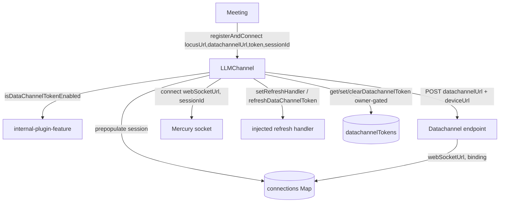
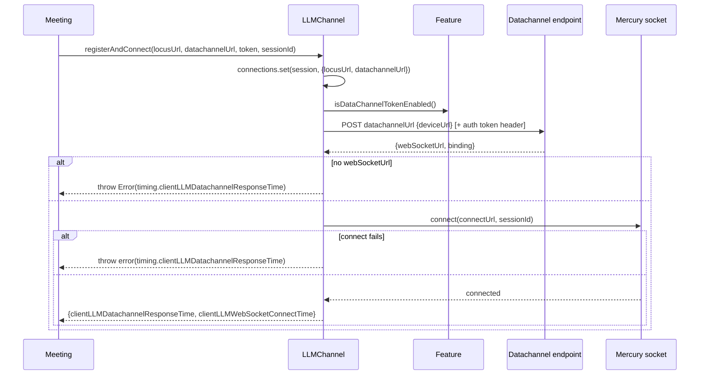
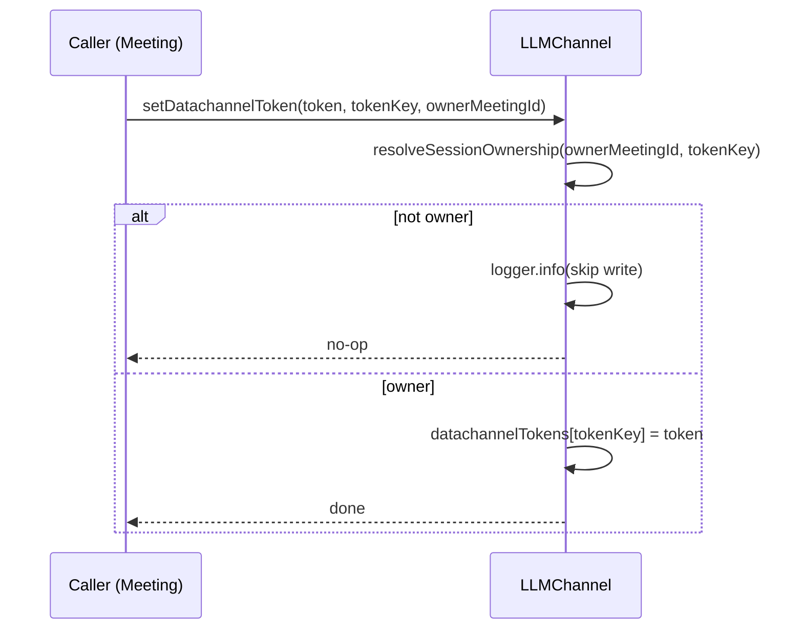
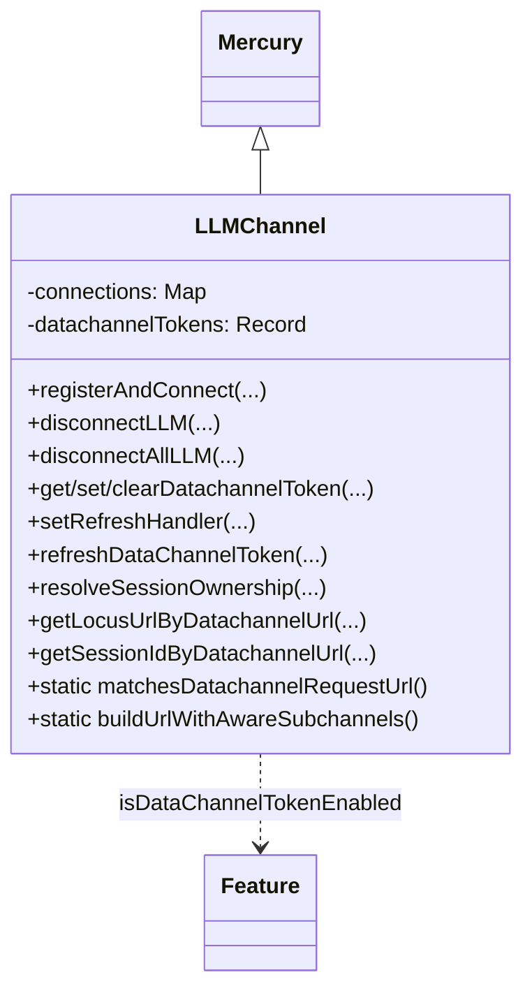

<!-- sdd-generated-metadata
generator: claude-cli
generator_model: us.anthropic.claude-opus-4-8
approved_by: pending-human-review
updated_at: 2026-08-06T00:00:00Z
validation_status: not-run
run_id: 51855eac-8de5-43a2-a3b6-dbcc55ebc91b
-->

# @webex/internal-plugin-llm — SPEC

> Start here → root [`AGENTS.md`](../../../../AGENTS.md) (agent entry) · router [`SPEC_INDEX.md`](../../../../ai-docs/SPEC_INDEX.md) · system [`ARCHITECTURE.md`](../../../../ai-docs/ARCHITECTURE.md). This is the module's canonical spec: orientation, requirements, design, flows, state, protocol, and tests.
> Context-efficiency: link to canonical docs — don't duplicate them. Load specs on demand per `SPEC_INDEX.md`.

## Metadata

| Field | Value |
|---|---|
| Module id | `internal-plugin-llm` |
| Source path(s) | `packages/@webex/internal-plugin-llm/src/` |
| Parent spec | `—` (registered internal Webex plugin; composed by `webex-core`, extends Mercury) |
| Doc kind | Module spec |
| Coverage score | Pending coverage assessment |
| Generated from | `module-spec` @ SDLC template library `0.2.2` |
| generated_by / approved_by / updated_at | claude-cli / pending-human-review / 2026-08-06 |
| Validation status | not-run, validator `pending`, assessed 2026-08-06 |

Coverage score is `Pending coverage assessment` until the first coverage review runs. Manifest coverage
state (`Partial`) is authoritative and kept in `.sdd/manifest.json`.

## Evidence Rules
Every requirement cites concrete source evidence using `file path`. Test evidence is preferred for WHY.
Requirements are grounded in the current TypeScript implementation under `src/`.

## Source Material Register

| Source material | Scope | Decision | Detail location or disposition |
|---|---|---|---|
| Module source (`llm.ts`, `llm.types.ts`, `constants.ts`, `index.ts`) | overview / API / state | used | Overview, Public Surface, Requirements, State Model, and Sequence sections derived from current implementation. |

## Overview

`@webex/internal-plugin-llm` is an internal Webex SDK plugin (registered as `llm`) that provides
"LLM" (Low Latency Mercury) data-channel WebSocket connections. `LLMChannel` extends the Mercury plugin and
adds multi-session connection management: it registers a datachannel URL, opens a WebSocket, and tracks
per-session connection metadata (`webSocketUrl`, `binding`, `locusUrl`, `datachannelUrl`, `ownerMeetingId`,
`refreshHandler`) in a `Map` keyed by `sessionId` (default `llm-default-session`).

Beyond connection lifecycle (`registerAndConnect`, `disconnectLLM`, `disconnectAllLLM`), the plugin owns a
session-keyed datachannel-token cache that is intentionally decoupled from connection state, plus an
ownership model (`ownerMeetingId`) so multiple `Meeting` instances can share/hand off the default LLM
connection without one meeting tearing down another's session. Token read/write/clear and refresh-handler
operations all gate on `resolveSessionOwnership`. A maintainer should start at `src/llm.ts`.

## Purpose / Responsibility

Owns LLM datachannel WebSocket registration/connection, per-session connection metadata, datachannel-token
caching, and session ownership arbitration. It does NOT own the underlying WebSocket transport/backoff
(inherited from Mercury), token generation (via an injected `refreshHandler`), or feature-flag storage
(delegated to `internal-plugin-feature`).

## Stack

TypeScript (`src/llm.ts`, `src/llm.types.ts`, `src/constants.ts`), built with `webex-legacy-tools`. Tests
run under Jest (`webex-legacy-tools test --unit --runner jest`) with `@webex/test-helper-chai`,
`@webex/test-helper-mock-webex`, and `sinon`. Runtime dependency: `@webex/internal-plugin-mercury` (base
class providing `connect`/`disconnect`/`getSocket`/backoff).

## Folder / Package Structure

```
packages/@webex/internal-plugin-llm/src/
├── index.ts        # registerInternalPlugin('llm', LLMChannel, {config}); re-exports types + constants
├── llm.ts          # LLMChannel (extends Mercury): config + connection/token/ownership logic
├── llm.types.ts    # DataChannelTokenType enum, ILLMChannel interface, RegisterAndConnectTiming
└── constants.ts    # LLM, LLM_DEFAULT_SESSION, LLM_PRACTICE_SESSION, DATA_CHANNEL_WITH_JWT_TOKEN, AWARE_DATA_CHANNEL
```

## Key Files (source of truth)

| File | Holds |
|---|---|
| `packages/@webex/internal-plugin-llm/src/llm.ts` | `config`, `connections` map, register/connect, token cache, ownership resolution, URL matching |
| `packages/@webex/internal-plugin-llm/src/constants.ts` | Session ids, feature flag name, subscription-aware subchannel param/values |
| `packages/@webex/internal-plugin-llm/src/llm.types.ts` | `DataChannelTokenType`, `ILLMChannel`, `RegisterAndConnectTiming` |
| `packages/@webex/internal-plugin-llm/src/index.ts` | Registration name (`llm`) and public re-exports |

## Public Surface

Consumed as an internal SDK plugin via `webex.internal.llm`. Extends Mercury, so Mercury's socket methods
are also available.

| Contract ID | Type | Surface | Purpose | Compatibility / deprecation | Schema / detail link | Root index |
|---|---|---|---|---|---|---|
| `llm.registerAndConnect` | SDK | `registerAndConnect(locusUrl, datachannelUrl, datachannelToken?, sessionId?): Promise<RegisterAndConnectTiming\|undefined>` | Register the datachannel URL then open the WebSocket; return latency timings | Stable; pre-populates session locus/datachannel URLs before register | `packages/@webex/internal-plugin-llm/src/llm.ts` | `../../../../ai-docs/CONTRACTS.md` |
| `llm.disconnectLLM` | SDK | `disconnectLLM(options, sessionId?, ownerMeetingId?): Promise<boolean>` | Disconnect one session if the caller owns it; clears owner + session data | Stable; legacy compat when `ownerMeetingId` omitted | `packages/@webex/internal-plugin-llm/src/llm.ts` | `../../../../ai-docs/CONTRACTS.md` |
| `llm.disconnectAllLLM` | SDK | `disconnectAllLLM(options?): Promise<void>` | Disconnect all sessions and clear the connections map | Stable | `packages/@webex/internal-plugin-llm/src/llm.ts` | `../../../../ai-docs/CONTRACTS.md` |
| `llm.isConnected` / `getBinding` / `getLocusUrl` / `getDatachannelUrl` / `getWebSocketUrl` | SDK | `(sessionId?) => value` | Read per-session connection state | Stable | `packages/@webex/internal-plugin-llm/src/llm.ts` | `../../../../ai-docs/CONTRACTS.md` |
| `llm.setOwnerMeetingId` / `getOwnerMeetingId` / `resolveSessionOwnership` | SDK | ownership tag get/set + resolve `{currentOwner, isOwner}` | Coordinate which Meeting owns a session | Stable; `setOwnerMeetingId` is a no-op with no session data | `packages/@webex/internal-plugin-llm/src/llm.ts` | `../../../../ai-docs/CONTRACTS.md` |
| `llm.getDatachannelToken` / `setDatachannelToken` / `clearDatachannelToken` | SDK | token cache ops keyed by token type + owner-gated | Cache/read/clear datachannel tokens per session type | Stable; skip when caller is not owner | `packages/@webex/internal-plugin-llm/src/llm.ts` | `../../../../ai-docs/CONTRACTS.md` |
| `llm.setRefreshHandler` / `refreshDataChannelToken` | SDK | set token-refresh handler; invoke it | Inject/run the token refresh callback | Stable; refresh returns `null` when handler missing/fails | `packages/@webex/internal-plugin-llm/src/llm.ts` | `../../../../ai-docs/CONTRACTS.md` |
| `llm.getLocusUrlByDatachannelUrl` / `getSessionIdByDatachannelUrl` / `getAllConnections` | SDK | reverse-lookup session by request URL; snapshot connections | Route in-flight requests / inspect sessions | Stable | `packages/@webex/internal-plugin-llm/src/llm.ts` | `../../../../ai-docs/CONTRACTS.md` |
| `LLMChannel.matchesDatachannelRequestUrl` / `buildUrlWithAwareSubchannels` | SDK (static) | URL prefix/pathname match; append `subscriptionAwareSubchannels` query | Host-tolerant URL matching and subchannel URL building | Stable static helpers | `packages/@webex/internal-plugin-llm/src/llm.ts` | `../../../../ai-docs/CONTRACTS.md` |

Compatibility notes:
- The `ILLMChannel` interface, `DataChannelTokenType` enum values (`llm-default-session`,
  `llm-practice-session`), and method signatures are the semver-controlled contract.
- `registerAndConnect` returns `undefined` when `locusUrl`/`datachannelUrl` are absent (register-only path).

## Requires (dependencies)

- `@webex/internal-plugin-mercury` — base class supplying `connect(url, sessionId)`, `disconnect`,
  `disconnectAll`, `getSocket`, backoff, and `this.request`/`this.logger`.
- `webex.internal.device.url` — device URL sent in the register body.
- `webex.internal.feature.getFeature('developer', 'data-channel-with-jwt-token')` — gates JWT
  datachannel-token behavior and aware-subchannel URL building.
- External services: the datachannel registration endpoint (POST) and the resolved LLM WebSocket URL.

## Requirements

| ID | WHAT | WHY | Source Evidence | Test / Example Evidence | Assumptions / Gaps | Confidence |
|---|---|---|---|---|---|---|
| `LLM-R-001` | `registerAndConnect` pre-populates `locusUrl`/`datachannelUrl` into the session before `register()` POSTs, then (when both URLs are present) connects and returns `{clientLLMDatachannelResponseTime, clientLLMWebSocketConnectTime}`. | Token refresh during registration must route via `connections` without a locusInfo URL scan; callers need latency timings. | `packages/@webex/internal-plugin-llm/src/llm.ts` | `packages/@webex/internal-plugin-llm/test/` | none identified | PRESENT |
| `LLM-R-002` | `register()` POSTs the datachannel URL with the device URL, attaching the `Data-Channel-Auth-Token` header only when the JWT-token feature is enabled and a token is supplied, and stores `webSocketUrl`/`binding` on the session. | Datachannel registration must be feature-gated and persist the resolved socket URL/binding per session. | `packages/@webex/internal-plugin-llm/src/llm.ts` | `packages/@webex/internal-plugin-llm/test/` | none identified | PRESENT |
| `LLM-R-003` | When registration returns no `webSocketUrl`, or `connect()` fails, the thrown error carries `timing.clientLLMDatachannelResponseTime`. | Callers must not misreport a completed registration as time 0 when the socket step fails. | `packages/@webex/internal-plugin-llm/src/llm.ts` | `packages/@webex/internal-plugin-llm/test/` | none identified | PRESENT |
| `LLM-R-004` | Token read/write/clear (`getDatachannelToken`/`setDatachannelToken`/`clearDatachannelToken`) and `setRefreshHandler` are gated by `resolveSessionOwnership`; a non-owner call is skipped (logged), returning `undefined`/no-op. | Multiple Meeting instances share sessions; only the owner may mutate token/refresh state. | `packages/@webex/internal-plugin-llm/src/llm.ts` | `packages/@webex/internal-plugin-llm/test/` | none identified | PRESENT |
| `LLM-R-005` | `resolveSessionOwnership` treats a caller as owner when there is no current owner, the caller asserts no identity, or the caller matches the current owner. | Backward-compatible ownership without forcing every legacy caller to pass an id. | `packages/@webex/internal-plugin-llm/src/llm.ts` | `packages/@webex/internal-plugin-llm/test/` | none identified | PRESENT |
| `LLM-R-006` | The datachannel-token cache is decoupled from connection state: `disconnectLLM` clears the owner tag and deletes the session's `connections` entry but does not implicitly wipe cached tokens. | Disconnecting a socket must not lose a still-valid token needed for reconnect. | `packages/@webex/internal-plugin-llm/src/llm.ts` | `packages/@webex/internal-plugin-llm/test/` | none identified | PRESENT |
| `LLM-R-007` | `disconnectLLM` reuses the current owner when `ownerMeetingId` is omitted (legacy path, logged), skips (resolving `false`) when the caller is not owner, and otherwise disconnects, clears owner, deletes the session, and resolves `true`. | Teardown must be owner-safe yet remain best-effort for legacy callers. | `packages/@webex/internal-plugin-llm/src/llm.ts` | `packages/@webex/internal-plugin-llm/test/` | none identified | PRESENT |
| `LLM-R-008` | `matchesDatachannelRequestUrl` matches by full-URL prefix first, then by pathname prefix (tolerating a rewritten host), and `getLocusUrlByDatachannelUrl`/`getSessionIdByDatachannelUrl` use it to map an in-flight request URL back to its session. | A hostmap interceptor can rewrite the host, so request→session routing must be host-tolerant. | `packages/@webex/internal-plugin-llm/src/llm.ts` | `packages/@webex/internal-plugin-llm/test/` | none identified | PRESENT |

## Design Overview

`LLMChannel` extends Mercury and centralizes multi-session state in a single `connections: Map<sessionId, …>`.
`registerAndConnect` is deliberately ordered: it writes `locusUrl`/`datachannelUrl` into the session first so
that any token refresh triggered during the register POST can be routed through `connections`, then calls
`register()` (which fills `webSocketUrl`/`binding`), and finally `connect()` on either the plain socket URL
or a subscription-aware URL (when the JWT-token feature is on). Latency is measured with `performance.now()`
across the datachannel and websocket phases and attached to both success returns and thrown errors.

Token state lives in a separate `datachannelTokens` record keyed by token type, intentionally independent of
`connections` so socket teardown doesn't discard tokens. Every token mutation and the refresh-handler setter
funnel through `resolveSessionOwnership`, which encodes a permissive ownership rule (no owner / no asserted id
/ matching id ⇒ allowed). `setRefreshHandler` may create a pre-connection session entry so refresh is wired
before register/connect. Reverse lookups use the static `matchesDatachannelRequestUrl` to survive host
rewrites by falling back to pathname matching.

## Data Flow



## Sequence Diagram(s)

Sequence coverage:

| Operation group | Diagram | Failure / recovery coverage |
|---|---|---|
| Register + connect | 1. registerAndConnect | `alt` covers no websocket URL (throw w/ timing) and connect() failure (throw w/ timing) |
| Owner-gated token op | 2. token mutation | `alt` covers non-owner skip vs owner apply |

### 1. registerAndConnect



### 2. Owner-gated token mutation



## Class / Component Relationships



`LLMChannel` implements `ILLMChannel` and extends `Mercury`, reusing its socket connect/disconnect/backoff.

## Use Cases

- **UC-1 Open an LLM connection:** Meeting calls `registerAndConnect(locusUrl, datachannelUrl, token, sessionId)` → register + connect → timings. Evidence: `packages/@webex/internal-plugin-llm/src/llm.ts`.
- **UC-2 Hand off session ownership:** `setOwnerMeetingId(id, sessionId)` after connect so other meetings skip mutating it. Evidence: `packages/@webex/internal-plugin-llm/src/llm.ts`.
- **UC-3 Refresh a datachannel token:** `setRefreshHandler(fn, sessionId, owner)` then `refreshDataChannelToken(sessionId)`. Evidence: `packages/@webex/internal-plugin-llm/src/llm.ts`.
- **UC-4 Route an in-flight request:** `getSessionIdByDatachannelUrl(requestUrl)` / `getLocusUrlByDatachannelUrl(requestUrl)`. Evidence: `packages/@webex/internal-plugin-llm/src/llm.ts`.

## State Model

Per-session state lives in the `connections` map entry: `{webSocketUrl?, binding?, locusUrl?, datachannelUrl?,
ownerMeetingId?, refreshHandler?}`. A separate `datachannelTokens` record (keyed by `DataChannelTokenType`,
i.e. `llm-default-session` / `llm-practice-session`) holds cached tokens independent of connection state.
`registerAndConnect` populates locus/datachannel URLs then socket URL/binding; `setRefreshHandler` may create
a pre-connection entry; `disconnectLLM` deletes the session entry and clears its owner tag but leaves token
cache intact; `disconnectAllLLM` clears the whole `connections` map. Evidence:
`packages/@webex/internal-plugin-llm/src/llm.ts`.

## Concurrency & Reactive Flow

Connection and disconnection are async Promise flows layered on Mercury's backoff-driven socket lifecycle.
`connect` is idempotent per session at the Mercury layer. Ownership resolution guards concurrent mutation of
token/refresh state across multiple Meeting instances sharing the default session. Latency timings use
`performance.now()`. Reverse URL lookups iterate the `connections` map. Evidence:
`packages/@webex/internal-plugin-llm/src/llm.ts`.

## Protocol / Wire Format

- **Register:** `POST {datachannelUrl}` with body `{deviceUrl}`; optional header `Data-Channel-Auth-Token`
  when the JWT-token feature is enabled and a token is provided. Response: `{webSocketUrl, binding}`.
- **Connect:** WebSocket open on `webSocketUrl` (inherited Mercury socket). When the JWT-token feature is on,
  the URL is rebuilt with `subscriptionAwareSubchannels=<subchannels>` (e.g. `transcription`) via
  `buildUrlWithAwareSubchannels`.
- **Token refresh:** injected `refreshHandler()` resolving `{body:{datachannelToken, datachannelTokenType}}`.

Evidence: `packages/@webex/internal-plugin-llm/src/llm.ts`, `packages/@webex/internal-plugin-llm/src/constants.ts`.

## Error Handling & Failure Modes

| Condition | Signal (error/code/result) | Caller recovery |
|---|---|---|
| Register error | rejected Promise (logged), error rethrown | Retry / inspect error |
| Registration returned no websocket URL | thrown `Error` with `timing.clientLLMDatachannelResponseTime` | Treat as datachannel-only failure |
| `connect()` failed after register | thrown error with `timing.clientLLMDatachannelResponseTime` | Retry connect; timing preserved |
| Token op by non-owner | logged skip; `undefined`/no-op | Acquire ownership first |
| `refreshDataChannelToken` with no handler | `logger.warn`, resolves `null` | Set a refresh handler |
| `refreshHandler` throws | `logger.warn`, resolves `null` | Likely locus changed / participant left |
| `disconnectLLM` by non-owner | resolves `false` | No teardown performed |

## Pitfalls

- The token cache is intentionally NOT cleared on `disconnectLLM`; only `clearDatachannelToken`/
  `disconnectAllLLM` remove tokens — don't assume disconnect wipes tokens.
- `registerAndConnect` returns `undefined` (not timings) on the register-only path when `locusUrl`/
  `datachannelUrl` are absent.
- Reconnect/reverse-lookup relies on the *resolved* datachannel URL; a rewritten host is handled by the
  pathname fallback in `matchesDatachannelRequestUrl` — don't compare raw hosts directly.
- `setOwnerMeetingId` is a no-op when no session entry exists; call it after a successful `registerAndConnect`
  or via `setRefreshHandler` which can create a pre-connection entry.

## Test-Case Strategy (module)

Unit tests (Jest + sinon + chai) should stub the Mercury base (`connect`/`disconnect`/`getSocket`),
`webex.internal.device.url`, and `feature.getFeature`, asserting: `registerAndConnect` pre-populates session
data, gates the auth header, returns timings (positive) and throws with timing on missing socket URL / connect
failure (negative); ownership gating skips non-owner token/refresh mutations (negative) and applies owner ones
(positive); `disconnectLLM` legacy path, non-owner skip, and owner teardown; and `matchesDatachannelRequestUrl`
full-URL vs pathname fallback.

| Behavior / Requirement | Existing test evidence | Gap |
|---|---|---|
| `LLM-R-001` | `packages/@webex/internal-plugin-llm/test/` | Confirm ordering + timings |
| `LLM-R-002` | `packages/@webex/internal-plugin-llm/test/` | Confirm feature-gated header |
| `LLM-R-003` | `packages/@webex/internal-plugin-llm/test/` | Confirm error `timing` attachment |
| `LLM-R-004` | `packages/@webex/internal-plugin-llm/test/` | Confirm owner-gated token ops |
| `LLM-R-005` | `packages/@webex/internal-plugin-llm/test/` | Confirm ownership rule branches |
| `LLM-R-006` | `packages/@webex/internal-plugin-llm/test/` | Confirm token cache survives disconnect |
| `LLM-R-007` | `packages/@webex/internal-plugin-llm/test/` | Confirm legacy/non-owner/owner paths |
| `LLM-R-008` | `packages/@webex/internal-plugin-llm/test/` | Confirm URL match + reverse lookups |

## Traceability

- Repo architecture: [`ARCHITECTURE.md`](../../../../ai-docs/ARCHITECTURE.md) · Registry: [`SPEC_INDEX.md`](../../../../ai-docs/SPEC_INDEX.md)
- Coverage state & contracts baseline: `.sdd/manifest.json`
