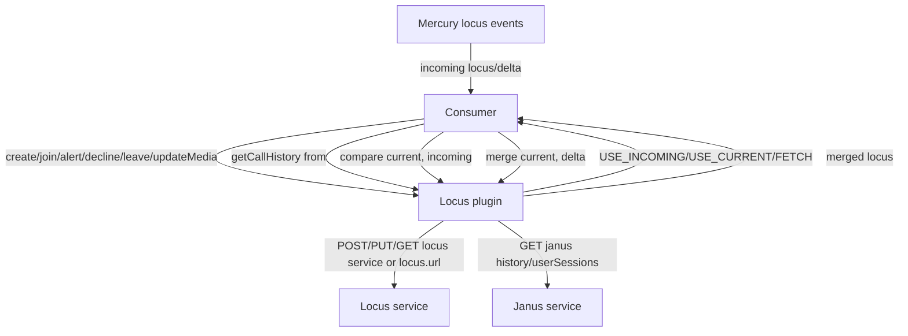
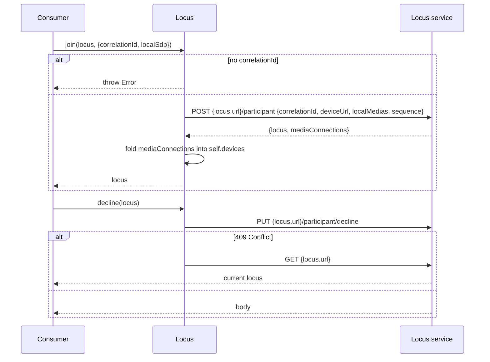
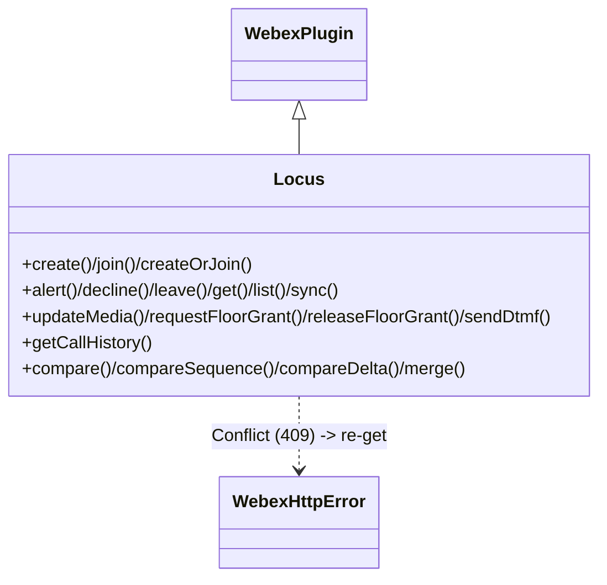

<!-- sdd-generated-metadata
generator: claude-cli
generator_model: us.anthropic.claude-opus-4-8
approved_by: pending-human-review
updated_at: 2026-08-06T00:00:00Z
validation_status: not-run
run_id: 51855eac-8de5-43a2-a3b6-dbcc55ebc91b
-->

# @webex/internal-plugin-locus — SPEC

> Start here → root [`AGENTS.md`](../../../../AGENTS.md) (agent entry) · router [`SPEC_INDEX.md`](../../../../ai-docs/SPEC_INDEX.md) · system [`ARCHITECTURE.md`](../../../../ai-docs/ARCHITECTURE.md). This is the module's canonical spec: orientation, requirements, design, flows, and tests.
> Context-efficiency: link to canonical docs — don't duplicate them. Load specs on demand per `SPEC_INDEX.md`.

## Metadata

| Field | Value |
|---|---|
| Module id | `internal-plugin-locus` |
| Source path(s) | `packages/@webex/internal-plugin-locus/src/` |
| Parent spec | `—` (registered internal Webex plugin; composed by `webex-core`, no parent module) |
| Doc kind | Module spec |
| Coverage score | Pending coverage assessment |
| Generated from | `module-spec` @ SDLC template library `0.2.2` |
| generated_by / approved_by / updated_at | claude-cli / pending-human-review / 2026-08-06 |
| Validation status | not-run, validator `pending`, assessed 2026-08-06 |

Coverage score is `Pending coverage assessment` until the first coverage review runs. Manifest coverage
state (`Partial`) is authoritative and kept in `.sdd/manifest.json`.

## Evidence Rules
Every requirement cites concrete source evidence using `file path`. Test evidence is preferred for WHY.
Requirements are grounded in the current implementation under `src/`.

## Source Material Register

| Source material | Scope | Decision | Detail location or disposition |
|---|---|---|---|
| Module source (`locus.js`, `event-keys.js`, `index.js`) | overview / API | used | Overview, Public Surface, Requirements, and Design sections derived from current implementation. |

## Overview

`@webex/internal-plugin-locus` is an internal Webex SDK plugin (registered as `locus`) that talks to the
**Locus** call/meeting-control service. A "locus" is the server's authoritative representation of a call or
meeting (participants, self state, media, sequence). The plugin provides call lifecycle operations —
create/join (`create`/`join`/`createOrJoin`), `alert`, `decline`, `leave`, `get`, `list` — plus media and
floor control (`updateMedia`, `requestFloorGrant`/`releaseFloorGrant`, `sendDtmf`) and call-history retrieval
via **Janus** (`getCallHistory`).

The plugin's most distinctive responsibility is **locus sequence reconciliation**: `compare`,
`compareSequence`, `compareDelta`, and `merge` implement the algorithm that decides, given a current locus
and an incoming (possibly delta) locus DTO, whether to use the incoming state, keep the current state, or
re-fetch — and how to merge delta participant changes. It exports the reconciliation result constants
(`USE_INCOMING`, `USE_CURRENT`, `EQUAL`, `FETCH`, `GREATER_THAN`, `LESS_THAN`, `DESYNC`) and the list of
Locus Mercury event keys (`event-keys.js`). A maintainer should start at `src/locus.js`.

## Purpose / Responsibility

Owns Locus call/meeting operations and client-side locus sequence comparison/merge. It does NOT own media
negotiation itself (only relays SDP to Locus), the Mercury transport that delivers locus events (delegated to
`internal-plugin-mercury`), or the higher-level meeting orchestration (owned by the meetings plugin).

## Stack

JavaScript (ES modules, `src/locus.js`), built with `webex-legacy-tools`. Tests run under Jest
(`webex-legacy-tools test --unit --runner jest`) with chai and mock-webex helpers. Runtime dependencies:
`@webex/webex-core` (`WebexPlugin`, `WebexHttpError`), `@webex/internal-plugin-mercury` (imported for
composition/events), `lodash` (`cloneDeep`, `difference`, `first`, `last`, `memoize`), and `uuid`.

## Folder / Package Structure

```
packages/@webex/internal-plugin-locus/src/
├── index.js        # registerInternalPlugin('locus', Locus); re-exports eventKeys + comparison constants
├── locus.js        # Locus WebexPlugin: call ops, media/floor control, sequence compare/merge; result constants
└── event-keys.js   # locusEventKeys: the Locus Mercury event names
```

## Key Files (source of truth)

| File | Holds |
|---|---|
| `packages/@webex/internal-plugin-locus/src/locus.js` | All call operations, sequence comparison/merge algorithm, and the exported result constants |
| `packages/@webex/internal-plugin-locus/src/event-keys.js` | `locusEventKeys` — the canonical list of Locus Mercury event names |
| `packages/@webex/internal-plugin-locus/src/index.js` | Registration name (`locus`) and public re-exports |

## Public Surface

Consumed as an internal SDK plugin via `webex.internal.locus`.

| Contract ID | Type | Surface | Purpose | Compatibility / deprecation | Schema / detail link | Root index |
|---|---|---|---|---|---|---|
| `locus.create` / `join` / `createOrJoin` | SDK | `create(invitee, options)` · `join(locus, options)` · `createOrJoin(target, options)` | Start or join a call (requires `correlationId`); attach `localSdp` | Stable; `mediaConnections` folded into `self.devices` | `packages/@webex/internal-plugin-locus/src/locus.js` | `../../../../ai-docs/CONTRACTS.md` |
| `locus.alert` / `decline` / `leave` | SDK | participant lifecycle transitions | PUT `.../participant/alert`, `.../decline`, `.../leave`; decline/leave re-`get` on 409 | Stable | `packages/@webex/internal-plugin-locus/src/locus.js` | `../../../../ai-docs/CONTRACTS.md` |
| `locus.get` / `list` / `sync` | SDK | `get(locus)` · `list()` · `sync(locus)` | Fetch one/all loci; fetch delta from `syncUrl` (no merge) | Stable; `sync` may 204→`{}` | `packages/@webex/internal-plugin-locus/src/locus.js` | `../../../../ai-docs/CONTRACTS.md` |
| `locus.updateMedia` | SDK | `updateMedia(locus, {sdp, audioMuted, videoMuted, mediaId})` | PUT `.../media` to update SDP / mute state | Stable | `packages/@webex/internal-plugin-locus/src/locus.js` | `../../../../ai-docs/CONTRACTS.md` |
| `locus.requestFloorGrant` / `releaseFloorGrant` | SDK | grant/release a media-share floor | PUT the share url with `floor` disposition GRANTED/RELEASED | Stable | `packages/@webex/internal-plugin-locus/src/locus.js` | `../../../../ai-docs/CONTRACTS.md` |
| `locus.sendDtmf` | SDK | `sendDtmf(locus, tones)` | POST `.../sendDtmf` with a uuid correlationId | Stable | `packages/@webex/internal-plugin-locus/src/locus.js` | `../../../../ai-docs/CONTRACTS.md` |
| `locus.getCallHistory` | SDK | `getCallHistory({from})` | GET `janus history/userSessions?from=` | Stable | `packages/@webex/internal-plugin-locus/src/locus.js` | `../../../../ai-docs/CONTRACTS.md` |
| `locus.compare` / `compareSequence` / `compareDelta` / `merge` | SDK | sequence reconciliation + delta merge | Decide USE_INCOMING/USE_CURRENT/FETCH; merge delta participants | Stable; core sync algorithm | `packages/@webex/internal-plugin-locus/src/locus.js` | `../../../../ai-docs/CONTRACTS.md` |
| `locus` constants + `eventKeys` | SDK (exports) | `USE_INCOMING`/`USE_CURRENT`/`EQUAL`/`FETCH`/`GREATER_THAN`/`LESS_THAN`/`DESYNC`; `locusEventKeys` | Reconciliation results and Locus Mercury event names | Stable | `packages/@webex/internal-plugin-locus/src/index.js`, `src/event-keys.js` | `../../../../ai-docs/CONTRACTS.md` |

Compatibility notes:
- Method names/signatures, the reconciliation result constants, and `locusEventKeys` are the
  semver-controlled contract.
- `create`/`join` return the locus with the deprecated `mediaConnections` folded into `self.devices[i].mediaConnections`.

## Requires (dependencies)

- `@webex/webex-core` — base `WebexPlugin`, `this.request`/`webex.request`, and `WebexHttpError.Conflict`
  (used to re-`get` on 409).
- `@webex/internal-plugin-mercury` — imported for composition; Locus events (`locusEventKeys`) arrive over
  Mercury and drive `compare`/`merge` in consumers.
- `@webex/internal-plugin-device` — `webex.internal.device.url` sent in call operation bodies.
- `lodash` (`cloneDeep`, `difference`, `first`, `last`, `memoize`), `uuid`.
- External services: **locus** (`service: 'locus'`, or per-locus `url`) and **janus** (`service: 'janus'`,
  call history).

## Requirements

| ID | WHAT | WHY | Source Evidence | Test / Example Evidence | Assumptions / Gaps | Confidence |
|---|---|---|---|---|---|---|
| `LOCUS-R-001` | `create` throws without `options.correlationId`, POSTs `locus loci/call` with correlationId/deviceUrl/invitee/localMedias/empty sequence, folds `res.body.mediaConnections[i]` into `self.devices[i].mediaConnections`, and returns `res.body.locus`. | Starting a call requires a correlation id and must return a normalized locus (mediaConnections deprecated). | `packages/@webex/internal-plugin-locus/src/locus.js` | `packages/@webex/internal-plugin-locus/test/` | none identified | PRESENT |
| `LOCUS-R-002` | `join` throws without `locus.correlationId`/`options.correlationId`, POSTs `{locus.url}/participant` with localMedias and the locus sequence (or empty), folds mediaConnections into `self.devices`, and returns the locus; `createOrJoin` joins when `target.url` exists else creates. | Joining an existing locus needs a correlation id and the current sequence; `createOrJoin` routes by presence of a url. | `packages/@webex/internal-plugin-locus/src/locus.js` | `packages/@webex/internal-plugin-locus/test/` | none identified | PRESENT |
| `LOCUS-R-003` | `alert` PUTs `.../participant/alert`; `decline` PUTs `.../participant/decline` and `leave` PUTs `.../self.url/leave`, both sending deviceUrl+sequence and re-`get`ting the locus when the request fails with `WebexHttpError.Conflict`. | Lifecycle transitions must carry device/sequence, and a 409 means the caller should reconcile against the current locus. | `packages/@webex/internal-plugin-locus/src/locus.js` | `packages/@webex/internal-plugin-locus/test/` | none identified | PRESENT |
| `LOCUS-R-004` | `get` GETs the locus url; `list` GETs `locus loci` → `res.body.loci`; `sync` GETs `locus.syncUrl` and resolves `res.body || {}` (tolerating a 204). | Consumers need single/collection reads plus a merge-free delta fetch. | `packages/@webex/internal-plugin-locus/src/locus.js` | `packages/@webex/internal-plugin-locus/test/` | none identified | PRESENT |
| `LOCUS-R-005` | `updateMedia` PUTs `.../media` with a JSON `localSdp` carrying `audioMuted`/`videoMuted` (and `type:'SDP'`+`sdp` when an sdp is given), the mediaId, deviceUrl, and sequence, returning the updated locus. | Mute/SDP changes are relayed to Locus/Linus with the current sequence. | `packages/@webex/internal-plugin-locus/src/locus.js` | `packages/@webex/internal-plugin-locus/test/` | none identified | PRESENT |
| `LOCUS-R-006` | `requestFloorGrant`/`releaseFloorGrant` PUT the share url with a `floor` object (`disposition` GRANTED with beneficiary self/device, or RELEASED); `sendDtmf` POSTs `.../sendDtmf` with a uuid correlationId and tones. | Media-share floor and DTMF are dedicated Locus control operations. | `packages/@webex/internal-plugin-locus/src/locus.js` | `packages/@webex/internal-plugin-locus/test/` | none identified | PRESENT |
| `LOCUS-R-007` | `getCallHistory` GETs `janus history/userSessions` with `qs:{from}` (default now, ISO-8601). | Call history lives in Janus, separate from Locus. | `packages/@webex/internal-plugin-locus/src/locus.js` | `packages/@webex/internal-plugin-locus/test/` | none identified | PRESENT |
| `LOCUS-R-008` | `compare` returns USE_INCOMING when either locus sequence is empty, delegates to `compareDelta` when incoming has a `baseSequence`, else maps `compareSequence` to an action; `compareSequence` returns LESS_THAN/GREATER_THAN/EQUAL/DESYNC using range/entry set analysis. | Clients must decide deterministically whether to apply, keep, or re-fetch locus state to stay consistent. | `packages/@webex/internal-plugin-locus/src/locus.js` | `packages/@webex/internal-plugin-locus/test/` | none identified | PRESENT |
| `LOCUS-R-009` | `merge` returns the incoming locus when it is not a delta (no `baseSequence`); for a delta it clones current, replaces non-null top-level fields (except baseSequence/participants), removes participants flagged `removed`, and upserts the rest by `url`. | Delta events must be merged losslessly into the working locus copy. | `packages/@webex/internal-plugin-locus/src/locus.js` | `packages/@webex/internal-plugin-locus/test/` | none identified | PRESENT |

## Design Overview

`Locus` extends `WebexPlugin` (`namespace: 'Locus'`) and is split between HTTP call operations and a pure
client-side reconciliation algorithm. Call operations target either the `locus` service (`create`, `list`,
`getCallHistory` via `janus`) or a per-locus absolute `url` (`join`, `alert`, `decline`, `leave`,
`updateMedia`, `sendDtmf`, floor grants). `create`/`join` normalize the deprecated `mediaConnections` array
into each `self.devices` entry. `decline`/`leave` treat an HTTP 409 (`WebexHttpError.Conflict`) as "state
moved on" and re-`get` the locus so the caller can reconcile.

The reconciliation core (`compare`/`compareSequence`/`compareDelta`/`merge`) implements Locus's sequence
protocol. `compareSequence` classifies two sequences as `LESS_THAN`/`GREATER_THAN`/`EQUAL`/`DESYNC` by
comparing range boundaries and the set difference of entries (memoized for performance), and `compareToAction`
maps those to `USE_INCOMING`/`USE_CURRENT`/`FETCH`. `compare` short-circuits empty sequences to `USE_INCOMING`
and routes delta events (those with a `baseSequence`) through `compareDelta`. `merge` applies a delta: clone
current, overwrite non-null scalar/array fields, then reconcile the `participants` collection by removing
`removed=true` entries and upserting the rest keyed by `url`.

## Data Flow



## Sequence Diagram(s)

Sequence coverage:

| Operation group | Diagram | Failure / recovery coverage |
|---|---|---|
| Join / lifecycle | 1. join & decline | `alt` covers missing correlationId throw and 409→re-get |
| Sequence reconciliation | 2. compare + merge | `alt` covers empty/delta routing and USE_INCOMING/CURRENT/FETCH |

### 1. Join & decline



### 2. compare + merge

```mermaid
sequenceDiagram
    participant C as Consumer
    participant L as Locus
    C->>L: compare(current, incoming)
    alt current or incoming sequence empty
        L-->>C: USE_INCOMING
    else incoming.baseSequence present
        L->>L: compareDelta(current, incoming)
        L-->>C: USE_INCOMING / USE_CURRENT / FETCH
    else
        L->>L: compareSequence -> compareToAction
        L-->>C: USE_CURRENT / USE_INCOMING / FETCH
    end
    C->>L: merge(current, delta)
    L->>L: clone current; overwrite fields; upsert/remove participants
    L-->>C: merged locus
```

## Class / Component Relationships



`Locus` extends `WebexPlugin`; call operations use `this.request`/`webex.request`, and reconciliation is pure
in-memory logic over locus sequence DTOs.

## Use Cases

- **UC-1 Start a call:** `create(invitee, {correlationId, localSdp})` → returns the locus. Evidence: `packages/@webex/internal-plugin-locus/src/locus.js`.
- **UC-2 Join / decline / leave:** `join(locus, options)`, `decline(locus)`, `leave(locus)` (409 → re-get). Evidence: `packages/@webex/internal-plugin-locus/src/locus.js`.
- **UC-3 Reconcile an incoming locus event:** `compare(current, incoming)` → apply/keep/fetch, then `merge(current, delta)`. Evidence: `packages/@webex/internal-plugin-locus/src/locus.js`.
- **UC-4 Update media / floor / DTMF:** `updateMedia(...)`, `requestFloorGrant(...)`, `sendDtmf(locus, tones)`. Evidence: `packages/@webex/internal-plugin-locus/src/locus.js`.
- **UC-5 Fetch call history:** `getCallHistory({from})` via Janus. Evidence: `packages/@webex/internal-plugin-locus/src/locus.js`.

## Business Rules & Invariants

- A call operation that mutates a locus (`create`/`join`/`alert`/`decline`/`leave`/`updateMedia`) carries the
  device url and (where applicable) the current sequence — enforced in `locus.js`.
- `create`/`join` require a `correlationId` and throw synchronously otherwise — enforced in `locus.js`.
- Empty-sequence loci always yield `USE_INCOMING`; delta events (with `baseSequence`) route through
  `compareDelta` — enforced in `compare`.
- Delta merge removes `removed=true` participants and upserts the rest by `url`, preserving the working copy's
  other participants — enforced in `merge`.

## Error Handling & Failure Modes

| Condition | Signal (error/code/result) | Caller recovery |
|---|---|---|
| Missing `correlationId` (`create`/`join`) | thrown `Error` (synchronous) | Provide a correlationId |
| 409 Conflict on `decline`/`leave` | re-`get`s and resolves the current locus | Reconcile against returned locus |
| `sync` returns 204 | resolves `{}` | Treat as "no delta" |
| Unknown `compareSequence` result in `compareToAction` | throws `Error('... not a recognized ...')` | Indicates a protocol bug |
| Other HTTP failure | rejected Promise from the request | Inspect underlying error |

## Pitfalls

- `create`/`join` throw synchronously (not rejected Promises) when `correlationId` is missing — wrap calls
  accordingly.
- `mediaConnections` is deprecated; the returned locus already folds it into `self.devices` — don't read the
  top-level array.
- Sequence comparison is subtle: an empty sequence forces `USE_INCOMING`, and only `DESYNC` maps to `FETCH`;
  do not reimplement the comparison outside `compareSequence`.
- `merge` mutates a `cloneDeep` of current and only overwrites non-null delta fields — a delta field must be
  present (non-null) to replace the working copy value.

## Test-Case Strategy (module)

Unit tests (Jest + chai + mock-webex) should mock `this.request`/`webex.request`, asserting: `create`/`join`
throw without a correlationId (negative) and post the right body + fold mediaConnections (positive);
`decline`/`leave` re-`get` on a `Conflict` (positive) and reject other errors (negative); `updateMedia`
serializes the localSdp/mute state; floor grant/DTMF hit the right endpoints; `getCallHistory` uses Janus; and
`compareSequence`/`compare`/`compareDelta`/`merge` cover EQUAL/GREATER_THAN/LESS_THAN/DESYNC, empty-sequence,
delta routing, and participant add/remove/upsert cases.

| Behavior / Requirement | Existing test evidence | Gap |
|---|---|---|
| `LOCUS-R-001` | `packages/@webex/internal-plugin-locus/test/` | Confirm correlationId throw + mediaConnections fold |
| `LOCUS-R-002` | `packages/@webex/internal-plugin-locus/test/` | Confirm join sequence + createOrJoin routing |
| `LOCUS-R-003` | `packages/@webex/internal-plugin-locus/test/` | Confirm 409 re-get on decline/leave |
| `LOCUS-R-004` | `packages/@webex/internal-plugin-locus/test/` | Confirm get/list/sync (204) shapes |
| `LOCUS-R-005` | `packages/@webex/internal-plugin-locus/test/` | Confirm updateMedia localSdp/mute |
| `LOCUS-R-006` | `packages/@webex/internal-plugin-locus/test/` | Confirm floor grant/release + DTMF |
| `LOCUS-R-007` | `packages/@webex/internal-plugin-locus/test/` | Confirm Janus history query |
| `LOCUS-R-008` | `packages/@webex/internal-plugin-locus/test/` | Confirm compareSequence classifications |
| `LOCUS-R-009` | `packages/@webex/internal-plugin-locus/test/` | Confirm delta merge participant handling |

## Traceability

- Repo architecture: [`ARCHITECTURE.md`](../../../../ai-docs/ARCHITECTURE.md) · Registry: [`SPEC_INDEX.md`](../../../../ai-docs/SPEC_INDEX.md)
- Coverage state & contracts baseline: `.sdd/manifest.json`
