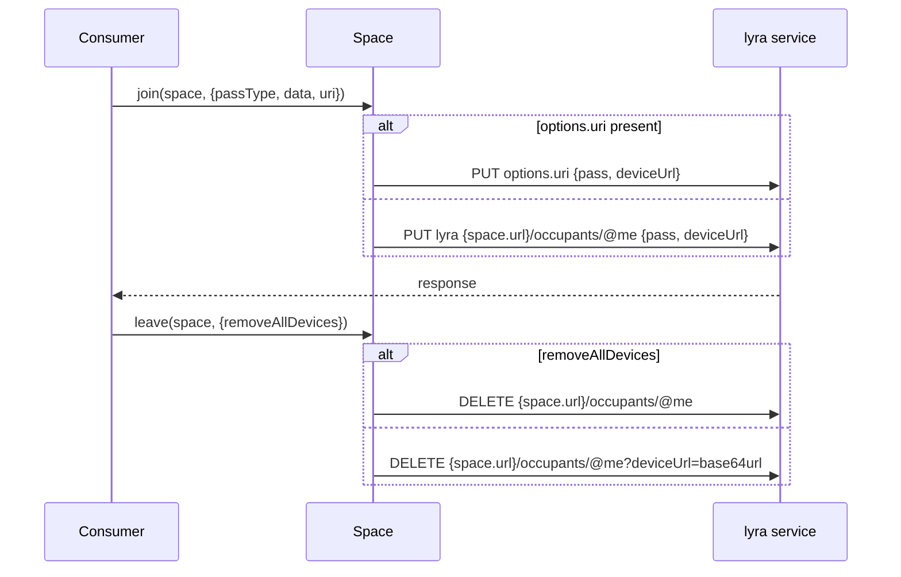
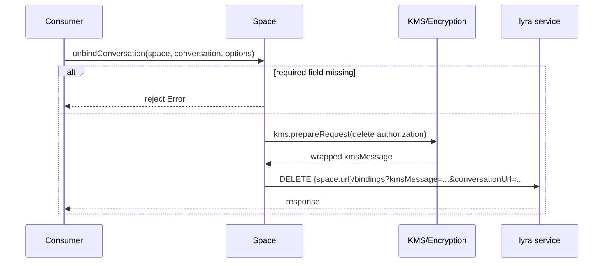
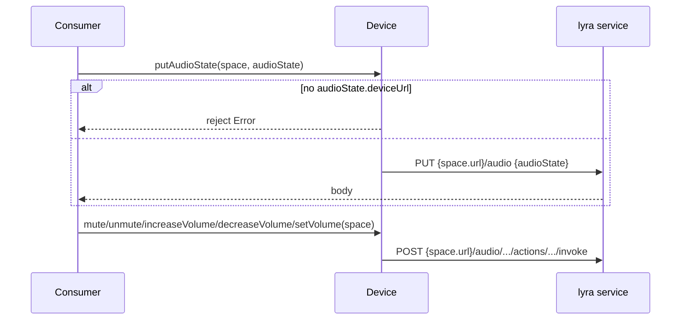
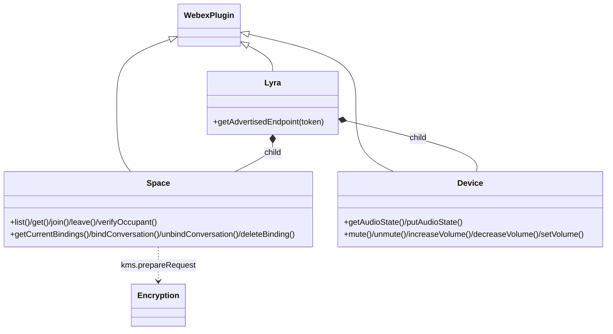

<!-- sdd-generated-metadata
generator: claude-cli
generator_model: us.anthropic.claude-opus-4-8
approved_by: pending-human-review
updated_at: 2026-08-06T00:00:00Z
validation_status: not-run
run_id: 51855eac-8de5-43a2-a3b6-dbcc55ebc91b
-->

# @webex/internal-plugin-lyra — SPEC

> Start here → root [`AGENTS.md`](../../../../AGENTS.md) (agent entry) · router [`SPEC_INDEX.md`](../../../../ai-docs/SPEC_INDEX.md) · system [`ARCHITECTURE.md`](../../../../ai-docs/ARCHITECTURE.md). This is the module's canonical spec: orientation, requirements, design, flows, and tests.
> Context-efficiency: link to canonical docs — don't duplicate them. Load specs on demand per `SPEC_INDEX.md`.

## Metadata

| Field | Value |
|---|---|
| Module id | `internal-plugin-lyra` |
| Source path(s) | `packages/@webex/internal-plugin-lyra/src/` |
| Parent spec | `—` (registered internal Webex plugin; composed by `webex-core`, no parent module) |
| Doc kind | Module spec |
| Coverage score | Pending coverage assessment |
| Generated from | `module-spec` @ SDLC template library `0.2.2` |
| generated_by / approved_by / updated_at | claude-cli / pending-human-review / 2026-08-06 |
| Validation status | not-run, validator `pending`, assessed 2026-08-06 |

Coverage score is `Pending coverage assessment` until the first coverage review runs. Manifest coverage
state (`Partial`) is authoritative and kept in `.sdd/manifest.json`.

## Evidence Rules
Every requirement cites concrete source evidence using `file path`. Test evidence is preferred for WHY.
Requirements are grounded in the current implementation under `src/`.

## Source Material Register

| Source material | Scope | Decision | Detail location or disposition |
|---|---|---|---|
| Module source (`lyra.js`, `space.js`, `device.js`, `index.js`, `config.js`) | overview / API | used | Overview, Public Surface, Requirements, and Design sections derived from current implementation. |

## Overview

`@webex/internal-plugin-lyra` is an internal Webex SDK plugin (registered as `lyra`) for interacting with
Lyra spaces — the pairing between a user and a physical Webex room device (via ultrasound proximity). The
top-level `Lyra` plugin resolves an advertised endpoint from an ultrasound token and composes two child
plugins: `space` (join/leave a Lyra space, verify occupants, and bind/unbind conversations) and `device`
(read/update the room device's audio state — volume and microphone mute).

Most methods issue requests against the `lyra` service (`api: 'lyra'`) using each space's/device's own
resource URL, or a caller-supplied full `uri`. Conversation binding/unbinding integrates with KMS via
`webex.internal.encryption.kms.prepareRequest` to authorize the space against the conversation's KMS
resource. Endpoint discovery uses the `proximity` service. A maintainer should start at `src/lyra.js`,
`src/space.js`, and `src/device.js`.

## Purpose / Responsibility

Owns Lyra space membership and room-device control: endpoint discovery, space join/leave, occupant
verification, conversation binding (KMS-authorized), and audio-state control. It does NOT own KMS key
management (delegated to `internal-plugin-encryption`), conversations (delegated to
`internal-plugin-conversation`), or transport/auth (delegated to `webex-core`).

## Stack

JavaScript (ES modules, `src/lyra.js`, `src/space.js`, `src/device.js`), built with `webex-legacy-tools`.
Tests run under Jest (`webex-legacy-tools test --unit --runner jest`) with `sinon`, chai, and
`@webex/test-helper-retry`. Runtime dependencies: `@webex/webex-core`, `@webex/common` (`base64`),
`@webex/internal-plugin-encryption` (KMS), `@webex/internal-plugin-conversation`,
`@webex/internal-plugin-mercury`, `@webex/internal-plugin-feature`, `@webex/internal-plugin-locus`,
`bowser`, `uuid`, and Node `querystring`.

## Folder / Package Structure

```
packages/@webex/internal-plugin-lyra/src/
├── index.js     # registerInternalPlugin('lyra', Lyra, {config}); imports mercury/encryption/conversation/feature
├── lyra.js      # Lyra WebexPlugin: children {space, device}; getAdvertisedEndpoint
├── space.js     # Space child plugin: list/get/join/leave/verifyOccupant/getCurrentBindings/bind/unbind/deleteBinding
├── device.js    # Device child plugin: getAudioState/putAudioState/mute/unmute/increaseVolume/decreaseVolume/setVolume
└── config.js    # Plugin config namespace (lyra)
```

## Key Files (source of truth)

| File | Holds |
|---|---|
| `packages/@webex/internal-plugin-lyra/src/lyra.js` | Top-level plugin, `children` wiring, `getAdvertisedEndpoint` (proximity) |
| `packages/@webex/internal-plugin-lyra/src/space.js` | Space membership + conversation binding (KMS-authorized) methods and validation |
| `packages/@webex/internal-plugin-lyra/src/device.js` | Room-device audio-state read/update and mute/volume actions |
| `packages/@webex/internal-plugin-lyra/src/index.js` | Registration name (`lyra`) |

## Public Surface

Consumed as an internal SDK plugin via `webex.internal.lyra`, `webex.internal.lyra.space`, and
`webex.internal.lyra.device`.

| Contract ID | Type | Surface | Purpose | Compatibility / deprecation | Schema / detail link | Root index |
|---|---|---|---|---|---|---|
| `lyra.getAdvertisedEndpoint` | SDK | `getAdvertisedEndpoint(token): Promise<Endpoint>` | GET `proximity /ultrasound/advertisements?token=` to resolve the advertised endpoint | Stable | `packages/@webex/internal-plugin-lyra/src/lyra.js` | `../../../../ai-docs/CONTRACTS.md` |
| `lyra.space.list` / `get` | SDK | `list(): Promise<items[]>` · `get(space): Promise<space>` | GET `lyra /spaces` / `/spaces/{id}` | Stable; `get` requires `space.id` or `space.identity.id` | `packages/@webex/internal-plugin-lyra/src/space.js` | `../../../../ai-docs/CONTRACTS.md` |
| `lyra.space.join` / `leave` | SDK | `join(space, options): Promise` · `leave(space, options): Promise` | PUT/DELETE `{space.url}/occupants/@me`; `passType` default `MANUAL`; optional `removeAllDevices` | Stable; supports custom `options.uri` | `packages/@webex/internal-plugin-lyra/src/space.js` | `../../../../ai-docs/CONTRACTS.md` |
| `lyra.space.verifyOccupant` | SDK | `verifyOccupant(space, occupantId): Promise` | PUT `{space.url}/occupants/{id}` with `pass.type: VERIFICATION` | Stable | `packages/@webex/internal-plugin-lyra/src/space.js` | `../../../../ai-docs/CONTRACTS.md` |
| `lyra.space.getCurrentBindings` | SDK | `getCurrentBindings(space): Promise<bindings>` | GET `{space.url}/bindings` | Stable | `packages/@webex/internal-plugin-lyra/src/space.js` | `../../../../ai-docs/CONTRACTS.md` |
| `lyra.space.bindConversation` / `unbindConversation` / `deleteBinding` | SDK | bind/unbind/delete a conversation↔space binding | Bind (POST with KMS authorization) / unbind + deleteBinding (DELETE with KMS-signed `kmsMessage`) | Stable; strict required-field validation | `packages/@webex/internal-plugin-lyra/src/space.js` | `../../../../ai-docs/CONTRACTS.md` |
| `lyra.device.getAudioState` / `putAudioState` | SDK | GET/PUT `{space.url}/audio` | Read / update volume + microphone state | Stable; `putAudioState` requires `audioState.deviceUrl` | `packages/@webex/internal-plugin-lyra/src/device.js` | `../../../../ai-docs/CONTRACTS.md` |
| `lyra.device.mute` / `unmute` / `increaseVolume` / `decreaseVolume` / `setVolume` | SDK | POST `{space.url}/audio/.../actions/.../invoke` | Room-device mic/volume actions | Stable | `packages/@webex/internal-plugin-lyra/src/device.js` | `../../../../ai-docs/CONTRACTS.md` |

Compatibility notes:
- Method names/signatures and the `pass.type` values (`MANUAL`, `VERIFICATION`) are the semver-controlled
  contract.
- Space/device operations accept either the `lyra` service + `space.url` resource or a full `options.uri`.

## Requires (dependencies)

- `@webex/webex-core` — base `WebexPlugin`, `registerInternalPlugin`, `webex.request`,
  `webex.internal.device.url`.
- `@webex/internal-plugin-encryption` — `webex.internal.encryption.kms.prepareRequest` for KMS-signed
  unbind/deleteBinding `kmsMessage`s.
- `@webex/common` — `base64` for encoding device/conversation URLs.
- `@webex/internal-plugin-conversation`, `@webex/internal-plugin-mercury`,
  `@webex/internal-plugin-feature`, `@webex/internal-plugin-locus` — imported for composition.
- External services: **lyra** (`api: 'lyra'`) and **proximity** (`api: 'proximity'`).

## Requirements

| ID | WHAT | WHY | Source Evidence | Test / Example Evidence | Assumptions / Gaps | Confidence |
|---|---|---|---|---|---|---|
| `LYRA-R-001` | `getAdvertisedEndpoint(token)` GETs `proximity /ultrasound/advertisements` with `qs:{token}` and resolves the body. | Ultrasound pairing resolves the room endpoint before any space operation. | `packages/@webex/internal-plugin-lyra/src/lyra.js` | `packages/@webex/internal-plugin-lyra/test/` | none identified | PRESENT |
| `LYRA-R-002` | `space.get` rejects when neither `space.id` nor `space.identity.id` is present, else GETs `lyra /spaces/{id}`; `space.list` GETs `lyra /spaces` and resolves `items`. | Space lookup requires an identifier; listing returns the user's spaces. | `packages/@webex/internal-plugin-lyra/src/space.js` | `packages/@webex/internal-plugin-lyra/test/` | none identified | PRESENT |
| `LYRA-R-003` | `space.join` defaults `passType` to `MANUAL`, sends `{pass:{type,[data]}, deviceUrl, [verificationInitiation]}` via PUT to `{space.url}/occupants/@me` (or `options.uri`). | Joining keeps the user present in the space; MANUAL requires ~10-minute keepalive. | `packages/@webex/internal-plugin-lyra/src/space.js` | `packages/@webex/internal-plugin-lyra/test/` | none identified | PRESENT |
| `LYRA-R-004` | `space.leave` DELETEs `{space.url}/occupants/@me`; unless `options.removeAllDevices`, it appends a base64url-encoded `deviceUrl` query so only the current device is removed. | Leaving must optionally scope to just this device rather than all of the user's devices. | `packages/@webex/internal-plugin-lyra/src/space.js` | `packages/@webex/internal-plugin-lyra/test/` | none identified | PRESENT |
| `LYRA-R-005` | `space.bindConversation` validates `space.url`, space id, `conversation.kmsResourceObjectUrl`, and `conversation.url`, then POSTs a `kmsMessage` (create authorization) + `conversationUrl`; `_bindConversation` currently resolves immediately (capability posting disabled). | Binding authorizes the space against the conversation's KMS resource; capability posting is intentionally short-circuited. | `packages/@webex/internal-plugin-lyra/src/space.js` | `packages/@webex/internal-plugin-lyra/test/` | `_bindConversation` returns early before the capability PUT | PRESENT |
| `LYRA-R-006` | `space.unbindConversation` and `deleteBinding` validate required fields, build a KMS `delete authorization` message, sign it via `encryption.kms.prepareRequest`, then DELETE the bindings URL (by conversation url or binding id). | Removing a binding must revoke the KMS authorization with a signed message. | `packages/@webex/internal-plugin-lyra/src/space.js` | `packages/@webex/internal-plugin-lyra/test/` | none identified | PRESENT |
| `LYRA-R-007` | `device.putAudioState` rejects when `audioState.deviceUrl` is missing, else PUTs `{space.url}/audio`; `getAudioState` GETs it; `mute`/`unmute`/`increaseVolume`/`decreaseVolume`/`setVolume` POST the corresponding `.../actions/.../invoke` endpoints. | Room-device audio control must validate the device and hit the correct action endpoints. | `packages/@webex/internal-plugin-lyra/src/device.js` | `packages/@webex/internal-plugin-lyra/test/` | none identified | PRESENT |

## Design Overview

`Lyra` extends `WebexPlugin` and declares `children: {space, device}`, so `webex.internal.lyra.space` and
`webex.internal.lyra.device` are composed child plugins sharing the `Lyra` namespace. The top-level plugin
only performs endpoint discovery against `proximity`. `Space` concentrates membership and binding logic:
each method validates required fields and rejects synchronously (rejected Promise) before issuing a request,
and routes through either the `lyra` service + `space.url` resource or a caller-supplied full `uri`.

Conversation binding is the most involved flow. `bindConversation` builds a KMS `create` authorization
message referencing the conversation's `kmsResourceObjectUrl` and posts it with the `conversationUrl`;
`_bindConversation` (capability posting to Lyra) is intentionally disabled with an early `Promise.resolve()`.
Unbind/`deleteBinding` construct a KMS `delete` authorization, sign it via
`webex.internal.encryption.kms.prepareRequest`, and DELETE the bindings endpoint with the signed message in
the query string. `Device` is a straightforward audio-state controller mapping methods to the device's
audio action endpoints; `putAudioState` requires `audioState.deviceUrl`.

## Data Flow

```mermaid
flowchart TB
  Consumer -->|getAdvertisedEndpoint token| Lyra
  Lyra -->|GET proximity /ultrasound/advertisements| Prox[proximity service]
  Consumer -->|space.join/leave/verify/list/get| Space
  Space -->|PUT/DELETE/GET lyra /spaces .../occupants/bindings| LyraSvc[lyra service]
  Consumer -->|space.bind/unbind/deleteBinding| Space
  Space -->|prepareRequest kmsMessage| KMS[internal-plugin-encryption / KMS]
  Space -->|POST/DELETE bindings| LyraSvc
  Consumer -->|device.getAudioState/putAudioState/mute/volume| Device
  Device -->|GET/PUT/POST {space.url}/audio ...| LyraSvc
```

## Sequence Diagram(s)

Sequence coverage:

| Operation group | Diagram | Failure / recovery coverage |
|---|---|---|
| Space membership | 1. join/leave | `alt` covers custom `uri` vs `lyra` service; `removeAllDevices` branch |
| KMS-authorized (un)bind | 2. unbindConversation | `alt` covers required-field rejects; KMS signing shown |
| Device audio control | 3. audio state/actions | `alt` covers missing `deviceUrl` reject |

### 1. Space join/leave



### 2. unbindConversation (KMS-authorized)



### 3. Device audio state / actions



## Class / Component Relationships



`Lyra` composes `Space` and `Device` as `children`; both share the `Lyra` namespace and issue requests via
`webex.request`.

## Use Cases

- **UC-1 Pair via ultrasound:** decode ultrasound token → `getAdvertisedEndpoint(token)` → endpoint. Evidence: `packages/@webex/internal-plugin-lyra/src/lyra.js`.
- **UC-2 Join/leave a space:** `space.join(space)` (keepalive) then `space.leave(space)`. Evidence: `packages/@webex/internal-plugin-lyra/src/space.js`.
- **UC-3 Bind/unbind a conversation:** `space.bindConversation(space, conversation)` / `space.unbindConversation(...)` with KMS authorization. Evidence: `packages/@webex/internal-plugin-lyra/src/space.js`.
- **UC-4 Control the room device audio:** `device.putAudioState(...)`, `device.mute(space)`, `device.setVolume(space, level)`. Evidence: `packages/@webex/internal-plugin-lyra/src/device.js`.

## Business Rules & Invariants

- `space.get`/binding operations require a space id (`space.id` or `space.identity.id`) — enforced in `space.js`.
- `bindConversation`/`unbindConversation` require both `conversation.url` and
  `conversation.kmsResourceObjectUrl` — enforced in `space.js`.
- `deleteBinding` requires `options.kmsResourceObjectUrl` and `options.bindingId` — enforced in `space.js`.
- `putAudioState` requires `audioState.deviceUrl` — enforced in `device.js`.

## Error Handling & Failure Modes

| Condition | Signal (error/code/result) | Caller recovery |
|---|---|---|
| Missing `space.id`/`space.identity.id` | rejected Promise `Error('space.id is required')` | Provide a space id |
| Missing `space.url` (bind/unbind/deleteBinding) | rejected Promise `Error('space.url is required')` | Provide the space URL |
| Missing `conversation.url`/`kmsResourceObjectUrl` | rejected Promise with the specific field error | Provide full conversation refs |
| Missing `options.kmsResourceObjectUrl`/`bindingId` (deleteBinding) | rejected Promise with the field error | Provide binding details |
| Missing `audioState.deviceUrl` (putAudioState) | rejected Promise `Error('audioState.deviceUrl is required')` | Provide the device URL |
| HTTP / KMS failure | rejected Promise from request / `prepareRequest` | Inspect underlying error |

## Pitfalls

- `_bindConversation` intentionally returns `Promise.resolve()` before the capability PUT (dead code kept
  behind an early return) — binding relies on the KMS authorization POST, not capability posting.
- `space.leave` removes ALL of the user's devices when `removeAllDevices` is truthy (or `deviceUrl` isn't
  appended); scope carefully.
- Unbind/deleteBinding must sign the `kmsMessage` via `encryption.kms.prepareRequest` before sending — an
  unsigned message will be rejected.
- Space/device methods accept a full `options.uri` that overrides the `lyra` service routing; mixing the two
  forms can send requests to unexpected hosts.

## Test-Case Strategy (module)

Unit tests (Jest + sinon + chai + retry helper) should mock `webex.request` and
`webex.internal.encryption.kms.prepareRequest`, asserting: `getAdvertisedEndpoint` uses the proximity
endpoint; `space.get` rejects without an id (negative) and GETs `/spaces/{id}` (positive); `join`/`leave`
send the right body/URI and handle `removeAllDevices`; `bind`/`unbind`/`deleteBinding` validate fields
(negative) and build/sign the KMS message (positive); and `device.putAudioState` rejects without `deviceUrl`
(negative) while action methods hit the right invoke endpoints (positive).

| Behavior / Requirement | Existing test evidence | Gap |
|---|---|---|
| `LYRA-R-001` | `packages/@webex/internal-plugin-lyra/test/` | Confirm proximity query |
| `LYRA-R-002` | `packages/@webex/internal-plugin-lyra/test/` | Confirm id reject + list items |
| `LYRA-R-003` | `packages/@webex/internal-plugin-lyra/test/` | Confirm MANUAL default + body |
| `LYRA-R-004` | `packages/@webex/internal-plugin-lyra/test/` | Confirm removeAllDevices scoping |
| `LYRA-R-005` | `packages/@webex/internal-plugin-lyra/test/` | Confirm field validation + KMS create msg |
| `LYRA-R-006` | `packages/@webex/internal-plugin-lyra/test/` | Confirm KMS delete signing + DELETE |
| `LYRA-R-007` | `packages/@webex/internal-plugin-lyra/test/` | Confirm audio state + action endpoints |

## Traceability

- Repo architecture: [`ARCHITECTURE.md`](../../../../ai-docs/ARCHITECTURE.md) · Registry: [`SPEC_INDEX.md`](../../../../ai-docs/SPEC_INDEX.md)
- Coverage state & contracts baseline: `.sdd/manifest.json`
