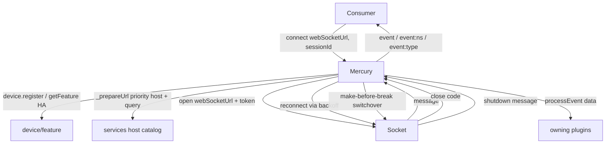
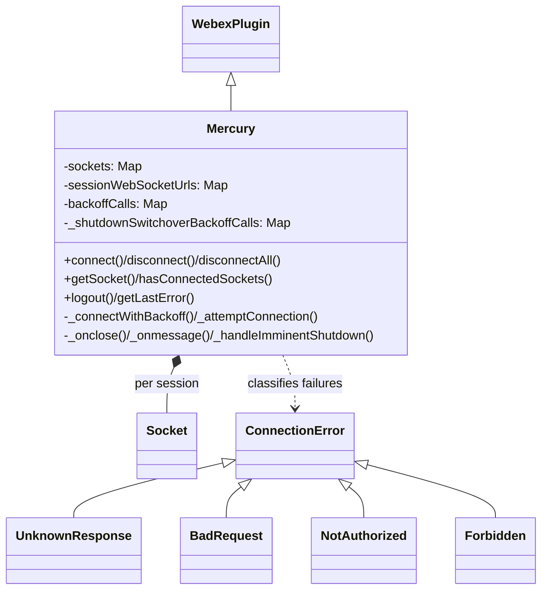
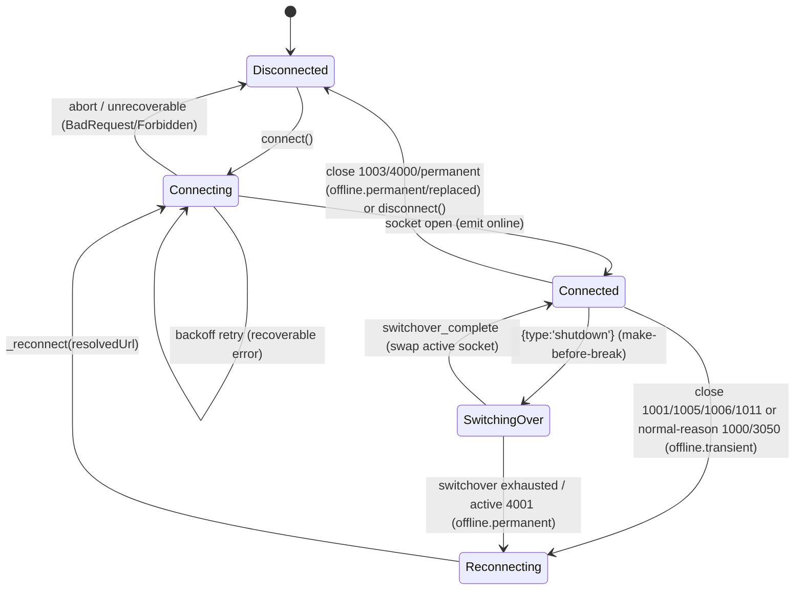

<!-- sdd-generated-metadata
generator: claude-cli
generator_model: us.anthropic.claude-opus-4-8
approved_by: pending-human-review
updated_at: 2026-08-06T00:00:00Z
validation_status: not-run
run_id: 51855eac-8de5-43a2-a3b6-dbcc55ebc91b
-->

# @webex/internal-plugin-mercury — SPEC

> Start here → root [`AGENTS.md`](../../../../AGENTS.md) (agent entry) · router [`SPEC_INDEX.md`](../../../../ai-docs/SPEC_INDEX.md) · system [`ARCHITECTURE.md`](../../../../ai-docs/ARCHITECTURE.md). This is the module's canonical spec: orientation, requirements, design, flows, state, protocol, and tests.
> Context-efficiency: link to canonical docs — don't duplicate them. Load specs on demand per `SPEC_INDEX.md`.

## Metadata

| Field | Value |
|---|---|
| Module id | `internal-plugin-mercury` |
| Source path(s) | `packages/@webex/internal-plugin-mercury/src/` |
| Parent spec | `—` (registered internal Webex plugin; composed by `webex-core`, no parent module) |
| Doc kind | Module spec |
| Coverage score | Pending coverage assessment |
| Generated from | `module-spec` @ SDLC template library `0.2.2` |
| generated_by / approved_by / updated_at | claude-cli / pending-human-review / 2026-08-06 |
| Validation status | not-run, validator `pending`, assessed 2026-08-06 |

Coverage score is `Pending coverage assessment` until the first coverage review runs. Manifest coverage
state (`Partial`) is authoritative and kept in `.sdd/manifest.json`.

## Evidence Rules
Every requirement cites concrete source evidence using `file path`. Test evidence is preferred for WHY.
Requirements are grounded in the current implementation under `src/`.

## Source Material Register

| Source material | Scope | Decision | Detail location or disposition |
|---|---|---|---|
| Module source (`mercury.js`, `errors.js`, `config.js`, `socket/`, `index.js`) | overview / API / state / protocol | used | Overview, Public Surface, Requirements, State Machine, Sequence, and Protocol sections derived from current implementation. |

## Overview

`@webex/internal-plugin-mercury` is an internal Webex SDK plugin (registered as `mercury`) that owns the
persistent WebSocket connection to the Mercury notification service. It manages the full socket lifecycle —
URL preparation (high-availability host selection + query flags), authenticated open, exponential-backoff
reconnection, ping/pong keepalive, and message fan-out — for one or more named sessions keyed by `sessionId`
(default `mercury-default-session`).

Inbound messages are dispatched: envelopes are emitted as `event`/`event:<namespace>`/`event:<eventType>`,
and known event types are autowired to `process<Name>Event` handlers on the matching plugin. The plugin also
handles server-driven concerns: legacy feature-toggle updates, cluster-migration notifications, U2C cache
invalidation, and a make-before-break "imminent shutdown" switchover that opens a replacement socket while
keeping the old one alive. Connection errors are classified via typed exceptions (`ConnectionError` and
subclasses) to drive device refresh, reauthorization, or permanent failure. A maintainer should start at
`src/mercury.js`.

## Purpose / Responsibility

Owns the Mercury WebSocket connection lifecycle and inbound event dispatch for the SDK. It does NOT own the
raw WebSocket implementation (delegated to `src/socket`), device registration/token refresh (delegated to
`internal-plugin-device`/`credentials`), or the domain handling of specific events (delegated to the owning
plugins via autowired `process*Event` handlers).

## Stack

JavaScript (ES modules with decorators, `src/mercury.js`), built with `webex-legacy-tools`. Unit tests run
under Mocha (`webex-legacy-tools test --unit --runner mocha`) with `sinon`, `@sinonjs/fake-timers`, chai,
and mock-web-socket helpers. Runtime dependencies: `@webex/webex-core`, `@webex/common` (`deprecated`,
`Exception`), `@webex/common-timers`, `@webex/internal-plugin-device`, `@webex/internal-plugin-feature`,
`@webex/internal-plugin-metrics`, `backoff`, `lodash`, `uuid`, and `ws` (Node WebSocket, browser-shimmed).

## Folder / Package Structure

```
packages/@webex/internal-plugin-mercury/src/
├── index.js       # registerInternalPlugin('mercury', Mercury, {config, onBeforeLogout}); re-exports Mercury/Socket/errors/config
├── mercury.js     # Mercury WebexPlugin: connect/disconnect, backoff, close handling, message dispatch, shutdown switchover
├── errors.js      # ConnectionError + UnknownResponse/BadRequest/NotAuthorized/Forbidden
├── config.js      # ping/pong/backoff/forceClose/logout-reason config
└── socket/        # Socket transport (index.js barrel; socket.js + browser shim)
```

## Key Files (source of truth)

| File | Holds |
|---|---|
| `packages/@webex/internal-plugin-mercury/src/mercury.js` | Connection lifecycle, backoff, `_onclose` reconnect policy, `_onmessage` dispatch, shutdown switchover |
| `packages/@webex/internal-plugin-mercury/src/errors.js` | Typed close-code exceptions used to classify failures |
| `packages/@webex/internal-plugin-mercury/src/config.js` | `pingInterval`, `pongTimeout`, `backoffTimeMax/Reset`, `forceCloseDelay`, `beforeLogoutOptionsCloseReason` |
| `packages/@webex/internal-plugin-mercury/src/socket/` | The WebSocket transport wrapper and browser shim |

## Public Surface

Consumed as an internal SDK plugin via `webex.internal.mercury`, and as a base class (LLM extends Mercury).

| Contract ID | Type | Surface | Purpose | Compatibility / deprecation | Schema / detail link | Root index |
|---|---|---|---|---|---|---|
| `mercury.connect` | SDK | `connect(webSocketUrl?, sessionId?): Promise<void>` | Register device if needed, then connect a session with backoff; de-dupes in-flight connects | Stable | `packages/@webex/internal-plugin-mercury/src/mercury.js` | `../../../../ai-docs/CONTRACTS.md` |
| `mercury.disconnect` / `disconnectAll` | SDK | `disconnect(options?, sessionId?): Promise<void>` · `disconnectAll(options?)` | Abort backoff and close one/all sessions; clears session maps | Stable | `packages/@webex/internal-plugin-mercury/src/mercury.js` | `../../../../ai-docs/CONTRACTS.md` |
| `mercury.getSocket` / `getSockets` / `hasConnectedSockets` / `hasConnectingSockets` | SDK | per-session socket accessors + status | Inspect connection state | Stable | `packages/@webex/internal-plugin-mercury/src/mercury.js` | `../../../../ai-docs/CONTRACTS.md` |
| `mercury.getLastError` | SDK | `getLastError(): any` | Return the last connection error | Stable | `packages/@webex/internal-plugin-mercury/src/mercury.js` | `../../../../ai-docs/CONTRACTS.md` |
| `mercury.logout` | SDK | `logout(): Promise<void>` | Disconnect all with a configurable close reason (via `onBeforeLogout`) | Stable | `packages/@webex/internal-plugin-mercury/src/mercury.js` | `../../../../ai-docs/CONTRACTS.md` |
| `mercury.listen` / `stopListening` | SDK | deprecated aliases for connect/disconnect | Legacy API | **Deprecated** — use `connect`/`disconnect` | `packages/@webex/internal-plugin-mercury/src/mercury.js` | `../../../../ai-docs/CONTRACTS.md` |
| `mercury` events | event | `online`/`offline[.transient\|.permanent\|.replaced]`, `event`/`event:<ns>`/`event:<type>`, `connection_failed`, `event:mercury_shutdown_imminent`/`_switchover_complete`/`_switchover_failed`, `sequence-mismatch`, `ping-pong-latency` | Notify consumers of connection + message events (session-suffixed for non-default sessions) | Stable event names | `packages/@webex/internal-plugin-mercury/src/mercury.js` | `../../../../ai-docs/CONTRACTS.md` |
| `Mercury`, `Socket`, `config`, errors | SDK (exports) | class/type/error re-exports | Reuse as base class / typed errors | Stable | `packages/@webex/internal-plugin-mercury/src/index.js` | `../../../../ai-docs/CONTRACTS.md` |

Compatibility notes:
- The event names (including `.transient`/`.permanent`/`.replaced` suffixes) and the typed error classes are
  the semver-controlled contract. Non-default sessions receive events suffixed with `:<sessionId>`.
- `listen`/`stopListening` are deprecated aliases.

## Requires (dependencies)

- `@webex/webex-core` — base `WebexPlugin`, `registerInternalPlugin`, `webex.credentials.getUserToken`/
  `refresh`, `webex.internal.services` (host catalog / priority URL / cache invalidation / cluster ids).
- `@webex/internal-plugin-device` — `device.registered`/`register()`/`refresh()`, `device.webSocketUrl`.
- `@webex/internal-plugin-feature` — `getFeature('developer', 'web-high-availability'|'web-shared-mercury')`
  and legacy feature-toggle update handling.
- `@webex/internal-plugin-metrics` — `newMetrics.callDiagnosticMetrics.setMercuryConnectedStatus`.
- `backoff` — exponential reconnection strategy; `src/socket` — the WebSocket transport.

## Requirements

| ID | WHAT | WHY | Source Evidence | Test / Example Evidence | Assumptions / Gaps | Confidence |
|---|---|---|---|---|---|---|
| `MERCURY-R-001` | `connect` de-duplicates concurrent connects per session (returns the in-flight promise), resolves immediately if the session socket is already connected/connecting, and ensures device registration before `_connectWithBackoff`. | Prevents duplicate sockets and races; a socket needs a registered device. | `packages/@webex/internal-plugin-mercury/src/mercury.js` | `packages/@webex/internal-plugin-mercury/test/` | none identified | PRESENT |
| `MERCURY-R-002` | `_prepareUrl` selects a high-availability priority host when `web-high-availability` is enabled (validating against the host catalog), and appends query flags (`outboundWireFormat`, `bufferStates`/shared-mercury flags, `multipleConnections` for ephemeral devices, `clientTimestamp`). | HA host selection and wire options must be applied before opening the socket. | `packages/@webex/internal-plugin-mercury/src/mercury.js` | `packages/@webex/internal-plugin-mercury/test/` | none identified | PRESENT |
| `MERCURY-R-003` | Connection uses `backoff.ExponentialStrategy` bounded by `backoffTimeReset`/`backoffTimeMax`, honoring `initialConnectionMaxRetries` (before first connect) / `maxRetries`, and emits `online` and sets connected metrics on success. | Reconnection must be bounded and observable; consumers rely on `online`. | `packages/@webex/internal-plugin-mercury/src/mercury.js` | `packages/@webex/internal-plugin-mercury/test/` | none identified | PRESENT |
| `MERCURY-R-004` | `_attemptConnection` classifies failures by typed error: `UnknownResponse`→device refresh; `NotAuthorized`→credentials refresh(force); `BadRequest`/`Forbidden`→abort backoff (unrecoverable); `ConnectionError` under HA→mark failed URL. | Each failure class needs a distinct recovery so reconnection can succeed or stop. | `packages/@webex/internal-plugin-mercury/src/mercury.js`, `packages/@webex/internal-plugin-mercury/src/errors.js` | `packages/@webex/internal-plugin-mercury/test/` | none identified | PRESENT |
| `MERCURY-R-005` | `_onclose` reconnects on transient codes (1001/1005/1006/1011, and 1000/3050 with a normal reconnect reason) using the *resolved* `sessionWebSocketUrls` URL, and does not reconnect on 1003/4000/permanent cases, emitting the matching `offline.*` event only for the active socket. | Reconnection must use a catalog-valid URL and follow close-code policy without flapping non-active sockets. | `packages/@webex/internal-plugin-mercury/src/mercury.js` | `packages/@webex/internal-plugin-mercury/test/` | none identified | PRESENT |
| `MERCURY-R-006` | `_onmessage` sets a time offset from `wsWriteTimestamp`, emits generic `event`, autowires known `eventType`s to `process<Name>Event` on the owning plugin, and emits `event:<namespace>`/`event:<eventType>`. | Inbound events must fan out to consumers and domain plugins consistently. | `packages/@webex/internal-plugin-mercury/src/mercury.js` | `packages/@webex/internal-plugin-mercury/test/` | none identified | PRESENT |
| `MERCURY-R-007` | On a `{type:'shutdown'}` message, `_handleImminentShutdown` performs an idempotent make-before-break switchover: it opens a replacement socket (separate backoff map) while keeping the old one, emits `mercury_shutdown_switchover_complete` on success, and falls back to normal reconnection on exhaustion. | Server-initiated shutdowns must not drop the connection; switchover keeps the client online. | `packages/@webex/internal-plugin-mercury/src/mercury.js` | `packages/@webex/internal-plugin-mercury/test/` | none identified | PRESENT |
| `MERCURY-R-008` | The plugin handles server events on the socket: `featureToggle_update`→`feature.updateFeature`, `ActiveClusterStatusEvent`→`services.switchActiveClusterIds`, `u2c.cache-invalidation`→`services.invalidateCache`. | Server-pushed control events must update SDK state (features, clusters, U2C cache). | `packages/@webex/internal-plugin-mercury/src/mercury.js` | `packages/@webex/internal-plugin-mercury/test/` | none identified | PRESENT |
| `MERCURY-R-009` | `disconnect` aborts the session's backoff and shutdown-switchover backoff, deletes pending connect promises, closes the session socket (removing message listeners), and updates overall `connected`; `disconnectAll` closes all sessions and clears the session maps. | Teardown must cancel retries and release per-session resources cleanly. | `packages/@webex/internal-plugin-mercury/src/mercury.js` | `packages/@webex/internal-plugin-mercury/test/` | none identified | PRESENT |

## Design Overview

`Mercury` extends `WebexPlugin` and holds all socket state in Ampersand `session` fields: `sockets`,
`sessionWebSocketUrls`, `backoffCalls`, `_shutdownSwitchoverBackoffCalls` (all `Map`s keyed by `sessionId`),
plus `connected`/`connecting`/`hasEverConnected` booleans and `mercuryTimeOffset`. `connect` is the entry
point: it de-dupes via a `_connectPromises` map, ensures device registration, then delegates to
`_connectWithBackoff`, which drives the `backoff` library. Each attempt (`_attemptConnection`) resolves the
URL (`_prepareUrl`), fetches a user token, opens a `Socket`, and — critically — records the *resolved*
`webSocketUrl` in `sessionWebSocketUrls` so reconnection re-derives from a catalog-valid host rather than a
proxy-rewritten native socket URL.

Failure handling is centralized in `_attemptConnection`'s catch: typed errors (`errors.js`) map to device
refresh, credential refresh, unrecoverable abort, or HA failed-URL marking. `_onclose` implements the
reconnect policy by close code, only mutating connection state for the *active* socket (important during the
shutdown switchover, where an old and new socket coexist). Inbound dispatch (`_onmessage`) applies header
overrides, emits generic and namespaced events, and autowires `process<Name>Event` handlers. The
make-before-break `_handleImminentShutdown` uses a separate backoff map and an `onSuccess` hook to atomically
swap the active socket reference without ever flipping `connected` to false.

## Data Flow



## Sequence Diagram(s)

Sequence coverage:

| Operation group | Diagram | Failure / recovery coverage |
|---|---|---|
| Connect with backoff | 1. connect | `alt` covers already-connected short-circuit; typed-error recovery in `_attemptConnection` |
| Inbound message dispatch | 2. _onmessage | `alt` covers shutdown message vs eventType autowire vs generic event |
| Close + reconnect policy | 3. _onclose | `alt` covers transient reconnect vs permanent no-reconnect vs 4001 switchover outcomes |

### 1. connect

```mermaid
sequenceDiagram
    participant C as Consumer
    participant M as Mercury
    participant D as Device/Feature
    participant S as Socket
    C->>M: connect(webSocketUrl, sessionId)
    alt in-flight or already connected
        M-->>C: existing/resolved promise
    else
        M->>D: device.registered || register()
        M->>M: _connectWithBackoff (ExponentialStrategy)
        M->>M: _prepareUrl (HA host + query flags)
        M->>S: open(webSocketUrl, {token, ping/pong,...})
        alt success
            S-->>M: opened
            M->>M: emit online; setMercuryConnectedStatus(true)
            M-->>C: resolve
        else typed error
            M->>D: refresh device / refresh credentials / mark failed url / abort
            M->>M: backoff retry or reject
        end
    end
```

### 2. _onmessage

```mermaid
sequenceDiagram
    participant S as Socket
    participant M as Mercury
    participant P as Owning plugin
    S->>M: message(envelope)
    M->>M: _setTimeOffset(wsWriteTimestamp)
    alt envelope.type == 'shutdown'
        M->>M: emit mercury_shutdown_imminent; _handleImminentShutdown
    else data.eventType present
        M->>P: process<Name>Event(data) [autowired]
        M->>M: emit event / event:ns / event:type
    else
        M->>M: emit event
    end
```

### 3. _onclose reconnect policy

```mermaid
sequenceDiagram
    participant S as Socket
    participant M as Mercury
    S->>M: close(event.code)
    M->>M: delete socket; if active update connected
    alt 1001/1005/1006/1011 or normal-reason 1000/3050
        M->>M: emit offline.transient; _reconnect(resolvedUrl)
    else 4001 active (switchover failed)
        M->>M: emit offline.permanent
    else 4001 old socket (replaced)
        M->>M: emit offline.replaced
    else 1003/4000/other
        M->>M: emit offline.permanent/replaced; no reconnect
    end
```

## Class / Component Relationships



`Mercury` extends `WebexPlugin`, owns one `Socket` per session, and classifies failures via the
`ConnectionError` hierarchy in `errors.js`.

## Use Cases

- **UC-1 Connect to Mercury:** `connect()` → register device → backoff open → `online`. Evidence: `packages/@webex/internal-plugin-mercury/src/mercury.js`.
- **UC-2 Receive an event:** socket message → autowire `process<Name>Event` + emit `event:*`. Evidence: `packages/@webex/internal-plugin-mercury/src/mercury.js`.
- **UC-3 Recover from a transient close:** close 1006 → `offline.transient` → reconnect via resolved URL. Evidence: `packages/@webex/internal-plugin-mercury/src/mercury.js`.
- **UC-4 Survive a server shutdown:** `{type:'shutdown'}` → make-before-break switchover → stay connected. Evidence: `packages/@webex/internal-plugin-mercury/src/mercury.js`.
- **UC-5 Logout:** `logout()` → `disconnectAll` with configured close reason. Evidence: `packages/@webex/internal-plugin-mercury/src/mercury.js`.

## Concurrency & Reactive Flow

Multiple sessions each have their own socket, backoff call, and switchover backoff call, tracked in
per-`sessionId` `Map`s. `connect` de-dupes concurrent calls via `_connectPromises`. The shutdown switchover
is idempotent (guarded by `_shutdownSwitchoverBackoffCalls`) and keeps the old socket alive until the new one
connects, only then atomically swapping `this.socket`. `_onclose` distinguishes the active socket from a
retired one so a closing old socket never flips global `connected`. Ping/pong keepalive and `forceCloseDelay`
are configured per socket. Event emission is session-suffixed (`:<sessionId>`) for non-default sessions.
Evidence: `packages/@webex/internal-plugin-mercury/src/mercury.js`.

## State Machine



## Protocol / Wire Format

- **Transport:** WebSocket (`ws` in Node, browser-shimmed) opened on a resolved `webSocketUrl` with a bearer
  token, `pingInterval`, `pongTimeout`, `forceCloseDelay`, `trackingId`, and optional
  `defaultMercuryOptions`.
- **URL query flags:** `outboundWireFormat=text`, `bufferStates=true`, `aliasHttpStatus=true`; with
  `web-shared-mercury`: `mercuryRegistrationStatus`, `isRegistrationRefreshEnabled` (and `bufferStates`
  removed); `multipleConnections` for ephemeral devices; always a `clientTimestamp`.
- **Envelope:** `{data:{eventType,...}, headers?, wsWriteTimestamp?}`; header keys are applied as overrides
  onto the event via `set`. `wsWriteTimestamp` yields `mercuryTimeOffset = Date.now() - wsWriteTimestamp`.
- **Control message:** `{type:'shutdown'}` triggers imminent-shutdown switchover.
- **Close codes:** 1000/3050 (normal, reconnect only for known reasons), 1001/1005/1006/1011 (transient →
  reconnect), 1003 (rejected, no reconnect), 4000 (replaced), 4001 (replaced-during-shutdown; permanent if
  active).

Evidence: `packages/@webex/internal-plugin-mercury/src/mercury.js`, `packages/@webex/internal-plugin-mercury/src/config.js`.

## Error Handling & Failure Modes

| Condition | Signal (error/code/result) | Caller recovery |
|---|---|---|
| Expired token | `NotAuthorized` (4401) → `credentials.refresh({force})` then retry | Automatic; reauthorizes |
| Unknown 4XXX (IE) | `UnknownResponse` → `device.refresh()` then retry | Automatic; refreshes registration |
| Service-account creds | `BadRequest` (4400) → abort backoff | Unrecoverable; fix credentials |
| Not entitled for Webex | `Forbidden` (4403) → abort backoff | Unrecoverable; entitle user |
| Generic connection error (HA) | `ConnectionError` → mark failed URL, try another DC | Automatic; retries other host |
| Transient close | 1001/1005/1006/1011 → `offline.transient` + reconnect | Automatic |
| Rejected message | 1003 → `offline.permanent`, no reconnect | Inspect last message |
| Shutdown switchover failed | active 4001 → `offline.permanent` | Falls back / stays offline |

## Pitfalls

- Reconnection must use `sessionWebSocketUrls` (the resolved URL captured before `open()`), NOT
  `sourceSocket.url`, because a lower proxy layer may rewrite the host to one not in the catalog — feeding
  that back into `_prepareUrl` permanently blocks reconnection.
- `_onclose` only mutates global connection state for the *active* socket; during a switchover an old socket
  closing (4001) must not flip `connected`.
- The shutdown switchover is idempotent — a second shutdown message while one is in progress is a no-op.
- `_emit` supports both the new `(sessionId, eventName, ...)` and legacy `(eventName, ...)` signatures;
  non-default sessions get a `:<sessionId>` suffix, so listeners must subscribe to the right name.

## Test-Case Strategy (module)

Unit tests (Mocha + sinon + fake-timers + mock web socket) should stub `Socket`, device/feature/credentials,
and `services`, asserting: `connect` de-dupes and short-circuits (positive) and registers the device;
`_prepareUrl` applies HA host + query flags; backoff retries within bounds and emits `online`; typed errors
drive the right recovery (device refresh / credential refresh / abort / mark-failed); `_onclose` reconnects
transient codes with the resolved URL and stays offline on permanent codes; `_onmessage` autowires handlers
and emits namespaced events; and the shutdown switchover keeps `connected` true and swaps the active socket.

| Behavior / Requirement | Existing test evidence | Gap |
|---|---|---|
| `MERCURY-R-001` | `packages/@webex/internal-plugin-mercury/test/` | Confirm de-dupe + registration |
| `MERCURY-R-002` | `packages/@webex/internal-plugin-mercury/test/` | Confirm HA host + query flags |
| `MERCURY-R-003` | `packages/@webex/internal-plugin-mercury/test/` | Confirm backoff bounds + online |
| `MERCURY-R-004` | `packages/@webex/internal-plugin-mercury/test/` | Confirm typed-error recovery |
| `MERCURY-R-005` | `packages/@webex/internal-plugin-mercury/test/` | Confirm close-code reconnect policy |
| `MERCURY-R-006` | `packages/@webex/internal-plugin-mercury/test/` | Confirm dispatch + autowire |
| `MERCURY-R-007` | `packages/@webex/internal-plugin-mercury/test/` | Confirm switchover idempotency |
| `MERCURY-R-008` | `packages/@webex/internal-plugin-mercury/test/` | Confirm server-event handling |
| `MERCURY-R-009` | `packages/@webex/internal-plugin-mercury/test/` | Confirm disconnect cleanup |

## Traceability

- Repo architecture: [`ARCHITECTURE.md`](../../../../ai-docs/ARCHITECTURE.md) · Registry: [`SPEC_INDEX.md`](../../../../ai-docs/SPEC_INDEX.md)
- Coverage state & contracts baseline: `.sdd/manifest.json`
