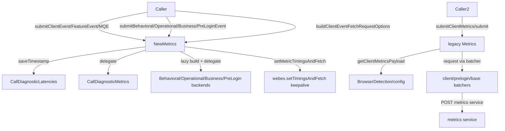
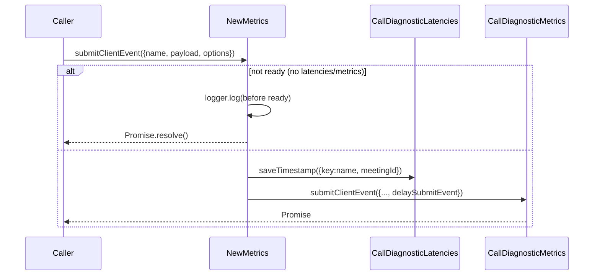
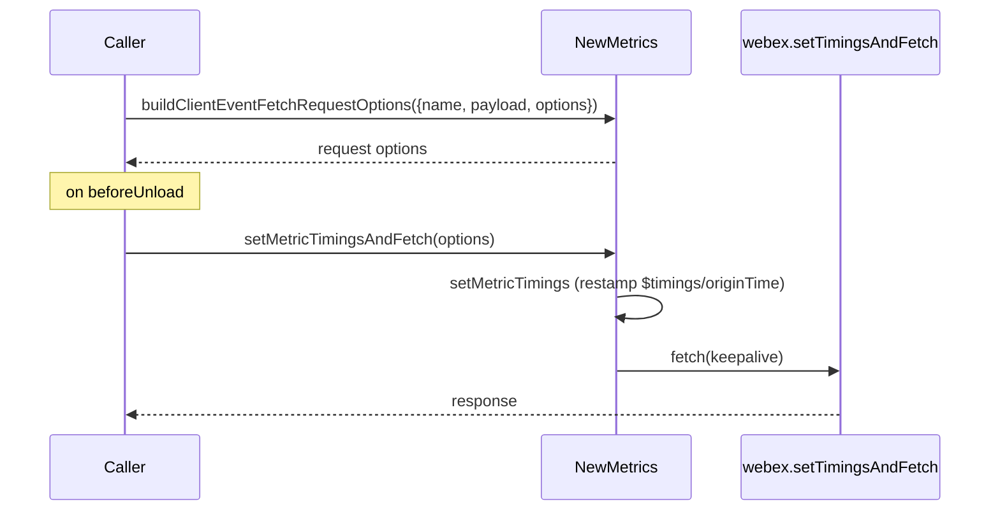
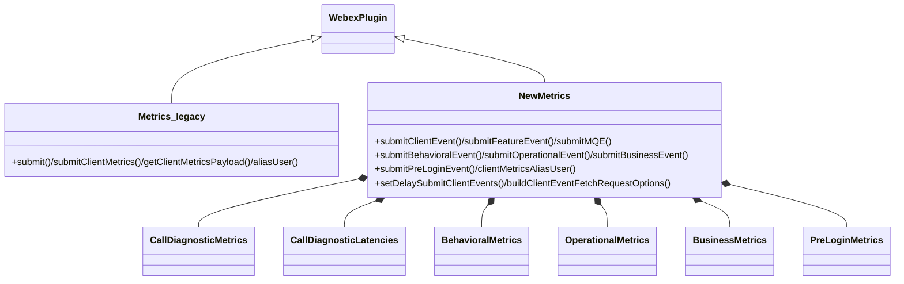

<!-- sdd-generated-metadata
generator: claude-cli
generator_model: us.anthropic.claude-opus-4-8
approved_by: pending-human-review
updated_at: 2026-08-06T00:00:00Z
validation_status: not-run
run_id: 51855eac-8de5-43a2-a3b6-dbcc55ebc91b
-->

# @webex/internal-plugin-metrics — SPEC

> Start here → root [`AGENTS.md`](../../../../AGENTS.md) (agent entry) · router [`SPEC_INDEX.md`](../../../../ai-docs/SPEC_INDEX.md) · system [`ARCHITECTURE.md`](../../../../ai-docs/ARCHITECTURE.md). This is the module's canonical spec: orientation, requirements, design, flows, and tests.
> Context-efficiency: link to canonical docs — don't duplicate them. Load specs on demand per `SPEC_INDEX.md`.

## Metadata

| Field | Value |
|---|---|
| Module id | `internal-plugin-metrics` |
| Source path(s) | `packages/@webex/internal-plugin-metrics/src/` |
| Parent spec | `—` (registered internal Webex plugin; composed by `webex-core`, no parent module) |
| Doc kind | Module spec |
| Coverage score | Pending coverage assessment |
| Generated from | `module-spec` @ SDLC template library `0.2.2` |
| generated_by / approved_by / updated_at | claude-cli / pending-human-review / 2026-08-06 |
| Validation status | not-run, validator `pending`, assessed 2026-08-06 |

Coverage score is `Pending coverage assessment` until the first coverage review runs. Manifest coverage
state (`Partial`) is authoritative and kept in `.sdd/manifest.json`.

## Evidence Rules
Every requirement cites concrete source evidence using `file path`. Test evidence is preferred for WHY.
Requirements are grounded in the current implementation under `src/` (mixed JS/TS).

## Source Material Register

| Source material | Scope | Decision | Detail location or disposition |
|---|---|---|---|
| Module source (`index.ts`, `metrics.js`, `new-metrics.ts`, `config.js`, `call-diagnostic/`) | overview / API | used | Overview, Public Surface, Requirements, and Design sections derived from current implementation. |

## Overview

`@webex/internal-plugin-metrics` is an internal Webex SDK plugin package that owns all client-side metrics
emission. It registers two plugins: the legacy `metrics` plugin (`src/metrics.js`) for semi-structured and
"behavioral" client metrics submitted through batchers, and `newMetrics` (`src/new-metrics.ts`), a
centralized façade over the newer metric families — Call Diagnostic (client/feature/MQE events), behavioral,
operational, and business metrics, plus pre-login metrics.

`NewMetrics` lazily constructs the per-family backends once `webex` is `ready`, guards every submit against
readiness (logging and resolving early when not ready), and delegates to the family backend
(`CallDiagnosticMetrics`, `BehavioralMetrics`, `OperationalMetrics`, `BusinessMetrics`, `PreLoginMetrics`).
It also supports delaying/flushing client and feature events, building `fetch`-based request options for
metrics that must survive page unload, and aliasing a pre-login user id to a CI UUID. The legacy `Metrics`
plugin builds a rich client-metrics payload (browser/OS/app/SDK context) and routes it through the standard,
prelogin, or client-metrics batchers. A maintainer should start at `src/new-metrics.ts`, `src/metrics.js`,
and `src/index.ts`.

## Purpose / Responsibility

Owns construction, batching, delay/flush, and submission of Webex client metrics (behavioral, operational,
business, Call Diagnostic client/feature/MQE, and pre-login), plus user aliasing. It does NOT own the metric
schemas (from `@webex/event-dictionary-ts`), transport/auth (delegated to `webex-core`), or the meaning of
individual events (owned by their emitting features).

## Stack

Mixed JavaScript + TypeScript (`src/metrics.js`, `src/new-metrics.ts`, `src/call-diagnostic/**`), built with
`webex-legacy-tools` plus `tsc` for type declarations. Unit tests run under Mocha
(`webex-legacy-tools test --unit --runner mocha`) with `sinon`/`@sinonjs/fake-timers`/chai. Runtime
dependencies: `@webex/webex-core`, `@webex/common` (`BrowserDetection`), `@webex/common-timers`,
`@webex/event-dictionary-ts`, `ip-anonymize`, `isbot`, `lodash`, `uuid`.

## Folder / Package Structure

```
packages/@webex/internal-plugin-metrics/src/
├── index.ts                  # registerInternalPlugin('metrics'|'newMetrics', ...); re-exports metric classes/types/utils
├── metrics.js                # legacy Metrics plugin: getClientMetricsPayload/submitClientMetrics/submit/aliasUser
├── new-metrics.ts            # NewMetrics façade: submit{Behavioral,Operational,Business,PreLogin,MQE,Feature,Client}Event, delay/flush, fetch-build
├── metrics.types.ts          # Event/payload TypeScript types (ClientEvent, FeatureEvent, MediaQualityEvent, ...)
├── config.js                 # metrics config: service URLs, batcher waits, appType, OS maps
├── behavioral-metrics.ts     # BehavioralMetrics backend
├── operational-metrics.ts    # OperationalMetrics backend
├── business-metrics.ts       # BusinessMetrics backend
├── prelogin-metrics.ts       # PreLoginMetrics backend (+ prelogin batcher)
├── rtcMetrics/               # RtcMetrics
├── automated-user.ts         # isAutomatedUser / isAutomatedUserAgent detection
├── utils.ts                  # shared metric utilities (e.g. generateCommonErrorMetadata)
├── batcher.js, client-metrics-*batcher.js  # batchers for legacy client metrics
└── call-diagnostic/          # CallDiagnosticMetrics, latencies, config, util
```

## Key Files (source of truth)

| File | Holds |
|---|---|
| `packages/@webex/internal-plugin-metrics/src/new-metrics.ts` | `NewMetrics` façade, readiness gating, lazy backend construction, delay/flush, fetch-build, alias |
| `packages/@webex/internal-plugin-metrics/src/metrics.js` | Legacy client-metrics payload builder and batcher routing |
| `packages/@webex/internal-plugin-metrics/src/config.js` | Metrics service URLs, batcher waits, `OS_NAME`/`OSMap`, `CLIENT_NAME` |
| `packages/@webex/internal-plugin-metrics/src/index.ts` | Registration names (`metrics`, `newMetrics`) and public exports |
| `packages/@webex/internal-plugin-metrics/src/call-diagnostic/` | Call Diagnostic metrics, latencies, config, and utils |

## Public Surface

Consumed as internal SDK plugins via `webex.internal.metrics` and `webex.internal.newMetrics`.

| Contract ID | Type | Surface | Purpose | Compatibility / deprecation | Schema / detail link | Root index |
|---|---|---|---|---|---|---|
| `newMetrics.submitClientEvent` | SDK | `submitClientEvent({name, payload?, options?}): Promise` | Submit a Call Diagnostic client event (saves a latency timestamp; may be delayed) | Stable; resolves early if not ready | `packages/@webex/internal-plugin-metrics/src/new-metrics.ts` | `../../../../ai-docs/CONTRACTS.md` |
| `newMetrics.submitFeatureEvent` / `submitMQE` | SDK | submit feature-usage / media-quality events | Call Diagnostic feature + MQE events | Stable; resolves early if not ready | `packages/@webex/internal-plugin-metrics/src/new-metrics.ts` | `../../../../ai-docs/CONTRACTS.md` |
| `newMetrics.submitBehavioralEvent` / `submitOperationalEvent` / `submitBusinessEvent` | SDK | submit behavioral/operational/business events | Amplitude/operational/business metric families (lazy backends) | Stable; resolves early if not ready | `packages/@webex/internal-plugin-metrics/src/new-metrics.ts` | `../../../../ai-docs/CONTRACTS.md` |
| `newMetrics.submitPreLoginEvent` / `clientMetricsAliasUser` | SDK | pre-login event; alias pre-login id → CI UUID | Metrics before login and later identity aliasing | Stable | `packages/@webex/internal-plugin-metrics/src/new-metrics.ts` | `../../../../ai-docs/CONTRACTS.md` |
| `newMetrics.setDelaySubmitClientEvents` / `setDelaySubmitClientFeatureEvents` | SDK | toggle delay + overrides; flush on disable | Buffer client/feature events and flush later | Stable | `packages/@webex/internal-plugin-metrics/src/new-metrics.ts` | `../../../../ai-docs/CONTRACTS.md` |
| `newMetrics.buildClientEventFetchRequestOptions` / `setMetricTimingsAndFetch` | SDK | pre-build fetch options; fire with corrected timings | Submit metrics on page unload via `fetch` keepalive | Stable | `packages/@webex/internal-plugin-metrics/src/new-metrics.ts` | `../../../../ai-docs/CONTRACTS.md` |
| `newMetrics.isReadyToSubmit{Behavioral,Operational,Business}Events` / `isAutomatedUser` / `isServiceErrorExpected` | SDK | readiness + classification helpers | Gate submission / detect bots / classify service errors | Stable | `packages/@webex/internal-plugin-metrics/src/new-metrics.ts` | `../../../../ai-docs/CONTRACTS.md` |
| `metrics.submitClientMetrics` / `getClientMetricsPayload` / `submit` / `aliasUser` | SDK | legacy client metrics + payload builder | Semi-structured client metrics through batchers | Stable (legacy) | `packages/@webex/internal-plugin-metrics/src/metrics.js` | `../../../../ai-docs/CONTRACTS.md` |
| exports (`CallDiagnosticMetrics`, `BehavioralMetrics`, `NewMetrics`, `Utils`, types, ...) | SDK (exports) | class/type/util re-exports | Reuse metric backends and types | Stable | `packages/@webex/internal-plugin-metrics/src/index.ts` | `../../../../ai-docs/CONTRACTS.md` |

Compatibility notes:
- Event `name`/`payload` shapes come from `metrics.types.ts` / `@webex/event-dictionary-ts` and are the
  semver-controlled contract.
- Submit methods resolve early (with a log) rather than throwing when called before `webex.ready`.

## Requires (dependencies)

- `@webex/webex-core` — base `WebexPlugin`, `registerInternalPlugin`, `webex.request`/`setTimingsAndFetch`,
  `webex.credentials`, `webex.version`, `webex.once('ready')`.
- `@webex/common` — `BrowserDetection` for OS/browser name+version (legacy payload) and `inBrowser`.
- `@webex/event-dictionary-ts` — canonical event schemas/types.
- `ip-anonymize`, `isbot`, `lodash`, `uuid` — anonymization, bot detection, utilities, ids.

## Requirements

| ID | WHAT | WHY | Source Evidence | Test / Example Evidence | Assumptions / Gaps | Confidence |
|---|---|---|---|---|---|---|
| `METRICS-R-001` | The package registers two internal plugins: `metrics` (legacy) and `newMetrics`, both with the shared `config`. | Consumers reach legacy and new metrics via `webex.internal.metrics` / `webex.internal.newMetrics`. | `packages/@webex/internal-plugin-metrics/src/index.ts` | `packages/@webex/internal-plugin-metrics/test/` | none identified | PRESENT |
| `METRICS-R-002` | `NewMetrics` constructs `callDiagnosticLatencies` immediately and lazily builds `callDiagnosticMetrics`/`preLoginMetrics` on `webex 'ready'`, setting `isReady`; behavioral/operational/business backends are lazily built on first use. | Backends depend on a ready webex/device; lazy construction avoids premature init and cost. | `packages/@webex/internal-plugin-metrics/src/new-metrics.ts` | `packages/@webex/internal-plugin-metrics/test/` | none identified | PRESENT |
| `METRICS-R-003` | `submitBehavioralEvent`/`submitOperationalEvent`/`submitBusinessEvent`/`submitPreLoginEvent`/`submitClientEvent`/`submitFeatureEvent` resolve early (logging) when not ready, and otherwise delegate to the matching backend. | Metrics must never throw/block the caller when submitted before readiness. | `packages/@webex/internal-plugin-metrics/src/new-metrics.ts` | `packages/@webex/internal-plugin-metrics/test/` | none identified | PRESENT |
| `METRICS-R-004` | `submitClientEvent`/`submitFeatureEvent`/`submitMQE` save a Call Diagnostic latency timestamp keyed by event name (with `meetingId` option) before delegating; `submitInternalEvent` saves/clears latency timestamps only. | Client/feature/MQE latencies must be captured relative to event submission for Call Analyzer. | `packages/@webex/internal-plugin-metrics/src/new-metrics.ts` | `packages/@webex/internal-plugin-metrics/test/` | none identified | PRESENT |
| `METRICS-R-005` | `setDelaySubmitClientEvents`/`setDelaySubmitClientFeatureEvents` store the delay flag + overrides, and when set to not-delay while ready, flush the buffered delayed client/feature events. | Callers can buffer events (e.g. before join) and flush them later with overrides. | `packages/@webex/internal-plugin-metrics/src/new-metrics.ts` | `packages/@webex/internal-plugin-metrics/test/` | none identified | PRESENT |
| `METRICS-R-006` | `buildClientEventFetchRequestOptions` pre-builds request options and `setMetricTimingsAndFetch` re-stamps `$timings`/`originTime` to now and submits via `webex.setTimingsAndFetch`. | On page unload, async submit won't complete; pre-built `fetch` with keepalive and corrected timings does. | `packages/@webex/internal-plugin-metrics/src/new-metrics.ts` | `packages/@webex/internal-plugin-metrics/test/` | none identified | PRESENT |
| `METRICS-R-007` | `clientMetricsAliasUser` POSTs `metrics /clientmetrics` with header `x-prelogin-userid` and `qs:{alias:true}`, logging success and rejecting (logged) on failure; the legacy `metrics.aliasUser` performs the equivalent request. | A pre-login id must be aliased to the CI UUID after login so metrics stitch together. | `packages/@webex/internal-plugin-metrics/src/new-metrics.ts`, `packages/@webex/internal-plugin-metrics/src/metrics.js` | `packages/@webex/internal-plugin-metrics/test/` | none identified | PRESENT |
| `METRICS-R-008` | Legacy `getClientMetricsPayload` requires an event name (throws otherwise) and builds a payload with `tags` (browser/os/appVersion/domain), `fields` (browser/os versions, sdk_version, platform, spark_user_agent, client_id), `type`, `context`, optional `eventPayload`, and a `timestamp`. | Semi-structured client metrics need a consistent, environment-tagged payload. | `packages/@webex/internal-plugin-metrics/src/metrics.js` | `packages/@webex/internal-plugin-metrics/test/` | none identified | PRESENT |
| `METRICS-R-009` | `submitClientMetrics` routes through the prelogin batcher (saving the pre-login id) when a `preLoginId` is given, otherwise the client-metrics batcher; `submit` routes through the standard batcher. | Pre-login vs authenticated metrics use different batchers/endpoints. | `packages/@webex/internal-plugin-metrics/src/metrics.js` | `packages/@webex/internal-plugin-metrics/test/` | none identified | PRESENT |

## Design Overview

The package exposes two registered plugins sharing one `config`. Legacy `Metrics` (`metrics.js`) is a
payload builder + batcher router: `getClientMetricsPayload` assembles environment context (via
`BrowserDetection` and `getOSNameInternal`, which maps to `OSMap`/`OS_NAME`), and `submitClientMetrics`
chooses the prelogin vs client-metrics batcher. `submit` uses the base batcher; `aliasUser` issues the alias
request.

`NewMetrics` (`new-metrics.ts`) is the modern façade. It owns the family backends as instance fields and
builds them lazily: `callDiagnosticLatencies` in the constructor, `callDiagnosticMetrics`/`preLoginMetrics`
on `ready`, and behavioral/operational/business backends via `lazyBuild*` guards keyed on `isReady`. Every
public submit method first checks readiness and returns `Promise.resolve()` (with a log) if not ready, so
callers never see a throw. Call Diagnostic submits also record a latency timestamp keyed by event name before
delegating. Delay/flush state (`delaySubmitClientEvents`, overrides) lets callers buffer client/feature
events and flush them by toggling the flag. For page-unload safety, `buildClientEventFetchRequestOptions`
pre-computes request options that `setMetricTimingsAndFetch` re-stamps and fires via `fetch` keepalive.

## Data Flow



## Sequence Diagram(s)

Sequence coverage:

| Operation group | Diagram | Failure / recovery coverage |
|---|---|---|
| New-metrics client event | 1. submitClientEvent | `alt` covers not-ready early-resolve vs delegate |
| Page-unload metric | 2. build + fetch | `opt` covers timing re-stamp before fetch |

### 1. submitClientEvent



### 2. Page-unload metric



## Class / Component Relationships



`NewMetrics` composes the per-family backends; the legacy `Metrics` plugin is independent and batcher-driven.

## Use Cases

- **UC-1 Submit a Call Diagnostic client event:** `newMetrics.submitClientEvent({name, payload, options})` → save latency → delegate. Evidence: `packages/@webex/internal-plugin-metrics/src/new-metrics.ts`.
- **UC-2 Buffer then flush client events:** `setDelaySubmitClientEvents({shouldDelay:true})` … `setDelaySubmitClientEvents({shouldDelay:false, overrides})`. Evidence: `packages/@webex/internal-plugin-metrics/src/new-metrics.ts`.
- **UC-3 Submit on page unload:** `buildClientEventFetchRequestOptions(...)` then `setMetricTimingsAndFetch(options)`. Evidence: `packages/@webex/internal-plugin-metrics/src/new-metrics.ts`.
- **UC-4 Alias a pre-login user:** `clientMetricsAliasUser(preLoginId)`. Evidence: `packages/@webex/internal-plugin-metrics/src/new-metrics.ts`.
- **UC-5 Legacy client metric:** `metrics.submitClientMetrics(name, props, preLoginId?)`. Evidence: `packages/@webex/internal-plugin-metrics/src/metrics.js`.

## Concurrency & Reactive Flow

Backend construction is deferred to a one-time `webex.once('ready')` hook plus idempotent `lazyBuild*`
guards. Submit methods are async but return resolved Promises immediately when not ready, so they never block
callers. Delayed events are buffered in the Call Diagnostic backend and flushed when the delay flag is turned
off while ready. Page-unload submission uses `fetch` keepalive because the async submit path cannot complete
during unload. Evidence: `packages/@webex/internal-plugin-metrics/src/new-metrics.ts`.

## Error Handling & Failure Modes

| Condition | Signal (error/code/result) | Caller recovery |
|---|---|---|
| Submit before `webex.ready` | logged; `Promise.resolve()` (no-op) | Retry after ready / ignore |
| Missing event name (legacy payload) | throws `Error('Missing behavioral metric name...')` | Provide an event name |
| `clientMetricsAliasUser` request failure | logged error; rejected Promise | Retry aliasing |
| Backend not yet built (feature/MQE) | logged; `Promise.resolve()` | Submit after ready |

## Pitfalls

- Submitting before `webex.ready` silently no-ops (resolves) — a "successful" call does not guarantee the
  event was sent.
- `callDiagnosticMetrics`/`preLoginMetrics` exist only after `ready`; `submitFeatureEvent`/`submitClientEvent`
  guard on their presence and early-resolve otherwise.
- Delayed events are only flushed when `setDelaySubmit*` is called with `shouldDelay:false` while ready;
  forgetting to flush leaves events buffered.
- `getClientMetricsPayload` reads `window.location.hostname` only in a browser; in Node the domain is
  `'non-browser'`.

## Test-Case Strategy (module)

Unit tests (Mocha + sinon + fake-timers + chai) should stub `webex` readiness, `webex.request`/
`setTimingsAndFetch`, and the family backends, asserting: both plugins register; `NewMetrics` builds
latencies eagerly and other backends lazily on ready; submit methods early-resolve before ready (negative)
and delegate + save latency after ready (positive); delay flags buffer then flush; `buildClientEventFetchRequestOptions`/
`setMetricTimingsAndFetch` re-stamp timings; `clientMetricsAliasUser` sends the alias request; and legacy
`getClientMetricsPayload` throws without a name (negative) and builds the tagged payload (positive).

| Behavior / Requirement | Existing test evidence | Gap |
|---|---|---|
| `METRICS-R-001` | `packages/@webex/internal-plugin-metrics/test/` | Confirm dual registration |
| `METRICS-R-002` | `packages/@webex/internal-plugin-metrics/test/` | Confirm eager vs lazy backend build |
| `METRICS-R-003` | `packages/@webex/internal-plugin-metrics/test/` | Confirm not-ready early-resolve |
| `METRICS-R-004` | `packages/@webex/internal-plugin-metrics/test/` | Confirm latency timestamps |
| `METRICS-R-005` | `packages/@webex/internal-plugin-metrics/test/` | Confirm delay + flush |
| `METRICS-R-006` | `packages/@webex/internal-plugin-metrics/test/` | Confirm fetch build + re-stamp |
| `METRICS-R-007` | `packages/@webex/internal-plugin-metrics/test/` | Confirm alias request |
| `METRICS-R-008` | `packages/@webex/internal-plugin-metrics/test/` | Confirm payload shape + name throw |
| `METRICS-R-009` | `packages/@webex/internal-plugin-metrics/test/` | Confirm batcher routing |

## Traceability

- Repo architecture: [`ARCHITECTURE.md`](../../../../ai-docs/ARCHITECTURE.md) · Registry: [`SPEC_INDEX.md`](../../../../ai-docs/SPEC_INDEX.md)
- Coverage state & contracts baseline: `.sdd/manifest.json`
