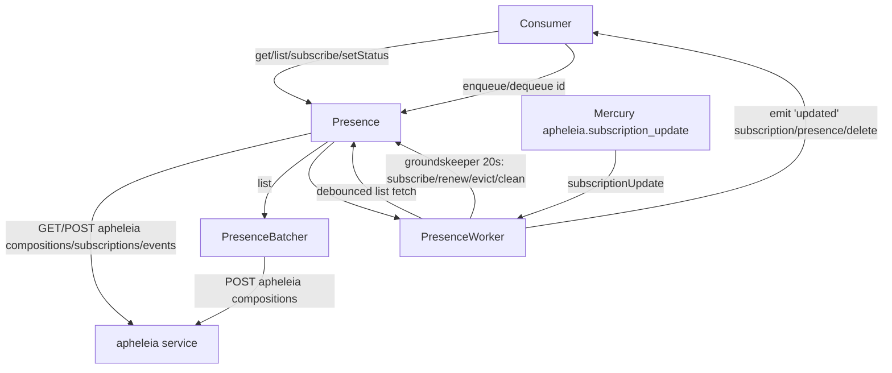
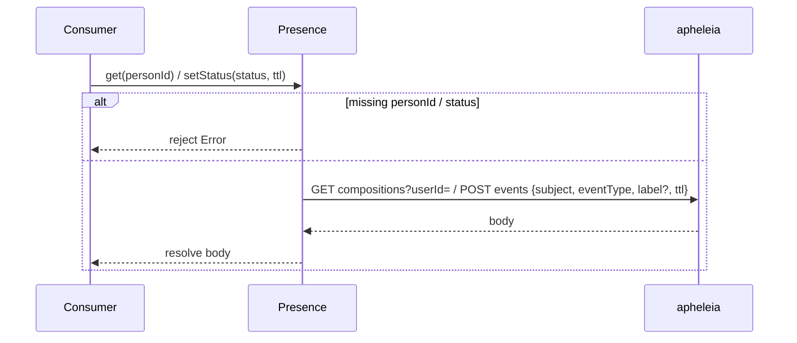
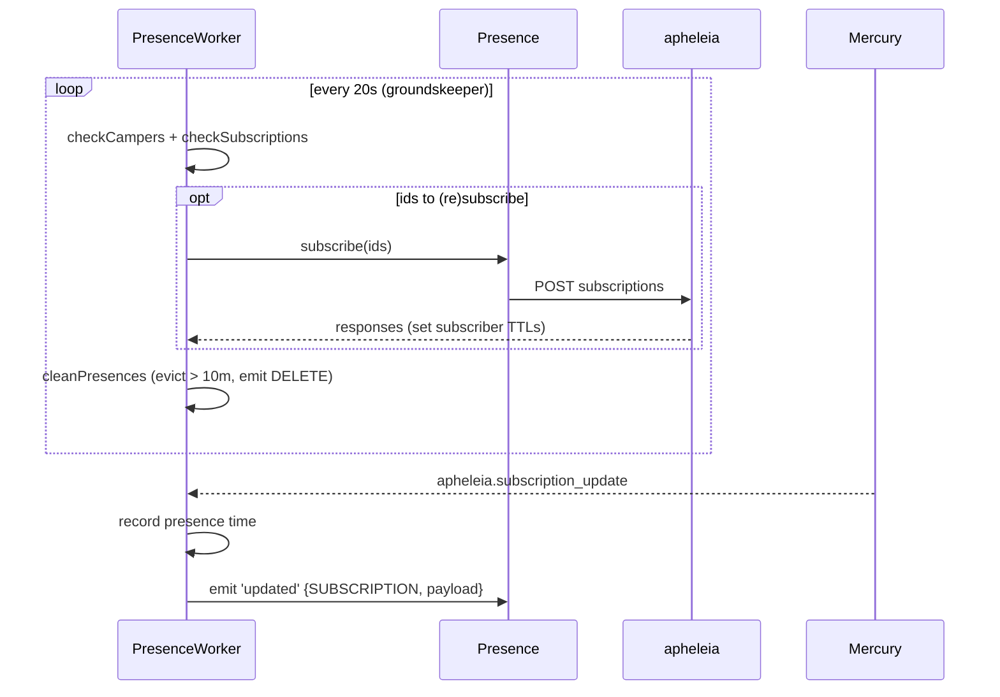
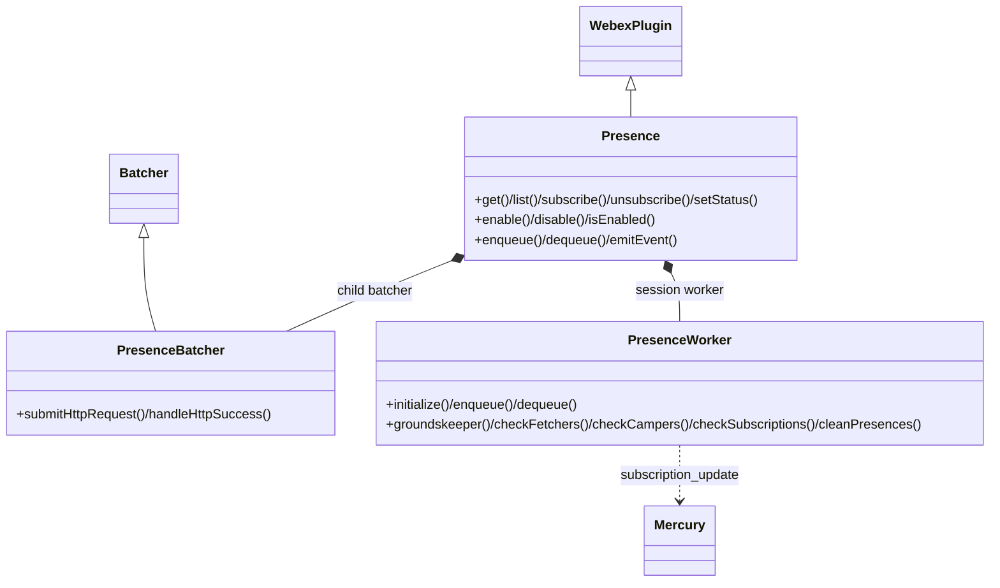

<!-- sdd-generated-metadata
generator: claude-cli
generator_model: us.anthropic.claude-opus-4-8
approved_by: pending-human-review
updated_at: 2026-08-06T00:00:00Z
validation_status: not-run
run_id: 51855eac-8de5-43a2-a3b6-dbcc55ebc91b
-->

# @webex/internal-plugin-presence — SPEC

> Start here → root [`AGENTS.md`](../../../../AGENTS.md) (agent entry) · router [`SPEC_INDEX.md`](../../../../ai-docs/SPEC_INDEX.md) · system [`ARCHITECTURE.md`](../../../../ai-docs/ARCHITECTURE.md). This is the module's canonical spec: orientation, requirements, design, flows, state, and tests.
> Context-efficiency: link to canonical docs — don't duplicate them. Load specs on demand per `SPEC_INDEX.md`.

## Metadata

| Field | Value |
|---|---|
| Module id | `internal-plugin-presence` |
| Source path(s) | `packages/@webex/internal-plugin-presence/src/` |
| Parent spec | `—` (registered internal Webex plugin; composed by `webex-core`, no parent module) |
| Doc kind | Module spec |
| Coverage score | Pending coverage assessment |
| Generated from | `module-spec` @ SDLC template library `0.2.2` |
| generated_by / approved_by / updated_at | claude-cli / pending-human-review / 2026-08-06 |
| Validation status | not-run, validator `pending`, assessed 2026-08-06 |

Coverage score is `Pending coverage assessment` until the first coverage review runs. Manifest coverage
state (`Partial`) is authoritative and kept in `.sdd/manifest.json`.

## Evidence Rules
Every requirement cites concrete source evidence using `file path`. Test evidence is preferred for WHY.
Requirements are grounded in the current implementation under `src/`.

## Source Material Register

| Source material | Scope | Decision | Detail location or disposition |
|---|---|---|---|
| Module source (`presence.js`, `presence-worker.js`, `presence-batcher.js`, `constants.js`, `config.js`, `index.js`) | overview / API / state | used | Overview, Public Surface, Requirements, State Model, and Sequence sections derived from current implementation. |

## Overview

`@webex/internal-plugin-presence` is an internal Webex SDK plugin (registered as `presence`) for reading,
setting, and subscribing to user presence via the **apheleia** service. The `Presence` plugin exposes
one-shot reads (`get`), batched multi-user reads (`list` via `PresenceBatcher`), subscribe/unsubscribe (with
50-id batching), and `setStatus`; it re-emits normalized status responses as `updated` events.

For continuous presence upkeep it composes a `PresenceWorker` — an interval-driven manager that tracks
watchers, debounced fetches, subscriptions (with renewal and TTL cleanup), and expired-presence eviction. The
worker connects to Mercury, listens for `apheleia.subscription_update` events, and emits `updated` envelopes
(subscription/presence/delete). An inbound `payloadTransformer` (in `index.js`) normalizes single-status
event responses so `body.status` is populated from `body.eventType`. A maintainer should start at
`src/presence.js` and `src/presence-worker.js`.

## Purpose / Responsibility

Owns reading, setting, subscribing to, and locally maintaining Webex user presence over the apheleia service.
It does NOT own the presence source of truth (backend/apheleia), the Mercury transport (delegated to
`internal-plugin-mercury`), feature enablement storage (delegated to `internal-plugin-feature`), or device
identity (delegated to `internal-plugin-device`).

## Stack

JavaScript (ES modules, `src/presence.js`, `src/presence-worker.js`, `src/presence-batcher.js`), built with
`webex-legacy-tools`. Tests run under Jest (`webex-legacy-tools test --unit --runner jest`) with `sinon`,
chai, and mock-webex. Runtime dependencies: `@webex/webex-core` (`WebexPlugin`, `Batcher`),
`@webex/internal-plugin-device`, `@webex/internal-plugin-mercury`, `@webex/internal-plugin-feature` (via
`webex.internal.feature`), and `lodash` (`debounce`, `has`).

## Folder / Package Structure

```
packages/@webex/internal-plugin-presence/src/
├── index.js              # registerInternalPlugin('presence', Presence, {payloadTransformer, config})
├── presence.js           # Presence WebexPlugin: get/list/subscribe/unsubscribe/setStatus/enable/disable/isEnabled; worker wiring
├── presence-worker.js    # PresenceWorker: interval groundskeeper, fetchers/campers/subscribers/watchers, subscription renewal + eviction
├── presence-batcher.js   # PresenceBatcher (extends Batcher): batched compositions requests
├── constants.js          # timing constants, apheleia event name, envelope types
└── config.js             # presence batcher waits
```

## Key Files (source of truth)

| File | Holds |
|---|---|
| `packages/@webex/internal-plugin-presence/src/presence.js` | Public methods, subscribe batching (50), status normalization, worker delegation |
| `packages/@webex/internal-plugin-presence/src/presence-worker.js` | Interval-driven fetch/subscribe/renew/evict logic and Mercury subscription-update handling |
| `packages/@webex/internal-plugin-presence/src/presence-batcher.js` | Batched `apheleia compositions` request + item success/failure fingerprinting |
| `packages/@webex/internal-plugin-presence/src/constants.js` | Intervals/delays/TTLs, `APHELEIA_SUBSCRIPTION_UPDATE`, `ENVELOPE_TYPE`, `PRESENCE_UPDATE` |

## Public Surface

Consumed as an internal SDK plugin via `webex.internal.presence`.

| Contract ID | Type | Surface | Purpose | Compatibility / deprecation | Schema / detail link | Root index |
|---|---|---|---|---|---|---|
| `presence.get` | SDK | `get(personId): Promise<PresenceStatusObject>` | GET `apheleia compositions?userId=` for one user | Stable; rejects without `personId` | `packages/@webex/internal-plugin-presence/src/presence.js` | `../../../../ai-docs/CONTRACTS.md` |
| `presence.list` | SDK | `list(personIds): Promise<{statusList}>` | Batched multi-user read via `PresenceBatcher` | Stable; requires an array | `packages/@webex/internal-plugin-presence/src/presence.js` | `../../../../ai-docs/CONTRACTS.md` |
| `presence.subscribe` / `unsubscribe` | SDK | `subscribe(personIds, ttl?)` · `unsubscribe(personIds)` | POST `apheleia subscriptions` (50-id batches); unsubscribe uses `subscriptionTtl:0` | Stable; requires ids | `packages/@webex/internal-plugin-presence/src/presence.js` | `../../../../ai-docs/CONTRACTS.md` |
| `presence.setStatus` | SDK | `setStatus(status, ttl): Promise` | POST `apheleia events` with subject/eventType/label/ttl | Stable; rejects without status; no `label` for `dnd` | `packages/@webex/internal-plugin-presence/src/presence.js` | `../../../../ai-docs/CONTRACTS.md` |
| `presence.enable` / `disable` / `isEnabled` | SDK | toggle/read the `user-presence-enabled` feature | Enable/disable presence via feature toggle | Stable | `packages/@webex/internal-plugin-presence/src/presence.js` | `../../../../ai-docs/CONTRACTS.md` |
| `presence.enqueue` / `dequeue` | SDK | `enqueue(id)` / `dequeue(id)` | Add/remove a user from worker-managed presence upkeep | Stable | `packages/@webex/internal-plugin-presence/src/presence.js` | `../../../../ai-docs/CONTRACTS.md` |
| `presence` events | event | `updated` (`ENVELOPE_TYPE` subscription/presence/delete) | Notify consumers of presence changes/removals | Stable event name/envelope | `packages/@webex/internal-plugin-presence/src/presence-worker.js` | `../../../../ai-docs/CONTRACTS.md` |

Compatibility notes:
- Method names/signatures, the `updated` event, and `ENVELOPE_TYPE` values are the semver-controlled
  contract. Subscribe batches are capped at 50 ids per request.

## Requires (dependencies)

- `@webex/webex-core` — base `WebexPlugin` and `Batcher`, `webex.request`.
- `@webex/internal-plugin-device` — `device.userId` used as `subject`/`label` in `setStatus`.
- `@webex/internal-plugin-mercury` — the worker connects and listens for `event:apheleia.subscription_update`.
- `@webex/internal-plugin-feature` — `feature.setFeature`/`getFeature('user','user-presence-enabled')`.
- External service: **apheleia** (`api/service: 'apheleia'`) with `compositions`, `subscriptions`, and
  `events` resources.

## Requirements

| ID | WHAT | WHY | Source Evidence | Test / Example Evidence | Assumptions / Gaps | Confidence |
|---|---|---|---|---|---|---|
| `PRESENCE-R-001` | `get` rejects when `personId` is missing, else GETs `apheleia compositions?userId={personId}` and resolves the body; `list` rejects a non-array, else batches per-id `compositions` requests and resolves `{statusList}`. | Single and batched reads must validate input and normalize the response shape. | `packages/@webex/internal-plugin-presence/src/presence.js`, `packages/@webex/internal-plugin-presence/src/presence-batcher.js` | `packages/@webex/internal-plugin-presence/test/` | none identified | PRESENT |
| `PRESENCE-R-002` | `subscribe` rejects without ids, splits ids into ≤50-id batches, POSTs `apheleia subscriptions` with `{subjects, subscriptionTtl, includeStatus:true}` per batch, and concatenates `responses`. | Backend caps subscription requests; batching keeps requests within limits while returning all responses. | `packages/@webex/internal-plugin-presence/src/presence.js` | `packages/@webex/internal-plugin-presence/test/` | none identified | PRESENT |
| `PRESENCE-R-003` | `unsubscribe` rejects without ids, else POSTs `apheleia subscriptions` with `subscriptionTtl:0`. | Setting TTL 0 removes the subscription server-side. | `packages/@webex/internal-plugin-presence/src/presence.js` | `packages/@webex/internal-plugin-presence/test/` | none identified | PRESENT |
| `PRESENCE-R-004` | `setStatus` rejects without a status, else POSTs `apheleia events` with `{subject: device.userId, eventType: status, label (omitted for 'dnd'), ttl}` and resolves the body. | Users set their own presence; `dnd` intentionally omits the label. | `packages/@webex/internal-plugin-presence/src/presence.js` | `packages/@webex/internal-plugin-presence/test/` | none identified | PRESENT |
| `PRESENCE-R-005` | `enable`/`disable` set the `user-presence-enabled` user feature to true/false and resolve the resulting value; `isEnabled` reads it. | Presence is gated by a user feature toggle. | `packages/@webex/internal-plugin-presence/src/presence.js` | `packages/@webex/internal-plugin-presence/test/` | none identified | PRESENT |
| `PRESENCE-R-006` | The `PresenceWorker` groundskeeper runs every 20s: it subscribes ready "campers", renews subscriptions nearing expiry, evicts expired subscriptions, and removes presence objects older than 10 minutes (emitting a `delete` envelope). | Continuous presence upkeep must batch subscriptions, renew before expiry, and free stale state. | `packages/@webex/internal-plugin-presence/src/presence-worker.js`, `packages/@webex/internal-plugin-presence/src/constants.js` | `packages/@webex/internal-plugin-presence/test/` | none identified | PRESENT |
| `PRESENCE-R-007` | `enqueue` increments a watcher count and, when presence is stale/absent and not in flight, debounces a fetch; `dequeue` decrements and clears watcher/fetcher/camper state at zero. | Reference-counted watchers avoid redundant fetches and clean up when no consumer remains. | `packages/@webex/internal-plugin-presence/src/presence-worker.js` | `packages/@webex/internal-plugin-presence/test/` | none identified | PRESENT |
| `PRESENCE-R-008` | The worker connects to Mercury (if not connected), handles `apheleia.subscription_update` by recording the presence time and emitting an `updated` (`SUBSCRIPTION`) envelope; the inbound `payloadTransformer` sets `body.status` from `body.eventType` for single-status responses. | Live subscription updates must reach consumers and single-status responses must carry a `status`. | `packages/@webex/internal-plugin-presence/src/presence-worker.js`, `packages/@webex/internal-plugin-presence/src/index.js` | `packages/@webex/internal-plugin-presence/test/` | none identified | PRESENT |

## Design Overview

`Presence` extends `WebexPlugin` (`namespace: 'Presence'`) and composes a `PresenceBatcher` child (for
batched `compositions` reads) plus a `PresenceWorker` session instance. Direct methods issue apheleia
requests: `get`/`list` read compositions, `subscribe`/`unsubscribe` manage subscriptions (subscribe splits
into ≤50-id batches and concatenates responses), and `setStatus` posts an event using the device user id as
subject/label (label omitted for `dnd`). `enable`/`disable`/`isEnabled` proxy the `user-presence-enabled`
user feature.

`PresenceWorker` is the stateful engine. It keeps six maps — `presences` (last-updated time), `watchers`
(reference counts), `fetchers`/`flights` (pending vs in-flight fetches), `campers` (waiting to subscribe),
and `subscribers` (subscription expirations). `enqueue`/`dequeue` maintain watcher counts and trigger a
debounced `checkFetchers` fetch when presence is stale. A `groundskeeper` interval (20s) subscribes ready
campers, renews subscriptions before premature expiry, evicts expired subscribers, and cleans presences older
than 10 minutes (emitting a `DELETE` envelope). Mercury delivers `apheleia.subscription_update` events, which
update the presence timestamp and emit a `SUBSCRIPTION` envelope. The inbound `payloadTransformer` normalizes
single-status responses so consumers always see `body.status`.

## Data Flow



## Sequence Diagram(s)

Sequence coverage:

| Operation group | Diagram | Failure / recovery coverage |
|---|---|---|
| Read/set presence | 1. get / setStatus | `alt` covers missing input reject |
| Worker upkeep | 2. groundskeeper + subscription update | `opt` covers renew/evict/clean and Mercury update |

### 1. Read / set presence



### 2. Worker upkeep + subscription update



## Class / Component Relationships



`Presence` composes `PresenceBatcher` (batched reads) and `PresenceWorker` (upkeep); the worker uses Mercury.

## Use Cases

- **UC-1 Read one/many presences:** `get(id)` / `list([ids])`. Evidence: `packages/@webex/internal-plugin-presence/src/presence.js`.
- **UC-2 Set my status:** `setStatus('dnd', ttl)` (no label) or `setStatus('active', ttl)`. Evidence: `packages/@webex/internal-plugin-presence/src/presence.js`.
- **UC-3 Watch a user continuously:** `enqueue(id)` (worker fetch + subscribe), later `dequeue(id)`. Evidence: `packages/@webex/internal-plugin-presence/src/presence-worker.js`.
- **UC-4 React to live updates:** listen for `updated` envelopes emitted from Mercury subscription updates. Evidence: `packages/@webex/internal-plugin-presence/src/presence-worker.js`.

## State Model

`PresenceWorker` holds six in-memory maps: `presences` (id→last-updated ms), `watchers` (id→ref count),
`fetchers` (id→pending fetch), `flights` (id→in-flight fetch), `campers` (id→time waiting to subscribe), and
`subscribers` (id→expiration ms). Timing constants (`constants.js`): groundskeeper 20s, fetch debounce 300ms,
subscription/premature-renew delays 60s, expired-presence 10m, default subscription TTL 10m. Transitions:
`enqueue` adds a watcher and (if stale/absent) a fetcher; `checkFetchers` moves fetchers→flights→presences;
`checkCampers` promotes campers→subscribers after the subscription delay; `checkSubscriptions` renews near
expiry or drops expired; `cleanPresences` evicts presences older than 10m and emits a `DELETE` envelope.
Evidence: `packages/@webex/internal-plugin-presence/src/presence-worker.js`.

## Concurrency & Reactive Flow

The worker is interval- and event-driven: a `setInterval` groundskeeper (20s) plus a lodash-`debounce`d fetch
(300ms) coalesce work, and Mercury `apheleia.subscription_update` events drive live updates. Fetches move ids
through `fetchers`→`flights`→`presences` to avoid duplicate in-flight requests. Subscribe requests are batched
to 50 ids. All state is single-threaded JS with no locking; idempotency comes from the map keys (per-id).
Evidence: `packages/@webex/internal-plugin-presence/src/presence-worker.js`.

## Error Handling & Failure Modes

| Condition | Signal (error/code/result) | Caller recovery |
|---|---|---|
| Missing `personId` (`get`) | rejected Promise `Error('A person id is required')` | Provide an id |
| Non-array `personIds` (`list`) | rejected Promise `Error('An array of person ids is required')` | Pass an array |
| Missing ids (`subscribe`/`unsubscribe`) | rejected Promise `Error('A person id is required')` | Provide id(s) |
| Missing status (`setStatus`) | rejected Promise `Error('A status is required')` | Provide a status |
| Subscribe response non-200 | worker sets a fallback TTL so it is cleaned up eventually | Automatic eviction |
| HTTP failure | rejected Promise from the request / batcher item failure | Inspect underlying error |

## Pitfalls

- `subscribe` silently splits into 50-id batches — a single call may issue multiple requests; consumers get
  a single concatenated `responses` array.
- `setStatus('dnd', ttl)` intentionally omits the `label`; other statuses include the user id as `label`.
- The worker's `groundskeeper` uses `setInterval` and in-memory maps; it must be `initialize`d (via config
  `initializeWorker` or `initializeWorker()`) or `enqueue`/`dequeue` upkeep won't run.
- Presence objects are evicted after 10 minutes of no update (emitting a `delete` envelope) — consumers must
  handle disappearance, not just updates.

## Test-Case Strategy (module)

Unit tests (Jest + sinon + chai + fake timers) should mock `webex.request`, the batcher, Mercury, and
`feature`, asserting: `get`/`list`/`subscribe`/`unsubscribe`/`setStatus` reject on missing/invalid input
(negative) and hit the right apheleia resource/body (positive); `subscribe` batches at 50 and concatenates
responses; `enable`/`disable`/`isEnabled` proxy the feature toggle; the worker `groundskeeper` subscribes
campers, renews near expiry, evicts expired, and cleans stale presences (emitting `delete`); `enqueue`/
`dequeue` maintain watcher counts and debounce fetches; and the subscription-update handler emits an `updated`
envelope.

| Behavior / Requirement | Existing test evidence | Gap |
|---|---|---|
| `PRESENCE-R-001` | `packages/@webex/internal-plugin-presence/test/` | Confirm get/list validation + shape |
| `PRESENCE-R-002` | `packages/@webex/internal-plugin-presence/test/` | Confirm 50-id batching + concat |
| `PRESENCE-R-003` | `packages/@webex/internal-plugin-presence/test/` | Confirm TTL:0 unsubscribe |
| `PRESENCE-R-004` | `packages/@webex/internal-plugin-presence/test/` | Confirm dnd label omission |
| `PRESENCE-R-005` | `packages/@webex/internal-plugin-presence/test/` | Confirm feature-toggle proxy |
| `PRESENCE-R-006` | `packages/@webex/internal-plugin-presence/test/` | Confirm groundskeeper subscribe/renew/evict/clean |
| `PRESENCE-R-007` | `packages/@webex/internal-plugin-presence/test/` | Confirm watcher ref-count + debounce |
| `PRESENCE-R-008` | `packages/@webex/internal-plugin-presence/test/` | Confirm Mercury update + transformer |

## Traceability

- Repo architecture: [`ARCHITECTURE.md`](../../../../ai-docs/ARCHITECTURE.md) · Registry: [`SPEC_INDEX.md`](../../../../ai-docs/SPEC_INDEX.md)
- Coverage state & contracts baseline: `.sdd/manifest.json`
