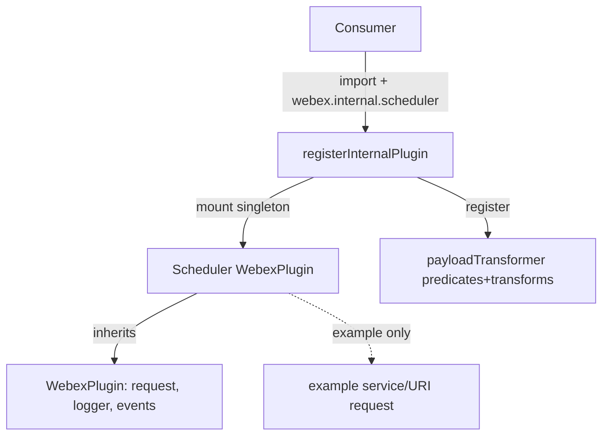
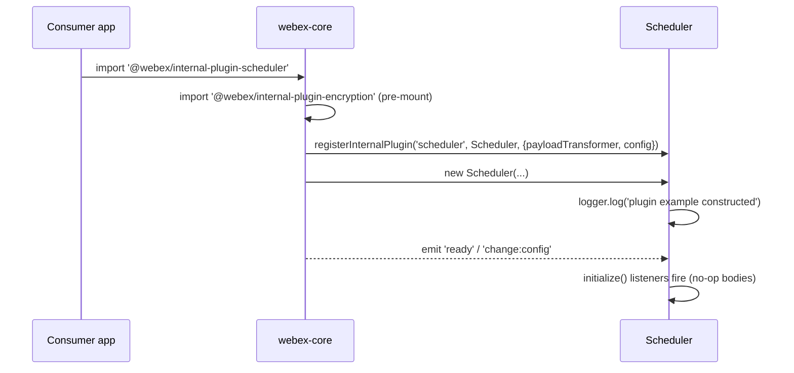
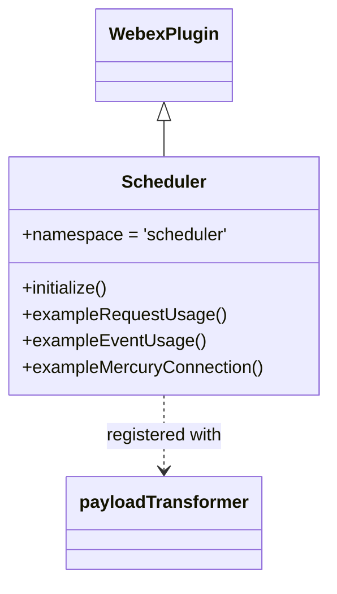

<!-- sdd-generated-metadata
generator: claude-cli
generator_model: us.anthropic.claude-opus-4-8
approved_by: pending-human-review
updated_at: 2026-08-06T00:00:00Z
validation_status: not-run
run_id: 51855eac-8de5-43a2-a3b6-dbcc55ebc91b
-->

# @webex/internal-plugin-scheduler — SPEC

> Start here → root [`AGENTS.md`](../../../../AGENTS.md) (agent entry) · router [`SPEC_INDEX.md`](../../../../ai-docs/SPEC_INDEX.md) · system [`ARCHITECTURE.md`](../../../../ai-docs/ARCHITECTURE.md). This is the module's canonical spec: orientation, requirements, design, flows, and tests.
> Context-efficiency: link to canonical docs — don't duplicate them. Load specs on demand per `SPEC_INDEX.md`.

## Metadata

| Field | Value |
|---|---|
| Module id | `internal-plugin-scheduler` |
| Source path(s) | `packages/@webex/internal-plugin-scheduler/src/` |
| Parent spec | `—` (registered internal Webex plugin; composed by `webex-core`, no parent module) |
| Doc kind | Module spec |
| Coverage score | Pending coverage assessment |
| Generated from | `module-spec` @ SDLC template library `0.2.2` |
| generated_by / approved_by / updated_at | claude-cli / pending-human-review / 2026-08-06 |
| Validation status | not-run, validator `pending`, assessed 2026-08-06 |

Coverage score is `Pending coverage assessment` until the first coverage review runs. Manifest coverage
state is authoritative and kept in `.sdd/manifest.json`.

## Evidence Rules
Every requirement cites concrete source evidence using `file path`. Test evidence is preferred for WHY.
Requirements are grounded in the current implementation under `src/` and its unit tests. This module is
currently a generated plugin scaffold, so several sections describe the scaffold state rather than a
shipped feature surface, and this is called out explicitly where it applies.

## Source Material Register

| Source material | Scope | Decision | Detail location or disposition |
|---|---|---|---|
| Package README | overview | verified | Registration namespace and consumer usage migrated into Overview and Public Surface. |
| Plugin source scaffold | overview / architecture | verified | Registration, payload-transformer wiring, and example methods migrated into Overview, Design Overview, and Public Surface; example method bodies recorded as scaffold placeholders. |

## Overview

`@webex/internal-plugin-scheduler` is an internal Webex SDK plugin registered under the `scheduler`
namespace (`webex.internal.scheduler`). At its current state the package is a **generated plugin
scaffold**: it wires up a `WebexPlugin` subclass, a configuration object, and a payload-transformer
registration, but the transformer predicates/transforms and plugin methods are still the boilerplate
examples emitted by the plugin generator (`exampleRequestUsage`, `exampleEventUsage`,
`exampleMercuryConnection`).

`src/index.js` mounts the plugin via `registerInternalPlugin(CONSTANTS.NAMESPACE, Scheduler, {payloadTransformer, config})`
and eagerly imports `@webex/internal-plugin-encryption` so the singleton is mounted before Scheduler.
The `Scheduler` class (`src/scheduler/scheduler.js`) extends `WebexPlugin`, sets `namespace` from
`CONSTANTS.NAMESPACE`, logs an example message from its constructor, and registers `initialize()` listeners
for the webex `change:config` and `ready` lifecycle events.

A maintainer should start at `src/index.js` (registration), `src/scheduler/scheduler.js` (plugin class),
and `src/payloadTransformer/` (predicates + transforms). Because the meaningful scheduler feature methods
are not yet implemented, most public-surface, requirement, and flow content below records the scaffold
contract, not a shipped scheduling API.

## Purpose / Responsibility

Owns the `webex.internal.scheduler` plugin registration and its intended payload-transformer pipeline for
scheduler-related requests/events. It does NOT yet own any concrete scheduling behavior; the current class
methods are generator examples.

## Stack

JavaScript (ES modules, Babel-transpiled), built with `webex-legacy-tools` (`build:src`). Extends
`WebexPlugin` from `@webex/webex-core`. Uses `ampersand-collection`/`ampersand-state` and `lodash` as
declared dependencies. Unit tests run under Jest via `webex-legacy-tools test --unit`; style is enforced
with ESLint (`test:style`). Node engine `>=14`.

## Folder / Package Structure

```
packages/@webex/internal-plugin-scheduler/src/
├── index.js                              # registerInternalPlugin('scheduler', Scheduler, {payloadTransformer, config})
├── scheduler/
│   ├── index.js                          # re-exports Scheduler (default) + {config, CONSTANTS}
│   ├── scheduler.js                      # Scheduler WebexPlugin class (scaffold methods)
│   ├── scheduler.config.js               # config.scheduler default object
│   └── scheduler.constants.js            # CONSTANTS.NAMESPACE = 'scheduler'
└── payloadTransformer/
    ├── index.js                          # collects predicates + transforms into payloadTransformer
    ├── predicates.js                     # example general/inbound/outbound predicates
    └── transformers.js                   # example general/inbound/outbound transformers
```

## Key Files (source of truth)

| File | Holds |
|---|---|
| `packages/@webex/internal-plugin-scheduler/src/index.js` | Internal-plugin registration and encryption pre-mount import |
| `packages/@webex/internal-plugin-scheduler/src/scheduler/scheduler.constants.js` | `NAMESPACE` (`scheduler`) — the registration key |
| `packages/@webex/internal-plugin-scheduler/src/scheduler/scheduler.config.js` | Default `config.scheduler` values |
| `packages/@webex/internal-plugin-scheduler/src/scheduler/scheduler.js` | `Scheduler` plugin class and its (scaffold) methods |
| `packages/@webex/internal-plugin-scheduler/src/payloadTransformer/index.js` | Assembles `payloadTransformer` from predicate/transformer values |

## Public Surface

Internal Surface — internal use only. Consumed as `webex.internal.scheduler` after importing the package.
No concrete scheduler API is implemented yet; the entry points below are the scaffold surface.

| Contract ID | Type | Surface | Purpose | Compatibility / deprecation | Schema / detail link | Root index |
|---|---|---|---|---|---|---|
| `scheduler.namespace` | SDK | `webex.internal.scheduler` | Mount point for the plugin singleton | Registration key `scheduler`; stable | `packages/@webex/internal-plugin-scheduler/src/index.js` | `../../../../ai-docs/CONTRACTS.md` |
| `scheduler.payloadTransformer` | SDK | Registered `{predicates, transforms}` | Intended request/event transform pipeline | Scaffold/example content — not a stable contract | `packages/@webex/internal-plugin-scheduler/src/payloadTransformer/index.js` | `../../../../ai-docs/CONTRACTS.md` |

Compatibility notes:
- The example methods (`exampleRequestUsage`, `exampleEventUsage`, `exampleMercuryConnection`) are generator
  placeholders and should not be treated as a supported API.

## Requires (dependencies)

- `@webex/webex-core` — base `WebexPlugin`, `registerInternalPlugin`, request handling, config/event engine.
- `@webex/internal-plugin-encryption` — imported by `index.js` to guarantee the encryption singleton is
  mounted before Scheduler (ordering requirement).
- Declared but not yet exercised in shipped logic: `@webex/common`, `@webex/common-timers`,
  `@webex/http-core`, `@webex/internal-plugin-device`, `@webex/internal-plugin-mercury`,
  `@webex/internal-plugin-metrics`, `ampersand-collection`, `ampersand-state`, `lodash`.

## Requirements

| ID | WHAT | WHY | Source Evidence | Test / Example Evidence | Assumptions / Gaps | Confidence |
|---|---|---|---|---|---|---|
| `SCHEDULER-R-001` | The package registers a `WebexPlugin` under the `scheduler` namespace with a config object and a payload transformer. | Callers mount and reach the plugin via `webex.internal.scheduler`. | `packages/@webex/internal-plugin-scheduler/src/index.js`, `packages/@webex/internal-plugin-scheduler/src/scheduler/scheduler.constants.js` | `packages/@webex/internal-plugin-scheduler/test/unit/spec/scheduler/scheduler.js` | none identified | PRESENT |
| `SCHEDULER-R-002` | `@webex/internal-plugin-encryption` is imported before Scheduler is registered so the encryption singleton is mounted first. | Plugin singletons must mount in dependency order. | `packages/@webex/internal-plugin-scheduler/src/index.js` | None found | Ordering asserted by comment/import position, not a dedicated test | WEAK |
| `SCHEDULER-R-003` | A mounted Scheduler instance exposes `request` and `logger` from `WebexPlugin`. | Downstream methods rely on the inherited request/logging surface. | `packages/@webex/internal-plugin-scheduler/src/scheduler/scheduler.js` | `packages/@webex/internal-plugin-scheduler/test/unit/spec/scheduler/scheduler.js` | none identified | PRESENT |
| `SCHEDULER-R-004` | Concrete scheduler behavior is not yet implemented; the class ships generator example methods only. | Documents the true scaffold state so agents do not assume a scheduling API. | `packages/@webex/internal-plugin-scheduler/src/scheduler/scheduler.js` | `packages/@webex/internal-plugin-scheduler/test/unit/spec/scheduler/scheduler.js` (only property mounting tested) | Feature surface is a gap awaiting implementation | PRESENT |

## Design Overview

The package follows the standard internal-plugin generator layout: a registration entry (`index.js`), a
plugin class module (`scheduler/`), and a payload-transformer module (`payloadTransformer/`). Registration
attaches both a default `config` (a `scheduler` block of example values) and a `payloadTransformer`
assembled from the `Object.values()` of the example predicate and transformer maps.

The `Scheduler` class extends `WebexPlugin`, which supplies `request`, `logger`, the event engine, and the
`initialize()` lifecycle hook. `initialize()` currently only registers one-time listeners for
`change:config` and `ready` with empty bodies. The example methods illustrate the intended usage patterns
(service/URI requests, scoped event listeners, and a Mercury connect+subscribe pattern) but perform no
scheduler-specific work.

Because the transform predicates/transformers are examples, the payload-transformer registration is inert
for real scheduler payloads today; it establishes the wiring that concrete predicates/transforms would
later replace.

## Data Flow



## Sequence Diagram(s)

This is a scaffold/registration module with a single meaningful operation group (plugin mount and
lifecycle wiring); one sequence diagram is sufficient.

Sequence coverage:

| Operation group | Diagram | Failure / recovery coverage |
|---|---|---|
| Plugin registration & lifecycle | 1. Mount and initialize | No failure branch — registration is synchronous wiring; example request paths are not exercised |

### 1. Mount and initialize



## Class / Component Relationships



`Scheduler` extends `WebexPlugin`; the `payloadTransformer` (predicates + transforms) is passed as
registration metadata rather than being a class member.

## Use Cases

- **UC-1 Mount the plugin:** consumer imports the package → `registerInternalPlugin` mounts `Scheduler`
  under `webex.internal.scheduler` with config and transformer. Evidence:
  `packages/@webex/internal-plugin-scheduler/src/index.js`,
  `packages/@webex/internal-plugin-scheduler/test/unit/spec/scheduler/scheduler.js`.
- **UC-2 (intended, not implemented) Perform a scheduler request:** a future concrete method would use the
  inherited `request` with a federated `service`. Evidence (scaffold pattern only):
  `packages/@webex/internal-plugin-scheduler/src/scheduler/scheduler.js`.

## Pitfalls

- This is a generated scaffold: the `example*` methods and the example predicates/transformers are not real
  behavior. Do not document or depend on them as a scheduling API.
- The config values in `scheduler.config.js` (`configurationBoolean`, etc.) are placeholder examples.
- The encryption pre-mount import in `index.js` is load-order-sensitive; keep it first if real logic later
  depends on encryption being mounted.

## Test-Case Strategy (module)

Unit tests (Jest + chai + `MockWebex`) currently assert only that a mounted `scheduler` instance exposes
the inherited `request` and `logger` properties; event and method suites are `TODO` placeholders. As
concrete scheduler methods are implemented, add positive (successful request/transform) and negative
(validation/error) cases per method.

| Behavior / Requirement | Existing test evidence | Gap |
|---|---|---|
| `SCHEDULER-R-001` | `packages/@webex/internal-plugin-scheduler/test/unit/spec/scheduler/scheduler.js` | No assertion on config/transformer registration |
| `SCHEDULER-R-002` | None found | Add a test proving encryption is mounted before Scheduler |
| `SCHEDULER-R-003` | `packages/@webex/internal-plugin-scheduler/test/unit/spec/scheduler/scheduler.js` | none |
| `SCHEDULER-R-004` | `packages/@webex/internal-plugin-scheduler/test/unit/spec/scheduler/scheduler.js` | Feature methods and their tests are not yet implemented |

## Traceability

- Repo architecture: [`ARCHITECTURE.md`](../../../../ai-docs/ARCHITECTURE.md) · Registry: [`SPEC_INDEX.md`](../../../../ai-docs/SPEC_INDEX.md)
- Coverage state & contracts baseline: `.sdd/manifest.json`
