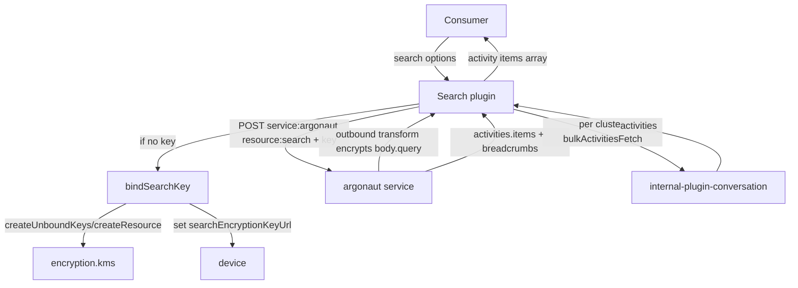
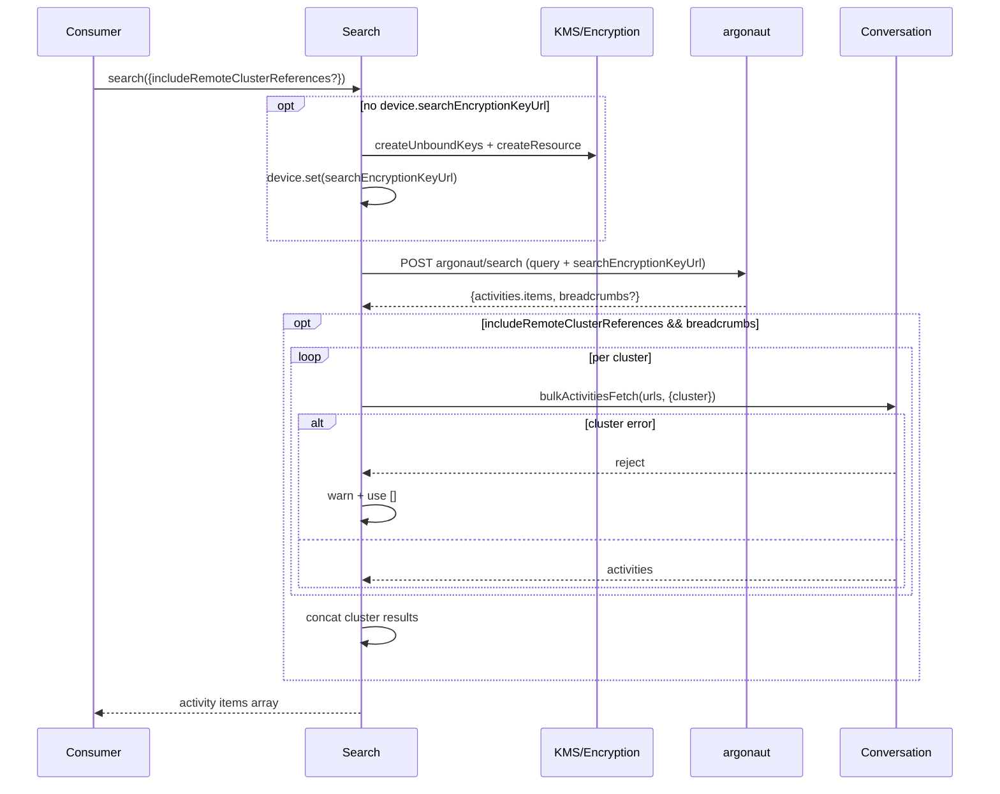
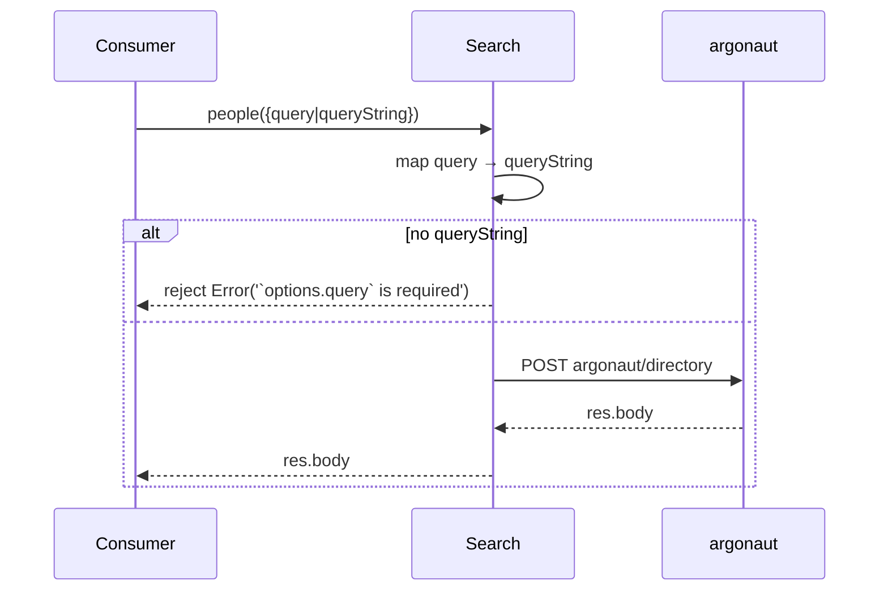
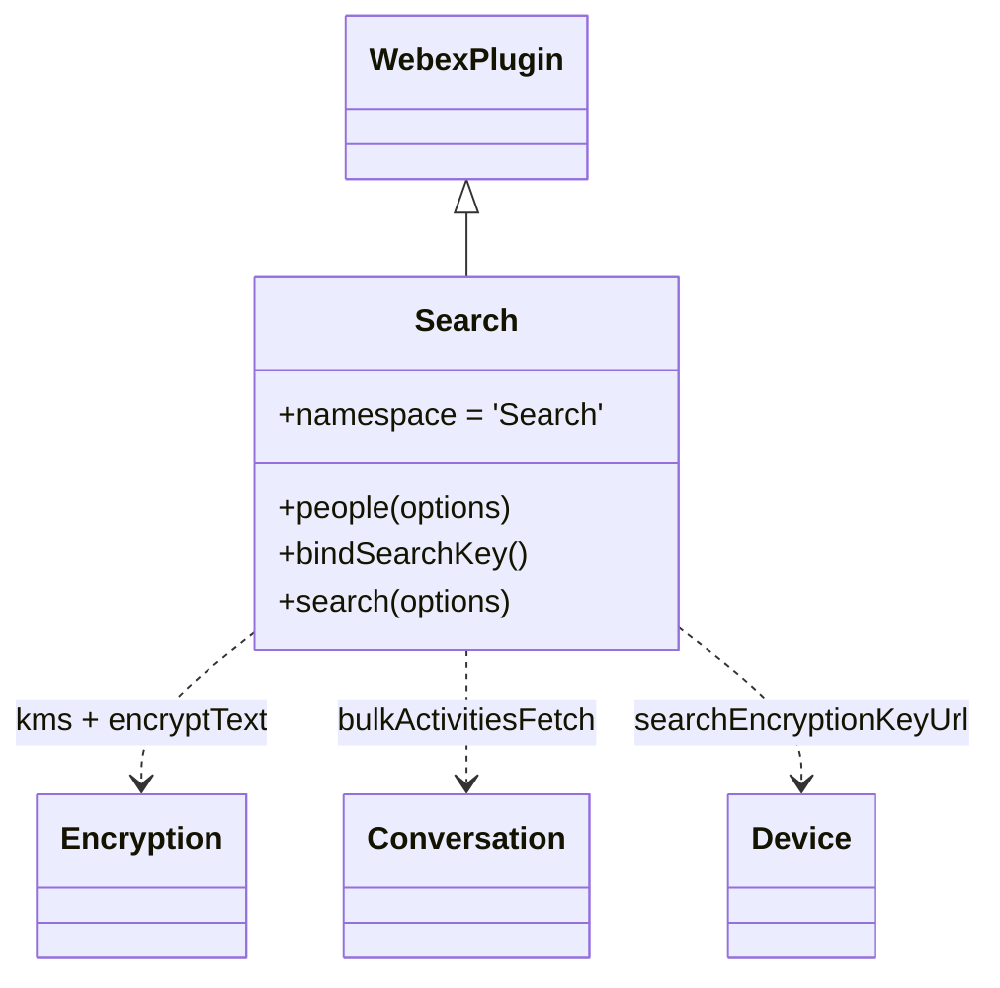

<!-- sdd-generated-metadata
generator: claude-cli
generator_model: us.anthropic.claude-opus-4-8
approved_by: pending-human-review
updated_at: 2026-08-06T00:00:00Z
validation_status: not-run
run_id: 51855eac-8de5-43a2-a3b6-dbcc55ebc91b
-->

# @webex/internal-plugin-search — SPEC

> Start here → root [`AGENTS.md`](../../../../AGENTS.md) (agent entry) · router [`SPEC_INDEX.md`](../../../../ai-docs/SPEC_INDEX.md) · system [`ARCHITECTURE.md`](../../../../ai-docs/ARCHITECTURE.md). This is the module's canonical spec: orientation, requirements, design, flows, and tests.
> Context-efficiency: link to canonical docs — don't duplicate them. Load specs on demand per `SPEC_INDEX.md`.

## Metadata

| Field | Value |
|---|---|
| Module id | `internal-plugin-search` |
| Source path(s) | `packages/@webex/internal-plugin-search/src/` |
| Parent spec | `—` (registered internal Webex plugin; composed by `webex-core`, no parent module) |
| Doc kind | Module spec |
| Coverage score | Pending coverage assessment |
| Generated from | `module-spec` @ SDLC template library `0.2.2` |
| generated_by / approved_by / updated_at | claude-cli / pending-human-review / 2026-08-06 |
| Validation status | not-run, validator `pending`, assessed 2026-08-06 |

Coverage score is `Pending coverage assessment` until the first coverage review runs. Manifest coverage
state is authoritative and kept in `.sdd/manifest.json`.

## Evidence Rules
Every requirement cites concrete source evidence using `file path`. Test evidence is preferred for WHY.
Requirements are grounded in the current implementation under `src/`.

## Source Material Register

| Source material | Scope | Decision | Detail location or disposition |
|---|---|---|---|
| Package README / package.json | overview | verified | Namespace, dependencies, and consumer usage migrated into Overview, Stack, and Requires. |
| Plugin source | overview / architecture / API | verified | Search methods, encryption predicate/transform, and remote-cluster fan-out migrated into Public Surface, Design Overview, Data Flow, and Sequence Diagrams. |

## Overview

`@webex/internal-plugin-search` is an internal Webex SDK plugin registered under the `search` namespace
(`webex.internal.search`). It performs encrypted content search against the **argonaut** service and
directory (people) search, decrypting/encrypting the query via KMS and, when requested, fanning out to
remote clusters to gather additional activity results.

The plugin (`src/search.js`, a `WebexPlugin.extend`) exposes three methods: `people(options)` (directory
lookup, `POST argonaut/directory`), `bindSearchKey()` (creates an unbound KMS key + resource and stores its
URI on the device as `searchEncryptionKeyUrl`), and `search(options)` (ensures a search key exists, then
`POST argonaut/search` with the query, and optionally follows `breadcrumbs` to bulk-fetch activities from
remote clusters via `internal-plugin-conversation`).

Registration (`src/index.js`) also installs a payload transformer: an outbound `encryptSearchQuery`
predicate/transform pair that encrypts `body.query` using `body.searchEncryptionKeyUrl` when the target
service is `argonaut`, and an inbound `transformObjectArray` predicate that extracts activity items from an
argonaut response for downstream decryption. A maintainer should start at `src/search.js` and `src/index.js`.

## Purpose / Responsibility

Owns encrypted content search (`argonaut`) and directory/people search for the SDK, including search-key
binding and remote-cluster result aggregation. It does NOT own encryption keys (delegates to
`webex.internal.encryption.kms`), conversation/activity storage (delegates to
`webex.internal.conversation`), or service discovery.

## Stack

JavaScript (ES modules, Babel-transpiled), built with `webex-legacy-tools`. Extends `WebexPlugin` from
`@webex/webex-core`; uses `@webex/common` (`oneFlight`), `lodash` (`get`, `has`), and `uuid`. Style
enforced with ESLint; integration/browser tests via `webex-legacy-tools`. Node engine `>=18`.

## Folder / Package Structure

```
packages/@webex/internal-plugin-search/src/
├── index.js     # registerInternalPlugin('search', Search, {config, payloadTransformer})
├── search.js    # Search WebexPlugin: people(), bindSearchKey(), search()
└── config.js    # default config (empty `search: {}` block)
```

## Key Files (source of truth)

| File | Holds |
|---|---|
| `packages/@webex/internal-plugin-search/src/search.js` | `people`, `bindSearchKey`, `search` methods and remote-cluster fan-out logic |
| `packages/@webex/internal-plugin-search/src/index.js` | Registration name (`search`) and payload-transformer predicates/transforms (encrypt query, extract activities) |
| `packages/@webex/internal-plugin-search/src/config.js` | Default `search` config block |

## Public Surface

Internal Surface — consumed as `webex.internal.search`; calls the remote `argonaut` service.

| Contract ID | Type | Surface | Purpose | Compatibility / deprecation | Schema / detail link | Root index |
|---|---|---|---|---|---|---|
| `search.people` | SDK | `people(options): Promise<Object>` | Directory/people search via `POST argonaut/directory` | Stable; maps legacy `options.query` → `options.queryString` | `packages/@webex/internal-plugin-search/src/search.js` | `../../../../ai-docs/CONTRACTS.md` |
| `search.search` | SDK | `search(options): Promise<Array>` | Encrypted content search via `POST argonaut/search`; optional remote-cluster aggregation | Stable; `options.includeRemoteClusterReferences` opts into fan-out | `packages/@webex/internal-plugin-search/src/search.js` | `../../../../ai-docs/CONTRACTS.md` |
| `search.bindSearchKey` | SDK | `bindSearchKey(): Promise<void>` | Create+bind a KMS search key and store `searchEncryptionKeyUrl` on the device | Stable; guarded by `@oneFlight` | `packages/@webex/internal-plugin-search/src/search.js` | `../../../../ai-docs/CONTRACTS.md` |
| `search.encryptSearchQuery` | event | Outbound payload transform | Encrypt `body.query` with `searchEncryptionKeyUrl` for argonaut requests | Internal transform | `packages/@webex/internal-plugin-search/src/index.js` | `../../../../ai-docs/CONTRACTS.md` |

Compatibility notes:
- `people()` rejects when neither `queryString` nor `query` is provided; `query` is migrated to
  `queryString` before the request.
- `search()` returns the raw activity items array (empty array when none), not the full response body.

## Requires (dependencies)

- `@webex/webex-core` — base `WebexPlugin`, `registerInternalPlugin`, `webex.request`, device state, service
  registry (`getServiceFromUrl`).
- `@webex/internal-plugin-encryption` — KMS `createUnboundKeys`/`createResource` for key binding and
  `encryptText` for the outbound query transform.
- `@webex/internal-plugin-conversation` — `bulkActivitiesFetch` for remote-cluster result aggregation.
- `@webex/internal-plugin-device` — stores/reads `searchEncryptionKeyUrl` and `userId`.
- External service: **argonaut** (search + directory endpoints).

## Requirements

| ID | WHAT | WHY | Source Evidence | Test / Example Evidence | Assumptions / Gaps | Confidence |
|---|---|---|---|---|---|---|
| `SEARCH-R-001` | `people` normalizes `options.query`→`options.queryString`, rejects when no query string is present, and `POST`s to `argonaut/directory`, resolving with `res.body`. | Directory lookups need a query and a stable request shape. | `packages/@webex/internal-plugin-search/src/search.js` | None found | none identified | PRESENT |
| `SEARCH-R-002` | `search` ensures a `searchEncryptionKeyUrl` exists (calling `bindSearchKey` if missing), then `POST`s to `argonaut/search` with the query and key, resolving with `body.activities.items` (default `[]`). | Content search requires an encryption key and returns activity items. | `packages/@webex/internal-plugin-search/src/search.js` | None found | none identified | PRESENT |
| `SEARCH-R-003` | When `options.includeRemoteClusterReferences` is set and the response has `breadcrumbs`, `search` bulk-fetches activities per cluster (`<cluster>:identityLookup`) via conversation and concatenates them onto the base results. | Cross-cluster search must aggregate remote activity results. | `packages/@webex/internal-plugin-search/src/search.js` | None found | Errors from a cluster fetch are logged and treated as `[]` | PRESENT |
| `SEARCH-R-004` | `bindSearchKey` creates one unbound KMS key, creates a KMS resource for the current user, and persists the key URI to `device.searchEncryptionKeyUrl`; it is `@oneFlight`-guarded. | Prevents duplicate key binding under concurrent calls. | `packages/@webex/internal-plugin-search/src/search.js` | None found | none identified | PRESENT |
| `SEARCH-R-005` | The outbound `encryptSearchQuery` transform encrypts `body.query` using `body.searchEncryptionKeyUrl`, gated to the `argonaut` service (by `options.service` or resolved from `options.url`). | Search queries must be encrypted before leaving the client. | `packages/@webex/internal-plugin-search/src/index.js` | None found | none identified | PRESENT |
| `SEARCH-R-006` | The inbound `transformObjectArray` predicate extracts `body.activities.items` for argonaut responses so items can be decrypted downstream. | Response activities must be decrypted per item. | `packages/@webex/internal-plugin-search/src/index.js` | None found | none identified | PRESENT |

## Design Overview

`Search` is a thin request layer over the argonaut service with encryption concerns handled by the KMS and
the payload-transformer pipeline. Query encryption is not performed inline in `search()`; instead the
outbound `encryptSearchQuery` transform (registered in `index.js`) encrypts `body.query` when the request
targets argonaut and carries a `searchEncryptionKeyUrl`. The plugin's job in `search()` is therefore to
guarantee the device has a bound search key and to attach it to the request body.

`bindSearchKey` is `@oneFlight`-guarded so concurrent searches that both find a missing key don't create
duplicate keys/resources. Remote-cluster aggregation is opt-in via `includeRemoteClusterReferences`: the
argonaut response's `breadcrumbs` map (cluster → activity URLs) drives per-cluster `bulkActivitiesFetch`
calls whose failures are caught, logged, and downgraded to an empty result so a single bad cluster does not
fail the whole search.

## Data Flow



## Sequence Diagram(s)

Sequence coverage:

| Operation group | Diagram | Failure / recovery coverage |
|---|---|---|
| Content search (+ remote clusters) | 1. search | `opt` covers key binding and remote-cluster fan-out; per-cluster failures are caught → `[]` |
| Directory/people search | 2. people | `alt` covers missing query rejection |

### 1. search



### 2. people



## Class / Component Relationships



`Search` extends `WebexPlugin` and delegates key management to encryption/KMS, remote activity fetch to
conversation, and key storage to device.

## Use Cases

- **UC-1 Content search:** consumer calls `search(options)` → key ensured → argonaut search → items
  returned. Evidence: `packages/@webex/internal-plugin-search/src/search.js`.
- **UC-2 Cross-cluster search:** `search({includeRemoteClusterReferences: true})` → base results + per-cluster
  aggregation. Evidence: `packages/@webex/internal-plugin-search/src/search.js`.
- **UC-3 Directory search:** `people({queryString})` → argonaut directory lookup. Evidence:
  `packages/@webex/internal-plugin-search/src/search.js`.

## Concurrency & Reactive Flow

`bindSearchKey` is `@oneFlight`-guarded so overlapping searches that both detect a missing search key share a
single key-binding promise instead of creating duplicate KMS keys/resources. Remote-cluster fetches run
concurrently via `Promise.all` over the breadcrumb clusters; each per-cluster promise catches its own error
and resolves to `[]`, so one failing cluster does not reject the aggregate. Evidence:
`packages/@webex/internal-plugin-search/src/search.js`.

## Error Handling & Failure Modes

| Condition | Signal (error/code/result) | Caller recovery |
|---|---|---|
| `people` called without a query | rejected Promise `Error('`options.query` is required')` | Provide `query`/`queryString` |
| Remote cluster `bulkActivitiesFetch` fails | warning logged; that cluster contributes `[]` | None required; partial results returned |
| KMS/argonaut request failure | rejected Promise (propagated from `request`/KMS) | Inspect underlying error / retry |

## Pitfalls

- `search()` does not encrypt the query itself — the outbound `encryptSearchQuery` transform does, and only
  for the `argonaut` service. Requests to other services will not have the query encrypted.
- `search()` resolves with the activity items array (default `[]`), not the full response body; `people()`
  resolves with `res.body`.
- Remote-cluster failures are silently downgraded to empty results (only a warning is logged), so a caller
  cannot distinguish "no results in cluster" from "cluster fetch failed".
- The cluster key used for `bulkActivitiesFetch` is rewritten to `<cluster>:identityLookup`.

## Test-Case Strategy (module)

The package builds and lint-checks under `webex-legacy-tools`; content-search behavior is primarily
exercised via integration/browser suites rather than committed unit specs. Recommended coverage: positive
`people`/`search` requests, the missing-query rejection, the key-binding branch when
`searchEncryptionKeyUrl` is absent, the remote-cluster aggregation (including a failing cluster downgraded
to `[]`), and the outbound `encryptSearchQuery` gating on the argonaut service.

| Behavior / Requirement | Existing test evidence | Gap |
|---|---|---|
| `SEARCH-R-001` | None found | Add unit coverage for query normalization + rejection |
| `SEARCH-R-002` | None found | Add unit coverage for the key-ensure + search path |
| `SEARCH-R-003` | None found | Add remote-cluster aggregation + failing-cluster tests |
| `SEARCH-R-004` | None found | Add `bindSearchKey` KMS + device.set coverage |
| `SEARCH-R-005` | None found | Add outbound transform gating tests |
| `SEARCH-R-006` | None found | Add inbound extract predicate tests |

## Traceability

- Repo architecture: [`ARCHITECTURE.md`](../../../../ai-docs/ARCHITECTURE.md) · Registry: [`SPEC_INDEX.md`](../../../../ai-docs/SPEC_INDEX.md)
- Coverage state & contracts baseline: `.sdd/manifest.json`
