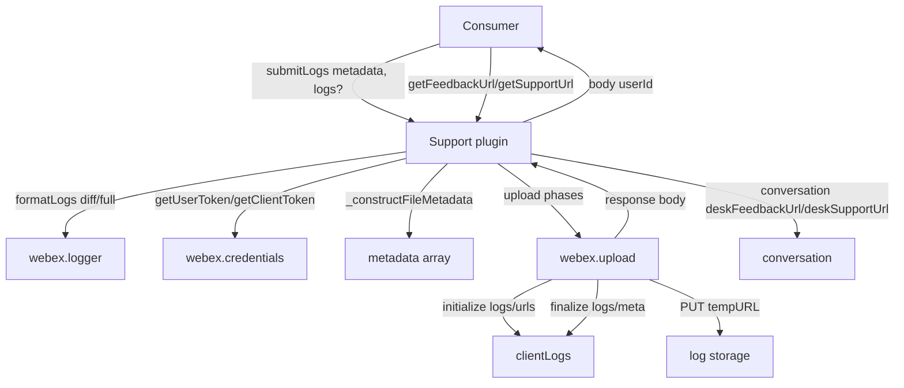
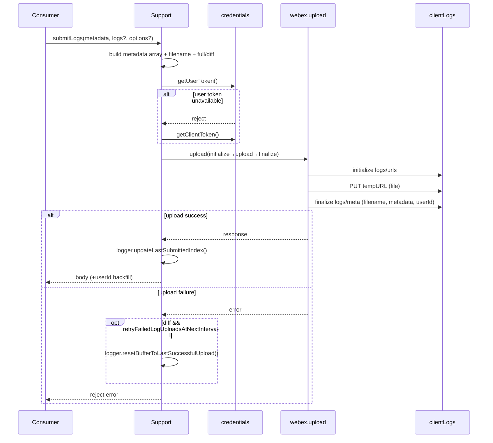
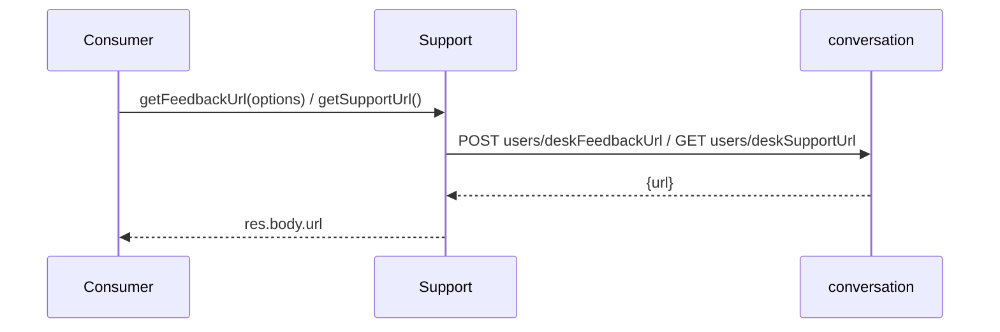
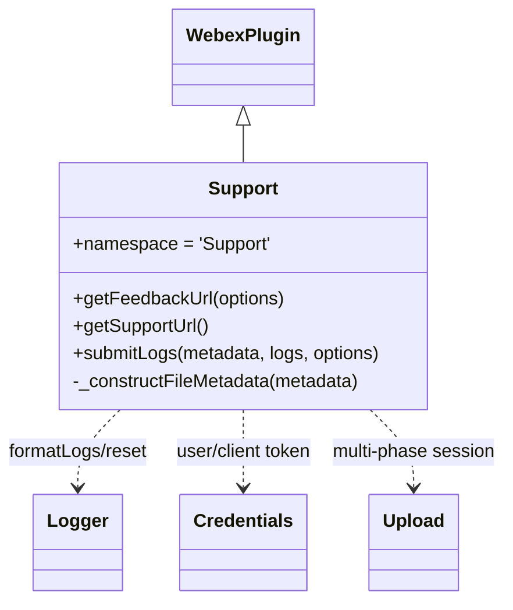

<!-- sdd-generated-metadata
generator: claude-cli
generator_model: us.anthropic.claude-opus-4-8
approved_by: pending-human-review
updated_at: 2026-08-06T00:00:00Z
validation_status: not-run
run_id: 51855eac-8de5-43a2-a3b6-dbcc55ebc91b
-->

# @webex/internal-plugin-support — SPEC

> Start here → root [`AGENTS.md`](../../../../AGENTS.md) (agent entry) · router [`SPEC_INDEX.md`](../../../../ai-docs/SPEC_INDEX.md) · system [`ARCHITECTURE.md`](../../../../ai-docs/ARCHITECTURE.md). This is the module's canonical spec: orientation, requirements, design, flows, and tests.
> Context-efficiency: link to canonical docs — don't duplicate them. Load specs on demand per `SPEC_INDEX.md`.

## Metadata

| Field | Value |
|---|---|
| Module id | `internal-plugin-support` |
| Source path(s) | `packages/@webex/internal-plugin-support/src/` |
| Parent spec | `—` (registered internal Webex plugin; composed by `webex-core`, no parent module) |
| Doc kind | Module spec |
| Coverage score | Pending coverage assessment |
| Generated from | `module-spec` @ SDLC template library `0.2.2` |
| generated_by / approved_by / updated_at | claude-cli / pending-human-review / 2026-08-06 |
| Validation status | not-run, validator `pending`, assessed 2026-08-06 |

Coverage score is `Pending coverage assessment` until the first coverage review runs. Manifest coverage
state is authoritative and kept in `.sdd/manifest.json`.

## Evidence Rules
Every requirement cites concrete source evidence using `file path`. Test evidence is preferred for WHY.
Requirements are grounded in the current implementation under `src/`.

## Source Material Register

| Source material | Scope | Decision | Detail location or disposition |
|---|---|---|---|
| Package README / package.json | overview | verified | Namespace, dependencies, and usage migrated into Overview, Stack, and Requires. |
| Plugin source | overview / architecture / API | verified | Feedback/support URL and log-upload methods migrated into Public Surface, Design Overview, Data Flow, and Sequence Diagrams. |

## Overview

`@webex/internal-plugin-support` is an internal Webex SDK plugin registered under the `support` namespace
(`webex.internal.support`). It provides client support/feedback plumbing: resolving desk feedback/support
URLs from the conversation service and uploading SDK/client logs (with rich metadata) to the client-logs
service via a multi-phase upload session.

The plugin (`src/support.js`, a `WebexPlugin.extend`) exposes `getFeedbackUrl(options)`
(`POST conversation users/deskFeedbackUrl`), `getSupportUrl()` (`GET conversation users/deskSupportUrl`),
and `submitLogs(metadata, logs, options)` which formats logs (full vs diff), builds a metadata key/value
array, obtains a user (or client) token, and runs a three-phase upload (initialize → upload → finalize)
against the `clientLogs` service. Its config (`src/config.js`) also seeds pre-discovery service URLs for
`atlas` and `clientLogs`. A maintainer should start at `src/support.js`.

## Purpose / Responsibility

Owns client feedback/support URL resolution and diagnostic log upload (with metadata) to the client-logs
service. It does NOT own log capture/buffering (delegates to `webex.logger`), credentials (delegates to
`webex.credentials`), or the upload transport (delegates to `webex.upload`).

## Stack

JavaScript (ES modules, Babel-transpiled), built with `webex-legacy-tools`. Extends `WebexPlugin` from
`@webex/webex-core`; uses `lodash` (`defaults`) and `uuid`. Unit tests run under Jest
(`webex-legacy-tools test --unit`); style via ESLint. Node engine `>=18`.

## Folder / Package Structure

```
packages/@webex/internal-plugin-support/src/
├── index.js     # registerInternalPlugin('support', Support, {config})
├── support.js   # Support WebexPlugin: getFeedbackUrl, getSupportUrl, submitLogs, _constructFileMetadata
└── config.js    # pre-discovery service URLs (atlas, clientLogs) + support config (appType/appVersion/languageCode/incrementalLogs)
```

## Key Files (source of truth)

| File | Holds |
|---|---|
| `packages/@webex/internal-plugin-support/src/support.js` | All methods, multi-phase upload options, metadata construction |
| `packages/@webex/internal-plugin-support/src/config.js` | Pre-discovery `atlas`/`clientLogs` URLs and default support config |
| `packages/@webex/internal-plugin-support/src/index.js` | Registration name (`support`) and device pre-mount import |

## Public Surface

Internal Surface — consumed as `webex.internal.support`; calls conversation and clientLogs services.

| Contract ID | Type | Surface | Purpose | Compatibility / deprecation | Schema / detail link | Root index |
|---|---|---|---|---|---|---|
| `support.getFeedbackUrl` | SDK | `getFeedbackUrl(options): Promise<string>` | Resolve desk feedback URL (`POST conversation users/deskFeedbackUrl`) | Stable; defaults appVersion/appType/languageCode/feedbackId | `packages/@webex/internal-plugin-support/src/support.js` | `../../../../ai-docs/CONTRACTS.md` |
| `support.getSupportUrl` | SDK | `getSupportUrl(): Promise<string>` | Resolve desk support URL (`GET conversation users/deskSupportUrl`) | Stable | `packages/@webex/internal-plugin-support/src/support.js` | `../../../../ai-docs/CONTRACTS.md` |
| `support.submitLogs` | SDK | `submitLogs(metadata, logs?, options?): Promise<Object>` | Upload SDK/client logs + metadata to clientLogs | Stable; `options.type` `full`/`diff` overrides `config.incrementalLogs` | `packages/@webex/internal-plugin-support/src/support.js` | `../../../../ai-docs/CONTRACTS.md` |

Compatibility notes:
- `submitLogs` resolves with the finalize response body (with `userId` backfilled when available).
- `getFeedbackUrl`/`getSupportUrl` resolve with `res.body.url`.

## Requires (dependencies)

- `@webex/webex-core` — base `WebexPlugin`, `registerInternalPlugin`, `webex.request`, `webex.upload`,
  `webex.credentials`, `webex.logger`, session id, device state.
- `@webex/internal-plugin-device` — `device.userId`/`device.orgId` used for metadata.
- `@webex/internal-plugin-search` — declared dependency (package-level).
- External services: **conversation** (feedback/support URLs) and **clientLogs** (`logs/urls`, `logs/meta`).

## Requirements

| ID | WHAT | WHY | Source Evidence | Test / Example Evidence | Assumptions / Gaps | Confidence |
|---|---|---|---|---|---|---|
| `SUPPORT-R-001` | `getFeedbackUrl` `POST`s to `conversation users/deskFeedbackUrl` with a body defaulted from config (`appVersion`, `appType`, `languageCode`) and a generated `feedbackId` (uuid v4) when absent, resolving with `res.body.url`. | Clients need a per-request desk feedback URL. | `packages/@webex/internal-plugin-support/src/support.js` | `packages/@webex/internal-plugin-support/test/unit/spec/support.js` | none identified | PRESENT |
| `SUPPORT-R-002` | `getSupportUrl` `GET`s `conversation users/deskSupportUrl` with `languageCode` from config, resolving with `res.body.url`. | Clients need a desk support URL. | `packages/@webex/internal-plugin-support/src/support.js` | `packages/@webex/internal-plugin-support/test/unit/spec/support.js` | none identified | PRESENT |
| `SUPPORT-R-003` | `submitLogs` chooses full vs diff logs (`options.type` overrides `config.incrementalLogs`), and when `logs` is omitted and logger buffers are ready, formats logs via `webex.logger.formatLogs({diff})`. | Log payload must reflect the requested full/diff mode. | `packages/@webex/internal-plugin-support/src/support.js` | `packages/@webex/internal-plugin-support/test/unit/spec/support.js` | none identified | PRESENT |
| `SUPPORT-R-004` | `submitLogs` derives the filename from `locusId_callStart.txt` when both are present, else `<sessionId>.txt`. | Uploaded logs must be named for correlation. | `packages/@webex/internal-plugin-support/src/support.js` | `packages/@webex/internal-plugin-support/test/unit/spec/support.js` | none identified | PRESENT |
| `SUPPORT-R-005` | `submitLogs` obtains a user token (falling back to a client token), then runs a three-phase `webex.upload` (initialize `clientLogs logs/urls` → upload to `session.tempURL` → finalize `clientLogs logs/meta` with filename, metadata array, and userId). | Log upload uses the client-logs multi-phase session protocol. | `packages/@webex/internal-plugin-support/src/support.js` | `packages/@webex/internal-plugin-support/test/unit/spec/support.js` | none identified | PRESENT |
| `SUPPORT-R-006` | On upload success `submitLogs` calls `logger.updateLastSubmittedIndex()`; on failure in diff mode with `config.retryFailedLogUploadsAtNextInterval`, it resets the buffer to the last successful upload and rejects. | Diff-mode retries must not lose unsent logs. | `packages/@webex/internal-plugin-support/src/support.js` | `packages/@webex/internal-plugin-support/test/unit/spec/support.js` | none identified | PRESENT |
| `SUPPORT-R-007` | `_constructFileMetadata` builds a `{key,value}` array from a fixed metadata allow-list, adding `trackingId` (sessionId), config `appVersion`, and device `userId`/`orgId` when present. | Uploaded logs must carry correlation metadata. | `packages/@webex/internal-plugin-support/src/support.js` | `packages/@webex/internal-plugin-support/test/unit/spec/support.js` | none identified | PRESENT |

## Design Overview

`Support` is a request/upload façade. URL resolution is a single conversation request each. Log upload is
the substantive flow: it separates *what to send* (full vs diff logs, formatted by `webex.logger`) from
*how to send it* (the `webex.upload` multi-phase session). Token acquisition prefers a user token and falls
back to a client token so unauthenticated-but-provisioned clients can still upload.

Metadata is assembled by `_constructFileMetadata` from an explicit allow-list of keys (locus/call/feedback
/survey/issue tags, etc.), then augmented with tracking id, app version, and device identifiers, keeping the
finalize payload deterministic. Failure handling is diff-aware: only diff uploads that are configured to
retry reset the logger buffer to the last successful upload so the next interval re-sends the missing slice.

## Data Flow



## Sequence Diagram(s)

Sequence coverage:

| Operation group | Diagram | Failure / recovery coverage |
|---|---|---|
| Submit logs | 1. submitLogs | `alt` covers user→client token fallback; `alt` covers upload failure with diff-retry buffer reset |
| Resolve feedback/support URL | 2. getFeedbackUrl / getSupportUrl | Single request each; error propagated from `request` |

### 1. submitLogs



### 2. getFeedbackUrl / getSupportUrl



## Class / Component Relationships



`Support` extends `WebexPlugin` and orchestrates logger, credentials, and upload rather than implementing
transport itself.

## Use Cases

- **UC-1 Upload diagnostic logs:** consumer calls `submitLogs(metadata)` → logs formatted, token acquired,
  three-phase upload, index updated. Evidence: `packages/@webex/internal-plugin-support/src/support.js`,
  `packages/@webex/internal-plugin-support/test/unit/spec/support.js`.
- **UC-2 Open feedback/support page:** consumer calls `getFeedbackUrl(options)`/`getSupportUrl()` to obtain
  a URL. Evidence: `packages/@webex/internal-plugin-support/src/support.js`.

## Error Handling & Failure Modes

| Condition | Signal (error/code/result) | Caller recovery |
|---|---|---|
| User token unavailable | falls back to client token | Transparent; no action |
| Upload fails (diff + retry config) | buffer reset to last successful upload; rejected Promise | Retry occurs at next interval |
| Upload fails (other) | rejected Promise (propagated) | Inspect error / retry manually |
| Conversation URL request fails | rejected Promise (propagated) | Inspect error / retry |

## Pitfalls

- `submitLogs` only auto-formats logs when the logger buffers (`sdkBuffer`, `clientBuffer`, `buffer`) are
  ready; passing `logs` explicitly bypasses this readiness check.
- The metadata allow-list in `_constructFileMetadata` is fixed; keys outside it (and falsy values) are
  dropped from the upload metadata.
- Only diff uploads with `retryFailedLogUploadsAtNextInterval` reset the buffer on failure; full-mode
  failures do not reset and simply reject.
- `getUserToken` failure is expected/handled (client-token fallback) — don't treat it as fatal.

## Test-Case Strategy (module)

Unit tests (Jest + chai + sinon + `MockWebex`) mock `webex.request`/`webex.upload`, `webex.credentials`,
and `webex.logger`. Coverage should include: `getFeedbackUrl`/`getSupportUrl` resolving `res.body.url`;
`submitLogs` filename selection (locus/call vs sessionId); full vs diff selection; token fallback;
success index update; and the diff-retry buffer reset on failure.

| Behavior / Requirement | Existing test evidence | Gap |
|---|---|---|
| `SUPPORT-R-001` | `packages/@webex/internal-plugin-support/test/unit/spec/support.js` | Re-check feedbackId default |
| `SUPPORT-R-002` | `packages/@webex/internal-plugin-support/test/unit/spec/support.js` | none |
| `SUPPORT-R-003` | `packages/@webex/internal-plugin-support/test/unit/spec/support.js` | Add explicit full/diff override coverage |
| `SUPPORT-R-004` | `packages/@webex/internal-plugin-support/test/unit/spec/support.js` | Assert both filename branches |
| `SUPPORT-R-005` | `packages/@webex/internal-plugin-support/test/unit/spec/support.js` | Assert phase resources |
| `SUPPORT-R-006` | `packages/@webex/internal-plugin-support/test/unit/spec/support.js` | Add diff-retry reset test |
| `SUPPORT-R-007` | `packages/@webex/internal-plugin-support/test/unit/spec/support.js` | Assert trackingId/appVersion/userId/orgId inclusion |

## Traceability

- Repo architecture: [`ARCHITECTURE.md`](../../../../ai-docs/ARCHITECTURE.md) · Registry: [`SPEC_INDEX.md`](../../../../ai-docs/SPEC_INDEX.md)
- Coverage state & contracts baseline: `.sdd/manifest.json`
