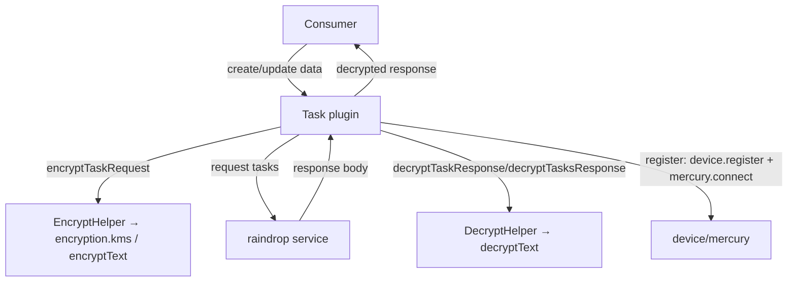
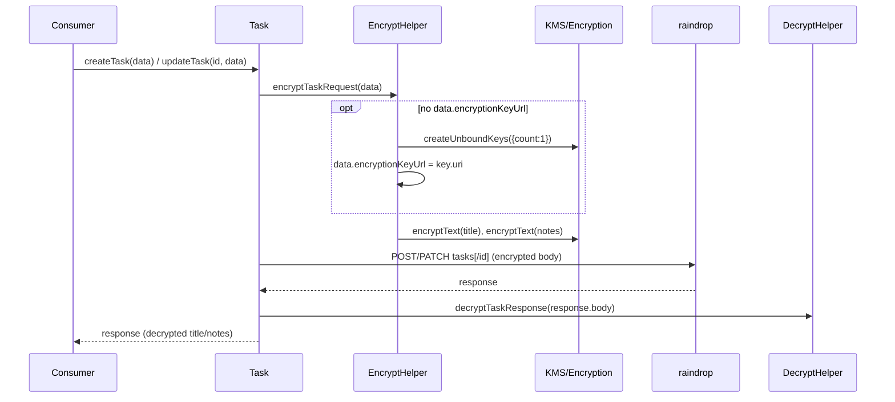
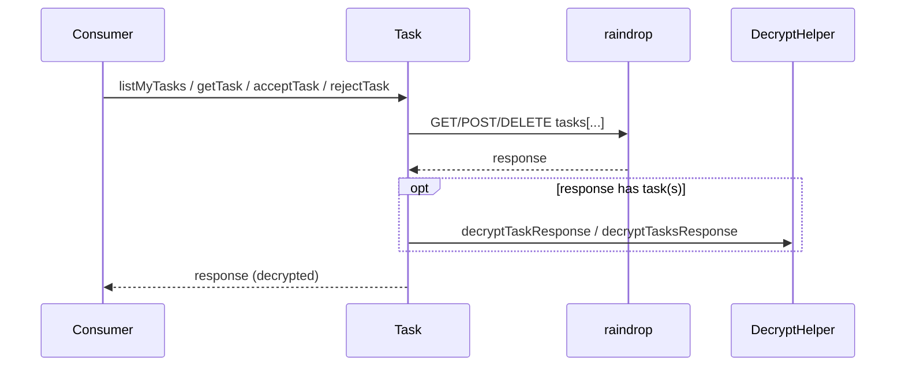
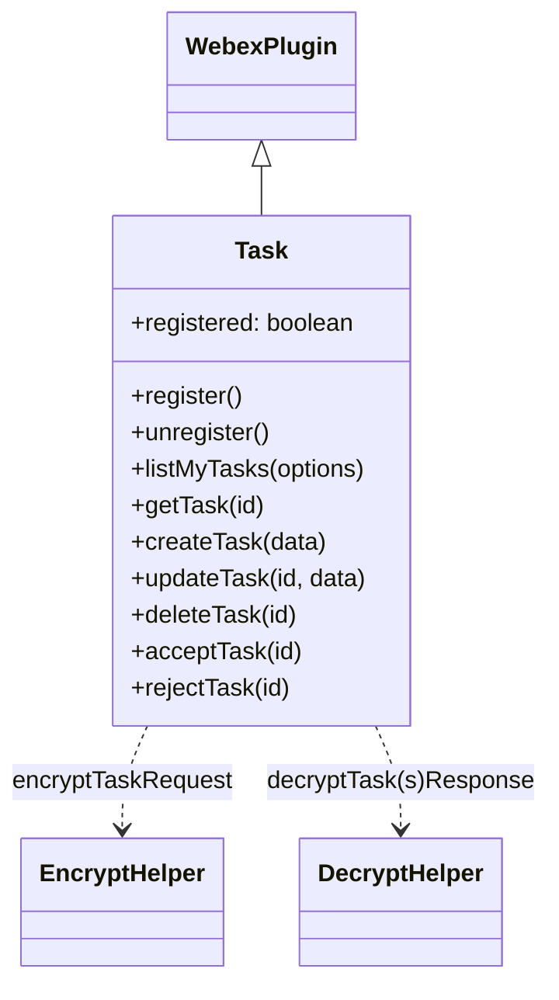

<!-- sdd-generated-metadata
generator: claude-cli
generator_model: us.anthropic.claude-opus-4-8
approved_by: pending-human-review
updated_at: 2026-08-06T00:00:00Z
validation_status: not-run
run_id: 51855eac-8de5-43a2-a3b6-dbcc55ebc91b
-->

# @webex/internal-plugin-task — SPEC

> Start here → root [`AGENTS.md`](../../../../AGENTS.md) (agent entry) · router [`SPEC_INDEX.md`](../../../../ai-docs/SPEC_INDEX.md) · system [`ARCHITECTURE.md`](../../../../ai-docs/ARCHITECTURE.md). This is the module's canonical spec: orientation, requirements, design, flows, state, and tests.
> Context-efficiency: link to canonical docs — don't duplicate them. Load specs on demand per `SPEC_INDEX.md`.

## Metadata

| Field | Value |
|---|---|
| Module id | `internal-plugin-task` |
| Source path(s) | `packages/@webex/internal-plugin-task/src/` |
| Parent spec | `—` (registered internal Webex plugin; composed by `webex-core`, no parent module) |
| Doc kind | Module spec |
| Coverage score | Pending coverage assessment |
| Generated from | `module-spec` @ SDLC template library `0.2.2` |
| generated_by / approved_by / updated_at | claude-cli / pending-human-review / 2026-08-06 |
| Validation status | not-run, validator `pending`, assessed 2026-08-06 |

Coverage score is `Pending coverage assessment` until the first coverage review runs. Manifest coverage
state is authoritative and kept in `.sdd/manifest.json`.

## Evidence Rules
Every requirement cites concrete source evidence using `file path`. Test evidence is preferred for WHY.
Requirements are grounded in the current implementation under `src/` and its unit tests.

## Source Material Register

| Source material | Scope | Decision | Detail location or disposition |
|---|---|---|---|
| Package README / package.json | overview | verified | Namespace, dependencies, and usage migrated into Overview, Stack, and Requires. |
| Plugin source | overview / architecture / API | verified | CRUD/accept/reject methods, register lifecycle, and encrypt/decrypt helpers migrated into Public Surface, Design Overview, Sequence Diagrams, and Concurrency sections. |

## Overview

`@webex/internal-plugin-task` is an internal Webex SDK plugin registered under the `task` namespace
(`webex.internal.task`). It manages user "tasks" against the **raindrop** service, providing CRUD plus
accept/reject operations, with `title`/`notes` fields encrypted/decrypted via KMS through the encryption
plugin.

The plugin (`src/task.js`, a `WebexPlugin.extend`) exposes a `register()`/`unregister()` lifecycle that
registers the device, connects Mercury, and toggles a `registered` flag (the event-listener hooks
`listenForEvents`/`stopListeningForEvents` are currently empty placeholders). Task data methods —
`listMyTasks`, `getTask`, `createTask`, `updateTask`, `deleteTask`, `acceptTask`, `rejectTask` — call the
raindrop `tasks` resource and route request/response bodies through `EncryptHelper`/`DecryptHelper` so the
sensitive `title` and `notes` fields are encrypted before sending and decrypted after receiving. A
maintainer should start at `src/task.js` and `src/helpers/`.

## Purpose / Responsibility

Owns task lifecycle (list/get/create/update/delete/accept/reject) against the raindrop service and the
field-level encryption/decryption of task `title`/`notes`. It does NOT own the encryption keys (delegates to
`webex.internal.encryption`/KMS) or Mercury transport (delegates to `webex.internal.mercury`).

## Stack

JavaScript (ES modules, Babel-transpiled), built with `webex-legacy-tools`. Extends `WebexPlugin` from
`@webex/webex-core`; uses `lodash` (`isArray`) and `uuid`. Unit tests run under Jest with `jest.useFakeTimers`;
integration via mocha. Node engine `>=18`.

## Folder / Package Structure

```
packages/@webex/internal-plugin-task/src/
├── index.js                 # registerInternalPlugin('task', Task, {config, payloadTransformer})
├── task.js                  # Task WebexPlugin: register/unregister + CRUD/accept/reject
├── config.js                # default config (empty `task: {}` block)
├── constants.js             # TASK_REGISTERED / TASK_UNREGISTERED event names
└── helpers/
    ├── encrypt.helper.js     # encryptTaskRequest: encrypt title/notes (bind KMS key if none)
    └── decrypt.helper.js     # decryptTaskResponse / decryptTasksResponse: decrypt title/notes
```

## Key Files (source of truth)

| File | Holds |
|---|---|
| `packages/@webex/internal-plugin-task/src/task.js` | All public methods and the register/unregister lifecycle |
| `packages/@webex/internal-plugin-task/src/helpers/encrypt.helper.js` | Title/notes encryption + KMS key creation when `encryptionKeyUrl` absent |
| `packages/@webex/internal-plugin-task/src/helpers/decrypt.helper.js` | Title/notes decryption for single task and task collections |
| `packages/@webex/internal-plugin-task/src/constants.js` | `TASK_REGISTERED`/`TASK_UNREGISTERED` event names |
| `packages/@webex/internal-plugin-task/src/index.js` | Registration name (`task`) |

## Public Surface

Internal Surface — consumed as `webex.internal.task`; calls the raindrop service.

| Contract ID | Type | Surface | Purpose | Compatibility / deprecation | Schema / detail link | Root index |
|---|---|---|---|---|---|---|
| `task.register` | SDK | `register(): Promise<void>` | Register device, connect Mercury, mark registered | Stable; rejects when SDK cannot authorize | `packages/@webex/internal-plugin-task/src/task.js` | `../../../../ai-docs/CONTRACTS.md` |
| `task.unregister` | SDK | `unregister(): Promise<void>` | Stop listening and clear registered flag | Stable | `packages/@webex/internal-plugin-task/src/task.js` | `../../../../ai-docs/CONTRACTS.md` |
| `task.listMyTasks` | SDK | `listMyTasks(options): Promise<Response>` | `GET raindrop tasks` (+decrypt items) | Stable | `packages/@webex/internal-plugin-task/src/task.js` | `../../../../ai-docs/CONTRACTS.md` |
| `task.getTask` | SDK | `getTask(id): Promise<Response>` | `GET raindrop tasks/{id}` (+decrypt) | Stable | `packages/@webex/internal-plugin-task/src/task.js` | `../../../../ai-docs/CONTRACTS.md` |
| `task.createTask` | SDK | `createTask(data): Promise<Response>` | Encrypt then `POST raindrop tasks` (+decrypt response) | Stable | `packages/@webex/internal-plugin-task/src/task.js` | `../../../../ai-docs/CONTRACTS.md` |
| `task.updateTask` | SDK | `updateTask(id, data): Promise<Response>` | Encrypt then `PATCH raindrop tasks/{id}` (+decrypt) | Stable | `packages/@webex/internal-plugin-task/src/task.js` | `../../../../ai-docs/CONTRACTS.md` |
| `task.deleteTask` | SDK | `deleteTask(id): Promise<Response>` | `DELETE raindrop tasks/{id}` | Stable | `packages/@webex/internal-plugin-task/src/task.js` | `../../../../ai-docs/CONTRACTS.md` |
| `task.acceptTask` | SDK | `acceptTask(id): Promise<Response>` | `POST raindrop tasks/{id}/accept` (+decrypt) | Stable | `packages/@webex/internal-plugin-task/src/task.js` | `../../../../ai-docs/CONTRACTS.md` |
| `task.rejectTask` | SDK | `rejectTask(id): Promise<Response>` | `POST raindrop tasks/{id}/reject` (+decrypt) | Stable | `packages/@webex/internal-plugin-task/src/task.js` | `../../../../ai-docs/CONTRACTS.md` |
| `task:registered` / `task:unregistered` | event | Triggered on (un)register | Signal registration lifecycle | Stable event names | `packages/@webex/internal-plugin-task/src/constants.js` | `../../../../ai-docs/CONTRACTS.md` |

Compatibility notes:
- Data methods resolve with the full HTTP response (after in-place decryption of `title`/`notes`), not just
  the body.
- `title` and `notes` are the encrypted fields; other task fields are sent/received in clear.

## Requires (dependencies)

- `@webex/webex-core` — base `WebexPlugin`, `registerInternalPlugin`, `webex.request`, `canAuthorize`.
- `@webex/internal-plugin-device` — `device.register()` during `register()`.
- `@webex/internal-plugin-mercury` — `mercury.connect()` during `register()`.
- `@webex/internal-plugin-encryption` — KMS `createUnboundKeys` and `encryptText`/`decryptText` for
  `title`/`notes`.
- `@webex/internal-plugin-conversation` — declared dependency (package-level).
- External service: **raindrop** (`tasks` resource).

## Requirements

| ID | WHAT | WHY | Source Evidence | Test / Example Evidence | Assumptions / Gaps | Confidence |
|---|---|---|---|---|---|---|
| `TASK-R-001` | `register` rejects when `webex.canAuthorize` is false, is idempotent when already registered, else registers the device, connects Mercury, starts listening, triggers `TASK_REGISTERED`, and sets `registered = true`. | Task events require a registered device + Mercury connection. | `packages/@webex/internal-plugin-task/src/task.js` | `packages/@webex/internal-plugin-task/test/unit/spec/task.js` | `listenForEvents` is currently a no-op placeholder | PRESENT |
| `TASK-R-002` | `unregister` is idempotent when not registered, else stops listening, triggers `TASK_UNREGISTERED`, and clears `registered`. | Clean teardown of the task subscription lifecycle. | `packages/@webex/internal-plugin-task/src/task.js` | `packages/@webex/internal-plugin-task/test/unit/spec/task.js` | none identified | PRESENT |
| `TASK-R-003` | `listMyTasks` `GET`s `raindrop tasks` with `qs` options and decrypts each returned item's `title`/`notes` before resolving. | Task lists must be returned decrypted. | `packages/@webex/internal-plugin-task/src/task.js`, `packages/@webex/internal-plugin-task/src/helpers/decrypt.helper.js` | `packages/@webex/internal-plugin-task/test/unit/spec/task.js` | none identified | PRESENT |
| `TASK-R-004` | `getTask(id)` `GET`s `raindrop tasks/{id}` and decrypts the task's `title`/`notes`. | Single-task fetch must be decrypted. | `packages/@webex/internal-plugin-task/src/task.js`, `packages/@webex/internal-plugin-task/src/helpers/decrypt.helper.js` | `packages/@webex/internal-plugin-task/test/unit/spec/task.js` | none identified | PRESENT |
| `TASK-R-005` | `createTask`/`updateTask` encrypt `title`/`notes` first (creating an unbound KMS key and assigning `encryptionKeyUrl` when none is provided), then `POST`/`PATCH` `raindrop tasks[/{id}]`, then decrypt the response. | Sensitive task fields must be encrypted at rest with a bound key. | `packages/@webex/internal-plugin-task/src/task.js`, `packages/@webex/internal-plugin-task/src/helpers/encrypt.helper.js` | `packages/@webex/internal-plugin-task/test/unit/spec/task.js` | none identified | PRESENT |
| `TASK-R-006` | `deleteTask(id)` `DELETE`s `raindrop tasks/{id}`; `acceptTask`/`rejectTask` `POST` to `tasks/{id}/accept`/`/reject` and decrypt the response. | Task state transitions and removal are server operations. | `packages/@webex/internal-plugin-task/src/task.js` | `packages/@webex/internal-plugin-task/test/unit/spec/task.js` | none identified | PRESENT |
| `TASK-R-007` | Encrypt/decrypt helpers skip absent fields and no-op when the item has no `encryptionKeyUrl`; decrypt of a collection maps over `data.items` and no-ops for empty/missing items. | Field-level crypto must tolerate partial payloads. | `packages/@webex/internal-plugin-task/src/helpers/encrypt.helper.js`, `packages/@webex/internal-plugin-task/src/helpers/decrypt.helper.js` | `packages/@webex/internal-plugin-task/test/unit/spec/task.js` | none identified | PRESENT |

## Design Overview

`Task` splits lifecycle wiring from data operations. `register()` chains device registration and Mercury
connect and guards on `canAuthorize`; the actual event subscription is intentionally left as empty
`listenForEvents`/`stopListeningForEvents` hooks (a placeholder for future Mercury task events), and the
`payloadTransformer` registered in `index.js` is empty. Encryption is therefore handled explicitly by
helper modules rather than by transform interceptors — a deliberate "backup solution" noted in the helper
JSDoc as pending migration to interceptors.

`EncryptHelper.encryptTaskRequest` either uses the caller-supplied `data.encryptionKeyUrl` or creates a
single unbound KMS key, assigns its URI to `data.encryptionKeyUrl`, and encrypts `title`/`notes` in
parallel. `DecryptHelper` mirrors this on responses (single task and `items[]` collections), no-opping when
a field or the key URL is absent. Every data method funnels its response through decryption before
resolving.

## Data Flow



## Sequence Diagram(s)

Sequence coverage:

| Operation group | Diagram | Failure / recovery coverage |
|---|---|---|
| Register lifecycle | 1. register | `alt` covers cannot-authorize reject, already-registered short-circuit, and registration error |
| Create/update task (encrypt→request→decrypt) | 2. createTask/updateTask | Shares actors/order; `opt` covers KMS key creation when no `encryptionKeyUrl` |
| Read/accept/reject (request→decrypt) | 3. listMyTasks/getTask/acceptTask/rejectTask | Same pattern minus encryption; error propagated from request |

### 1. register

```mermaid
sequenceDiagram
    participant C as Consumer
    participant T as Task
    participant D as device
    participant M as mercury
    C->>T: register()
    alt !canAuthorize
        T-->>C: reject Error('SDK cannot authorize')
    else already registered
        T-->>C: resolve()
    else
        T->>D: register()
        T->>M: connect()
        T->>T: listenForEvents(); trigger TASK_REGISTERED; registered=true
        alt error
            T-->>C: reject(error)
        else
            T-->>C: resolve()
        end
    end
```

### 2. createTask / updateTask



### 3. listMyTasks / getTask / acceptTask / rejectTask



## Class / Component Relationships



`Task` extends `WebexPlugin` and delegates all field crypto to the two helper modules.

## Use Cases

- **UC-1 Manage tasks:** consumer creates/updates/reads/deletes tasks; sensitive fields are transparently
  encrypted/decrypted. Evidence: `packages/@webex/internal-plugin-task/src/task.js`,
  `packages/@webex/internal-plugin-task/test/unit/spec/task.js`.
- **UC-2 Accept/reject a task:** consumer calls `acceptTask(id)`/`rejectTask(id)` to transition a task.
  Evidence: `packages/@webex/internal-plugin-task/src/task.js`.
- **UC-3 Register/unregister:** consumer calls `register()` to prepare the plugin (device + Mercury), and
  `unregister()` to tear down. Evidence: `packages/@webex/internal-plugin-task/src/task.js`.

## State Model

The plugin holds a single boolean `registered` flag (default `false`). `register()` sets it `true` after a
successful device-register + Mercury-connect chain; `unregister()` sets it `false`. Both operations are
idempotent with respect to this flag. Evidence: `packages/@webex/internal-plugin-task/src/task.js`.

## Concurrency & Reactive Flow

Data operations are request/response Promises. Within `createTask`/`updateTask`, `title` and `notes`
encryption run in parallel via `Promise.all`; likewise decryption of a task collection maps over
`items` with `Promise.all`. `register()` chains device registration and Mercury connect sequentially and
must complete before task events (once implemented) would be handled. Evidence:
`packages/@webex/internal-plugin-task/src/helpers/encrypt.helper.js`,
`packages/@webex/internal-plugin-task/src/helpers/decrypt.helper.js`,
`packages/@webex/internal-plugin-task/src/task.js`.

## Error Handling & Failure Modes

| Condition | Signal (error/code/result) | Caller recovery |
|---|---|---|
| SDK cannot authorize on `register` | rejected Promise `Error('SDK cannot authorize')` | Authenticate before registering |
| Device/Mercury registration error | error logged; rejected Promise (propagated) | Inspect error / retry `register` |
| raindrop request failure | rejected Promise (propagated) | Inspect error / retry |
| Missing field or `encryptionKeyUrl` in helper | no-op (resolves without crypto) | None; expected for partial payloads |

## Pitfalls

- `listenForEvents`/`stopListeningForEvents` are empty placeholders — `register()` connects Mercury but does
  not yet subscribe to task events, and the registered `payloadTransformer` is empty.
- Only `title` and `notes` are encrypted; do not assume other task fields are protected.
- Data methods resolve with the full HTTP response object (decrypted in place), not the body.
- `createTask`/`updateTask` mutate the passed-in `data` object (assigning `encryptionKeyUrl` and replacing
  `title`/`notes` with ciphertext).

## Test-Case Strategy (module)

Unit tests (Jest + `jest.useFakeTimers`) mock `webex` internals (device/mercury/encryption) and assert:
`register` rejects without authorize, is idempotent, and wires device+mercury; `unregister` clears state;
and CRUD/accept/reject call the right raindrop resource with encrypt/decrypt applied. Add negative cases
for request failures and for helper no-op paths (missing field / missing key URL).

| Behavior / Requirement | Existing test evidence | Gap |
|---|---|---|
| `TASK-R-001` | `packages/@webex/internal-plugin-task/test/unit/spec/task.js` | none |
| `TASK-R-002` | `packages/@webex/internal-plugin-task/test/unit/spec/task.js` | none |
| `TASK-R-003` | `packages/@webex/internal-plugin-task/test/unit/spec/task.js` | Assert items decrypted |
| `TASK-R-004` | `packages/@webex/internal-plugin-task/test/unit/spec/task.js` | none |
| `TASK-R-005` | `packages/@webex/internal-plugin-task/test/unit/spec/task.js` | Assert KMS key creation when key absent |
| `TASK-R-006` | `packages/@webex/internal-plugin-task/test/unit/spec/task.js` | Assert accept/reject resources |
| `TASK-R-007` | `packages/@webex/internal-plugin-task/test/unit/spec/task.js` | Add helper no-op edge cases |

## Traceability

- Repo architecture: [`ARCHITECTURE.md`](../../../../ai-docs/ARCHITECTURE.md) · Registry: [`SPEC_INDEX.md`](../../../../ai-docs/SPEC_INDEX.md)
- Coverage state & contracts baseline: `.sdd/manifest.json`
