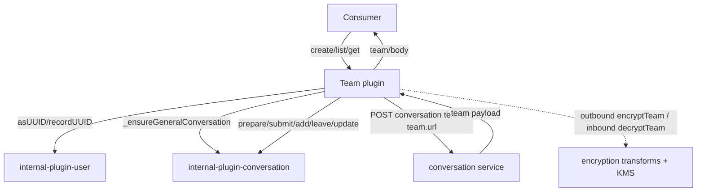
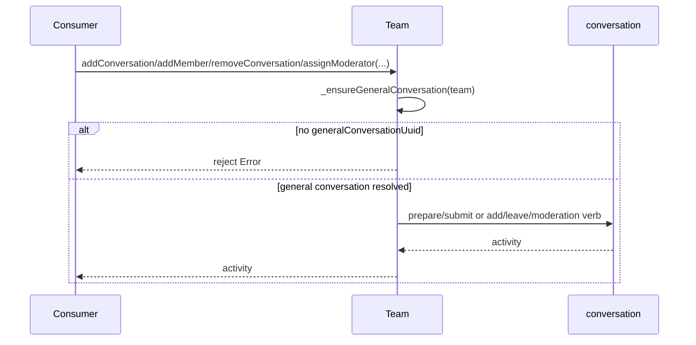
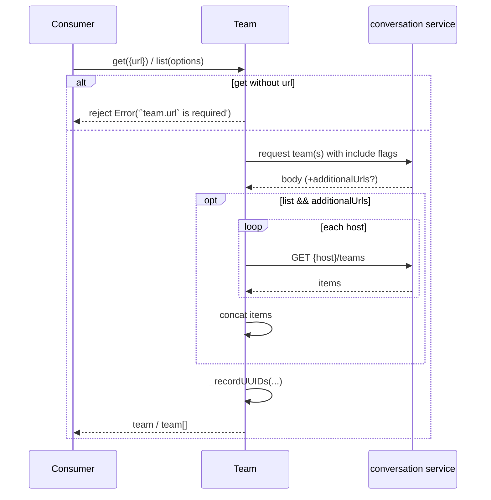

<!-- sdd-generated-metadata
generator: claude-cli
generator_model: us.anthropic.claude-opus-4-8
approved_by: pending-human-review
updated_at: 2026-08-06T00:00:00Z
validation_status: not-run
run_id: 51855eac-8de5-43a2-a3b6-dbcc55ebc91b
-->

# @webex/internal-plugin-team — SPEC

> Start here → root [`AGENTS.md`](../../../../AGENTS.md) (agent entry) · router [`SPEC_INDEX.md`](../../../../ai-docs/SPEC_INDEX.md) · system [`ARCHITECTURE.md`](../../../../ai-docs/ARCHITECTURE.md). This is the module's canonical spec: orientation, requirements, design, flows, and tests.
> Context-efficiency: link to canonical docs — don't duplicate them. Load specs on demand per `SPEC_INDEX.md`.

## Metadata

| Field | Value |
|---|---|
| Module id | `internal-plugin-team` |
| Source path(s) | `packages/@webex/internal-plugin-team/src/` |
| Parent spec | `—` (registered internal Webex plugin; composed by `webex-core`, no parent module) |
| Doc kind | Module spec |
| Coverage score | Pending coverage assessment |
| Generated from | `module-spec` @ SDLC template library `0.2.2` |
| generated_by / approved_by / updated_at | claude-cli / pending-human-review / 2026-08-06 |
| Validation status | not-run, validator `pending`, assessed 2026-08-06 |

Coverage score is `Pending coverage assessment` until the first coverage review runs. Manifest coverage
state is authoritative and kept in `.sdd/manifest.json`.

## Evidence Rules
Every requirement cites concrete source evidence using `file path`. Test evidence is preferred for WHY.
Requirements are grounded in the current implementation under `src/` and its unit tests.

## Source Material Register

| Source material | Scope | Decision | Detail location or disposition |
|---|---|---|---|
| Package README / package.json | overview | verified | Namespace, dependencies, and usage migrated into Overview, Stack, and Requires. |
| Plugin source | overview / architecture / API | verified | Team CRUD, membership/conversation ops, moderation/archive verbs, and encrypt/decrypt transforms migrated into Public Surface, Design Overview, Sequence Diagrams. |

## Overview

`@webex/internal-plugin-team` is an internal Webex SDK plugin registered under the `team` namespace
(`webex.internal.team`). It manages Webex "teams" — a grouping of conversations with shared membership —
built on top of the conversation plugin. It creates teams and team conversations, adds/removes members and
conversations, retrieves/lists teams, assigns/unassigns moderators, archives/unarchives, and joins team
conversations, delegating activity submission and encryption to `internal-plugin-conversation`.

The plugin (`src/team.js`, a `WebexPlugin.extend`) implements explicit methods (`addConversation`,
`addMember`, `create`, `createConversation`, `get`, `listConversations`, `joinConversation`, `list`,
`removeMember`, `removeConversation`, `update`) plus dynamically generated verb methods
(`assignModerator`/`unassignModerator`, `archive`/`unarchive`). Registration (`src/index.js`) adds
payload transformers that encrypt/decrypt a team's `displayName`/`summary` and normalize/decrypt team room
status events. A maintainer should start at `src/team.js` and the transformer wiring in `src/index.js`.

## Purpose / Responsibility

Owns Webex team lifecycle and membership/conversation composition, plus team-level encryption
(`displayName`, `summary`) and normalization transforms. It does NOT own individual conversation activity
plumbing, KMS keys, or user UUID resolution — those are delegated to `internal-plugin-conversation`,
`internal-plugin-encryption`, and `internal-plugin-user`.

## Stack

JavaScript (ES modules, Babel-transpiled), built with `webex-legacy-tools`. Extends `WebexPlugin` from
`@webex/webex-core`; uses `lodash` (`find`, `pick`, `uniq`, `isArray`, `has`, `get`), `uuid`, and node
`querystring`. Unit tests run under Jest with sinon + `MockWebex`. Node engine `>=18`.

## Folder / Package Structure

```
packages/@webex/internal-plugin-team/src/
├── index.js   # registerInternalPlugin('team', Team, {payloadTransformer, config}) + encrypt/decrypt/normalize transforms
├── team.js    # Team WebexPlugin: CRUD, membership/conversation ops, moderation/archive verbs
└── config.js  # default config (empty `team: {}` block)
```

## Key Files (source of truth)

| File | Holds |
|---|---|
| `packages/@webex/internal-plugin-team/src/team.js` | All team methods, `_prepareTeam`/`_prepareTeamConversation`, `_ensureGeneralConversation`, `_recordUUIDs`, moderation/archive verb generators |
| `packages/@webex/internal-plugin-team/src/index.js` | Registration name (`team`) and payload transforms (encrypt/decrypt team, decrypt team room status, normalize team) |
| `packages/@webex/internal-plugin-team/src/config.js` | Default `team` config block |

## Public Surface

Internal Surface — consumed as `webex.internal.team`; calls the conversation service.

| Contract ID | Type | Surface | Purpose | Compatibility / deprecation | Schema / detail link | Root index |
|---|---|---|---|---|---|---|
| `team.create` | SDK | `create(params): Promise<Team>` | Create a team (`POST conversation teams`) | Requires `displayName` + `participants` | `packages/@webex/internal-plugin-team/src/team.js` | `../../../../ai-docs/CONTRACTS.md` |
| `team.get` | SDK | `get({url}, options): Promise<Team>` | Retrieve one team; records member UUIDs | Requires `team.url` | `packages/@webex/internal-plugin-team/src/team.js` | `../../../../ai-docs/CONTRACTS.md` |
| `team.list` | SDK | `list(options): Promise<Team[]>` | List teams (+ `additionalUrls` fan-out) | Stable | `packages/@webex/internal-plugin-team/src/team.js` | `../../../../ai-docs/CONTRACTS.md` |
| `team.createConversation` | SDK | `createConversation(team, params, options): Promise<Conversation>` | Create a conversation in a team | Requires `team.url` + `params.displayName` | `packages/@webex/internal-plugin-team/src/team.js` | `../../../../ai-docs/CONTRACTS.md` |
| `team.listConversations` | SDK | `listConversations({url}): Promise<Conversation[]>` | List a team's conversations | Requires `team.url` | `packages/@webex/internal-plugin-team/src/team.js` | `../../../../ai-docs/CONTRACTS.md` |
| `team.addConversation` | SDK | `addConversation(team, conversation, activity): Promise<Activity>` | Move a group conversation into a team | Stable | `packages/@webex/internal-plugin-team/src/team.js` | `../../../../ai-docs/CONTRACTS.md` |
| `team.removeConversation` | SDK | `removeConversation(team, conversation, activity): Promise<Activity>` | Remove a conversation from a team | Stable | `packages/@webex/internal-plugin-team/src/team.js` | `../../../../ai-docs/CONTRACTS.md` |
| `team.addMember` / `team.removeMember` | SDK | `addMember/removeMember(team, participant, activity)` | Add/remove a team member via general conversation | Stable | `packages/@webex/internal-plugin-team/src/team.js` | `../../../../ai-docs/CONTRACTS.md` |
| `team.joinConversation` | SDK | `joinConversation(team, conversation, userId): Promise<Conversation>` | Join a team conversation (KMS authorization) | Requires `userId` | `packages/@webex/internal-plugin-team/src/team.js` | `../../../../ai-docs/CONTRACTS.md` |
| `team.update` | SDK | `update(team, object, activity): Promise<Activity>` | Update displayName/summary/teamColor | Delegates to conversation.update | `packages/@webex/internal-plugin-team/src/team.js` | `../../../../ai-docs/CONTRACTS.md` |
| `team.assignModerator` / `team.unassignModerator` | SDK | `(team, member, activity)` | Assign/unassign a team moderator | Generated verb methods | `packages/@webex/internal-plugin-team/src/team.js` | `../../../../ai-docs/CONTRACTS.md` |
| `team.archive` / `team.unarchive` | SDK | `(target, activity)` | Archive/unarchive a team or team conversation | Requires `target.objectType` | `packages/@webex/internal-plugin-team/src/team.js` | `../../../../ai-docs/CONTRACTS.md` |
| `team.encryptTeam` / `team.decryptTeam` | event | Payload transforms | Encrypt/decrypt team `displayName`/`summary` and child conversations | Internal transforms | `packages/@webex/internal-plugin-team/src/index.js` | `../../../../ai-docs/CONTRACTS.md` |

Compatibility notes:
- Most creation/membership methods require a resolvable "general conversation" (`generalConversationUuid`).
- `create`/`createConversation` prepend the current device `userId` and de-duplicate participants.

## Requires (dependencies)

- `@webex/webex-core` — base `WebexPlugin`, `registerInternalPlugin`, `webex.request`, device/credentials.
- `@webex/internal-plugin-conversation` — `prepare`/`submit`/`add`/`leave`/`update`/`get`, KMS-aware
  conversation preparation, and moderation verbs.
- `@webex/internal-plugin-user` — `asUUID`/`recordUUID` for participant resolution.
- `@webex/internal-plugin-encryption` — KMS `createUnboundKeys` for team key binding (via transforms).
- External service: **conversation** (`teams` resource, team URLs).

## Requirements

| ID | WHAT | WHY | Source Evidence | Test / Example Evidence | Assumptions / Gaps | Confidence |
|---|---|---|---|---|---|---|
| `TEAM-R-001` | `create` requires `displayName` and non-empty `participants`, resolves all participants to UUIDs (creating if needed), prepends the device `userId`, de-dups, prepares a team payload (`objectType: 'team'`, optional `summary`), and `POST`s `conversation teams`. | Team creation must have a name, members, and the creator included exactly once. | `packages/@webex/internal-plugin-team/src/team.js` | `packages/@webex/internal-plugin-team/test/unit/spec/team.js` | none identified | PRESENT |
| `TEAM-R-002` | `createConversation` requires `team.url` and `params.displayName`, ensures the general conversation, resolves+dedups participants, pushes the general conversation KRO onto the KMS message userIds, and `POST`s to `{team.url}/conversations` (optionally `includeAllTeamMembers`). | Team conversations must be created under the team and decryptable by members via the general KRO. | `packages/@webex/internal-plugin-team/src/team.js` | `packages/@webex/internal-plugin-team/test/unit/spec/team.js` | none identified | PRESENT |
| `TEAM-R-003` | `get({url}, options)` requires `url`, requests the team with `includeTeamConversations`/`includeTeamMembers` defaults, and records member UUIDs before resolving with the body. | Team retrieval must cache member identities for later use. | `packages/@webex/internal-plugin-team/src/team.js` | `packages/@webex/internal-plugin-team/test/unit/spec/team.js` | none identified | PRESENT |
| `TEAM-R-004` | `list(options)` requests `conversation teams`, and when the response has `additionalUrls`, fans out to each host's `teams` resource and concatenates items; records UUIDs for the primary items. | Team lists may span multiple clusters/hosts. | `packages/@webex/internal-plugin-team/src/team.js` | `packages/@webex/internal-plugin-team/test/unit/spec/team.js` | none identified | PRESENT |
| `TEAM-R-005` | `addConversation`/`removeConversation` operate through the team's general conversation, building `add`/`remove` activities (with KMS authorization/delete messages) and submitting via conversation. | Team membership of a conversation is expressed as general-conversation activities. | `packages/@webex/internal-plugin-team/src/team.js` | `packages/@webex/internal-plugin-team/test/unit/spec/team.js` | none identified | PRESENT |
| `TEAM-R-006` | `addMember`/`removeMember` delegate to `conversation.add`/`conversation.leave` on the general conversation; `joinConversation` requires `userId` and `POST`s a KMS-authorization body to `{team.url}/conversations/{id}/participants`. | Membership and joins are KMS-scoped conversation operations. | `packages/@webex/internal-plugin-team/src/team.js` | `packages/@webex/internal-plugin-team/test/unit/spec/team.js` | none identified | PRESENT |
| `TEAM-R-007` | Generated verbs: `assignModerator`/`unassignModerator` delegate to the conversation moderation verb on the general conversation; `archive`/`unarchive` require `target.objectType` and submit an archive-state activity to the team URL. | Moderation and archive are consistent conversation activities. | `packages/@webex/internal-plugin-team/src/team.js` | `packages/@webex/internal-plugin-team/test/unit/spec/team.js` | none identified | PRESENT |
| `TEAM-R-008` | Payload transforms encrypt/decrypt a team's `displayName`/`summary` (binding a KMS key when needed and setting `encryptionKeyUrl`/`defaultActivityEncryptionKeyUrl`), decrypt child conversations, decrypt `teamRoomStatus` events, and normalize team conversation/member arrays. | Team metadata must be encrypted at rest and normalized on read. | `packages/@webex/internal-plugin-team/src/index.js` | `packages/@webex/internal-plugin-team/test/unit/spec/team.js` | none identified | PRESENT |

## Design Overview

`Team` is a composition layer over `internal-plugin-conversation`: nearly every membership/conversation
operation first resolves the team's "general conversation" (`_ensureGeneralConversation`, which either
finds it in `team.conversations.items` or fetches it by `generalConversationUuid`) and then delegates to the
conversation plugin's activity `prepare`/`submit` or `add`/`leave`/`update`. This keeps team semantics
(who is a member, which conversations belong to the team) expressed as conversation activities with the
right KMS authorizations.

Repetitive verb methods are generated at module load: `['assignModerator','unassignModerator']` and
`['archive','unarchive']` are attached to `Team.prototype` to avoid duplicated bodies. Encryption/normalization
are handled declaratively by the registered payload transforms rather than inline, so `displayName`/`summary`
are encrypted outbound (binding a key when absent) and decrypted inbound alongside child conversations and
team-room-status events.

## Data Flow



## Sequence Diagram(s)

Sequence coverage:

| Operation group | Diagram | Failure / recovery coverage |
|---|---|---|
| Create team | 1. create | `alt` covers missing displayName/participants rejection |
| Membership/conversation via general conversation | 2. addConversation/addMember/removeConversation/moderation | `alt` covers missing `generalConversationUuid` reject |
| Retrieve/list teams | 3. get/list | `opt` covers `additionalUrls` fan-out; `alt` covers missing `url` reject |

### 1. create

```mermaid
sequenceDiagram
    participant C as Consumer
    participant T as Team
    participant U as user
    participant CS as conversation service
    C->>T: create(params)
    alt no displayName or participants
        T-->>C: reject Error
    else
        T->>U: asUUID(participants, {create:true})
        T->>T: unshift device.userId; uniq
        T->>T: _prepareTeam(params) (objectType team, summary)
        T->>CS: POST conversation teams (payload)
        CS-->>T: team body
        T-->>C: team
    end
```

### 2. Membership / conversation via general conversation



### 3. get / list



## Class / Component Relationships

```mermaid
classDiagram
    class WebexPlugin
    class Team {
      +create(params)
      +createConversation(team, params, options)
      +get({url}, options)
      +list(options)
      +addConversation/removeConversation(...)
      +addMember/removeMember(...)
      +joinConversation(team, conversation, userId)
      +update(team, object, activity)
      +assignModerator/unassignModerator(...)
      +archive/unarchive(...)
      -_ensureGeneralConversation(team)
      -_prepareTeam(params)
      -_prepareTeamConversation(teamConversation, params)
      -_recordUUIDs(team)
    }
    WebexPlugin <|-- Team
    Team ..> Conversation : prepare/submit/add/leave/update
    Team ..> User : asUUID/recordUUID
```

`Team` extends `WebexPlugin`; moderation/archive verbs are attached to the prototype at load time.

## Use Cases

- **UC-1 Create a team with members:** `create({displayName, participants})` → UUIDs resolved → team POSTed.
  Evidence: `packages/@webex/internal-plugin-team/src/team.js`.
- **UC-2 Add a conversation to a team:** `addConversation(team, conversation, activity)` via the general
  conversation. Evidence: `packages/@webex/internal-plugin-team/src/team.js`.
- **UC-3 Moderate/archive:** `assignModerator`/`archive` submit the corresponding activity. Evidence:
  `packages/@webex/internal-plugin-team/src/team.js`.
- **UC-4 List teams across clusters:** `list()` fans out to `additionalUrls`. Evidence:
  `packages/@webex/internal-plugin-team/src/team.js`.

## Error Handling & Failure Modes

| Condition | Signal (error/code/result) | Caller recovery |
|---|---|---|
| `create` missing displayName/participants | rejected Promise (`Error`) | Provide required params |
| Method missing required `team.url`/`userId`/`objectType` | rejected Promise (`Error`) | Provide the required field |
| Team has no resolvable general conversation | rejected Promise (`Error('`team.generalConversationUuid` must be present')`) | Fetch a full team object first |
| Team conversation missing KRO | rejected Promise (`Error('Team general conversation must have a KRO')`) | Ensure the general conversation is fully loaded |
| `_recordUUIDs` per-member failure | warning logged; continues | None; best-effort caching |

## Pitfalls

- Almost every membership/conversation operation depends on `_ensureGeneralConversation`; a partial `team`
  object (missing `generalConversationUuid` or unloaded conversations) will reject.
- `create`/`createConversation` mutate `params.participants` (prepend device userId, de-dup).
- `removeConversation` builds a KMS delete message with a `<KRO>` placeholder URI and `authId` querystring;
  don't hand-edit that shape.
- Moderation/archive methods are added dynamically to the prototype, so they won't appear in the class body.

## Test-Case Strategy (module)

Unit tests (Jest + sinon + chai + `MockWebex`, with `User` mounted) should assert: `create` validation and
participant handling; `get`/`list` URL requirements and `additionalUrls` fan-out; general-conversation
resolution errors; membership/conversation activity delegation; and the encrypt/decrypt/normalize transforms
for team metadata and team-room-status events.

| Behavior / Requirement | Existing test evidence | Gap |
|---|---|---|
| `TEAM-R-001` | `packages/@webex/internal-plugin-team/test/unit/spec/team.js` | Assert both validation rejects |
| `TEAM-R-002` | `packages/@webex/internal-plugin-team/test/unit/spec/team.js` | Assert general-KRO push |
| `TEAM-R-003` | `packages/@webex/internal-plugin-team/test/unit/spec/team.js` | Assert UUID recording |
| `TEAM-R-004` | `packages/@webex/internal-plugin-team/test/unit/spec/team.js` | Add `additionalUrls` fan-out test |
| `TEAM-R-005` | `packages/@webex/internal-plugin-team/test/unit/spec/team.js` | Assert add/remove activity shape |
| `TEAM-R-006` | `packages/@webex/internal-plugin-team/test/unit/spec/team.js` | Assert joinConversation body |
| `TEAM-R-007` | `packages/@webex/internal-plugin-team/test/unit/spec/team.js` | Assert archive requires objectType |
| `TEAM-R-008` | `packages/@webex/internal-plugin-team/test/unit/spec/team.js` | Add encrypt/decrypt/normalize transform tests |

## Traceability

- Repo architecture: [`ARCHITECTURE.md`](../../../../ai-docs/ARCHITECTURE.md) · Registry: [`SPEC_INDEX.md`](../../../../ai-docs/SPEC_INDEX.md)
- Coverage state & contracts baseline: `.sdd/manifest.json`
