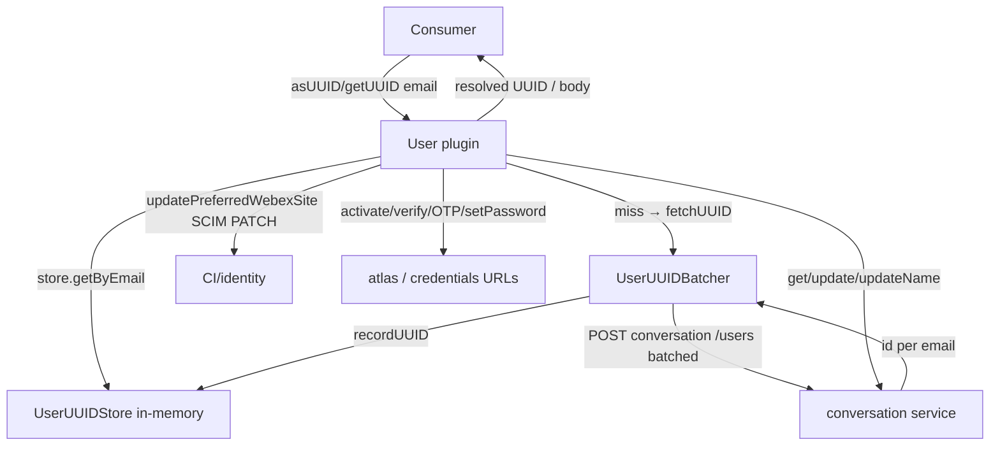
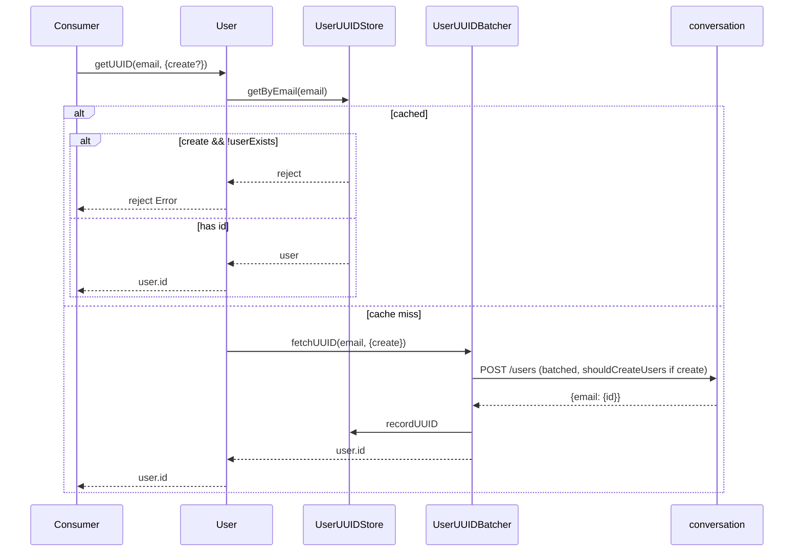
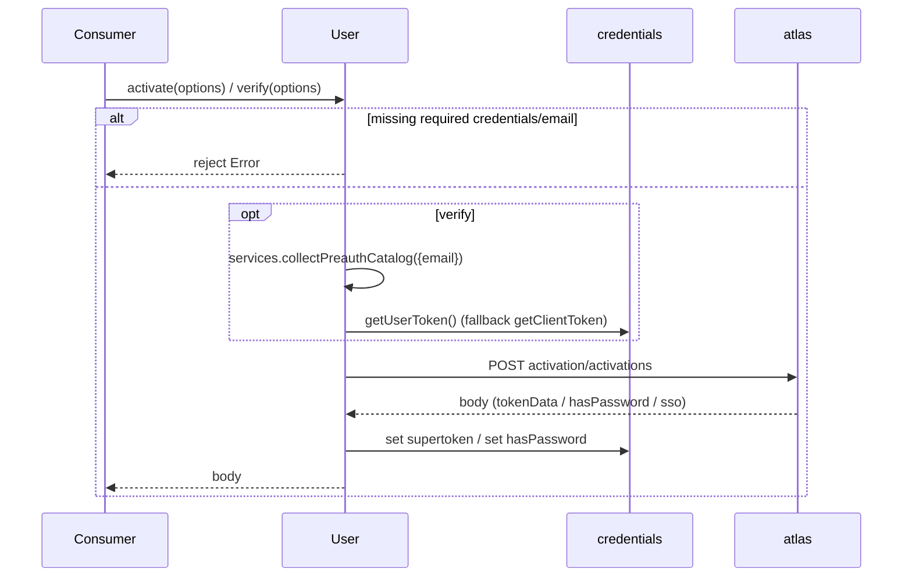
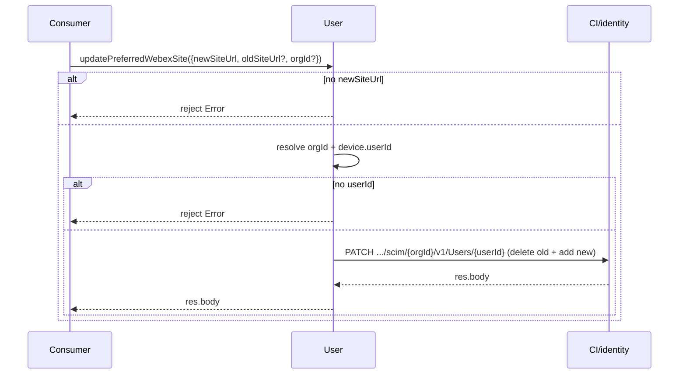
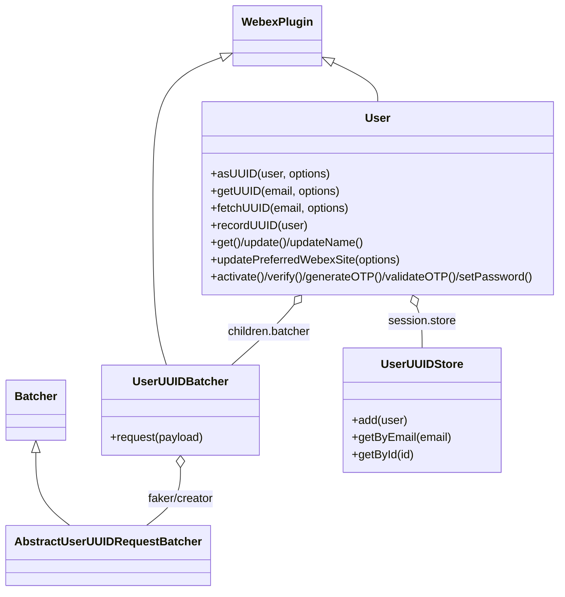

<!-- sdd-generated-metadata
generator: claude-cli
generator_model: us.anthropic.claude-opus-4-8
approved_by: pending-human-review
updated_at: 2026-08-06T00:00:00Z
validation_status: not-run
run_id: 51855eac-8de5-43a2-a3b6-dbcc55ebc91b
-->

# @webex/internal-plugin-user — SPEC

> Start here → root [`AGENTS.md`](../../../../AGENTS.md) (agent entry) · router [`SPEC_INDEX.md`](../../../../ai-docs/SPEC_INDEX.md) · system [`ARCHITECTURE.md`](../../../../ai-docs/ARCHITECTURE.md). This is the module's canonical spec: orientation, requirements, design, flows, and tests.
> Context-efficiency: link to canonical docs — don't duplicate them. Load specs on demand per `SPEC_INDEX.md`.

## Metadata

| Field | Value |
|---|---|
| Module id | `internal-plugin-user` |
| Source path(s) | `packages/@webex/internal-plugin-user/src/` |
| Parent spec | `—` (registered internal Webex plugin; composed by `webex-core`, no parent module) |
| Doc kind | Module spec |
| Coverage score | Pending coverage assessment |
| Generated from | `module-spec` @ SDLC template library `0.2.2` |
| generated_by / approved_by / updated_at | claude-cli / pending-human-review / 2026-08-06 |
| Validation status | not-run, validator `pending`, assessed 2026-08-06 |

Coverage score is `Pending coverage assessment` until the first coverage review runs. Manifest coverage
state is authoritative and kept in `.sdd/manifest.json`.

## Evidence Rules
Every requirement cites concrete source evidence using `file path`. Test evidence is preferred for WHY.
Requirements are grounded in the current implementation under `src/` and its unit tests.

## Source Material Register

| Source material | Scope | Decision | Detail location or disposition |
|---|---|---|---|
| Package README / package.json | overview | verified | Namespace, dependencies, and usage migrated into Overview, Stack, and Requires. |
| Plugin source | overview / architecture / API | verified | User identity/activation methods, UUID batcher, and in-memory store migrated into Public Surface, Design Overview, and Class Relationships. |

## Overview

`@webex/internal-plugin-user` is an internal Webex SDK plugin registered under the `user` namespace
(`webex.internal.user`). It resolves user identities (email ↔ UUID), fetches/updates the current user's
profile, manages account activation and password/OTP flows against Common Identity (CI)/Atlas, and maintains
an in-memory email↔UUID cache with request batching to minimize network lookups.

The plugin (`src/user.js`, a `WebexPlugin.extend`) exposes identity resolution (`asUUID`, `getUUID`,
`fetchUUID`, `recordUUID`), profile operations (`get`, `update`, `updateName`, `updatePreferredWebexSite`,
`getMeetingSiteList`), account operations (`activate`, `verify`/`register` (deprecated alias),
`generateOTP`, `validateOTP`, `setPassword`, `getUserCI`), and helpers. UUID lookups are batched via
`UserUUIDBatcher` (`src/user-uuid-batcher.js`) and cached in `UserUUIDStore` (`src/user-uuid-store.js`), an
in-memory `WeakMap`-backed store. Pure helpers `buildPreferredSiteBody` and `buildMeetingSiteList` are
exported for direct/unit use. A maintainer should start at `src/user.js`.

## Purpose / Responsibility

Owns user identity resolution (email/UUID), current-user profile read/update, account activation and
credential (password/OTP) flows, and the email→UUID cache/batcher. It does NOT own credential storage
(delegates to `webex.credentials`) or device/service discovery (delegates to `internal-plugin-device`/
`services`).

## Stack

JavaScript (ES modules, Babel-transpiled), built with `webex-legacy-tools`. Extends `WebexPlugin` and uses
`Batcher`, `persist`, `waitForValue` from `@webex/webex-core`, and `deprecated`/`oneFlight`/`patterns`/`tap`
from `@webex/common`; `lodash` (`isArray`) and `uuid`. Unit tests run under Jest with sinon + `MockWebex`.
Node engine `>=18`.

## Folder / Package Structure

```
packages/@webex/internal-plugin-user/src/
├── index.js               # registerInternalPlugin('user', User, {config})
├── user.js                # User WebexPlugin: identity/profile/account methods + pure helpers
├── user-uuid-batcher.js   # UserUUIDBatcher (fake/creator batchers over conversation /users)
├── user-uuid-store.js     # UserUUIDStore: in-memory email/id maps (WeakMap-backed)
└── config.js              # pre-discovery atlas URL + user config (batcher waits, verifyDefaults)
```

## Key Files (source of truth)

| File | Holds |
|---|---|
| `packages/@webex/internal-plugin-user/src/user.js` | All plugin methods; `buildPreferredSiteBody`, `buildMeetingSiteList`, `SCIM_SCHEMAS` exports |
| `packages/@webex/internal-plugin-user/src/user-uuid-batcher.js` | Batched `/users` requests (create vs fake) and item success/failure handling |
| `packages/@webex/internal-plugin-user/src/user-uuid-store.js` | In-memory email↔id user cache and validation |
| `packages/@webex/internal-plugin-user/src/config.js` | Batcher tuning (`batcherWait`/`batcherMaxCalls`/`batcherMaxWait`), `verifyDefaults`, atlas URL |

## Public Surface

Internal Surface — consumed as `webex.internal.user`; calls conversation, atlas, CI/identity, and credentials.

| Contract ID | Type | Surface | Purpose | Compatibility / deprecation | Schema / detail link | Root index |
|---|---|---|---|---|---|---|
| `user.asUUID` | SDK | `asUUID(user, options): Promise<string\|string[]>` | Resolve a user/email (or array) to a UUID | Stable; `options.create`/`options.force` | `packages/@webex/internal-plugin-user/src/user.js` | `../../../../ai-docs/CONTRACTS.md` |
| `user.getUUID` | SDK | `getUUID(email, options): Promise<string>` | Cache-first email→UUID (batched fallback) | `@oneFlight` keyed by email+create | `packages/@webex/internal-plugin-user/src/user.js` | `../../../../ai-docs/CONTRACTS.md` |
| `user.recordUUID` | SDK | `recordUUID(user): Promise` | Cache an email↔UUID pair (validated) | Stable | `packages/@webex/internal-plugin-user/src/user.js` | `../../../../ai-docs/CONTRACTS.md` |
| `user.get` | SDK | `get(): Promise<Object>` | Fetch current user (`conversation users`) + cache UUID | Stable | `packages/@webex/internal-plugin-user/src/user.js` | `../../../../ai-docs/CONTRACTS.md` |
| `user.update` / `user.updateName` | SDK | profile PATCH | Update displayName / given/family name | Stable | `packages/@webex/internal-plugin-user/src/user.js` | `../../../../ai-docs/CONTRACTS.md` |
| `user.updatePreferredWebexSite` | SDK | `updatePreferredWebexSite({newSiteUrl, oldSiteUrl?, orgId?})` | SCIM PATCH preferred meeting site | Requires `newSiteUrl` + device.userId | `packages/@webex/internal-plugin-user/src/user.js` | `../../../../ai-docs/CONTRACTS.md` |
| `user.getMeetingSiteList` | SDK | `getMeetingSiteList(user): string[]` | Deduped/sorted meeting-site list (filters `#`) | Pure helper delegate | `packages/@webex/internal-plugin-user/src/user.js` | `../../../../ai-docs/CONTRACTS.md` |
| `user.activate` | SDK | `activate(options): Promise` | Activate account, set supertoken | Requires verificationToken or confirmationCode+id | `packages/@webex/internal-plugin-user/src/user.js` | `../../../../ai-docs/CONTRACTS.md` |
| `user.verify` (`user.register` deprecated) | SDK | `verify(options): Promise<Object>` | Determine signup/signin + activation email | `register` is a `@deprecated` alias | `packages/@webex/internal-plugin-user/src/user.js` | `../../../../ai-docs/CONTRACTS.md` |
| `user.generateOTP` / `user.validateOTP` | SDK | OTP flows | Generate/validate one-time password | Require email or id | `packages/@webex/internal-plugin-user/src/user.js` | `../../../../ai-docs/CONTRACTS.md` |
| `user.setPassword` | SDK | `setPassword({password, email?})` | Set the user password (SCIM PATCH) | Requires `password`; sets `hasPassword` | `packages/@webex/internal-plugin-user/src/user.js` | `../../../../ai-docs/CONTRACTS.md` |
| `user.getUserCI` | SDK | `getUserCI(email, lookupCI): Promise<Object>` | Return CI URLs (lookup via verify or config) | Stable | `packages/@webex/internal-plugin-user/src/user.js` | `../../../../ai-docs/CONTRACTS.md` |

Compatibility notes:
- `buildPreferredSiteBody`, `buildMeetingSiteList`, and `SCIM_SCHEMAS` are named exports from
  `src/user.js` and are unit-tested directly.
- `register` is retained only as a deprecated alias for `verify`.

## Requires (dependencies)

- `@webex/webex-core` — base `WebexPlugin`, `Batcher`, `persist`, `waitForValue`, `webex.request`,
  `webex.config`, `webex.credentials`.
- `@webex/common` — `oneFlight`, `deprecated`, `patterns` (uuid/email), `tap`.
- `@webex/internal-plugin-device` — `device.userId` used by profile/site update methods.
- External services/endpoints: **conversation** (`users`), **atlas** (`users/activations`),
  **CI/identity** (SCIM), and the credentials activation/OTP/setPassword URLs.

## Requirements

| ID | WHAT | WHY | Source Evidence | Test / Example Evidence | Assumptions / Gaps | Confidence |
|---|---|---|---|---|---|---|
| `USER-R-001` | `asUUID` rejects a falsy user, maps arrays element-wise, returns the id directly when it is a uuid (unless `options.force`), else validates the email and delegates to `getUUID`. | Callers pass mixed user shapes and expect a UUID. | `packages/@webex/internal-plugin-user/src/user.js` | `packages/@webex/internal-plugin-user/test/unit/spec/user.js` | none identified | PRESENT |
| `USER-R-002` | `getUUID` is `@oneFlight`-keyed by email+create, reads the store first (rejecting for `create` when the user is unconfirmed or has no id), and falls back to `fetchUUID` (batched) on a cache miss. | Avoid duplicate lookups and enforce create semantics. | `packages/@webex/internal-plugin-user/src/user.js`, `packages/@webex/internal-plugin-user/src/user-uuid-batcher.js` | `packages/@webex/internal-plugin-user/test/unit/spec/user.js` | none identified | PRESENT |
| `USER-R-003` | `recordUUID` validates that `user.id` is a uuid and `user.emailAddress` is an email before adding to the store; the store rejects invalid entries and merges by id and email. | Cache integrity requires validated identifiers. | `packages/@webex/internal-plugin-user/src/user.js`, `packages/@webex/internal-plugin-user/src/user-uuid-store.js` | `packages/@webex/internal-plugin-user/test/unit/spec/user.js` | none identified | PRESENT |
| `USER-R-004` | `get` fetches the current user (`conversation users`) and caches the UUID (using `email` or `emailAddress`); `update`/`updateName` PATCH the profile with required fields. | Current-user identity and profile edits. | `packages/@webex/internal-plugin-user/src/user.js` | `packages/@webex/internal-plugin-user/test/unit/spec/user.js` | none identified | PRESENT |
| `USER-R-005` | `updatePreferredWebexSite` requires `newSiteUrl` and `device.userId`, resolves `orgId` (arg or credentials), and SCIM-PATCHes `{identity}/identity/scim/{orgId}/v1/Users/{userId}` with a delete-old+add-new `userPreferences` body. | Preferred-site change must match the native SCIM format. | `packages/@webex/internal-plugin-user/src/user.js` | `packages/@webex/internal-plugin-user/test/unit/spec/user.js` | none identified | PRESENT |
| `USER-R-006` | `buildPreferredSiteBody` includes `SCIM_SCHEMAS`, emits an add-only body without `oldSiteUrl` and a delete+add body with it; `buildMeetingSiteList` merges linked+train site names, filters `#`, dedups, and sorts. | Pure, testable formatting of SCIM site payloads/lists. | `packages/@webex/internal-plugin-user/src/user.js` | `packages/@webex/internal-plugin-user/test/unit/spec/user.js` | none identified | PRESENT |
| `USER-R-007` | Account flows: `activate`/`validateOTP` set the credentials supertoken from `res.body.tokenData`; `verify` collects the preauth catalog, prefers user→client token, POSTs `atlas users/activations`, and sets `hasPassword` on password/sso; `setPassword` PATCHes and sets `hasPassword`. | Activation/verification/credential flows must update auth state. | `packages/@webex/internal-plugin-user/src/user.js` | `packages/@webex/internal-plugin-user/test/unit/spec/user.js` | none identified | PRESENT |
| `USER-R-008` | UUID batching: `fetchUUID` batches `/users` requests; the creator batcher adds `shouldCreateUsers=true`, and per-email responses resolve/reject their deferred based on the returned `id`. | Batching reduces lookup traffic while honoring create semantics. | `packages/@webex/internal-plugin-user/src/user-uuid-batcher.js` | `packages/@webex/internal-plugin-user/test/unit/spec/user.js` | none identified | PRESENT |

## Design Overview

`User` separates identity resolution, profile/account operations, and caching. Identity resolution is
cache-first: `getUUID` reads `UserUUIDStore` and only falls back to a network `fetchUUID` (routed through
`UserUUIDBatcher`) on a miss, and it is `@oneFlight`-guarded so concurrent identical lookups share one
request. The batcher has two child batchers — a "fake" batcher (lookup-only) and a "creator" batcher (adds
`shouldCreateUsers=true`) — selected by the request's `create` flag, and it resolves each email's deferred
individually based on the server's per-email result.

`UserUUIDStore` is a deliberately in-memory store backed by module-level `WeakMap`s keyed by the store
instance, holding `Map`s of email→user and id→user, with validation on `add`. Profile and account methods
are thin request wrappers that also maintain auth state (`hasPassword`, credentials supertoken). The pure
helpers `buildPreferredSiteBody`/`buildMeetingSiteList` isolate SCIM/site formatting so they can be unit
tested without a webex instance.

## Data Flow



## Sequence Diagram(s)

Sequence coverage:

| Operation group | Diagram | Failure / recovery coverage |
|---|---|---|
| Identity resolution (email→UUID) | 1. getUUID | `alt` covers cache hit vs miss→batched fetch; create-unconfirmed rejection |
| Account activation/verification | 2. activate/verify | `alt` covers missing-credential rejection and token fallback |
| Profile/site update | 3. updatePreferredWebexSite | `alt` covers missing `newSiteUrl`/`device.userId` rejection |

### 1. getUUID



### 2. activate / verify



### 3. updatePreferredWebexSite



## Class / Component Relationships



`User` composes a `UserUUIDBatcher` child and a `UserUUIDStore` session object; the batcher owns fake/creator
sub-batchers extending the core `Batcher`.

## Use Cases

- **UC-1 Resolve an email to a UUID:** `asUUID(email)` → cache/batched lookup → UUID. Evidence:
  `packages/@webex/internal-plugin-user/src/user.js`,
  `packages/@webex/internal-plugin-user/test/unit/spec/user.js`.
- **UC-2 Update preferred meeting site:** `updatePreferredWebexSite({newSiteUrl, oldSiteUrl})` → SCIM PATCH.
  Evidence: `packages/@webex/internal-plugin-user/src/user.js`.
- **UC-3 Activate/verify an account:** `verify({email})`/`activate(...)` → auth state updated. Evidence:
  `packages/@webex/internal-plugin-user/src/user.js`.

## Error Handling & Failure Modes

| Condition | Signal (error/code/result) | Caller recovery |
|---|---|---|
| Missing user/email/required option | rejected Promise (`Error`) | Provide the required identifier |
| `getUUID` create on unconfirmed user | rejected Promise (`Error('User for specified email cannot be confirmed to exist')`) | Retry without `create` or confirm the user |
| Store lookup miss | rejected Promise (caught → batched fetch) | Transparent fallback |
| `recordUUID`/store invalid id/email | rejected Promise (`Error`) | Provide valid uuid + email |
| `updatePreferredWebexSite` without device.userId | rejected Promise (`Error('device.userId is not available...')`) | Ensure `device.register()` completed |

## Pitfalls

- `UserUUIDStore` is in-memory only (WeakMap/Map) — the cache does not persist across sessions.
- `getUUID` swallows store misses via `.catch()` and falls back to the network; a rejected store lookup is
  expected, not an error.
- `asUUID` returns the input id unchanged for uuid-shaped input unless `options.force` is set.
- `updatePreferredWebexSite` embeds preferences as stringified `"preferredWebExSite":"..."` values to match
  the native client's SCIM format — do not "normalize" that shape.
- `register` is deprecated; use `verify`.

## Test-Case Strategy (module)

Unit tests (Jest + sinon + chai + `MockWebex`) directly test the pure helpers (`buildPreferredSiteBody`,
`buildMeetingSiteList`) and mock `webex.request`/credentials for method behavior. Coverage should include:
`asUUID` array/uuid/force/email branches; `getUUID` cache-hit vs miss and create-unconfirmed rejection;
`recordUUID`/store validation; profile/site SCIM PATCH shape; and activation/verify token handling.

| Behavior / Requirement | Existing test evidence | Gap |
|---|---|---|
| `USER-R-001` | `packages/@webex/internal-plugin-user/test/unit/spec/user.js` | Assert array + force branches |
| `USER-R-002` | `packages/@webex/internal-plugin-user/test/unit/spec/user.js` | Assert create-unconfirmed rejection |
| `USER-R-003` | `packages/@webex/internal-plugin-user/test/unit/spec/user.js` | Assert invalid id/email rejects |
| `USER-R-004` | `packages/@webex/internal-plugin-user/test/unit/spec/user.js` | Assert UUID caching on get |
| `USER-R-005` | `packages/@webex/internal-plugin-user/test/unit/spec/user.js` | Assert SCIM PATCH URI + body |
| `USER-R-006` | `packages/@webex/internal-plugin-user/test/unit/spec/user.js` | none (directly tested) |
| `USER-R-007` | `packages/@webex/internal-plugin-user/test/unit/spec/user.js` | Assert token fallback + hasPassword |
| `USER-R-008` | `packages/@webex/internal-plugin-user/test/unit/spec/user.js` | Add creator-vs-fake batcher tests |

## Traceability

- Repo architecture: [`ARCHITECTURE.md`](../../../../ai-docs/ARCHITECTURE.md) · Registry: [`SPEC_INDEX.md`](../../../../ai-docs/SPEC_INDEX.md)
- Coverage state & contracts baseline: `.sdd/manifest.json`
