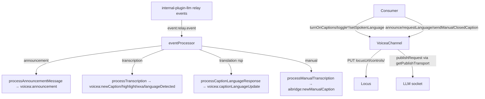
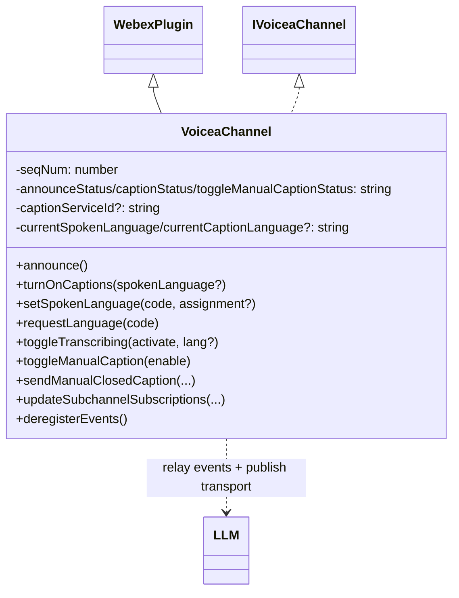
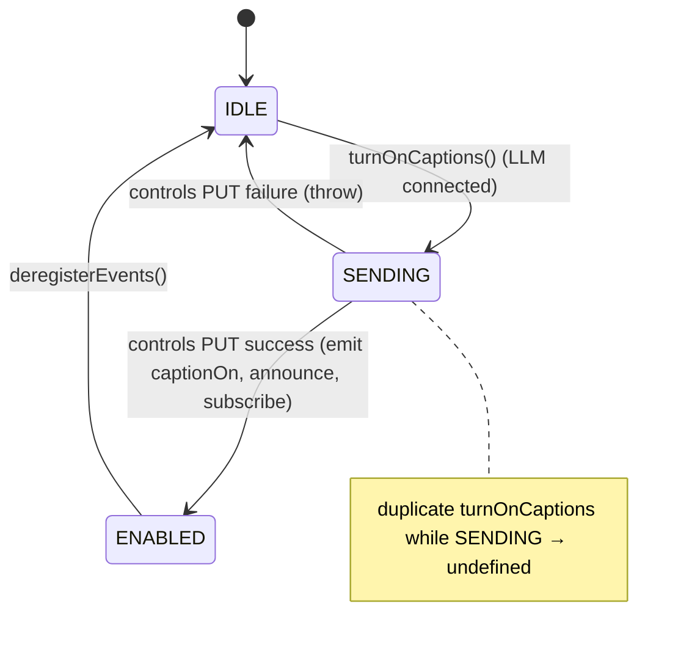

<!-- sdd-generated-metadata
generator: claude-cli
generator_model: us.anthropic.claude-opus-4-8
approved_by: pending-human-review
updated_at: 2026-08-06T00:00:00Z
validation_status: not-run
run_id: 51855eac-8de5-43a2-a3b6-dbcc55ebc91b
-->

# @webex/internal-plugin-voicea — SPEC

> Start here → root [`AGENTS.md`](../../../../AGENTS.md) (agent entry) · router [`SPEC_INDEX.md`](../../../../ai-docs/SPEC_INDEX.md) · system [`ARCHITECTURE.md`](../../../../ai-docs/ARCHITECTURE.md). This is the module's canonical spec: orientation, requirements, design, flows, state, protocol, and tests.
> Context-efficiency: link to canonical docs — don't duplicate them. Load specs on demand per `SPEC_INDEX.md`.

## Metadata

| Field | Value |
|---|---|
| Module id | `internal-plugin-voicea` |
| Source path(s) | `packages/@webex/internal-plugin-voicea/src/` |
| Parent spec | `—` (registered internal Webex plugin; composed by `webex-core`, no parent module) |
| Doc kind | Module spec |
| Coverage score | Pending coverage assessment |
| Generated from | `module-spec` @ SDLC template library `0.2.2` |
| generated_by / approved_by / updated_at | claude-cli / pending-human-review / 2026-08-06 |
| Validation status | not-run, validator `pending`, assessed 2026-08-06 |

Coverage score is `Pending coverage assessment` until the first coverage review runs. Manifest coverage
state is authoritative and kept in `.sdd/manifest.json`.

## Evidence Rules
Every requirement cites concrete source evidence using `file path`. Test evidence is preferred for WHY.
Requirements are grounded in the current TypeScript implementation under `src/` and its unit tests.

## Source Material Register

| Source material | Scope | Decision | Detail location or disposition |
|---|---|---|---|
| Package README / package.json | overview | verified | Namespace, dependencies, and usage migrated into Overview, Stack, and Requires. |
| Plugin source + types | overview / architecture / API / protocol | verified | Announcement/transcription/caption flows, LLM relay processing, event triggers, and message shapes migrated into Public Surface, Design Overview, Sequence Diagrams, State Model, and Protocol sections. |

## Overview

`@webex/internal-plugin-voicea` is an internal Webex SDK plugin registered under the `voicea` namespace
(`webex.internal.voicea`). It is the client-side channel to the **Voicea/AI Bridge** meeting-intelligence
service: it announces the client to Voicea over the LLM data channel, turns closed captions on, requests
spoken/caption (translation) languages, toggles transcribing and manual captions, sends manual captions,
and processes inbound relay events (announcements, transcriptions, translations, highlights, EVA assistant
commands) into `voicea:*`/`aibridge:*` plugin events.

The plugin (`src/voicea.ts`, a `WebexPlugin` subclass implementing `IVoiceaChannel`) subscribes to
`event:relay.event` (and the practice-session variant) on `internal-plugin-llm`, routes each message by
`relayType` in `eventProcessor`, and maintains local status state (`announceStatus`, `captionStatus`,
`toggleManualCaptionStatus`), the caption service id, current spoken/caption languages, and a monotonic
`seqNum` for outbound publish requests. Outbound control operations (`setSpokenLanguage`,
`turnOnCaptions`, `toggleTranscribing`, `toggleManualCaption`) issue `PUT {locusUrl}/controls/` requests,
while announcements/translation requests/manual captions/subchannel subscriptions are sent as LLM socket
`publishRequest`/`subchannelSubscriptionRequest` messages. A maintainer should start at `src/voicea.ts`,
`src/constants.ts`, and `src/voicea.types.ts`.

## Purpose / Responsibility

Owns the client's Voicea meeting-intelligence session: announcing, caption/transcription enablement,
spoken/caption language control, manual captions, LLM subchannel subscriptions, and translating inbound
relay events into plugin events. It does NOT own the LLM/data-channel transport (delegates to
`internal-plugin-llm`), the Mercury connection, or transcript persistence.

## Stack

TypeScript (`src/*.ts`), built with `tsc` (declarations) and `webex-legacy-tools`. Extends `WebexPlugin`
from `@webex/webex-core`; uses `uuid` and `config.trackingIdPrefix`. Unit tests run under Jest with sinon,
`MockWebex`, `MockWebSocket`, Mercury, and LLM. Node engine `>=18`.

## Folder / Package Structure

```
packages/@webex/internal-plugin-voicea/src/
├── index.ts          # registerInternalPlugin('voicea', VoiceaChannel, {}); re-exports + EVENT_TRIGGERS/TURN_ON_CAPTION_STATUS
├── voicea.ts         # VoiceaChannel: relay event processing + outbound control/publish operations
├── voicea.types.ts   # payload/response interfaces (Announcement, Transcription, Caption, IVoiceaChannel, MeetingTranscriptPayload)
├── constants.ts      # EVENT_TRIGGERS, AIBRIDGE_RELAY_TYPES, TRANSCRIPTION_TYPE, status enums, language constants
└── utils.ts          # millisToMinutesAndSeconds timestamp formatter
```

## Key Files (source of truth)

| File | Holds |
|---|---|
| `packages/@webex/internal-plugin-voicea/src/voicea.ts` | `eventProcessor` relay routing, announce/caption/language/manual-caption operations, subchannel subscriptions, status state |
| `packages/@webex/internal-plugin-voicea/src/constants.ts` | `EVENT_TRIGGERS`, `AIBRIDGE_RELAY_TYPES`, `TRANSCRIPTION_TYPE`, `ANNOUNCE_STATUS`/`TURN_ON_CAPTION_STATUS`/`TOGGLE_MANUAL_CAPTION_STATUS`, `DEFAULT_SPOKEN_LANGUAGE`, `LANGUAGE_ASSIGNMENT` |
| `packages/@webex/internal-plugin-voicea/src/voicea.types.ts` | Relay payload/response shapes and the `IVoiceaChannel` contract |
| `packages/@webex/internal-plugin-voicea/src/index.ts` | Registration name (`voicea`) and public re-exports |

## Public Surface

Internal Surface — consumed as `webex.internal.voicea`; interacts with the LLM data channel and Locus
controls, and emits `voicea:*`/`aibridge:*` events.

| Contract ID | Type | Surface | Purpose | Compatibility / deprecation | Schema / detail link | Root index |
|---|---|---|---|---|---|---|
| `voicea.announce` | SDK | `announce(): void` | Send client announcement to join Voicea (idempotent when joined) | Throws if LLM not connected | `packages/@webex/internal-plugin-voicea/src/voicea.ts` | `../../../../ai-docs/CONTRACTS.md` |
| `voicea.turnOnCaptions` | SDK | `turnOnCaptions(spokenLanguage?): Promise<void>` | Enable captions via `PUT controls/` then announce + subscribe transcription | Guards against duplicate SENDING | `packages/@webex/internal-plugin-voicea/src/voicea.ts` | `../../../../ai-docs/CONTRACTS.md` |
| `voicea.setSpokenLanguage` | SDK | `setSpokenLanguage(code, assignment?): Promise<void>` | Set meeting spoken language (`PUT controls/`) + emit update | Stable | `packages/@webex/internal-plugin-voicea/src/voicea.ts` | `../../../../ai-docs/CONTRACTS.md` |
| `voicea.requestLanguage` | SDK | `requestLanguage(code): void` | Request caption/translation language via LLM publish | No-op when LLM disconnected | `packages/@webex/internal-plugin-voicea/src/voicea.ts` | `../../../../ai-docs/CONTRACTS.md` |
| `voicea.toggleTranscribing` | SDK | `toggleTranscribing(activate, spokenLanguage?): Promise<void>` | Toggle transcribing (`PUT controls/`); turns on captions if needed | Stable | `packages/@webex/internal-plugin-voicea/src/voicea.ts` | `../../../../ai-docs/CONTRACTS.md` |
| `voicea.toggleManualCaption` | SDK | `toggleManualCaption(enable): Promise<void>` | Enable/disable manual captions (`PUT controls/`) | Guards duplicate SENDING | `packages/@webex/internal-plugin-voicea/src/voicea.ts` | `../../../../ai-docs/CONTRACTS.md` |
| `voicea.sendManualClosedCaption` | SDK | `sendManualClosedCaption(text, ts, csis, isFinal): void` | Publish a manual caption over LLM | No-op when LLM disconnected | `packages/@webex/internal-plugin-voicea/src/voicea.ts` | `../../../../ai-docs/CONTRACTS.md` |
| `voicea.updateSubchannelSubscriptions` | SDK | `({subscribe, unsubscribe}): Promise<void>` | Update LLM subchannel subscriptions | No-op unless data-channel token enabled | `packages/@webex/internal-plugin-voicea/src/voicea.ts` | `../../../../ai-docs/CONTRACTS.md` |
| `voicea.deregisterEvents` | SDK | `deregisterEvents(): void` | Unsubscribe LLM listeners and reset status state | Stable | `packages/@webex/internal-plugin-voicea/src/voicea.ts` | `../../../../ai-docs/CONTRACTS.md` |
| `voicea:newCaption` / `voicea:announcement` / `voicea:captionLanguageUpdate` / `voicea:spokenLanguageUpdate` / `voicea:captionOn` / `voicea:highlightCreated` / `voicea:wxa` / `voicea:languageDetected` / `aibridge:newManualCaption` | event | Emitted plugin events | Deliver transcripts/announcements/commands to consumers | Names in `EVENT_TRIGGERS` | `packages/@webex/internal-plugin-voicea/src/constants.ts` | `../../../../ai-docs/CONTRACTS.md` |

Compatibility notes:
- The `IVoiceaChannel` interface (`voicea.types.ts`) defines the public method contract.
- Event names and relay types are fixed constants; changing them is a breaking change for consumers/service.

## Requires (dependencies)

- `@webex/webex-core` — base `WebexPlugin`, `registerInternalPlugin`, `request`, `config` (trackingIdPrefix).
- `@webex/internal-plugin-llm` — data-channel transport: `on/off('event:relay.event')`, `isConnected`,
  `getSocket`/`getBinding`/`getDatachannelUrl`/`socket`, `getLocusUrl`, `isDataChannelTokenEnabled`, and the
  `LLM_PRACTICE_SESSION` constant.
- `@webex/internal-plugin-mercury` — underlying websocket connectivity (peer dependency of LLM).
- `uuid` — publish/tracking ids.
- External service: **Voicea / AI Bridge** (over the LLM relay) and **Locus** (`/controls/`).

## Requirements

| ID | WHAT | WHY | Source Evidence | Test / Example Evidence | Assumptions / Gaps | Confidence |
|---|---|---|---|---|---|---|
| `VOICEA-R-001` | `eventProcessor` sets `seqNum = sequenceNumber + 1` and routes by `relayType`: Voicea announcement (updates caption service id + `announceStatus=JOINED` + processes announcement), translation response, transcription, and manual transcription/captioner. | Inbound relay events must be dispatched to the right processor. | `packages/@webex/internal-plugin-voicea/src/voicea.ts`, `packages/@webex/internal-plugin-voicea/src/constants.ts` | `packages/@webex/internal-plugin-voicea/test/unit/spec/voicea.js` | none identified | PRESENT |
| `VOICEA-R-002` | `listenToEvents` subscribes once (default + practice-session relay events) guarded by `hasSubscribedToEvents`; `deregisterEvents` unsubscribes and resets caption/announce/manual status, service id, and languages. | Exactly-once subscription and clean teardown. | `packages/@webex/internal-plugin-voicea/src/voicea.ts` | `packages/@webex/internal-plugin-voicea/test/unit/spec/voicea.js` | none identified | PRESENT |
| `VOICEA-R-003` | `announce` is idempotent when already JOINED, throws if LLM not connected, else sends a `publishRequest` (CLIENT_ANNOUNCEMENT) via the resolved publish transport with `announceStatus=JOINING` and increments `seqNum`. | Joining Voicea requires a single announcement over a live LLM channel. | `packages/@webex/internal-plugin-voicea/src/voicea.ts` | `packages/@webex/internal-plugin-voicea/test/unit/spec/voicea.js` | none identified | PRESENT |
| `VOICEA-R-004` | `turnOnCaptions` returns early while SENDING, throws if LLM not connected, else `PUT {locusUrl}/controls/` `{transcribe:{caption:true}, languageCode}`; on success emits `voicea:captionOn`, sets captions enabled/`ENABLED`, announces, and subscribes to `transcription`; on failure resets to IDLE and throws. | Caption enablement is a Locus control plus transcription subscription. | `packages/@webex/internal-plugin-voicea/src/voicea.ts` | `packages/@webex/internal-plugin-voicea/test/unit/spec/voicea.js` | none identified | PRESENT |
| `VOICEA-R-005` | `setSpokenLanguage`/`toggleTranscribing`/`toggleManualCaption` issue `PUT {locusUrl}/controls/` with the appropriate body; `setSpokenLanguage` emits `voicea:spokenLanguageUpdate`; `toggleTranscribing` turns on captions when activating and captions are off; `toggleManualCaption` guards duplicate SENDING and resets status on success/failure. | Language/transcription/manual-caption control via Locus. | `packages/@webex/internal-plugin-voicea/src/voicea.ts` | `packages/@webex/internal-plugin-voicea/test/unit/spec/voicea.js` | none identified | PRESENT |
| `VOICEA-R-006` | `requestLanguage`/`sendManualClosedCaption` no-op when LLM disconnected, else send an LLM `publishRequest` (translation request / manual captioner) with a tracking id and increment `seqNum`; `requestLanguage` records `currentCaptionLanguage`. | Language requests and manual captions are LLM publishes gated on connectivity. | `packages/@webex/internal-plugin-voicea/src/voicea.ts` | `packages/@webex/internal-plugin-voicea/test/unit/spec/voicea.js` | none identified | PRESENT |
| `VOICEA-R-007` | `processTranscription` emits events by type: interim/final `voicea:newCaption` (final maps `timestamp` via `millisToMinutesAndSeconds`), `voicea:highlightCreated`, `voicea:wxa` (EVA thanks/wake/cancel), and `voicea:languageDetected` only when the language is in the announced spoken languages. | Consumers receive typed transcript/assistant/highlight events. | `packages/@webex/internal-plugin-voicea/src/voicea.ts`, `packages/@webex/internal-plugin-voicea/src/utils.ts` | `packages/@webex/internal-plugin-voicea/test/unit/spec/voicea.js` | none identified | PRESENT |
| `VOICEA-R-008` | `getPublishTransport` prefers the practice-session socket/binding/datachannel only when that session `isConnected`, else the default; `onCaptionServiceIdUpdate` re-requests the caption language when the service id changes and a caption language is set; `updateSubchannelSubscriptions` no-ops unless connected and data-channel token enabled. | Transport selection and reconnection semantics must be correct across practice/default sessions. | `packages/@webex/internal-plugin-voicea/src/voicea.ts` | `packages/@webex/internal-plugin-voicea/test/unit/spec/voicea.js` | none identified | PRESENT |

## Design Overview

`VoiceaChannel` is an event-driven bridge between the LLM data channel and higher-level meeting consumers.
Inbound, a single `eventProcessor` is subscribed once to the LLM's `event:relay.event` (and the
practice-session variant) and switches on `AIBRIDGE_RELAY_TYPES` to specialized processors that translate
service payloads into `EVENT_TRIGGERS` plugin events. Outbound, control-plane changes (spoken language,
captions, transcribing, manual captions) go through Locus `PUT .../controls/`, while data-plane messages
(announcement, translation request, manual caption, subchannel subscription) are published on the LLM
socket with a monotonically increasing `seqNum` and a tracking id.

Transport selection is centralized in `getPublishTransport`, which prefers a fully-connected practice
session over the default connection so that publishes and subscriptions target the active channel. Local
status enums (`ANNOUNCE_STATUS`, `TURN_ON_CAPTION_STATUS`, `TOGGLE_MANUAL_CAPTION_STATUS`) make operations
idempotent/guarded (e.g., no duplicate announce when JOINED, no duplicate caption enable while SENDING) and
are reset on `deregisterEvents`. The caption service id learned from the announcement is used as the `to`
header for subsequent publishes, and a service-id change re-issues the translation-language request so
captions keep flowing after reconnection.

## Data Flow



## Sequence Diagram(s)

Sequence coverage:

| Operation group | Diagram | Failure / recovery coverage |
|---|---|---|
| Enable captions | 1. turnOnCaptions | `alt` covers LLM-not-connected throw, SENDING short-circuit, and control-request failure → IDLE + throw |
| Announce (join Voicea) | 2. announce | `alt` covers already-JOINED short-circuit and not-connected throw |
| Inbound relay processing | 3. eventProcessor | Routed by relayType; `opt` covers language-detected gated on announced spoken languages |

### 1. turnOnCaptions

```mermaid
sequenceDiagram
    participant C as Consumer
    participant V as VoiceaChannel
    participant L as Locus
    C->>V: turnOnCaptions(spokenLanguage?)
    alt captionStatus == SENDING
        V-->>C: undefined
    else !LLM connected
        V-->>C: throw Error('can not turn on captions before llm connected')
    else
        V->>L: PUT {locusUrl}/controls/ {transcribe:{caption:true}, languageCode}
        alt success
            L-->>V: ok
            V->>V: emit voicea:captionOn; captions ENABLED
            V->>V: announce(); subscribe ['transcription']
            V-->>C: resolve
        else failure
            L-->>V: error
            V->>V: captionStatus = IDLE
            V-->>C: throw Error('turn on captions fail')
        end
    end
```

### 2. announce

```mermaid
sequenceDiagram
    participant C as Consumer
    participant V as VoiceaChannel
    participant S as LLM socket
    C->>V: announce()
    alt already JOINED
        V-->>C: return
    else !LLM connected
        V-->>C: throw Error('voicea can not announce before llm connected')
    else
        V->>V: announceStatus = JOINING; listenToEvents()
        V->>S: publishRequest CLIENT_ANNOUNCEMENT (to: captionServiceId?)
        V->>V: seqNum += 1
    end
```

### 3. eventProcessor (inbound)

```mermaid
sequenceDiagram
    participant L as LLM
    participant V as VoiceaChannel
    participant App as Consumer
    L->>V: relay.event {relayType, voiceaPayload}
    V->>V: seqNum = sequenceNumber + 1
    alt VOICEA.ANNOUNCEMENT
        V->>V: onCaptionServiceIdUpdate(from); announceStatus=JOINED
        V->>App: emit voicea:announcement
    else VOICEA.TRANSCRIPTION
        V->>App: emit voicea:newCaption / highlightCreated / wxa
        opt language_detected in spokenLanguages
            V->>App: emit voicea:languageDetected
        end
    else VOICEA.TRANSLATION_RESPONSE
        V->>App: emit voicea:captionLanguageUpdate
    else MANUAL.*
        V->>App: emit aibridge:newManualCaption
    end
```

## Class / Component Relationships



`VoiceaChannel` extends `WebexPlugin`, implements `IVoiceaChannel`, and depends on the LLM plugin for both
inbound relay events and the outbound publish transport.

## Use Cases

- **UC-1 Turn on captions:** consumer calls `turnOnCaptions()` → Locus control PUT → announce → subscribe
  transcription → `voicea:newCaption` events flow. Evidence:
  `packages/@webex/internal-plugin-voicea/src/voicea.ts`,
  `packages/@webex/internal-plugin-voicea/test/unit/spec/voicea.js`.
- **UC-2 Change caption language:** `requestLanguage(code)` publishes a translation request; response emits
  `voicea:captionLanguageUpdate`. Evidence: `packages/@webex/internal-plugin-voicea/src/voicea.ts`.
- **UC-3 Manual captions:** `toggleManualCaption(true)` then `sendManualClosedCaption(...)`; inbound manual
  transcripts emit `aibridge:newManualCaption`. Evidence:
  `packages/@webex/internal-plugin-voicea/src/voicea.ts`.

## State Model

The plugin holds per-session status:
- `announceStatus` ∈ `{IDLE, JOINING, JOINED}` (`ANNOUNCE_STATUS`),
- `captionStatus` ∈ `{IDLE, SENDING, ENABLED}` (`TURN_ON_CAPTION_STATUS`),
- `toggleManualCaptionStatus` ∈ `{IDLE, SENDING}` (`TOGGLE_MANUAL_CAPTION_STATUS`),
plus `areCaptionsEnabled`, `keepTranscriptionSubscribed`, `hasSubscribedToEvents`, `captionServiceId`,
`currentSpokenLanguage` (default `en`), `currentCaptionLanguage`, `spokenLanguages`, and a monotonic
`seqNum`. `deregisterEvents` resets these to their idle/undefined baselines. Evidence:
`packages/@webex/internal-plugin-voicea/src/voicea.ts`, `packages/@webex/internal-plugin-voicea/src/constants.ts`.

## State Machine



## Concurrency & Reactive Flow

The plugin is event-driven and reactive: a single `eventProcessor` handles all inbound relay events in
order (using `sequenceNumber`), and status enums plus `hasSubscribedToEvents` guard against duplicate
subscriptions/announcements/caption-enables. Outbound publishes each increment a shared `seqNum` used as the
message id, so ordering of publishes is tracked locally. `updateSubchannelSubscriptions` awaits
`isDataChannelTokenEnabled` before sending and no-ops when not connected. On a caption-service-id change the
plugin re-requests the translation language so captions continue after reconnection. Evidence:
`packages/@webex/internal-plugin-voicea/src/voicea.ts`.

## Protocol / Wire Format

- **Inbound relay** (via LLM `event:relay.event`): `{sequenceNumber, headers:{from}, data:{relayType, voiceaPayload|transcriptPayload}}`
  where `relayType` is one of `AIBRIDGE_RELAY_TYPES` (`voicea.annc`, `voicea.transl.rsp`,
  `voicea.transcription`, `aibridge.manual_transcription`, `client.manual_transcription`).
- **Outbound publish** (LLM socket): `{id: seqNum, type:'publishRequest', recipients:[{route: binding}], headers:{to?: captionServiceId}, data:{eventType:'relay.event', relayType, clientPayload|transcriptPayload}, trackingId}`.
- **Subchannel subscription**: `{id: seqNum, type:'subchannelSubscriptionRequest', data:{datachannelUri, subscribe, unsubscribe}, trackingId}`.
- **Locus control**: `PUT {locusUrl}/controls/` with `{transcribe:{...}}` / `{manualCaption:{enable}}` bodies.
- Transcription payload types are enumerated in `TRANSCRIPTION_TYPE`; transcript shapes are defined in
  `voicea.types.ts` (`Transcription`, `Highlight`, `TranscriptionResponse`, `CaptionLanguageResponse`,
  `MeetingTranscriptPayload`).

Evidence: `packages/@webex/internal-plugin-voicea/src/voicea.ts`,
`packages/@webex/internal-plugin-voicea/src/constants.ts`,
`packages/@webex/internal-plugin-voicea/src/voicea.types.ts`.

## Error Handling & Failure Modes

| Condition | Signal (error/code/result) | Caller recovery |
|---|---|---|
| `announce`/`turnOnCaptions` before LLM connected | thrown `Error(... before llm connected)` | Connect LLM first |
| Caption control PUT fails | `captionStatus=IDLE`; thrown `Error('turn on captions fail')` | Retry after resolving Locus error |
| Manual caption toggle PUT fails | `toggleManualCaptionStatus=IDLE`; thrown `Error('toggle manual captions fail')` | Retry |
| Translation-response error status | `voicea:captionLanguageUpdate` with `statusCode=errorCode` + `errorMessage` | Handle in the event listener |
| `requestLanguage`/`sendManualClosedCaption`/`updateSubchannelSubscriptions` when disconnected | silent no-op (no send) | Ensure LLM connected / data-channel token enabled |

## Pitfalls

- Many operations silently no-op when the LLM is not connected (`requestLanguage`,
  `sendManualClosedCaption`, `updateSubchannelSubscriptions`) while others throw (`announce`,
  `turnOnCaptions`) — check connectivity before calling.
- `voicea:languageDetected` fires only when the detected language is in the announced `spokenLanguages`
  list; a detection outside that set is dropped.
- `getPublishTransport` uses the practice-session channel only when it `isConnected`; otherwise it falls back
  to the default connection.
- A caption-service-id change re-issues the translation-language request; do not assume the id is stable
  across reconnects.
- `seqNum` is a shared monotonic counter used as the publish message id; concurrent publishes rely on it
  being incremented per send.

## Test-Case Strategy (module)

Unit tests (Jest + sinon + `MockWebex` + `MockWebSocket` + Mercury/LLM) exercise the event processor and
outbound operations. Coverage should include: relay routing per `relayType`; announce idempotency and
not-connected throw; `turnOnCaptions` success (emit + announce + subscribe) and failure (IDLE + throw);
control PUT bodies for language/transcribe/manual-caption; publish no-ops when disconnected; transcription
event emission per type (including the language-detected gating); and practice-vs-default transport
selection.

| Behavior / Requirement | Existing test evidence | Gap |
|---|---|---|
| `VOICEA-R-001` | `packages/@webex/internal-plugin-voicea/test/unit/spec/voicea.js` | Assert all relayType branches |
| `VOICEA-R-002` | `packages/@webex/internal-plugin-voicea/test/unit/spec/voicea.js` | Assert subscribe-once + reset |
| `VOICEA-R-003` | `packages/@webex/internal-plugin-voicea/test/unit/spec/voicea.js` | Assert idempotency + throw |
| `VOICEA-R-004` | `packages/@webex/internal-plugin-voicea/test/unit/spec/voicea.js` | Assert failure→IDLE path |
| `VOICEA-R-005` | `packages/@webex/internal-plugin-voicea/test/unit/spec/voicea.js` | Assert control bodies |
| `VOICEA-R-006` | `packages/@webex/internal-plugin-voicea/test/unit/spec/voicea.js` | Assert disconnected no-op |
| `VOICEA-R-007` | `packages/@webex/internal-plugin-voicea/test/unit/spec/voicea.js` | Assert per-type emission + language gating |
| `VOICEA-R-008` | `packages/@webex/internal-plugin-voicea/test/unit/spec/voicea.js` | Assert transport selection + token gating |

## Traceability

- Repo architecture: [`ARCHITECTURE.md`](../../../../ai-docs/ARCHITECTURE.md) · Registry: [`SPEC_INDEX.md`](../../../../ai-docs/SPEC_INDEX.md)
- Coverage state & contracts baseline: `.sdd/manifest.json`
