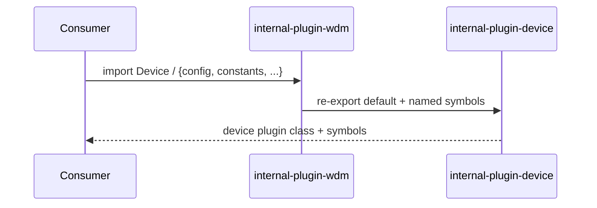
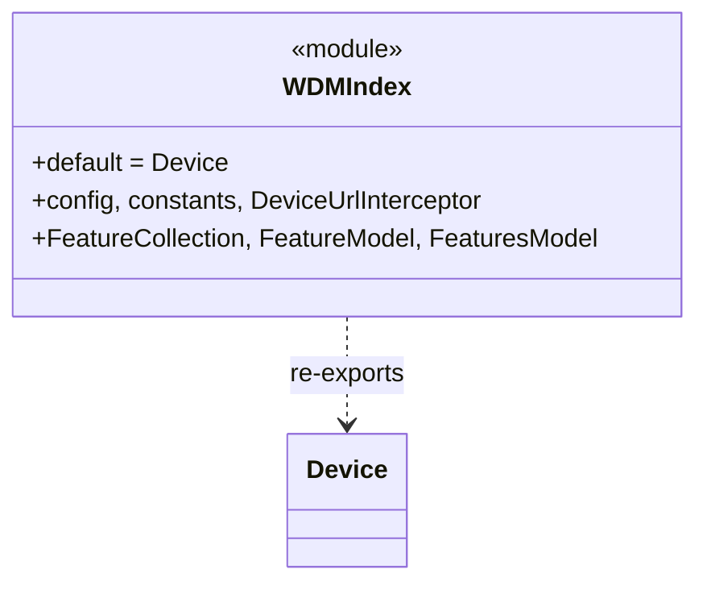

<!-- sdd-generated-metadata
generator: claude-cli
generator_model: us.anthropic.claude-opus-4-8
approved_by: pending-human-review
updated_at: 2026-08-06T00:00:00Z
validation_status: not-run
run_id: 51855eac-8de5-43a2-a3b6-dbcc55ebc91b
-->

# @webex/internal-plugin-wdm — SPEC

> Start here → root [`AGENTS.md`](../../../../AGENTS.md) (agent entry) · router [`SPEC_INDEX.md`](../../../../ai-docs/SPEC_INDEX.md) · system [`ARCHITECTURE.md`](../../../../ai-docs/ARCHITECTURE.md). This is the module's canonical spec: orientation, requirements, design, flows, and tests.
> Context-efficiency: link to canonical docs — don't duplicate them. Load specs on demand per `SPEC_INDEX.md`.

## Metadata

| Field | Value |
|---|---|
| Module id | `internal-plugin-wdm` |
| Source path(s) | `packages/@webex/internal-plugin-wdm/src/` |
| Parent spec | `—` (deprecated alias package; re-exports `@webex/internal-plugin-device`) |
| Doc kind | Module spec |
| Coverage score | Pending coverage assessment |
| Generated from | `module-spec` @ SDLC template library `0.2.2` |
| generated_by / approved_by / updated_at | claude-cli / pending-human-review / 2026-08-06 |
| Validation status | not-run, validator `pending`, assessed 2026-08-06 |

Coverage score is `Pending coverage assessment` until the first coverage review runs. Manifest coverage
state is authoritative and kept in `.sdd/manifest.json`.

## Evidence Rules
Every requirement cites concrete source evidence using `file path`. Test evidence is preferred for WHY.
Requirements are grounded in the current implementation under `src/`.

## Source Material Register

| Source material | Scope | Decision | Detail location or disposition |
|---|---|---|---|
| Package README | overview | verified | Deprecation status and alias behavior migrated into Overview, Purpose, and Pitfalls. |
| Plugin source (`index.js`) | overview / architecture / API | verified | Re-export list and delegation to `internal-plugin-device` migrated into Overview, Public Surface, and Requires. |

## Overview

`@webex/internal-plugin-wdm` is a **deprecated alias** package for the Webex Device Management (WDM)
service. It contains no behavior of its own: `src/index.js` re-exports the `Device` default export and the
named `config`, `constants`, `DeviceUrlInterceptor`, `FeatureCollection`, `FeatureModel`, and `FeaturesModel`
symbols directly from `@webex/internal-plugin-device`. Per the package README, the plugin "has been
deprecated and only acts as an alias to the `@webex/internal-plugin-device` plugin," and all new or modified
import lists should use `@webex/internal-plugin-device` instead.

Because it is a pure re-export shim, this module owns no requirements, flows, protocols, or state of its own;
its canonical behavior lives entirely in the device plugin. A maintainer should treat `src/index.js` as the
only source file and consult the `internal-plugin-device` spec for actual device/WDM behavior.

## Purpose / Responsibility

Provides backward-compatible import aliases for the device plugin under the `wdm` package name. It owns
nothing else and should not be extended; new work targets `@webex/internal-plugin-device`.

## Stack

JavaScript (ES modules, Babel-transpiled), built with `webex-legacy-tools`. No runtime logic beyond
re-exports. Node engine `>=16`. Its only meaningful dependency is `@webex/internal-plugin-device`.

## Folder / Package Structure

```
packages/@webex/internal-plugin-wdm/src/
└── index.js   # re-exports Device (default) and named symbols from @webex/internal-plugin-device
```

## Key Files (source of truth)

| File | Holds |
|---|---|
| `packages/@webex/internal-plugin-wdm/src/index.js` | The complete module: default + named re-exports from `@webex/internal-plugin-device` |
| `packages/@webex/internal-plugin-wdm/README.md` | Deprecation notice directing consumers to `@webex/internal-plugin-device` |

## Public Surface

Internal Surface — this package's surface is exactly the re-exported device symbols. All real behavior and
schemas are owned by `@webex/internal-plugin-device`.

| Contract ID | Type | Surface | Purpose | Compatibility / deprecation | Schema / detail link | Root index |
|---|---|---|---|---|---|---|
| `wdm.default` | SDK | `default` export (`Device`) | Re-export of the device plugin class | **Deprecated**; use `@webex/internal-plugin-device` | `packages/@webex/internal-plugin-wdm/src/index.js` | `../../../../ai-docs/CONTRACTS.md` |
| `wdm.config` | SDK | named export `config` | Re-export of device config | Deprecated alias | `packages/@webex/internal-plugin-wdm/src/index.js` | `../../../../ai-docs/CONTRACTS.md` |
| `wdm.constants` | SDK | named export `constants` | Re-export of device constants | Deprecated alias | `packages/@webex/internal-plugin-wdm/src/index.js` | `../../../../ai-docs/CONTRACTS.md` |
| `wdm.DeviceUrlInterceptor` | SDK | named export | Re-export of device URL interceptor | Deprecated alias | `packages/@webex/internal-plugin-wdm/src/index.js` | `../../../../ai-docs/CONTRACTS.md` |
| `wdm.FeatureCollection` / `wdm.FeatureModel` / `wdm.FeaturesModel` | SDK | named exports | Re-export of device feature models | Deprecated alias | `packages/@webex/internal-plugin-wdm/src/index.js` | `../../../../ai-docs/CONTRACTS.md` |

Compatibility notes:
- The alias preserves the historical `webex.internal.wdm` / import surface; it registers nothing itself —
  the device plugin performs registration.
- The set of re-exported names is the entire contract; adding behavior here is discouraged (deprecated).

## Requires (dependencies)

- `@webex/internal-plugin-device` — the actual WDM/device plugin whose default and named exports are
  re-exported. All behavior, requests, and state belong to that package.
- `@webex/webex-core` — transitive base for the device plugin (declared dependency).

## Requirements

| ID | WHAT | WHY | Source Evidence | Test / Example Evidence | Assumptions / Gaps | Confidence |
|---|---|---|---|---|---|---|
| `WDM-R-001` | The package re-exports `@webex/internal-plugin-device`'s default (`Device`) as its own default export. | Preserve backward-compatible imports of the device plugin under the `wdm` name. | `packages/@webex/internal-plugin-wdm/src/index.js` | None found | none identified | PRESENT |
| `WDM-R-002` | The package re-exports the named symbols `config`, `constants`, `DeviceUrlInterceptor`, `FeatureCollection`, `FeatureModel`, `FeaturesModel` from the device plugin. | Consumers relying on these names via `wdm` continue to work. | `packages/@webex/internal-plugin-wdm/src/index.js` | None found | none identified | PRESENT |
| `WDM-R-003` | The package is deprecated and adds no behavior of its own; new/modified imports should target `@webex/internal-plugin-device`. | Direct future work to the canonical device plugin. | `packages/@webex/internal-plugin-wdm/README.md`, `packages/@webex/internal-plugin-wdm/src/index.js` | None found | none identified | PRESENT |

## Design Overview

There is no internal design beyond module re-export. `src/index.js` imports the device plugin's default and
named exports and immediately re-exports them, making `@webex/internal-plugin-wdm` a thin compatibility
façade. This keeps a single canonical implementation (the device plugin) while allowing legacy consumers to
keep importing `wdm`. Any behavior change must be made in `@webex/internal-plugin-device`; this package
should not diverge.

## Data Flow

```mermaid
flowchart TB
  Consumer -->|import '@webex/internal-plugin-wdm'| WDM[wdm/index.js re-export shim]
  WDM -->|Device + named exports| Device[@webex/internal-plugin-device]
  Device -->|actual WDM behavior| Consumer
```

## Sequence Diagram(s)

This is a trivial pass-through/re-export module with a single operation group (import resolution); one
sequence diagram is sufficient.

Sequence coverage:

| Operation group | Diagram | Failure / recovery coverage |
|---|---|---|
| Import resolution / re-export | 1. Alias import | No runtime failure path — module only re-exports; behavior/errors belong to the device plugin |

### 1. Alias import



## Class / Component Relationships



`WDMIndex` (the `index.js` module) simply forwards the device plugin's exports; there is no class of its own.

## Use Cases

- **UC-1 Legacy alias import:** a consumer imports `@webex/internal-plugin-wdm` and receives the device
  plugin's default and named exports. Evidence: `packages/@webex/internal-plugin-wdm/src/index.js`.
- **UC-2 Migration guidance:** a maintainer reading the README is directed to switch to
  `@webex/internal-plugin-device`. Evidence: `packages/@webex/internal-plugin-wdm/README.md`.

## Pitfalls

- This package is **deprecated**; do not add new behavior here. Modify `@webex/internal-plugin-device`
  instead and let the alias forward it.
- The re-export list is the only contract — importing a device symbol not re-exported here will fail; add it
  to the device plugin and, only if strictly necessary for compatibility, to this re-export list.
- Do not duplicate device documentation here; consult the `internal-plugin-device` spec for actual behavior.

## Test-Case Strategy (module)

There is no behavior to unit test beyond import resolution. A minimal smoke test could assert that the
default export and each named export are defined and identical to the corresponding
`@webex/internal-plugin-device` export. Substantive device behavior is tested in the device plugin's own
suite.

| Behavior / Requirement | Existing test evidence | Gap |
|---|---|---|
| `WDM-R-001` | None found | Add a smoke test asserting default === device default |
| `WDM-R-002` | None found | Add a smoke test asserting each named export is forwarded |
| `WDM-R-003` | None found | No behavior to test; covered by README/deprecation |

## Traceability

- Repo architecture: [`ARCHITECTURE.md`](../../../../ai-docs/ARCHITECTURE.md) · Registry: [`SPEC_INDEX.md`](../../../../ai-docs/SPEC_INDEX.md)
- Coverage state & contracts baseline: `.sdd/manifest.json`
- Canonical behavior: `@webex/internal-plugin-device` (see its module spec)
