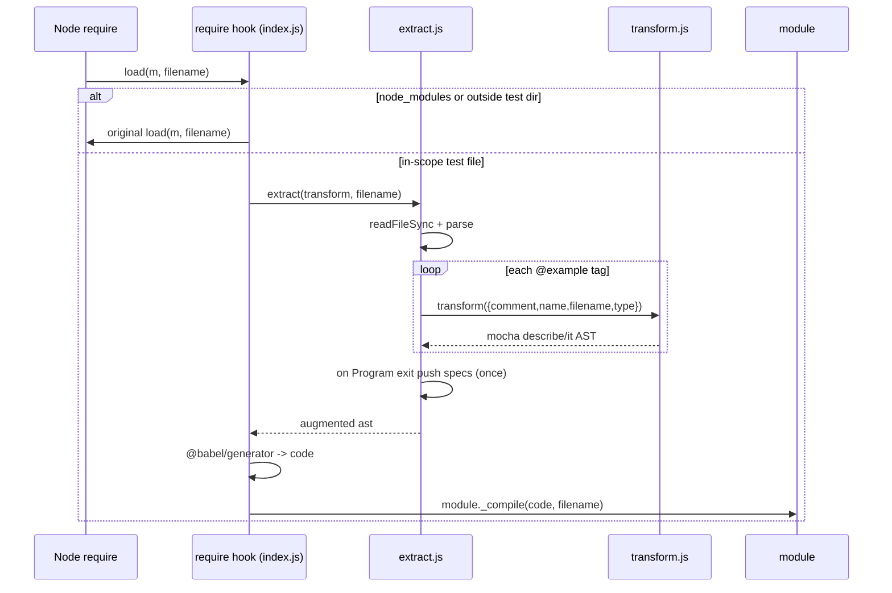
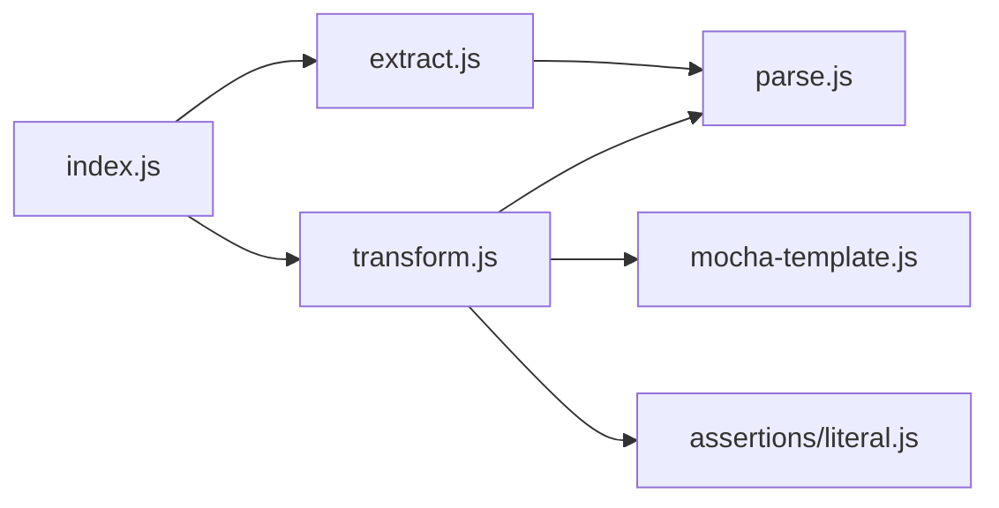

<!-- sdd-generated-metadata
generator: claude-cli
generator_model: us.anthropic.claude-opus-4-8
approved_by: pending-human-review
updated_at: 2026-08-06T00:00:00Z
validation_status: not-run
run_id: 51855eac-8de5-43a2-a3b6-dbcc55ebc91b
-->

# @webex/jsdoctrinetest — SPEC

> Start here → root [`AGENTS.md`](../../../../AGENTS.md) (agent entry) · router [`SPEC_INDEX.md`](../../../../ai-docs/SPEC_INDEX.md) · system [`ARCHITECTURE.md`](../../../../ai-docs/ARCHITECTURE.md). This is the module's canonical spec: orientation, requirements, design, flows, and tests.
> Context-efficiency: link to canonical docs — don't duplicate them. Load specs on demand per `SPEC_INDEX.md`.

## Metadata

| Field | Value |
|---|---|
| Module id | `jsdoctrinetest` |
| Source path(s) | `packages/@webex/jsdoctrinetest/src/` |
| Parent spec | `—` (workspace test-tooling package, no parent module) |
| Doc kind | Module spec |
| Coverage score | Pending coverage assessment |
| Generated from | `module-spec` @ SDLC template library `0.2.2` |
| generated_by / approved_by / updated_at | claude-cli / pending-human-review / 2026-08-06 |
| Validation status | not-run, validator `pending`, assessed 2026-08-06 |

Coverage score is `Pending coverage assessment` until the first coverage review runs. Manifest coverage
state (`Partial`) is authoritative and kept in `.sdd/manifest.json`.

## Evidence Rules
Every requirement cites concrete source evidence using `file path`. Test evidence is preferred for WHY.
Requirements are grounded in the current implementation under `src/`.

## Source Material Register

| Source material | Scope | Decision | Detail location or disposition |
|---|---|---|---|
| N/A | none | none | No prior AI-docs existed for this package; content is derived directly from `src/`. |

## Overview

`@webex/jsdoctrinetest` is a build/test-tooling package that turns `@example` blocks in JSDoc comments
into executable Mocha specs. It hooks Node's `require('.js')` extension so that, while running under the
repo's legacy test runner, every non-`node_modules` source file loaded from the test directory is
re-compiled through a Babel pipeline that extracts documented examples and injects generated
`describe`/`it` test cases into the module body.

The package is deliberately small and pipeline-shaped: `index.js` installs the require hook;
`extract.js` walks the AST and pulls `@example` descriptions out of JSDoc; `transform.js` converts each
example (and its trailing-comment assertions) into a runnable test AST; `mocha-template.js` wraps that
test AST in Mocha `describe`/`it` blocks; `parse.js` centralizes Babylon parser configuration; and the
`assertions/` directory holds assertion builders (currently the literal-comparison assertion). A
maintainer should start at `src/index.js` and follow the `extract → transform → mocha-template` chain.

Because it rewrites source at load time via `module._compile`, this package only runs in a Node test
process and is never shipped to browsers or bundled into the SDK runtime.

## Purpose / Responsibility

Owns the conversion of JSDoc `@example` blocks into executable Mocha tests via a Node require-extension
hook. It does NOT own the test runner itself, assertion libraries beyond its own literal builder, or any
Webex SDK runtime behavior.

## Stack

JavaScript (ES modules, Babel-compiled). Core dependencies: `babylon` (parsing), `doctrine` (JSDoc tag
parsing), `@babel/traverse`/`@babel/types`/`@babel/template`/`@babel/generator` (AST manipulation and
code generation), and `lodash`. Built with `webex-legacy-tools build`; tested with `webex-legacy-tools
test` (jest for unit, karma for browser). Evidence: `packages/@webex/jsdoctrinetest/package.json`.

## Folder / Package Structure

```
packages/@webex/jsdoctrinetest/src/
├── index.js            # installs require('.js') hook; compiles injected specs into each module
├── extract.js          # reads a file, parses it, pulls @example descriptions from JSDoc, injects results
├── transform.js        # converts one example + trailing-comment assertions into a test-case AST
├── mocha-template.js   # wraps a test-case AST in describe()/it() Mocha blocks
├── parse.js            # Babylon parse() wrapper with the shared plugin/sourceType defaults
└── assertions/
    └── literal.js      # literal-comparison assertion builder + matcher (build/test exports)
```

## Key Files (source of truth)

| File | Holds |
|---|---|
| `packages/@webex/jsdoctrinetest/src/index.js` | The `require.extensions['.js']` hook logic and `node_modules` exclusion rule |
| `packages/@webex/jsdoctrinetest/src/parse.js` | The authoritative Babylon parser options (sourceType, enabled plugins) |
| `packages/@webex/jsdoctrinetest/src/extract.js` | JSDoc `@example` extraction and `isJSDocComment` detection |
| `packages/@webex/jsdoctrinetest/src/assertions/literal.js` | Literal assertion `build`/`test` contract used by `transform.js` |

## Public Surface

Internal Surface — internal use only. This package is consumed by the workspace test harness by being
loaded (its `index.js` side-effect installs the require hook); it exposes no stable SDK API to
application consumers.

| Contract ID | Type | Surface | Purpose | Compatibility / deprecation | Schema / detail link | Root index |
|---|---|---|---|---|---|---|
| `jsdoctrinetest.enableSpecInjection` | SDK | side-effect on `import`/`require` of the package entry | Install the `require('.js')` hook that injects example-derived specs | Internal test tooling; not semver-guaranteed for external use | `packages/@webex/jsdoctrinetest/src/index.js` | `../../../../ai-docs/CONTRACTS.md` |
| `jsdoctrinetest.extract` | SDK | `extract(transform, filename): ast` | Extract `@example` blocks from a file and inject transformed results | Internal | `packages/@webex/jsdoctrinetest/src/extract.js` | `../../../../ai-docs/CONTRACTS.md` |
| `jsdoctrinetest.transform` | SDK | `transform({comment, name, filename, type}): ast` | Turn one example into a Mocha test-case AST | Internal | `packages/@webex/jsdoctrinetest/src/transform.js` | `../../../../ai-docs/CONTRACTS.md` |

Compatibility notes:
- This is internal test tooling; its function signatures are not part of the published SDK contract.

## Requires (dependencies)

- `babylon` — parses source and example code into a Babel-compatible AST (`src/parse.js`).
- `doctrine` — parses JSDoc comment bodies into structured tags (`src/extract.js`).
- `@babel/traverse`, `@babel/types`, `@babel/template`, `@babel/generator` — AST traversal, node
  predicates, templated code construction, and code generation (`src/extract.js`, `src/transform.js`,
  `src/mocha-template.js`, `src/index.js`).
- `lodash` — `defaults` for parser options (`src/parse.js`).
- Node runtime — `fs.readFileSync`, `require.extensions`, and `module._compile` (`src/extract.js`,
  `src/index.js`). No external network services.

## Requirements

| ID | WHAT | WHY | Source Evidence | Test / Example Evidence | Assumptions / Gaps | Confidence |
|---|---|---|---|---|---|---|
| `JSDOCTRINETEST-R-001` | `enableSpecInjection` overrides `require.extensions['.js']` so files loaded from the first-seen test directory are compiled through `inject`, while `node_modules` files (excluding `packages/node_modules`) fall through to the original loader. | Only test-target files should be rewritten; dependencies must load normally to avoid breaking them. | `packages/@webex/jsdoctrinetest/src/index.js` | None found | The "first dirname wins" scoping is described in-code as "really janky"; relies on Mocha load order | PRESENT |
| `JSDOCTRINETEST-R-002` | `inject` generates code from the extracted/transformed AST with `compact:false, quotes:'single'` and compiles it into the module via `module._compile`; it logs filename+code when `JSDOCTRINETEST_VERBOSE` is set. | The rewritten module must run in place of the original so injected specs execute. | `packages/@webex/jsdoctrinetest/src/index.js` | None found | none identified | PRESENT |
| `JSDOCTRINETEST-R-003` | `extract` reads the file, parses it, and for every leading JSDoc comment (single leading asterisk, not a `/* */` block) parses tags via `doctrine`; each `@example` tag description is passed to `transform` and the results are appended once to the Program body on exit. | Documented examples become tests attached to the compiled module. | `packages/@webex/jsdoctrinetest/src/extract.js` | None found | `getNodeName` throws if a node has neither `id` nor `key` | PRESENT |
| `JSDOCTRINETEST-R-004` | `transform` parses the example, converts each trailing comment into an assertion via `makeAsserter`, wraps the example in `Promise.resolve(ORIGINAL).then(result => ASSERTIONS)` when assertions exist, and returns a Mocha spec built by `generateSpec`. | Example code plus its expected-output comments must become an awaited, asserted test. | `packages/@webex/jsdoctrinetest/src/transform.js`, `packages/@webex/jsdoctrinetest/src/mocha-template.js` | None found | `makeAsserter` returns `null` for non-literal comments | PRESENT |
| `JSDOCTRINETEST-R-005` | `parse` calls Babylon with `sourceType:'module'`, `allowImportExportEverywhere:true`, and a fixed plugin list (jsx, flow, decorators, classProperties, objectRestSpread, async generators, etc.), applied via lodash `defaults` so caller options win. | Source and example snippets across the SDK use modern/experimental syntax that must parse. | `packages/@webex/jsdoctrinetest/src/parse.js` | None found | none identified | PRESENT |
| `JSDOCTRINETEST-R-006` | `generateSpec` wraps a test-case AST in `describe(<filename>)` → `it(<name>[()])`, appending `()` to the `it` label when the node type includes "function". | Generated tests must be attributable to their source file and symbol. | `packages/@webex/jsdoctrinetest/src/mocha-template.js` | None found | none identified | PRESENT |

## Design Overview

The package is a load-time source transformer. `enableSpecInjection` captures the existing `.js` loader
and installs a replacement. The replacement records the first file's directory as the active test
directory and only rewrites files inside it, so unrelated modules and dependencies are loaded normally.
For an in-scope file, `inject` runs the extract→transform pipeline, generates code, and calls
`module._compile` to run the augmented module.

`extract` uses `@babel/traverse` to visit every node, filters leading comments to true JSDoc blocks
(single leading asterisk, not a plain block comment), and uses `doctrine` to parse tags. Each `@example`
description is handed to the injected `transform` callback together with the node's name, filename, and
type. Results are pushed into the Program body exactly once on Program `exit` (guarded by a `done` flag)
so examples become sibling statements executed after the module loads.

`transform` re-parses each example into its own AST, converts trailing comments (the `// => value`
convention) into assertions through the pluggable assertion builders, and — when any assertion exists —
rewrites the example expression into a `Promise.resolve(...).then(...)` so both synchronous and
Promise-returning examples are asserted uniformly. `mocha-template` then wraps the result in
`describe`/`it`. `parse` centralizes Babylon configuration so both the source file and example snippets
parse with the same modern-syntax plugin set.

## Data Flow

```mermaid
flowchart TB
  Req[require a .js test-target file] --> Hook[require.extensions hook - index.js]
  Hook -->|node_modules| Orig[original .js loader]
  Hook -->|in test dir| Inject[inject]
  Inject --> Extract[extract.js: read + parse + doctrine]
  Extract -->|each @example| Transform[transform.js]
  Transform --> Tmpl[mocha-template.js: describe/it]
  Tmpl --> Results[test-case ASTs]
  Results --> Extract
  Extract -->|Program exit: push specs| AST[augmented AST]
  Inject -->|@babel/generator| Code[generated code]
  Code -->|module._compile| Mod[running module + injected specs]
```

## Sequence Diagram(s)

This module has a single primary operation group (compile one in-scope file into a spec-augmented
module); the require-hook routing and the extract/transform pipeline share the same actors and ordering,
so one sequence diagram with a branch for the `node_modules` fall-through is sufficient.

Sequence coverage:

| Operation group | Diagram | Failure / recovery coverage |
|---|---|---|
| Load + inject specs for a required file | 1. Require-hook spec injection | `alt` covers node_modules/out-of-dir fall-through; `getNodeName` throw path noted |

### 1. Require-hook spec injection



## Class / Component Relationships



The package has no classes; it is a set of pure functions plus one side-effecting installer
(`enableSpecInjection`). `index.js` composes `extract` (passing `transform` as a callback), and
`transform` composes `parse`, `mocha-template`, and the literal assertion builder.

## Use Cases

- **UC-1 Run documented examples as tests:** the test runner requires a source file → the hook detects
  it is in the test directory → examples are extracted, transformed to `describe`/`it`, and compiled
  into the module → Mocha executes them. Evidence: `packages/@webex/jsdoctrinetest/src/index.js`,
  `packages/@webex/jsdoctrinetest/src/extract.js`.
- **UC-2 Assert example output:** an example ends with a trailing `// => value` comment → `makeAsserter`
  builds a literal assertion → the example is wrapped in `Promise.resolve(...).then(...)` and asserted.
  Evidence: `packages/@webex/jsdoctrinetest/src/transform.js`,
  `packages/@webex/jsdoctrinetest/src/assertions/literal.js`.
- **UC-3 Debug generated tests:** set `JSDOCTRINETEST_VERBOSE` → the hook logs each filename and its
  generated code. Evidence: `packages/@webex/jsdoctrinetest/src/index.js`.

## Concurrency & Reactive Flow

Execution is synchronous during module load: `fs.readFileSync` and `module._compile` run inline within
the require hook. The only asynchrony is inside generated tests, where examples are wrapped in
`Promise.resolve(...).then(...)` so Promise-returning examples resolve before assertions run. There is
one piece of mutable module state — the captured `dir` (first-seen test directory) — which is set once
and thereafter only read. Evidence: `packages/@webex/jsdoctrinetest/src/index.js`,
`packages/@webex/jsdoctrinetest/src/transform.js`.

## Error Handling & Failure Modes

| Condition | Signal (error/code/result) | Caller recovery |
|---|---|---|
| AST node has neither `id` nor `key` when naming a spec | `throw new Error('Could not find name for node')` | Ensure documented `@example` blocks attach to named functions/methods |
| Non-literal trailing comment in an example | `makeAsserter` returns `null` (no assertion added) | Use the supported literal `// => value` form for assertions |
| Plain block comment (`/* ... */`) or multi-asterisk banner | Ignored by `isJSDocComment` (not treated as JSDoc) | Use single-asterisk `/** ... */` JSDoc for examples |

## Pitfalls

- The require hook rewrites only files under the *first* directory it sees; loading order (driven by
  Mocha) determines scope. The code itself calls this "really janky" — do not rely on it for files
  outside the initial test directory. Evidence: `packages/@webex/jsdoctrinetest/src/index.js`.
- `node_modules` is excluded, but `packages/node_modules` is deliberately NOT excluded, so workspace
  symlinked packages can still be rewritten. Evidence: `packages/@webex/jsdoctrinetest/src/index.js`.
- Only single-asterisk JSDoc comments are parsed; banner comments and plain block comments are skipped.
  Evidence: `packages/@webex/jsdoctrinetest/src/extract.js`.
- Assertions are appended once on Program `exit`; the `done` guard prevents duplicate injection if the
  visitor fires again. Evidence: `packages/@webex/jsdoctrinetest/src/extract.js`.

## Test-Case Strategy (module)

Unit tests should exercise the pure functions directly: `parse` returns a module-type AST for modern
syntax (positive) and honors caller overrides; `extract` finds `@example` tags and skips non-JSDoc
comments (negative); `transform`/`mocha-template` emit a `describe`/`it` structure and append `()` for
function-typed nodes; and the literal assertion builder in `assertions/literal.js` builds an assertion
for `// => value` comments and returns none otherwise. The require-hook behavior in `index.js` is best
covered by an integration test that loads a fixture file and asserts the injected spec runs.

| Behavior / Requirement | Existing test evidence | Gap |
|---|---|---|
| `JSDOCTRINETEST-R-001` | `packages/@webex/jsdoctrinetest/test/` | Add coverage for node_modules vs packages/node_modules routing |
| `JSDOCTRINETEST-R-002` | `packages/@webex/jsdoctrinetest/test/` | Add verbose-logging and `module._compile` integration case |
| `JSDOCTRINETEST-R-003` | `packages/@webex/jsdoctrinetest/test/` | Add JSDoc-detection negative cases |
| `JSDOCTRINETEST-R-004` | `packages/@webex/jsdoctrinetest/test/` | Add Promise-wrapping + null-assertion cases |
| `JSDOCTRINETEST-R-005` | `packages/@webex/jsdoctrinetest/test/` | Assert plugin list and option-override precedence |
| `JSDOCTRINETEST-R-006` | `packages/@webex/jsdoctrinetest/test/` | Assert `()` suffix only for function types |

## Traceability

- Repo architecture: [`ARCHITECTURE.md`](../../../../ai-docs/ARCHITECTURE.md) · Registry: [`SPEC_INDEX.md`](../../../../ai-docs/SPEC_INDEX.md)
- Coverage state & contracts baseline: `.sdd/manifest.json`
