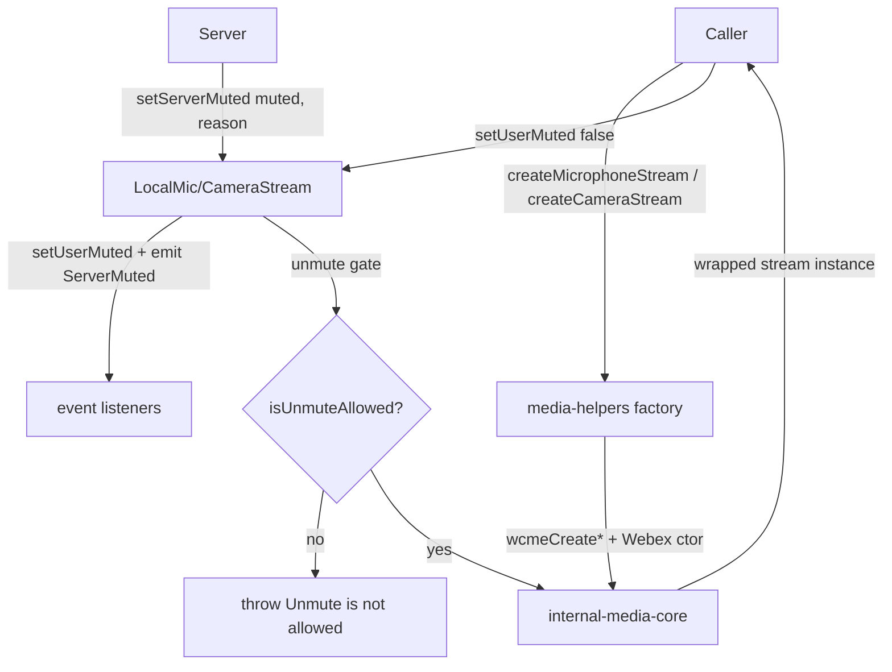
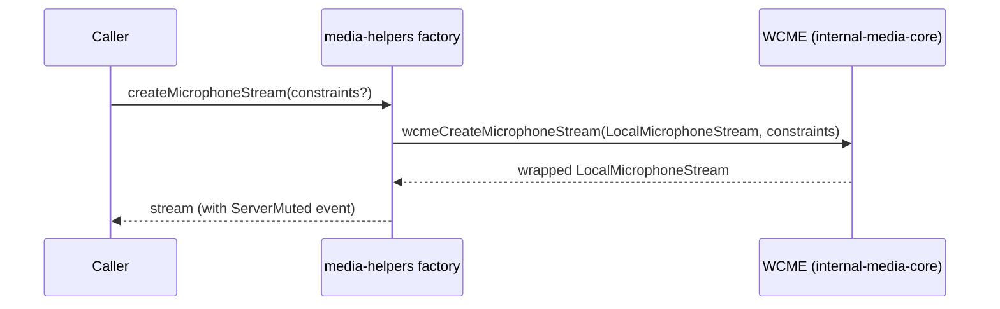
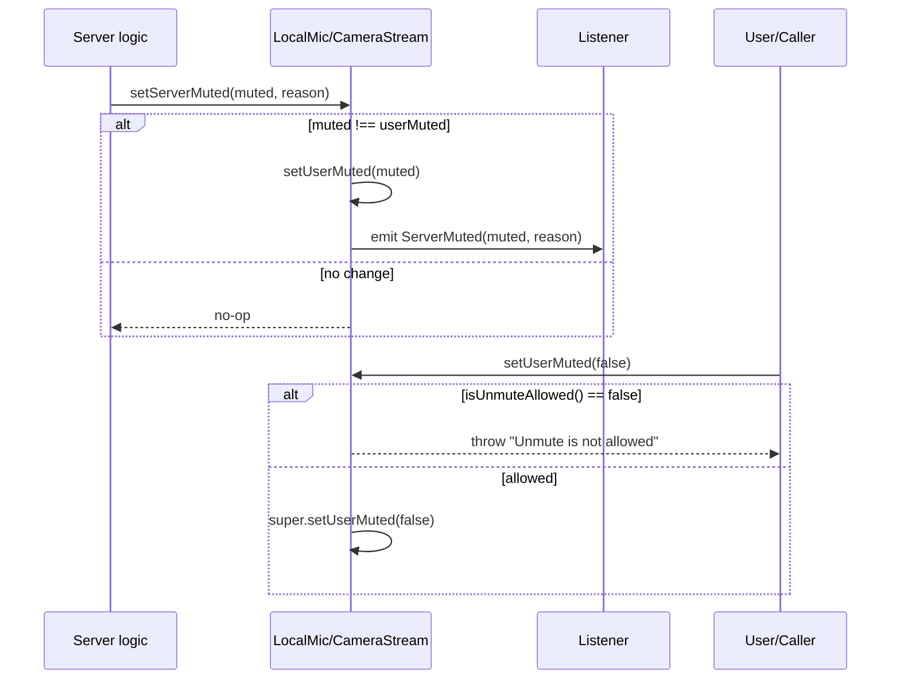
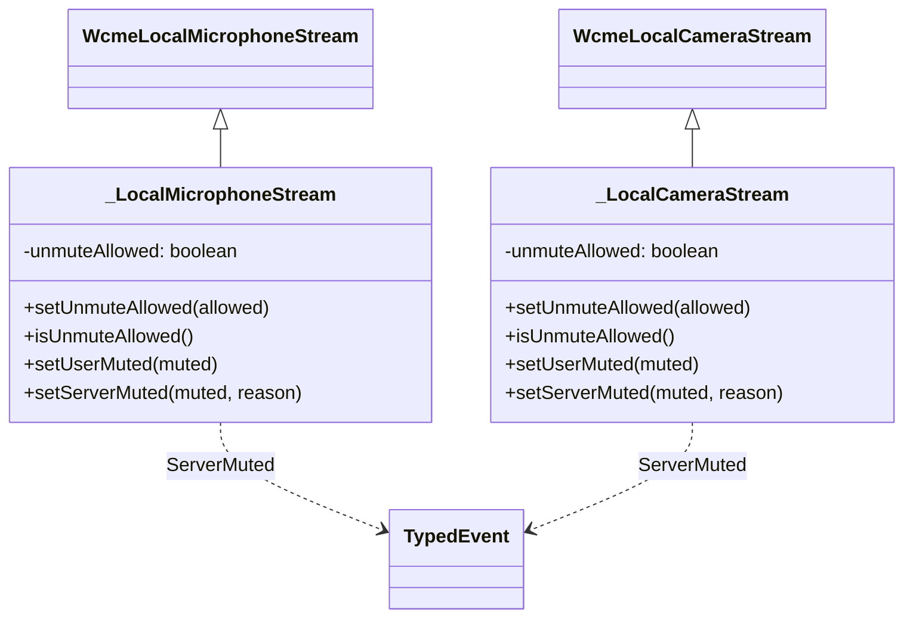

<!-- sdd-generated-metadata
generator: claude-cli
generator_model: us.anthropic.claude-opus-4-8
approved_by: pending-human-review
updated_at: 2026-08-06T00:00:00Z
validation_status: not-run
run_id: 51855eac-8de5-43a2-a3b6-dbcc55ebc91b
-->

# @webex/media-helpers — SPEC

> Start here → root [`AGENTS.md`](../../../../AGENTS.md) (agent entry) · router [`SPEC_INDEX.md`](../../../../ai-docs/SPEC_INDEX.md) · system [`ARCHITECTURE.md`](../../../../ai-docs/ARCHITECTURE.md). This is the module's canonical spec: orientation, requirements, design, flows, state, and tests.
> Context-efficiency: link to canonical docs — don't duplicate them. Load specs on demand per `SPEC_INDEX.md`.

## Metadata

| Field | Value |
|---|---|
| Module id | `media-helpers` |
| Source path(s) | `packages/@webex/media-helpers/src/` |
| Parent spec | `—` (support package consumed by plugins such as `plugin-meetings`, no parent module) |
| Doc kind | Module spec |
| Coverage score | Pending coverage assessment |
| Generated from | `module-spec` @ SDLC template library `0.2.2` |
| generated_by / approved_by / updated_at | claude-cli / pending-human-review / 2026-08-06 |
| Validation status | not-run, validator `pending`, assessed 2026-08-06 |

Coverage score is `Pending coverage assessment` until the first coverage review runs. Manifest coverage
state (`Partial`) is authoritative and kept in `.sdd/manifest.json`.

## Evidence Rules
Every requirement cites concrete source evidence using `file path`. Test evidence is preferred for WHY.
Requirements are grounded in the current TypeScript implementation under `src/` and its unit tests.

## Source Material Register

| Source material | Scope | Decision | Detail location or disposition |
|---|---|---|---|
| N/A | none | none | No prior AI-docs existed for this package; content is derived directly from `src/` and tests. |

## Overview

`@webex/media-helpers` provides thin wrappers over `@webex/internal-media-core` (WCME) local media
streams so the SDK can layer Webex-specific server-mute semantics on top of WebRTC camera and microphone
streams. It re-exports the WCME stream classes, factory functions, and types largely unchanged, and adds
two subclasses — `LocalMicrophoneStream` and `LocalCameraStream` — that introduce a server-mute event and
an "unmute allowed" gate.

The package also re-exports media-effect classes and types from `@webex/web-media-effects`
(noise reduction, virtual background) and a small set of local constants (`FacingMode`,
`DisplaySurface`, `PresetCameraConstraints`). The public entry point is `src/index.ts`, which is a curated
barrel; the substantive logic lives in `src/webrtc-core.ts`. A maintainer should start at
`src/webrtc-core.ts`.

The Webex additions are intentionally minimal: they wrap WCME's `setUserMuted` to enforce an
unmute-allowed policy and emit a typed `muted:byServer` event when the server drives a mute/unmute state
change. Everything else is delegated to WCME.

## Purpose / Responsibility

Owns Webex-specific extensions to WCME local camera/microphone streams — server-mute events and the
unmute-allowed gate — and the curated re-export surface for streams, media effects, and camera
constants. It does NOT own the underlying WebRTC capture, encoding, or effect implementations (those
live in `@webex/internal-media-core` and `@webex/web-media-effects`).

## Stack

TypeScript, compiled with `tsc` (declarations emitted to `dist`) and `webex-legacy-tools`. Uses
`@webex/ts-events` for typed events. Unit tests run under Jest with `@webex/test-helper-chai`,
`@webex/test-helper-mock-webex`, `sinon`, and `jsdom-global`. Runtime dependencies:
`@webex/internal-media-core`, `@webex/web-media-effects`, `@webex/ts-events`. Evidence:
`packages/@webex/media-helpers/package.json`.

## Folder / Package Structure

```
packages/@webex/media-helpers/src/
├── index.ts         # curated barrel: re-exports streams/factories/types, effects, and constants
├── webrtc-core.ts   # LocalMicrophoneStream/LocalCameraStream subclasses, factory wrappers, ServerMuteReason
└── constants.ts     # FacingMode, DisplaySurface, PresetCameraConstraints enums/table
```

## Key Files (source of truth)

| File | Holds |
|---|---|
| `packages/@webex/media-helpers/src/webrtc-core.ts` | The stream subclasses, server-mute event names, `ServerMuteReason` union, and stream factory wrappers |
| `packages/@webex/media-helpers/src/constants.ts` | `PresetCameraConstraints` resolution table and `FacingMode`/`DisplaySurface` enums |
| `packages/@webex/media-helpers/src/index.ts` | The exact public export surface (which WCME/effects symbols are re-exported) |

## Public Surface

Consumed as an imported SDK support package (`@webex/media-helpers`). No network API.

| Contract ID | Type | Surface | Purpose | Compatibility / deprecation | Schema / detail link | Root index |
|---|---|---|---|---|---|---|
| `media-helpers.LocalMicrophoneStream` | SDK | `class LocalMicrophoneStream` (+`ServerMuted` event) | Microphone stream with server-mute + unmute-allowed gate | Stable export; event added on top of WCME | `packages/@webex/media-helpers/src/webrtc-core.ts` | `../../../../ai-docs/CONTRACTS.md` |
| `media-helpers.LocalCameraStream` | SDK | `class LocalCameraStream` (+`ServerMuted` event) | Camera stream with server-mute + unmute-allowed gate | Stable export | `packages/@webex/media-helpers/src/webrtc-core.ts` | `../../../../ai-docs/CONTRACTS.md` |
| `media-helpers.createMicrophoneStream` | SDK | `createMicrophoneStream(constraints?)` | Create a wrapped microphone stream | Stable factory | `packages/@webex/media-helpers/src/webrtc-core.ts` | `../../../../ai-docs/CONTRACTS.md` |
| `media-helpers.createCameraStream` | SDK | `createCameraStream(constraints?)` | Create a wrapped camera stream | Stable factory | `packages/@webex/media-helpers/src/webrtc-core.ts` | `../../../../ai-docs/CONTRACTS.md` |
| `media-helpers.createCameraAndMicrophoneStreams` | SDK | `createCameraAndMicrophoneStreams({video?,audio?})` | Create both wrapped streams together | Stable factory | `packages/@webex/media-helpers/src/webrtc-core.ts` | `../../../../ai-docs/CONTRACTS.md` |
| `media-helpers.createDisplayStream` | SDK | `createDisplayStream(videoContentHint?)` | Create a display (screen-share) stream | Stable factory | `packages/@webex/media-helpers/src/webrtc-core.ts` | `../../../../ai-docs/CONTRACTS.md` |
| `media-helpers.createDisplayStreamWithAudio` | SDK | `createDisplayStreamWithAudio(videoContentHint?)` | Display stream plus system audio | Stable factory | `packages/@webex/media-helpers/src/webrtc-core.ts` | `../../../../ai-docs/CONTRACTS.md` |
| `media-helpers.createDisplayMedia` | SDK | `createDisplayMedia(options)` | Display capture with granular video/audio surface options | Stable factory | `packages/@webex/media-helpers/src/webrtc-core.ts` | `../../../../ai-docs/CONTRACTS.md` |
| `media-helpers.effects` | SDK | `NoiseReductionEffect`, `VirtualBackgroundEffect`, `EffectEvent`, models | Re-exported media effects | Re-export of `@webex/web-media-effects` | `packages/@webex/media-helpers/src/index.ts` | `../../../../ai-docs/CONTRACTS.md` |
| `media-helpers.PresetCameraConstraints` | SDK | `PresetCameraConstraints` map + `FacingMode`/`DisplaySurface` | Preset camera resolution/frame-rate constraints | Stable constants | `packages/@webex/media-helpers/src/constants.ts` | `../../../../ai-docs/CONTRACTS.md` |

Compatibility notes:
- The barrel deliberately re-exports a curated subset of WCME and effects symbols; adding exports is
  additive, removing or renaming them is breaking.
- `LocalMicrophoneStreamEventNames.ServerMuted` / `LocalCameraStreamEventNames.ServerMuted` both equal
  `'muted:byServer'`; the string value is part of the contract.

## Requires (dependencies)

- `@webex/internal-media-core` (WCME) — base `LocalMicrophoneStream`/`LocalCameraStream`,
  `LocalDisplayStream`, `LocalSystemAudioStream`, the `wcmeCreate*` factories, and constraint/content-hint
  types (`src/webrtc-core.ts`).
- `@webex/web-media-effects` — noise-reduction and virtual-background effects, re-exported (`src/index.ts`).
- `@webex/ts-events` — `TypedEvent`, `AddEvents`, `WithEventsDummyType` for the server-mute event
  (`src/webrtc-core.ts`).

## Requirements

| ID | WHAT | WHY | Source Evidence | Test / Example Evidence | Assumptions / Gaps | Confidence |
|---|---|---|---|---|---|---|
| `MEDIA-HELPERS-R-001` | `LocalMicrophoneStream` and `LocalCameraStream` extend the WCME base classes and add a `ServerMuted` (`'muted:byServer'`) typed event exposed via `AddEvents`. | Webex needs to notify listeners when the server, not the user, changes mute state. | `packages/@webex/media-helpers/src/webrtc-core.ts` | `packages/@webex/media-helpers/test/unit/spec/webrtc-core.js` | none identified | PRESENT |
| `MEDIA-HELPERS-R-002` | Both stream subclasses gate unmute: `setUserMuted(false)` throws `'Unmute is not allowed'` when `isUnmuteAllowed()` is false; `setUnmuteAllowed(allowed)` toggles the flag (defaults to allowed). | The server can forbid unmuting (e.g. moderator hard-mute); the client must not silently unmute. | `packages/@webex/media-helpers/src/webrtc-core.ts` | `packages/@webex/media-helpers/test/unit/spec/webrtc-core.js` | none identified | PRESENT |
| `MEDIA-HELPERS-R-003` | `setServerMuted(muted, reason)` only acts when `muted !== userMuted`: it calls `setUserMuted(muted)` and emits `ServerMuted(muted, reason)`, where reason is `'remotelyMuted' | 'clientRequestFailed' | 'localUnmuteRequired'`. | Idempotent server-driven mute changes must avoid redundant events and carry a typed reason. | `packages/@webex/media-helpers/src/webrtc-core.ts` | `packages/@webex/media-helpers/test/unit/spec/webrtc-core.js` | none identified | PRESENT |
| `MEDIA-HELPERS-R-004` | The `create*` factories delegate to the WCME `wcmeCreate*` functions, injecting the Webex stream constructors (`LocalMicrophoneStream`, `LocalCameraStream`, `LocalDisplayStream`, `LocalSystemAudioStream`). | Callers must receive the Webex-extended streams, not raw WCME streams. | `packages/@webex/media-helpers/src/webrtc-core.ts` | `packages/@webex/media-helpers/test/unit/spec/webrtc-core.js` | none identified | PRESENT |
| `MEDIA-HELPERS-R-005` | `createDisplayMedia` builds a WCME options object, always supplying `displayStreamConstructor: LocalDisplayStream` and, only when `options.audio` is provided, `systemAudioStreamConstructor: LocalSystemAudioStream`; video defaults to `{video:{}}`. | Screen share must support optional system audio and per-surface options without forcing an audio stream. | `packages/@webex/media-helpers/src/webrtc-core.ts` | `packages/@webex/media-helpers/test/unit/spec/webrtc-core.js` | none identified | PRESENT |
| `MEDIA-HELPERS-R-006` | `PresetCameraConstraints` maps named presets (`1080p`…`120p`) to `{frameRate,width,height}` constraints; `FacingMode` and `DisplaySurface` enumerate camera facing and display-surface values. | Callers need standard resolution presets and facing/surface enums rather than magic values. | `packages/@webex/media-helpers/src/constants.ts` | `packages/@webex/media-helpers/test/unit/` | none identified | PRESENT |

## Design Overview

The design is a decorator-over-WCME pattern. Private classes `_LocalMicrophoneStream` and
`_LocalCameraStream` extend the WCME base streams and hold an `unmuteAllowed` flag plus a `TypedEvent`
for server mute. They override `setUserMuted` to enforce the unmute gate and add `setServerMuted` to
combine the state change with the event emission. The public `LocalMicrophoneStream`/`LocalCameraStream`
are produced by `AddEvents(...)` from `@webex/ts-events`, which mixes the typed event surface onto the
class while a matching `type` alias preserves the instance shape.

Stream creation is delegated: each `create*` helper forwards to the corresponding WCME `wcmeCreate*`
factory, passing the Webex stream constructor(s) so returned instances carry the Webex extensions.
`createDisplayMedia` is the most involved factory: it constructs the WCME options object, wiring the
display-stream constructor unconditionally and the system-audio constructor only when audio options are
present.

`index.ts` is a curated barrel that decides exactly which WCME symbols, effect classes/types, and local
constants are part of the package's public API.

## Data Flow



## Sequence Diagram(s)

The module has two distinct operation groups with different actors and outcomes: stream creation
(caller → factory → WCME) and server-driven mute (server → stream → listeners), so each has its own
diagram. The mute diagram includes the unmute-gate rejection branch.

Sequence coverage:

| Operation group | Diagram | Failure / recovery coverage |
|---|---|---|
| Create a wrapped stream | 1. Stream creation | WCME creation errors propagate to caller |
| Server-driven mute / user unmute | 2. Mute lifecycle | `alt` covers no-op when state unchanged and the unmute-not-allowed throw |

### 1. Stream creation



### 2. Mute lifecycle



## Class / Component Relationships



`LocalMicrophoneStream`/`LocalCameraStream` are the `AddEvents`-wrapped exports of these private classes;
their `type` aliases combine the class instance with the events dummy type.

## Use Cases

- **UC-1 Capture local media:** caller invokes `createMicrophoneStream`/`createCameraStream`/
  `createCameraAndMicrophoneStreams` → receives Webex-extended streams. Evidence:
  `packages/@webex/media-helpers/src/webrtc-core.ts`.
- **UC-2 Screen share:** caller invokes `createDisplayStream`, `createDisplayStreamWithAudio`, or
  `createDisplayMedia` with surface options → receives a display stream (optionally with system audio).
  Evidence: `packages/@webex/media-helpers/src/webrtc-core.ts`.
- **UC-3 Handle server mute:** meeting logic calls `setServerMuted(true,'remotelyMuted')` → stream mutes
  and emits `ServerMuted`; a hard-mute sets `setUnmuteAllowed(false)` so user unmute throws. Evidence:
  `packages/@webex/media-helpers/src/webrtc-core.ts`.

## State Model

Each stream subclass holds two pieces of client-side state: `unmuteAllowed` (boolean, default `true`,
toggled by `setUnmuteAllowed`) and the inherited WCME `userMuted`. `setServerMuted` reconciles
`userMuted` toward the server value and emits `ServerMuted` only on an actual change. There is no shared
store; state is per-stream-instance. Evidence: `packages/@webex/media-helpers/src/webrtc-core.ts`.

## Concurrency & Reactive Flow

The server-mute surface is event-driven via `@webex/ts-events` `TypedEvent`; listeners are notified
synchronously when `setServerMuted` detects a state change. `setServerMuted` is idempotent for unchanged
state (guarded by `muted !== this.userMuted`), so repeated server signals do not double-emit. There is no
threading or async coordination beyond the underlying WCME stream lifecycle. Evidence:
`packages/@webex/media-helpers/src/webrtc-core.ts`.

## Error Handling & Failure Modes

| Condition | Signal (error/code/result) | Caller recovery |
|---|---|---|
| `setUserMuted(false)` while unmute is disallowed | `throw new Error('Unmute is not allowed')` | Respect server hard-mute; do not attempt to unmute until allowed |
| WCME factory/capture failure | Error/rejection propagated from `@webex/internal-media-core` | Handle per WCME's stream-creation contract |
| `setServerMuted` with unchanged state | Silent no-op (no event) | Expected; not an error |

## Pitfalls

- `setServerMuted` is a no-op when the requested state already matches `userMuted`; do not rely on it to
  re-emit `ServerMuted`. Evidence: `packages/@webex/media-helpers/src/webrtc-core.ts`.
- Unmute is gated by `unmuteAllowed`; forgetting to call `setUnmuteAllowed(true)` after a hard-mute
  leaves user unmute throwing. Evidence: `packages/@webex/media-helpers/src/webrtc-core.ts`.
- The barrel re-exports a curated subset of WCME/effects; importing a symbol not listed in `index.ts`
  from this package will fail. Evidence: `packages/@webex/media-helpers/src/index.ts`.

## Export Stability

The package is published and consumed by other plugins. The barrel in `index.ts` is the semver surface:
adding exports is a minor change; removing/renaming an export, changing a factory signature, or changing
the `'muted:byServer'` event string is breaking. The `ServerMuteReason` union and
`PresetCameraConstraints` keys are likewise part of the typed contract. Evidence:
`packages/@webex/media-helpers/src/index.ts`, `packages/@webex/media-helpers/src/webrtc-core.ts`,
`packages/@webex/media-helpers/src/constants.ts`.

## Test-Case Strategy (module)

Unit tests (Jest + sinon + jsdom) construct `LocalMicrophoneStream`/`LocalCameraStream` and assert:
`setServerMuted` emits `ServerMuted` on change and is a no-op otherwise (positive + negative);
`setUserMuted(false)` throws when unmute is disallowed and succeeds when allowed; and the `create*`
factories call the corresponding `wcmeCreate*` with the Webex constructors. `createDisplayMedia` should
be asserted to include the system-audio constructor only when audio options are passed.

| Behavior / Requirement | Existing test evidence | Gap |
|---|---|---|
| `MEDIA-HELPERS-R-001` | `packages/@webex/media-helpers/test/unit/spec/webrtc-core.js` | Confirm event wiring for both stream types |
| `MEDIA-HELPERS-R-002` | `packages/@webex/media-helpers/test/unit/spec/webrtc-core.js` | Assert throw + allow toggle |
| `MEDIA-HELPERS-R-003` | `packages/@webex/media-helpers/test/unit/spec/webrtc-core.js` | Assert no-op branch and reason propagation |
| `MEDIA-HELPERS-R-004` | `packages/@webex/media-helpers/test/unit/spec/webrtc-core.js` | Assert constructor injection for each factory |
| `MEDIA-HELPERS-R-005` | `packages/@webex/media-helpers/test/unit/spec/webrtc-core.js` | Add audio-present vs absent option cases |
| `MEDIA-HELPERS-R-006` | `packages/@webex/media-helpers/test/unit/` | Add preset-table assertion |

## Traceability

- Repo architecture: [`ARCHITECTURE.md`](../../../../ai-docs/ARCHITECTURE.md) · Registry: [`SPEC_INDEX.md`](../../../../ai-docs/SPEC_INDEX.md)
- Coverage state & contracts baseline: `.sdd/manifest.json`
