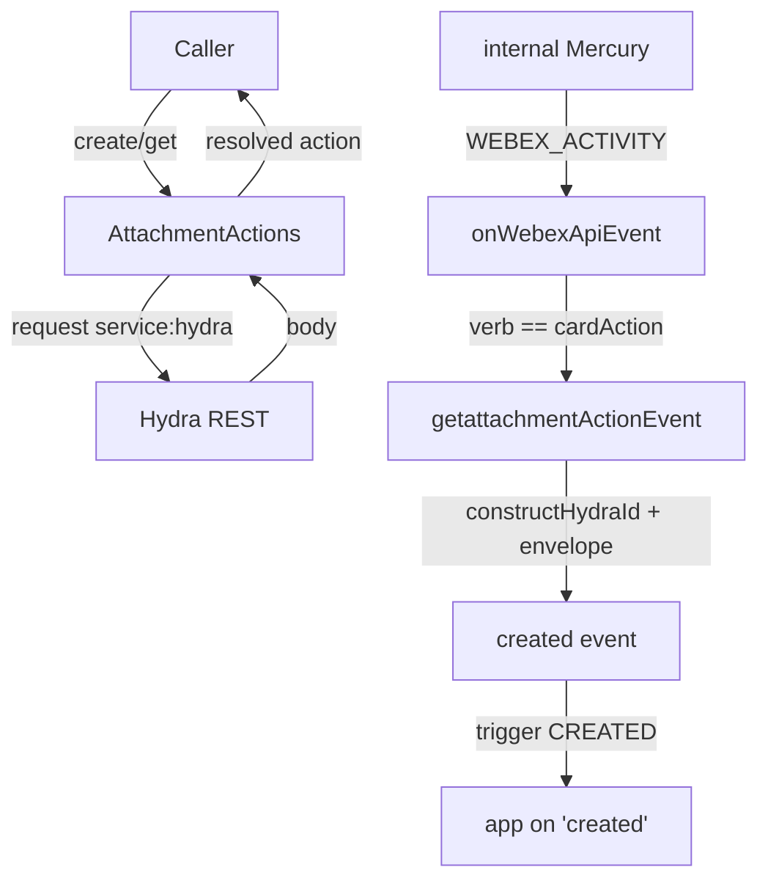
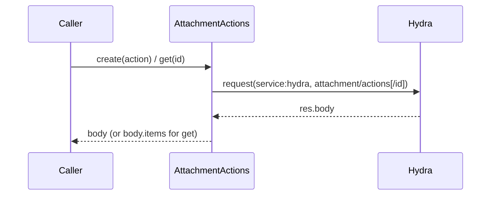
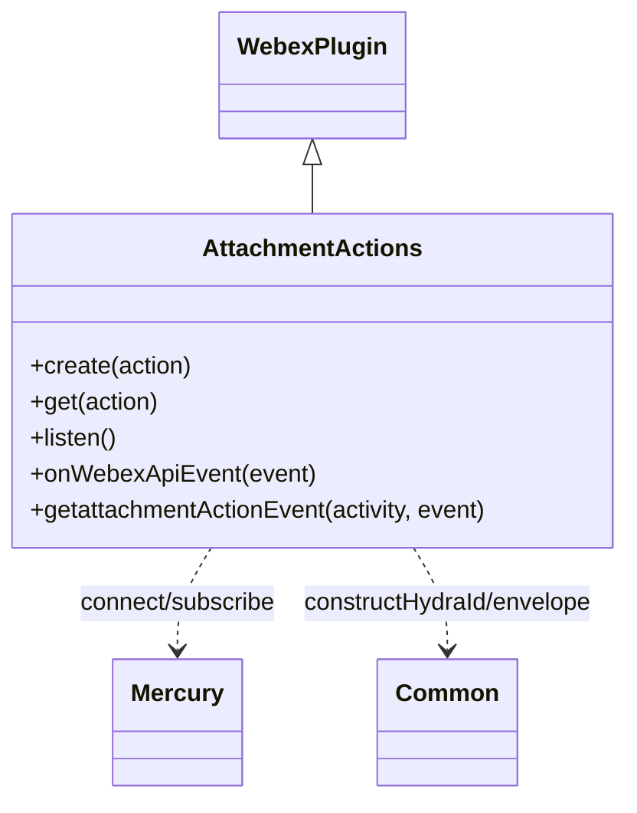

<!-- sdd-generated-metadata
generator: claude-cli
generator_model: us.anthropic.claude-opus-4-8
approved_by: pending-human-review
updated_at: 2026-08-06T00:00:00Z
validation_status: not-run
run_id: 51855eac-8de5-43a2-a3b6-dbcc55ebc91b
-->

# @webex/plugin-attachment-actions — SPEC

> Start here → root [`AGENTS.md`](../../../../AGENTS.md) (agent entry) · router [`SPEC_INDEX.md`](../../../../ai-docs/SPEC_INDEX.md) · system [`ARCHITECTURE.md`](../../../../ai-docs/ARCHITECTURE.md). This is the module's canonical spec: orientation, requirements, design, flows, and tests.
> Context-efficiency: link to canonical docs — don't duplicate them. Load specs on demand per `SPEC_INDEX.md`.

## Metadata

| Field | Value |
|---|---|
| Module id | `plugin-attachment-actions` |
| Source path(s) | `packages/@webex/plugin-attachment-actions/src/` |
| Parent spec | `—` (registered public Webex plugin; composed by `webex-core`, no parent module) |
| Doc kind | Module spec |
| Coverage score | Pending coverage assessment |
| Generated from | `module-spec` @ SDLC template library `0.2.2` |
| generated_by / approved_by / updated_at | claude-cli / pending-human-review / 2026-08-06 |
| Validation status | not-run, validator `pending`, assessed 2026-08-06 |

Coverage score is `Pending coverage assessment` until the first coverage review runs. Manifest coverage
state (`Partial`) is authoritative and kept in `.sdd/manifest.json`.

## Evidence Rules
Every requirement cites concrete source evidence using `file path`. Test evidence is preferred for WHY.
Requirements are grounded in the current implementation under `src/` and its unit tests.

## Source Material Register

| Source material | Scope | Decision | Detail location or disposition |
|---|---|---|---|
| N/A | none | none | No prior AI-docs existed for this package; content is derived directly from `src/` and tests. |

## Overview

`@webex/plugin-attachment-actions` is a public Webex SDK plugin (registered as `attachmentActions`) for
working with Adaptive Card attachment actions — the events produced when a user clicks an
`Action.Submit` button on a card in Webex. It exposes a small REST surface over the Hydra service
(`create`, `get`) plus a real-time `listen()` mode that surfaces `created` events directly from the
internal Mercury socket, as an alternative to configuring webhooks.

The plugin (`src/attachmentActions.js`, a `WebexPlugin`) does two jobs: (1) proxy attachment-action REST
calls to Hydra, and (2) when listening, subscribe to internal Mercury `conversation.activity` events,
filter for the `cardAction` verb, and translate those raw activities into webhook-shaped SDK events using
a pre-built event envelope and Hydra ID construction helpers from `@webex/common`. A maintainer should
start at `src/attachmentActions.js`.

Listening requires `spark:all` and `spark:kms` scopes because it decrypts Mercury activities via the
internal conversation plugin. The plugin imports `@webex/internal-plugin-conversation` and
`@webex/internal-plugin-mercury` for that purpose.

## Purpose / Responsibility

Owns the client-side surface for Adaptive Card attachment actions: creating/fetching actions via Hydra
and translating internal Mercury `cardAction` activities into external `created` events. It does NOT own
card rendering, message creation, webhook delivery, or Mercury/conversation transport (those belong to
the messages plugin, Hydra, and the internal plugins it depends on).

## Stack

JavaScript (Babel), built with `webex-legacy-tools`. Uses the `debug` logger and `lodash` `cloneDeep`.
Tested with `@webex/test-helper-chai`, `@webex/test-helper-mocha`, `@webex/test-helper-mock-webex`, and
`@webex/test-helper-test-users`. Runtime dependencies: `@webex/webex-core`, `@webex/common`,
`@webex/internal-plugin-conversation`, `@webex/internal-plugin-mercury`. Evidence:
`packages/@webex/plugin-attachment-actions/package.json`.

## Folder / Package Structure

```
packages/@webex/plugin-attachment-actions/src/
├── index.js               # imports internal conversation+mercury, registerPlugin('attachmentActions', ...)
└── attachmentActions.js   # AttachmentActions WebexPlugin: create/get/listen + Mercury event translation
```

## Key Files (source of truth)

| File | Holds |
|---|---|
| `packages/@webex/plugin-attachment-actions/src/attachmentActions.js` | `create`, `get`, `listen`, `stopListening` behavior; `onWebexApiEvent` filtering; `getattachmentActionEvent` translation |
| `packages/@webex/plugin-attachment-actions/src/index.js` | Plugin registration name (`attachmentActions`) and required internal-plugin imports |

## Public Surface

Consumed as a public SDK plugin via `webex.attachmentActions`. Calls the Hydra REST service; `listen()`
uses the internal Mercury socket.

| Contract ID | Type | Surface | Purpose | Compatibility / deprecation | Schema / detail link | Root index |
|---|---|---|---|---|---|---|
| `attachmentActions.create` | SDK/HTTP | `create(attachmentAction): Promise<AttachmentActionObject>` | POST `attachment/actions` to Hydra to submit a card action | Stable plugin method | `packages/@webex/plugin-attachment-actions/src/attachmentActions.js` | `../../../../ai-docs/CONTRACTS.md` |
| `attachmentActions.get` | SDK/HTTP | `get(attachmentAction): Promise<AttachmentActionObject>` | GET `attachment/actions/{id}` from Hydra | Stable plugin method | `packages/@webex/plugin-attachment-actions/src/attachmentActions.js` | `../../../../ai-docs/CONTRACTS.md` |
| `attachmentActions.listen` | SDK/event | `listen(): Promise<void>` then `.on('created', cb)` | Subscribe to Mercury and emit `created` events (needs `spark:all`+`spark:kms`) | Stable; alternative to webhooks | `packages/@webex/plugin-attachment-actions/src/attachmentActions.js` | `../../../../ai-docs/CONTRACTS.md` |
| `attachmentActions.stopListening` | SDK/event | `stopListening()` / `off('created')` | Stop receiving Mercury-derived events | Stable (inherited listener control) | `packages/@webex/plugin-attachment-actions/src/attachmentActions.js` | `../../../../ai-docs/CONTRACTS.md` |

Compatibility notes:
- The `AttachmentActionObject` shape (`id`, `messageId`, `type`, `inputs`, `personId`, `roomId`,
  `created`) and the emitted `created` event payload are the consumer contract.
- `listen()` events mirror the webhook JSON but omit webhook-only fields (name, secret, url) and may add
  `inputs` not present in the webhook payload.

## Requires (dependencies)

- `@webex/webex-core` — base `WebexPlugin`, `registerPlugin`, and `this.request` for Hydra calls.
- `@webex/common` — `SDK_EVENT` constants, `createEventEnvelope`, `constructHydraId`,
  `getHydraClusterString`, `hydraTypes` for event translation.
- `@webex/internal-plugin-mercury` — the websocket used by `listen()` (`connect()` and
  `WEBEX_ACTIVITY` events).
- `@webex/internal-plugin-conversation` — imported so Mercury activities are decrypted.
- Peer plugins (`@webex/plugin-logger`, `@webex/plugin-messages`, `@webex/plugin-people`) — expected to
  be present in the composed SDK.

## Requirements

| ID | WHAT | WHY | Source Evidence | Test / Example Evidence | Assumptions / Gaps | Confidence |
|---|---|---|---|---|---|---|
| `ATTACHMENT-ACTIONS-R-001` | `create(attachmentAction)` POSTs to `service: hydra`, `resource: 'attachment/actions'` with the action as body and resolves `res.body`. | Submitting a card action is the primary write path. | `packages/@webex/plugin-attachment-actions/src/attachmentActions.js` | `packages/@webex/plugin-attachment-actions/test/unit/` | none identified | PRESENT |
| `ATTACHMENT-ACTIONS-R-002` | `get(attachmentAction)` accepts an id string or an object with `.id`, GETs `service: hydra`, `resource: attachment/actions/{id}`, and resolves `res.body.items || res.body`. | Callers may pass either the raw id or the returned object. | `packages/@webex/plugin-attachment-actions/src/attachmentActions.js` | `packages/@webex/plugin-attachment-actions/test/unit/` | none identified | PRESENT |
| `ATTACHMENT-ACTIONS-R-003` | `listen()` builds a shared event envelope via `createEventEnvelope`, connects Mercury, and registers a `WEBEX_ACTIVITY` handler that calls `onWebexApiEvent`. | Real-time card-action delivery without webhooks. | `packages/@webex/plugin-attachment-actions/src/attachmentActions.js` | `packages/@webex/plugin-attachment-actions/test/unit/` | Requires `spark:all` + `spark:kms` scopes | PRESENT |
| `ATTACHMENT-ACTIONS-R-004` | `onWebexApiEvent` only reacts to activities whose `verb` is `CARD_ACTION`; for those it builds a `created` event via `getattachmentActionEvent` and triggers `CREATED`. | Only card-action activities are relevant; other verbs are ignored. | `packages/@webex/plugin-attachment-actions/src/attachmentActions.js` | `packages/@webex/plugin-attachment-actions/test/unit/` | none identified | PRESENT |
| `ATTACHMENT-ACTIONS-R-005` | `getattachmentActionEvent` clones the envelope and constructs Hydra IDs (people/room/message/attachment-action) using the activity's cluster; it copies `inputs` when present and sets `type` from `object.objectType`. | The emitted event must match Hydra's webhook data shape with correct cluster-scoped IDs. | `packages/@webex/plugin-attachment-actions/src/attachmentActions.js` | `packages/@webex/plugin-attachment-actions/test/unit/` | Deliberately omits `personEmail` (not in Hydra webhook) | PRESENT |
| `ATTACHMENT-ACTIONS-R-006` | On any error during event construction, `getattachmentActionEvent` logs via `webex.logger.error` and returns `null` so no malformed event is emitted. | A single bad activity must not throw out of the Mercury handler. | `packages/@webex/plugin-attachment-actions/src/attachmentActions.js` | `packages/@webex/plugin-attachment-actions/test/unit/` | none identified | PRESENT |

## Design Overview

`AttachmentActions` extends `WebexPlugin`. The REST methods (`create`, `get`) are thin wrappers over
`this.request` targeting the Hydra service; `get` normalizes its input (id string or object) and its
output (`items` array or raw body).

The listen path is event-driven. `listen()` first builds a reusable event envelope
(`createEventEnvelope`) that carries the SDK event scaffolding, stores it on `this.eventEnvelope`, then
connects Mercury and subscribes to internal `WEBEX_ACTIVITY` events. Each activity flows into
`onWebexApiEvent`, which switches on `activity.verb` and only handles `CARD_ACTION`. For those, it clones
the stored envelope and fills in Hydra-scoped IDs — actor, room, message, and attachment-action —
computed with `getHydraClusterString` + `constructHydraId`, plus `inputs` and `type`. Construction is
wrapped in try/catch so a malformed activity is logged and dropped (returns `null`) rather than throwing
into the socket handler.

## Data Flow



## Sequence Diagram(s)

Two distinct operation groups exist: synchronous REST (create/get) and the asynchronous Mercury listen
path. They differ in actors, transport, and failure behavior, so each has its own diagram; the listen
diagram covers the verb-filter and error-drop branches.

Sequence coverage:

| Operation group | Diagram | Failure / recovery coverage |
|---|---|---|
| REST create/get | 1. Hydra REST | Hydra HTTP errors propagate to caller |
| Mercury listen → created event | 2. Listen + translate | `alt` covers non-cardAction verbs and the try/catch → null drop |

### 1. Hydra REST



### 2. Listen + translate

```mermaid
sequenceDiagram
    participant App as App
    participant A as AttachmentActions
    participant M as internal Mercury
    App->>A: listen()
    A->>A: createEventEnvelope -> eventEnvelope
    A->>M: connect() + subscribe WEBEX_ACTIVITY
    M-->>A: activity event
    A->>A: onWebexApiEvent(event)
    alt verb == CARD_ACTION
        A->>A: getattachmentActionEvent(activity, CREATED)
        alt construction ok
            A->>App: trigger 'created' (SDK event)
        else error
            A->>A: logger.error; return null (drop)
        end
    else other verb
        A-->>M: ignore
    end
```

## Class / Component Relationships



`AttachmentActions` extends `WebexPlugin`, uses internal Mercury for the event stream, and `@webex/common`
helpers for Hydra ID construction and the event envelope.

## Use Cases

- **UC-1 Submit a card action:** app calls `create({type:'submit', messageId, inputs})` → POST to Hydra
  → resolved `AttachmentActionObject`. Evidence: `packages/@webex/plugin-attachment-actions/src/attachmentActions.js`.
- **UC-2 Fetch an action:** app calls `get(id)` → GET from Hydra → action object. Evidence:
  `packages/@webex/plugin-attachment-actions/src/attachmentActions.js`.
- **UC-3 Listen for card actions:** app calls `listen()` then `.on('created', cb)` → Mercury
  `cardAction` activities become `created` events; `stopListening()`/`off('created')` to cleanup.
  Evidence: `packages/@webex/plugin-attachment-actions/src/attachmentActions.js`.

## Concurrency & Reactive Flow

`listen()` is event-driven: after `createEventEnvelope` resolves and Mercury connects, the plugin reacts
to each `WEBEX_ACTIVITY` asynchronously. Handlers are effectively stateless aside from the cached
`eventEnvelope`, which is cloned per event so concurrent activities do not share mutable state. Event
translation is wrapped in try/catch so one failing activity neither throws into the socket loop nor stops
subsequent events. Evidence: `packages/@webex/plugin-attachment-actions/src/attachmentActions.js`.

## Error Handling & Failure Modes

| Condition | Signal (error/code/result) | Caller recovery |
|---|---|---|
| Hydra request failure (create/get) | Rejected Promise from `this.request` | Retry or surface error to user |
| Malformed Mercury activity during translation | `logger.error` + `getattachmentActionEvent` returns `null` (event dropped) | None required; event is skipped |
| Missing `spark:all`/`spark:kms` scopes | Decryption/connection failure during `listen()` | Re-authorize with required scopes |

## Pitfalls

- `listen()` requires both `spark:all` and `spark:kms` scopes; enabling/disabling `spark:all` in the app
  config also toggles `spark:kms`. Evidence: `packages/@webex/plugin-attachment-actions/src/attachmentActions.js`.
- `get` may return either `res.body.items` or `res.body`; callers must handle both shapes. Evidence:
  `packages/@webex/plugin-attachment-actions/src/attachmentActions.js`.
- The emitted event intentionally omits `personEmail` because Hydra's webhook payload does not include
  it; do not assume it is present. Evidence: `packages/@webex/plugin-attachment-actions/src/attachmentActions.js`.
- Only the `cardAction` verb is handled; other Mercury activity verbs are silently ignored. Evidence:
  `packages/@webex/plugin-attachment-actions/src/attachmentActions.js`.

## Test-Case Strategy (module)

Unit tests (mock-webex + sinon) should mock `this.request` and the internal Mercury/conversation
plugins to assert: `create` posts the action to Hydra and resolves the body (positive) ; `get` handles
id-string vs object input and `items`-vs-body output; `onWebexApiEvent` triggers `created` only for
`cardAction` verbs and ignores others (negative); and `getattachmentActionEvent` constructs correct
Hydra IDs and returns `null` on error.

| Behavior / Requirement | Existing test evidence | Gap |
|---|---|---|
| `ATTACHMENT-ACTIONS-R-001` | `packages/@webex/plugin-attachment-actions/test/unit/` | Assert Hydra service/resource + body |
| `ATTACHMENT-ACTIONS-R-002` | `packages/@webex/plugin-attachment-actions/test/unit/` | Add id-vs-object and items-vs-body cases |
| `ATTACHMENT-ACTIONS-R-003` | `packages/@webex/plugin-attachment-actions/test/unit/` | Assert envelope build + Mercury subscribe |
| `ATTACHMENT-ACTIONS-R-004` | `packages/@webex/plugin-attachment-actions/test/unit/` | Add non-cardAction verb negative case |
| `ATTACHMENT-ACTIONS-R-005` | `packages/@webex/plugin-attachment-actions/test/unit/` | Assert Hydra ID construction + inputs copy |
| `ATTACHMENT-ACTIONS-R-006` | `packages/@webex/plugin-attachment-actions/test/unit/` | Add error → null drop case |

## Traceability

- Repo architecture: [`ARCHITECTURE.md`](../../../../ai-docs/ARCHITECTURE.md) · Registry: [`SPEC_INDEX.md`](../../../../ai-docs/SPEC_INDEX.md)
- Coverage state & contracts baseline: `.sdd/manifest.json`
