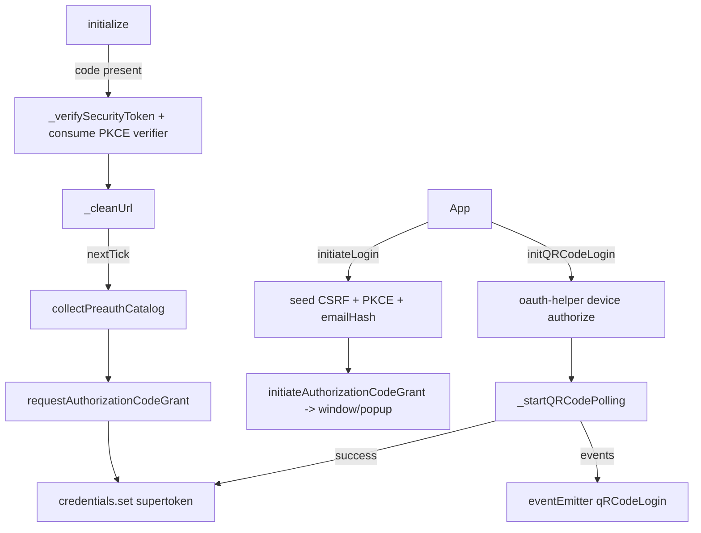
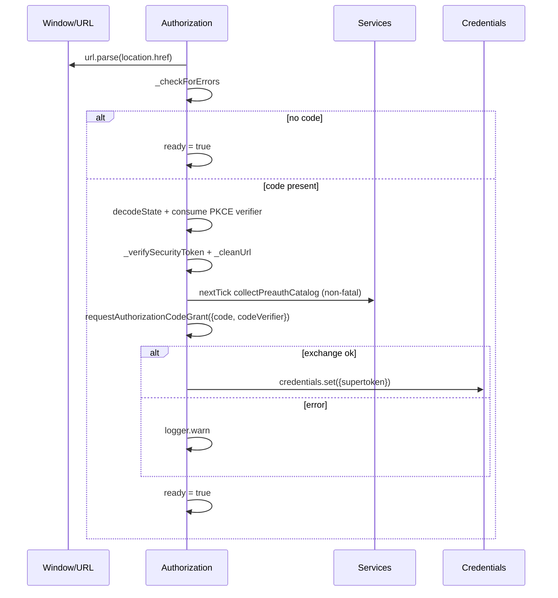
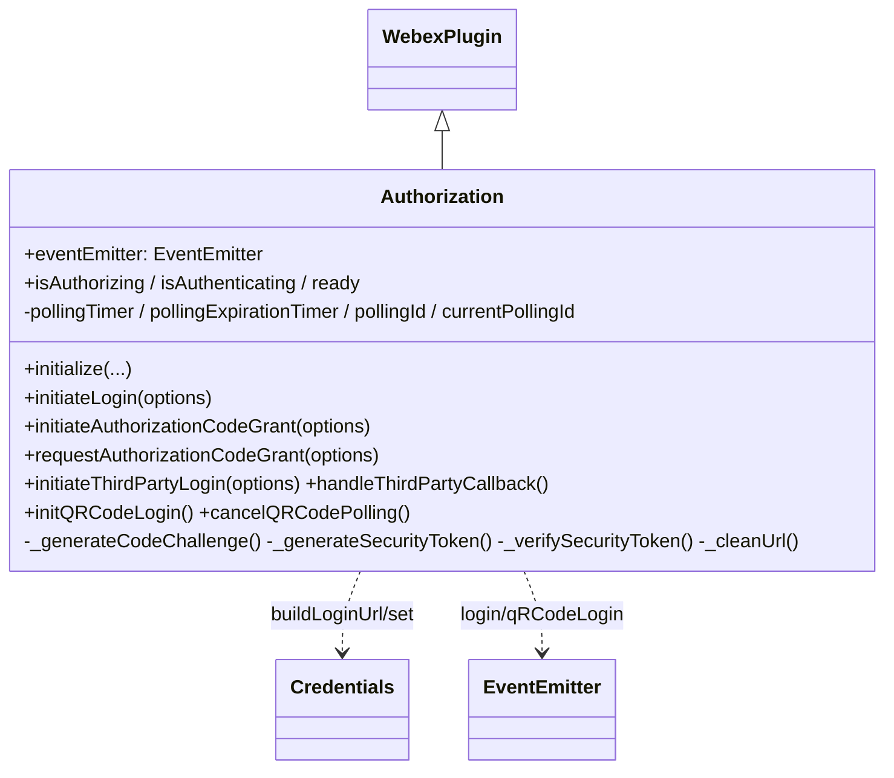
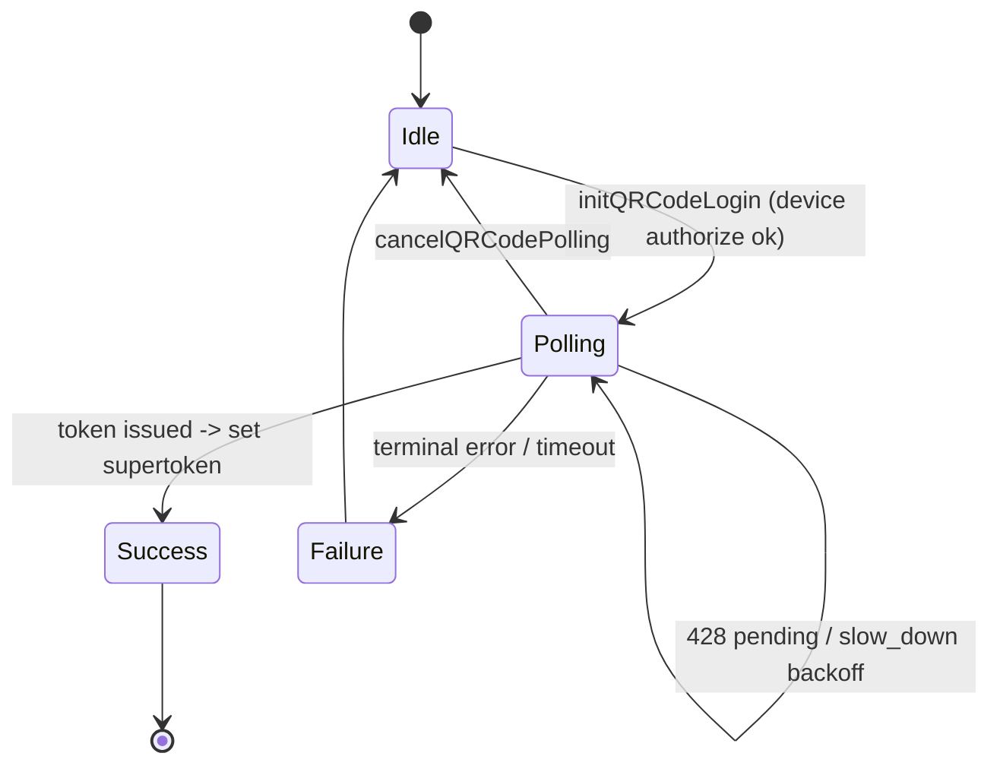

<!-- sdd-generated-metadata
generator: claude-cli
generator_model: us.anthropic.claude-opus-4-8
approved_by: pending-human-review
updated_at: 2026-08-06T00:00:00Z
validation_status: not-run
run_id: 51855eac-8de5-43a2-a3b6-dbcc55ebc91b
-->

# @webex/plugin-authorization-browser-first-party — SPEC

> Start here → root [`AGENTS.md`](../../../../AGENTS.md) (agent entry) · router [`SPEC_INDEX.md`](../../../../ai-docs/SPEC_INDEX.md) · system [`ARCHITECTURE.md`](../../../../ai-docs/ARCHITECTURE.md). This is the module's canonical spec: orientation, requirements, design, flows, state, and tests.
> Context-efficiency: link to canonical docs — don't duplicate them. Load specs on demand per `SPEC_INDEX.md`.

## Metadata

| Field | Value |
|---|---|
| Module id | `plugin-authorization-browser-first-party` |
| Source path(s) | `packages/@webex/plugin-authorization-browser-first-party/src/` |
| Parent spec | `—` (registered `authorization` plugin for the Webex Web Client; composed by `webex-core`, no parent module) |
| Doc kind | Module spec |
| Coverage score | Pending coverage assessment |
| Generated from | `module-spec` @ SDLC template library `0.2.2` |
| generated_by / approved_by / updated_at | claude-cli / pending-human-review / 2026-08-06 |
| Validation status | not-run, validator `pending`, assessed 2026-08-06 |

Coverage score is `Pending coverage assessment` until the first coverage review runs. Manifest coverage
state (`Partial`) is authoritative and kept in `.sdd/manifest.json`.

## Evidence Rules
Every requirement cites concrete source evidence using `file path`. Test evidence is preferred for WHY.
Requirements are grounded in the current implementation under `src/` and its unit tests.

## Source Material Register

| Source material | Scope | Decision | Detail location or disposition |
|---|---|---|---|
| N/A | none | none | No prior AI-docs existed for this package; content is derived directly from `src/` and tests. |

## Overview

`@webex/plugin-authorization-browser-first-party` is the browser OAuth2 plugin used specifically by the
Webex Web Client (first party). Registered as the `authorization` plugin (namespace `Credentials`), it
implements the Authorization Code + PKCE flow, third-party (social provider) login, and Device
Authorization (QR code) login with polling. Use by anything other than the Webex Web Client is explicitly
discouraged in-code.

The plugin (`src/authorization.js`, a `WebexPlugin`) auto-completes the code flow during `Webex.init()`:
on construction it inspects `window.location` for a `code`, validates CSRF (`state.csrf_token`), consumes
a single-use PKCE `code_verifier` from `sessionStorage`, optionally derives a preauth catalog hint
(emailhash or orgId parsed from the code), cleans the URL, and exchanges the code for a supertoken. It
also exposes an `eventEmitter` that emits `login` and `qRCodeLogin` events for UI. A maintainer should
start at `src/authorization.js`.

Security is a first-class concern here: CSRF token generation/verification, PKCE (S256) verifier/challenge
generation and single-use consumption, and URL scrubbing of `code`/`id_token`/`email`/CSRF after redirect.

## Purpose / Responsibility

Owns first-party browser OAuth2: Authorization Code + PKCE login, third-party login initiation/callback,
Device Authorization (QR) login with polling, CSRF + PKCE security, and post-redirect URL cleanup. It does
NOT own token storage (`webex-core` `Credentials`), the implicit-grant flow (that is the non-first-party
browser package), or Node flows.

## Stack

JavaScript (Babel; file uses `@ts-nocheck` for legacy decorators), built with `webex-legacy-tools`. Uses
`crypto-js` (SHA256, base64url) for PKCE/email hashing, Node `url`/`querystring` shims, the `events`
`EventEmitter`, `@webex/common` (`encodeState`/`decodeState`/`oneFlight`/`whileInFlight`), `lodash`, and
`uuid`. Tested with `@webex/test-helper-chai`, `@webex/test-helper-mocha`,
`@webex/test-helper-mock-webex`, `@webex/test-helper-automation`, and `sinon`. Runtime dependencies:
`@webex/webex-core`, `@webex/common`, `@webex/storage-adapter-local-storage`, `crypto-js`, `lodash`,
`uuid`. Evidence: `packages/@webex/plugin-authorization-browser-first-party/package.json`.

## Folder / Package Structure

```
packages/@webex/plugin-authorization-browser-first-party/src/
├── index.js           # registerPlugin('authorization', ...) with proxies; exports default + Events
├── authorization.js   # Authorization WebexPlugin: code+PKCE, third-party, QR/device flow, CSRF/PKCE, cleanup
└── config.js          # default plugin config
```

## Key Files (source of truth)

| File | Holds |
|---|---|
| `packages/@webex/plugin-authorization-browser-first-party/src/authorization.js` | All flows, PKCE/CSRF helpers, QR polling state machine, URL cleanup, `Events` |
| `packages/@webex/plugin-authorization-browser-first-party/src/index.js` | Registration name (`authorization`), proxied properties, `Events` re-export |

## Public Surface

Consumed as the `authorization` plugin (`webex.authorization`) in the Webex Web Client. Navigates the
window, calls the OAuth token endpoint, and uses the `oauth-helper` service for device authorization.

| Contract ID | Type | Surface | Purpose | Compatibility / deprecation | Schema / detail link | Root index |
|---|---|---|---|---|---|---|
| `authorization.initiateLogin` | SDK | `initiateLogin(options): Promise` | Start Authorization Code + PKCE login (adds emailHash, CSRF, PKCE) | Stable (first-party) | `packages/@webex/plugin-authorization-browser-first-party/src/authorization.js` | `../../../../ai-docs/CONTRACTS.md` |
| `authorization.initiateAuthorizationCodeGrant` | SDK | `initiateAuthorizationCodeGrant(options): Promise` | Build `response_type=code` URL; navigate or popup | Stable; `@whileInFlight` | `packages/@webex/plugin-authorization-browser-first-party/src/authorization.js` | `../../../../ai-docs/CONTRACTS.md` |
| `authorization.requestAuthorizationCodeGrant` | SDK/HTTP | `requestAuthorizationCodeGrant({code, codeVerifier?}): Promise` | Exchange code (+PKCE verifier) for supertoken | Stable; `@oneFlight`+`@whileInFlight` | `packages/@webex/plugin-authorization-browser-first-party/src/authorization.js` | `../../../../ai-docs/CONTRACTS.md` |
| `authorization.initiateThirdPartyLogin` | SDK | `initiateThirdPartyLogin({oauth2provider, returnURL, state?}): Promise` | Start social-provider login with CSRF | Stable | `packages/@webex/plugin-authorization-browser-first-party/src/authorization.js` | `../../../../ai-docs/CONTRACTS.md` |
| `authorization.handleThirdPartyCallback` | SDK | `handleThirdPartyCallback(): {idToken, email, error, state}` | Parse + validate third-party callback (single-use idToken) | Stable | `packages/@webex/plugin-authorization-browser-first-party/src/authorization.js` | `../../../../ai-docs/CONTRACTS.md` |
| `authorization.initQRCodeLogin` | SDK/event | `initQRCodeLogin()` (emits `qRCodeLogin`) | Begin device-authorization (QR) flow + polling | Stable | `packages/@webex/plugin-authorization-browser-first-party/src/authorization.js` | `../../../../ai-docs/CONTRACTS.md` |
| `authorization.cancelQRCodePolling` | SDK | `cancelQRCodePolling(withCancelEvent?)` | Stop device-authorization polling | Stable | `packages/@webex/plugin-authorization-browser-first-party/src/authorization.js` | `../../../../ai-docs/CONTRACTS.md` |
| `authorization.logout` | SDK | `logout({noRedirect?}): void` | Navigate to logout URL unless suppressed | Stable | `packages/@webex/plugin-authorization-browser-first-party/src/authorization.js` | `../../../../ai-docs/CONTRACTS.md` |
| `authorization.Events` | SDK/event | `Events = {login, qRCodeLogin}` + `eventEmitter` | Named events for login + QR progress | Stable event names | `packages/@webex/plugin-authorization-browser-first-party/src/index.js` | `../../../../ai-docs/CONTRACTS.md` |

Compatibility notes:
- Method names/signatures, the `Events` names (`login`, `qRCodeLogin`) and their `eventType` payloads,
  and the single-use semantics of PKCE verifier and third-party `idToken` are the consumer contract.
- CSRF (`oauth2-csrf-token`) and PKCE (`oauth2-code-verifier`) sessionStorage keys are part of the flow.

## Requires (dependencies)

- `@webex/webex-core` — base `WebexPlugin`, `registerPlugin`, `webex.request`, `webex.credentials`
  (`buildLoginUrl`/`buildThirdPartyLoginUrl`/`buildLogoutUrl`/`set`), `grantErrors`, `webex.getWindow()`,
  `webex.internal.services` (`collectPreauthCatalog`, `oauth-helper`).
- `@webex/common` — `encodeState`, `decodeState`, `oneFlight`, `whileInFlight`.
- `crypto-js` — SHA256 + base64url for PKCE code challenge and email hashing.
- `@webex/storage-adapter-local-storage`, `lodash`, `uuid`, Node `events` `EventEmitter`.
- OAuth token endpoint (`config.tokenUrl`) and the `oauth-helper` service (device authorize/token).

## Requirements

| ID | WHAT | WHY | Source Evidence | Test / Example Evidence | Assumptions / Gaps | Confidence |
|---|---|---|---|---|---|---|
| `AUTHORIZATION-FP-R-001` | On `initialize`, the plugin checks the URL for errors and a `code`; with no code it sets `ready = true`. With a code it decodes `state`, consumes the single-use PKCE `code_verifier` from sessionStorage, verifies CSRF, cleans the URL, derives a preauth hint (emailhash or orgId from the code), and on `nextTick` collects the preauth catalog then exchanges the code, setting `ready = true` regardless of outcome. | First-party redirect completion must finish the PKCE code flow automatically at startup. | `packages/@webex/plugin-authorization-browser-first-party/src/authorization.js` | `packages/@webex/plugin-authorization-browser-first-party/test/unit/spec/authorization.js` | Preauth catalog failure is non-fatal | PRESENT |
| `AUTHORIZATION-FP-R-002` | `initiateLogin(options)` emits a `login` event, optionally computes `emailHash = SHA256(email)` (deleting raw `email`), seeds `state.csrf_token` and `state.emailhash`, generates a PKCE `code_challenge` (S256) with `code_challenge_method`, and delegates to `initiateAuthorizationCodeGrant`. | First-party login must add CSRF + PKCE and avoid leaking the raw email. | `packages/@webex/plugin-authorization-browser-first-party/src/authorization.js` | `packages/@webex/plugin-authorization-browser-first-party/test/unit/spec/authorization.js` | none identified | PRESENT |
| `AUTHORIZATION-FP-R-003` | `initiateAuthorizationCodeGrant` builds a `response_type=code` login URL, emits a `redirectToLoginUrl` event, and either opens a popup (default 600x800, overridable) or replaces `window.location`. | Navigation must support both popup and in-tab redirect. | `packages/@webex/plugin-authorization-browser-first-party/src/authorization.js` | `packages/@webex/plugin-authorization-browser-first-party/test/unit/spec/authorization.js` | none identified | PRESENT |
| `AUTHORIZATION-FP-R-004` | `requestAuthorizationCodeGrant({code, codeVerifier?})` rejects when `code` is missing, POSTs the token form (adding `code_verifier` when present) with basic auth and `self_contained_token:true`, sets the supertoken, and maps 400 responses via `grantErrors.select`. | The code+PKCE exchange is the core token-acquisition step. | `packages/@webex/plugin-authorization-browser-first-party/src/authorization.js` | `packages/@webex/plugin-authorization-browser-first-party/test/unit/spec/authorization.js` | `@oneFlight`+`@whileInFlight` | PRESENT |
| `AUTHORIZATION-FP-R-005` | Third-party login: `initiateThirdPartyLogin` validates `state` is an object, seeds `state.csrf_token`, and navigates via `buildThirdPartyLoginUrl`; `handleThirdPartyCallback` decodes state, verifies CSRF with `requireMatch:true`, cleans the URL, and returns `{idToken, email, error, state}` (csrf removed, idToken single-use). | Social-provider login needs CSRF-protected initiation and a single-use callback parse. | `packages/@webex/plugin-authorization-browser-first-party/src/authorization.js` | `packages/@webex/plugin-authorization-browser-first-party/test/unit/spec/authorization.js` | none identified | PRESENT |
| `AUTHORIZATION-FP-R-006` | `initQRCodeLogin` prevents concurrent attempts, POSTs `oauth-helper /actions/device/authorize`, emits `getUserCodeSuccess` with user code + (rewritten) verification URIs, and starts polling; failures emit `getUserCodeFailure`. | Device (QR) login must obtain and surface a user code, then poll. | `packages/@webex/plugin-authorization-browser-first-party/src/authorization.js` | `packages/@webex/plugin-authorization-browser-first-party/test/unit/spec/authorization.js` | `_generateQRCodeVerificationUrl` rewrites to web.webex.com/deviceAuth | PRESENT |
| `AUTHORIZATION-FP-R-007` | `_startQRCodePolling` requires a `device_code`, sets an overall expiration timer (`expires_in`, default 300s), and polls `oauth-helper /actions/device/token`: `slow_down` doubles the interval once, 428 emits `authorizationPending` and continues, success sets the supertoken + emits `authorizationSuccess` + stops, other errors emit `authorizationFailure` + stop. Late responses are ignored via a polling id. | Device authorization requires robust polling with backoff, pending, timeout, and cancellation. | `packages/@webex/plugin-authorization-browser-first-party/src/authorization.js` | `packages/@webex/plugin-authorization-browser-first-party/test/unit/spec/authorization.js` | none identified | PRESENT |
| `AUTHORIZATION-FP-R-008` | PKCE/CSRF helpers: `_generateCodeChallenge` builds a 128-char base64url verifier, stores it in sessionStorage, and returns its S256 challenge; `_generateSecurityToken`/`_verifySecurityToken` create/verify a uuid CSRF token (removing it on read; `requireMatch` throws when absent); `_cleanUrl` strips `code`/`id_token`/`email`/CSRF and re-encodes state. | Security invariants (PKCE single-use, CSRF binding, URL scrubbing) must hold. | `packages/@webex/plugin-authorization-browser-first-party/src/authorization.js` | `packages/@webex/plugin-authorization-browser-first-party/test/unit/spec/authorization.js` | none identified | PRESENT |

## Design Overview

`Authorization` extends `WebexPlugin` (namespace `Credentials`) with session flags `isAuthorizing`
(+ derived `isAuthenticating`, both proxied) and `ready`, plus polling state fields (`pollingTimer`,
`pollingExpirationTimer`, `pollingId`, `currentPollingId`) and a public `eventEmitter`. `initialize`
auto-completes the Authorization Code + PKCE flow: detect `code`, decode `state`, consume the single-use
PKCE verifier, verify CSRF, scrub the URL, derive a preauth hint, and (deferred to `nextTick`) collect the
preauth catalog and exchange the code, always ending with `ready = true`.

Login initiation seeds CSRF + PKCE and emits `login` events; `initiateAuthorizationCodeGrant` performs the
navigation (popup or in-tab). The token exchange (`requestAuthorizationCodeGrant`) is guarded by
`@oneFlight` + `@whileInFlight`, includes the PKCE `code_verifier`, and maps 400s to typed grant errors.
Third-party login mirrors this with `buildThirdPartyLoginUrl` and a strict (`requireMatch`) CSRF check on
the callback. The device-authorization (QR) flow is a small polling state machine: `initQRCodeLogin`
obtains device/user codes and starts `_startQRCodePolling`, which handles `slow_down` backoff, `428`
pending, success, terminal failure, an overall timeout, and cancellation via monotonic polling ids so late
responses are ignored.

## Data Flow



## Sequence Diagram(s)

The module has three distinct operation groups with different actors, transports, and state outcomes:
startup PKCE completion, user-initiated login navigation, and the device-authorization polling loop. Each
gets its own diagram; the startup and QR diagrams include their failure/pending/timeout branches.

Sequence coverage:

| Operation group | Diagram | Failure / recovery coverage |
|---|---|---|
| PKCE code completion at startup | 1. Startup PKCE exchange | `alt` covers no-code short-circuit, CSRF verify, non-fatal preauth failure, exchange error |
| Device authorization (QR) polling | 2. QR polling | `alt` covers slow_down backoff, 428 pending, success, terminal error, timeout/cancel |

### 1. Startup PKCE exchange



### 2. QR polling

```mermaid
sequenceDiagram
    participant App as App
    participant P as Authorization
    participant O as oauth-helper
    participant C as Credentials
    App->>P: initQRCodeLogin()
    P->>O: POST device/authorize
    O-->>P: {user_code, verification_uri(_complete)}
    P->>App: emit getUserCodeSuccess
    loop until success/timeout/cancel
        P->>O: POST device/token (device_code)
        alt success
            O-->>P: token body
            P->>C: credentials.set({supertoken})
            P->>App: emit authorizationSuccess; stop
        else 400 slow_down
            P->>P: interval *= 2 (once); reschedule
        else 428 pending
            P->>App: emit authorizationPending; reschedule
        else terminal error
            P->>App: emit authorizationFailure; stop
        end
    end
    Note over P: expiration timer -> authorizationFailure (timeout)
```

## Class / Component Relationships



`Authorization` extends `WebexPlugin`, drives the browser window and `webex.credentials`, and emits
`login`/`qRCodeLogin` events through its `eventEmitter`.

## Use Cases

- **UC-1 First-party PKCE login:** `initiateLogin({email?})` → redirect with CSRF+PKCE → on return
  `initialize` verifies CSRF, consumes the verifier, and exchanges the code. Evidence:
  `packages/@webex/plugin-authorization-browser-first-party/src/authorization.js`.
- **UC-2 Third-party (social) login:** `initiateThirdPartyLogin({oauth2provider, returnURL})` →
  provider redirect → `handleThirdPartyCallback()` returns `{idToken, ...}` (single-use). Evidence:
  `packages/@webex/plugin-authorization-browser-first-party/src/authorization.js`.
- **UC-3 QR / device login:** `initQRCodeLogin()` → app shows the QR from `getUserCodeSuccess` → polling
  emits pending/success/failure; `cancelQRCodePolling()` to abort. Evidence:
  `packages/@webex/plugin-authorization-browser-first-party/src/authorization.js`.

## State Model

Session booleans: `isAuthorizing` (default `false`, toggled by `@whileInFlight`; aliased by
`isAuthenticating`, both proxied) and `ready` (set true once startup completion finishes). Device-flow
state: `pollingTimer`/`pollingExpirationTimer` (timer handles), and `pollingId`/`currentPollingId`
(monotonic ids used to invalidate late poll responses on cancel/reset). Transient security state lives in
sessionStorage: `oauth2-csrf-token` and single-use `oauth2-code-verifier`. Tokens are stored on
`webex.credentials`. Evidence: `packages/@webex/plugin-authorization-browser-first-party/src/authorization.js`.

## State Machine



## Concurrency & Reactive Flow

The device-authorization loop is asynchronous and self-scheduling: `_startQRCodePolling` reschedules via
`setTimeout` and uses a monotonically increasing `pollingId`/`currentPollingId` pair so a response arriving
after cancel/reset is ignored (`if (this.currentPollingId !== this.pollingId) return`). An overall
`pollingExpirationTimer` bounds the attempt. Concurrent QR attempts are rejected up front. The token
exchange is guarded by `@oneFlight` + `@whileInFlight`. Startup token exchange is deferred to
`process.nextTick`. Login/QR progress is surfaced reactively via the `eventEmitter`. Evidence:
`packages/@webex/plugin-authorization-browser-first-party/src/authorization.js`.

## Error Handling & Failure Modes

| Condition | Signal (error/code/result) | Caller recovery |
|---|---|---|
| Redirect query contains `error` | `_checkForErrors` throws `grantErrors.select(error)` | Handle the typed OAuth error |
| Missing `code` in exchange | `Promise.reject(Error('`options.code` is required'))` | Ensure a code is present |
| 400 from token exchange | Rejected with `grantErrors.select(body.error)` | Handle the specific grant error |
| CSRF missing/mismatch | `_verifySecurityToken` throws (always for `requireMatch`) | Restart login |
| QR: concurrent attempt | `getUserCodeFailure` / `authorizationFailure` ('already a polling request') | Wait or cancel first |
| QR: `slow_down` (400) | interval doubled once, continue | Automatic |
| QR: `428` pending | `authorizationPending` event, continue | Keep displaying QR |
| QR: timeout | `authorizationFailure` ('Authorization timed out') after `expires_in` | Restart QR login |
| Preauth catalog failure at startup | Swallowed (`.catch(() => resolve())`) | Non-fatal; exchange proceeds |

## Pitfalls

- The PKCE `code_verifier` and the third-party `idToken` are single-use — read once and removed; do not
  expect them on a second call. Evidence: `packages/@webex/plugin-authorization-browser-first-party/src/authorization.js`.
- The `initialize` constructor performs the automatic code exchange as a side effect; `ready` turning true
  is the completion signal (success or failure). Evidence:
  `packages/@webex/plugin-authorization-browser-first-party/src/authorization.js`.
- QR polling ignores late responses via `pollingId`; always route cancellation through
  `cancelQRCodePolling` so timers and ids are reset. Evidence:
  `packages/@webex/plugin-authorization-browser-first-party/src/authorization.js`.
- `slow_down` only doubles the interval once per occurrence; do not assume exponential backoff. Evidence:
  `packages/@webex/plugin-authorization-browser-first-party/src/authorization.js`.
- This plugin is intended only for the Webex Web Client; other consumers should use the standard browser
  authorization package. Evidence: `packages/@webex/plugin-authorization-browser-first-party/src/authorization.js`.

## Test-Case Strategy (module)

Unit tests (mock-webex + sinon, with `crypto-js` and lodash stubs) should assert: startup exchanges a code
with the consumed PKCE verifier and verified CSRF (positive) and short-circuits with no code (negative);
`initiateLogin` seeds CSRF/PKCE/emailHash and deletes raw email; `requestAuthorizationCodeGrant` includes
`code_verifier`, sets the supertoken, and maps 400s; third-party callback enforces `requireMatch` CSRF and
returns a single-use idToken; and the QR polling loop covers `slow_down`, `428`, success, terminal error,
timeout, and cancellation (including late-response invalidation via polling id).

| Behavior / Requirement | Existing test evidence | Gap |
|---|---|---|
| `AUTHORIZATION-FP-R-001` | `packages/@webex/plugin-authorization-browser-first-party/test/unit/spec/authorization.js` | Add no-code + preauth-failure branches |
| `AUTHORIZATION-FP-R-002` | `packages/@webex/plugin-authorization-browser-first-party/test/unit/spec/authorization.js` | Assert emailHash + raw email deletion |
| `AUTHORIZATION-FP-R-003` | `packages/@webex/plugin-authorization-browser-first-party/test/unit/spec/authorization.js` | Add popup vs in-tab cases |
| `AUTHORIZATION-FP-R-004` | `packages/@webex/plugin-authorization-browser-first-party/test/unit/spec/authorization.js` | Assert code_verifier inclusion + 400 mapping |
| `AUTHORIZATION-FP-R-005` | `packages/@webex/plugin-authorization-browser-first-party/test/unit/spec/authorization.js` | Add requireMatch CSRF + single-use idToken cases |
| `AUTHORIZATION-FP-R-006` | `packages/@webex/plugin-authorization-browser-first-party/test/unit/spec/authorization.js` | Assert user-code emit + URL rewrite |
| `AUTHORIZATION-FP-R-007` | `packages/@webex/plugin-authorization-browser-first-party/test/unit/spec/authorization.js` | Add slow_down/428/success/timeout/cancel cases |
| `AUTHORIZATION-FP-R-008` | `packages/@webex/plugin-authorization-browser-first-party/test/unit/spec/authorization.js` | Assert verifier length/storage + URL scrubbing |

## Traceability

- Repo architecture: [`ARCHITECTURE.md`](../../../../ai-docs/ARCHITECTURE.md) · Registry: [`SPEC_INDEX.md`](../../../../ai-docs/SPEC_INDEX.md)
- Aggregator: `packages/@webex/plugin-authorization/ai-docs/plugin-authorization-spec.md` ·
  Standard browser variant: `packages/@webex/plugin-authorization-browser/ai-docs/plugin-authorization-browser-spec.md`
- Coverage state & contracts baseline: `.sdd/manifest.json`
